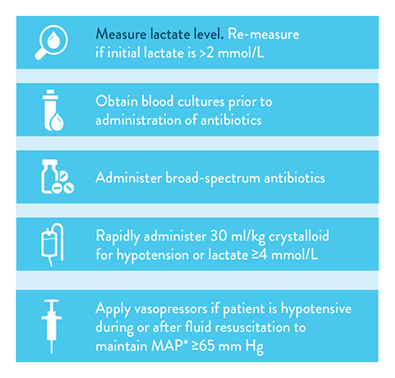

# SEPSE E CHOQUE SÉPTICO PEDIÁTRICO

Para entender sepse em pediatria, você precisa esquecer aquela ideia antiga de que "criança é um adulto pequeno". Na verdade, a fisiologia cardiovascular da criança é um mundo à parte. Se você tentar tratar um choque séptico pediátrico com a mesma cabeça que trata um idoso com pneumonia, você vai errar a conduta e, pior, vai errar a questão de prova.

Historicamente, usávamos os critérios de SIRS (Síndrome da Resposta Inflamatória Sistêmica), mas isso mudou drasticamente. Recentemente, a força-tarefa internacional publicou o **Phoenix Sepsis Score (2024)**, que é o que as bancas de residência e títulos de especialista (SBP/AMIB) estão começando a cobrar. Vamos construir esse raciocínio do zero.

## O Novo Conceito: Phoenix Sepsis Score

A definição atual de sepse pediátrica é: **disfunção orgânica ameaçadora à vida causada por uma resposta desregulada do hospedeiro a uma infecção**.

Por que mudamos? Porque a SIRS era muito sensível, mas pouco específica. Qualquer criança com febre e choro tinha taquicardia e taquipneia, preenchendo critérios de SIRS sem estar, necessariamente, em sepse. O foco agora é a **disfunção orgânica**.

Segundo a nova diretriz, identificamos a sepse em crianças com suspeita de infecção que apresentam um **Phoenix Sepsis Score ≥ 2 pontos**. Esse escore avalia quatro sistemas principais: cardiovascular, respiratório, neurológico e de coagulação.

### Tabela 1: Phoenix Sepsis Score (Resumo para Decoreba de Prova)

| Sistema | Parâmetros Avaliados | Pontuação (0 a 3) |
| --- | --- | --- |
| **Cardiovascular** | Uso de drogas vasoativas, Lactato, Pressão Arterial Média (PAM) | Pontua se precisar de droga ou se lactato ≥ 5 mmol/L |
| **Respiratório** | Relação PaO2/FiO2 ou SpO2/FiO2 | Pontua se houver hipoxemia ou necessidade de suporte invasivo/não invasivo |
| **Neurológico** | Escala de Coma de Glasgow (ECG) e reatividade pupilar | Pontua se ECG ≤ 10 ou pupilas não reativas |
| **Coagulação** | Plaquetas, INR, D-Dímero, Fibrinogênio | Pontua se plaquetas < 100.000 ou alteração de coagulograma |

**Atenção do Dr. Will:** Se a questão trouxer uma criança com infecção e o escore for ≥ 2, o diagnóstico é Sepse. Se, dentro desses pontos, houver pelo menos 1 ponto no critério **cardiovascular**, o diagnóstico evolui para **Choque Séptico**. Guarde isso: no Phoenix, o choque séptico é um subgrupo da sepse com disfunção cardiovascular grave.

## Fisiopatologia: Por que a Criança Choca Diferente?

Aqui está o segredo que muitos alunos ignoram. O débito cardíaco (DC) é o produto da Frequência Cardíaca (FC) pelo Volume Sistólico (VS).

No adulto, se o volume cai, o coração consegue aumentar a força de contração (inotropismo) e o volume sistólico. Na criança, especialmente no lactente, o miocárdio é imaturo, tem menos reserva contrátil e menos cálcio disponível no retículo sarcoplasmático.

**Consequência prática:** A criança é extremamente dependente da **Frequência Cardíaca** para manter o débito. É por isso que a **taquicardia é o sinal mais precoce e importante do choque pediátrico**.

Outro ponto crucial: a criança tem uma capacidade de vasoconstrição periférica fenomenal. Ela consegue manter a pressão arterial normal mesmo perdendo até 25 a 30% do volume circulante. Por isso, nas provas da MedEvo, sempre reforçamos: **Hipotensão em pediatria é um sinal TARDIO e de pré-parada**. Se você esperar a pressão cair para diagnosticar choque, você chegou tarde demais.

### Choque Frio vs. Choque Quente

Diferente do adulto, que geralmente apresenta o choque "quente" (vasodilatado), a criança frequentemente apresenta o **choque frio** (hipodinâmico).

- **Choque Frio:** Baixo débito cardíaco e alta resistência vascular sistêmica (RVS). A criança está pálida, com extremidades frias, tempo de enchimento capilar (TEC) > 2 segundos e pulsos finos. É o padrão mais comum na sepse pediátrica comunitária.

- **Choque Quente:** Alto débito cardíaco e baixa RVS. A criança está ruborizada, com extremidades quentes, TEC < 1 segundo (flash) e pulsos amplos (em martelo d'água). Mais comum em adolescentes ou casos de sepse por gram-negativos muito graves.

## Quadro Clínico e Reconhecimento Precoce

A banca vai te dar um caso clínico de uma criança com febre e algum foco infeccioso (pneumonia, meningite, infecção urinária). Você deve procurar ativamente por sinais de hipoperfusão tecidual:

- **Alteração do nível de consciência:** Irritabilidade (sinal precoce) ou letargia (sinal tardio).

- **Taquicardia:** Desproporcional à febre.

- **Alteração de perfusão periférica:** TEC prolongado, pele moteada ou fria.

- **Oligúria:** Diurese < 1 mL/kg/h (um excelente marcador de perfusão orgânica).

- **Taquipneia:** Muitas vezes é uma tentativa de compensar uma acidose metabólica (respiração de Kussmaul).

**Erro clássico de prova:** Achar que toda criança com choque séptico precisa ter febre. Lembre-se de que recém-nascidos e lactentes jovens podem cursar com **hipotermia** na sepse.

## Diagnóstico Diferencial: As Pegadinhas das Bancas

Nem tudo que parece choque séptico é sepse. As bancas adoram colocar três grandes diferenciais:

### 1. Cetoacidose Diabética (CAD)

A criança chega com dor abdominal, vômitos, desidratação grave e taquipneia (Kussmaul). Parece sepse abdominal, certo? Mas se a questão mencionar poliúria (mesmo desidratada ela urina muito) e polidipsia, pense em CAD. O ânion gap estará aumentado devido aos cetoácidos, não apenas ao lactato.

### 2. Choque Cardiogênico (Miocardite)

Imagine um lactente com taquicardia, má perfusão e... **hepatomegalia**. Se você der 60 mL/kg de soro para essa criança, você vai matá-la de edema agudo de pulmão. Na miocardite, o coração não aguenta volume. Procure por sinais de congestão: ritmo de galope (B3), estertores crepitantes e fígado aumentado.

### 3. Síndrome Inflamatória Multissistêmica Pediátrica (SIM-P ou MIS-C)

Pós-pandemia, isso virou febre nas provas. É uma condição que ocorre semanas após a infecção pelo SARS-CoV-2. A criança tem febre prolongada (> 3 dias), sintomas gastrointestinais exuberantes (dor abdominal que simula apendicite) e disfunção miocárdica grave. O tratamento envolve imunoglobulina e corticoides, além do suporte de choque.

## Manejo Inicial: A "Hora de Ouro"

O tratamento deve ser agressivo e rápido. O objetivo é restaurar a perfusão tecidual nos primeiros 60 minutos.

### Acesso Vascular e Coleta de Exames

Se você não conseguir um acesso venoso periférico em duas tentativas ou 90 segundos, a diretriz é clara: **Acesso Intraósseo (IO)**. Não perca tempo.
Nesse momento, colete: hemoculturas (antes do ATB, se possível), lactato, gasometria, hemograma, eletrólitos e função renal.

### Ressuscitação Volêmica

Aqui houve uma mudança importante nas últimas diretrizes (Surviving Sepsis Campaign International 2020).

- **Onde tem UTI disponível:** Iniciamos com bolus de **10 a 20 mL/kg** de cristaloide isotônico (SF 0,9% ou Ringer Lactato).

- **Onde NÃO tem UTI disponível:** Devemos ser mais cautelosos com o volume se não houver hipotensão, para evitar sobrecarga hídrica e edema pulmonar.

**Pérola de Prova:** O uso de cristaloides balanceados (como Ringer Lactato ou Plasma-Lyte) tem sido preferido em relação ao Soro Fisiológico 0,9% para evitar a **acidose metabólica hiperclorêmica**, que pode piorar a perfusão renal.

### Terapia Antimicrobiana

O antibiótico deve ser administrado na **primeira hora**. Cada hora de atraso aumenta a mortalidade.

- A escolha é empírica baseada no foco e na idade.

- Se houver suspeita de MRSA (lesões de pele, pneumonia grave): adicione Vancomicina.

- Se for paciente oncológico neutropênico: use Cefepime ou Piperacilina/Tazobactam para cobrir *Pseudomonas*.

## Drogas Vasoativas: Qual escolher?

Se você fez 40-60 mL/kg de volume e a criança continua chocada (choque refratário a fluidos), é hora de iniciar drogas vasoativas. **Não espere mais volume se houver sinais de sobrecarga (hepatomegalia).**

Diferente do adulto, onde a Noradrenalina é quase sempre a primeira escolha, na pediatria dividimos pela clínica:

- **Choque Frio (Baixo DC / Alta RVS):** A droga de escolha é a **Adrenalina** (0,05 a 0,3 mcg/kg/min). Ela aumenta a frequência e a força de contração.

- **Choque Quente (Alto DC / Baixa RVS):** A droga de escolha é a **Noradrenalina** (0,05 a 1 mcg/kg/min). Ela causa vasoconstrição para subir a PAM.

- **Dopamina:** Tem caído em desuso nas diretrizes mais recentes devido ao maior risco de arritmias e supressão endócrina, mas algumas bancas ainda a citam como opção inicial se Adrenalina não estiver disponível.

### Tabela 2: Manejo Farmacológico das Drogas Vasoativas

| Droga | Indicação Principal | Mecanismo de Ação | Dose Inicial |
| --- | --- | --- | --- |
| **Adrenalina** | Choque Frio (maioria das crianças) | Beta-1 (inotropismo) e Alfa-1 | 0,05 - 0,1 mcg/kg/min |
| **Noradrenalina** | Choque Quente (vasodilatado) | Potente Alfa-1 (vasoconstrição) | 0,05 - 0,1 mcg/kg/min |
| **Milrinona** | Disfunção miocárdica com RVS alta | Inibidor da Fosfodiesterase III | 0,25 - 0,75 mcg/kg/min |
| **Dopamina** | Choque refratário (segunda linha) | Alfa e Beta adrenérgico | 5 - 10 mcg/kg/min |

**Cuidado:** A Milrinona é um "inodilatador". Ela aumenta a força do coração e dilata os vasos. É excelente para aquele choque frio que não melhora, mas **CUIDADO**, ela pode causar hipotensão. Só use se a pressão arterial estiver estável.

## Suporte Avançado e Metas Terapêuticas

Como saber se o seu tratamento está funcionando? Você precisa de metas claras. Não basta a criança estar "viva", ela precisa estar "perfundida".

### Metas de Ressuscitação (Primeiras Horas):

- TEC < 2 segundos.

- Pulsos normais (sem diferença entre centrais e periféricos).

- Extremidades quentes.

- Débito urinário > 1 mL/kg/h.

- Nível de consciência normal.

- **Lactato:** Redução dos níveis iniciais. Lembre-se da pérola: hiperlactinemia persistente após 12h é preditor de pior desfecho.

- **Saturação Venosa Central (SvcO2):** Idealmente > 70%. Se estiver baixa, significa que os tecidos estão extraindo oxigênio demais porque o débito cardíaco está baixo.

### Corticosteroides na Sepse

Não usamos corticoide para todo mundo. A indicação clássica é o **choque séptico refratário a catecolaminas** (quando você já está usando doses altas de Adrena ou Nora) e suspeita de insuficiência adrenal relativa. A droga de escolha é a **Hidrocortisona**.

### Ventilação Mecânica

Muitas crianças com choque séptico precisarão de Intubação Orotraqueal (IOT). Por quê? Porque o esforço respiratório para compensar a acidose consome até 40% do débito cardíaco. Ao ventilar a criança, você "poupa" o coração.
**Dica de Ouro:** Na IOT de uma criança chocada, evite o Midazolam, pois ele causa depressão miocárdica e vasodilatação. Prefira a **Etomidato** ou **Ketamina** (com cautela), que mantêm melhor a estabilidade hemodinâmica.

## Situações Especiais e Complicações

### O Recém-Nascido (Choque Neonatal)

No RN, o choque séptico é frequentemente acompanhado de **Hipertensão Pulmonar Persistente**. Além disso, o canal arterial pode estar envolvido. O manejo inicial segue a expansão volêmica (10 mL/kg com mais cautela) e o uso de aminas. A Noradrenalina tem ganhado espaço como droga inicial no choque neonatal em algumas diretrizes.

### Distúrbios Metabólicos

A hipocalcemia é muito comum na sepse e causa disfunção miocárdica direta. Sempre cheque o **Cálcio Iônico**. Se estiver baixo, a adrenalina não vai funcionar direito. Reponha Gluconato de Cálcio.
A glicemia também deve ser monitorada. O alvo é manter < 180 mg/dL, evitando tanto a hiperglicemia (que é pró-inflamatória) quanto a hipoglicemia (que é neurotóxica).

### Cuidados Paliativos e Humanização

Em UTIs pediátricas modernas, o cuidado é centrado na família. A presença dos pais deve ser estimulada 24h. Quando a reversibilidade do quadro é inexistente (doenças terminais avançadas), a elegibilidade para cuidados paliativos deve ser discutida precocemente, focando no conforto e na dignidade, evitando a distanásia.

## Tabela 3: Diagnóstico Diferencial de Choque na Infância

| Tipo de Choque | Achados Clínicos Sugestivos | Conduta Inicial |
| --- | --- | --- |
| **Séptico** | Febre/Hipotermia, foco infeccioso, alteração de perfusão. | Fluidos + ATB + Vasoativos. |
| **Hipovolêmico** | História de vômitos, diarreia, sangramento, TEC lento. | Reposição volêmica agressiva (Cristaloides). |
| **Cardiogênico** | Hepatomegalia, B3, estertores, desconforto respiratório. | Inotrópicos, restrição hídrica. |
| **Anafilático** | Estridor, sibilância, rash cutâneo, angioedema. | Adrenalina IM (vasta lateral). |

## Pontos-Chave para Prova

- **Definição Phoenix:** Sepse = Infecção + Phoenix Score ≥ 2. Choque Séptico = Sepse + 1 ponto no critério cardiovascular.

- **Sinal Precoce:** Taquicardia. **Sinal Tardio:** Hipotensão. Nunca espere a hipotensão para agir.

- **Volume Inicial:** 10 a 20 mL/kg de cristaloide isotônico (preferencialmente balanceado).

- **Acesso:** Se falhar venoso, vá direto para Intraósseo (IO).

- **Antibiótico:** Deve ser feito na primeira hora ("Golden Hour").

- **Choque Frio:** Adrenalina é a primeira escolha.

- **Choque Quente:** Noradrenalina é a primeira escolha.

- **CAD como diferencial:** Kussmaul, dor abdominal, poliúria e hálito cetônico. Peça glicemia e gasometria.

- **SIM-P (MIS-C):** Febre prolongada + sintomas GI + disfunção cardíaca + antecedente de COVID-19.

- **Cálculo de Cânula (sem cuff):** (Idade / 4) + 4.

- **Lâmina de Laringoscopia:** Em lactentes, usa-se a lâmina reta (Miller) para elevar a epiglote diretamente.

- **Metas:** TEC < 2s, diurese > 1 mL/kg/h, melhora do nível de consciência e clareamento do lactato.

- **O que NÃO fazer:** Não use soluções hipotônicas (soro glicosado isolado) para expansão volêmica. Não use corticoides de rotina (apenas no choque refratário).

- **Insuficiência Adrenal:** Suspeitar em choque refratário a catecolaminas ou crianças que usam corticoide crônico.

- **Nutrição:** Iniciar apenas após a estabilização hemodinâmica para evitar isquemia mesentérica.

Este guia cobre os pontos mais incidentes nas provas de residência do Brasil, integrando a nova diretriz Phoenix com a prática clínica que as bancas adoram cobrar. Lembre-se: no choque pediátrico, o tempo é tecido. Agir rápido e com a droga certa salva vidas e garante a sua vaga. 🩺

 Cópia offline para consulta pessoal.
 Fonte original:
 [https://www.medevo.com.br/material-apoio/ler/720ef4af-053e-4bcf-add7-1b25f7b8edac](https://www.medevo.com.br/material-apoio/ler/720ef4af-053e-4bcf-add7-1b25f7b8edac)
