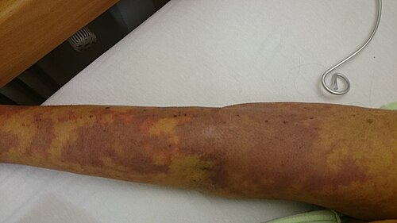
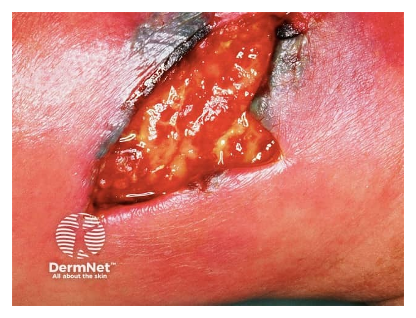

# SEPSE E CHOQUE SÉPTICO: RECONHECIMENTO, BUNDLES E METAS DE RESSUSCITAÇÃO

Sepse não é apenas “infecção grave”. Pela definição Sepsis-3, sepse é disfunção orgânica potencialmente fatal causada por resposta desregulada do hospedeiro à infecção. O eixo central é a disfunção orgânica: sem disfunção, há infecção; com disfunção atribuível à infecção, há sepse.

Choque séptico representa o subgrupo com anormalidades circulatórias, celulares e metabólicas associadas a maior mortalidade. O reconhecimento precoce deve acionar tratamento simultâneo: coleta de culturas quando possível, antibiótico no tempo adequado, ressuscitação hemodinâmica, vasopressor se necessário e controle de foco.

## Fisiopatologia: resposta desregulada e hipoperfusão

As metas de tratamento derivam da fisiopatologia da hipoperfusão. Na sepse, mediadores inflamatórios como TNF-alfa e IL-6 ativam endotélio, coagulação, vasodilatação e disfunção microcirculatória. Três alterações explicam o choque séptico:

- Vasodilatação arterial sistêmica: O óxido nítrico é liberado em excesso, fazendo com que a resistência vascular periférica desabe. É por isso que o choque séptico é, primariamente, um choque distributivo.

- Aumento da permeabilidade capilar: O endotélio "fura". O líquido que deveria estar dentro do vaso vai para o terceiro espaço. Isso gera uma hipovolemia relativa.

- Depressão miocárdica: Embora o débito cardíaco costume estar alto inicialmente (fase hiperdinâmica), as citocinas inflamam o miocárdio, reduzindo a complacência e a contratilidade.

Essa fisiopatologia explica o tratamento: cristaloide para hipovolemia relativa/absoluta, vasopressor para vasodilatação persistente e inotrópico quando há disfunção miocárdica com hipoperfusão apesar de volume e pressão arterial adequados.

## Definições Atuais e Critérios Diagnósticos

Esqueça os critérios de SIRS (febre, taquicardia, taquipneia, leucocitose) para o diagnóstico de sepse. Segundo o consenso Sepsis-3, a SIRS é muito sensível, mas pouco específica, muitos pacientes com gripe ou pancreatite têm SIRS, mas não têm sepse.

### O Escore SOFA (Sequential Organ Failure Assessment)

O diagnóstico de sepse é feito pela presença de infecção suspeita ou confirmada associada a aumento de 2 ou mais pontos no SOFA em relação ao basal. O SOFA avalia seis sistemas orgânicos:

| Sistema | Parâmetro Avaliado |
| --- | --- |
| Respiratório | Relação PaO2/FiO2 |
| Hematológico | Contagem de Plaquetas |
| Hepático | Bilirrubina Total |
| Cardiovascular | Pressão Arterial Média (PAM) ou uso de vasopressores |
| Neurológico | Escala de Coma de Glasgow |
| Renal | Creatinina ou Débito Urinário |

Cuidado: A banca pode colocar a contagem de leucócitos ou a febre como parte do SOFA. Isso é equívoco frequente. O SOFA avalia disfunção, não inflamação.

### O Papel do qSOFA (Quick SOFA)

O qSOFA foi criado para ser uma ferramenta de beira de leito, rápida, sem necessidade de exames laboratoriais. Ele utiliza três critérios:

- Frequência Respiratória ≥ 22 irpm.

- Alteração do nível de consciência (Glasgow < 15).

- Pressão Arterial Sistólica ≤ 100 mmHg.

Ponto de atenção: qSOFA positivo (≥ 2 critérios) não fecha diagnóstico de sepse. Ele identifica maior risco de mau desfecho à beira-leito e deve levar à investigação de disfunção orgânica com avaliação clínica, exames e SOFA completo quando aplicável.

### Definição de Choque Séptico

O choque séptico é um subgrupo da sepse onde as alterações circulatórias e celulares são profundas o suficiente para aumentar a mortalidade. Os critérios são:

- Necessidade de vasopressor para manter PAM ≥ 65 mmHg.

- Lactato > 2 mmol/L (ou 18 mg/dL) APÓS ressuscitação volêmica adequada.

Se o paciente tem hipotensão que melhora com volume, ele teve sepse com hipotensão, mas não choque séptico. O choque exige a refratariedade ao volume.

## Bundle Inicial: 1 Hora e Reavaliação em Até 3 Horas

As recomendações atuais da Surviving Sepsis Campaign reforçam que sepse e choque séptico são emergências médicas: tratamento e ressuscitação devem começar imediatamente. A janela de 1 hora se aplica de forma mais forte a choque séptico ou sepse provável/definida; quando há apenas possível sepse sem choque, deve-se investigar rapidamente e iniciar antibiótico em até 3 horas se a suspeita persistir.

O bundle não é uma sequência linear rígida; é um conjunto de ações que devem ocorrer em paralelo.

- Medir lactato: marcador de hipoperfusão tecidual. Se estiver elevado, acompanhar de forma seriada para guiar ressuscitação e clareamento.

- Obter culturas: coletar antes do antibiótico sempre que possível, desde que isso não atrase a terapia em paciente grave.

- Administrar antibiótico de amplo espectro: cobrir patógenos prováveis conforme foco, gravidade, epidemiologia local e risco de resistência.

- Administrar cristaloide: em hipoperfusão induzida por sepse ou choque séptico, administrar pelo menos 30 mL/kg nas primeiras 3 horas, com reavaliação frequente.

- Iniciar vasopressor: se a hipotensão persistir durante ou após a ressuscitação volêmica, usar noradrenalina para meta de PAM, inclusive por acesso periférico proximal temporário quando não se deve atrasar a terapia.

Ponto operacional: não é necessário terminar todo o volume para iniciar noradrenalina quando há hipotensão importante. Vasopressor precoce evita hipoperfusão prolongada enquanto a ressuscitação volêmica e a obtenção de acesso central são conduzidas.

Reconhecimento de sepse/choque séptico
 ↓
1ª hora — ações imediatas
• Lactato
• Culturas, se não atrasarem antibiótico
• Antibiótico imediato se choque séptico ou sepse provável/definida
• Cristaloide se hipotensão ou hipoperfusão
• Noradrenalina se PAM baixa durante/após volume
 ↓
Até 3 horas — consolidação
• Completar pelo menos 30 mL/kg se choque séptico ou hipoperfusão induzida por sepse
• Reavaliar perfusão: lactato seriado, TEC, pele, diurese, estado mental e medidas dinâmicas
• Em possível sepse sem choque: investigação rápida; antibiótico em até 3h se suspeita persistir
• Definir controle de foco e necessidade de UTI

## Ressuscitação Volêmica e Metas Hemodinâmicas

A dose de 30 mL/kg é recomendação inicial para hipoperfusão induzida por sepse ou choque séptico, mas não dispensa reavaliação. Após o volume inicial, novas infusões devem ser individualizadas por perfusão clínica, lactato, diurese e medidas dinâmicas de fluido-responsividade.

### Parâmetros Estáticos vs. Dinâmicos

A diferença entre parâmetros estáticos e dinâmicos é decisiva. Parâmetros estáticos, como pressão venosa central, não predizem bem resposta a volume. PVC baixa não garante resposta volêmica.

Parâmetros dinâmicos são preferíveis quando disponíveis:

- Elevação passiva das pernas (Passive Leg Raise): Se o débito cardíaco aumentar após elevar as pernas do paciente a 45 graus, ele é fluido-responsivo.

- Variação da Pressão de Pulso (VPP): Necessita de ventilação mecânica controlada e ritmo sinusal.

- Ultrassonografia à beira de leito (POCUS): Avaliação da variação do diâmetro da Veia Cava Inferior (VCI) ou do VTI (Velocity Time Integral) da via de saída do ventrículo esquerdo.

### Metas de Ressuscitação

Metas práticas de ressuscitação:

- PAM ≥ 65 mmHg.

- Débito urinário ≥ 0,5 ml/kg/h.

- Redução (clareamento) do lactato sérico.

- Melhora do tempo de enchimento capilar (objetivo < 3 segundos). O estudo ANDROMEDA-SHOCK mostrou que guiar a ressuscitação pelo tempo de enchimento capilar é tão bom ou até superior ao lactato em alguns cenários.

## Terapia Farmacológica: Vasopressores e Inotrópicos

Quando o volume não é suficiente, entramos com as drogas vasoativas.

- Noradrenalina: É a primeira escolha absoluta. Ela tem efeito alfa-1 potente (vasoconstrição) e um efeito beta-1 moderado (aumento da frequência e contratilidade).

- Vasopressina: É a segunda droga a ser adicionada. Se a dose de noradrenalina estiver subindo (geralmente acima de 0,25 a 0,5 mcg/kg/min), adicionamos vasopressina para ajudar a atingir a meta de PAM e poupar dose de noradrenalina.

- Dobutamina: Indicada se houver evidência de disfunção miocárdica (baixo débito cardíaco) ou sinais de hipoperfusão persistente apesar de PAM adequada e volume otimizado.

Cuidado com a Adrenalina: Ela é considerada uma droga de resgate, mas não é a primeira escolha na sepse devido ao risco de taquiarritmias e aumento do lactato por estímulo metabólico (o que pode confundir a monitorização).

| Droga | Indicação Principal | Mecanismo |
| --- | --- | --- |
| Noradrenalina | 1ª linha no choque séptico | Alfa-1 >> Beta-1 |
| Vasopressina | Adjuvante para poupar Noradrenalina | Receptores V1 |
| Dobutamina | Disfunção miocárdica / Baixo débito | Beta-1 |
| Hidrocortisona | Choque refratário a vasopressores | Reposição/Anti-inflamatório |

## Controle do Foco Infeccioso: "Ubi pus, ibi evacua"

Antibiótico e vasopressor não substituem controle de foco. Abscesso não drenado, obstrução infectada, cateter infectado ou necrose não controlada mantêm resposta inflamatória e falência orgânica. O controle do foco deve ser realizado precocemente, idealmente nas primeiras horas quando houver foco acessível e seguro.

Exemplos clássicos:

- Urosepse por cálculo obstrutivo: A prioridade, após estabilização inicial, é a descompressão da via urinária (cateter duplo J ou nefrostomia percutânea). Antibiótico sozinho não resolve pielonefrite obstrutiva.

- Colecistite aguda alitiásica em paciente crítico: Comum em pacientes de UTI, o tratamento muitas vezes requer colecistostomia percutânea se o paciente estiver muito instável para cirurgia.

- Infecção de partes moles (Fascite Necrotizante): Requer debridamento cirúrgico urgente.

## Antibioticoterapia: escolha inicial e descalonamento

A escolha do antibiótico deve ser empírica e de amplo espectro, mas direcionada pela história clínica.

- Foco Pulmonar (Pneumonia): Ceftriaxona + Claritromicina (ou Azitromicina) para cobrir germes comuns e atípicos. Se houver risco de Pseudomonas (DPOC grave, uso prévio de ATB), usar Piperacilina/Tazobactam ou Cefepime.

- Foco Urinário: Geralmente gram-negativos (E. coli). Ceftriaxona ou Ciprofloxacino. Se choque, considerar Carbapenêmico se houver risco de ESBL.

- Foco abdominal: cobrir gram-negativos e anaeróbios. Exemplos: ceftriaxona + metronidazol ou piperacilina/tazobactam, conforme gravidade, epidemiologia local e risco de resistência.

Lembre-se da dose de ataque: Em pacientes sépticos, o volume de distribuição está aumentado. Doses baixas de antibióticos (como 1g de Vancomicina para um paciente de 100kg) são erros comuns que levam à falha terapêutica.

## Corticosteroides na Sepse

O uso de corticoides (Hidrocortisona 200mg/dia) é indicado apenas no choque séptico refratário, ou seja, aquele paciente que necessita de doses moderadas a altas de vasopressores (geralmente Noradrenalina > 0,25 mcg/kg/min) por pelo menos 4 horas para manter a PAM.

Não se faz mais o teste de estimulação com ACTH para decidir o uso. Se o choque é refratário, inicia-se a hidrocortisona. O objetivo aqui é reduzir a duração do choque e a necessidade de vasopressores, embora o impacto na mortalidade ainda seja discutido em alguns estudos.

## Situações Especiais e Diagnósticos Diferenciais

### O Idoso com Sepse

O idoso muitas vezes não faz febre. O sinal cardinal de sepse no idoso pode ser apenas o rebaixamento do nível de consciência ou uma queda da própria altura. No exame físico, procure por sinais de desidratação e focos ocultos (escaras, infecção urinária).

### Síndrome de Ogilvie

Em pacientes críticos com sepse, é comum ocorrer a pseudo-obstrução colônica aguda (Síndrome de Ogilvie). O paciente apresenta uma distensão abdominal enorme, mas sem obstrução mecânica no RX ou Tomografia. O tratamento inicial é conservador (descompressão, correção de eletrólitos), mas pode exigir neostigmina ou colonoscopia descompressiva.

## Diagnóstico Diferencial de Choque

Nem toda hipotensão com febre é sepse.

- TEP Grave: Pode cursar com choque obstrutivo, taquicardia e hipóxia. O USG mostrará disfunção de ventrículo direito.

- Infarto do Miocárdio com Choque Cardiogênico: O paciente pode ter febre baixa por inflamação sistêmica. O ECG e a troponina são fundamentais.

- Insuficiência Adrenal Aguda: Frequentemente mimetiza o choque séptico, com hipotensão refratária e distúrbios eletrolíticos (hiponatremia e hipercalemia).

## Monitorização e Complicações

A sepse é a principal causa de Insuficiência Renal Aguda (IRA) no ambiente hospitalar. A fisiopatologia da IRA séptica envolve não apenas a hipoperfusão, mas também inflamação glomerular e microtrombose. O tratamento é o manejo da sepse e, se necessário, terapia de substituição renal precoce se houver indicações clássicas (hipercalemia refratária, acidose grave, sobrecarga volêmica).

Outra complicação temida é a Coagulopatia Intravascular Disseminada (CIVD). A inflamação ativa a cascata de coagulação ao mesmo tempo em que consome fatores de coagulação e plaquetas. O resultado é um paciente que tem trombose na microcirculação (gerando disfunção de órgãos) e sangramento clínico.

### Ventilação Mecânica na Sepse

Se o paciente evoluir com SDRA (Síndrome do Desconforto Respiratório Agudo) secundária à sepse, a estratégia deve ser de ventilação protetora:

- Volume corrente baixo (6 ml/kg de peso predito).

- Pressão de platô < 30 cmH2O.

- Driving Pressure < 15 cmH2O.

## Resumo do Manejo: O Fluxograma Mental

Imagine um paciente de 70 anos que chega ao pronto-socorro com tosse, febre e confusão mental.

- Reconhecimento: qSOFA deu 2 (Glasgow 14, FR 24). Opa, risco alto.

- Diagnóstico: Coleta exames. Creatinina subiu de 0,8 para 1,8. Relação P/F está 250. SOFA ≥ 2 confirmado. Diagnóstico: Sepse de foco pulmonar.

- Ação (Bundle 1h): Coleta lactato (veio 5,0) e hemoculturas. Inicia Ceftriaxona + Azitromicina.

- Ressuscitação: O paciente pesa 70kg. Prescreve 2.100 ml de Ringer Lactato (30 ml/kg) para correr rápido.

- Reavaliação: Após 1 litro, a PAM continua 55 mmHg. Inicia Noradrenalina em acesso periférico enquanto providencia o central.

- Metas: O objetivo agora é ver o lactato cair, a urina aparecer no cateter vesical e a PAM estabilizar em 65 mmHg.

## Síntese Clínica

- Sepse (Sepsis-3) = Infecção + SOFA ≥ 2.

- Choque Séptico = Sepse + Vasopressor para PAM ≥ 65 + Lactato > 2 mmol/L após volume.

- qSOFA (FR ≥ 22, Glasgow < 15, PAS ≤ 100) serve para triagem, não para diagnóstico definitivo.

- Bundle de 1 Hora: Lactato, Culturas, ATB, 30 ml/kg de Cristaloide (se hipotenso ou lactato ≥ 4), Vasopressor (se PAM < 65).

- Noradrenalina é o vasopressor de primeira escolha. Vasopressina é a segunda droga.

- Dobutamina é usada se houver disfunção miocárdica ou baixo débito cardíaco persistente.

- Metas Hemodinâmicas: PAM ≥ 65 mmHg, Débito Urinário ≥ 0,5 ml/kg/h, Clareamento de Lactato.

- Parâmetros dinâmicos (VPP, Elevação passiva das pernas) são superiores aos estáticos (PVC) para avaliar fluido-responsividade.

- Controle do foco: Essencial e deve ser feito precocemente (ex: drenar abscessos, desobstruir via urinária).

- Corticoide (Hidrocortisona): Apenas no choque séptico refratário a vasopressores.

- Antibiótico na 1ª hora: Cada hora de atraso aumenta a mortalidade. Deve ser de amplo espectro e em dose de ataque.

- Soro Fisiológico 0,9% vs. Cristaloides Balanceados: A tendência atual (estudos SMART e SALT-ED) é preferir cristaloides balanceados (Ringer Lactato ou Plasma-Lyte) para evitar acidose hiperclorêmica e lesão renal.

- Leucocitose é critério de SIRS, não critério isolado de sepse. Sepse exige infecção associada a disfunção orgânica.

- qSOFA não substitui SOFA; funciona como alerta de gravidade à beira-leito e deve acionar avaliação mais completa.

- Contraindicação Absoluta: Não há contraindicação absoluta para iniciar antibiótico na sepse. Mesmo em alérgicos, deve-se buscar uma alternativa segura imediatamente. 🩺

 Cópia offline para consulta pessoal.
 Fonte original:
 [https://www.medevo.com.br/material-apoio/ler/bd95d365-09a3-4c17-8425-040f40b2ffe3](https://www.medevo.com.br/material-apoio/ler/bd95d365-09a3-4c17-8425-040f40b2ffe3)
