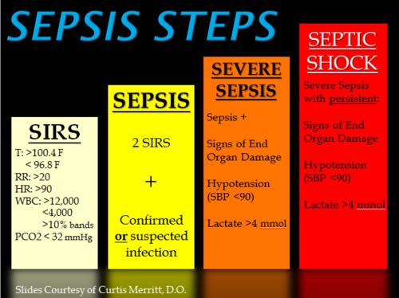

# SEPSE NEONATAL PRECOCE E TARDIA: PROTOCOLOS E ANTIBIÓTICO

A sepse neonatal é uma das principais causas de morbimortalidade em unidades de terapia intensiva neonatais e um dos temas mais recorrentes em provas de residência médica. Para entender este tema, você precisa primeiro internalizar que o recém-nascido (RN) não é um adulto pequeno. O sistema imunológico dele é imaturo, a barreira hematoencefálica é permeável e os sinais clínicos de infecção são, muitas vezes, frustros ou inespecíficos.

Diferente de um adulto que apresenta febre, calafrios e tosse, o RN séptico pode apenas "não estar bem". Ele para de mamar, fica hipoativo ou apresenta uma instabilidade térmica sutil. Como professor, eu digo: na neonatologia, o "feeling" da enfermagem e da mãe vale ouro, mas para a prova, você precisa de critérios objetivos e protocolos rígidos.

## Classificação e a Barreira das 72 Horas

A primeira coisa que você deve olhar em uma questão de prova é a idade cronológica do RN. Isso divide o mundo da infectologia neonatal em dois:

- **Sepse Neonatal Precoce (SNP):** Ocorre nas primeiras 72 horas de vida. Algumas referências mais antigas falavam em 7 dias, mas para as diretrizes atuais da Sociedade Brasileira de Pediatria (SBP) e para a maioria das bancas, o corte é 72 horas. O mecanismo aqui é a **transmissão vertical** (da mãe para o bebê, antes ou durante o parto).

- **Sepse Neonatal Tardia (SNT):** Ocorre após as 72 horas de vida. Aqui, o mecanismo é a **transmissão horizontal** (contato com profissionais de saúde, ambiente hospitalar, dispositivos invasivos ou comunidade).

Por que essa divisão é crucial? Porque ela define os prováveis agentes etiológicos e, consequentemente, o esquema de antibiótico inicial. Se você errar a classificação, errará o tratamento.

## Sepse Neonatal Precoce (SNP)

A SNP é o resultado da exposição do feto ou do RN a microrganismos do trato genital materno. Imagine o bebê passando pelo canal de parto ou o microrganismo subindo através de membranas rotas.

### Etiologia da SNP

Os grandes vilões aqui são:

- **Streptococcus agalactiae (GBS ou Estreptococo do Grupo B):** O campeão absoluto.

- **Escherichia coli:** Especialmente importante em prematuros e em casos de mães que usaram antibióticos profiláticos (que podem selecionar Gram-negativos).

- **Listeria monocytogenes:** Menos comum, mas cai em prova associada a quadros de corioamnionite e abscessos placentários.

### Fatores de Risco para SNP

As bancas adoram colocar uma lista de fatores de risco para você decidir se inicia ou não o antibiótico. Memorize estes:

- **Colonização materna por GBS:** Sem profilaxia adequada.

- **Ruptura Prematura de Membranas (RPMO) > 18 horas:** Quanto mais tempo aberto, mais chance de subida bacteriana.

- **Corioamnionite materna:** Definida clinicamente por febre materna (> 38°C) associada a pelo menos dois sinais (taquicardia materna, taquicardia fetal, dor uterina ou líquido amniótico fétido).

- **Prematuridade:** O sistema imune é ainda mais frágil.

- **Febre materna intraparto:** Sem outro foco definido.

**Dica de Prova:** Idade materna avançada ou parto cesárea eletiva (sem trabalho de parto e com membranas íntegras) NÃO são fatores de risco para sepse. Inclusive, se a mãe é GBS positivo mas fará cesárea eletiva com bolsa íntegra, ela NÃO precisa de profilaxia intraparto.

## Profilaxia Intraparto para GBS

Este é um ponto onde muitos alunos perdem pontos preciosos. Segundo as diretrizes da FEBRASGO e SBP, a triagem para GBS deve ser feita em todas as gestantes entre 35 e 37 semanas de gestação (swab vaginal e anal).

### Quem deve receber Penicilina intraparto?

- Gestante com cultura (swab) positiva para GBS na gestação atual.

- Gestante com história de filho anterior que teve sepse por GBS.

- Gestante com bacteriúria por GBS na gestação atual (independente da contagem de colônias).

- Status de GBS desconhecido NO MOMENTO DO PARTO + fator de risco (Prematuridade < 37 semanas, RPMO > 18h ou Febre intraparto > 38°C).

**O que é profilaxia adequada?** Penicilina G Cristalina (dose de ataque 5 milhões UI + 2,5 milhões UI a cada 4h) ou Ampicilina, iniciadas pelo menos 4 horas antes do nascimento. Se foi feito outro antibiótico ou em tempo inferior a 4 horas, a profilaxia é considerada inadequada.

## Sepse Neonatal Tardia (SNT)

Aqui o cenário muda. O bebê já passou das 72 horas. Se ele está em casa, os germes são da comunidade. Se ele está na UTI Neonatal (o mais comum em provas), os germes são os da unidade.

### Etiologia da SNT

- **Staphylococcus coagulase-negativo (S. epidermidis):** O principal agente em RNs com cateteres venosos centrais.

- **Staphylococcus aureus:** Frequentemente associado a infecções de pele e onfalite.

- **Gram-negativos hospitalares:** Klebsiella, Pseudomonas, Serratia.

- **Fungos (Candida albicans):** Pense nisso no prematuro extremo que usou antibiótico de amplo espectro por muito tempo.

### Fatores de Risco para SNT

O principal fator é a quebra das barreiras naturais.

- Uso de cateteres venosos centrais (UCP, cateter umbilical).

- Ventilação mecânica prolongada.

- Nutrição parenteral.

- Uso prévio de antibióticos (especialmente cefalosporinas de 3ª geração).

- Baixo peso ao nascer e prematuridade extrema.

**Exemplo Clínico:** Um RN de 15 dias de vida, em ventilação mecânica, apresenta resíduo gástrico aumentado e episódios de apneia. O que você pensa? SNT. Qual o provável agente? Se tem cateter central, pense em Staph coagulase-negativo.

## Quadro Clínico: O Camaleão Neonatal

Como eu disse no início, os sinais são inespecíficos. No MedEvo, sempre enfatizamos que você deve suspeitar de sepse em qualquer RN que "não vai bem".

- **Instabilidade térmica:** Mais comum a hipotermia do que a febre, especialmente no prematuro.

- **Alterações respiratórias:** Taquipneia, gemência, batimento de asa de nariz, apneia (muito comum na sepse).

- **Alterações cardiovasculares:** Taquicardia, bradicardia, má perfusão periférica (tempo de enchimento capilar > 3 segundos), pulsos débeis.

- **Alterações gastrointestinais:** Recusa alimentar, vômitos, distensão abdominal, resíduo gástrico aumentado.

- **Alterações neurológicas:** Letargia, irritabilidade, hipotonia, fontanela abaulada (sinal tardio de meningite).

**Cuidado:** RN com febre (< 28 dias) é sepse até que se prove o contrário. Não caia na pegadinha de achar que é "só um resfriado" ou "reação à vacina" se o bebê tiver menos de um mês. A conduta é internação e investigação completa.

## Diagnóstico Laboratorial

Aqui é onde a banca testa se você sabe interpretar exames. O diagnóstico de certeza é a **Hemocultura positiva**, mas ela demora. Por isso, usamos exames indiretos.

### 1. Hemograma

Não olhe apenas para os leucócitos totais. O RN tem uma variação imensa de leucócitos nas primeiras horas de vida (Gráfico de Manroe).

- **Neutropenia:** Tem maior valor preditivo positivo para sepse do que a leucocitose.

- **Relação I/T (Imaturos/Totais):** Se > 0,2, sugere fortemente infecção. Significa que o corpo está jogando "soldados imaturos" (bastões, metamielócitos) na batalha porque os maduros acabaram.

- **Plaquetopenia:** É um sinal tardio e inespecífico, mas indica gravidade.

### 2. Proteína C Reativa (PCR) e Procalcitonina

A PCR demora cerca de 6 a 12 horas para subir. Uma PCR negativa no início do quadro não exclui sepse. O valor dela está no **valor preditivo negativo**: duas PCRs negativas com intervalo de 24h ajudam a suspender o antibiótico. A procalcitonina sobe mais rápido, mas sofre influência do estresse do parto.

### 3. Líquor (LCR)

**Regra de ouro:** RN com suspeita de sepse deve ter o líquor colhido, a menos que esteja instável hemodinamicamente. Cerca de 20-30% dos RNs com meningite têm hemoculturas negativas.

| Parâmetro | RN Termo (Normal) | Meningite Bacteriana |
| --- | --- | --- |
| Leucócitos | Até 20-30 cel/mm³ | Muito aumentada (> 100) |
| Predomínio | Mononucleares | Polimorfonucleares |
| Proteína | Até 100-150 mg/dL | Muito aumentada |
| Glicose | > 50% da glicemia | Reduzida (Hipoglicorraquia) |

### 4. Urocultura

Só tem valor na **Sepse Tardia**. Na sepse precoce, a via é hematogênica ou ascendente vaginal, e a urocultura raramente ajuda e pode vir contaminada. Na tardia, a ITU é um foco importante.

## Antibioticoterapia: O que prescrever?

A escolha do antibiótico é baseada na epidemiologia. Você não espera o resultado da cultura para começar; a terapia é empírica.

### Esquema para Sepse Precoce (SNP)

O objetivo é cobrir GBS, E. coli e Listeria.

- **Ampicilina + Gentamicina (ou Amicacina).**

- Por que Ampicilina? Porque ela é excelente para GBS e é o único dos esquemas comuns que cobre *Listeria monocytogenes*.

- Por que o Aminoglicosídeo? Para cobrir os Gram-negativos (E. coli) e fazer sinergismo com a ampicilina contra o GBS.

### Esquema para Sepse Tardia (SNT)

Aqui depende se o RN está em casa ou na UTI.

- **UTI Neonatal:** Precisamos cobrir Staph coagulase-negativo e Gram-negativos resistentes.

- **Vancomicina + Amicacina** (ou Cefepime/Ceftazidima se suspeita de Pseudomonas).

- **Comunidade:** RN que chega de casa com febre.

- **Ampicilina + Ceftriaxone** (Cuidado: Ceftriaxone deve ser evitado em RNs com icterícia, pois compete com a bilirrubina pela albumina, aumentando o risco de Kernicterus. Nesses casos, prefira Cefotaxima).

### Tabela de Doses e Ajustes (Exemplos)

| Antibiótico | Indicação Principal | Observação |
| --- | --- | --- |
| Ampicilina | GBS, Listeria, Enterococo | Base da sepse precoce. |
| Gentamicina | Gram-negativos (E. coli) | Ajustar dose pela idade gestacional/peso. |
| Vancomicina | Staph coag-negativo, MRSA | Monitorar função renal. |
| Oxacilina | Staph aureus sensível | Usar se houver foco cutâneo/onfalite. |
| Anfotericina B | Candida sp. | Se não houver melhora com ATB de amplo espectro. |

## Situações Especiais e Pegadinhas de Prova

### 1. Galactosemia e E. coli

Esta é uma clássica do Dr. Will para vocês: se a questão descreve um RN com icterícia às custas de bilirrubina direta, hepatomegalia, catarata e **sepse por Escherichia coli**, o diagnóstico subjacente é **Galactosemia**. O excesso de galactose inibe a atividade bactericida dos leucócitos contra a E. coli.

### 2. Onfalite

Infecção do coto umbilical. Se houver apenas hiperemia periumbilical, o tratamento pode ser local ou com ATB venoso dependendo da extensão. Mas se houver sinais sistêmicos (choque, letargia), é sepse. Em partos domiciliares sem higiene, pense em Tétano Neonatal e use Penicilina G Cristalina + Imunoglobulina.

### 3. O RN Assintomático com Fator de Risco

Mãe GBS positivo, não fez profilaxia, mas o bebê nasceu ótimo, termo, sem sinais. O que fazer?

- **Não colher exames de rotina e não iniciar ATB.**

- **Observação clínica rigorosa em alojamento conjunto por 36-48 horas.**
Esta é a conduta mais atual. Evitamos picar o bebê e usar antibiótico desnecessário se ele estiver clinicamente bem.

### 4. Choque Séptico Neonatal

O choque no RN é frequentemente distributivo. O tratamento envolve:

- Expansão volêmica (Soro Fisiológico 0,9% 10-20 ml/kg) – cuidado com prematuros extremos para não causar hemorragia peri-intraventricular.

- Drogas vasoativas (Dopamina, Dobutamina ou Adrenalina conforme o tipo de choque).

- Antibiótico na primeira hora (Golden Hour).

### 5. Vacinação e Sepse

Prematuros devem ser vacinados na **idade cronológica**. Um prematuro de 2 meses (mesmo que tenha nascido de 28 semanas) deve receber a vacina Pentavalente.

- **Pegadinha:** Se o RN teve uma Síndrome Hipotônica-Hiporesponsiva (SHH) após a Pentavalente, a culpa é do componente *Pertussis* de células inteiras. A conduta é fazer as próximas doses com a vacina acelular.

## Diagnóstico Diferencial

Nem tudo que parece sepse é sepse. No período neonatal, os principais diferenciais são:

- **Taquipneia Transitória do RN (TTRN):** Ocorre em partos cesáreos sem trabalho de parto. O bebê tem desconforto respiratório que melhora em 24-48h. O RX mostra congestão hilar e líquido na cisura.

- **Síndrome de Aspiração de Mecônio:** História de sofrimento fetal e líquido meconial.

- **Erros Inatos do Metabolismo:** RN que piora após início da dieta, com acidose metabólica grave e hiperamonemia.

- **Cardiopatias Congênitas Cianóticas:** O teste do coraçãozinho ajuda aqui.

## Manejo do RN de Mãe com COVID-19 ou Tuberculose

- **COVID-19:** O aleitamento materno é incentivado. A mãe deve usar máscara e higienizar as mãos. O alojamento conjunto é permitido com distância de pelo menos 1 metro entre a cama da mãe e o berço.

- **Tuberculose:** Se a mãe é bacilífera, **NÃO vacinar com BCG** ao nascer. Inicia-se a quimioprofilaxia primária (Isoniazida ou Rifampicina) por 3 meses. Após esse período, faz-se o PPD (Teste Tuberculínico). Se PPD negativo, vacina BCG. Se PPD positivo, mantém tratamento. O aleitamento é permitido com máscara.

## Pontos-Chave para Prova

- **Sepse Precoce:** < 72h; Transmissão vertical; GBS e E. coli; ATB: Ampicilina + Gentamicina.

- **Sepse Tardia:** > 72h; Transmissão horizontal/hospitalar; Staph coag-negativo; ATB: Vancomicina + Aminoglicosídeo.

- **Fator de Risco n° 1:** Ruptura de membranas > 18 horas e Corioamnionite.

- **Febre em RN (< 28 dias):** É emergência. Internar, colher Hemocultura, Urocultura e Líquor, e iniciar ATB venoso.

- **Líquor:** Sempre colher na suspeita de sepse (se estável). Meningite neonatal exige doses maiores de ATB e tempo prolongado (21 dias para Gram-negativos).

- **GBS Profilaxia:** Indicada se cultura +, bacteriúria por GBS, filho anterior com sepse por GBS ou risco com status desconhecido.

- **Cesárea Eletiva:** Se bolsa íntegra e fora de trabalho de parto, NÃO precisa de profilaxia para GBS, mesmo se a mãe for positiva.

- **Neutropenia e Relação I/T > 0,2:** São os achados mais sugestivos de sepse no hemograma neonatal.

- **Galactosemia:** Suspeitar se houver sepse por *E. coli* associada a icterícia direta e hepatomegalia.

- **Ceftriaxone:** Evitar no período neonatal imediato pelo risco de Kernicterus (desloca bilirrubina da albumina).

- **Onfalite em Parto Domiciliar:** Pensar em Tétano Neonatal; tratar com Penicilina G Cristalina e SAT/IGAT.

- **Vacinação:** Seguir idade cronológica. BCG e Hepatite B ao nascer.

- **Contraindicação Absoluta de BCG:** RN < 2kg (adiar até atingir 2kg) ou contato domiciliar com TB bacilífera (fazer quimioprofilaxia antes).

- **Sinal Clínico Precoce:** Apneia e instabilidade térmica (hipotermia) são sinais clássicos de alerta.

- **Hemocultura:** É o padrão-ouro, mas o tratamento deve ser iniciado antes do resultado (na primeira hora). 💉

Lembre-se: na prova, se o caso clínico trouxer um RN com sinais mínimos de desconforto e um fator de risco materno importante, a resposta quase sempre passará por "investigar e tratar". A negligência com o RN séptico é o erro que as bancas mais punem. No MedEvo, focamos nessa segurança diagnóstica para garantir sua aprovação.

 Cópia offline para consulta pessoal.
 Fonte original:
 [https://www.medevo.com.br/material-apoio/ler/a1d1f9a9-1702-442c-858d-a7ab8250cd34](https://www.medevo.com.br/material-apoio/ler/a1d1f9a9-1702-442c-858d-a7ab8250cd34)
