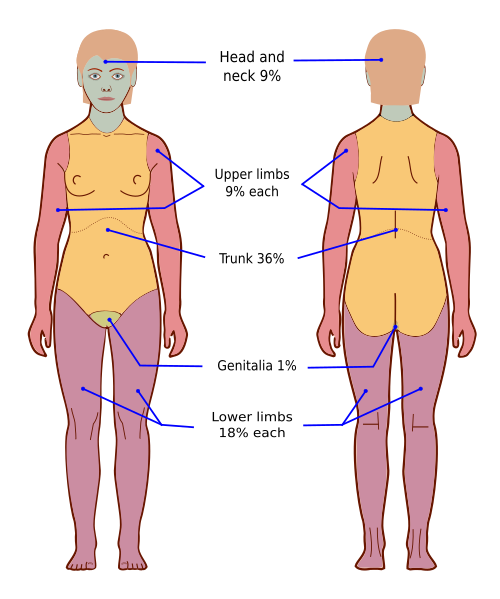

# SEQUELAS DE QUEIMADURAS E RECONSTRUÇÃO

A gravidade das sequelas de queimaduras depende da profundidade, da extensão da superfície corporal queimada (SCQ), da qualidade do atendimento inicial e da reabilitação. Em prova, os temas mais importantes são: identificação do grande queimado, cálculo da reposição volêmica, diferença entre enxerto e retalho, tratamento das retrações cicatriciais e complicações tardias.

*Figura 1 - A Regra dos Nove de Wallace estima rapidamente a superfície corporal queimada em adultos e auxilia no cálculo da reposição volêmica e na definição de gravidade. Fonte: Domínio Público | Wikimedia Commons*

## Avaliação inicial

A abordagem segue prioridades do trauma: via aérea, respiração, circulação, avaliação neurológica e exposição com prevenção de hipotermia. Em queimaduras de face e pescoço, suspeita de lesão inalatória ou queimadura em ambiente fechado, a via aérea deve ser avaliada precocemente, pois o edema pode progredir e dificultar a intubação.

Sinais de alerta para lesão inalatória:

- queimadura em face ou pescoço;

- vibrissas queimadas;

- escarro carbonáceo;

- rouquidão, estridor ou dispneia;

- história de exposição à fumaça em ambiente fechado.

## Estimativa da superfície corporal queimada

Em adultos, a Regra dos Nove de Wallace é a forma prática mais cobrada:

- Cabeça e pescoço: 9%

- Cada membro superior: 9%

- Tronco anterior: 18%

- Tronco posterior: 18%

- Cada membro inferior: 18%

- Genitália/períneo: 1%

Em crianças, a cabeça representa proporção maior e os membros inferiores proporção menor. Como regra prática de prova, a cabeça pode corresponder a cerca de 18% e cada membro inferior a cerca de 14%, especialmente em crianças pequenas. Para maior precisão, usa-se a tabela de Lund-Browder.

Atenção: queimaduras de 1º grau não entram no cálculo da SCQ para reposição volêmica.

## Profundidade da queimadura

A profundidade indica o potencial de cicatrização espontânea e o risco de sequela.

- **1º grau:** acomete apenas a epiderme. Cursa com eritema e dor, sem bolhas. Não costuma deixar cicatriz.

- **2º grau superficial:** acomete derme papilar. É dolorosa, úmida, com flictenas e boa perfusão. Geralmente cicatriza em até 2 semanas, com menor risco de sequela.

- **2º grau profundo:** acomete derme reticular. Pode ter coloração pálida ou esbranquiçada, menor sensibilidade e cicatrização mais lenta. Se demora mais de 2 a 3 semanas para epitelizar, aumenta o risco de cicatriz hipertrófica e contratura.

- **3º grau:** queimadura de espessura total. A pele fica seca, rígida, coriácea e pouco dolorosa ou indolor. Em geral, necessita de excisão e enxertia, pois não há anexos cutâneos suficientes para reepitelização.

## Reposição volêmica

A reposição é indicada principalmente em grandes queimados, especialmente em adultos com queimaduras de 2º ou 3º grau envolvendo mais de 15 a 20% da SCQ e em crianças com mais de 10% da SCQ.

A fórmula mais cobrada é a de Parkland/Baxter:

**Volume nas primeiras 24 horas = 4 mL x peso (kg) x %SCQ**

- Usar preferencialmente Ringer lactato.

- Administrar 50% do volume nas primeiras 8 horas após o trauma.

- Administrar os outros 50% nas 16 horas seguintes.

- O tempo conta a partir do momento da queimadura, não da chegada ao hospital.

Exemplo: paciente de 70 kg com 50% de SCQ.

4 x 70 x 50 = 14.000 mL nas primeiras 24 horas
7.000 mL nas primeiras 8 horas após a queimadura
7.000 mL nas 16 horas seguintes

Se o paciente chega 2 horas após o trauma, a primeira metade deve ser administrada nas 6 horas restantes.

O volume calculado é apenas estimativa inicial. A reposição deve ser ajustada conforme resposta clínica, principalmente pelo débito urinário:

- Adultos: 0,5 a 1 mL/kg/h.

- Crianças: cerca de 1 mL/kg/h, além da necessidade de solução de manutenção.

- Queimadura elétrica ou rabdomiólise: alvo maior de diurese, frequentemente em torno de 1 a 1,5 mL/kg/h ou até clareamento da urina.

Em idosos, cardiopatas e nefropatas, evitar excesso de volume e monitorar de perto a resposta clínica.

## Manejo tópico e infecção

Após estabilização inicial, deve-se realizar limpeza, analgesia, atualização do tétano quando indicada e curativo apropriado. O desbridamento de tecido necrótico reduz carga bacteriana e favorece cicatrização.

Agentes tópicos clássicos:

- **Sulfadiazina de prata 1%:** antimicrobiano tópico amplamente utilizado. Pode causar leucopenia transitória. Evitar em alergia a sulfas e próximo aos olhos.

- **Acetato de mafenida:** penetra bem em escara e cartilagem, útil em queimaduras de orelha. Pode causar acidose metabólica por inibição da anidrase carbônica.

Após as primeiras 48 horas, a sepse passa a ser uma das principais causas de morte no grande queimado. Os agentes mais lembrados são *Staphylococcus aureus* e *Pseudomonas aeruginosa*.

## Cicatriz hipertrófica e queloide

| Característica | Cicatriz hipertrófica | Queloide |
| --- | --- | --- |
| Limites | Respeita os limites da ferida | Ultrapassa os limites da ferida |
| Evolução | Pode regredir com o tempo | Raramente regride espontaneamente |
| Localização | Áreas de tensão e articulações | Orelha, ombro, região pré-esternal |
| Histologia | Colágeno mais organizado e paralelo | Colágeno espesso e desorganizado |
| Tratamento | Compressão, silicone, corticoide, revisão cirúrgica em casos selecionados | Corticoide intralesional, compressão, silicone, ressecção associada a terapias adjuvantes |

A excisão isolada de queloide deve ser evitada, pois tem alta taxa de recidiva. Quando indicada, costuma ser associada a medidas adjuvantes, como infiltração de corticoide, compressão, silicone ou radioterapia local em casos selecionados.

*Figura 2 - Fasciotomia de antebraço: procedimento de descompressão indicado em síndrome compartimental. Em queimaduras circunferenciais, pode ser necessária escarotomia para aliviar restrição vascular ou ventilatória. Fonte: TPompert, CC BY-SA 4.0 | Wikimedia Commons*

## Escarotomia, fasciotomia e queimaduras circunferenciais

Queimaduras profundas e circunferenciais formam escaras rígidas, que podem comprometer perfusão distal ou expansão torácica.

Suspeitar de comprometimento vascular em extremidades quando houver:

- dor progressiva;

- parestesia;

- palidez;

- diminuição de perfusão capilar;

- redução ou ausência de pulsos;

- aumento de pressão compartimental.

A **escarotomia** libera a escara constritiva. A **fasciotomia** é indicada quando há síndrome compartimental verdadeira, com acometimento dos compartimentos musculares, mais comum em trauma associado e queimaduras elétricas.

## Técnicas de reconstrução

A reconstrução busca restaurar cobertura, função e aparência. A escolha depende do leito receptor, da área acometida, da presença de estruturas nobres expostas e da disponibilidade de tecido local.

### Enxertos de pele

O enxerto é transferido sem pedículo vascular próprio. Sua sobrevivência depende da vascularização do leito receptor.

- **Enxerto de pele parcial:** contém epiderme e parte da derme. Tem maior chance de integração, cobre áreas maiores e permite reepitelização da área doadora. Apresenta maior contração secundária.

- **Enxerto de pele total:** contém epiderme e toda a derme. Tem melhor resultado estético e funcional e menor contração secundária, mas exige leito bem vascularizado e área doadora com fechamento primário. É útil em face, pálpebras, mãos e áreas de maior exigência estética ou funcional.

Fases de integração do enxerto:

- **Imbibição plasmática:** nutrição por difusão nas primeiras 24 a 48 horas.

- **Inosculação:** conexão inicial entre capilares do leito e do enxerto.

- **Neovascularização:** crescimento vascular definitivo para o enxerto.

Contração do enxerto:

- **Contração primária:** ocorre logo após a retirada do enxerto, maior no enxerto de pele total.

- **Contração secundária:** ocorre durante a cicatrização, maior no enxerto de pele parcial.

### Retalhos

O retalho mantém suprimento vascular próprio. É indicado quando o leito receptor é inadequado para enxerto ou quando há exposição de osso, tendão, nervo, cartilagem, vasos ou próteses.

Comparação essencial:

| Característica | Enxerto | Retalho |
| --- | --- | --- |
| Vascularização | Depende do leito receptor | Tem pedículo vascular próprio |
| Melhor indicação | Leito bem vascularizado | Estruturas nobres expostas ou leito ruim |
| Contração | Maior, especialmente no enxerto parcial | Menor |
| Complexidade | Menor | Maior |

### Zetaplastia

A zetaplastia é um retalho local de transposição usado para alongar cicatrizes retraídas e mudar sua direção, aproximando-a das linhas de menor tensão.

É muito cobrada no tratamento de bridas e contraturas cicatriciais, especialmente em pescoço, axila, cotovelo, dedos e comissuras.

Ganho teórico conforme o ângulo:

- 30°: cerca de 25%

- 45°: cerca de 50%

- 60°: cerca de 75%, o mais cobrado

- 75°: cerca de 100%

### Expansores teciduais

Expansores são usados quando é desejável obter pele semelhante em cor, textura e espessura, como em couro cabeludo, face e reconstrução mamária.

Alterações clássicas da pele expandida:

- aumento da área cutânea;

- hiperplasia da epiderme;

- adelgaçamento da derme;

- atrofia do subcutâneo;

- aumento da vascularização.

Ponto de prova: a derme não engrossa; ela tende a afinar.

## Contraturas e reabilitação

Contraturas cicatriciais podem limitar movimento, deformar regiões anatômicas e comprometer crescimento em crianças. A prevenção inclui posicionamento adequado, fisioterapia, terapia ocupacional, malhas compressivas e acompanhamento precoce.

### Mão queimada

A mão deve ser imobilizada em posição funcional ou posição intrínseco-plus:

- punho em extensão de 20 a 30°;

- metacarpofalângicas em flexão de 60 a 70°;

- interfalângicas em extensão;

- polegar em abdução.

Esse posicionamento reduz o risco de deformidade em garra e perda funcional. Sindactilias e retrações de comissuras podem exigir liberação cirúrgica associada a enxertos ou retalhos.

## Úlcera de Marjolin

Úlcera de Marjolin é malignização de ferida crônica ou cicatriz instável, classicamente cicatriz de queimadura. O tumor mais associado é o carcinoma espinocelular.

Suspeitar diante de:

- cicatriz antiga que ulcera;

- ferida crônica que não cicatriza;

- bordas elevadas, endurecidas ou evertidas;

- sangramento, dor nova ou crescimento progressivo.

Conduta:

- biópsia, preferencialmente da borda da lesão;

- tratamento cirúrgico com excisão ampla;

- avaliação de linfonodos, pois tende a ser mais agressiva que o CEC em pele fotoexposta.

## Queimaduras por abuso em crianças

Padrões sugestivos de agressão devem ser reconhecidos:

- queimaduras em “luva” ou “meia”;

- linha de demarcação nítida;

- ausência de respingos;

- lesões simétricas;

- queimaduras circulares múltiplas, como por cigarro;

- história incompatível com o padrão da lesão.

Nesses casos, além do tratamento clínico, é obrigatória a adoção das medidas de proteção da criança conforme fluxo institucional e legislação vigente.

## Síndrome de Poland

A síndrome de Poland é uma anomalia congênita que pode aparecer em provas de cirurgia plástica e reconstrução torácica.

Achados clássicos:

- aplasia ou hipoplasia do músculo peitoral maior;

- hipoplasia mamária ou assimetria torácica ipsilateral;

- alterações da mão ipsilateral, como braquissindactilia.

O tratamento é individualizado e busca simetrização torácica, podendo envolver expansores, implantes, lipoenxertia ou retalhos, como o do músculo grande dorsal.

## Critérios práticos de encaminhamento para centro de queimados

Indicar avaliação em centro especializado quando houver:

- queimadura de 2º grau extensa;

- qualquer queimadura de 3º grau relevante;

- acometimento de face, mãos, pés, genitália, períneo ou grandes articulações;

- queimadura elétrica;

- queimadura química;

- suspeita de lesão inalatória;

- queimadura circunferencial;

- crianças, idosos ou pacientes com comorbidades importantes;

- suspeita de maus-tratos.

## Pontos-chave para prova

- A reposição volêmica inicial mais cobrada é: **Parkland = 4 mL x kg x %SCQ**, com Ringer lactato.

- A contagem das primeiras 8 horas começa no momento da queimadura, não na chegada ao serviço.

- O melhor parâmetro prático para ajustar hidratação é o débito urinário.

- Queimaduras de 1º grau não entram no cálculo da SCQ.

- Enxerto depende do leito receptor; retalho tem vascularização própria.

- Enxerto parcial cobre áreas maiores, mas contrai mais durante a cicatrização.

- Enxerto total tem menor contração secundária e melhor resultado estético e funcional.

- Zetaplastia alonga cicatriz retraída; ângulo de 60° gera ganho teórico de 75%.

- Queloide ultrapassa os limites da ferida; cicatriz hipertrófica respeita os limites.

- Expansores aumentam área de pele, com adelgaçamento da derme e atrofia do subcutâneo.

- Úlcera de Marjolin é, classicamente, CEC sobre cicatriz crônica de queimadura.

- Queimadura elétrica pode causar lesão profunda desproporcional à pele, rabdomiólise e insuficiência renal.

- Em queimaduras de face, pescoço ou suspeita de inalação, a prioridade é garantir a via aérea.

- Queimaduras em “luva” ou “meia”, com limite nítido e sem respingos, sugerem imersão forçada.

 Cópia offline para consulta pessoal.
 Fonte original:
 [https://www.medevo.com.br/material-apoio/ler/147330b5-bd00-40cd-ba73-5c8c4497627c](https://www.medevo.com.br/material-apoio/ler/147330b5-bd00-40cd-ba73-5c8c4497627c)
