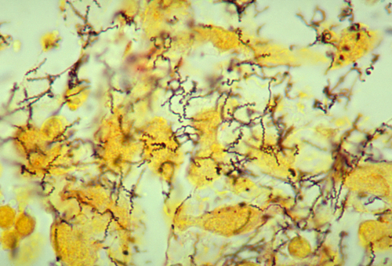

# SÍFILIS NA GESTAÇÃO: DIAGNÓSTICO E TRATAMENTO

A sífilis na gestação é, sem dúvida, um dos temas mais frequentes em provas de residência e revalidação no Brasil. Por que isso acontece? Porque a sífilis congênita é considerada um evento sentinela da qualidade do pré-natal. Se temos um caso de sífilis congênita, o sistema falhou. Em provas, os erros costumam surgir da confusão entre critérios diagnósticos e critérios de "tratamento adequado".

A sífilis é causada pelo *Treponema pallidum*. Ele é uma espiroqueta extremamente ágil que atravessa a barreira placentária em qualquer idade gestacional. Não existe essa história de "proteção inicial" da placenta. Se a gestante tem a bactéria circulando, o feto está em risco.

*Figura 1 - Treponema pallidum: espiroquetas em coloração argêntica (Steiner modificado). A sífilis gestacional requer diagnóstico precoce (VDRL/RPR na 1ª consulta, 3º trimestre e parto) e tratamento adequado com penicilina benzatina são fundamentais para prevenir a sífilis congênita. Fonte: Domínio Público | Wikimedia Commons*

## Fisiopatologia e Transmissão Vertical

A transmissão vertical pode ocorrer em qualquer estágio da doença, mas o risco é inversamente proporcional ao tempo de infecção materna. Ou seja, quanto mais recente for a infecção na mãe (sífilis primária ou secundária), maior é a carga de espiroquetas no sangue e maior a chance de infectar o feto (chegando a 70 a 100% nas fases iniciais).

Por que isso é importante para a sua prova? Porque a banca pode colocar uma paciente com sífilis latente tardia (mais de um ano de infecção) e perguntar o risco. Ele é menor (cerca de 10 a 30%), mas ainda existe. O tratamento é obrigatório em qualquer fase.

A infecção fetal causa uma resposta inflamatória sistêmica. O treponema se dissemina por todos os órgãos, causando hepatomegalia, esplenomegalia, lesões ósseas e hematológicas. É por isso que o recém-nascido (RN) infectado pode apresentar desde anemia e plaquetopenia até o clássico pênfigo palmoplantar.

## Diagnóstico na Gestante: O Fluxograma Definitivo

Aqui é onde a maioria dos alunos se perde. No Brasil, seguimos as recomendações do Ministério da Saúde, que prioriza a agilidade. No pré-natal, o rastreamento deve ser feito na primeira consulta, no início do terceiro trimestre e no momento do parto (ou em casos de abortamento/óbito fetal).

### Testes Treponêmicos vs. Não Treponêmicos

A diferença entre os testes é fundamental para definir conduta:

- **Testes Treponêmicos (ex: Teste Rápido, FTA-Abs, TPHA):** São os primeiros a se tornarem reagentes. Eles detectam anticorpos específicos contra o *Treponema pallidum*. Uma vez positivos, geralmente permanecem assim pelo resto da vida (cicatriz sorológica).

- **Testes Não Treponêmicos (ex: VDRL, RPR):** Detectam anticorpos contra cardiolipina. São quantitativos (títulos como 1:4, 1:16). Eles servem para diagnóstico de atividade e, principalmente, para controle de cura.

**Ponto prático:** teste rápido treponêmico positivo na gestante indica início imediato do tratamento, sem aguardar VDRL. O VDRL deve ser colhido para titulação basal e seguimento, mas a primeira dose de penicilina benzatina não deve ser atrasada.

### Interpretação de Resultados

| Cenário | Teste Treponêmico (TR) | Teste Não Treponêmico (VDRL) | Conduta |
| --- | --- | --- | --- |
| 1 | Reagente | Reagente | Diagnóstico confirmado. Tratar e investigar parceiro. |
| 2 | Reagente | Não Reagente | Pode ser sífilis muito recente ou cicatriz sorológica. Solicitar outro teste treponêmico diferente (ex: FTA-Abs). |
| 3 | Não Reagente | Reagente | Provável falso-positivo (lúpus, infecções virais, gestação). Repetir em 30 dias. |

Cuidado com o **Efeito Prozona**. Isso cai muito! Ocorre quando há tantos anticorpos no soro da paciente que o teste de VDRL não consegue formar os complexos de floculação, dando um resultado falso-negativo. Se a suspeita clínica é alta (ex: paciente com lesões de sífilis secundária) e o VDRL vier negativo, peça ao laboratório para diluir a amostra.

*Figura 2 - Consequência da sífilis não tratada: dentes de Hutchinson são manifestação tardia da sífilis congênita. O tratamento materno adequado com penicilina benzatina previne a transmissão vertical. Fonte: CDC/Susan Lindsley, Domínio Público | Wikimedia Commons*

## Estadiamento Clínico: O Que Define a Dose?

O tratamento da sífilis é sempre com Penicilina G Benzatina, mas o número de doses depende do tempo de infecção. Erro no estadiamento leva a erro de dose e pode fazer com que o feto seja considerado "não tratado".

- **Sífilis Recente (Primária, Secundária e Latente Recente com menos de 1 ano):**

- Dose: 2,4 milhões de UI, IM, dose única (1,2 milhão em cada glúteo).

- **Sífilis Tardia (Latente Tardia com mais de 1 ano ou Latente de Tempo Desconhecido):**

- Dose: 2,4 milhões de UI, IM, por 3 semanas (total de 7,2 milhões de UI).

- **Atenção:** Na dúvida sobre o tempo de infecção (o que é a regra no pré-natal), tratamos como Latente Tardia: 3 doses.

**Exemplo Clínico:** Gestante de 20 semanas, assintomática, VDRL 1:8, sem exames anteriores. Qual a conduta? Como não sabemos o tempo de infecção, o esquema é de 3 doses semanais de Penicilina Benzatina.

## O Conceito de Tratamento Adequado

Este é o tópico mais cobrado em provas de Pediatria e Obstetrícia simultaneamente. Para que o feto seja considerado "tratado" ainda no útero, a mãe precisa cumprir quatro critérios rigorosos:

- **Uso de Penicilina G Benzatina:** É o único medicamento que atravessa a placenta em concentrações terapêuticas para o feto. Se a mãe usou Ceftriaxone, Eritromicina ou Azitromicina, ela pode até estar tratada, mas o feto NÃO está.

- **Esquema de Doses Correto:** Se era para fazer 3 doses e ela só fez 2, é inadequado.

- **Intervalo entre as Doses:** As doses devem ser semanais (intervalo de 7 dias). Se o intervalo entre as doses for maior que 9 dias, o esquema deve ser reiniciado.

- **Tempo de Término:** O tratamento deve ser concluído pelo menos 30 dias antes do parto.

**Mudança importante:** o tratamento do parceiro não é mais critério para definir se o tratamento materno foi adequado para fins de classificação do recém-nascido. Ainda assim, o parceiro deve ser tratado para evitar reinfecção da gestante; se houver reinfecção, os títulos não treponêmicos podem subir e a gestante precisará ser reavaliada.

## Alergia à Penicilina: O Que Fazer?

Muitas provas trazem a gestante com história de alergia (edema de glote ou urticária) à penicilina. A alternativa que sugere "Eritromicina" ou "Ceftriaxone" é sempre a pegadinha para te fazer errar.

A conduta correta na gestante alérgica é a **Dessensibilização Hospitalar**. A paciente é internada e recebe doses crescentes de penicilina em ambiente controlado até que o corpo tolere a dose terapêutica. Por que fazemos isso? Porque nenhum outro antibiótico é eficaz para prevenir a sífilis congênita.

## Reação de Jarisch-Herxheimer

Após a primeira dose de penicilina, a gestante pode apresentar febre, calafrios, cefaleia e exacerbação das lesões cutâneas. Isso não é alergia! É uma reação à liberação de antígenos após a morte maciça das espiroquetas.

Na gestante, isso pode desencadear contrações uterinas e sofrimento fetal agudo. A conduta é apenas sintomática (analgésicos e antitérmicos) e observação. Não se interrompe o tratamento por causa disso.

## Seguimento e Controle de Cura

O controle de cura na gestante é feito com o VDRL mensal. Esperamos que os títulos caiam. O que é considerado uma queda significativa? A queda de duas titulações (ou quatro vezes o valor) em 3 a 6 meses.

- Exemplo: De 1:32 para 1:8 (Caiu 1:32 -> 1:16 -> 1:8. Duas titulações).

Se o título subir (ex: de 1:4 para 1:16) ou se não cair após o tempo esperado, suspeitamos de reinfecção (parceiro não tratado) ou falha terapêutica. Nesses casos, reiniciamos o esquema de 3 doses.

## O Recém-Nascido Exposto: Condutas Iniciais

Ao nascimento, a primeira pergunta clínica é: "A mãe foi adequadamente tratada?".

### Se a Mãe foi Inadequadamente Tratada:

O RN precisa de uma investigação completa, independentemente de ter sintomas ou não.

- VDRL de sangue periférico (nunca de sangue de cordão, pois pode haver contaminação com sangue materno).

- Hemograma.

- Radiografia de ossos longos (procurar periostite, osteocondrite).

- Punção lombar (LCR) para avaliar neurossífilis.

Se houver qualquer alteração clínica ou laboratorial, o tratamento é com **Penicilina G Cristalina** EV por 10 dias ou **Penicilina G Procaína** IM por 10 dias. Se o LCR estiver alterado, a escolha é obrigatoriamente a Cristalina EV.

### Se a Mãe foi Adequadamente Tratada:

Avalia-se o VDRL do RN e compara-se com o da mãe (colhidos no mesmo momento).

- Se o VDRL do RN for maior ou igual ao da mãe em duas titulações (ex: Mãe 1:4 e RN 1:16), o RN tem sífilis congênita e deve ser investigado e tratado.

- Se o VDRL do RN for menor que o da mãe e o exame físico for normal, apenas acompanhamos. Se não for possível garantir o acompanhamento, alguns protocolos sugerem uma dose única de Penicilina Benzatina IM (dose de "conveniência").

## Diagnóstico Diferencial e Coinfecções

A sífilis é "a grande simuladora". No diagnóstico diferencial de úlceras genitais, lembre-se:

- **Cancro Duro (Sífilis):** Única, indolor, base limpa.

- **Cancro Mole (Haemophilus ducreyi):** Múltiplas, muito dolorosas, base suja.

- **Herpes Genital:** Vesículas que evoluem para úlceras rasas, dolorosas, com recorrência.

Além disso, a presença de sífilis obriga o rastreamento de outras ISTs, especialmente HIV e Hepatites B e C. Em provas, é comum associarem o manejo da sífilis com o da Toxoplasmose. Ponto associado: se a gestante tem IgG e IgM positivos para toxoplasmose com menos de 16 semanas, deve-se solicitar o **teste de avidez**. Se a avidez for alta, a infecção ocorreu há mais de 4 meses (antes da gestação), e não há risco para o feto.

## Tabelas de Consulta Rápida para Prova

### Tabela 1: Estadiamento e Tratamento Materno

| Estágio | Definição | Esquema (Penicilina Benzatina) |
| --- | --- | --- |
| Primária | Cancro duro (úlcera indolor) | 2,4 milhões UI, IM, dose única |
| Secundária | Roséolas, pápulas palmoplantares, condiloma plano | 2,4 milhões UI, IM, dose única |
| Latente Recente | Infecção < 1 ano (assintomática) | 2,4 milhões UI, IM, dose única |
| Latente Tardia | Infecção > 1 ano (assintomática) | 2,4 milhões UI, IM, 3 doses (semanais) |
| Latente Ignorada | Tempo de infecção desconhecido | 2,4 milhões UI, IM, 3 doses (semanais) |
| Terciária | Gomas, tabes dorsalis, aneurisma aórtico | 2,4 milhões UI, IM, 3 doses (semanais) |

### Tabela 2: Critérios de Tratamento Materno Adequado (Para o Feto)

| Critério | Exigência |
| --- | --- |
| Droga | Penicilina G Benzatina (exclusivamente) |
| Dose | Adequada ao estágio da doença |
| Intervalo | 7 dias entre as doses (máximo 9 dias) |
| Prazo | Finalizado pelo menos 30 dias antes do parto |

### Tabela 3: Investigação do Recém-Nascido (Mãe Inadequadamente Tratada)

| Exame | O que procurar? |
| --- | --- |
| VDRL (Sangue Periférico) | Títulos reagentes (mesmo que baixos) |
| Hemograma | Anemia, plaquetopenia, leucocitose ou leucopenia |
| RX de Ossos Longos | Periostite, sinal de Wimberger (erosão da metáfise da tíbia) |
| Líquor (LCR) | Celularidade > 25 cel/mm³, Proteína > 150 mg/dL, VDRL reagente |

## Pontos-Chave para Prova

- **Tratamento Imediato:** Gestante com Teste Rápido positivo deve ser tratada na hora, sem esperar VDRL.

- **Penicilina é a Única:** Nenhuma outra droga (Ceftriaxone, Azitromicina) trata o feto. Se a mãe é alérgica, a conduta é dessensibilização.

- **Intervalo das Doses:** Se a gestante atrasar a segunda ou terceira dose por mais de 9 dias, o esquema deve ser reiniciado do zero.

- **VDRL no RN:** Deve ser feito em sangue periférico. O sangue do cordão pode dar falso-positivo por contaminação com anticorpos maternos.

- **Pênfigo Palmoplantar:** É a lesão cutânea mais característica da sífilis congênita precoce.

- **Notificação Compulsória:** Sífilis adquirida, sífilis em gestante e sífilis congênita são doenças de notificação compulsória **semanal**, com registro em até 7 dias. Não devem ser descritas como notificação imediata.

- **Óbito Fetal:** Em caso de natimorto, sempre investigar sífilis (VDRL materno e biópsia de placenta/órgãos fetais).

- **Seguimento do RN:** RN exposto com VDRL negativo e mãe tratada deve ser acompanhado com VDRL aos 1, 3, 6, 12 e 18 meses.

- **Cicatriz Sorológica:** Teste treponêmico positivo com VDRL negativo em paciente já tratada anteriormente não indica novo tratamento, a menos que haja nova exposição ou sintomas.

- **Parceiro:** Deve ser tratado preferencialmente com dose única (2,4 milhões UI) se a exposição for recente, mas o não tratamento dele não invalida mais o critério de "tratamento adequado" da mãe perante o Ministério da Saúde (embora aumente o risco de reinfecção).

- **Neurossífilis no RN:** O tratamento é sempre com Penicilina G Cristalina 50.000 UI/kg/dose, EV, a cada 12h (nos primeiros 7 dias) e a cada 8h (após o 7º dia), por 10 dias.

- **Falso-Positivo no VDRL:** Pode ocorrer em casos de malária, lúpus, hanseníase e na própria gestação (títulos geralmente baixos, < 1:4).

- **Transmissão Amamentação:** A sífilis NÃO contraindica a amamentação, a menos que haja lesão treponêmica (cancro ou condiloma) diretamente no mamilo.

Síntese prática: diante de dúvida sobre a qualidade do tratamento materno, o recém-nascido deve ser investigado de forma adequada e tratado conforme o risco. A condução prioriza a prevenção de sífilis congênita e suas complicações.

 Cópia offline para consulta pessoal.
 Fonte original:
 [https://www.medevo.com.br/material-apoio/ler/9daef1d0-ba2a-4e6f-8f91-0ae70c338594](https://www.medevo.com.br/material-apoio/ler/9daef1d0-ba2a-4e6f-8f91-0ae70c338594)
