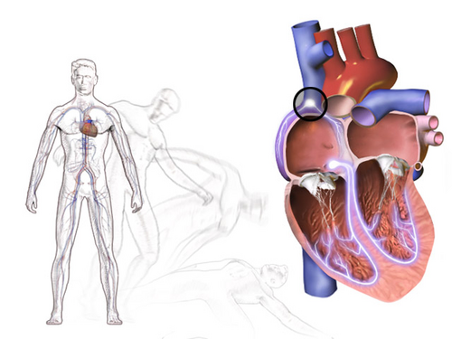

# SÍNCOPE

Síncope não é um diagnóstico final, é um sintoma. Se você sair desta aula entendendo que a síncope é apenas a "ponta do iceberg" de um processo fisiopatológico que precisamos investigar, você já está à frente de 90% dos candidatos.

Para a prova de residência e para a sua vida no plantão, a definição precisa ser decorada: síncope é uma perda transitória da consciência (PTC), de início súbito, curta duração e recuperação espontânea e completa, causada por uma hipoperfusão cerebral global transitória.

Se o paciente demorou 30 minutos para voltar ao normal ou ficou confuso por muito tempo (estado pós-ictal), esqueça a síncope. Provavelmente estamos diante de uma crise epiléptica ou outro simulador. O "pulo do gato" aqui é a hipoperfusão cerebral. Sem queda de fluxo sanguíneo para o cérebro, não existe síncope verdadeira.

*Figura 1 - Síncope: a perda transitória de consciência ocorre por hipoperfusão cerebral global. Suas causas incluem mecanismos reflexos (vasovagal), hipotensão ortostática e arritmias cardíacas. Fonte: BruceBlaus, CC BY 3.0 | Wikimedia Commons*

## Fisiopatologia: O Porquê da Queda

O cérebro é um órgão mimado. Ele não armazena energia e depende de um fluxo constante de oxigênio e glicose. Para manter a consciência, precisamos de um fluxo sanguíneo cerebral de aproximadamente 50 a 60 ml/100g de tecido por minuto.

Se o fluxo cair por apenas 6 a 8 segundos, ou se a pressão arterial sistólica (PAS) despencar para valores abaixo de 60 mmHg, o "disjuntor" desliga. A síncope é, na verdade, um mecanismo de defesa: ao cair, o corpo fica em posição horizontal, facilitando o retorno venoso e o trabalho do coração para perfundir o cérebro contra a gravidade.

A pressão arterial (PA) é o produto do Débito Cardíaco (DC) pela Resistência Vascular Periférica (RVP). Logo, a síncope ocorre quando:

- O débito cardíaco cai bruscamente (arritmias, estenose aórtica, infarto).

- A resistência vascular periférica despenca (vasodilatação excessiva por reflexos ou falha autonômica).

- Uma combinação de ambos.

## Classificação: Onde as Bancas Moram

A Diretriz Brasileira de Arritmias Cardíacas e Síncope (SBC, 2023) divide as síncopes em três grandes grupos. Entender essa divisão é o que separa o médico que pede "exames para tudo" daquele que faz o diagnóstico clínico no beira-leito.

### 1. Síncope Reflexa (Mediada Neuralmente)

É a causa mais comum, especialmente em jovens. Aqui, o sistema nervoso autônomo "se atrapalha". Um gatilho dispara uma resposta reflexa que causa vasodilatação (resposta vasodepressora) e/ou bradicardia (resposta cardioinibitória).

- **Vasovagal:** Ocorre por estresse emocional, dor, medo ou ortostase prolongada. É a clássica síncope do estudante de medicina que vê sangue pela primeira vez.

- **Situacional:** O gatilho é uma função fisiológica específica: micção, defecação, tosse ou deglutição.

- **Hipersensibilidade do Seio Carotídeo:** Comum em idosos. O gatilho é a estimulação mecânica do seio carotídeo (barbear-se, usar colarinho apertado ou virar o pescoço).

### 2. Síncope por Hipotensão Ortostática (HO)

Diferente da reflexa, aqui o problema é uma falha na resposta compensatória ao ficar de pé. Normalmente, ao levantarmos, o sangue tende a acumular nos membros inferiores. O corpo responde com vasoconstrição e aumento da frequência cardíaca. Na HO, isso falha.

- **Depleção de volume:** Desidratação, hemorragia.

- **Drogas:** Diuréticos, betabloqueadores, antidepressivos (causa muito comum em provas!).

- **Falência autonômica:** Diabetes mellitus, Doença de Parkinson, Atrofia de Múltiplos Sistemas.

### 3. Síncope Cardíaca

Esta é a que mata. O examinador vai colocar um caso de síncope cardíaca para testar se você sabe identificar o risco de morte súbita.

- **Arritmias:** Bradicardias (Disfunção do nó sinusal, BAV de alto grau) ou Taquicardias (TV, TSV).

- **Doença Estrutural:** Estenose aórtica (síncope de esforço!), miocardiopatia hipertrófica, mixoma atrial ou embolia pulmonar massiva.

**Tabela 1: Diferenças Clínicas Cruciais**

| Característica | Síncope Reflexa | Hipotensão Ortostática | Síncope Cardíaca |
| --- | --- | --- | --- |
| **Idade** | Geralmente jovens | Idosos / Diabéticos | Qualquer (foco em cardiopatas) |
| **Pródromos** | Longos (náusea, calor, sudorese) | Curtos (tontura ao levantar) | Ausentes ou palpitações súbitas |
| **Gatilho** | Visual, dor, calor, multidão | Mudança de decúbito | Esforço ou repouso súbito |
| **Recuperação** | Rápida, mas com fadiga | Rápida | Rápida |

## A Abordagem Inicial: O "Tripé" Diagnóstico

No MedEvo, sempre batemos na tecla: 50% do diagnóstico da síncope está na anamnese, 20% no exame físico e 20% no ECG. Os 10% restantes são exames caros que você só pede se o "tripé" falhar.

### Anamnese: Investigando o Crime

Você precisa ser um detetive. Pergunte sobre:

- **O que o paciente estava fazendo antes?** (Se estava correndo, pense em síncope cardíaca ou cardiomiopatia hipertrófica).

- **Houve pródromos?** (Náusea e sudorese sugerem reflexa. Nada sugere arritmia).

- **Como foi a queda?** (Teve trauma? Síncope cardíaca costuma ser "disjuntor desligado", o paciente não tem tempo de se proteger).

- **História familiar?** (Morte súbita na família? Pense em canalopatias como Brugada ou QT longo).

### Exame Físico: A Manobra Obrigatória

Não existe avaliação de síncope sem a medida da **PA em decúbito e em ortostase**.
Como fazer: Meça a PA após 5 minutos deitado e depois após 1 e 3 minutos de pé.
**Critério diagnóstico para HO:** Queda da PAS ≥ 20 mmHg ou da PAD ≥ 10 mmHg.

Cuidado com a pegadinha: se o paciente tiver uma queda de PAS > 30 mmHg mas for hipertenso grave, isso também conta. Se a frequência cardíaca subir muito (> 30 bpm) sem queda de PA, pense em Síndrome de Taquicardia Ortostática Postural (POTS).

### Eletrocardiograma (ECG): O Exame de Ouro

Todo paciente com síncope TEM que fazer um ECG de 12 derivações. Mesmo que venha normal, ele é obrigatório. O que buscar?

- Sinais de isquemia.

- Intervalo QT (curto ou longo).

- Padrão de Brugada (bloqueio de ramo direito com supra de ST em V1-V2).

- Onda delta (Wolff-Parkinson-White).

- Sobrecarga de ventrículo esquerdo (Estenose aórtica ou Miocardiopatia Hipertrófica).

*Figura 2 - ECG em ritmo sinusal normal com intervalos PR, QRS e QT. O eletrocardiograma é essencial na estratificação de risco da síncope: alterações como bloqueios, pré-excitação ou QT longo direcionam para causas cardíacas que demandam internação e investigação intensiva. Fonte: Domínio Público | Wikimedia Commons*

## Estratificação de Risco: Quem vai para casa?

Esta é a parte mais importante para a prova e para a vida. A diretriz da SBC 2023 enfatiza que o objetivo na emergência é identificar o risco de eventos graves em 30 dias.

### Critérios de Alto Risco (Internação e Investigação Intensiva)

- **História:** Síncope durante o esforço, síncope em decúbito dorsal, palpitações precedendo a síncope, ausência de pródromos.

- **Exame Físico:** PAS < 90 mmHg na chegada, sopro sistólico novo (estenose aórtica?), insuficiência cardíaca aguda.

- **ECG:** BAV de 2º grau Mobitz II ou BAV de 3º grau, bradicardia sinusal < 40 bpm, bloqueio de ramo novo, taquicardia ventricular, QT longo (> 450ms em homens, > 470ms em mulheres).

### Critérios de Baixo Risco (Alta com seguimento ambulatorial)

- Idade jovem.

- Pródromos clássicos de síncope reflexa.

- Gatilhos claros (visão de sangue, dor, cheiro ruim).

- Longa história de síncopes recorrentes com as mesmas características.

**Tabela 2: Estratificação de Risco (Resumo)**

| Risco | Conduta | Exemplos |
| --- | --- | --- |
| **Baixo** | Alta da Emergência | Vasovagal clássica, ECG normal, jovem |
| **Intermediário** | Unidade de Observação | Idoso, comorbidades estáveis, síncope sem pródromos claros |
| **Alto** | Internação Hospitalar | Cardiopata, ECG alterado, síncope em esforço, anemia grave |

## Exames Complementares: Quando Avançar?

Dr. Will sempre diz: "Não peça Tilt-Test para quem já tem diagnóstico de síncope vasovagal clara". O exame complementar serve para quando a dúvida persiste.

### Teste de Inclinação (Tilt-Table Test)

O Tilt-test não serve para "dar o diagnóstico", mas para confirmar a predisposição à síncope reflexa em pacientes com episódios recorrentes e sem cardiopatia.

- **Indicação:** Síncope recorrente sem explicação, síncope única com trauma ou risco profissional (ex: motorista), ou para diferenciar síncope de pseudosíncope psicogênica.

- **O que é positivo?** Reprodução dos sintomas com queda da PA e/ou FC.

### Massagem do Seio Carotídeo

Obrigatória em pacientes > 40 anos com síncope de origem indeterminada.

- **Como fazer:** Massagem firme por 5-10 segundos sobre o bulbo carotídeo (um lado de cada vez!).

- **Positivo se:** Assistolia > 3 segundos e/ou queda da PAS > 50 mmHg com reprodução dos sintomas.

- **Contraindicação absoluta:** Sopro carotídeo, história de AVC ou AIT nos últimos 6 meses, ou estenose de carótida conhecida > 70%. Não vá causar um AVC no seu paciente para diagnosticar uma síncope!

### Monitorização Eletrocardiográfica (Holter vs. Looper)

- **Holter 24h:** Só serve se o paciente tiver sintomas TODO DIA. A chance de flagrar a síncope em 24h é baixíssima (< 5%).

- **Monitor de Eventos (Looper):** Para sintomas semanais ou mensais.

- **Monitor de Eventos Implantável (ILR):** O "padrão-ouro" para síncope inexplicada em pacientes com alto risco de arritmia, mas com investigação inicial negativa. Pode durar até 3 anos.

## Diagnóstico Diferencial: Os Grandes Simuladores

Nem tudo que "apaga" é síncope. O erro clássico de prova é confundir síncope com crise convulsiva.

- **Crise Convulsiva:** O paciente tem movimentos tônico-clônicos (cuidado: síncopes podem ter abalos musculares curtos, chamadas síncopes convulsivas), mordedura de língua (geralmente lateral), liberação esfincteriana e, o mais importante, **período pós-ictal longo**. Na síncope, o paciente acorda e já sabe quem é e onde está.

- **Pseudosíncope Psicogênica:** O paciente "desmaia", mas mantém os olhos fechados (na síncope real os olhos costumam ficar abertos e desviados para cima), a PA e a FC estão normais durante o evento. É uma manifestação de transtorno de conversão.

- **AIT Vertebro-basilar:** Raramente causa perda de consciência isolada. Geralmente vem acompanhado de "D's": Diplopia, Disartria, Disfagia, Ataxia.

## Tratamento: O Plano de Ação

O tratamento depende da causa. Não existe "remédio para desmaio" genérico.

### Síncope Reflexa e Hipotensão Ortostática

O foco é não farmacológico.

- **Educação:** Explicar a natureza benigna (acalmar o paciente reduz a recorrência).

- **Hidratação e Sal:** 2 a 3 litros de água por dia e 6 a 10g de sal por dia (se não for hipertenso!).

- **Manobras de Contrapressão:** Cruzar as pernas, tensionar os músculos dos braços e glúteos ao sentir os pródromos. Isso aumenta o retorno venoso e pode abortar a síncope.

- **Tilt Training:** Ficar encostado na parede por períodos crescentes para "treinar" o sistema autônomo (evidência fraca, mas citada).

**Tratamento Farmacológico (Segunda linha):**

- **Fludrocortisona:** Um mineralocorticoide que aumenta a reabsorção de sódio e o volume plasmático. Dose: 0,1 a 0,2 mg/dia.

- **Midodrina:** Um alfa-1 agonista periférico (vasoconstritor). Excelente para HO. Dose: 2,5 a 10 mg, 3x ao dia.

- **Betabloqueadores:** Antigamente muito usados, hoje a diretriz diz que **não têm benefício** na síncope vasovagal e podem até piorar a bradicardia. Evite em provas!

### Síncope Cardíaca

Aqui o tratamento é da causa base.

- **Bradiarritmias:** Marcapasso definitivo (Classe I se houver correlação sintoma-arritmia).

- **Taquiarritmias:** Ablação por radiofrequência ou Cardiodifibrilador Implantável (CDI).

- **Estenose Aórtica:** Troca valvar (cirúrgica ou TAVI).

**Tabela 3: Resumo Terapêutico**

| Condição | Primeira Escolha | Segunda Escolha / Adjuvante |
| --- | --- | --- |
| **Vasovagal** | Medidas comportamentais + Hidratação | Fludrocortisona ou Midodrina |
| **Hipotensão Ortostática** | Revisão de fármacos + Elevação da cabeceira | Midodrina ou Fludrocortisona |
| **Hipersensibilidade Seio Carotídeo** | Evitar gatilhos mecânicos | Marcapasso (se cardioinibitória) |
| **Síncope Cardíaca** | Tratar a patologia de base | CDI / Marcapasso / Ablação |

## Situações Especiais e Pegadinhas

### O Idoso e a Síncope

No idoso, a síncope é multifatorial. Ele tem menos sensibilidade dos barorreceptores, usa polifarmácia e tem o coração mais rígido.
**Dica de prova:** Se um idoso cai e não lembra como caiu, investigue como síncope. Muitas "quedas da própria altura" em idosos são, na verdade, síncopes sem pródromos.

### Síncope e Exercício

- **DURANTE o exercício:** Pense em causa cardíaca (Estenose aórtica, Miocardiopatia Hipertrófica, Arritmia). É gravíssimo.

- **APÓS o exercício:** Geralmente é reflexa. Ao parar de correr subitamente, a "bomba muscular" das pernas para de funcionar, o sangue represado não volta ao coração e a PA cai.

### Condução de Veículos

A diretriz brasileira é rigorosa.

- **Síncope de baixo risco (vasovagal única):** Sem restrição para motoristas amadores (Cat. B).

- **Síncope de alto risco ou recorrente:** Restrição até que o tratamento seja efetivo e o paciente esteja assintomático por um período (geralmente 3 a 6 meses, dependendo da causa).

## Pontos-Chave para Prova 🧠

- **Definição:** Perda transitória da consciência por hipoperfusão cerebral global com recuperação espontânea e completa.

- **O divisor de águas:** Pródromos longos (reflexa) vs. Início súbito/sem pródromos (cardíaca).

- **Hipotensão Ortostática:** Queda da PAS ≥ 20 mmHg ou PAD ≥ 10 mmHg após 3 min de pé.

- **ECG:** É obrigatório para TODOS os pacientes com síncope na emergência.

- **Síncope de Esforço:** Sempre considerar causa cardíaca estrutural ou arritmia grave até que se prove o contrário.

- **Massagem do Seio Carotídeo:** Contraindicada se houver sopro carotídeo ou AVC/AIT recente (< 6 meses).

- **Tratamento da Vasovagal:** A base é não farmacológica (água, sal 6-10g/dia e manobras de contrapressão).

- **Betabloqueadores:** Não são recomendados para o tratamento de rotina da síncope vasovagal.

- **Midodrina:** Droga de escolha para hipotensão ortostática refratária.

- **Tilt-Test:** Indicado para síncope de origem indeterminada em pacientes sem cardiopatia ou para confirmar diagnóstico em casos atípicos.

- **Síncope Convulsiva:** Pequenos abalos mioclônicos podem ocorrer na síncope por hipóxia cerebral, mas duram < 15 segundos e não têm pós-ictal prolongado.

- **Morte Súbita Familiar:** Se presente na história, investigue canalopatias (Brugada, QT longo) ou Miocardiopatia Hipertrófica.

- **Estenose Aórtica:** A síncope ocorre porque o débito cardíaco é fixo e não consegue aumentar para suprir a vasodilatação periférica do esforço.

- **O que NÃO fazer:** Pedir Tomografia de Crânio ou EEG de rotina para síncope sem sinais de déficit neurológico ou suspeita clara de crise epiléptica. É desperdício de recurso e erro de conduta.

- **Lembre-se do MedEvo:** A estratificação de risco define se o paciente interna ou vai para casa. Na dúvida, se houver cardiopatia prévia, o risco é sempre maior.

 Cópia offline para consulta pessoal.
 Fonte original:
 [https://www.medevo.com.br/material-apoio/ler/d53eb450-de3e-43ac-ac2c-d92850ea83e0](https://www.medevo.com.br/material-apoio/ler/d53eb450-de3e-43ac-ac2c-d92850ea83e0)
