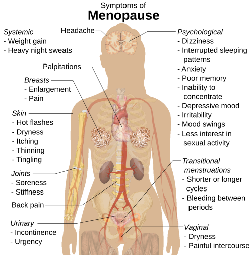

# SÍNDROME CLIMATÉRICA

Para entender o ==climatério==, você precisa parar de pensar nele como uma "doença" e começar a enxergá-lo como um ==processo biológico de transição==. Se você decorar apenas que "o ==FSH sobe== e o ==estrogênio desce==", vai errar as questões de casos clínicos mais complexos. O examinador quer saber se você entende a ==dinâmica dessa falência ovariana== e como ==manejar as queixas== que destroem a qualidade de vida da paciente.

*Figura 1 - Principais sintomas da síndrome climatérica: ==fogachos==, ==alterações de humor==, ==insônia==, ==ressecamento vaginal,== osteoporose e ==alterações metabólicas== decorrem da queda progressiva do ==estrogênio==. Fonte: Mikael Häggström, CC0 | Wikimedia Commons*

## Definições e a Escala STRAW+10

Muitos alunos confundem climatério com menopausa. Vamos organizar isso agora. O climatério é o ==período de transição== entre a fase reprodutiva e a não reprodutiva. Ele começa ==por volta dos 40 anos== e vai ==até os 65 anos==. A menopausa, por outro lado, é um evento pontual: é a ==data da última menstruação==, confirmada ==após 12 meses consecutivos== de amenorreia.

A classificação que você deve levar para a prova é a STRAW+10 (Stages of Reproductive Aging Workshop). Ela divide a vida da mulher em estágios:

- **Transição Menopáusica Inicial (Estágio -2):** Os ciclos começam a variar em duração (diferença de 7 dias ou mais entre eles). Aqui, a ==Inibina B começa a cair.==

- **Transição Menopáusica Tardia (Estágio -1):** A paciente apresenta ==intervalos de amenorreia de 60 dias== ou mais. É aqui que os ==fogachos== costumam ganhar força.

- **==Pós-menopausa== Inicial (Estágios +1a, +1b, +1c):** Os primeiros 5 a 6 anos após a menopausa. ==É a "janela de oportunidade" para o tratamento.==

- **Pós-menopausa Tardia (Estágio +2):** Período que vai até o fim da vida, onde predominam os sintomas de ==atrofia geniturinária.==

Cuidado com a pegadinha: a ==menopausa precoce é aquela que ocorre antes dos 40 anos==. Se a banca citar uma paciente de 35 anos com ==fogachos== e amenorreia, o diagnóstico é ==Insuficiência Ovariana Prematura (IOP).==

## Fisiopatologia: Por que o corpo entra em colapso?

O ovário não é apenas uma fábrica de óvulos, é uma ==glândula endócrina complexa.== Com o passar dos anos, o ==estoque de folículos diminui.== Mas o que cai primeiro?

A primeira alteração hormonal no climatério é a ==queda da ==**==Inibina B==**. A função da inibina, como o nome diz, é ==inibir o FSH==. Se a inibina cai, o FSH sobe por feedback negativo. Por isso, em provas, a elevação do FSH é o marcador mais precoce da transição menopáusica, mesmo que a paciente ainda esteja menstruando.

Com a progressão da falência folicular, os ==níveis de estradiol despencam.== Sem estradiol, o hipotálamo fica "perdido". O centro termorregulador hipotalâmico, influenciado pela queda de estrogênio e alterações na noradrenalina e serotonina, estreita a sua "zona de conforto". Isso explica a fisiopatologia dos fogachos: qualquer pequena ==variação de temperatura corporal== dispara uma ==resposta exagerada== de dissipação de calor (sudorese e vasodilatação).

Na pós-menopausa, o estrogênio predominante muda. O ==ovário para de produzir estradiol== (o mais potente). O corpo passa a depender da **==estrona==**, que é produzida no ==tecido adiposo== através da ==aromatização da androstenediona== (vinda das adrenais e do estroma ovariano). É por isso que ==mulheres obesas== podem ter ==sintomas de fogacho mais leves,== mas têm um risco muito maior de hiperplasia e câncer de endométrio, já que a ==estrona estimula o útero sem a oposição da progesterona.==

## Diagnóstico: Quando pedir exames?

Este é o ponto onde os alunos mais erram em questões de conduta. Na maioria das vezes, o ==diagnóstico de climatério e menopausa é ==**==clínico==**==.==

Se uma mulher com ==mais de 45 anos== apresenta ==irregularidade menstrual== e ==sintomas vasomotores típicos==, você não precisa de exames hormonais para dizer que ela está no climatério. Segundo a FEBRASGO, a ==dosagem de FSH== só é mandatória em situações específicas:

- Mulheres com ==menos de 40 anos== (suspeita de IOP).

- Mulheres que passaram por ==histerectomia== (onde não há o parâmetro da menstruação).

- Uso de ==DIU de levonorgestrel== ou ==usuárias de progestagênios== que já estão em amenorreia.

Valores de ==FSH acima de 25 a 40 mUI/mL== (em duas dosagens com intervalo de 4 a 6 semanas) confirmam a ==falência ovariana== em mulheres jovens. Para a mulher no climatério "padrão", foque na clínica. Lembre-se: o ==TSH e a Prolactina== devem ser solicitados para ==excluir diagnósticos diferenciais== de amenorreia e ==sintomas neurovegetativos.==

## Quadro Clínico: O que a paciente sente?

Os sintomas são divididos em curto, médio e longo prazo.

### Sintomas Vasomotores (Curto Prazo)

Os famosos ==fogachos.== Eles atingem cerca de ==80% das mulheres.== São ondas de calor que começam no ==tórax== e sobem para o ==pescoço== e ==face.== Ocorrem mais à ==noite,== prejudicando o sono e gerando irritabilidade e fadiga. Como o MedEvo sempre reforça, o impacto na qualidade de vida é o principal critério para iniciar o tratamento.

### ==Síndrome Geniturinária da Menopausa== - SGM (Médio Prazo)

Antigamente chamada de atrofia vulvovaginal. O ==epitélio vaginal é dependente de estrogênio.== Sem ele, o ==epitélio fica fino== (atrófico), as rugosidades desaparecem e o **==pH vaginal sobe==** (fica acima de 5.0).

Por que o pH sobe? Porque os lactobacilos de Döderlein precisam de ==glicogênio== (estimulado pelo estrogênio) para produzir ácido lático. ==Sem estrogênio, sem glicogênio, sem lactobacilos, pH básico.== Isso predispõe a ==vaginites== e ==infecções urinárias de repetição==. A paciente queixa-se de ==secura vaginal,== ==dispareunia== (dor na relação) e ==urgência miccional.==

### Repercussões Metabólicas e Ósseas (Longo Prazo)

O estrogênio é cardioprotetor (melhora o perfil lipídico, aumentando HDL e reduzindo LDL) e osteoprotetor (freia a ação dos osteoclastos). Com a menopausa, o ==risco cardiovascular iguala-se ao dos homens== e a ==perda de massa óssea acelera==, levando à osteoporose.

*Figura 2 - A Terapia Hormonal da Menopausa (THM) deve ser iniciada na =="janela de oportunidade"== (até 10 anos da menopausa ou antes dos 60 anos) para ==maximizar benefícios e minimizar riscos cardiovasculares==. Fonte: Domínio Público | Wikimedia Commons*

## Terapia Hormonal da Menopausa (THM)

Aqui está o "filé mignon" das provas de residência. Você precisa saber quem pode, quem não pode e como prescrever.

### A Janela de Oportunidade

Este conceito é fundamental. A THM deve ser iniciada, preferencialmente, em ==mulheres com menos de 60 anos== ou ==com menos de 10 anos de menopausa.== Se você inicia hormônio em uma mulher de 70 anos que nunca usou, o risco de eventos trombóticos e infarto é altíssimo, pois as placas de ateroma já estão instáveis e o hormônio pode causar a ruptura delas.

### Indicações Absolutas de THM

- Sintomas vasomotores moderados a graves (principal indicação).

- ==Prevenção de perda óssea em mulheres com risco de fratura== (embora não seja a primeira linha isolada para osteoporose, é um benefício direto).

- Tratamento da Síndrome Geniturinária da Menopausa (quando hidratantes não resolvem).

- ==Insuficiência Ovariana Prematura== (deve tratar até a idade média da menopausa, cerca de 50 anos).

### Contraindicações Absolutas (DECORE ISSO!)

As bancas amam colocar uma paciente com fogacho insuportável, mas que tem uma dessas condições:

- ==Câncer de mama== (atual ou prévio).

- ==Lesões precursoras de câncer de mama.==

- Câncer de endométrio ou outros ==tumores estrogênio-dependentes.==

- ==Sangramento vaginal de causa indeterminada== (investigar antes!).

- Tromboembolismo venoso atual ou passado (==TVP/TEP)==.

- Doença coronariana ou cerebrovascular ==(IAM/AVE).==

- ==Doença hepática grave e ativa==.

- Porfiria.

- Lúpus com risco trombótico elevado (presença de anticorpo antifosfolípide).

### Esquemas Terapêuticos

A regra de ouro é: **==Mulher com útero precisa de Progesterona.==**
Por que? Porque o estrogênio isolado causa ==hiperplasia de endométrio== e aumenta o risco de câncer. A ==progesterona== serve apenas para ==proteger o endométrio.==

- **Mulher Histerectomizada:** Estrogênio isolado.

- Exceção: Se ela teve endometriose, você deve manter a progesterona para evitar a ativação de focos residuais e o risco de transformação maligna.

- **Mulher com Útero:** Estrogênio + Progesterona.

- **Esquema Cíclico:** ==Estrogênio todo dia== + ==Progesterona por 12 a 14 dias no mês.== Causa sangramento privativo. Indicado para a transição menopáusica.

- **Esquema Contínuo:** ==Estrogênio + Progesterona todos os dias.== Não é para sangrar. Indicado para a pós-menopausa estabelecida.

### Vias de Administração

- **Via Oral:** Sofre primeira passagem hepática. Aumenta a produção de fatores de coagulação e SHBG. Altera mais o perfil lipídico (aumenta HDL, mas pode aumentar triglicerídeos).

- **Via Transdérmica (Gel ou Adesivo):** Não passa pelo fígado inicialmente. É a via de escolha para pacientes:

- ==Hipertensas.==

- Diabéticas.

- Fumantes.

- Com risco de trombose (varizes, obesidade).

- Com hipertrigliceridemia.

| Condição da Paciente | Via de Escolha | Justificativa |
| --- | --- | --- |
| Saudável, baixo risco CV | Oral ou Transdérmica | Preferência da paciente |
| Hipertensa controlada | Transdérmica | Menor interferência na pressão arterial |
| Hipertrigliceridemia | Transdérmica | Via oral aumenta triglicerídeos |
| Risco de TVP aumentado | Transdérmica | Menor estímulo a fatores de coagulação hepáticos |
| Doença biliar (cálculos) | Transdérmica | Via oral aumenta litogenicidade da bile |

## Tratamento da Síndrome Geniturinária da Menopausa (SGM)

Se a paciente tem **apenas** queixas vaginais (secura, dor no sexo) e não tem fogachos, você **não** faz THM sistêmica. O tratamento é local.

- **Primeira linha:** Hidratantes vaginais (uso regular, não apenas no sexo) e lubrificantes (na hora do sexo). Cuidado: Vaselina é contraindicada, pois danifica preservativos e altera a flora.

- **Segunda linha:** Estrogênio tópico (estriol ou estradiol vaginal). A absorção sistêmica é mínima, por isso, em muitos casos de pacientes que tiveram câncer de endométrio ou mama (após liberação do oncologista), pode ser considerado se os hidratantes falharem.

## Alternativas Não Hormonais

E se a paciente não puder ou não quiser usar hormônio? Não a deixe sofrendo.

- **Inibidores Seletivos da Recaptação de Serotonina (ISRS) e Noradrenalina (ISRN):** Paroxetina (em doses baixas, como 7.5mg), Venlafaxina e Desvenlafaxina são excelentes para reduzir fogachos.

- **Gabapentina:** Ótima para pacientes com fogachos noturnos predominantes (causa sonolência).

- **Fitoterápicos:** Isoflavona de soja e Black Cohosh (Cimicifuga racemosa). Têm eficácia modesta, superior ao placebo em alguns estudos, mas inferior à THM.

- **Medidas Comportamentais:** "Camadas de roupas" (estilo cebola), evitar ambientes quentes, reduzir consumo de álcool e comidas apimentadas, praticar exercícios físicos (pelo menos 150 minutos por semana).

## Sangramento na Pós-Menopausa

Imagine uma paciente de 55 anos, sem menstruar há 2 anos, que apresenta um sangramento vaginal súbito. Isso é câncer de endométrio até que se prove o contrário.

**Conduta:**

- Exame físico e especular (excluir causas vulvares, vaginais ou cervicais).

- Ultrassonografia Transvaginal (USTV):

- Espessura endometrial < 4mm (ou < 5mm em algumas diretrizes): Baixo risco de malignidade. Provável atrofia endometrial (causa mais comum de sangramento).

- Espessura endometrial ≥ 4-5mm: Investigação obrigatória.

- Se estiver em THM, o ponto de corte pode ser até 8mm, mas qualquer sangramento inesperado deve ser visto com cautela.

- Padrão-ouro para investigação: **Histeroscopia com biópsia**. A curetagem uterina é uma alternativa se a histeroscopia não estiver disponível, mas é "cega".

## Insuficiência Ovariana Prematura (IOP)

A IOP é a falência ovariana antes dos 40 anos. O Dr. Will sempre lembra que isso não é apenas uma "menopausa precoce" comum, é uma condição que exige tratamento hormonal quase obrigatório.

- **Diagnóstico:** Amenorreia > 4 meses + FSH > 25 mUI/mL (em duas medidas).

- **Causas:** Idiopática (maioria), genética (Síndrome de Turner, Pré-mutação do X-Frágil), iatrogênica (quimioterapia, radioterapia, cirurgia).

- **Tratamento:** THM é mandatória para prevenir osteoporose precoce e doenças cardiovasculares. Aqui, usamos doses de estrogênio maiores do que na menopausa fisiológica, para mimetizar os níveis de uma mulher jovem. O tratamento deve seguir até os 50-51 anos.

## Tibolona: O "Hormônio" Diferente

A Tibolona é um composto sintético que tem ação estrogênica, progestagênica e androgênica.

- **Vantagem:** Melhora muito a libido (pela ação androgênica) e não aumenta a densidade mamária (bom para mulheres com mamas densas ou mastalgia).

- **Cuidado:** Não deve ser usada em mulheres com risco de AVE ou câncer de mama. É uma excelente opção para quem tem útero e quer um esquema contínuo sem sangramento.

## Pontos-Chave para Prova

- **Diagnóstico de Menopausa:** Clínico (12 meses de amenorreia em mulher > 45 anos). FSH > 25-40 mUI/mL só é necessário se houver dúvida ou idade < 40 anos.

- **Primeiro hormônio a cair:** Inibina B. Isso faz o FSH subir.

- **Estrogênio da pós-menopausa:** Estrona (conversão periférica).

- **Principal indicação de THM:** Sintomas vasomotores (fogachos) que impactam a qualidade de vida.

- **Janela de Oportunidade:** Idade < 60 anos ou < 10 anos de menopausa.

- **Contraindicação Absoluta Clássica:** História pessoal de Câncer de Mama ou TVP prévia.

- **Mulher com útero:** OBRIGATÓRIO associar progesterona ao estrogênio (proteção endometrial).

- **Histerectomizada por Endometriose:** Deve usar progesterona, mesmo sem útero.

- **Via Transdérmica:** Preferencial em hipertensas, diabéticas, obesas e tabagistas (menor risco trombótico).

- **Síndrome Geniturinária isolada:** Tratamento é LOCAL (estrogênio vaginal ou hidratantes).

- **Sangramento pós-menopausa:** Investigar sempre. USTV com endométrio > 4mm exige biópsia (Histeroscopia é o padrão-ouro).

- **IOP:** Menopausa < 40 anos. Requer THM até os 50 anos para proteção óssea e CV.

- **pH Vaginal na Menopausa:** Fica básico (> 5.0) devido à falta de glicogênio e lactobacilos.

- **Citologia Cervical (Papanicolau):** Em mulheres atróficas, pode dar resultado falso-positivo (ASC-US). A conduta é estrogenizar a vagina por 7-14 dias e repetir o exame.

- **Estilo de Vida:** Exercício físico (150 min/semana) e dieta são fundamentais, mas não substituem a THM para sintomas graves. 🚀

 Cópia offline para consulta pessoal.
 Fonte original:
 [https://www.medevo.com.br/material-apoio/ler/396c6a18-9c01-4eee-a6f8-8054cba46b70](https://www.medevo.com.br/material-apoio/ler/396c6a18-9c01-4eee-a6f8-8054cba46b70)
