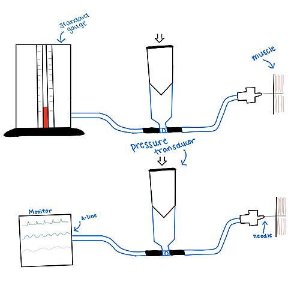
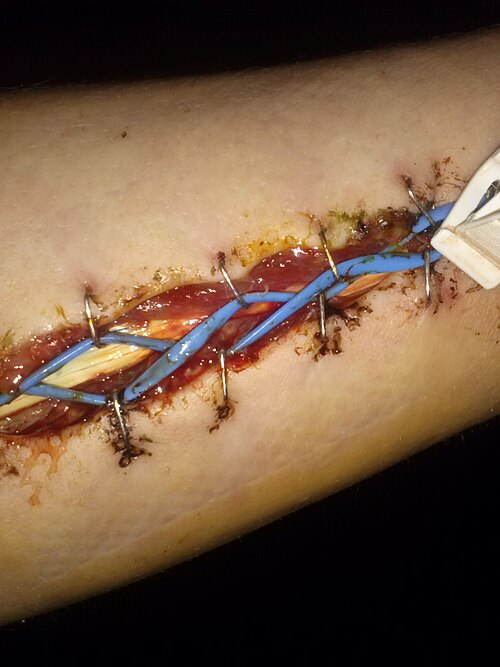

# SÍNDROME COMPARTIMENTAL

Para entender a Síndrome Compartimental Aguda (SCA), você precisa visualizar o corpo humano não como uma massa contínua, mas como um conjunto de "caixas" rígidas. Essas caixas são os compartimentos osteofasciais. As paredes são feitas de osso e fáscia (um tecido conjuntivo denso e nada complacente). Lá dentro, temos músculos, nervos e vasos sanguíneos.

O problema começa quando a pressão dentro dessa "caixa" sobe tanto que o sangue não consegue mais circular. É uma briga de pressões: a pressão do compartimento contra a pressão de perfusão capilar. Se a pressão da caixa vence, o tecido morre.

Aqui no **MedEvo**, sempre reforçamos: a Síndrome Compartimental é uma das poucas **emergências ortopédicas verdadeiras**. Se você não agir rápido, o paciente perde o membro ou a vida.

*Figura 1 - Dispositivo para medição da pressão intracompartimental: um cateter é inserido no compartimento e conectado a um transdutor de pressão. O diagnóstico é confirmado quando Delta P (PAD - PIC) < 30 mmHg. Fonte: Elizaculberson, CC BY-SA 4.0 | Wikimedia Commons*

## Fisiopatologia: O Porquê da Isquemia

Muitos alunos decoram que "aumentou a pressão, parou o sangue". Mas por que o sangue para se o pulso ainda está presente? Esta é uma pegadinha clássica de prova.

A perfusão tecidual depende da diferença entre a Pressão Arterial Média (PAM) e a Pressão Venosa. Quando a pressão intracompartimental (PIC) sobe, ela primeiro colaba as veias e os capilares linfáticos. O sangue entra pelas artérias (que têm pressão maior), mas não consegue sair pelas veias.

Isso gera um ciclo vicioso:

- Aumento da pressão venosa.

- Extravasamento de líquido para o interstício (edema).

- Mais aumento da pressão intracompartimental.

- Redução do gradiente de pressão arteriolar.

**O erro clássico de prova:** Achar que a ausência de pulso é necessária para o diagnóstico. Mentira! A pressão necessária para colapsar uma grande artéria é muito maior do que a necessária para interromper a microcirculação capilar. Portanto, o paciente pode ter pulso distal normal e, ainda assim, estar sofrendo uma isquemia muscular irreversível.

### O Papel da Hipotensão

Preste atenção nesta pérola clínica: a hipotensão é um fator agravante terrível. Se o paciente está chocado (hipotenso), a pressão de perfusão dele já é baixa. Isso significa que mesmo um aumento moderado na pressão do compartimento pode ser suficiente para causar isquemia.

**Dica de Prova:** A banca pode dizer que a hipotensão "protege" contra a síndrome por diminuir o edema. É o contrário! A hipotensão diminui a pressão de perfusão, facilitando a isquemia com pressões compartimentais menores.

## Etiologia e Fatores de Risco

Qualquer coisa que aumente o conteúdo do compartimento ou diminua o tamanho da "caixa" pode causar SCA.

-

**Aumento do conteúdo:**

- **Fraturas:** A causa mais comum (cerca de 75% dos casos). Especialmente fraturas de tíbia (diáfise) e fraturas supracondilianas do úmero em crianças.

- **Trauma de esmagamento (Crush Injury):** Causa lesão muscular direta e edema maciço.

- **Revascularização:** Após uma oclusão arterial aguda, a reperfusão gera radicais livres e edema inflamatório grave (Síndrome de Reperfusão).

- **Queimaduras:** Geram edema e a escara circunferencial age como uma faixa apertada.

-

**Diminuição do tamanho da "caixa":**

- **Gessos e enfaixamentos apertados:** Se o membro incha dentro de um gesso fechado, a pressão sobe rapidamente.

- **Fechamento excessivo de fáscias em cirurgias.**

### Situações Especiais: O Caso do Hipotireoidismo

As bancas adoram relacionar clínica médica com ortopedia. O **mixedema** do hipotireoidismo pode causar um aumento de volume nos compartimentos, sendo uma causa secundária clássica de neuropatias compressivas, como a Síndrome do Túnel do Carpo. Embora o túnel do carpo seja uma síndrome compartimental crônica/localizada, o conceito de "espaço preenchido por depósito de substância" é o mesmo.

## Anatomia Aplicada: Onde o Perigo Mora

Você precisa conhecer os compartimentos da perna como a palma da sua mão, pois é o local mais cobrado. A perna possui quatro compartimentos principais:

| Compartimento | Conteúdo Muscular | Nervo Principal | Função Principal |
| --- | --- | --- | --- |
| **Anterior** | Tibial anterior, Extensor longo dos dedos e hálux | Fibular Profundo | Dorsiflexão do pé e dedos |
| **Lateral** | Fibulares longo e curto | **Fibular Superficial** | Eversão do pé |
| **Posterior Superficial** | Gastrocnêmio e Sóleo | Sural (sensitivo) | Flexão plantar |
| **Posterior Profundo** | Tibial posterior, Flexores longos | Tibial | Flexão dos dedos e inversão |

**Atenção:** O compartimento lateral contém o nervo fibular superficial. Se o paciente perder a sensibilidade no dorso do pé (exceto o primeiro espaço interdigital, que é o fibular profundo), pense em sofrimento do compartimento lateral.

No membro superior, o compartimento anterior (volar) do antebraço é o mais crítico. É aqui que a isquemia prolongada leva à temida **Contratura Isquêmica de Volkmann**, onde os músculos flexores sofrem necrose e fibrose, deixando a mão em "garra" permanente.

## Quadro Clínico: Os 6 Ps e a Realidade Prática

Na faculdade, ensinam os "6 Ps": *Pain* (dor), *Paresthesia* (parestesia), *Pallor* (palidez), *Paralysis* (paralisia), *Pulselessness* (ausência de pulso) e *Poikilothermia* (extremidade fria).

**Esqueça isso para o diagnóstico precoce!** Se você esperar o paciente ter paralisia e ausência de pulso para diagnosticar Síndrome Compartimental, você acabou de diagnosticar uma necrose estabelecida. O tratamento será tardio.

### O Sinal Cardeal: Dor Desproporcional

Imagine um paciente com uma fratura de tíbia que foi imobilizada e medicada com morfina. Ele continua gritando de dor. Essa dor é **desproporcional** ao trauma e não melhora com analgésicos potentes. Esse é o seu primeiro e mais importante sinal de alerta.

### Dor à Extensão Passiva

Este é o teste físico mais sensível. Se o compartimento anterior da perna está sob pressão, quando você faz a flexão plantar passiva do hálux (alongando os músculos extensores que estão "espremidos"), o paciente sentirá uma dor lancinante.

**Dica do Dr. Will:** Em provas, se o examinador descrever "dor intensa à movimentação passiva dos artelhos", ele está te dando o diagnóstico de bandeja. Não peça Raio-X, não peça Doppler. A resposta é Fasciotomia.

### Evolução dos Sintomas:

- **Dor desproporcional:** Primeiro sinal.

- **Parestesia:** Indica que o nervo que passa no compartimento está sofrendo isquemia.

- **Edema tenso:** O membro parece uma "pedra" ao toque.

- **Paralisia:** Sinal tardio (dano muscular/nervoso motor).

- **Ausência de pulso:** Sinal raríssimo e terminal.

## Diagnóstico: Quando Medir a Pressão?

O diagnóstico da Síndrome Compartimental é, primariamente, **CLÍNICO**.

No entanto, existem situações em que a clínica é soberana, mas duvidosa:

- Pacientes com rebaixamento do nível de consciência (TCE).

- Pacientes sedados e intubados.

- Crianças pequenas que não cooperam.

- Lesões de nervos periféricos prévias que mascaram a dor.

Nesses casos, utilizamos a monitorização da Pressão Intracompartimental (PIC). O método mais comum é o uso de um cateter conectado a um monitor de pressão (como o aparelho de Stryker).

### Valores de Referência e o Delta P

Antigamente, usava-se o valor absoluto de 30 mmHg ou 40 mmHg para indicar cirurgia. Hoje, a recomendação (conforme a maioria das diretrizes ortopédicas modernas e cobrada em provas) é o **Delta P (ΔP)**.

**ΔP = Pressão Arterial Diastólica - Pressão Intracompartimental**

- **ΔP ≤ 30 mmHg:** Diagnóstico de Síndrome Compartimental Aguda. Indicação de Fasciotomia.

**Por que usar a Diastólica?** Porque a pressão diastólica é a menor pressão do ciclo cardíaco. Se a pressão do compartimento for maior ou muito próxima da diastólica, a perfusão capilar cessa durante a maior parte do tempo.

## Diagnóstico Diferencial

Não confunda tudo o que incha com Síndrome Compartimental. Veja a tabela comparativa:

| Característica | Síndrome Compartimental | Oclusão Arterial Aguda | Trombose Venosa Profunda (TVP) |
| --- | --- | --- | --- |
| **Dor** | Desproporcional e à extensão passiva | Súbita, tipo "claudicação" em repouso | Peso e desconforto local |
| **Pulso** | Presente (na maioria das vezes) | **Ausente** | Presente |
| **Temperatura** | Normal ou quente (inicial) | **Fria** | Quente |
| **Parestesia** | Localizada no dermátomo do nervo afetado | Em "bota" ou "luva" (difusa) | Rara |
| **Edema** | Tenso, lenhoso | Discreto ou ausente | Importante, mas depressível |

*Figura 2 - Fasciotomia descompressiva de antebraço: incisão longitudinal de toda a extensão do compartimento afetado. É o único tratamento definitivo da síndrome compartimental - deve ser realizada em até 6 horas para evitar dano irreversível. Fonte: TPompert, CC BY-SA 4.0 | Wikimedia Commons*

## Tratamento: A Fasciotomia de Urgência

A Síndrome Compartimental é uma emergência cirúrgica. Não existe "tratamento conservador" para SCA estabelecida.

### Medidas Iniciais (Enquanto prepara a sala)

- **Remover restrições:** Corte gessos, ataduras e faixas até a pele. Só de abrir o gesso, a pressão pode cair 30-50%.

- **Posicionamento:** Mantenha o membro ao **nível do coração**.

- *Erro comum:* Elevar o membro. Se você eleva o membro, você diminui a pressão de perfusão arterial (gravidade), o que piora a isquemia.

- **Oxigenação e Hidratação:** Mantenha a PAM estável para garantir perfusão.

### A Cirurgia

O tratamento definitivo é a **Fasciotomia Ampla**.

- "Ampla" significa que você deve abrir a fáscia de ponta a ponta do compartimento.

- Na perna, geralmente fazemos a técnica de **dupla incisão** (uma anterolateral e uma póstero-medial) para garantir a descompressão dos quatro compartimentos.

**Regra de Ouro:** Na dúvida, abra. As consequências de uma fasciotomia desnecessária (cicatriz, enxerto de pele) são mínimas perto das consequências de uma síndrome não tratada (amputação, morte).

### Cuidados Pós-Operatórios

A ferida da fasciotomia **NUNCA** é fechada primariamente. O músculo está edemaciado e "saltará" para fora da incisão. Se você fechar, a pressão sobe de novo.

- Deixamos a ferida aberta com curativo estéril ou curativo a vácuo.

- O fechamento (ou enxertia) é feito após 3 a 7 dias, quando o edema regredir.

## Complicações: O que acontece se falharmos?

### 1. Contratura Isquêmica de Volkmann

É o estágio final da necrose muscular não tratada no antebraço. O músculo morto é substituído por tecido fibroso, que se retrai. O resultado é uma deformidade fixa em flexão do punho e dedos, com perda total da função da mão.

### 2. Rabdomiólise e Insuficiência Renal Aguda (IRA)

Quando o músculo morre (mionecrose), ele libera **mioglobina** na circulação.

- A mioglobina é tóxica para os túbulos renais.

- O paciente apresenta urina acastanhada (cor de "Coca-Cola").

- Laboratório: **Creatinofosfoquinase (CPK)** explode, chegando a valores de 20.000, 50.000 ou mais.

- O tratamento da rabdomiólise envolve hidratação vigorosa para manter débito urinário alto e alcalinização da urina (para evitar a precipitação da mioglobina).

### 3. Síndrome de Reperfusão

Imagine um membro que ficou horas isquêmico. Quando você abre o vaso ou faz a fasciotomia, o sangue volta a circular por aquele tecido morto/sofrido. Isso lava potássio, lactato e radicais livres para o resto do corpo.

- Pode causar arritmias cardíacas (pela hipercalemia).

- Acidose metabólica grave.

- Choque circulatório.

## Síndrome de Esmagamento (Crush Syndrome)

Este é um tema clássico em provas de trauma e desastres. Ocorre quando uma grande massa muscular (geralmente coxas ou tronco) fica comprimida por muito tempo (ex: desabamentos).

Enquanto o paciente está preso, a pressão mecânica impede a circulação. Quando ele é resgatado e a pressão é aliviada, ocorre a reperfusão sistêmica de toxinas.

- **Marcador principal:** CPK elevado.

- **Complicação fatal:** Hipercalemia e Lesão Renal Aguda.

- **Conduta:** Hidratação deve começar, se possível, **antes** de remover o peso de cima do paciente.

## Resumo de Condutas por Cenário

| Cenário Clínico | Conduta Imediata |
| --- | --- |
| Suspeita clínica clara (dor + dor à extensão passiva) | Fasciotomia de urgência |
| Suspeita em paciente inconsciente/TCE | Medida da Pressão Intracompartimental (PIC) |
| PIC > 30 mmHg ou ΔP < 30 mmHg | Fasciotomia de urgência |
| Membro enfaixado com dor e parestesia | Retirar todas as faixas/gesso e reavaliar |
| Rabdomiólise (CPK alto + urina escura) | Hidratação venosa vigorosa + Manejo de eletrólitos |

## Pontos-Chave para Prova 💡

- **Definição:** Aumento da pressão em espaço osteofascial fechado, reduzindo a perfusão capilar.

- **Causa mais comum:** Fratura de tíbia (adultos) e supracondiliana de úmero (crianças).

- **Sinal mais precoce e sensível:** Dor desproporcional ao trauma e dor à extensão passiva da musculatura envolvida.

- **Sinal tardio (não espere por ele):** Ausência de pulso e paralisia.

- **Diagnóstico:** Clínico. Em casos duvidosos ou pacientes inconscientes, usa-se a medida da PIC.

- **Critério para Fasciotomia:** Delta P (Pressão Diastólica - PIC) ≤ 30 mmHg.

- **Tratamento:** Fasciotomia ampla de todos os compartimentos afetados.

- **Posicionamento do membro:** Ao nível do coração. **NUNCA** elevar acima do coração.

- **Complicação muscular clássica:** Contratura Isquêmica de Volkmann (antebraço).

- **Complicação sistêmica grave:** Rabdomiólise com Insuficiência Renal Aguda por mioglobinúria.

- **Hipotensão:** É um fator de risco agravante, pois diminui a pressão de perfusão (ΔP diminui).

- **Compartimento Lateral da Perna:** Contém os músculos fibulares e o nervo fibular superficial.

- **Hipotireoidismo:** Causa clássica de Síndrome do Túnel do Carpo por depósito de mixedema.

- **Síndrome de Reperfusão:** Pode ocorrer após revascularização cirúrgica; se houver edema e dor pós-op, a conduta é fasciotomia imediata.

- **O que NÃO fazer:** Não perca tempo com exames de imagem (Doppler, Raio-X) se a suspeita clínica for alta. A fasciotomia é uma emergência de "tempo-dependente".

Lembre-se: em provas de residência, o examinador quer saber se você reconhece a emergência e se sabe que o tratamento é cirúrgico e imediato. Se o enunciado descrever dor, edema tenso e parestesia após uma fratura ou revascularização, não hesite: a resposta é Fasciotomia.

 Cópia offline para consulta pessoal.
 Fonte original:
 [https://www.medevo.com.br/material-apoio/ler/e4b42798-83e8-4986-8bdf-0a12107e1352](https://www.medevo.com.br/material-apoio/ler/e4b42798-83e8-4986-8bdf-0a12107e1352)
