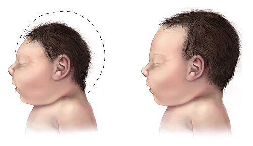
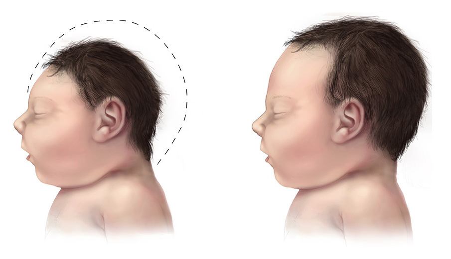

# SÍNDROME CONGÊNITA DO ZIKA

Para entender a Síndrome Congênita do Zika (SCZ), você precisa primeiro esquecer a ideia de que o Zika vírus causa apenas microcefalia. Se você for para a prova com esse pensamento limitado, a banca vai te pegar. A microcefalia é apenas a "ponta do iceberg" de um espectro muito mais amplo de malformações. Como professor, eu já vi muitos alunos perderem questões por não saberem diferenciar o padrão de calcificações do Zika em relação ao Citomegalovírus (CMV) ou por acharem que o Zika contraindica a amamentação.

Neste material, vamos dissecar desde a picada do mosquito até o acompanhamento do recém-nascido, focando no que realmente cai nas provas de residência e no que você precisa saber para a vida prática.

*Figura 1 - Comparação entre recém-nascido com microcefalia por Zika (esquerda) e perímetro cefálico normal (direita). A Síndrome Congênita do Zika resulta do neurotropismo viral com destruição neuronal, causando microcefalia grave, calcificações periventriculares e artrogripose. Fonte: Domínio Público | Wikimedia Commons*

## O Vírus e a Transmissão: Além do Aedes aegypti

O Zika é um Flavivírus, transmitido principalmente pelo *Aedes aegypti*. No entanto, para a prova de Obstetrícia e Infectologia, você deve lembrar que ele possui uma característica que o diferencia de outras arboviroses como Dengue e Chikungunya: a transmissão sexual e a transmissão vertical (transplacentária).

Por que isso é importante? Porque a persistência viral em fluidos corporais é longa. O vírus pode permanecer no sêmen por meses. A recomendação atual do Ministério da Saúde e da OMS é que homens que tiveram infecção confirmada ou suspeita aguardem, no mínimo, 6 meses para tentar a concepção com suas parceiras. Se a mulher teve a infecção, o tempo de espera recomendado é de pelo menos 8 semanas.

Um erro clássico de prova é achar que o Zika é uma endemia estável. Na verdade, ele se manifesta em surtos ou epidemias. Quando o tema é saúde pública, lembre-se: a inclusão do Zika no SINAN (Sistema de Informação de Agravos de Notificação) deve-se à sua Magnitude (número de casos) e, principalmente, à sua Transcendência (gravidade das sequelas e impacto socioeconômico).

## Fisiopatologia: Por que o cérebro não cresce?

O Zika vírus tem um tropismo absurdo pelo sistema nervoso central, especificamente pelas células progenitoras neurais. Imagine que essas células são as "pedreiras" que constroem o cérebro. O vírus invade essas células, promove a apoptose (morte celular programada) e inibe a proliferação.

O resultado não é apenas um cérebro pequeno, mas um cérebro destruído ou que nunca se desenvolveu corretamente. Isso explica por que encontramos:

- Agiria ou paquigiria (ausência ou redução das circunvoluções cerebrais).

- Adelgaçamento cortical (o córtex fica muito fino).

- Agenesia ou hipoplasia do corpo caloso.

- Calcificações subcorticais (guarde esse termo!).

Diferente do CMV, onde as calcificações costumam ser periventriculares (ao redor dos ventrículos), no Zika elas tendem a se localizar na transição entre a substância branca e a substância cinzenta (subcorticais). Essa é uma "pegadinha" recorrente em questões de imagem.

## O Quadro Clínico Materno: O "Rash" que preocupa

Cerca de 80% das infecções por Zika são assintomáticas. Isso é um perigo, pois a ausência de sintomas na mãe não garante que o feto não será afetado. Quando há sintomas, o quadro é geralmente autolimitado e mais leve que o da Dengue.

O sinal patognomônico que você deve buscar no enunciado da questão é o exantema maculopapular pruriginoso, que surge logo nos primeiros dias. Diferente da Dengue, a febre no Zika costuma ser baixa ou até ausente. Outro achado clássico é a conjuntivite não purulenta (olho vermelho que não sai pus).

### Tabela 1: Diagnóstico Diferencial das Arboviroses na Gestação

| Característica | Zika | Dengue | Chikungunya |
| --- | --- | --- | --- |
| Febre | Baixa ou ausente | Alta e súbita | Alta e súbita |
| Exantema | Precoce (1º-2º dia), pruriginoso | Tardio (4º dia em diante) | Frequente |
| Conjuntivite | Muito comum (não purulenta) | Rara | Rara |
| Artralgia | Leve a moderada | Leve | Intensa e incapacitante |
| Mialgia | Leve | Intensa (dor retro-orbitária) | Leve |
| Fenômenos Hemorrágicos | Raros | Comuns em formas graves | Raros |
| Risco Fetal | Microcefalia e SCZ | Prematuridade, óbito fetal | Transmissão no parto (sepse) |

Como diz o Dr. Will nas discussões do MedEvo, "na dúvida entre as três em uma gestante, peça o PCR para as três, mas tema o Zika pelo potencial teratogênico".

## Diagnóstico na Gestante

Se uma gestante apresenta febre, mialgia ou exantema, a investigação é obrigatória.

- RT-PCR: É o padrão-ouro para detectar o RNA viral. Pode ser feito no sangue (até o 5º dia de sintomas) e na urina (até o 15º dia ou mais, pois a excreção urinária é mais prolongada).

- Sorologia (IgM): Realizada após o 5º dia. O grande problema aqui é a reação cruzada com o vírus da Dengue. Se a paciente já teve Dengue, o IgM para Zika pode dar um falso positivo.

Se o diagnóstico for confirmado, o acompanhamento passa a ser de alto risco, com ultrassonografias seriadas (mensais) para avaliar o crescimento do perímetro cefálico fetal e a anatomia cerebral.

*Figura 2 - Microcefalia: comparação entre recém-nascido com perímetro cefálico reduzido (esquerda) e RN com PC normal (direita). A microcefalia é o achado mais marcante da Síndrome Congênita do Zika. Fonte: CDC, Domínio Público | Wikimedia Commons*

## Diagnóstico Pré-natal da Microcefalia

Aqui é onde muitos alunos se confundem com as curvas de crescimento. A definição de microcefalia fetal por ultrassonografia é um Perímetro Cefálico (PC) abaixo de 2 desvios-padrão (-2 DP) para a idade gestacional e sexo.

Cuidado: Se a questão falar em "microcefalia grave", o ponto de corte é abaixo de 3 desvios-padrão (-3 DP).

Se você detectar uma alteração no PC fetal, o próximo passo é procurar por "soft markers" e malformações associadas: calcificações intracranianas, ventriculomegalia e artrogripose (contraturas articulares). A artrogripose ocorre porque o dano cerebral é tão extenso que o feto não se movimenta adequadamente no útero, levando ao encurtamento de tendões e deformidades nas articulações (como o pé torto congênito).

## O Recém-Nascido: Critérios e Avaliação

Ao nascimento, a medida do Perímetro Cefálico é o exame mais importante da triagem. Mas atenção ao detalhe técnico: a medida deve ser feita com fita métrica não extensível, passando pela glabela e pela protuberância occipital externa. O Ministério da Saúde recomenda que a medida oficial para notificação seja feita após as primeiras 24 a 48 horas de vida, para permitir a resolução de eventuais bossas serossanguíneas ou cavalgamentos ósseos que ocorrem durante o parto.

### Critérios da OMS para Microcefalia ao Nascer (RN a termo):

- Meninos: PC ≤ 31,9 cm.

- Meninas: PC ≤ 31,5 cm.

Se o PC estiver abaixo desses valores (que correspondem a -2 DP na curva da OMS), o RN deve ser investigado. Se o PC estiver abaixo de -3 DP (aproximadamente 30,7 cm para meninos e 30,3 cm para meninas), a microcefalia é considerada grave.

Lembre-se de uma pérola clínica importante: um PC normal ao nascimento NÃO exclui a Síndrome Congênita do Zika. Existem casos de "microcefalia pós-natal", onde o cérebro para de crescer após o nascimento devido às lesões virais prévias. Por isso, todo RN de mãe com Zika confirmada precisa de seguimento, mesmo que nasça com PC normal.

### Tabela 2: Classificação do Perímetro Cefálico (RN Termo - 37 a 42 semanas)

| Classificação | Critério Z-score | Significado Clínico |
| --- | --- | --- |
| Normal | Entre -2 e +2 DP | Padrão esperado para a população |
| Microcefalia | < -2 DP | Necessita investigação imediata |
| Microcefalia Grave | < -3 DP | Alto risco de atraso neuropsicomotor grave |

Se você reduzir o ponto de corte (por exemplo, de 33 cm para 32 cm), você aumenta a especificidade (menos falsos positivos), mas diminui a sensibilidade (pode deixar passar casos leves). As bancas adoram cobrar esse raciocínio epidemiológico.

## A Síndrome Congênita do Zika (SCZ) Completa

A SCZ é um conjunto de achados que vai muito além do tamanho da cabeça. Para a prova, memorize este "pentatlo" de achados:

- Microcefalia grave com colapso do crânio: A calota craniana se molda ao cérebro menor, gerando um aspecto de "crânio encavalgado" e excesso de pele no couro cabeludo.

- Anormalidades cerebrais: Calcificações subcorticais, agenesia de corpo caloso e ventriculomegalia *ex vacuo* (o ventrículo aumenta porque o tecido cerebral ao redor morreu).

- Anormalidades oculares: Cicatrizes maculares e pigmentação focal da retina. Isso pode levar à cegueira.

- Artrogripose: Contraturas congênitas de grandes articulações (quadril, joelhos, cotovelos) e pés tortos.

- Hipertonia precoce: O bebê já nasce muito rígido, com sinais de liberação piramidal.

Dica de prova: Malformações cardíacas complexas NÃO fazem parte do quadro típico da Zika. Se a questão mostrar um bebê com microcefalia e uma cardiopatia grave (como Transposição de Grandes Artérias), pense em outras causas, como a Síndrome alcoólica fetal ou alterações cromossômicas.

## Diagnóstico Diferencial: O Grupo TORCH

Este é o tópico preferido das bancas. Você precisa saber diferenciar o Zika das outras infecções congênitas.

- Citomegalovírus (CMV): É a causa mais comum de infecção congênita. Causa microcefalia, mas as calcificações são tipicamente periventriculares. Frequentemente apresenta petéquias, hepatoesplenomegalia e icterícia neonatal (quadro de "sepse viral"). O tratamento é feito com Ganciclovir.

- Toxoplasmose: Apresenta a Tríade de Sabin (coriorretinite, hidrocefalia e calcificações intracranianas difusas). Note que a Toxoplasmose causa hidrocefalia (cabeça grande por acúmulo de líquor), enquanto o Zika causa microcefalia.

- Síndrome Alcoólica Fetal (SAF): Causa microcefalia e restrição de crescimento, mas o que define a SAF na prova são as dismorfias faciais: lábio superior fino, filtro nasal liso e fendas palpebrais curtas.

- Sífilis Congênita: Causa hepatoesplenomegalia, rinite serossanguinolenta e lesões palmo-plantares. Não costuma causar microcefalia isolada.

### Tabela 3: Diferencial de Calcificações e Achados de Imagem

| Etiologia | Padrão de Calcificação | Achado Característico |
| --- | --- | --- |
| Zika Vírus | Subcortical (transição branca/cinzenta) | Colapso craniano, artrogripose |
| CMV | Periventricular | Surdez neurossensorial, petéquias |
| Toxoplasmose | Difusas (espalhadas pelo parênquima) | Hidrocefalia, coriorretinite |
| Rubéola | Vasculares (núcleos da base) | Catarata, cardiopatia (PCA) |

## Manejo e Conduta: O que fazer com o RN?

Não existe tratamento antiviral específico para o Zika. O manejo é baseado no suporte e na estimulação precoce.

- Notificação: A suspeita de microcefalia por Zika é um Evento de Saúde Pública de Importância Nacional (ESPIN) e deve ser notificada imediatamente no Registro de Eventos de Saúde Pública (RESP).

- Amamentação: Esta é a maior pegadinha de todas. O Zika vírus pode ser detectado no leite materno, mas NÃO há evidências de transmissão por essa via que causem doença. Portanto, a amamentação está RECOMENDADA e NÃO deve ser interrompida, mesmo que a mãe esteja na fase aguda da infecção. O benefício do leite materno supera qualquer risco teórico.

- Exames no RN: Se houver suspeita, solicitar US de crânio (ou Tomografia se a fontanela estiver fechada), avaliação oftalmológica (fundo de olho) e avaliação auditiva (BERA/PEATE). O teste da orelhinha comum (EOA) pode vir normal, mas o dano pode ser central, por isso o PEATE é preferível.

- Investigação Laboratorial: Coletar sangue, urina e, se possível, líquor do RN para RT-PCR e sorologia.

## Prevenção: A única arma real

Como não temos vacina, a prevenção foca no controle do vetor e na barreira física.

- Repelentes: Gestantes podem e devem usar repelentes. Os princípios ativos seguros são DEET, Icaridina e IR3535.

- Roupas: Uso de mangas longas e calças, preferencialmente de cores claras (que atraem menos o mosquito).

- Ambiente: Telas em janelas e eliminação de criadouros.

- Transmissão Sexual: Uso de preservativos durante toda a gestação, especialmente se o parceiro viajou para áreas endêmicas ou teve sintomas.

## Prognóstico e Aspectos Éticos

O prognóstico da SCZ é reservado. A maioria das crianças apresenta atraso global do desenvolvimento, epilepsia de difícil controle e disfagia (dificuldade de engolir), o que aumenta o risco de pneumonias aspirativas.

Em termos de assistência obstétrica, um feto com diagnóstico de microcefalia por Zika não indica, por si só, uma cesariana. O parto pode ser vaginal e em maternidade de risco habitual, a menos que haja outra indicação obstétrica ou que a microcefalia esteja associada a outras condições que exijam suporte de UTI neonatal imediato.

## Pontos-Chave para Prova

- Microcefalia ao nascer (Termo): PC ≤ 31,9 cm (meninos) e ≤ 31,5 cm (meninas). Use a curva da OMS/Intergrowth-21st.

- Z-score: Microcefalia é < -2 desvios-padrão. Microcefalia grave é < -3 desvios-padrão.

- Amamentação: NUNCA contraindique a amamentação por causa do Zika. O benefício supera o risco.

- Calcificações: No Zika são subcorticais. No CMV são periventriculares.

- Chikungunya: NÃO causa microcefalia. Causa febre alta e dor articular intensa. A transmissão vertical ocorre no momento do parto (periparto).

- Transmissão Sexual: Homens infectados devem aguardar 6 meses para concepção.

- Artrogripose: É uma marca da SCZ devido ao dano neurológico central que impede a movimentação fetal.

- Diagnóstico Materno: RT-PCR em sangue (até 5 dias) e urina (até 15 dias).

- Notificação: É compulsória e imediata (RESP).

- Síndrome Alcoólica Fetal (SAF): Diferencial importante. Busque por lábio superior fino e filtro nasal liso.

- Primeiro Trimestre: É o período de maior risco para malformações graves, mas a infecção em qualquer idade gestacional pode ser perigosa.

- Oftalmologia: Todo bebê com suspeita de Zika deve fazer fundo de olho (risco de cicatriz macular).

- Auditivo: O exame de escolha para seguimento é o PEATE (BERA), pois a lesão pode ser retrococlear.

- Vacinação: A vacina contra Rubéola é contraindicada na gestação (vírus vivo atenuado). Se a questão misturar vacinas e Zika, lembre-se disso.

- Pés tortos congênitos: Se aparecer em um cenário de arbovirose, notifique e investigue Zika.

- Falsos Positivos: A sorologia IgM para Zika tem muita reação cruzada com Dengue. O PCR é mais confiável na fase aguda.

- Muito Baixo Peso ao Nascer (MBPN): É o RN com peso < 1500g, independente da idade gestacional. Pode ocorrer na SCZ por restrição de crescimento.

Ao revisar este tema para a prova, lembre-se sempre da lógica: o Zika destrói o tecido neural em formação. Tudo o que depende do cérebro (tamanho da cabeça, visão, audição, movimento dos membros) estará prejudicado. Se você seguir esse raciocínio e não esquecer as regras da amamentação e do PC, você vai acertar qualquer questão sobre o assunto.

 Cópia offline para consulta pessoal.
 Fonte original:
 [https://www.medevo.com.br/material-apoio/ler/975c2df1-9dbe-4e75-a005-e5bf44a6400d](https://www.medevo.com.br/material-apoio/ler/975c2df1-9dbe-4e75-a005-e5bf44a6400d)
