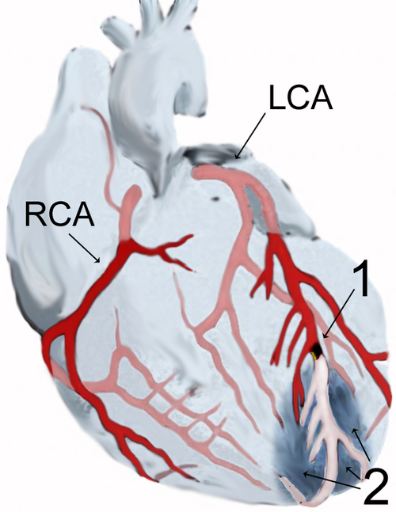
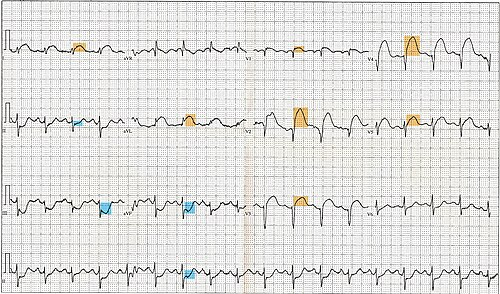
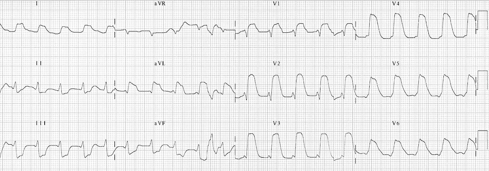
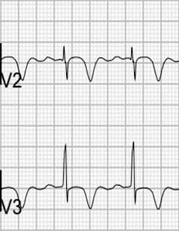
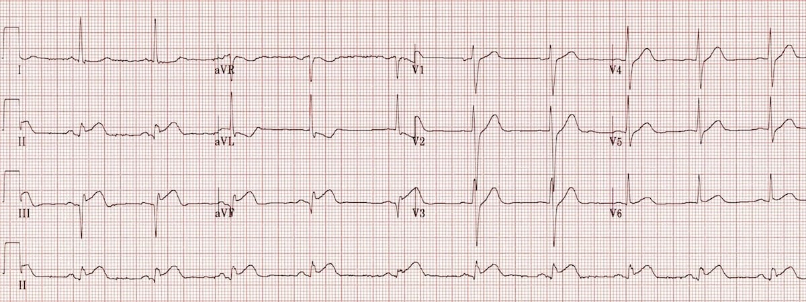

# SÍNDROME CORONARIANA AGUDA

Para entender a Síndrome Coronariana Aguda (SCA), você precisa parar de ver o coração como uma bomba isolada e passar a vê-lo como um sistema hidráulico dependente de fluxo. A SCA não é uma doença única, mas um espectro que vai da angina instável ao infarto com supradesnivelamento do segmento ST (IAMCSST).

O que define para onde o seu paciente vai é a anatomia do trombo. Como o Dr. Will costuma dizer nas discussões de caso do MedEvo: "O eletrocardiograma é a sua janela para a patologia do vaso".

## Fisiopatologia: O Trombo Vermelho vs. O Trombo Branco

Por que dividimos a SCA em "com supra" e "sem supra"? Não é apenas por capricho eletrocardiográfico. A diferença está na oclusão.

No **IAM com supra de ST (IAMCSST)**, temos uma oclusão total da artéria coronária. O trombo é rico em fibrina e hemácias, o chamado **trombo vermelho**. Como a oclusão é total, a isquemia é transmural (atinge toda a espessura da parede), o que gera o supradesnivelamento no ECG. Aqui, o tempo é músculo. Se você não abrir o vaso, o tecido morre.

Na **SCA sem supra de ST (SCASSST)**, que engloba a Angina Instável e o IAM sem supra (IAMSSST), a oclusão é subtotal ou intermitente. O trombo é predominantemente plaquetário, o **trombo branco**. A isquemia é subendocárdica.

**Cuidado:** Muitos alunos erram ao achar que a conduta inicial é igual. No trombo vermelho (com supra), usamos fibrinolíticos se a angioplastia não estiver disponível. No trombo branco (sem supra), o fibrinolítico é PROIBIDO, pois pode desestabilizar o trombo e piorar a oclusão, além de não haver benefício comprovado.

## Quadro Clínico e Diagnóstico Diferencial

A dor torácica é o sintoma cardinal, mas a banca vai tentar te pegar nos detalhes. A dor típica é retroesternal, em aperto ou peso, que irradia para o braço esquerdo, mandíbula ou dorso, frequentemente acompanhada de sintomas autonômicos (sudorese, náuseas, vômitos).

### Os Equivalentes Isquêmicos

Fique atento aos idosos, mulheres e diabéticos. Nesses grupos, a SCA pode se manifestar apenas como dispneia, síncope ou mal-estar epigástrico. Se uma paciente diabética chega ao pronto-socorro com náuseas e sudorese, o primeiro exame DEVE ser um ECG em até 10 minutos.

### Diagnóstico Diferencial: A Dor que não é SCA

Nem toda dor no peito é infarto. O desafio é filtrar as emergências fatais:

- **Dissecção Aguda de Aorta:** Dor lancinante, "em rasgo", que irradia para as escápulas. Há assimetria de pulsos e de pressão arterial entre os membros.

- **Tromboembolismo Pulmonar (TEP):** Dor pleurítica, dispneia súbita e taquicardia. No ECG, procure pelo padrão S1Q3T3 (clássico, mas raro) ou taquicardia sinusal.

- **Pericardite:** Dor que melhora ao inclinar o corpo para frente (posição prece maometana). No ECG, o supra de ST é difuso e côncavo ("em sela"), com depressão do segmento PR.

- **Espasmo Esofágico:** Pode mimetizar perfeitamente a angina e até melhorar com nitrato. A história clínica de disfagia ajuda a diferenciar.

## O Eletrocardiograma: A Chave do Tratamento

O ECG deve ser realizado e interpretado em no máximo 10 minutos.

### Critérios de Supradesnivelamento de ST

Para ser considerado um IAMCSST, o supra deve estar presente em pelo menos duas derivações contíguas:

- Homens < 40 anos: ≥ 2,5 mm em V2-V3.

- Homens ≥ 40 anos: ≥ 2,0 mm em V2-V3.

- Mulheres: ≥ 1,5 mm em V2-V3.

- Demais derivações: ≥ 1,0 mm para todos.

**Pérola de Prova:** BRE novo ou presumivelmente novo **não é, sozinho, diagnóstico automático de IAMCSST**. Mas, se vier com dor típica, instabilidade ou critérios de Sgarbossa/modificado, trate como oclusão coronariana até prova em contrário e não atrase a hemodinâmica esperando troponina.

### Localização da Parede Infartada

A banca vai te dar as derivações e pedir a artéria culpada:

| Derivações com Supra de ST | Parede Acometida | Artéria Culpada (Mais frequente) |
| --- | --- | --- |
| **V1 - V2** | Septal | Descendente Anterior (DA) |
| **V3 - V4** | Anterior | Descendente Anterior (DA) |
| **V5 - V6, DI, aVL** | Lateral | Circunflexa (Cx) |
| **DII, DIII, aVF** | Inferior | Coronária Direita (CD - 80%) / Cx (20%) |
| **V1 - V6, DI, aVL** | Anterior Extenso | Descendente Anterior (Ostial/Proximal) |

### Padrões Especiais que você não pode ignorar

- **Padrão de Wellens:** Ondas T bifásicas em V2-V3 ou invertidas simétricas e profundas de V2-V4. Indica estenose grave da DA proximal. Esse paciente não pode ir para o teste de esforço; ele precisa de cateterismo.

- **Infarto de Ventrículo Direito (VD):** Ocorre em cerca de 30-50% dos infartos de parede inferior. Se o paciente tem supra em II, III e aVF, você OBRIGATORIAMENTE deve rodar as derivações direitas (V3R e V4R).

* *Clínica do VD:* Hipotensão, pulmões limpos e turgência jugular (Sinal de Kussmaul).
* *Tratamento do VD:* Volume (soro fisiológico) e EVITAR nitratos e diuréticos, pois o VD infartado depende totalmente da pré-carga.

## Biomarcadores de Necrose Miocárdica

A troponina é o padrão-ouro. Ela é altamente específica para o músculo cardíaco.

- **Troponina I e T:** Elevam-se em 3-6 horas e podem permanecer alteradas por até 14 dias. Em pacientes com Insuficiência Renal Crônica (IRC), a Troponina I é mais confiável, pois a T pode estar cronicamente elevada.

- **Mioglobina:** É o marcador que sobe mais rápido (1-2 horas), mas é muito inespecífico (qualquer trauma muscular eleva). Serve para o valor preditivo negativo: se a mioglobina estiver normal após 3 horas de dor, a chance de ser infarto é mínima.

- **CK-MB:** Útil para diagnosticar reinfarto precocemente, pois volta ao normal em 48-72 horas. Se o paciente infartou há 4 dias e volta a ter dor com nova subida de CK-MB, ele reinfartou.

## Manejo do IAM com Supra de ST (IAMCSST)

Aqui a estratégia é REPERFUSÃO. Você tem duas opções: Intervenção Coronária Percutânea (ICP/Angioplastia) ou Fibrinólise.

### Tempos que Caem em Prova (ESC 2023)

A diretriz ESC 2023 mudou a forma de cobrar os tempos: o relógio principal passa a ser **do diagnóstico de IAMCSST ao cruzamento do fio-guia** ("diagnosis-to-wire"), e não apenas o antigo "porta-balão".

| Cenário | Conduta | Meta prática |
| --- | --- | --- |
| Hospital com hemodinâmica | ICP primária | **Diagnóstico → fio-guia em até 60 min** |
| Hospital sem hemodinâmica, mas transferência viável | Transferir para ICP primária | ICP se o tempo esperado até reperfusão for **≤ 120 min**; idealmente diagnóstico → fio-guia em até **90 min** após transferência |
| ICP não será possível dentro de 120 min | Fibrinólise imediata se não houver contraindicação | **Diagnóstico → fibrinolítico em até 10 min** |

**Como isso aparece em prova:** os números antigos **90/120 min para ICP** e **30 min para fibrinólise** ainda aparecem em protocolos e diretrizes americanas/serviços, mas, quando a questão citar **ESC 2023** ou falar em **primeiro contato/diagnóstico até fio-guia**, use **60 min** para hospital com hemodinâmica e **10 min** para fibrinólise.

### Fibrinólise

Use fibrinólise no IAMCSST com início dos sintomas geralmente **≤ 12 horas**, sem contraindicações, quando a ICP primária não couber no prazo de 120 minutos. O agente preferido é a **Tenecteplase (TNK)** por bolus único e maior especificidade pela fibrina.

- **Meta ESC 2023:** iniciar o fibrinolítico em até **10 minutos após o diagnóstico** quando essa for a estratégia escolhida.

- **Adjuntos obrigatórios:** AAS + **clopidogrel** (não prasugrel), anticoagulação com enoxaparina ou HNF conforme idade/função renal/protocolo, e monitorização contínua.

- **Idosos:** em pacientes ≥ 75 anos, protocolos atuais costumam usar **dose reduzida de tenecteplase** pelo risco de sangramento intracraniano.

- **Critérios de Reperfusão:** melhora da dor, arritmia de reperfusão e redução do supra de ST em > 50% após 60-90 minutos da trombólise.

- **Se falhar:** dor persistente, instabilidade ou queda insuficiente do supra → **angioplastia de resgate imediata**.

- **Estratégia Fármaco-Invasiva:** mesmo que a trombólise funcione, encaminhar para angiografia/ICP de rotina em **2 a 24 horas**.

| Contraindicações Absolutas à Fibrinólise |
| --- |
| AVC Isquêmico nos últimos 6 meses |
| AVC Hemorrágico em qualquer momento da vida |
| Neoplasia de Sistema Nervoso Central ou Malformação Arteriovenosa |
| Trauma de crânio ou cirurgia intracraniana recente (< 3 semanas) |
| Sangramento gastrointestinal ativo (exceto menstruação) |
| Suspeita de Dissecção de Aorta |
| Diátese hemorrágica conhecida |

**Erro comum:** Achar que a Estreptoquinase ainda é a primeira linha. Ela quase não é mais usada devido ao alto risco alérgico e menor eficácia comparada aos fibrinolíticos fibrino-específicos. Além disso, com a Estreptoquinase, a anticoagulação plena não é recomendada de imediato pelo risco de sangramento.

## Manejo da SCA sem Supra de ST (SCASSST)

Aqui não há pressa para abrir o vaso em minutos, mas sim uma necessidade de **estratificação de risco**. Usamos escores como TIMI e GRACE.

### Estratificação de Risco (Diretriz SBC 2021)

- **Risco Muito Alto (CATE imediato < 2h):** Instabilidade hemodinâmica, choque cardiogênico, dor refratária ao tratamento clínico, arritmias graves ou insuficiência cardíaca aguda.

- **Risco Alto (CATE em até 24h):** Elevação de troponina, escore GRACE > 140, ou alterações dinâmicas do segmento ST.

- **Risco Intermediário (CATE em até 72h):** Diabéticos, IRC, FE < 40% ou escore GRACE entre 109 e 140.

Se o paciente for de **Baixo Risco** (HEART Score ≤ 3, troponina negativa), ele pode realizar um teste funcional (teste ergométrico ou angio-TC de coronárias) antes de decidir pelo CATE.

## Tratamento Inicial: Checklist das Primeiras Horas

Antes de decorar remédio, pense em objetivos. O tratamento da SCA quer: **aliviar isquemia, impedir crescimento do trombo, reperfundir quando houver supra e reduzir recorrência/mortalidade**.

- **Monitorização e segurança:** acesso venoso, monitor cardíaco, desfibrilador disponível, ECG seriado e troponina seriada se não houver supra.

- **Reperfusão imediata se IAMCSST:** escolha ICP ou fibrinólise pelos tempos acima. Não espere troponina quando o ECG e a clínica já fecham IAM com supra.

- **Antiagregação precoce:** AAS mastigado para todos sem contraindicação + segundo antiplaquetário conforme estratégia.

- **Anticoagulação:** HNF/enoxaparina/fondaparinux conforme cenário, para frear propagação do trombo.

- **Controle de sintomas e demanda:** nitrato se puder, analgesia se dor refratária, betabloqueador apenas se estável.

- **Prevenção desde o dia 1:** estatina de alta intensidade, IECA/BRA quando indicado, controle de PA, glicemia, tabagismo e reabilitação.

## Terapia Farmacológica Adjuvante (O "MONA-BICH")

Este mnemônico ajuda, mas cuidado: nem todo paciente recebe tudo. A lógica é tratar o trombo e a isquemia sem derrubar o paciente.

- **Morfina:** Apenas para dor refratária. Cuidado: ela pode reduzir a absorção de inibidores P2Y12 (Clopidogrel/Ticagrelor).

- **Oxigênio:** Apenas se saturação < 90%. O excesso de oxigênio causa vasoconstrição coronariana hiperóxica e aumenta a área do infarto.

- **Nitratos:** Aliviam a dor e reduzem a pré-carga. **Contraindicações:** Infarto de VD, uso de inibidores da fosfodiesterase-5 (Sildenafil nas últimas 24h ou Tadalafil nas últimas 48h) e PAS < 90 mmHg.

- **Aspirina (AAS):** 200-300 mg (mastigados para absorção rápida). É a droga que mais reduz mortalidade isoladamente. Deve ser mantida para sempre (81-100 mg/dia).

- **Betabloqueadores:** Iniciados nas primeiras 24h se o paciente estiver estável. **Contraindicações:** Sinais de insuficiência cardíaca (Killip > I), risco de choque cardiogênico, bradicardia ou asma grave.

- **Inibidores P2Y12 (Dupla Antiagregação):**

- *Ticagrelor ou Prasugrel:* preferenciais quando a estratégia for invasiva/ICP e não houver contraindicação.

- *Clopidogrel:* escolha na fibrinólise, em alto risco de sangramento, idosos frágeis ou quando os outros não estiverem disponíveis.

- *Prasugrel:* evite se houver AVC/AIT prévio; em geral, use após conhecer a anatomia e decidir por ICP.

- **Anticoagulação:**

- *IAMCSST:* Heparina Não Fracionada (HNF) ou Enoxaparina.

- *SCASSST:* Fondaparinux (preferencial pelo menor risco de sangramento) ou Enoxaparina.

- **Estatinas:** Alta intensidade (Atorvastatina 40-80 mg ou Rosuvastatina 20-40 mg) para todos, independentemente do nível de colesterol inicial.

- **IECA/BRA:** Iniciados precocemente, especialmente se houver disfunção ventricular (FE < 40%), hipertensão ou diabetes.

## Complicações Pós-Infarto

As complications podem ser divididas em elétricas e mecânicas.

### Elétricas

A principal causa de morte súbita no IAM é a **Fibrilação Ventricular (FV)**. Se ocorrer nas primeiras 48h, geralmente é por instabilidade elétrica da isquemia. Se ocorrer após 48h, indica cicatriz e disfunção ventricular grave.

- *Tratamento da FV:* Desfibrilação imediata (200J bifásico).

### Mecânicas (Geralmente entre o 3º e 7º dia)

- **Ruptura de Parede Livre:** Causa tamponamento cardíaco súbito e Atividade Elétrica Sem Pulso (AESP). Mortalidade altíssima.

- **Ruptura de Septo Interventricular:** Gera um shunt esquerda-direita. Você ouvirá um sopro holossistólico rude na borda esternal esquerda.

- **Insuficiência Mitral Aguda (Ruptura de Músculo Papilar):** Mais comum no infarto inferior. Causa edema agudo de pulmão súbito e sopro sistólico no ápice.

### Classificação de Killip (Prognóstico no IAM)

- **Killip I:** Sem sinais de IC. Mortalidade baixa (6%).

- **Killip II:** Presença de estertores em bases pulmonares ou B3.

- **Killip III:** Edema agudo de pulmão franco.

- **Killip IV:** Choque cardiogênico (hipotensão + sinais de má perfusão). Mortalidade alta (> 80%).

## Situações Especiais e Pegadinhas de Prova

### Angina de Prinzmetal (Angina Variante)

É causada por vasoespasmo coronariano, não por placa de ateroma.

- *Perfil:* Paciente jovem, tabagista, dor em repouso (geralmente à noite).

- *ECG:* Supra de ST transitório que desaparece com o uso de nitrato.

- *Tratamento:* Bloqueadores de Canais de Cálcio (BCC) e Nitratos. **Betabloqueadores são contraindicados** pois podem piorar o vasoespasmo por ação alfa-adrenérgica sem oposição.

### Cocaína e SCA

A cocaína causa um estado adrenérgico maciço, levando a vasoespasmo, hipertensão e taquicardia.

- *Tratamento:* Benzodiazepínicos (para acalmar o sistema adrenérgico), Nitratos e AAS.

- *Proibido:* Betabloqueadores (pelo mesmo motivo da Prinzmetal).

### Choque Cardiogênico

Se o paciente chega em Killip IV, a prioridade é a revascularização imediata. O suporte hemodinâmico com Noradrenalina e, às vezes, Dobutamina é necessário, mas nada substitui a abertura da artéria. A expansão volêmica deve ser muito cautelosa, apenas se houver suspeita de hipovolemia associada ou infarto de VD.

## Metas Terapêuticas e Prevenção Secundária

O tratamento não acaba na alta. O paciente pós-SCA sai com metas claras:

| Alvo | Meta prática |
| --- | --- |
| **Antiagregação** | AAS por tempo indeterminado + P2Y12 por ~12 meses, ajustando se alto risco de sangramento ou necessidade de anticoagulação oral |
| **LDL-colesterol** | Estatina de alta intensidade desde a internação; alvo moderno: **LDL < 55 mg/dL e redução ≥ 50% do basal**. Se recorrência muito precoce, considerar alvo ainda menor conforme especialista |
| **Pressão arterial** | Geralmente < 130/80 mmHg se tolerado, evitando hipotensão no pós-IAM imediato |
| **Frequência cardíaca/demanda** | Betabloqueador se FE reduzida, arritmia, angina ou IAM extenso; evitar em choque, IC aguda, bradicardia importante ou broncoespasmo grave |
| **Remodelamento ventricular** | IECA/BRA precocemente se FE ≤ 40%, IAM anterior, HAS, DM ou DRC; considerar antagonista mineralocorticoide se FE ≤ 40% + IC/DM e função renal permitir |
| **Reabilitação** | Cessar tabagismo, dieta mediterrânea/DASH, atividade física supervisionada/reabilitação cardíaca e vacinação quando indicada |
| **Seguimento** | Reavaliar sintomas, adesão, efeitos adversos, PA, LDL e função renal; ecocardiograma para estratificar FE quando indicado |

Em prova, guarde: **AAS + P2Y12 + estatina forte + controle de fatores de risco**. O resto entra conforme estabilidade, função ventricular e contraindicações.

## Pontos-Chave para Prova 💡

- **Tempo é músculo:** No IAMCSST, ESC 2023 cobra diagnóstico → fio-guia em até 60 min no hospital com ICP; transferir se reperfusão por ICP couber em ≤ 120 min (ideal diagnóstico → fio-guia ≤ 90 min); se não couber, fibrinólise em até 10 min.

- **Trombo Vermelho vs. Branco:** Fibrinolítico **SÓ** no "com supra". No "sem supra", ele aumenta a mortalidade.

- **Infarto de VD:** Tríade de hipotensão, pulmões limpos e turgência jugular. Tratamento é **VOLUME**. Nitrato é veneno aqui.

- **BRE novo + dor típica/instabilidade:** Trate como alto risco; use Sgarbossa/modificado e não atrase hemodinâmica se a suspeita de oclusão for alta.

- **Contraindicações Absolutas da Fibrinólise:** Decore o AVC hemorrágico (sempre), AVC isquêmico (< 6 meses) e sangramento ativo.

- **Betabloqueadores:** Não use se o paciente estiver em Killip II ou superior (insuficiência cardíaca aguda) ou se houver risco de choque.

- **Cocaína e Prinzmetal:** NUNCA use betabloqueadores. Use BCC e Nitratos.

- **Padrão de Wellens:** Indica lesão grave de DA proximal. Risco altíssimo de infarto anterior extenso.

- **Troponina na IRC:** A Troponina I é mais específica que a T.

- **Sinal de Kussmaul:** Aumento da turgência jugular na inspiração, típico do infarto de VD.

- **Morfina e P2Y12:** A morfina retarda a ação do Clopidogrel/Ticagrelor. Use apenas se a dor for insuportável.

- **Oxigênio:** Só se SatO2 < 90%. Hiperóxia causa vasoconstrição coronariana.

- **Killip IV:** É choque cardiogênico. A conduta é revascularização de emergência.

- **Escore GRACE > 140:** Indica alto risco na SCASSST, exigindo CATE em até 24 horas.

- **AAS:** É a droga inicial mais importante. Deve ser mastigada (200-300 mg).

- **Meta lipídica pós-SCA:** Estatina de alta intensidade; alvo LDL < 55 mg/dL + redução ≥ 50% do basal.

- **Sopro novo pós-IAM:** Pense em complicação mecânica (Ruptura de septo ou de músculo papilar).

Lembre-se: na prova de residência, a banca quer saber se você sabe identificar quem está morrendo (IAMCSST) e se você sabe estratificar quem pode morrer em breve (SCASSST). No detalhe dos tempos, siga a referência do enunciado: **ESC 2023 cobra 60/90-120/10**; protocolos clássicos/americanos ainda podem trazer 90/120/30. Como dizemos no MedEvo, o segredo está na sistematização do atendimento.

 Cópia offline para consulta pessoal.
 Fonte original:
 [https://www.medevo.com.br/material-apoio/ler/fe7bd87a-6387-4c6a-99b4-a7b9de6a6416](https://www.medevo.com.br/material-apoio/ler/fe7bd87a-6387-4c6a-99b4-a7b9de6a6416)
