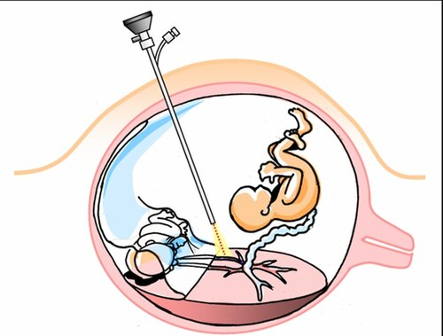

# SÍNDROME DA TRANSFUSÃO FETO-FETAL

Para entender a Síndrome da Transfusão Feto-Fetal, ou STFF, você precisa primeiro esquecer a ideia de que gêmeos dividem tudo de forma justa. Na obstetrícia de alto nível, especialmente na gemelaridade monocoriônica, a placenta é um território de disputa hemodinâmica. Se você entender a placenta, você entende a prova.

A STFF é uma complicação exclusiva das gestações monocoriônicas. Guarde isso: se a prova descrever uma gestação dicoriônica (dois placentas separadas, sinal do "T" invertido ou sinal do "lambda" presente), a alternativa que fala em STFF está errada. A base de tudo aqui é a presença de anastomoses vasculares placentárias que conectam as circulações dos dois fetos.

O diagrama a seguir ilustra o mecanismo central da STFF — observe como as anastomoses vasculares placentárias criam um fluxo desbalanceado entre o gêmeo doador (que fica hipovolêmico e oligúrico) e o gêmeo receptor (que desenvolve hipervolemia e poliúria):

*Figura 1 - Representação esquemática da Síndrome da Transfusão Feto-Fetal (STFF): anastomoses arteriovenosas na placenta compartilhada conectam as circulações dos gêmeos monocoriônicos, gerando um desequilíbrio hemodinâmico — o doador perde volume e o receptor acumula. Fonte: Kevin Dufendach, CC BY 3.0 | Wikimedia Commons*

## Fisiopatologia: O "Porquê" do Desequilíbrio

Por que alguns gêmeos monocoriônicos vivem bem e outros desenvolvem a síndrome? A resposta está no tipo e na direção do fluxo nessas anastomoses. Em uma gestação monocoriônica normal, existem anastomoses superficiais (artéria-artéria ou veia-veia) que permitem um fluxo bidirecional e compensatório. É como um sistema de vasos comunicantes que mantém o equilíbrio.

Na STFF, o problema são as anastomoses arteriovenosas (AV) profundas. Imagine que uma artéria do feto A entra em um cotilédone placentário e, em vez de retornar como veia para o feto A, o sangue é drenado pela veia do feto B. Temos aqui um "shunt" unidirecional.

### O Gêmeo Doador (O "Esquecido")

Este feto está literalmente doando seu volume sanguíneo para o irmão. O resultado é uma hipovolemia crônica. Para tentar compensar, o organismo do doador ativa o sistema renina-angiotensina-aldosterona ao máximo. Ele para de urinar para poupar volume (anúria), o que leva ao oligodramnio (maior bolsão vertical < 2 cm). Como ele não tem volume e está em sofrimento, ele cresce menos (RCIU) e pode desenvolver anemia.

### O Gêmeo Receptor (O "Sobrecarregado")

Este feto recebe um aporte excessivo de volume. Ele fica hipervolêmico. O coração dele precisa trabalhar dobrado para bombear esse sangue extra, o que gera um aumento do peptídeo natriurético atrial. O resultado? Ele urina excessivamente (poliúria), gerando o polidramnio (maior bolsão vertical > 8 cm). O problema é que essa sobrecarga volêmica leva à insuficiência cardíaca congestiva, hipertrofia miocárdica e, eventualmente, hidropisia.

**Dica de Prova:** A banca vai tentar te confundir dizendo que o receptor é o "saudável" porque é maior. Mentira. O receptor morre de insuficiência cardíaca por sobrecarga, enquanto o doador morre de hipoperfusão e restrição severa. Ambos estão em risco altíssimo.

## Critérios Diagnósticos e Ultrassonografia

O diagnóstico da STFF é puramente ultrassonográfico. Você não precisa de exames invasivos para fechar o quadro inicial. Mas atenção: o diagnóstico exige a presença de dois critérios fundamentais e simultâneos em uma gestação monocoriônica diamniótica.

- **Polidramnio no feto receptor:** Definido como o Maior Bolsão Vertical (MBV) > 8 cm (antes de 20 semanas) ou > 10 cm (após 20 semanas).

- **Oligodramnio no feto doador:** Definido como MBV < 2 cm.

Muitos alunos erram questões por acharem que a diferença de peso é obrigatória para o diagnóstico. Cuidado: a discrepância de peso (geralmente > 20%) é comum, mas o que define a STFF é a discrepância de líquido amniótico (sequência polidramnio-oligodramnio). Se houver diferença de peso com líquido normal e Dopplers normais, o diagnóstico provável é Restrição de Crescimento Intrauterino (RCIU) seletiva, e não STFF.

Como o Dr. Will sempre enfatiza nas discussões de caso do MedEvo, a visualização da bexiga é o próximo passo lógico após avaliar o líquido. Se você não vê a bexiga do doador, a situação está progredindo.

## Estadiamento de Quintero: A Régua do Prognóstico

Este é, sem dúvida, o tópico mais cobrado em provas de residência sobre STFF. Você precisa memorizar os cinco estágios, pois a conduta depende diretamente deles. O estadiamento de Quintero não é necessariamente linear (um paciente pode pular do I para o III), mas ele dita a gravidade.

| Estágio | Achados Ultrassonográficos | Significado Clínico |
| --- | --- | --- |
| **I** | Sequência Polidramnio/Oligodramnio | Bexiga do doador ainda é visível. |
| **II** | Bexiga do doador não é visualizada | Anúria instalada no doador. |
| **III** | Doppler alterado em qualquer feto | Diástole zero/reversa na artéria umbilical ou ducto venoso reverso. |
| **IV** | Hidropisia fetal | Geralmente no receptor (insuficiência cardíaca). |
| **V** | Óbito de um ou ambos os fetos | Prognóstico reservado para o sobrevivente. |

**Pegadinha Clássica:** A banca pode dizer que o Estágio II apresenta Doppler alterado. Errado. No Estágio II, o Doppler ainda está normal, o marcador de gravidade é apenas a ausência da bexiga visível no doador durante todo o exame (pelo menos 60 minutos de observação).

## Diagnóstico Diferencial: Não Confunda!

Na hora da prova, o examinador vai colocar três entidades no mesmo cesto para te confundir. Vamos separar o joio do trigo.

### 1. Restrição de Crescimento Intrauterino (RCIU) Seletiva

Aqui, o problema não é necessariamente o desequilíbrio de fluxo entre os fetos, mas sim uma partilha desigual da placenta (um feto ficou com uma "fatia" muito pequena).

- **Diferença:** Na RCIU seletiva, há discrepância de peso (> 25%), mas o líquido amniótico costuma estar normal ou apenas levemente reduzido no feto menor. Não há o polidramnio maciço no outro feto.

### 2. Sequência de Anemia-Policitemia (TAPS)

Esta é uma forma crônica de transfusão através de anastomoses muito pequenas (capilares).

- **Diferença:** Não há discrepância de líquido amniótico. O diagnóstico é feito pelo Doppler da artéria cerebral média (ACM). O doador tem pico de velocidade sistólica (PVS) alto (anemia) e o receptor tem PVS baixo (policitemia).

### 3. Sequência de Perfusão Arterial Reversa (TRAP) - Feto Acárdico

Esta é uma complicação bizarra onde um feto malformado (sem coração funcional) é "alimentado" pelo feto saudável (bombeador).

- **Diferença:** Você verá um feto com anomalias estruturais graves (frequentemente apenas membros inferiores e tronco) e um fluxo arterial que entra no feto acárdico pela artéria umbilical (fluxo reverso).

| Característica | STFF | TAPS | RCIU Seletiva |
| --- | --- | --- | --- |
| **Líquido Amniótico** | Discrepância (Poli/Oligo) | Normal | Normal ou pouco alterado |
| **Peso Fetal** | Pode ser diferente | Geralmente similar | Muito diferente (>25%) |
| **Doppler ACM** | Normal (inicialmente) | Alterado (Anemia/Policitemia) | Normal |
| **Causa Principal** | Anastomoses AV profundas | Anastomoses capilares mínimas | Divisão placentária desigual |

## Conduta e Tratamento: O que fazer?

A história natural da STFF sem tratamento é catastrófica, com mortalidade perinatal chegando a 70-90% nos casos graves. Por isso, a intervenção mudou o jogo.

### Laser-coagulação Fetoscópica das Anastomoses

A ilustração a seguir demonstra o princípio da fetoscopia com fotocoagulação a laser — observe o fetoscópio sendo introduzido na cavidade amniótica para coagular seletivamente as anastomoses vasculares placentárias:

*Figura 2 - Representação esquemática da cirurgia fetal por fetoscopia para tratamento da STFF: o fetoscópio é introduzido na cavidade amniótica e o laser coagula seletivamente as anastomoses vasculares placentárias, interrompendo a transferência desbalanceada de sangue entre os gêmeos. Fonte: Francois I. Luks, MD, CC BY-SA 3.0 | Wikimedia Commons*

Segundo a FEBRASGO e as principais diretrizes internacionais, este é o **padrão-ouro** (primeira escolha) para STFF a partir do Estágio II de Quintero, entre 16 e 26 semanas de gestação. Em alguns centros, já se indica no Estágio I se houver polidramnio materno sintomático.

- **Por que o laser?** Porque ele vai na causa do problema. O cirurgião entra com um fetoscópio na cavidade do receptor e cauteriza as anastomoses vasculares na superfície da placenta. A técnica de "Solomon" (cauterizar uma linha contínua de uma borda à outra da placenta) é a mais eficaz para evitar a TAPS pós-procedimento.

- **Resultado:** Interrompe-se a transfusão. O doador volta a receber sangue e o receptor para de ser sobrecarregado.

### Amnioredução (Amniodrenagem)

Consiste em retirar o excesso de líquido da cavidade do receptor através de uma agulha.

- **Quando usar?** É considerada uma medida paliativa ou de exceção. Pode ser usada em locais onde o laser não está disponível ou em gestações muito avançadas (próximas ao termo) apenas para aliviar sintomas maternos (dor, dispneia) e reduzir o risco de parto prematuro. Não resolve a causa (as anastomoses continuam lá).

### Septostomia

Antigamente se fazia um furo na membrana que divide os fetos para equilibrar o líquido. **Não faça isso.** A diretriz atual desaconselha essa prática, pois pode criar bridas amnióticas e dificultar um futuro procedimento de laser.

### Conduta no Estágio I

Aqui existe uma "zona cinzenta". Muitos casos de Estágio I regridem espontaneamente ou permanecem estáveis. A conduta inicial pode ser o acompanhamento ultrassonográfico frequente (semanal). No entanto, se houver progressão rápida ou encurtamento do colo uterino, o laser deve ser considerado.

## Complicações e Prognóstico

Mesmo com o tratamento de laser, os riscos não desaparecem. O sobrevivente de uma STFF tem um risco aumentado de sequelas neurológicas (paralisia cerebral), principalmente devido a episódios de hipotensão aguda se o outro gêmeo morrer intraútero.

Quando um gêmeo morre em uma gestação monocoriônica, a queda súbita da sua pressão arterial faz com que o sangue do gêmeo vivo seja "drenado" para o gêmeo morto através das anastomoses. Isso causa isquemia cerebral e renal aguda no sobrevivente. É por isso que o laser é tão importante: ele separa as circulações e protege o sobrevivente caso o irmão venha a óbito.

**Exemplo Clínico Rápido:**
Paciente, 22 semanas, gemelar monocoriônica diamniótica. USG mostra feto 1 com MBV de 12 cm e bexiga distendida. Feto 2 com MBV de 1,5 cm e bexiga não visualizada. Doppler de ambos é normal.

- **Diagnóstico:** STFF Estágio II de Quintero.

- **Conduta:** Encaminhar para laser-coagulação fetoscópica.

## Vigilância Pós-Procedimento

Após o laser, o acompanhamento deve ser rigoroso. Esperamos que a bexiga do doador reapareça em 24-48 horas e que o líquido comece a se normalizar. O principal risco pós-operatório imediato é a ruptura prematura de membranas (RPMO) e o parto prematuro, devido à manipulação trocateriana.

## Resumo da Gestação Gemelar Monocoriônica

Para não errar nenhuma questão correlata, lembre-se que a monocorionicidade é o fator de risco isolado mais importante.

- **Monocoriônica Diamniótica:** 1 placenta, 2 bolsas. Risco de STFF, TAPS, RCIU seletiva.

- **Monocoriônica Monoamniótica:** 1 placenta, 1 bolsa. Risco de STFF (menor que na diamniótica, curiosamente) e risco altíssimo de **entrelaçamento de cordão**.

Se a prova mencionar "entrelaçamento de cordão", ela está falando de gestação monoamniótica. Se falar de "sequência polidramnio-oligodramnio", é STFF em diamniótica.

## Pontos-Chave para Prova

- **Exclusividade:** A STFF ocorre APENAS em gestações monocoriônicas (geralmente diamnióticas).

- **Causa:** Anastomoses arteriovenosas (AV) profundas com fluxo unidirecional.

- **Critério Diagnóstico:** MBV > 8 cm (receptor) E MBV < 2 cm (doador) simultaneamente.

- **Doador:** Hipovolêmico, oligodramnio, bexiga pequena/ausente, RCIU.

- **Receptor:** Hipervolêmico, polidramnio, insuficiência cardíaca, hidropisia.

- **Quintero I:** Líquido alterado, bexiga do doador visível.

- **Quintero II:** Bexiga do doador NÃO visível.

- **Quintero III:** Doppler alterado (Artéria Umbilical com diástole zero/reversa ou Ducto Venoso reverso).

- **Quintero IV:** Hidropisia fetal (edema subcutâneo, ascite, derrame pleural/pericárdico).

- **Tratamento de Escolha:** Laser-coagulação fetoscópica das anastomoses (Estágios II, III e IV).

- **Amnioredução:** Apenas paliativa ou se laser indisponível.

- **Diferencial TAPS:** Diagnóstico pelo Doppler da Artéria Cerebral Média (sem alteração de líquido).

- **Diferencial RCIU Seletiva:** Discrepância de peso > 25% com líquido amniótico normal.

- **Mortalidade:** Sem tratamento, a mortalidade perinatal é superior a 80%.

- **Risco Neurológico:** Sobreviventes têm alto risco de lesão cerebral por instabilidade hemodinâmica.

- **O que NÃO fazer:** Não indicar septostomia e não confundir com gestação dicoriônica.

- **Época ideal para Laser:** Geralmente entre 16 e 26 semanas. 🩺

 Cópia offline para consulta pessoal.
 Fonte original:
 [https://www.medevo.com.br/material-apoio/ler/1abd1a28-ddc3-41f2-b007-bcc6908f5f41](https://www.medevo.com.br/material-apoio/ler/1abd1a28-ddc3-41f2-b007-bcc6908f5f41)
