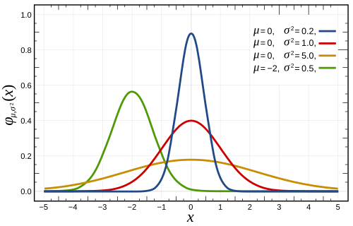

# SÍNDROME DE REALIMENTAÇÃO: IDENTIFICAÇÃO DE RISCO E PREVENÇÃO

A Síndrome de Realimentação (SR) é um daqueles temas que separa o médico que apenas "prescreve dieta" do médico que entende a fisiologia do paciente crítico. Nas provas de residência, ela é a estrela da Nutrologia e da Terapia Intensiva. Por quê? Porque ela é potencialmente fatal, totalmente evitável e baseada em uma lógica metabólica muito clara que as bancas adoram explorar.

Para entender a SR, você precisa parar de pensar na comida como "energia" e começar a pensar nela como um "estopim metabólico". Quando você alimenta um paciente que estava em jejum prolongado ou desnutrição grave, você não está apenas dando calorias; você está mudando drasticamente o ambiente hormonal dele.

*Figura 1 - A síndrome de realimentação é uma complicação potencialmente fatal que ocorre ao reiniciar nutrição em pacientes desnutridos: o princípio "Start Low, Go Slow" é fundamental para preveni-la. Fonte: NCI, Domínio Público | Wikimedia Commons*

## A Lógica do Problema: Por que a Síndrome de Realimentação acontece?

Imagine um paciente que não come adequadamente há semanas. O corpo dele entrou em "modo de economia". O hormônio dominante é o glucagon. As reservas de glicogênio acabaram nas primeiras 24 horas. Agora, ele vive de quebrar gordura (lipólise) e proteína (proteólise), gerando corpos cetônicos e ácidos graxos para sobreviver.

Nesse estado de catabolismo, os estoques intracelulares de eletrólitos — especialmente Fósforo, Magnésio e Potássio — estão depletados. Mas atenção: os níveis séricos (no sangue) podem parecer normais! O corpo prioriza manter o sangue em equilíbrio às custas de "esvaziar" as células.

O erro acontece quando você, com a melhor das intenções, inicia uma dieta hipercalórica ou mesmo uma carga padrão de glicose. O que acontece?

- **O Surto de Insulina:** A glicose entra no sangue, o pâncreas acorda e libera uma enxurrada de insulina.

- **O Shift Intracelular:** A insulina é um hormônio anabólico. Ela ordena que a glicose entre nas células. Mas a glicose não entra sozinha. Ela leva consigo o Potássio, o Magnésio e, crucialmente, o Fósforo.

- **O Consumo de Fósforo:** Dentro da célula, para transformar essa glicose em energia (ATP), o corpo precisa de fósforo. Como o estoque já estava baixo, o pouco fósforo que restava no sangue "foge" para dentro da célula.

- **O Colapso:** O resultado é uma queda súbita e grave dos níveis séricos de eletrólitos. Sem fósforo, não há ATP. Sem ATP, o coração não bate direito, o diafragma não contrai e o cérebro "desliga".

**Dica do Dr. Will:** Se a prova te der um caso de desnutrido que começou a comer e evoluiu com fraqueza muscular e arritmia, não procure outra coisa: o diagnóstico é Síndrome de Realimentação. O marcador laboratorial mais clássico e precoce é a **Hipofosfatemia**.

## Identificação do Paciente de Risco: Quem devemos vigiar?

Nem todo paciente que volta a comer terá SR. O segredo da prevenção é saber quem é o paciente de risco. As bancas de prova costumam usar os critérios do NICE (National Institute for Health and Care Excellence) ou da ASPEN.

Aqui, o Dr. Will faz um alerta: a banca vai tentar te confundir colocando um paciente obeso. Cuidado! Um paciente obeso que perdeu muito peso rapidamente (como após uma cirurgia bariátrica com complicações) pode estar em altíssimo risco de SR, mesmo que o IMC ainda pareça "normal".

### Critérios de Risco (Baseado no NICE)

Você deve considerar um paciente como de **alto risco** se ele apresentar UM ou mais dos seguintes critérios:

- IMC < 16 kg/m².

- Perda de peso não intencional > 15% nos últimos 3 a 6 meses.

- Pouca ou nenhuma ingestão nutricional por > 10 dias.

- Níveis baixos de potássio, fósforo ou magnésio antes da realimentação.

Ou se ele apresentar DOIS ou mais dos seguintes critérios:

- IMC < 18,5 kg/m².

- Perda de peso não intencional > 10% nos últimos 3 a 6 meses.

- Pouca ou nenhuma ingestão nutricional por > 5 dias.

- História de abuso de álcool ou drogas (incluindo insulina, quimioterapia, antiácidos ou diuréticos).

**Tabela 1: Estratificação de Risco para Síndrome de Realimentação**

| Categoria de Risco | Critérios Principais | Conduta Inicial Sugerida |
| --- | --- | --- |
| **Baixo Risco** | IMC > 18,5, sem perda de peso recente, jejum < 5 dias. | Iniciar dieta conforme metas habituais. |
| **Alto Risco** | IMC < 16 OU perda > 15% OU jejum > 10 dias. | Iniciar com 10-15 kcal/kg/dia; repor Tiamina. |
| **Risco Extremo** | IMC < 14 OU jejum > 15 dias. | Iniciar com 5-10 kcal/kg/dia; monitoramento rigoroso. |

**Pegadinha de Prova:** A alternativa vai dizer que "paciente com IMC de 20 não tem risco". Errado! Se ele perdeu 12% do peso em 3 meses e está sem comer há 6 dias, ele preenche dois critérios de menor gravidade e é, sim, considerado de alto risco.

*Figura 2 - A hipofosfatemia é o marcador central da síndrome de realimentação: o fosfato é desviado para o meio intracelular durante a retomada do metabolismo glicídico, podendo causar insuficiência respiratória, arritmias e rabdomiólise. Fonte: Domínio Público | Wikimedia Commons*

## O Quadro Clínico: O que você verá à beira do leito?

A SR geralmente se manifesta nas primeiras **72 horas** após o início da realimentação. É um quadro multissistêmico, e você precisa conectar os eletrólitos aos sintomas.

### 1. Hipofosfatemia (O "Coração" da Síndrome)

O fósforo é essencial para o ATP e para o 2,3-DPG (que ajuda a hemoglobina a liberar oxigênio para os tecidos).

- **Sintomas:** Insuficiência cardíaca de alto débito, arritmias, falência respiratória (o diafragma não tem força para contrair), parestesias, convulsões e coma.

- **Pérola Clínica:** Se o paciente "não sai do ventilador" após iniciar a dieta, cheque o fósforo!

### 2. Hipocalemia e Hipomagnesemia

A insulina joga o potássio e o magnésio para dentro da célula.

- **Sintomas:** Arritmias (prolongamento do intervalo QT), íleo paralítico, fraqueza muscular extrema.

- **Atenção:** O magnésio é o "porteiro" do potássio. Se você não corrigir o magnésio, o potássio não sobe.

### 3. Deficiência de Tiamina (Vitamina B1)

A tiamina é um cofator essencial para o metabolismo da glicose (Ciclo de Krebs). Quando você dá glicose para um desnutrido, o pouco de tiamina que ele tem é consumido rapidamente.

- **Sintomas:** Encefalopatia de Wernicke (triade: ataxia, confusão mental e oftalmoplegia) ou Beribéri (insuficiência cardíaca e edema).

### 4. Sobrecarga Hídrica e Edema

A insulina aumenta a reabsorção de sódio e água nos túbulos renais. Somado a um coração que já está fraco pela falta de fósforo, o resultado é **edema agudo de pulmão** e edema periférico.

- **Erro Comum:** Achar que o edema é apenas por "baixa albumina". Na SR, o mecanismo é retenção de sódio induzida pela insulina.

## Diagnóstico: Não espere o desastre

O diagnóstico da Síndrome de Realimentação é clínico-laboratorial. Você não precisa de um exame sofisticado; você precisa de vigilância.

De acordo com o consenso da ASPEN (American Society for Parenteral and Enteral Nutrition), a SR é definida por uma queda nos níveis de fósforo, potássio ou magnésio em 10% a 30% em relação ao valor basal, ocorrendo dentro de 5 dias após o início da nutrição.

**Valores de Referência Importantes:**

- **Fósforo (P):** 2,5 a 4,5 mg/dL. (Abaixo de 1,0 mg/dL é emergência médica!).

- **Potássio (K):** 3,5 a 5,0 mEq/L.

- **Magnésio (Mg):** 1,7 a 2,5 mg/dL.

**Diferencial Importante:** No MedEvo, sempre lembramos que o "Resíduo Gástrico Elevado" ou a "Distensão Abdominal" podem ser apenas intolerância à dieta enteral, mas se vierem acompanhados de queda de eletrólitos, pense em SR causando íleo paralítico.

## Prevenção e Manejo: O Mantra "Start Low, Go Slow"

Se você identificou o risco, a prevenção é o tratamento. O objetivo não é atingir a meta calórica no primeiro dia. O corpo do paciente desnutrido não aguenta o anabolismo súbito.

### Passo 1: Reposição de Tiamina ANTES da Dieta

Nunca, em hipótese alguma, comece a dieta ou soro glicosado em um paciente de risco sem dar tiamina antes.

- **Dose:** 100mg a 300mg IV ou VO, pelo menos 30 minutos antes da nutrição, mantendo por 3 a 5 dias.

- **Por que?** Para evitar que a carga de glicose desencadeie uma Encefalopatia de Wernicke aguda.

### Passo 2: Início Cauteloso de Calorias

A diretriz da BRASPEN e o NICE recomendam:

- **Início:** 10 a 15 kcal/kg por dia.

- Em casos de desnutrição extrema (IMC < 14), comece com **5 kcal/kg/dia**.

- **Progressão:** Aumente gradualmente (25% da meta a cada 24-48h) se os eletrólitos estiverem estáveis.

### Passo 3: Manejo de Eletrólitos

Corrija os eletrólitos **antes** de iniciar a dieta, se possível. Se a queda ocorrer durante a dieta, você deve reduzir a oferta calórica ou até suspendê-la temporariamente enquanto repõe.

**Tabela 2: Metas de Reposição na Síndrome de Realimentação**

| Eletrólito | Alvo Terapêutico | Observação Clínica |
| --- | --- | --- |
| **Fósforo** | Manter > 2,0 mg/dL | Repor preferencialmente via oral se leve; IV se < 1,5 mg/dL. |
| **Potássio** | Manter > 3,5 mEq/L | Cuidado com a velocidade de infusão IV (máx 20 mEq/h). |
| **Magnésio** | Manter > 1,5 mg/dL | Essencial para a correção do potássio. |
| **Fluidos** | Balanço Neutro | Evitar sobrecarga hídrica; restrição de sódio pode ser necessária. |

### Passo 4: Monitoramento

Nos primeiros 3 a 5 dias, os eletrólitos devem ser dosados **diariamente** (ou até de 12/12h em casos críticos).

**Tabela 3: Resumo do Manejo Nutricional (Protocolo Prático)**

| Dia de Realimentação | Oferta Calórica | Monitoramento |
| --- | --- | --- |
| **Dia 0 (Pré)** | Tiamina 200mg + Complexo B | Eletrólitos basais. |
| **Dia 1-3** | 10-15 kcal/kg/dia | Eletrólitos 1x ao dia; Peso; Balanço hídrico. |
| **Dia 4-6** | Aumentar para 20-25 kcal/kg/dia | Se eletrólitos estáveis, progredir. |
| **Dia 7+** | Atingir meta (30 kcal/kg/dia) | Monitoramento semanal. |

## Situações Especiais e Pegadinhas

### Nutrição Parenteral (NPT) vs. Enteral

A SR pode ocorrer em ambas. No entanto, a NPT é mais perigosa porque a glicose entra diretamente na veia, gerando um pico de insulina mais rápido e intenso. Se a prova citar NPT em paciente desnutrido, o sinal de alerta para SR deve ser dobrado.

### O Paciente com Pancreatite

A diretriz brasileira recomenda **Nutrição Enteral Precoce** na pancreatite aguda grave. Isso ajuda a manter a barreira intestinal. Mas, se o paciente estiver desnutrido pelo jejum da dor, aplique o protocolo de prevenção de SR. Não confunda "precocidade" com "hipercaloria".

### Edema e "Ganho de Peso"

Se o paciente ganhar > 1kg na primeira semana de realimentação, cuidado! Isso não é músculo, é água. A insulina causa retenção de sódio. Reduza a oferta de fluidos e sódio.

## Diagnóstico Diferencial: SR ou outra coisa?

Muitas vezes, os sintomas da SR se confundem com outras condições da UTI.

- **Sepse:** Também causa instabilidade hemodinâmica e disfunção orgânica. Mas na sepse, geralmente temos febre, leucocitose e o fósforo pode não cair tão drasticamente de forma isolada.

- **Insuficiência Cardíaca Primária:** O edema da SR parece ICC, mas a história de desnutrição + início de dieta + hipofosfatemia fecha o diagnóstico de SR.

- **Cetoacidose Diabética (CAD):** Na CAD, também há shift de potássio e fósforo, mas o contexto é de hiperglicemia grave e acidose, diferente da SR onde o problema é a *introdução* da glicose.

## Pontos-Chave para Prova 💡

- **Definição Patognomônica:** Desnutrido + Realimentação Rápida + Hipofosfatemia/Hipocalemia/Hipomagnesemia + Edema.

- **O Eletrólito "Rei":** A **Hipofosfatemia** é o distúrbio mais crítico e marcador da síndrome.

- **Fisiopatologia:** Mudança do catabolismo para o anabolismo → Pico de Insulina → Shift intracelular de eletrólitos.

- **Risco NICE:** IMC < 16 ou perda de peso > 15% em 3-6 meses são critérios isolados de alto risco.

- **Tiamina (B1):** Deve ser reposta **antes** de iniciar a glicose/dieta para prevenir Encefalopatia de Wernicke.

- **Velocidade da Dieta:** Iniciar com **10-15 kcal/kg/dia** em pacientes de risco. Em risco extremo, **5 kcal/kg/dia**.

- **Sódio e Água:** A insulina causa retenção de sódio; o paciente pode evoluir com edema agudo de pulmão.

- **O que NÃO cai na SR:** Hipercalemia (o potássio cai, não sobe) e Hiponatremia (não é o distúrbio clássico, embora possa ocorrer por diluição).

- **Monitoramento:** Eletrólitos (P, K, Mg) devem ser checados diariamente nos primeiros 3 a 5 dias.

- **Contraindicação Absoluta:** Não se deve atingir a meta calórica total no primeiro dia em pacientes de alto risco.

- **Sintoma Neurológico:** Fraqueza muscular extrema e dificuldade de desmame ventilatório sugerem hipofosfatemia grave.

- **Magnésio:** Se o magnésio estiver baixo, você não conseguirá corrigir o potássio (refratariedade).

- **Timing:** A síndrome ocorre tipicamente nas primeiras **72 horas** de realimentação.

- **Pegadinha de Prova:** A banca vai dizer que o paciente está estável e pode começar dieta plena. Se ele for desnutrido, a resposta correta é "começar devagar e repor eletrólitos".

- **Dr. Will lembra:** A Síndrome de Realimentação é uma emergência médica metabólica. O tratamento é reduzir a dieta e repor o que está faltando.

 Cópia offline para consulta pessoal.
 Fonte original:
 [https://www.medevo.com.br/material-apoio/ler/0ae9b139-d354-4fb6-a91e-38fd3e2cf161](https://www.medevo.com.br/material-apoio/ler/0ae9b139-d354-4fb6-a91e-38fd3e2cf161)
