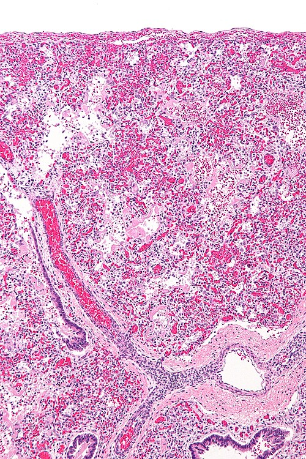
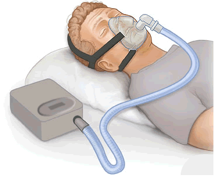

# SÍNDROME DO DESCONFORTO RESPIRATÓRIO DO RN: CPAP E SURFACTANTE

A Síndrome do Desconforto Respiratório (SDR), historicamente conhecida como Doença da Membrana Hialina (DMH), é o protótipo da patologia do recém-nascido prematuro. Se você entender a fisiopatologia desta doença, você entenderá quase toda a lógica da assistência respiratória em neonatologia. Nas provas de residência, o examinador não quer apenas que você saiba que falta surfactante, ele quer que você saiba diferenciar a SDR de outras taquipneias e, principalmente, que você domine o manejo atual, que prioriza a ventilação não invasiva.

*Figura 1 - Corte histopatológico de pulmão neonatal mostrando membranas hialinas (material eosinofílico revestindo alvéolos colapsados), achado patognomônico da Doença da Membrana Hialina por deficiência de surfactante. Fonte: Nephron, CC BY-SA 3.0 | Wikimedia Commons*

## Fisiopatologia: O Porquê do Colapso

Para entender a SDR, precisamos falar do pneumócito tipo II. É ele o responsável pela produção do surfactante, um complexo lipoproteico (rico em dipalmitoilfosfatidilcolina) que começa a ser produzido de forma mais robusta a partir da 24ª a 26ª semana de gestação, mas que só atinge níveis adequados de maturidade por volta da 34ª ou 35ª semana.

O papel do surfactante é reduzir a tensão superficial na interface ar-líquido dos alvéolos. Sem ele, a Lei de Laplace entra em ação com força total: a pressão necessária para manter o alvéolo aberto torna-se inversamente proporcional ao seu raio. Como os alvéolos neonatais são pequenos, a pressão de colapso é imensa.

O resultado? Atelectasia progressiva. O pulmão fica "duro" (baixa complacência). O recém-nascido (RN) precisa fazer um esforço respiratório hercúleo para recrutar esses alvéolos a cada inspiração. Isso gera um ciclo vicioso: a atelectasia causa desequilíbrio ventilação-perfusão (V/Q) e shunt da direita para a esquerda, levando à hipoxemia e acidose. A acidose, por sua vez, causa vasoconstrição pulmonar, o que pode evoluir para Hipertensão Pulmonar Persistente do Recém-Nascido (HPPN), agravando ainda mais o quadro.

**Dica de Prova:** As bancas adoram perguntar sobre a "membrana hialina". Ela não nasce com o bebê. Ela é o resultado da lesão epitelial causada pela hipóxia e pelo esforço respiratório, que gera um exsudato fibrino-proteico que reveste os alvéolos. É uma consequência, não a causa primária.

## Epidemiologia e Fatores de Risco: Quem é o Paciente?

A SDR é inversamente proporcional à idade gestacional. Quanto mais prematuro, maior o risco. No entanto, a prematuridade não é o único fator.

### Fatores que Aumentam o Risco

- **Prematuridade:** O fator principal.

- **Diabetes Materno:** Aqui está uma pegadinha clássica. O RN de mãe diabética, mesmo que seja um prematuro tardio ou até a termo, tem maior risco de SDR. Por quê? Porque a insulina fetal (em resposta à hiperglicemia materna) é um potente antagonista do cortisol no pulmão, atrasando a maturação dos pneumócitos tipo II e a produção de surfactante.

- **Sexo Masculino:** Estatisticamente, os meninos demoram mais para maturar o pulmão que as meninas.

- **Asfixia Perinatal:** A hipóxia e a acidose inibem a síntese de surfactante.

- **Gemelaridade (segundo gemelar):** Frequentemente mais exposto à asfixia e estresse no parto.

- **Cesariana sem Trabalho de Parto:** O trabalho de parto libera corticoides e catecolaminas naturais que auxiliam na reabsorção do líquido pulmonar e na liberação de surfactante.

### Fatores que Diminuem o Risco (Fatores Protetores)

Tudo o que gera estresse crônico intrauterino acelera a maturação pulmonar via liberação de corticoides endógenos:

- **Hipertensão Materna (Pré-eclâmpsia/Eclâmpsia).**

- **Ruptura Prolongada de Membranas (RPMO).**

- **Restrição de Crescimento Intrauterino (RCIU).**

- **Uso de Corticoide Antenatal:** A intervenção mais eficaz para reduzir a incidência e gravidade da SDR.

**Cuidado:** Muitos alunos erram ao achar que Hipertensão Materna é fator de risco para SDR. Na verdade, o estresse da hipertensão "prepara" o pulmão do bebê mais cedo.

## Quadro Clínico e Exame Físico

O desconforto respiratório na SDR é **precoce** (nas primeiras horas de vida) e **progressivo**. Se um bebê começa com desconforto após 12 ou 24 horas de vida, pense em sepse ou pneumonia, não em SDR primária.

Os sinais clássicos incluem:

- **Taquipneia (FR > 60 mpm):** A tentativa inicial de compensar o baixo volume corrente.

- **Gemido expiratório:** É um mecanismo de defesa. O bebê fecha parcialmente a glote no final da expiração para tentar manter uma pressão positiva residual (uma PEEP natural) e evitar o colapso alveolar.

- **Batimento de asas de nariz:** Tentativa de reduzir a resistência da via aérea superior.

- **Retrações (subcostais, intercostais e fúrcula):** Uso de musculatura acessória devido à baixa complacência pulmonar.

- **Cianose:** Inicialmente responde ao oxigênio, mas pode tornar-se refratária se o shunt for muito grave.

### Boletim de Silverman-Andersen

Diferente do Apgar, onde nota alta é bom, no Silverman-Andersen, **nota alta é ruim**. Ele avalia cinco parâmetros (0, 1 ou 2 pontos cada):

- Sincronia toracoabdominal (o movimento "em gangorra" é o grau 2).

- Retração intercostal.

- Retração xifoide.

- Batimento de asas de nariz.

- Gemido expiratório.

Um escore > 5 indica desconforto respiratório grave. Como o Dr. Will costuma enfatizar em suas discussões no MedEvo, o gemido audível sem estetoscópio já pontua 2, sinalizando gravidade imediata.

## Diagnóstico por Imagem: O Raio-X de Tórax

O diagnóstico da SDR é clínico-radiológico. Você não precisa de biópsia ou exames sofisticados. O padrão-ouro na prova é a radiografia de tórax, que apresenta:

- **Infiltrado Reticulogranular Difuso:** Frequentemente descrito como aspecto de "vidro moído" ou "vidro fosco". São as microatelectasias disseminadas.

- **Broncogramas Aéreos:** O ar nos brônquios contrasta com o parênquima pulmonar colapsado ao redor. Eles podem ultrapassar a silhueta cardíaca.

- **Hipotransparência (Pulmão Branco):** Nos casos graves, a atelectasia é tão extensa que o pulmão fica opaco.

- **Volume Pulmonar Reduzido:** Diferente da TTRN ou SAM, na SDR o pulmão está "murcho" (diafragma elevado, menos de 8 costelas visíveis).

## Diagnóstico Diferencial: A Chave das Questões

As bancas amam colocar um caso clínico e pedir para você escolher entre SDR, TTRN, SAM ou Pneumonia. Use a tabela abaixo para nunca mais errar:

| Patologia | Perfil do Paciente | História Clínica | Radiografia |
| --- | --- | --- | --- |
| **SDR (Membrana Hialina)** | Prematuro (< 34-35 sem) | Início imediato, piora progressiva. | Vidro moído, broncogramas, volume reduzido. |
| **TTRN (Pulmão Úmido)** | Termo ou Pré-termo tardio, Cesárea | Início precoce, melhora rápida (24-72h). | Hiperinsuflação, líquido na cisura, congestão hilar. |
| **SAM (Aspiração Meconial)** | Termo ou Pós-termo | Líquido meconial, sofrimento fetal. | Infiltrados grosseiros, áreas de atelectasia e hiperinsuflação. |
| **Pneumonia / Sepse** | Qualquer IG | Bolsa rota > 18h, febre materna. | Indistinguível da SDR (pode ter infiltrado focal). |

**Exemplo Clínico Rápido:** RN de 36 semanas, nascido de cesárea eletiva, apresenta taquipneia leve e gemência logo após o nascimento. Rx mostra coração com bordas borradas ("coração peludo") e líquido na cisura. Diagnóstico? **TTRN**. Por que não SDR? Pela idade gestacional e pelo padrão radiológico de hiperinsuflação/congestão.

*Figura 2 - Dispositivo CPAP: pilar do suporte ventilatório não invasivo na SDR neonatal. O CPAP nasal associado ao surfactante exógeno revolucionaram o tratamento, reduzindo mortalidade em prematuros. O surfactante precoce melhora a complacência pulmonar. Fonte: Domínio Público | Wikimedia Commons*

## Tratamento: A Revolução do CPAP e do Surfactante

O manejo da SDR mudou drasticamente nos últimos anos. Antigamente, a regra era: "nasceu prematuro, intuba e dá surfactante". Hoje, a filosofia é **minimamente invasiva**.

### 1. Estabilização Inicial e CPAP Nasal Precoce

Segundo as diretrizes atuais (SBP e Consenso Europeu), o CPAP (Pressão Positiva Contínua nas Vias Aéreas) deve ser iniciado ainda na sala de parto para todo RN prematuro com respiração espontânea e desconforto respiratório.

- **Por que CPAP precoce?** Porque ele mantém a Capacidade Residual Funcional (CRF), impedindo que os alvéolos colapsem no final da expiração. Isso preserva o surfactante endógeno e evita a lesão pulmonar induzida pela ventilação mecânica (VILI).

- **Parâmetros iniciais:** Pressão de 5 a 7 cmH2O.

- **Alvo de Saturação:** 90-95% (evite hiperóxia em prematuros pelo risco de retinopatia e displasia).

### 2. Terapia com Surfactante Exógeno

O surfactante é indicado quando o CPAP não é suficiente. Mas quando sabemos que o CPAP falhou?

**Critérios para Surfactante (Diretriz SBP):**

- RN em CPAP com FiO2 > 30% para manter saturação alvo.

- Piora do desconforto respiratório ou acidose respiratória persistente.

**Doses e Tipos:**

- O mais utilizado no Brasil é o **Poractante Alfa (Curosurf)**, de origem porcina. A dose inicial recomendada é de **200 mg/kg** (é mais eficaz que a dose de 100 mg/kg para reduzir mortalidade).

- Existem também os de origem bovina (Beractante/Survanta), geralmente na dose de 100 mg/kg.

**Técnicas de Administração:**

- **INSURE (INtubate-SURfactant-Extubate):** O bebê é intubado, recebe o surfactante e é extubado imediatamente para o CPAP (em menos de 1 hora).

- **LISA (Less Invasive Surfactant Administration):** O surfactante é administrado através de um cateter fino inserido na traqueia enquanto o bebê permanece em CPAP, sem necessidade de intubação formal com tubo orotraqueal. Esta é a tendência atual para reduzir a displasia broncopulmonar.

### 3. Suporte Geral

- **Termorregulação:** Manter em incubadora (estresse térmico consome surfactante).

- **Nutrição:** Nutrição parenteral precoce.

- **Antibioticoterapia:** Como é difícil diferenciar SDR de Pneumonia precocemente, muitos serviços iniciam Ampicilina + Gentamicina até que as culturas venham negativas (48h).

## Complicações e Prognóstico

A SDR não é apenas um problema agudo. Ela pode deixar marcas ou evoluir com complicações graves:

- **Persistência do Canal Arterial (PCA):** Com a melhora da função pulmonar e queda da resistência vascular pulmonar após o surfactante, o shunt esquerda-direita através do canal arterial aumenta. Suspeite se o bebê tiver melhora inicial e depois piorar no 3º ou 4º dia, com pulsos amplos e sopro sistólico.

- **Displasia Broncopulmonar (DBP):** Definida pela necessidade de oxigênio suplementar aos 28 dias de vida ou 36 semanas de idade pós-concepcional. É a sequela crônica da inflamação e oxigênio.

- **Pneumotórax:** O uso de pressões positivas em um pulmão com complacência heterogênea pode causar ruptura alveolar. Piora súbita = suspeite de pneumotórax.

- **Hemorragia Pulmonar:** Pode ocorrer após a administração de surfactante, especialmente em bebês com PCA importante.

## Situações Especiais e Pegadinhas de Prova

### Síndrome de Aspiração Meconial (SAM) e Surfactante

Você pode se perguntar: "Se SAM é aspiração de mecônio, por que dar surfactante?". A resposta é que o mecônio **inativa** o surfactante endógeno (ele funciona como um detergente). Portanto, em casos graves de SAM, o surfactante exógeno pode ser indicado para "vencer" essa inativação.

### O RN de Mãe Diabética (GIG)

Imagine o cenário: RN de 37 semanas, GIG (Grande para a Idade Gestacional), filho de mãe diabética, nasce por cesárea e apresenta desconforto respiratório grave. O Rx mostra vidro moído.

- **Erro comum:** Achar que por ser 37 semanas não pode ser SDR.

- **Verdade:** A hiperinsulinemia fetal atrasa a maturação pulmonar. Esse bebê tem pulmão de 32 semanas em um corpo de 37.

### Hipertensão Pulmonar Persistente (HPPN)

Se o RN tem SDR, mas a cianose é desproporcional ao achado do Rx (Rx não tão feio, mas saturação muito baixa) e não responde ao teste de hiperóxia, pense em HPPN. O diagnóstico é confirmado pelo Ecocardiograma (shunt D-E pelo forame oval ou canal arterial). O tratamento de escolha aqui é o Oxigênio e, se necessário, Óxido Nítrico Inalatório.

## Pontos-Chave para Prova

- **Definição:** Deficiência quantitativa e qualitativa de surfactante em pulmões imaturos.

- **Fator de Risco #1:** Prematuridade (especialmente < 28 semanas).

- **Fator Protetor Clássico:** Corticoide antenatal (Betametasona ou Dexametasona) e estresse crônico (HAS materna).

- **Diabetes Materno:** Aumenta o risco de SDR devido ao hiperinsulinismo fetal.

- **Radiografia:** Infiltrado reticulogranular fino (vidro moído) + broncogramas aéreos + hipoventilação.

- **Silverman-Andersen:** Avalia gravidade do desconforto. Gemido expiratório é sinal de tentativa de manter PEEP.

- **Conduta Inicial:** CPAP nasal precoce (5-7 cmH2O) ainda na sala de parto.

- **Indicação de Surfactante:** Falha do CPAP (FiO2 > 30%).

- **Dose de Surfactante (Curosurf):** 200 mg/kg (primeira dose).

- **Técnica Preferencial:** LISA ou INSURE (evitar ventilação mecânica prolongada).

- **Diferencial TTRN:** RN a termo/tardio, cesárea, Rx com hiperinsuflação e líquido na cisura, melhora em até 72h.

- **Diferencial SAM:** RN termo/pós-termo, líquido meconial, Rx com infiltrado grosseiro e "remendado".

- **Piora Súbita:** Sempre pensar em Pneumotórax ou Hemorragia Pulmonar.

- **PCA:** Suspeitar se houver piora após melhora inicial, com pulsos amplos.

- **O que NÃO fazer:** Não retardar o CPAP esperando o Rx. O CPAP é clínico e imediato.

- **Meta de Saturação:** 90% a 95% para evitar toxicidade pelo oxigênio.

- **Contraindicação Absoluta ao CPAP:** Atresia de coanas, hérnia diafragmática congênita (risco de distensão gástrica comprimindo ainda mais o pulmão) e instabilidade hemodinâmica grave que exija intubação imediata.

Este material foi estruturado para que você compreenda a lógica da neonatologia moderna. Ao responder questões sobre SDR, lembre-se sempre: o foco atual é proteger o pulmão do prematuro, usando o mínimo de oxigênio e pressão necessários para manter a estabilidade. Como dizemos no MedEvo, o melhor ventilador para o prematuro é o seu próprio diafragma, ajudado por um bom CPAP.

 Cópia offline para consulta pessoal.
 Fonte original:
 [https://www.medevo.com.br/material-apoio/ler/2c66c1ef-6e18-4883-ab3f-d9f91ba56594](https://www.medevo.com.br/material-apoio/ler/2c66c1ef-6e18-4883-ab3f-d9f91ba56594)
