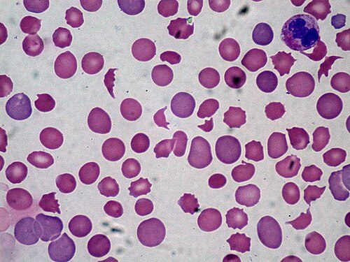
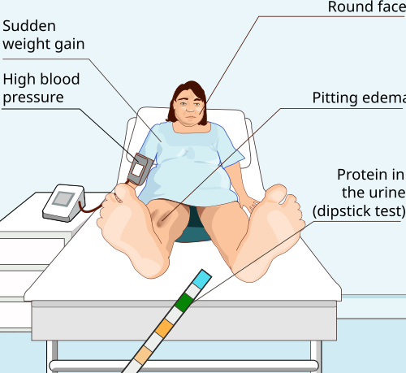

# SÍNDROME HELLP

A Síndrome HELLP não é uma doença isolada, mas sim uma das complicações mais graves do espectro da pré-eclâmpsia. O nome é um acrônimo em inglês que você precisa ter tatuado na mente: **H** (Hemolysis - Hemólise), **EL** (Elevated Liver enzymes - Enzimas hepáticas elevadas) e **LP** (Low Platelets - Plaquetas baixas).

Como professor, vejo muitos alunos errando questões por acharem que a paciente HELLP sempre terá a tríade clássica da pré-eclâmpsia (hipertensão, proteinúria e edema). Cuidado: cerca de 15% a 20% das pacientes com Síndrome HELLP podem não apresentar hipertensão arterial ou proteinúria no momento do diagnóstico. Se você esperar a pressão subir para suspeitar de HELLP em uma gestante com dor epigástrica, você vai chegar atrasado.

*Figura 1 - Esfregaço de sangue periférico evidenciando esquistócitos (hemácias fragmentadas), achado característico da anemia hemolítica microangiopática presente na Síndrome HELLP. A fragmentação eritrocitária ocorre pela passagem forçada das hemácias por vasos com lesão endotelial e depósito de fibrina. Fonte: Ed Uthman, MD, CC BY 2.0 | Wikimedia Commons*

## Fisiopatologia: O Porquê do Caos

Para entender a HELLP, você precisa entender a lesão endotelial. Na pré-eclâmpsia, existe uma falha na segunda onda de invasão trofoblástica, gerando isquemia placentária. Essa placenta "sofrida" libera substâncias antiangiogênicas na circulação materna, causando uma disfunção endotelial sistêmica.

Na Síndrome HELLP, esse dano endotelial é particularmente agressivo nos microvasos. Imagine o endotélio, que deveria ser uma "pista de gelo" lisa para o sangue passar, transformando-se em uma "pista de brita".

### 1. Hemólise (H)

Quando as hemácias tentam passar por esses microvasos cheios de depósitos de fibrina e danos endoteliais, elas são literalmente "esmagadas" ou fragmentadas. Isso gera a **anemia hemolítica microangiopática**. O marcador laboratorial que você verá na prova são os **esquisócitos** (hemácias fragmentadas) no esfregaço de sangue periférico. Como a célula estoura, ela libera Lactato Desidrogenase (DHL ou LDH) e Bilirrubina Indireta.

### 2. Enzimas Hepáticas Elevadas (EL)

O dano endotelial nos sinusoides hepáticos leva à deposição de fibrina, o que obstrui o fluxo sanguíneo e causa isquemia e necrose periportal. É por isso que as transaminases (TGO e TGP) sobem. Se essa obstrução e o edema progredirem, podemos ter a formação de um hematoma subcapsular, que é o passo anterior à temida rotura hepática.

### 3. Plaquetopenia (LP)

As plaquetas são recrutadas para tentar "consertar" as áreas de lesão endotelial nos microvasos. Elas são consumidas rapidamente, formando microtrombos. O resultado é uma contagem baixa no sangue periférico por puro consumo. Não é um problema de produção na medula, é um problema de "gasto" excessivo na periferia.

## Critérios Diagnósticos: Os Números que Caem

Existem duas classificações principais, mas a de **Sibai (Tennessee)** é a soberana nas provas de residência no Brasil. Você precisa decorar esses valores, pois as bancas adoram trocar 600 por 500 ou 70 por 40.

### Critérios de Sibai (HELLP Completa)

Para ser considerada Síndrome HELLP completa, a paciente deve preencher TODOS os critérios abaixo:

- **Hemólise:**

- Esfregaço de sangue periférico com esquisócitos.

- Bilirrubina total > 1,2 mg/dL (à custa da indireta).

- **DHL > 600 U/L** (Este é o marcador mais sensível e precoce).

- **Disfunção Hepática:**

- **TGO (AST) ≥ 70 U/L**.

- **Plaquetopenia:**

- **Plaquetas < 100.000/mm³**.

**Dica do Dr. Will:** Se a paciente tiver apenas um ou dois desses critérios, chamamos de "HELLP parcial" ou incompleta. Na prática de prova, a conduta para a HELLP parcial costuma ser a mesma da completa, pois o risco de progressão é altíssimo.

### Classificação de Mississippi

Menos comum em provas, mas importante para estratificar gravidade baseada na contagem de plaquetas:

- Classe 1: Plaquetas < 50.000/mm³ (Grave).

- Classe 2: Plaquetas entre 50.000 e 100.000/mm³.

- Classe 3: Plaquetas entre 100.000 e 150.000/mm³.

## Quadro Clínico e Exame Físico

A apresentação clássica é uma gestante no terceiro trimestre (embora possa ocorrer no segundo ou no pós-parto) queixando-se de:

- **Dor epigástrica ou no hipocôndrio direito (85-90% dos casos):** Isso ocorre pela distensão da Cápsula de Glisson (a membrana que envolve o fígado).

- Náuseas e vômitos.

- Mal-estar inespecífico (muitas vezes confundido com virose).

- Cefaleia e distúrbios visuais (escotomas), típicos da pré-eclâmpsia grave.

No exame físico, você deve procurar por:

- Hipertensão (presente na maioria, mas não em todas).

- Sensibilidade à palpação do quadrante superior direito do abdome.

- Edema (comum, mas inespecífico).

- Icterícia (sinal de hemólise grave ou disfunção hepática avançada).

**Pegadinha de Prova:** A banca descreve uma paciente com dor em "barra" no andar superior do abdome e náuseas. Você pensa em gastrite. Mas ela está grávida de 30 semanas. Peça os exames de HELLP imediatamente!

## Diagnóstico Diferencial: Onde o Aluno se Confunde

Este é um dos pontos mais cobrados. Você precisa diferenciar a HELLP de outras patologias que "imitam" seus achados.

### 1. Esteatose Hepática Aguda da Gravidez (EHAG)

Esta é a principal confusão. Na EHAG, o quadro é de **insuficiência hepática real**.

- **Diferencial:** Na EHAG, você encontrará **hipoglicemia grave**, prolongamento do tempo de protrombina (TAP/INR alterado) e icterícia muito mais precocemente. Na HELLP, a glicose costuma estar normal e o coagulograma só altera se houver CIVD associada.

### 2. Púrpura Trombocitopênica Trombótica (PTT) e Síndrome Hemolítico-Urêmica (SHU)

Ambas cursam com plaquetopenia e hemólise microangiopática.

- **Diferencial:** Na PTT, os sintomas neurológicos são predominantes. Na SHU, a insuficiência renal aguda (elevação de creatinina) é o marco principal. Na HELLP, a elevação das transaminases é muito mais marcante que nessas duas.

### 3. Apendicite Aguda

Lembre-se que o útero gravídico desloca o apêndice para cima. Uma dor no hipocôndrio direito pode ser apendicite. No entanto, a apendicite não causa hemólise nem plaquetopenia.

| Característica | Síndrome HELLP | Esteatose Hepática (EHAG) | PTT / SHU |
| --- | --- | --- | --- |
| **Plaquetas** | Muito baixas (<100k) | Podem estar normais/baixas | Extremamente baixas |
| **Transaminases** | Elevadas (TGO > 70) | Elevadas | Leve aumento |
| **Glicemia** | Normal | **Hipoglicemia Grave** | Normal |
| **Coagulograma** | Normal (inicialmente) | **Alterado (TAP/INR alto)** | Normal |
| **Creatinina** | Leve aumento | Elevada | **Muito elevada (SHU)** |

*Figura 2 - Sinais e sintomas da pré-eclâmpsia, espectro no qual a Síndrome HELLP se insere. O manejo é uma emergência obstétrica: estabilização materna com sulfato de magnésio, anti-hipertensivos, corticoide (< 34 semanas) e decisão sobre interrupção da gestação. Fonte: Hariadhi, CC BY-SA 4.0 | Wikimedia Commons*

## Manejo Clínico: O Passo a Passo da Salvação

Identificou a HELLP? A paciente agora é "prioridade zero". O manejo baseia-se em três pilares: Estabilização Materna, Avaliação Fetal e Definição da Via de Parto.

### 1. Estabilização Materna (Obrigatório)

Não se interrompe uma gestação com a mãe instável.

- **Sulfato de Magnésio (MgSO4):** É a droga de escolha para prevenção e tratamento de convulsões (eclâmpsia). O esquema mais usado é o de Zuspan (Ataque: 4g IV; Manutenção: 1g/h IV).

- *Por que fazemos?* Porque a HELLP é uma forma grave de pré-eclâmpsia, e o risco de convulsão é altíssimo.

- **Controle da Hipertensão:** Se a PA estiver ≥ 160/110 mmHg, você DEVE tratar para evitar o AVC hemorrágico (principal causa de morte).

- Opções: Hidralazina IV, Labetalol IV (não disponível em muitos serviços no Brasil) ou Nifedipina oral.

- Meta: Manter a PA entre 140/90 e 150/100 mmHg. Não abaixe demais para não prejudicar a perfusão placentária.

### 2. Corticoterapia: Para que serve?

Aqui mora uma confusão comum.

- **Para maturação pulmonar fetal:** Indicado se a idade gestacional for entre 24 e 34 semanas. Usamos Betametasona (12mg IM, 2 doses, intervalo de 24h).

- **Para tratar a HELLP (aumentar plaquetas):** A evidência atual (incluindo diretrizes da FEBRASGO) mostra que o uso de altas doses de dexametasona para "curar" a HELLP **não** melhora o prognóstico materno ou fetal. Portanto, não se usa corticoide com o objetivo de tratar a síndrome, apenas para o pulmão do bebê.

**Atenção:** Se a situação materna for crítica (ex: descolamento de placenta, insuficiência renal, suspeita de rotura hepática), não se espera as 48h do corticoide. O parto deve ser imediato.

### 3. Transfusão de Plaquetas

Não transfundimos plaquetas apenas pelo número, mas pelo risco cirúrgico.

- **Parto Vaginal:** Transfundir se < 20.000/mm³.

- **Cesariana:** Transfundir se < 50.000/mm³.

- Se a paciente estiver sangrando ativamente ou tiver disfunção plaquetária, transfundimos com valores maiores.

## Interrupção da Gestação: Quando e Como?

A Síndrome HELLP é uma indicação de interrupção da gestação. A dúvida é apenas o "timing".

- **Idade Gestacional ≥ 34 semanas:** Estabilizar e interromper.

- **Idade Gestacional < 34 semanas:**

- Se mãe e feto estáveis: Pode-se considerar o uso do corticoide para maturação pulmonar e interromper em 24-48 horas.

- Se houver sinais de gravidade (insuficiência renal, CIVD, descolamento de placenta, sofrimento fetal): Parto imediato após estabilização inicial.

### Via de Parto

Muitos alunos acham que HELLP = Cesárea. **Errado!**
A via de parto é de indicação obstétrica. Se o colo for favorável (Bishop alto) e a paciente estiver estável, o parto vaginal pode ser tentado. Na verdade, o parto vaginal é preferível porque evita o estresse cirúrgico e o risco de sangramento em uma paciente que pode ter coagulopatia.

No entanto, em gestações muito prematuras (< 30-32 semanas) com colo desfavorável, a cesariana acaba sendo a via mais frequente na prática.

### Manejo Anestésico (Pérola de Prova)

Este é um conceito que o MedEvo sempre destaca:

- **Plaquetas < 50.000/mm³:** A anestesia regional (raqui ou peridural) é **contraindicada** devido ao risco de hematoma de canal medular, que pode levar à paraplegia. Nesses casos, se for necessária cesariana, a indicação é **Anestesia Geral**.

- **Plaquetas > 75.000-80.000/mm³:** A anestesia regional costuma ser segura (sempre individualizando o caso).

## Complicações Graves: O Pesadelo do Obstetra

### 1. Hematoma Subcapsular e Rotura Hepática

A paciente apresenta dor súbita e intensa no hipocôndrio direito, referida no ombro (Sinal de Kehr), seguida de choque hipovolêmico.

- **Diagnóstico:** Ultrassom ou Tomografia (se estável).

- **Conduta:** Suporte volêmico, hemotransfusão massiva e laparotomia de emergência. O cirurgião geral deve estar presente para realizar o empacotamento hepático.

### 2. Coagulação Intravascular Disseminada (CIVD)

Ocorre em cerca de 20% das pacientes com HELLP. Você notará sangramento em sítios de punção, hematúria e alteração de TAP, TTPA e Fibrinogênio (que estará baixo).

### 3. Insuficiência Renal Aguda

Geralmente por necrose tubular aguda secundária à hipovolemia e ao dano endotelial.

## Pós-parto e Recorrência

Após o parto, a tendência é de melhora laboratorial em 48 a 72 horas. O nadir (ponto mais baixo) das plaquetas geralmente ocorre 24h após o parto. Se a paciente não melhorar após 72-96 horas, devemos pensar em diagnósticos diferenciais como a SHU ou PTT.

**Aconselhamento:** Uma paciente que teve HELLP tem um risco de recorrência de cerca de 3% a 5% em gestações futuras, e um risco de até 20% de ter alguma forma de pré-eclâmpsia.

- **Profilaxia:** Na próxima gestação, essa paciente deve usar **Aspirina (AAS) 100-150mg/dia** (iniciando antes de 16 semanas) e suplementação de Cálcio (se a ingestão for baixa), conforme as recomendações da FEBRASGO.

## Pontos-Chave para Prova

- **Acrônimo:** Hemólise (H), Enzimas hepáticas elevadas (EL), Plaquetas baixas (LP).

- **Critérios de Sibai:** DHL > 600 U/L, TGO ≥ 70 U/L, Plaquetas < 100.000/mm³.

- **Marcador de Hemólise:** Esquisócitos no sangue periférico e aumento de Bilirrubina Indireta.

- **Sinal Clínico Precoce:** Dor epigástrica ou no hipocôndrio direito (distensão da cápsula de Glisson).

- **Hipertensão/Proteinúria:** Podem estar AUSENTES em até 20% dos casos de HELLP.

- **Diferencial com EHAG:** Na EHAG há hipoglicemia e alteração de TAP/INR; na HELLP, geralmente não.

- **Sulfato de Magnésio:** Obrigatório para neuroproteção/prevenção de eclâmpsia.

- **Anti-hipertensivos:** Usar se PA ≥ 160/110 mmHg (Hidralazina, Nifedipina ou Labetalol).

- **Corticoides:** Indicados apenas para maturação pulmonar fetal (24-34 semanas), não para tratar a síndrome em si.

- **Via de Parto:** Indicação obstétrica. Parto vaginal é preferível se houver estabilidade.

- **Anestesia Geral:** Escolha obrigatória se plaquetas < 50.000/mm³ em caso de cesariana.

- **Transfusão de Plaquetas:** Alvo > 50.000/mm³ para cesariana e > 20.000/mm³ para parto vaginal.

- **Rotura Hepática:** Suspeitar se dor súbita em HD + Choque. Conduta: Laparotomia e empacotamento.

- **Prevenção de Recorrência:** AAS 100-150mg/dia na próxima gestação, iniciando entre 12 e 16 semanas.

- **Erro Comum:** Achar que DHL elevado isolado é HELLP. Precisa dos outros critérios ou estar no contexto de pré-eclâmpsia grave.

- **O que NÃO fazer:** Não atrasar o parto por 48h para esperar efeito de corticoide se houver deterioração materna ou fetal. 🩺

 Cópia offline para consulta pessoal.
 Fonte original:
 [https://www.medevo.com.br/material-apoio/ler/3ef25115-48ae-4995-8262-98d74ccd8845](https://www.medevo.com.br/material-apoio/ler/3ef25115-48ae-4995-8262-98d74ccd8845)
