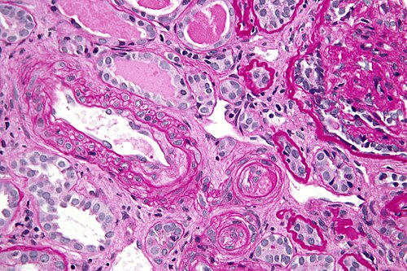
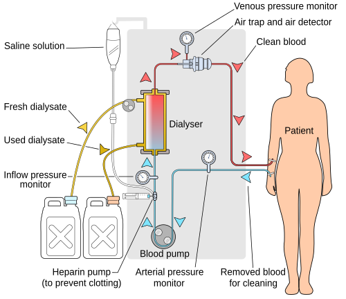

# SÍNDROME HEMOLÍTICO-URÊMICA

A Síndrome Hemolítico-Urêmica (SHU) não é apenas uma doença isolada, mas sim um desfecho clínico dramático de uma agressão endotelial sistêmica. Se você quer dominar este tema para as provas de residência e para a sua vida prática na pediatria, precisa entender que a SHU é a causa mais comum de Insuficiência Renal Aguda (IRA) em crianças pequenas, geralmente abaixo dos 5 anos de idade.

Para o examinador, a SHU é um prato cheio porque permite cobrar nefrologia, hematologia e infectologia em uma única questão. O segredo para não errar é memorizar a tríade clássica, mas entender o porquê de cada componente existir.

*Figura 1 - A Síndrome Hemolítico-Urêmica (SHU) é definida pela tríade: anemia hemolítica microangiopática (esquizócitos), trombocitopenia e insuficiência renal aguda. A forma típica (90%) é associada à E. coli O157:H7 produtora de toxina Shiga. Fonte: National Cancer Institute, Domínio Público | Wikimedia Commons*

## A Tríade Patognomônica: O Coração do Diagnóstico

Sempre que você ler um caso clínico de uma criança com história de diarreia que evolui com palidez e queda do débito urinário, seu cérebro deve gritar "SHU". A tríade que define esta síndrome é composta por:

- Anemia Hemolítica Microangiopática: Não é qualquer anemia. É uma anemia com provas de hemólise positivas (aumento de bilirrubina indireta e LDH) e, fundamentalmente, presença de esquizócitos no sangue periférico.

- Trombocitopenia: Geralmente abaixo de 150.000/mm³, decorrente do consumo de plaquetas nos microtrombos.

- Lesão Renal Aguda (LRA): Que pode variar desde uma hematúria/proteinúria leve até a anúria total com necessidade de diálise.

Por que isso acontece? Imagine o endotélio vascular, especialmente o dos glomérulos renais, como um tapete liso. Na SHU, esse tapete é destruído. O colágeno subendotelial fica exposto, atraindo plaquetas que formam "redes" de microtrombos. Quando as hemácias tentam passar por esses caminhos estreitos e cheios de trombos, elas são literalmente cortadas. O resultado? Esquizócitos (hemácias fragmentadas) e consumo de plaquetas. Como o rim é um órgão extremamente vascularizado e sensível a essas microtromboses, ele para de funcionar.

## Classificação e Etiologia: Onde as Bancas Focam

A divisão clássica que você encontrará nas provas separa a SHU em Típica e Atípica. Essa distinção é fundamental porque muda completamente o prognóstico e a conduta.

### SHU Típica (Associada à Diarreia ou STEC-SHU)

Representa cerca de 90% dos casos na pediatria. O grande vilão aqui é a *Escherichia coli* produtora de toxina Shiga (STEC), sendo o sorotipo O157:H7 o mais famoso.

A história é quase sempre a mesma: a criança ingere carne mal cozida, leite não pasteurizado ou água contaminada. Desenvolve uma gastroenterite que, em 70% dos casos, torna-se uma diarreia sanguinolenta. Após 5 a 10 dias do início da diarreia, quando os pais acham que a criança está melhorando da infecção intestinal, surge a palidez súbita, a oligúria e a irritabilidade.

### SHU Atípica (Não associada à toxina Shiga)

Aqui o buraco é mais embaixo. Não há relação com diarreia por STEC. A causa principal é uma desregulação genética da via alternativa do sistema complemento. O paciente tem uma deficiência de proteínas reguladoras (como o Fator H, Fator I ou CD46), o que leva a uma ativação incessante do complemento e destruição endotelial crônica.

Cuidado: a SHU atípica tem um prognóstico muito pior, com alta taxa de progressão para doença renal crônica e recorrência pós-transplante. Se a questão mostrar um lactente muito jovem (menos de 6 meses) ou uma SHU sem pródromo de diarreia, pense em SHU atípica.

### SHU Associada ao Pneumococo

Menos comum, mas cai em prova. O *Streptococcus pneumoniae* produz uma enzima chamada neuraminidase, que expõe um antígeno (antígeno Thomsen-Friedenreich) nas hemácias e no endotélio renal. O corpo reage contra esse antígeno. Dica de prova: aqui o teste de Coombs direto pode ser positivo, ao contrário da SHU clássica onde ele é obrigatoriamente negativo.

## Fisiopatologia: O Porquê do Sangue na Diarreia e do Rim Parar

A toxina Shiga entra na circulação e tem uma afinidade absurda pelo receptor Gb3 (globotriaosilceramida). Adivinha onde temos muitos receptores Gb3? No endotélio glomerular e nas células do cólon.

Ao se ligar ao Gb3, a toxina entra na célula e bloqueia a síntese proteica (atua na subunidade 60S do ribossomo), levando à morte celular. No intestino, isso causa necrose da mucosa e sangramento (diarreia sanguinolenta). No rim, causa a Microangiopatia Trombótica (MAT).

Como diz o Dr. Will em suas discussões clínicas no MedEvo, "o rim na SHU não é uma vítima passiva, ele é o campo de batalha onde a toxina Shiga decide encerrar a festa". Essa visão ajuda a entender por que o tratamento é focado em suporte e não em "matar a bactéria".

## Quadro Clínico e Exame Físico

O reconhecimento precoce salva rins. Você deve procurar por:

- Palidez cutâneo-mucosa acentuada (devido à hemólise súbita).

- Petéquias e equimoses (pela plaquetopenia), embora sangramentos graves sejam raros.

- Alterações do sensório: irritabilidade, letargia ou até convulsões (a microangiopatia também pode afetar o Sistema Nervoso Central).

- Edema e Hipertensão Arterial: decorrentes da falência renal e sobrecarga volêmica.

- Oligúria ou anúria.

Um erro comum de alunos é achar que toda SHU tem febre no momento do diagnóstico renal. Na verdade, a febre costuma estar presente na fase da diarreia e muitas vezes já desapareceu quando a tríade hemolítico-urêmica se instala.

## Diagnóstico Laboratorial: O que pedir?

Para confirmar a SHU, você precisa documentar os três pilares da tríade. Os valores de referência e achados típicos são:

- Hemograma: Anemia (Hb frequentemente entre 5 e 9 g/dL).

- Sangue Periférico: Presença de esquizócitos (essencial!). É o que diferencia a hemólise microangiopática de outras anemias.

- Marcadores de Hemólise: Reticulocitose, haptoglobina baixa, LDH muito elevado e Bilirrubina Indireta aumentada.

- Teste de Coombs Direto: Negativo (fundamental para excluir causas autoimunes).

- Plaquetometria: Trombocitopenia (geralmente entre 20.000 e 100.000/mm³).

- Função Renal: Elevação de ureia e creatinina.

- Urina I: Hematúria macro ou microscópica, proteinúria e cilindros granulares.

A coprocultura e a pesquisa da toxina Shiga nas fezes devem ser solicitadas, mas lembre-se: o resultado negativo não exclui o diagnóstico, pois a eliminação da bactéria pode ser curta. O padrão-ouro para identificar a STEC é a PCR para os genes da toxina (stx1 e stx2).

## Diagnóstico Diferencial: As Pegadinhas de Prova

Este é o ponto onde muitos candidatos perdem a questão. A banca vai colocar uma criança com massa abdominal e hematúria para te confundir.

### Tumor de Wilms (Nefroblastoma)

É o principal tumor renal na infância. Diferente da SHU, o Wilms se apresenta como uma massa abdominal palpável, firme, que geralmente NÃO cruza a linha média. A criança pode ter hipertensão e hematúria, mas NÃO tem a tríade de anemia hemolítica e plaquetopenia.
Associações importantes para prova: Síndrome WAGR (Wilms, Aniridia, malformações Geniturinárias e Retardo mental) e Síndrome de Beckwith-Wiedemann.

### Púrpura Trombocitopênica Trombótica (PTT)

Muito rara em crianças, mais comum em adultos. A fisiopatologia envolve a deficiência da enzima ADAMTS13. Clinicamente é muito parecida com a SHU, mas os sintomas neurológicos são muito mais proeminentes e a insuficiência renal é menos grave.

### Coagulação Intravascular Disseminada (CIVD)

Também apresenta esquizócitos e plaquetopenia. A diferença crucial? Na CIVD, os testes de coagulação (TP, TTPA e Fibrinogênio) estão alterados. Na SHU, o sistema de coagulação está, em regra, preservado; o problema é puramente plaquetário e endotelial.

### Glomerulonefrite Pós-Estreptocócica (GNPI)

Apresenta hematúria, edema e hipertensão. Porém, na GNPI, o complemento C3 está baixo, não há anemia hemolítica microangiopática e não há plaquetopenia.

| Característica | SHU Típica | PTT | CIVD | GNPI |
| --- | --- | --- | --- | --- |
| Plaquetas | Baixas | Muito Baixas | Baixas | Normais |
| Esquizócitos | Presentes | Presentes | Presentes | Ausentes |
| Coagulação (TP/TTPA) | Normal | Normal | Alterado | Normal |
| Função Renal | Muito Alterada | Levemente Alterada | Variável | Alterada |
| Complemento C3 | Normal | Normal | Normal | Baixo |

*Figura 2 - No manejo da SHU típica, o suporte clínico é fundamental: hidratação rigorosa, controle de eletrólitos e diálise quando necessário. Antibióticos estão CONTRAINDICADOS na fase aguda da SHU por E. coli (risco de liberação maciça de toxina Shiga). Fonte: Domínio Público | Wikimedia Commons*

## Manejo Terapêutico: O que fazer e, principalmente, o que NÃO fazer

O tratamento da SHU típica é predominantemente de suporte. Não existe uma "cura" mágica para a toxina que já se ligou ao endotélio.

### Suporte Hidroeletrolítico e Volêmico

O manejo da volemia é o maior desafio. Se o paciente está desidratado pela diarreia, ele precisa de volume. Mas, se ele já entrou em fase anúrica, o excesso de líquido causará edema agudo de pulmão e insuficiência cardíaca.

- Restrição hídrica se houver oligúria/anúria (balanço hídrico rigoroso).

- Controle rigoroso de eletrólitos, especialmente o Potássio.

### Manejo da Hipercalemia

Se o K+ estiver acima de 6,5 mEq/L ou houver alterações eletrocardiográficas (onda T apiculada, achatamento de P, alargamento de QRS), a conduta imediata é o Gluconato de Cálcio a 10% (0,5 a 1 ml/kg) para estabilização da membrana miocárdica. Isso não reduz o potássio, apenas protege o coração enquanto você usa medidas espoliantes (como resinas de troca ou diálise).

### Transfusões

- Concentrado de Hemácias: Indicado se a anemia for sintomática ou Hb < 6-7 g/dL. Deve ser feita lentamente para evitar sobrecarga volêmica.

- Plaquetas: CUIDADO! A transfusão de plaquetas é contraindicada de rotina na SHU. Por quê? Porque você está "jogando lenha na fogueira", fornecendo mais substrato para a formação de novos microtrombos. Só transfundimos se houver sangramento ativo grave ou necessidade de procedimento invasivo (como biópsia ou acesso central).

### Diálise

Cerca de 50% dos pacientes com SHU precisarão de terapia de substituição renal temporária. As indicações são as clássicas da LRA:

- Sobrecarga volêmica refratária (edema agudo de pulmão).

- Hipercalemia refratária.

- Acidose metabólica grave.

- Uremia sintomática (pericardite, encefalopatia).

### O Uso de Antibióticos: O Erro que Reprova

Esta é a dica de ouro do MedEvo: Na suspeita de SHU por STEC, NÃO se deve usar antibióticos.
Por que? Quando o antibiótico mata a *E. coli*, ocorre a lise bacteriana massiva, liberando uma quantidade ainda maior de toxina Shiga na luz intestinal, o que aumenta drasticamente o risco de desenvolver SHU ou piorar o quadro já instalado. Além disso, antiespasmódicos e antidiarreicos (como loperamida) também são proibidos, pois diminuem a motilidade intestinal e aumentam o tempo de exposição do corpo à toxina.

### Tratamentos Específicos na SHU Atípica

Se o diagnóstico for SHU Atípica (causa genética/complemento), o tratamento de escolha é o Eculizumabe, um anticorpo monoclonal que bloqueia a fração C5 do complemento. A plasmaférese pode ser usada como ponte enquanto se aguarda o Eculizumabe, mas não tem eficácia na SHU típica por STEC.

## Complicações e Prognóstico

A maioria das crianças com SHU típica recupera a função renal, mas cerca de 25% podem evoluir com algum grau de sequela a longo prazo (hipertensão, proteinúria ou redução da taxa de filtração glomerular).

As complicações extra-renais mais graves incluem:

- SNC: Convulsões, AVC isquêmico e coma.

- Gastrointestinal: Colite isquêmica, perfuração intestinal e pancreatite.

- Cardíaca: Miocardite e insuficiência cardíaca.

## Situações Especiais e Diagnósticos Associados

### Tumor de Wilms e Hipertensão

Lembre-se das pérolas clínicas: se a questão descreve uma massa abdominal que não cruza a linha média em uma criança de 2 a 4 anos, com hematúria e hipertensão, o diagnóstico é Tumor de Wilms. O exame inicial é a Ultrassonografia de abdome, mas a Tomografia (TC) é necessária para estadiamento e avaliação do rim contralateral. O tratamento envolve nefrectomia e quimioterapia (o Wilms é muito radiossensível e quimiossensível).

### Síndrome de Nutcracker (Quebra-nozes)

Uma causa rara de hematúria em crianças que pode aparecer como distrator. É a compressão da veia renal esquerda entre a artéria mesentérica superior e a aorta. Causa hematúria e dor em flanco esquerdo, sem as alterações sistêmicas da SHU.

## Pontos-Chave para Prova

- Tríade Clássica: Anemia hemolítica microangiopática (esquizócitos) + Trombocitopenia + LRA.

- Principal Etiologia: *E. coli* produtora de toxina Shiga (STEC), sorotipo O157:H7.

- Pródromo Típico: Diarreia sanguinolenta 5 a 10 dias antes do quadro renal.

- Exame Fundamental: Hematoscopia de sangue periférico revelando esquizócitos.

- Coombs Direto: Deve ser NEGATIVO na SHU típica (exclui causa autoimune).

- Antibióticos e Antidiarréicos: Contraindicação ABSOLUTA na fase de diarreia por STEC pelo risco de precipitar ou piorar a SHU.

- Transfusão de Plaquetas: Evitar ao máximo; indicada apenas em sangramentos ativos graves.

- Hipercalemia Grave: Usar Gluconato de Cálcio 10% para estabilização miocárdica (não reduz o K+, apenas protege).

- SHU Atípica: Suspeitar se < 6 meses de idade, sem diarreia ou recorrência. Causa é desregulação do complemento.

- Tratamento SHU Atípica: Eculizumabe é a primeira escolha.

- Diagnóstico Diferencial de Massa Renal: Tumor de Wilms (não cruza linha média, hematúria, HAS, sem anemia hemolítica).

- Principal causa de morte na fase aguda: Envolvimento do Sistema Nervoso Central.

- Seguimento a longo prazo: Obrigatório para monitorar hipertensão e proteinúria, mesmo após recuperação da função renal.

- 🩺 Lembre-se: A SHU é uma doença de manejo hospitalar rigoroso. O suporte bem feito é o que garante a sobrevivência do néfron.

 Cópia offline para consulta pessoal.
 Fonte original:
 [https://www.medevo.com.br/material-apoio/ler/940e8adf-c974-4067-bac7-cb1e2eb553de](https://www.medevo.com.br/material-apoio/ler/940e8adf-c974-4067-bac7-cb1e2eb553de)
