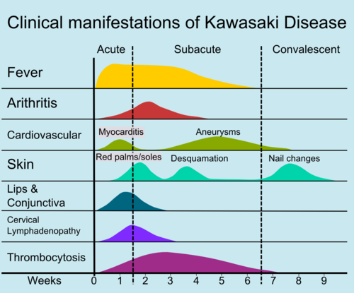
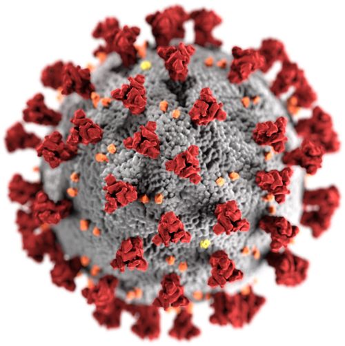

# SÍNDROME INFLAMATÓRIA MULTISSISTÊMICA PEDIÁTRICA

Para entender a Síndrome Inflamatória Multissistêmica Pediátrica, ou SIM-P, você precisa primeiro esquecer a imagem da COVID-19 como uma pneumonia viral típica. Na pediatria, o SARS-CoV-2 se manifesta de forma muito diferente do adulto. Enquanto no vovô o problema é a replicação viral aguda destruindo o pulmão, na criança o perigo mora no que acontece semanas depois da infecção.

A SIM-P não é uma infecção ativa, é um fenômeno pós-infeccioso. É o sistema imunológico da criança, que costuma ser muito reativo, "perdendo a mão" na resposta inflamatória. Imagine que o vírus foi o fósforo, mas a SIM-P é o incêndio que continua queimando mesmo depois que o fósforo se apagou.

*Figura 1 - A Síndrome Inflamatória Multissistêmica Pediátrica (SIM-P) é uma resposta hiperinflamatória pós-infecção por SARS-CoV-2 em crianças, com febre persistente, envolvimento de ≥2 órgãos e marcadores inflamatórios elevados. Diferencia-se da doença de Kawasaki pelo acometimento mais frequente de crianças maiores e adolescentes. Fonte: National Cancer Institute, Domínio Público | Wikimedia Commons*

## O que é e por que acontece (Fisiopatologia)

A SIM-P, também chamada internacionalmente de MIS-C (Multisystem Inflammatory Syndrome in Children), é uma condição hiperinflamatória grave. Ela ocorre, geralmente, entre 2 a 6 semanas após a exposição ao SARS-CoV-2.

Por que isso acontece? A teoria mais aceita, e que você deve levar para a prova, é a do superantígeno. Algumas proteínas do vírus agem como superantígenos, ativando uma quantidade absurda de linfócitos T de forma inespecífica. Isso gera uma "tempestade de citocinas" (IL-1, IL-6, TNF-alfa).

Diferente da COVID aguda, onde o vírus está lá se replicando (RT-PCR positivo), na SIM-P o vírus muitas vezes já foi embora. Por isso, o RT-PCR costuma vir negativo, mas a sorologia (IgG) vem positiva, denunciando que o corpo já teve contato com o inimigo.

Aqui no MedEvo, sempre reforçamos: a SIM-P é uma vasculite sistêmica. Ela inflama os vasos, e onde tem vaso, tem sintoma. É por isso que ela ataca o coração, o intestino, a pele e os rins ao mesmo tempo.

## Critérios Diagnósticos: O Coração da Prova

As bancas amam os critérios do Ministério da Saúde e da OMS. Você não pode ir para a prova sem saber os números exatos. Não basta ter febre, tem que ser a febre "certa".

Segundo o Ministério da Saúde do Brasil, para fechar o diagnóstico de SIM-P, precisamos de:

- Idade: 0 a 19 anos.

- Febre: Elevada e persistente (mínimo de 3 dias).

- Evidência de inflamação: PCR, VHS ou Procalcitonina elevados.

- Pelo menos DOIS dos seguintes achados:

- Manifestações mucocutâneas: Conjuntivite não purulenta, exantema bilateral ou sinais de inflamação mucocutânea (boca, mãos ou pés).

- Hipotensão ou Choque.

- Disfunção Miocárdica: Alterações no ecocardiograma ou elevação de Troponina/BNP.

- Coagulopatia: Alteração de TP, TTPA ou D-dímero elevado.

- Manifestações Gastrointestinais Agudas: Dor abdominal, vômitos ou diarreia.

- Evidência de COVID-19: RT-PCR positivo, teste de antígeno positivo, sorologia positiva ou história de contato com caso confirmado.

- Exclusão de outras causas: Como sepse bacteriana ou síndrome do choque tóxico.

**Cuidado com a pegadinha:** A febre na SIM-P é obrigatória e deve durar pelo menos 3 dias. Se a questão trouxer uma criança com 1 dia de febre e choque, pense em sepse, não em SIM-P ainda.

### Tabela 1: Critérios Diagnósticos SIM-P (Ministério da Saúde/OMS)

| Critério | Descrição Obrigatória |
| --- | --- |
| **Faixa Etária** | 0 a 19 anos |
| **Febre** | ≥ 38°C por ≥ 3 dias |
| **Marcadores Inflamatórios** | PCR, VHS, Ferritina ou LDH elevados |
| **Clínica (2 ou mais)** | Mucocutâneo, Choque, Cardíaco, Coagulopatia, Gastrointestinal |
| **Vínculo Epidemiológico** | RT-PCR+, Sorologia+ ou Contato com COVID-19 |
| **Exclusão** | Ausência de outros focos infecciosos óbvios |

## Quadro Clínico: Onde o Aluno se Confunde

O quadro clínico da SIM-P é um camaleão. Ele se parece com muita coisa, mas tem "assinaturas" que o Dr. Will sempre destaca nas discussões de caso.

### O Coração em Perigo

A disfunção miocárdica é a característica mais grave e frequente. Diferente da Doença de Kawasaki clássica, onde a preocupação principal são as artérias coronárias (aneurismas), na SIM-P o problema maior é a miocárdite com choque cardiogênico. A criança chega pálida, com tempo de enchimento capilar lentificado e muitas vezes precisa de aminas vasoativas.

### O Abdome Agudo "Falso"

Muitas crianças com SIM-P são levadas ao cirurgião pediátrico com suspeita de apendicite. A dor abdominal é intensa, acompanhada de vômitos e diarreia. Por que isso acontece? Pela vasculite dos vasos mesentéricos e inflamação da parede intestinal. Se a questão mostrar uma "apendicite" com conjuntivite e febre alta, pare tudo: é SIM-P até que se prove o contrário.

### Sinais Mucocutâneos

Aqui é onde a SIM-P "imita" o Kawasaki. Temos o exantema (que pode ser de qualquer tipo, exceto vesicular), a conjuntivite não purulenta (olho vermelho que não sai remela), a língua em framboesa e o edema de mãos e pés.

## Diagnóstico Diferencial: SIM-P vs. Doença de Kawasaki

Este é o tópico preferido das provas de residência. Eles vão colocar um caso clínico e você terá que decidir entre os dois. Embora a SIM-P compartilhe características com o Kawasaki, elas não são a mesma coisa.

Pense na idade. O Kawasaki é doença de "bebezinho" (lactentes e pré-escolares, geralmente < 5 anos). A SIM-P é doença de "menino grande" (escolares e adolescentes, média de 8 a 10 anos).

Pense no laboratório. Na SIM-P, a inflamação é muito mais exuberante. O D-dímero explode, a ferritina vai às alturas e, um detalhe crucial: a SIM-P costuma cursar com linfopenia e trombocitopenia (plaquetas baixas) no início, enquanto o Kawasaki clássico cursa com trombocitose (plaquetas altas) após a primeira semana.

### Tabela 2: Diferenças Cruciais entre SIM-P e Doença de Kawasaki

| Característica | SIM-P (MIS-C) | Doença de Kawasaki |
| --- | --- | --- |
| **Idade média** | 8 a 11 anos | < 5 anos |
| **Choque/Hipotensão** | Muito comum (50-80%) | Raro |
| **Sintomas GI** | Muito proeminentes | Incomuns |
| **Linfócitos** | Linfopenia acentuada | Geralmente normais |
| **Plaquetas** | Trombocitopenia ou normais | Trombocitose (fase subaguda) |
| **Marcadores Cardíacos** | BNP e Troponina muito elevados | Levemente elevados |
| **Ferritina** | Muito elevada | Levemente elevada |

## Avaliação Laboratorial e Exames Complementares

Se você suspeita de SIM-P, o "check-up" deve ser agressivo. Não dá para economizar nos exames, pois precisamos avaliar a disfunção de múltiplos órgãos.

- **Marcadores de Inflamação:** PCR e VHS (sempre elevados), Ferritina, LDH.

- **Avaliação Cardíaca:** Troponina e NT-proBNP (essenciais para flagrar a miocardite precocemente).

- **Ecocardiograma:** Deve ser feito em todos os pacientes. Buscamos disfunção ventricular esquerda, derrame pericárdico e, claro, dilatações ou aneurismas de coronárias.

- **Hemograma:** Procure por linfopenia (comum na fase aguda) e neutrofilia.

- **Coagulograma:** D-dímero elevado é quase onipresente na SIM-P.

- **Pesquisa de SARS-CoV-2:** Solicitar RT-PCR (pode estar negativo) e Sorologia IgG (geralmente positiva).

**Exemplo Clínico Rápido:**
Menino de 10 anos, febre há 4 dias, dor abdominal intensa e manchas vermelhas pelo corpo. Ao exame: PA 80/40 mmHg (hipotenso), FC 140 bpm, olhos vermelhos sem secreção. Laboratório: PCR 250 mg/L, Linfócitos 600/mm³, Plaquetas 110.000/mm³, Troponina elevada.
*Diagnóstico:* SIM-P. O choque aqui é provavelmente misto (vasogênico pela inflamação e cardiogênico pela miocardite).

*Figura 2 - O tratamento da SIM-P inclui imunoglobulina intravenosa (IVIG), corticosteroides e anticoagulação profilática. Suporte hemodinâmico em UTI pode ser necessário nos quadros de choque cardiogênico. Fonte: Domínio Público, CDC | Wikimedia Commons*

## Tratamento: Como apagar o incêndio

O tratamento da SIM-P baseia-se na imunomodulação. Queremos frear a resposta imune antes que ela destrua o coração da criança.

### 1. Imunoglobulina Humana Endovenosa (IGIV)

É a primeira escolha. A dose é de 2 g/kg, administrada em infusão lenta. Por que usamos? Ela tem um efeito anti-inflamatório potente e ajuda a prevenir a formação de aneurismas coronarianos, assim como fazemos no Kawasaki.

### 2. Corticosteroides

Diferente do Kawasaki clássico, onde o corticoide costuma ser reservado para casos resistentes, na SIM-P ele é frequentemente usado logo de cara, junto com a IGIV, especialmente nos casos graves (choque).

- Casos leves/moderados: Metilprednisolona 2 mg/kg/dia.

- Casos graves (choque): Pulsoterapia com Metilprednisolona (30 mg/kg/dia por 1 a 3 dias).

### 3. Ácido Acetilsalicílico (AAS)

Usamos o AAS principalmente se o paciente tiver características de Kawasaki ou se houver dilatação de coronárias.

- Dose anti-inflamatória: 30 a 50 mg/kg/dia (alguns protocolos usam até 80 mg/kg/dia, mas a tendência atual é mais conservadora).

- Dose antiagregante: 3 a 5 mg/kg/dia (usada após a febre sumir).

### 4. Suporte de Terapia Intensiva

Muitos desses pacientes precisam de UTI. O manejo do choque deve ser cuidadoso. Como há miocardite, o excesso de soro (cristaloides) pode causar edema agudo de pulmão. Se o paciente não responder a 20-40 ml/kg de soro, partimos logo para drogas inotrópicas (milrinone, dobutamina ou adrenalina).

### 5. Antibioticoterapia

"Mas professor, você disse que é inflamatório, não infeccioso!" Sim, mas na chegada, o quadro é indistinguível de um choque séptico bacteriano. Portanto, colhemos culturas e iniciamos antibiótico de amplo espectro (como Ceftriaxone + Oxacilina ou Vancomicina). Assim que as culturas negativarem e a SIM-P se confirmar, suspendemos o antibiótico.

### Tabela 3: Resumo do Tratamento Farmacológico

| Droga | Dose | Indicação Principal |
| --- | --- | --- |
| **IGIV** | 2 g/kg (dose única) | Todos os casos moderados/graves |
| **Metilprednisolona** | 2 mg/kg/dia (IV) | Associado à IGIV na maioria dos casos |
| **Pulsoterapia** | 30 mg/kg/dia | Casos de choque refratário |
| **AAS (Fase Aguda)** | 30-50 mg/kg/dia | Se fenótipo de Kawasaki |
| **AAS (Manutenção)** | 3-5 mg/kg/dia | Antiagregação plaquetária |
| **Enoxaparina** | Dose profilática | Se alto risco de trombose (D-dímero muito alto) |

## Complicações e Seguimento

A complicação mais temida a longo prazo são os aneurismas de artérias coronárias. Por isso, mesmo que a criança receba alta bem, ela precisa de um ecocardiograma de controle em 2 e 6 semanas após o quadro inicial.

A boa notícia é que, apesar de ser uma doença assustadora que leva a criança à UTI, a maioria responde muito rápido ao tratamento com IGIV e corticoide. A função cardíaca costuma normalizar em poucos dias ou semanas.

## Diagnósticos Diferenciais Importantes (Além do Kawasaki)

Não deixe a banca te enganar. Nem toda febre com rash é SIM-P.

- **Síndrome PFAPA:** Febre periódica, estomatite aftosa, faringite e adenite cervical. A chave aqui é a periodicidade (ocorre todo mês, certinho) e a criança está ótima entre os episódios. Não há choque ou disfunção orgânica.

- **Neutropenia Cíclica:** Também causa febre e aftas, mas o hemograma mostra a queda dos neutrófilos de forma cíclica.

- **Síndrome do Choque Tóxico (SCT):** Causada por toxinas do *Staphylococcus aureus* ou *Streptococcus pyogenes*. É muito parecida com a SIM-P, mas costuma ter um foco infeccioso (como uma ferida cirúrgica ou uso de absorvente interno) e o isolamento da bactéria ajuda no diagnóstico.

## Notificação Compulsória

No Brasil, a SIM-P é uma doença de notificação compulsória imediata. Todo caso suspeito deve ser notificado às autoridades de saúde. Isso é uma questão clássica de saúde pública em provas de pediatria.

## Pontos-Chave para Prova

- A SIM-P é uma condição pós-infecciosa (2-6 semanas após COVID-19), não é infecção aguda.

- Critério de febre: Mínimo de 3 dias (≥ 38°C).

- Idade: Acomete crianças mais velhas e adolescentes (diferente do Kawasaki).

- Manifestações Gastrointestinais: São extremamente comuns e podem simular abdome agudo cirúrgico.

- Disfunção Miocárdica: É a marca registrada da gravidade; procure por Troponina e BNP elevados.

- Laboratório Típico: PCR muito alto, Linfopenia, Trombocitopenia inicial e D-dímero elevado.

- Sorologia: O IgG para SARS-CoV-2 costuma ser positivo, confirmando o contato prévio.

- Tratamento Padrão-Ouro: Imunoglobulina (IGIV) 2 g/kg + Corticoide (Metilprednisolona).

- Diferença no Choque: Na SIM-P o choque é frequente; no Kawasaki é raro.

- Diferença nas Plaquetas: SIM-P tem plaquetas baixas/normais; Kawasaki tem trombocitose tardia.

- O Ecocardiograma é obrigatório para avaliar função ventricular e coronárias.

- Notificação: É obrigatória e imediata no território nacional.

- O RT-PCR para COVID-19 pode ser negativo em até 70% dos casos de SIM-P.

- Primeira escolha no choque: Se houver disfunção miocárdica no ECO, prefira inotrópicos (adrenalina/dobutamina) após expansão cautelosa.

- Erro comum: Achar que precisa de RT-PCR positivo para diagnosticar. O contato epidemiológico ou sorologia positiva bastam.

- Pegadinha de prova: Dizer que a SIM-P só ocorre em crianças com comorbidades. Falso! A maioria era previamente hígida. 🩺

 Cópia offline para consulta pessoal.
 Fonte original:
 [https://www.medevo.com.br/material-apoio/ler/dc1c5621-2ddc-4546-a7c4-d71c58be667f](https://www.medevo.com.br/material-apoio/ler/dc1c5621-2ddc-4546-a7c4-d71c58be667f)
