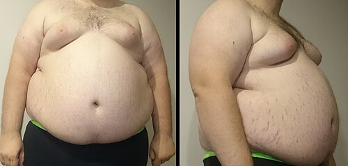
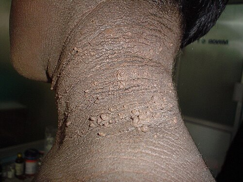

# SÍNDROME METABÓLICA

A **Síndrome Metabólica (SM)** é um agrupamento de fatores de risco metabólicos inter-relacionados que aumentam significativamente o risco cardiovascular e de diabetes tipo 2, sendo um tema de alta relevância clínica e em provas.

*Figura 1 - A obesidade central (visceral) é o componente-chave da Síndrome Metabólica. Os critérios IDF/NCEP-ATP III incluem pelo menos 3 de 5: obesidade abdominal, hipertrigliceridemia (≥150 mg/dL), HDL baixo, HAS (≥130/85 mmHg) e glicemia de jejum ≥100 mg/dL. Fonte: FatM1ke, Domínio Público | Wikimedia Commons*

## Definição e Conceitos Essenciais

A **Síndrome Metabólica (SM)** não é uma doença única, mas um agrupamento de fatores de risco metabólicos que, quando presentes no mesmo indivíduo, elevam exponencialmente o risco de **doenças cardiovasculares (DCV)** e **Diabetes Mellitus tipo 2 (DM2)**.

- O cerne da fisiopatologia é a **resistência insulínica** e a **deposição de gordura visceral**.

- A compreensão da importância da circunferência abdominal sobre o IMC e a relação entre triglicerídeos altos/HDL baixo é crucial para as provas.

## Critérios Diagnósticos: Onde as Bancas Fazem a Festa

Para o diagnóstico da Síndrome Metabólica, os dois critérios mais relevantes para provas são o **NCEP-ATP III** e o **Critério Harmonizado (Diretriz Brasileira)**.

### NCEP-ATP III (National Cholesterol Education Program)

O paciente deve apresentar **pelo menos 3 dos 5 critérios** abaixo. Nenhum componente isolado é obrigatório; a circunferência abdominal é muito importante, mas não substitui os demais critérios.

- **Obesidade Abdominal:** Circunferência abdominal (CA) ≥ 102 cm em homens e ≥ 88 cm em mulheres.

- **Triglicerídeos (TG):** ≥ 150 mg/dL (ou em tratamento para hipertrigliceridemia).

- **HDL-C:** < 40 mg/dL em homens e < 50 mg/dL em mulheres (ou em tratamento).

- **Pressão Arterial (PA):** ≥ 130 mmHg na sistólica ou ≥ 85 mmHg na diastólica (ou em uso de anti-hipertensivos).

- **Glicemia de Jejum:** ≥ 100 mg/dL (ou em tratamento para diabetes).

### Critério Harmonizado (Diretriz Brasileira)

No critério harmonizado, o diagnóstico também exige **3 dos 5 componentes**; a circunferência abdominal não é obrigatória, mas seus pontos de corte são ajustados por população/etnia. Para a prática no Brasil, usam-se com frequência os pontos de corte IDF:

- **Homens:** CA ≥ 94 cm

- **Mulheres:** CA ≥ 80 cm

- Os demais critérios (triglicerídeos, HDL, pressão e glicemia) permanecem idênticos aos do NCEP-ATP III.

**Tabela 1: Comparativo de Critérios Diagnósticos**

| Parâmetro | NCEP-ATP III (3 de 5) | Harmonizado/IDF (Brasil) |
| --- | --- | --- |
| Circunferência Abdominal (H) | ≥ 102 cm | ≥ 94 cm |
| Circunferência Abdominal (M) | ≥ 88 cm | ≥ 80 cm |
| Triglicerídeos | ≥ 150 mg/dL | ≥ 150 mg/dL |
| HDL-C (H) | < 40 mg/dL | < 40 mg/dL |
| HDL-C (M) | < 50 mg/dL | < 50 mg/dL |
| Pressão Arterial | ≥ 130 / 85 mmHg | ≥ 130 / 85 mmHg |
| Glicemia de Jejum | ≥ 100 mg/dL | ≥ 100 mg/dL |

> 💡 **Macete:** O **IMC não é critério diagnóstico** para Síndrome Metabólica em nenhuma diretriz principal. O que importa é a **gordura visceral**, medida pela circunferência abdominal.

## Fisiopatologia: O Porquê de Tudo

A **resistência insulínica** e a **adiposidade visceral** são os pilares da fisiopatologia da SM.

### O Papel do Adipócito Visceral

- O tecido adiposo visceral é um **órgão endócrino ativo**. Quando expandido (obesidade central), torna-se disfuncional.

- Libera excesso de **ácidos graxos livres** diretamente na circulação portal, atingindo o fígado.

- Secreta **citocinas pró-inflamatórias** (TNF-alfa, IL-6) e reduz a secreção de **adiponectina** (substância protetora que aumenta a sensibilidade à insulina).

### A Cascata da Resistência Insulínica

Com o fígado exposto a ácidos graxos e citocinas, a insulina não age eficazmente, gerando um ciclo vicioso:

- **No Fígado:** Aumento da produção de glicose (gliconeogênese) e síntese de VLDL (resultando em triglicerídeos altos).

- **No Músculo:** Menor captação de glicose, levando à hiperglicemia.

- **No Pâncreas:** Inicialmente, hiperinsulinemia compensatória. Com o tempo, falha das células beta e desenvolvimento de DM2.

### Por que a Pressão Sobe?

- A **hiperinsulinemia** estimula o sistema nervoso simpático e promove a reabsorção de sódio nos túbulos renais.

- A **inflamação crônica** causa disfunção endotelial, reduzindo a produção de óxido nítrico (vasodilatador) e aumentando a rigidez arterial.

## Epidemiologia e Fatores de Risco

A prevalência da Síndrome Metabólica no Brasil é alta, atingindo cerca de **30% da população adulta** e mais de 50% em idosos.

- **Fatores de risco:** Dieta inadequada, sedentarismo, predisposição genética, tabagismo e etilismo (catalisadores do risco cardiovascular).

> 💡 **Conexão Clínica:** A SM se associa fortemente a **MASLD/esteatose hepática metabólica**, SOP, apneia obstrutiva do sono, hiperuricemia e doença renal crônica. DRGE pode coexistir com obesidade central, mas não é componente diagnóstico nem o eixo principal do tema.

*Figura 2 - Acantose nigricans cervical, sinal cutâneo que sugere hiperinsulinemia/resistência insulínica e reforça a investigação de Síndrome Metabólica. Fonte: Vandana Mehta Rai MD DNB e C. Balachandran MD, CC BY-SA 3.0 | Wikimedia Commons.*

## Quadro Clínico e Exame Físico

O paciente com SM raramente é sintomático pela síndrome em si, mas sim por suas complicações. O exame físico é fundamental.

### Inspeção e Medidas

- A **circunferência abdominal** deve ser medida no ponto médio entre a última costela e a crista ilíaca, ao final de uma expiração normal.

- **Sinais de resistência insulínica:**

- **Acantose Nigricans:** Placas aveludadas e hiperpigmentadas em dobras (pescoço, axilas), marcador clássico de hiperinsulinemia/resistência insulínica, mas não patognomônico.

- **Acrocórdons:** Pequenas papilas cutâneas, frequentemente associadas à acantose.

### Pressão Arterial

- Medida após 5 minutos de repouso, bexiga vazia, sem ter fumado ou tomado café nos últimos 30 minutos.

- Para o critério de SM, valores **≥ 130/85 mmHg** já contam, mesmo que não classifiquem o paciente como hipertenso estágio 1 (≥ 140/90 mmHg) pelos critérios clássicos.

## Diagnóstico Laboratorial e Diferencial

A avaliação mínima inclui circunferência abdominal, pressão arterial, glicemia de jejum ou HbA1c e lipidograma (TG, HDL-C, LDL-C/não-HDL-C). Além dos exames para os critérios, é importante investigar danos em órgãos-alvo e condições associadas.

### Exames Complementares Recomendados

- **Ácido Úrico:** Frequentemente elevado (hiperuricemia).

- **Microalbuminúria:** Marcador precoce de dano renal e disfunção endotelial.

- **Transaminases (TGP/ALT):** Para rastrear **Doença Hepática Esteatótica Associada à Disfunção Metabólica (MASLD)**, anteriormente conhecida como Esteatose Hepática Não Alcoólica (EHNA).

- **PCR-ultrassensível:** Marcador de inflamação subclínica.

### Diagnóstico Diferencial

Suspeitar de causas secundárias se o fenótipo for sugestivo:

- **Síndrome de Cushing:** Obesidade centrípeta, estrias violáceas largas, giba, fraqueza muscular proximal.

- **Hipotireoidismo:** Ganho de peso, bradicardia, pele seca.

- **Síndrome dos Ovários Policísticos (SOP):** Em mulheres, resistência insulínica, hirsutismo, irregularidade menstrual.

- **Acromegalia:** Crescimento de extremidades, prognatismo.

**Tabela 2: Diagnóstico Diferencial da Resistência Insulínica**

| Condição | Pistas Clínicas | Exame Diferencial |
| --- | --- | --- |
| Síndrome Metabólica | Obesidade central, história familiar | Critérios clínicos/laboratoriais |
| Síndrome de Cushing | Estrias purpúreas, fácies em lua cheia | Cortisol livre urinário / Supressão com Dexa |
| SOP | Hirsutismo, acne, oligomenorreia | Ultrassom de ovários, Testosterona |
| Acromegalia | Crescimento de extremidades, prognatismo | IGF-1 e GH |

## Tratamento Não Farmacológico: A Base de Tudo

A **Mudança de Estilo de Vida (MEV)** é a intervenção mais eficaz para reverter a fisiopatologia da síndrome.

### Dieta

- **Padrões alimentares:** Dieta Mediterrânea ou DASH (ricas em frutas, vegetais, grãos integrais, peixes, gorduras insaturadas).

- **Sódio:** Limitar a < 5g de sal por dia (≈ 2g de sódio).

- **Açúcares:** Eliminar bebidas açucaradas e reduzir carboidratos simples para diminuir triglicerídeos.

### Atividade Física

- **Aeróbico:** Mínimo de **150 minutos por semana** de intensidade moderada (ou 75 min de intensidade vigorosa).

- **Resistido (Musculação):** Pelo menos **2 vezes por semana**. Aumenta a massa muscular e melhora a sensibilidade à insulina.

### Perda de Peso

- Meta inicial: **perda de 5% a 10% do peso corporal**. Já melhora a PA e a sensibilidade à insulina.

## Tratamento Farmacológico: Quando e Como Intervir

O tratamento medicamentoso é direcionado para cada componente da síndrome, visando atingir metas específicas.

### Dislipidemia

- **Estatinas:** Primeira escolha, dose conforme risco cardiovascular (Escore de Risco Global). Foco no **não-HDL** (VLDL, IDL, LDL).

- **Fibratos:** Indicados como primeira escolha apenas se **Triglicerídeos > 500 mg/dL** (para prevenir pancreatite). Se TG entre 150-499, o foco inicial é estatina e controle glicêmico.

-

> ⚠️ **Cuidado:** A associação de **Estatina + Gemfibrozila é contraindicada** pelo alto risco de rabdomiólise. Se precisar associar fibrato, use o **Fenofibrato**.

### Hipertensão Arterial

- **IECA ou BRA:** Drogas de escolha na SM. Melhoram a sensibilidade à insulina e promovem nefroproteção.

- **Bloqueadores de Canais de Cálcio:** Ótima segunda opção, metabolicamente neutros.

- **Evitar:** Diuréticos tiazídicos em doses altas e Betabloqueadores de primeira geração (ex: Atenolol) podem piorar a resistência insulínica e o perfil lipídico. Preferir Betabloqueadores vasodilatadores (Carvedilol, Nebivolol) se necessário.

### Glicemia e Resistência Insulínica

- **Metformina:** Pode ser considerada em **pré-diabetes de alto risco** (glicemia 100-125 mg/dL ou HbA1c 5,7-6,4%), especialmente se IMC ≥ 35 kg/m², idade < 60 anos ou história de diabetes gestacional. Não substitui perda de peso e atividade física.

- **Inibidores da SGLT2 (Glifozinas) e Agonistas do GLP-1:** Embora focados em diabetes estabelecido, são benéficos na SM por promoverem perda de peso e proteção cardiovascular/renal.

**Tabela 3: Metas Terapêuticas (SBC / Diretrizes Brasileiras)**

| Parâmetro | Meta Geral | Observação |
| --- | --- | --- |
| Pressão Arterial | < 130 / 80 mmHg | Se tolerado pelo paciente |
| LDL-C (risco alto) | < 70 mg/dL | Baseado na estratificação de risco cardiovascular |
| LDL-C (risco muito alto) | < 50 mg/dL | Considerar < 40 mg/dL em risco extremo/recorrência, conforme diretriz |
| Triglicerídeos | < 150 mg/dL | Foco em dieta e controle glicêmico |
| Hemoglobina Glicada | < 7,0% | Individualizar para idosos (pode ser < 8%) |

## Situações Especiais

### O Idoso

- A SM no idoso se confunde com a **sarcopenia**. A CA pode aumentar sem ganho de peso total.

- Metas de PA e glicemia devem ser mais flexíveis para evitar hipotensão ortostática e hipoglicemia, que levam a quedas e fraturas.

### Gestantes

- SM prévia à gestação é fator de risco para **Pré-eclâmpsia e Diabetes Gestacional**.

- Manejo com dieta e, se necessário, Metformina ou Insulina (conforme diretrizes da FEBRASGO).

- **IECA e BRA são contraindicações absolutas na gestação** (teratogênicos).

## Complicações e Prognóstico

O paciente com SM morre de **Infarto Agudo do Miocárdio (IAM)** ou **Acidente Vascular Cerebral (AVC)**.

- **MASLD (Doença Hepática Esteatótica Associada à Disfunção Metabólica):** Principal causa de cirrose criptogênica. O excesso de gordura no fígado causa inflamação crônica (esteato-hepatite) que evolui para fibrose e cirrose.

- O prognóstico depende da agressividade no tratamento dos fatores modificáveis.

## Estratificação de Risco

Utilize o **Escore de Risco Global (ERG)** para individualizar o tratamento.

- **Baixo Risco:** Risco de evento cardiovascular em 10 anos < 5%.

- **Risco Intermediário:** Homens 5-20%, Mulheres 5-10%.

- **Alto Risco:** > 20% para homens, > 10% para mulheres, ou presença de aterosclerose subclínica (placa na carótida, escore de cálcio > 100).

- **SM + Diabetes = Alto Risco**, no mínimo.

## 📌 Pontos-Chave para Prova

- **Critério NCEP-ATP III:** 3 dos 5 (CA ≥ 102/88; TG ≥ 150; HDL < 40/50; PA ≥ 130/85; Glicemia ≥ 100).

- **Critério Brasileiro (Harmonizado):** 3 dos 5 componentes; CA IDF (≥ 94 cm H / ≥ 80 cm M), sem obrigatoriedade de obesidade abdominal isolada.

- **Fisiopatologia:** Resistência Insulínica pela gordura visceral (portal).

- **Exame Físico:** Acantose nigricans é forte pista clínica de resistência insulínica, mas não é patognomônica.

- **IMC não é critério diagnóstico** para Síndrome Metabólica.

- **Tratamento não farmacológico:** MEV é a base (150 min exercício/semana, perda de 5-10% do peso).

- **Anti-hipertensivos de escolha:** IECA e BRA (melhoram sensibilidade à insulina).

- **Dislipidemia:** Estatinas são a base; fibratos para TG > 500 mg/dL.

- **Contraindicação Absoluta:** Nunca associar Gemfibrozila com Estatinas (risco de rabdomiólise).

- **Metformina:** Considerar no pré-diabetes se alto risco (IMC > 35, história de diabetes gestacional).

- **Complicação:** Aumenta o risco de MASLD (esteatose hepática), que pode evoluir para cirrose.

- **Pegadinha PA:** Critério para SM é ≥ 130/85 mmHg, não ≥ 140/90 mmHg.

- **Associação indireta:** Obesidade central → DRGE → Risco de complicações laríngeas.

- **Tabagismo:** Não é critério, mas é principal fator multiplicador de risco cardiovascular.

- **Microalbuminúria:** Pesquisar como marcador de lesão de órgão-alvo.

- **Idosos:** Metas mais flexíveis para evitar hipotensão e hipoglicemia.

 Cópia offline para consulta pessoal.
 Fonte original:
 [https://www.medevo.com.br/material-apoio/ler/8f46777b-b31b-4c6c-a54e-6357ea66fa59](https://www.medevo.com.br/material-apoio/ler/8f46777b-b31b-4c6c-a54e-6357ea66fa59)
