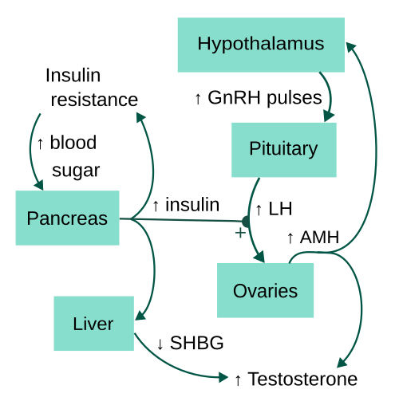

# SÍNDROME METABÓLICA NA SOP

Para entender a Síndrome dos Ovários Policísticos (SOP), você precisa parar de olhar apenas para o ovário. O nome da síndrome é, na verdade, um "erro" histórico que foca na consequência e não na causa. Na prova de residência e na vida real, a SOP deve ser encarada como uma síndrome endocrino-metabólica sistêmica.

A relação entre SOP e Síndrome Metabólica (SM) é tão íntima que muitos autores consideram a SOP a manifestação feminina da resistência à insulina. Se você entender o mecanismo por trás da insulina, você acerta 90% das questões sobre o tema.

*Figura 1 - Na SOP, a resistência insulínica e a hiperandrogenemia criam um ciclo vicioso que predispõe à síndrome metabólica: a hiperinsulinemia estimula a produção ovariana de androgênios e a adipogênese visceral, amplificando o risco cardiovascular. Fonte: National Cancer Institute, Domínio Público | Wikimedia Commons*

## Fisiopatologia: O Porquê da Bagunça Metabólica

Por que uma mulher com SOP desenvolve resistência à insulina (RI) e por que isso gera hiperandrogenismo?

O defeito central na maioria das pacientes é a resistência periférica à insulina, especialmente no músculo e no tecido adiposo. Para compensar essa resistência, o pâncreas trabalha dobrado, gerando uma hiperinsulinemia compensatória. É aqui que o problema começa para o ginecologista.

A insulina alta atua de duas formas perversas:

-

No Fígado: A insulina inibe a produção de SHBG (Globulina Ligadora de Hormônios Sexuais). Se temos menos SHBG circulando, temos menos "carona" para a testosterona. Resultado: a testosterona livre (a fração biologicamente ativa) sobe drasticamente. É por isso que, em provas, a queda do SHBG é um marcador clássico de hiperinsulinemia na SOP.

-

No Ovário: A insulina age em sinergia com o LH nas células da teca, estimulando a produção excessiva de androgênios. Além disso, ela inibe a aromatase nas células da granulosa, impedindo a conversão desses androgênios em estrogênios.

O ciclo vicioso se fecha: o excesso de androgênios favorece o acúmulo de gordura visceral (padrão androide), que por sua vez piora a resistência à insulina. Como o Dr. Will costuma enfatizar nas discussões do MedEvo, se você não quebrar esse ciclo com mudança de estilo de vida, o tratamento medicamentoso será apenas um "tapa-buraco".

## Critérios Diagnósticos da SOP: O Consenso de Rotterdam

As bancas amam os Critérios de Rotterdam (2003), que continuam sendo o padrão-ouro. Para o diagnóstico, a paciente deve apresentar pelo menos 2 dos 3 critérios abaixo, após excluir outras patologias:

- Oligo-ovulação ou anovulação: Clinicamente manifestada como irregularidade menstrual (ciclos > 35 dias ou < 9 episódios por ano).

- Hiperandrogenismo: Pode ser clínico (hirsutismo, acne, alopecia) ou laboratorial (elevação de testosterona total ou livre).

- Ovários Policísticos à Ultrassonografia: Presença de 12 ou mais folículos medindo entre 2 e 9 mm em pelo menos um dos ovários, OU volume ovariano > 10 cm³.

Cuidado: Se a paciente usa anticoncepcional, a ultrassonografia perde o valor diagnóstico. Além disso, em adolescentes (até 8 anos após a menarca), o critério de imagem não deve ser utilizado isoladamente, pois ovários multifoliculares são fisiológicos nessa fase.

### Tabela 1: Fenótipos da SOP (Rotterdam)

| Fenótipo | Hiperandrogenismo | Disfunção Ovulatória | Morfologia Policística (USG) | Risco Metabólico |
| --- | --- | --- | --- | --- |
| A (Clássico) | Sim | Sim | Sim | Muito Alto |
| B | Sim | Sim | Não | Alto |
| C (Ovulatório) | Sim | Não | Sim | Moderado |
| D (Não-androgênico) | Não | Sim | Sim | Baixo |

## Diagnóstico da Síndrome Metabólica na SOP

Não basta diagnosticar a SOP; você é obrigado a rastrear a Síndrome Metabólica. Segundo a Diretriz Brasileira de Síndrome Metabólica e o NCEP-ATP III, o diagnóstico é feito com 3 dos 5 critérios abaixo:

- Obesidade Abdominal: Circunferência abdominal > 88 cm em mulheres.

- Triglicerídeos: ≥ 150 mg/dL (ou em tratamento).

- HDL-C: < 50 mg/dL em mulheres (ou em tratamento).

- Pressão Arterial: ≥ 130/85 mmHg (ou em tratamento).

- Glicemia de Jejum: ≥ 100 mg/dL (ou diagnóstico prévio de DM2).

Erro comum de prova: Achar que o IMC entra nos critérios de Síndrome Metabólica. Não entra. O critério é a circunferência abdominal, que reflete a gordura visceral, a verdadeira vilã da resistência à insulina.

## Manifestações Cutâneas e o Exame Físico

O exame físico da paciente com SOP deve ir muito além da balança. Você precisa procurar ativamente por sinais de resistência à insulina e hiperandrogenismo.

A Acanthosis Nigricans (Acantose Nigricante) é a "pérola" do exame físico. São aquelas placas aveludadas e hiperpigmentadas em áreas de dobra (pescoço, axilas, virilhas). As bancas adoram colocar isso no enunciado para dizer, sem usar as palavras, que a paciente tem resistência à insulina e hiperinsulinemia compensatória.

Para o hirsutismo, utilizamos o Índice de Ferriman-Gallwey. Avaliamos 9 áreas do corpo sensíveis aos androgênios. Uma pontuação ≥ 8 é considerada hirsutismo na população brasileira. Se a paciente chega com uma virilização rápida (clitoromegalia, voz grave, aumento de massa muscular) e testosterona muito elevada (> 200 ng/dL), pare tudo. Isso não costuma ser SOP. Pense em tumores produtores de androgênios (como o Tumor de Células de Leydig).

## Rastreamento Metabólico: O Papel do TOTG

Aqui mora uma pegadinha clássica. Muitas bancas perguntam qual o melhor exame para rastrear diabetes em uma paciente com SOP e obesidade. Embora a glicemia de jejum seja o padrão na UBS, a diretriz da FEBRASGO e da Sociedade Internacional de Endocrinologia recomendam o TOTG 75g (Teste Oral de Tolerância à Glicose) com coleta após 2 horas.

Por que o TOTG? Porque a paciente com SOP frequentemente mantém uma glicemia de jejum normal às custas de muita insulina, mas já apresenta uma tolerância à glicose diminuída no período pós-prandial. Se você pedir apenas a glicemia de jejum, vai comer bola em cerca de 30 a 50% dos casos de pré-diabetes ou DM2 nessas pacientes.

### Tabela 2: Interpretação do TOTG 75g (2 horas)

| Resultado (mg/dL) | Interpretação |
| --- | --- |
| < 140 | Normal |
| 140 - 199 | Intolerância à Glicose (Pré-diabetes) |
| ≥ 200 | Diabetes Mellitus Tipo 2 |

## Diagnóstico Diferencial: Não ignore as "Zonas Cinzentas"

Antes de carimbar SOP, você deve excluir:

- Hipotireoidismo (TSH).

- Hiperprolactinemia (Prolactina).

- Hiperplasia Adrenal Congênita forma não-clássica (17-OH-Progesterona).

- Síndrome de Cushing (Cortisol livre urinário ou teste de supressão).

Se o enunciado trouxer uma paciente com "perda de peso inexplicada, polaciúria e candidíase vaginal recorrente", mesmo que ela tenha critérios para SOP, o diagnóstico principal naquele momento é Diabetes Mellitus. A glicemia capilar > 200 mg/dL em paciente sintomática fecha o diagnóstico.

*Figura 2 - O tratamento da SM na SOP é baseado em mudança de estilo de vida (perda de 5-10% do peso), metformina para resistência insulínica, e manejo individualizado de cada componente da síndrome metabólica e dos sintomas hiperandrogênicos. Fonte: Domínio Público | Wikimedia Commons*

## Tratamento: Estratégias Baseadas em Objetivos

O tratamento da SOP não é "receita de bolo". Ele depende do que a paciente mais deseja no momento: regularizar o ciclo, tratar a pele ou engravidar.

### 1. Mudança de Estilo de Vida (MEV)

É a primeira linha para TODAS as pacientes, especialmente as com sobrepeso ou obesidade. Uma perda de apenas 5 a 10% do peso corporal já é capaz de restaurar ciclos ovulatórios e melhorar drasticamente a sensibilidade à insulina.

- Exercício: Mínimo de 150 minutos por semana de atividade moderada.

- Dieta: Redução de carga glicêmica.

### 2. Anticoncepcionais Orais Combinados (ACO)

São a primeira escolha para quem não quer engravidar e sofre com irregularidade menstrual e hirsutismo.

- Como agem? O componente estrogênico aumenta a produção de SHBG pelo fígado (lembra que a insulina baixava o SHBG? O estrogênio faz o oposto). Isso reduz a testosterona livre. Além disso, o progestágeno inibe o LH, reduzindo a produção ovariana de androgênios.

- Qual escolher? Preferencialmente os que contêm progestágenos com efeito antiandrogênico, como a Ciproterona ou a Drospirenona.

- Proteção Endometrial: A paciente com SOP vive em um estado de hiperestrogenismo sem oposição da progesterona (porque não ovula). Isso gera um risco aumentado de hiperplasia e câncer de endométrio. O ACO protege o endométrio ao fornecer a progesterona necessária para descamar o tecido.

### 3. Metformina

A metformina é um sensibilizador de insulina. Ela não é a primeira linha para o hirsutismo, mas é fundamental quando há evidência de intolerância à glicose ou resistência à insulina importante (Acantose Nigricans + Obesidade).

- Dose: Geralmente iniciada com 500 mg/dia, progredindo até 1500-2000 mg/dia.

- Benefícios: Melhora a taxa de ovulação, ajuda na perda de peso e reduz o risco de progressão para DM2.

- Cuidado: O efeito colateral mais comum são as cólicas abdominais e diarreia. A metformina NÃO trata cólicas menstruais; pelo contrário, pode causar desconforto intestinal.

### 4. Tratamento da Infertilidade

Se a paciente quer engravidar, o ACO está fora de cogitação.

- Primeira linha: Citrato de Clomifeno ou Letrozol (o Letrozol tem ganhado força nas diretrizes mais recentes por melhores taxas de nascimento vivo em obesas).

- O Clomifeno age bloqueando os receptores de estrogênio no hipotálamo, "enganando" o sistema para produzir mais FSH e estimular o crescimento folicular.

- A Metformina pode ser associada ao Clomifeno para aumentar as taxas de sucesso em pacientes com resistência à insulina.

### Tabela 3: Resumo Terapêutico na SOP

| Objetivo | Conduta de Primeira Escolha | Mecanismo Principal |
| --- | --- | --- |
| Base do Tratamento | Mudança de Estilo de Vida | Redução da Resistência à Insulina |
| Irregularidade Menstrual | ACO Combinado | Oposição ao estrogênio / Inibição do LH |
| Hirsutismo / Acne | ACO + Espironolactona (se necessário) | ↑ SHBG / Bloqueio do receptor androgênico |
| Resistência à Insulina / DM2 | Metformina | Sensibilização periférica à insulina |
| Desejo de Gestação | Letrozol ou Clomifeno | Indução da ovulação |

## Riscos a Longo Prazo: O que a paciente enfrentará?

A SOP não termina na menopausa. Na verdade, as complicações metabólicas tendem a se acentuar com a idade.

- Diabetes Mellitus Tipo 2: O risco é 5 a 10 vezes maior do que na população geral.

- Doença Cardiovascular: A dislipidemia (↑ Triglicerídeos, ↓ HDL) e a hipertensão aumentam o risco de infarto e AVC.

- Câncer de Endométrio: Devido à anovulação crônica e exposição persistente ao estrogênio sem oposição da progesterona. Importante: a SOP NÃO aumenta o risco de câncer colorretal ou de mama de forma direta segundo as principais evidências cobradas.

- Apneia Obstrutiva do Sono: Muito comum em pacientes com SOP e obesidade, contribuindo para o risco cardiovascular.

## Situações Especiais e Pegadinhas de Prova

### A Adolescente com SOP

O diagnóstico em adolescentes é difícil. A irregularidade menstrual é comum nos primeiros anos após a menarca. Para diagnosticar SOP nessa faixa etária, é obrigatório ter hiperandrogenismo clínico/laboratorial E irregularidade menstrual persistente. A imagem de ovários policísticos não deve ser usada como critério isolado.

### O "Falso" Hiperandrogenismo

Se uma paciente apresenta sinais de virilização muito rápidos (em meses) e níveis de testosterona muito elevados, desconfie de tumor. A SOP é uma doença de progressão lenta, que começa geralmente na puberdade.

### Metformina e Gestação

Embora a metformina seja usada para induzir ovulação, ela geralmente é suspensa assim que a gravidez é confirmada, a menos que a paciente já tenha diagnóstico prévio de DM2. Ela não é a droga de escolha para o tratamento do Diabetes Gestacional (que continua sendo a insulina, embora a metformina possa ser usada em contextos específicos).

## Pontos-Chave para Prova

- Critérios de Rotterdam: Precisa de 2 de 3 (Anovulação, Hiperandrogenismo, USG).

- Resistência à Insulina: É o pilar fisiopatológico. Gera ↓ SHBG e ↑ Testosterona Livre.

- Acantose Nigricante: Marcador clínico patognomônico de resistência à insulina no contexto da SOP.

- Rastreamento de DM2: O exame de escolha é o TOTG 75g (2 horas), não apenas a glicemia de jejum.

- Primeira Linha (Geral): Mudança de Estilo de Vida (perda de 5-10% do peso).

- Primeira Linha (Hirsutismo/Ciclo): Anticoncepcional Oral Combinado (ACO).

- Primeira Linha (Infertilidade): Letrozol ou Citrato de Clomifeno.

- Metformina: Indicada se houver intolerância à glicose ou DM2 associado. Causa efeitos gastrointestinais (não reduz cólicas).

- Risco Oncológico: Aumenta o risco de Câncer de Endométrio (devido ao hiperestrogenismo sem oposição).

- Síndrome Metabólica: Definida por 3 de 5 critérios (Circunferência abdominal > 88cm, TG ≥ 150, HDL < 50, PA ≥ 130/85, Glicemia Jejum ≥ 100).

- SHBG: Está sempre BAIXO na paciente com resistência à insulina/hiperinsulinemia.

- Diagnóstico Diferencial: Sempre excluir patologias da tireoide, prolactina e hiperplasia adrenal congênita (17-OH-progesterona).

- Virilização Rápida: Pensar em tumor ovariano ou adrenal, não em SOP.

- Adolescentes: Critério ultrassonográfico é pouco confiável até 8 anos após a menarca.

- Tratamento do Hirsutismo: O resultado do ACO demora de 6 a 9 meses para aparecer (tempo do ciclo do folículo piloso).

- Contraindicação Absoluta ao ACO: Tabagismo > 35 anos, histórico de TVP/TEP, enxaqueca com aura, câncer de mama atual.

- Erro Clássico: Achar que a metformina é obrigatória para todas as pacientes com SOP. Ela é para o componente metabólico, não para o diagnóstico de SOP em si.

 Cópia offline para consulta pessoal.
 Fonte original:
 [https://www.medevo.com.br/material-apoio/ler/289baf35-6e1a-4b77-8137-5d8a3fccd7a8](https://www.medevo.com.br/material-apoio/ler/289baf35-6e1a-4b77-8137-5d8a3fccd7a8)
