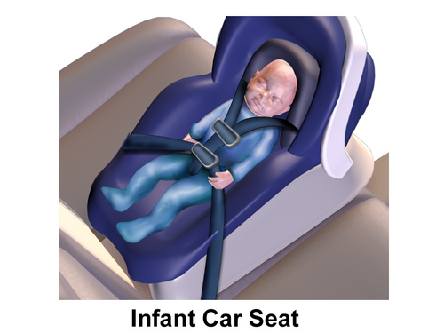

# SÍNDROME MORTE SÚBITA DO LACTENTE (SMSL)

Olá, futuro residente. Se você está aqui, é porque sabe que a Pediatria em provas de residência não perdoa quem negligencia a Puericultura e as Urgências. A Síndrome da Morte Súbita do Lactente (SMSL) é um daqueles temas que as bancas amam porque permite cobrar desde fisiopatologia básica até orientações práticas de consultório.

Muitos alunos erram questões de SMSL porque tentam usar o "bom senso" ou o que viram na casa de parentes. Esqueça o que a sua tia faz com o bebê dela. Aqui, o que vale é a diretriz da Sociedade Brasileira de Pediatria (SBP) e da Academia Americana de Pediatria (AAP). Vamos entender o porquê de cada recomendação para que você não precise decorar uma lista infinita, mas sim raciocinar como um pediatra.

*Figura 1 - A Síndrome da Morte Súbita do Lactente (SMSL) é definida como a morte inesperada de um lactente < 1 ano cuja causa permanece inexplicada após investigação completa (autópsia, revisão do cenário e história clínica). Pico de incidência: 2-4 meses. Fonte: Domínio Público | Wikimedia Commons*

## Definição e Critérios Diagnósticos

A primeira coisa que você precisa fixar é que a SMSL é um **diagnóstico de exclusão**. Não existe um exame de sangue ou uma imagem que diga "isso é SMSL".

Segundo a SBP, a SMSL é definida como a morte súbita de um lactente (criança com menos de 1 ano de idade) que permanece inexplicada após uma investigação minuciosa. E o que compõe essa investigação? Três pilares obrigatórios:

- Realização de uma autópsia completa.

- Exame da cena do óbito (onde o bebê estava, como era o berço).

- Revisão da história clínica (anamnese detalhada com os pais).

Se após esses três passos a causa continuar um mistério, aí sim carimbamos como SMSL. Se encontrarmos uma causa (como sufocação por um travesseiro ou uma pneumonia aspirativa), o diagnóstico muda para Morte Inesperada do Lactente por causa definida.

**Dica de Prova:** As bancas costumam usar o termo SIDS (*Sudden Infant Death Syndrome*), que é o termo em inglês. Saiba que são sinônimos. Outro termo importante é o SUID (*Sudden Unexpected Infant Death*), que é um "guarda-chuva" que inclui a SMSL, mortes por asfixia e causas indeterminadas.

## Epidemiologia: Quem é o Paciente de Risco?

A SMSL não acontece ao acaso em qualquer idade. Existe um "período crítico".

- **Idade:** O pico de incidência ocorre entre os **2 e 4 meses de vida**. É raro no primeiro mês e torna-se muito menos comum após os 6 meses. Cerca de 90% dos casos ocorrem antes do primeiro semestre de vida.

- **Sazonalidade:** Historicamente, observa-se um aumento de casos nos meses de inverno. Por quê? Não é o frio em si, mas o comportamento dos pais: agasalham demais o bebê (superaquecimento) e fecham todas as janelas (pior ventilação e maior exposição a vírus respiratórios).

- **Sexo:** Existe uma leve predominância no sexo masculino.

- **Brasil:** No nosso país, os dados são subnotificados. Muitas vezes o óbito é registrado como "causa mal definida". No entanto, a SBP alerta que a incidência provavelmente é maior do que em países desenvolvidos devido a fatores socioeconômicos e menor acesso a orientações de sono seguro.

## Fisiopatologia: O Modelo do Triplo Risco

Por que um bebê morre dormindo? Para explicar isso, usamos o **Modelo do Triplo Risco**. Imagine que para a SMSL ocorrer, três fatores precisam convergir no mesmo momento:

- **Lactente Vulnerável:** O bebê tem uma predisposição biológica, muitas vezes uma imaturidade nos núcleos do tronco cerebral que controlam a respiração e o despertar (arousal). Ele pode ter uma deficiência no sistema serotoninérgico, que é responsável por "acordar" o cérebro quando o CO2 sobe.

- **Período Crítico de Desenvolvimento:** É a janela entre 2 e 4 meses, onde o sistema de controle autonômico do bebê está passando por mudanças rápidas e instáveis.

- **Estressor Externo (Exógeno):** É aqui que nós, médicos, podemos intervir. O estressor é o ambiente: posição prona (barriga para baixo), tabagismo passivo, superaquecimento ou superfície macia.

**O "Porquê" Clínico:** Quando um bebê normal fica com o rosto coberto ou em uma posição que dificulta a respiração, o CO2 sobe. O tronco cerebral detecta isso e manda o bebê acordar, chorar ou virar a cabeça. No bebê vulnerável à SMSL, esse "alarme" falha. Ele continua dormindo em hipóxia até a parada cardiorrespiratória. Como dizemos no MedEvo, o problema não é o bebê parar de respirar, é ele **não acordar** quando a respiração fica difícil.

## Fatores de Risco: O que a Banca vai te perguntar

Aqui está o "filé mignon" das provas. Você precisa separar o que é fator de risco do que é fator protetor.

### Fatores Maternos e Gestacionais

- **Tabagismo Gestacional:** É um dos fatores de risco modificáveis mais potentes. A nicotina atravessa a placenta e altera o desenvolvimento do tronco cerebral do feto.

- **Idade Materna Jovem:** Mães com menos de 20 anos têm maior risco estatístico.

- **Baixo Nível Socioeconômico e Escolaridade:** Frequentemente associados a menor adesão às campanhas de prevenção.

- **Uso de Álcool e Drogas:** Especialmente se associado ao compartilhamento de cama (o sono profundo dos pais impede que percebam o bebê).

### Fatores do Lactente

- **Prematuridade e Baixo Peso:** Bebês que nasceram antes do tempo têm sistemas de controle respiratório ainda mais imaturos.

- **Intervalo Interpartal Curto:** Gestações muito próximas aumentam o risco.

### Fatores Ambientais (Os mais cobrados!)

- **Posição Prona (Barriga para baixo):** É o principal fator de risco modificável. Dormir de lado também é perigoso porque a posição é instável e o bebê acaba virando de barriga para baixo.

- **Superfície Macia:** Colchões de água, sofás, travesseiros e protetores de berço aumentam o risco de sufocação e reinalação de CO2.

- **Compartilhamento de Cama (Co-leito):** Altamente perigoso, especialmente se os pais fumam, usam álcool ou se o bebê tem menos de 4 meses.

- **Superaquecimento (Overheating):** O excesso de roupas ou temperatura elevada do quarto inibe o drive respiratório.

| Fator de Risco | Por que aumenta o risco? |
| --- | --- |
| Posição Prona | Obstrução de vias aéreas e reinalação de CO2. |
| Tabagismo Materno | Altera o desenvolvimento do centro respiratório fetal. |
| Co-leito | Risco de sobreposição (overlay) e asfixia. |
| Superfície Macia | Facilita a obstrução nasal e sufocamento. |
| Superaquecimento | Diminui o limiar de despertar (arousal). |

**Cuidado com a Pegadinha:** Leite artificial **NÃO** é fator de risco para SMSL. O que existe é que o Aleitamento Materno é um fator **PROTETOR**. Se o bebê toma fórmula, ele tem o risco "base", mas não um risco aumentado por causa do leite em si. Guarde isso, pois as bancas adoram colocar "uso de fórmula infantil" como fator de risco para te confundir.

*Figura 2 - A segurança do lactente envolve regras rígidas: dormir em decúbito dorsal (posição supina), superfície firme, sem objetos no berço, quarto dos pais (mas não na mesma cama), e aleitamento materno exclusivo como fator protetor. Fonte: BruceBlaus, CC BY-SA 4.0 | Wikimedia Commons*

## Prevenção: As Regras de Ouro do Sono Seguro

Se você for orientar uma mãe na puericultura (ou responder uma questão sobre prevenção), estas são as recomendações da SBP (2023/2024):

### 1. Posição Supina (Barriga para Cima)

Sempre, em todas as sonecas. "Ah, mas o bebê vai engasgar se golfar?". **Mito!** A anatomia das vias aéreas protege o bebê em decúbito dorsal. Quando ele está de barriga para cima, a traqueia fica acima do esôfago. Se ele regurgitar, a gravidade faz o líquido voltar para o esôfago. De barriga para baixo, o esôfago fica acima da traqueia, facilitando a aspiração.

### 2. Superfície Firme e Plana

O berço deve ter apenas um colchão firme coberto por um lençol com elástico. Nada de travesseiros, almofadas, bichos de pelúcia ou protetores de berço (aqueles acolchoados laterais). Os protetores de berço são perigosos porque o bebê pode encostar o nariz neles e sufocar, além de impedirem a circulação de ar.

### 3. Quarto Compartilhado, Cama Separada

O bebê deve dormir no quarto dos pais, mas em seu próprio berço ou moisés, pelo menos até os 6 meses (idealmente até 1 ano). Isso facilita a amamentação e a vigilância, mas evita o risco de esmagamento ou sufocação na cama dos adultos.

### 4. Evitar Exposição ao Tabaco

Ambiente livre de fumo é essencial. O risco não é só a mãe fumar na frente do bebê, mas as substâncias que ficam na roupa e na pele (terceira mão).

### 5. Aleitamento Materno

O aleitamento materno exclusivo reduz o risco de SMSL em cerca de 50%. O porquê exato não é totalmente conhecido, mas acredita-se que bebês amamentados acordam mais facilmente e recebem anticorpos que protegem contra infecções respiratórias que poderiam ser estressores.

### 6. Uso de Chupeta

Aqui muitos alunos travam. "Mas Dr. Will, a chupeta não atrapalha a amamentação?". A recomendação é: **ofereça a chupeta na hora de dormir**. Estudos mostram que o uso da chupeta é um fator protetor robusto contra a SMSL. Ela mantém a via aérea mais aberta e aumenta o limiar de despertar.

- **Regra de ouro:** Se o bebê estiver em aleitamento materno, espere a amamentação estar bem estabelecida (geralmente após 3-4 semanas) para introduzir a chupeta. Se a chupeta cair durante o sono, não precisa colocar de volta.

### 7. Evitar Superaquecimento

O bebê deve ser vestido com apenas uma camada a mais do que o adulto. Se você está de camiseta, ele fica bem de body e um macacão fino. Não use toucas para dormir (a cabeça é a principal área de troca térmica do bebê).

## Diagnóstico Diferencial: Não confunda SMSL com...

Na prova, o examinador vai colocar um cenário de um bebê que "quase morreu" ou que teve um evento estranho. Você precisa saber diferenciar.

### BRUE (Brief Resolved Unexplained Event)

Antigamente chamado de ALTE (*Apparent Life-Threatening Event*). O termo mudou em 2016.
**Definição:** Um evento súbito, breve (menos de 1 minuto, geralmente < 30 segundos) e que já se resolveu completamente quando o médico examina.
Para ser BRUE, o lactente deve ter < 1 ano e apresentar pelo menos um dos seguintes:

- Cianose ou palidez.

- Alteração na respiração (apneia, respiração irregular).

- Alteração marcada no tônus (hiper ou hipotonia).

- Alteração no nível de consciência.

**O pulo do gato:** O diagnóstico de BRUE só é feito se o médico **não encontrar uma causa** após anamnese e exame físico. Se o bebê teve cianose porque engasgou com leite, o diagnóstico é "Engasgo/Refluxo", não é BRUE.

### Crise de Perda de Fôlego

Muito comum em lactentes maiores e pré-escolares.

- **Cenário típico:** A criança leva um susto, sente dor ou fica brava. Ela começa a chorar, "tranca" a respiração em expiração, fica cianótica (ou pálida) e pode até perder a consciência por alguns segundos.

- **Diferencial:** É precedida por um fator emocional/gatilho. A SMSL ocorre durante o sono.

- **Conduta:** Orientar os pais sobre a benignidade. **Atenção:** Se a crise ocorrer durante atividade física, peça um ECG para excluir Síndrome do QT Longo.

### Maus-tratos (Síndrome do Bebê Sacudido)

Sempre que houver uma morte súbita ou evento inexplicado, o médico deve estar atento a sinais de maus-tratos. Hemorragia retiniana e fraturas em diferentes estágios de consolidação são sinais de alerta.

## Tabela Comparativa: SMSL vs. BRUE vs. Crise de Perda de Fôlego

| Característica | SMSL | BRUE | Crise de Perda de Fôlego |
| --- | --- | --- | --- |
| **Estado Final** | Óbito | Resolvido (Bebê bem) | Resolvido (Bebê bem) |
| **Momento** | Durante o sono | Acordado ou dormindo | Acordado (pós-gatilho) |
| **Idade Pico** | 2-4 meses | < 1 ano | 6 meses a 6 anos |
| **Gatilho** | Ambiente de sono inseguro | Nenhum identificado | Choro, dor, frustração |
| **Conduta** | Investigação póstuma | Estratificar risco | Orientação e suporte |

## Estratificação de Risco no BRUE

Se você atende um bebê que teve um BRUE, sua missão é decidir se ele é de **Baixo Risco** ou **Alto Risco**. Isso define se ele vai para casa ou fica internado.

**Critérios para Baixo Risco (Todos devem estar presentes):**

- Idade > 60 dias.

- Idade gestacional ≥ 32 semanas e idade corrigida ≥ 45 semanas.

- Foi o primeiro e único evento (não recorrente).

- Duração < 1 minuto.

- Não precisou de RCP por profissional de saúde.

- Sem achados preocupantes na história ou exame físico.

Se for baixo risco, você orienta, pode fazer um ECG (opcional mas recomendado) e libera. Se tiver qualquer critério de exclusão, é alto risco e precisa de internação para investigação (monitorização, exames laboratoriais, etc.).

## Investigação da Cena e Autópsia

Imagine que você é o médico plantonista e recebe um bebê em parada cardiorrespiratória trazido pelos pais. Você tenta a reanimação, mas sem sucesso. O que fazer agora?

- **Acolhimento:** Este é um dos momentos mais difíceis da medicina. O acolhimento à família deve ser imediato e sem julgamentos.

- **Anamnese:** Pergunte sobre a posição em que o bebê foi encontrado, quem o viu por último, se havia objetos no berço, se houve febre ou sintomas recentes.

- **Encaminhamento:** No Brasil, mortes súbitas e sem assistência médica devem ser encaminhadas ao Serviço de Verificação de Óbitos (SVO) ou Instituto Médico Legal (IML) para autópsia.

- **Cena do Óbito:** Idealmente, a polícia ou equipe técnica deve analisar o local. Cobertores soltos, fendas entre o colchão e a grade, ou presença de fumaça de cigarro são dados cruciais.

## Situações Especiais e Pegadinhas

- **Refluxo Gastroesofágico (RGE):** O RGE fisiológico é comum. Ele **não** é causa de SMSL. No entanto, um evento de engasgo grave pode ser confundido com BRUE. Lembre-se: se o bebê dorme de barriga para cima, o risco de aspiração por refluxo é menor.

- **Vacinação:** Existe um mito de que vacinas causam morte súbita. **Mentira!** A vacinação em dia é um fator **PROTETOR** contra a SMSL.

- **Dispositivos de Monitorização:** Aqueles monitores de respiração que vendem em lojas de bebê (meias que medem saturação, tapetes de pressão) **não** reduzem o risco de SMSL e não são recomendados pela SBP para prevenção em bebês saudáveis. Eles trazem uma falsa sensação de segurança.

- **Swaddling (Enrolar o bebê):** Aquela técnica de fazer um "charutinho". Pode ser usada para acalmar, mas **assim que o bebê der sinais de que consegue virar sozinho (geralmente aos 2-3 meses), deve ser interrompida**. Se o bebê estiver enrolado e virar de bruços, ele não terá os braços livres para se empurrar e o risco de morte é altíssimo.

## Pontos-Chave para Prova

- **Definição:** Diagnóstico de exclusão após autópsia, exame da cena e história clínica.

- **Pico de Incidência:** 2 a 4 meses de vida.

- **Principal Fator Modificável:** Posição de dormir. O decúbito dorsal (barriga para cima) é o único seguro.

- **Posição Lateral:** É insegura! O bebê pode rolar para a posição prona.

- **Tabagismo:** Materno (na gestação) e passivo são fatores de risco críticos.

- **Fatores Protetores:** Aleitamento materno, vacinação em dia e uso de chupeta ao dormir.

- **Chupeta:** Deve ser oferecida ao deitar; se cair, não precisa repor. Em amamentados, esperar 3-4 semanas para introduzir.

- **Ambiente de Sono:** Colchão firme, sem travesseiros, sem protetores de berço, sem bichos de pelúcia.

- **Co-leito:** Contraindicado pela SBP, especialmente se houver tabagismo, uso de álcool ou prematuridade.

- **Superaquecimento:** Evite excesso de roupas e não cubra a cabeça do bebê.

- **BRUE:** Evento breve (< 1 min) resolvido. Baixo risco se > 60 dias, sem RCP e primeiro evento.

- **Crise de Perda de Fôlego:** Benigna, pós-choro/susto. Se associada a exercício, investigar QT longo com ECG.

- **Leite Artificial:** Não é fator de risco (o aleitamento que é protetor).

- **Gêmeos e Prematuros:** Têm risco aumentado devido à vulnerabilidade biológica.

- **Investigação:** A autópsia é obrigatória para o diagnóstico definitivo de SMSL.

Como sempre reforçamos no MedEvo, o segredo aqui é entender que a SMSL é uma falha no mecanismo de despertar diante de um estressor ambiental. Se você protege o ambiente, você protege o bebê. Boa sorte nos estudos e lembre-se: barriga para cima, sempre!

 Cópia offline para consulta pessoal.
 Fonte original:
 [https://www.medevo.com.br/material-apoio/ler/454b158d-2b1f-4a83-9f8c-4746d5ee7366](https://www.medevo.com.br/material-apoio/ler/454b158d-2b1f-4a83-9f8c-4746d5ee7366)
