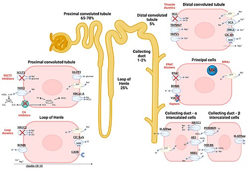

# SÍNDROME NEFRÓTICA NA INFÂNCIA: CORTICOSSENSÍVEL E RECAÍDAS

Para entender a Síndrome Nefrótica (SN), você precisa visualizar o glomérulo não apenas como um filtro mecânico, mas como uma barreira eletroquímica sofisticada. Na pediatria, quando falamos de SN, quase sempre estamos falando da Lesão Glomerular Mínima (LGM). O nome já diz muito: na microscopia óptica, o rim parece normal. O problema é molecular.

*Figura 1 - Edema facial (periorbitário) característico da Síndrome Nefrótica. A tétrade clássica inclui: proteinúria maciça (≥50 mg/kg/dia), hipoalbuminemia (<2,5 g/dL), edema e hiperlipidemia. Na infância, a Lesão Mínima é a causa mais frequente (~85%). Fonte: CharlesPicavet, Domínio Público | Wikimedia Commons*

## O Conceito e a Tétrade Diagnóstica

A Síndrome Nefrótica não é uma doença única, mas um conjunto de sinais e sintomas decorrentes de uma proteinúria maciça. Para a prova de residência e para a sua vida no estágio de pediatria, você deve memorizar a tétrade clássica:

- Proteinúria maciça.

- Hipoalbuminemia.

- Edema generalizado.

- Hiperlipidemia.

Mas cuidado: o que define a síndrome é a proteinúria. Os outros componentes são consequências dela. Se a barreira de filtração falha e o paciente perde proteína em níveis "nefróticos", o restante da cascata é inevitável.

### Critérios Laboratoriais Precisos

As bancas adoram números, e aqui não há margem para erro. Segundo a Sociedade Brasileira de Pediatria (SBP), os critérios são:

- **Proteinúria de 24 horas:** > 50 mg/kg/dia ou > 40 mg/m²/hora.

- **Relação Proteína/Creatinina urinária (amostra isolada):** > 2,0 mg/mg.

- **Hipoalbuminemia:** Albumina plasmática < 2,5 g/dL.

- **Proteinúria qualitativa:** Fita reagente com 3+ ou 4+.

Muitos alunos erram ao confundir os valores da pediatria com os do adulto (onde usamos > 3,5 g/dia). Na criança, o cálculo é sempre baseado no peso ou na superfície corporal. Se a questão trouxer um lactente com edema e proteinúria de 3,5 g/dia, ele preenche critério nefrótico com folga, mas lembre-se de sempre checar a unidade pedida.

## Fisiopatologia: O Porquê de Cada Achado

Por que o paciente incha? Por que o colesterol sobe? Entender isso evita que você decore e permite que você deduza a resposta na hora da prova.

### A Barreira de Filtração e a Carga Elétrica

O glomérulo possui uma barreira composta pelo endotélio, membrana basal e os podócitos. Normalmente, essa barreira é carregada negativamente (glicosaminoglicanos). Como a albumina também é negativa, ocorre uma repulsão eletrostática. Na Lesão Glomerular Mínima, ocorre uma disfunção de células T que libera fatores de permeabilidade. Esses fatores "neutralizam" a carga negativa da barreira. Resultado: a albumina, que antes era repelida, agora passa livremente para a urina.

### O Edema: Teoria do Underfill vs. Overfill

A explicação clássica (Underfill) é a que mais cai:

- Perda de albumina na urina → Queda da albumina sérica.

- Redução da pressão oncótica plasmática.

- O líquido sai do vaso para o interstício (edema).

- Redução do volume intravascular efetivo.

- Ativação do Sistema Renina-Angiotensina-Aldosterona (SRAA) e liberação de ADH.

- Retenção de sódio e água, que continua indo para o interstício, perpetuando o edema.

Isso explica por que o edema nefrótico é mole, frio, depressível (sinal do cacifo) e muitas vezes começa na região periorbitária pela manhã, progredindo para anasarca e ascite ao longo do dia.

### Hiperlipidemia: A Fábrica em Sobrecarga

Por que o colesterol sobe? Com a queda da pressão oncótica, o fígado entra em "frenesi" metabólico para tentar compensar a perda de proteínas. Ele aumenta a síntese de lipoproteínas (VLDL, LDL) e de colesterol. Além disso, há uma redução do catabolismo lipídico pela perda urinária de cofatores como a lipoproteína lipase. O resultado é um perfil lipídico alterado: aumento de colesterol total, triglicerídeos e LDL, com redução frequente do HDL.

## Epidemiologia e a Primazia da Lesão Mínima

A Síndrome Nefrótica Idiopática da Infância é a forma mais comum, e dentro dela, a Lesão Glomerular Mínima (LGM) reina absoluta, sendo responsável por cerca de 90% dos casos em crianças entre 1 e 7 anos.

Essa estatística é fundamental para a conduta clínica. Se 90% das crianças nessa faixa etária têm LGM e a LGM responde maravilhosamente bem ao corticoide, faz sentido biopsiar todo mundo? Não. É por isso que, na pediatria, o diagnóstico inicial da SN pura é clínico-laboratorial e o tratamento é empírico.

### Tabela 1: Perfil Epidemiológico da SN Idiopática

| Característica | Padrão Típico (Sugere LGM) |
| --- | --- |
| Idade | 1 a 10 anos (pico 2-6 anos) |
| Sexo | Predomínio masculino (2:1) |
| Complemento (C3 e C4) | Normal |
| Função Renal | Geralmente normal (exceto se hipovolemia grave) |
| Sedimento Urinário | Inócuo (pode ter hematúria microscópica em 20%) |
| Pressão Arterial | Normal na maioria dos casos |

## Quadro Clínico e Exame Físico

O paciente clássico é o pré-escolar que chega com "olhos inchados". Muitas vezes a família acha que é alergia e o trata com anti-histamínicos por dias até perceber que o edema progrediu para as pernas e abdome.

No exame físico, você deve procurar:

- **Edema:** Periorbitário, de membros inferiores, escrotal/labial.

- **Ascite:** Verifique o sinal do piparote ou macicez móvel. A ascite pode causar dor abdominal por distensão.

- **Sinais de Hipovolemia:** Apesar do edema (excesso de água total), o volume dentro do vaso pode estar baixo. Cheque o tempo de enchimento capilar, pulsos e pressão arterial.

- **Urina Espumosa:** Relato clássico devido à alta concentração de proteínas.

Cuidado com a pegadinha: se a criança apresentar edema, mas também tiver hipertensão importante, hematúria macroscópica e história de piodermite ou faringite recente, pense em Síndrome Nefrítica (GNDA), não Nefrótica. Na MedEvo, sempre reforçamos que a "pureza" da síndrome nefrótica (sem hematúria macro, sem hipertensão, sem queda de complemento) é o que nos dá segurança para não biopsiar de imediato.

## Diagnóstico Diferencial: Nefrótica vs. Nefrítica

Este é o ponto onde muitos alunos perdem questões por pressa. A diferenciação é clínica e laboratorial.

### Tabela 2: Diagnóstico Diferencial das Síndromes Glomerulares

| Achado | Síndrome Nefrótica (LGM) | Síndrome Nefrítica (GNDA) |
| --- | --- | --- |
| Início | Insidioso | Abrupto |
| Edema | Muito intenso (Anasarca) | Moderado (Facial/Membros) |
| Pressão Arterial | Normal | Hipertensão frequente |
| Hematúria | Ausente ou Micro | Macroscópica (cor de chá/cola) |
| Proteinúria | Maciça (> 50 mg/kg/dia) | Variável (geralmente não nefrótica) |
| Complemento C3 | Normal | Reduzido (na GNPE) |

Se a questão descreve uma criança com edema, oligúria e urina escura após uma infecção de vias aéreas superiores, o diagnóstico é GNDA. Se o foco for edema generalizado, diurese espumosa e colesterol alto, é Síndrome Nefrótica.

## Quando a Biópsia é Obrigatória?

Como professor, eu digo: decore as indicações de biópsia. Elas caem em 80% das provas sobre o tema. Se o paciente foge do padrão "Lesão Mínima", precisamos do histopatológico para descartar outras patologias como a Glomeruloesclerose Segmentar e Focal (GESF) ou a Glomerulonefrite Membranoproliferativa.

**Indicações de Biópsia Renal Pré-tratamento:**

- Idade atípica: < 1 ano (suspeita de SN congênita) ou > 10 anos.

- Hipocomplementenemia (C3 ou C4 baixos).

- Hematúria macroscópica persistente.

- Hipertensão arterial persistente.

- Insuficiência renal não explicada por hipovolemia.

- Sinais de doença sistêmica (ex: Lúpus).

**Indicação de Biópsia Pós-tratamento:**

- Corticorresistência (não remite após 4 a 8 semanas de corticoide).

*Figura 2 - O tratamento da SN idiopática na infância baseia-se na prednisona: fase de indução (60 mg/m²/dia por 4-6 semanas) seguida de desmame. A resposta ao corticoide (corticossensível vs. corticorresistente) define prognóstico e manejo. Fonte: CC BY 4.0, Wikimedia Commons*

## Tratamento Farmacológico: O Império da Prednisona

O tratamento da Síndrome Nefrótica corticossensível é padronizado. O objetivo é induzir a remissão da proteinúria.

### 1. Fase de Indução (Remissão)

- **Droga:** Prednisona ou Prednisolona.

- **Dose:** 60 mg/m²/dia ou 2 mg/kg/dia (o que for menor).

- **Dose Máxima:** 60 mg/dia.

- **Duração:** Diariamente por 4 a 6 semanas.

### 2. Fase de Manutenção (Desmame)

Após as 4-6 semanas iniciais (ou após a urina ficar negativa para proteína), passamos para o esquema alternado:

- **Dose:** 40 mg/m² ou 1,5 mg/kg em dias alternados.

- **Duração:** Mais 4 a 6 semanas, com redução gradual subsequente conforme o protocolo do serviço.

**O que é Remissão?**
Consideramos que o paciente remitiu quando a proteinúria desaparece (fita negativa ou traços) por 3 dias consecutivos.

### Manejo do Edema e Medidas Gerais

Não saia dando diurético para toda criança com SN. Lembre-se da fisiopatologia: o volume intravascular pode estar baixo. Se você der furosemida para uma criança hipovolêmica, pode causar uma Injúria Renal Aguda (IRA) pré-renal ou até um choque.

- **Dieta:** Hipossódica (máximo 2g de sódio/dia). Não há necessidade de restrição proteica (a criança precisa de proteína para crescer), mas também não se faz dieta hiperproteica (isso aumenta a carga de filtração glomerular e a proteinúria).

- **Diuréticos:** Usar apenas se o edema for limitante (dificuldade respiratória por ascite, edema escrotal grave) e após garantir que o paciente não está hipovolêmico.

- **Albumina:** Reservada para casos de anasarca refratária, edema pulmonar ou sinais de choque hipovolêmico. Deve ser administrada junto com furosemida para evitar que o líquido "puxe" mais água para o interstício sem ser excretado.

## Definições de Resposta ao Tratamento

As bancas amam classificar o paciente conforme a resposta ao corticoide. Isso define o prognóstico.

- **Corticossensível:** Remissão completa com o uso de corticoide.

- **Corticorresistente:** Ausência de remissão após 4-8 semanas de tratamento diário. Aqui a biópsia é mandatória.

- **Recaída:** Proteinúria ≥ 2+ por 3 dias consecutivos após ter atingido a remissão.

- **Recaídas Frequentes:** 2 ou mais recaídas em 6 meses, ou 4 ou mais em um ano.

- **Corticodependente:** Duas recaídas consecutivas durante a fase de desmame ou em até 14 dias após a suspensão do corticoide.

Para os pacientes com recaídas frequentes ou corticodependência, o Dr. Will lembra que precisamos de drogas poupadoras de corticoide (como Ciclofosfamina, Ciclosporina ou Rituximabe) para evitar os efeitos colaterais da corticoterapia crônica (Cushing, catarata, atraso de crescimento, osteoporose).

## Complicações: Onde Mora o Perigo

A Síndrome Nefrótica é um estado de imunossupressão e hipercoagulabilidade.

### 1. Infecções (A principal causa de óbito)

O paciente nefrótico perde imunoglobulinas (IgG) e fatores do sistema complemento (fator B) na urina. Além disso, o edema e o uso de corticoide facilitam infecções.

- **Peritonite Bacteriana Espontânea (PBE):** É a complicação infecciosa clássica. O agente principal é o **Streptococcus pneumoniae** (Pneumococo), seguido por Gram-negativos como a *E. coli*.

- **Quadro Clínico:** Dor abdominal, febre e defesa abdominal em uma criança com ascite nefrótica.

- **Conduta:** Paracentese diagnóstica e antibioticoterapia (Ceftriaxona é uma escolha comum).

### 2. Fenômenos Tromboembólicos

A perda de antitrombina III na urina, o aumento da síntese hepática de fatores pró-coagulantes e a hemoconcentração tornam o paciente um "alvo" para tromboses.

- **Locais comuns:** Veia renal (suspeitar se hematúria súbita e dor lombar), seios venosos cerebrais e veias profundas de membros inferiores.

### 3. Crise Nefrótica (Choque Hipovolêmico)

Ocorre quando o "Underfill" é tão grave que o paciente não consegue manter o débito cardíaco. A criança apresenta dor abdominal intensa, extremidades frias e hipotensão. O tratamento é a expansão volêmica cautelosa e, por vezes, infusão de albumina.

## Vacinação no Paciente Nefrótico

Este é um tema quente. O uso de prednisona em dose imunossupressora (≥ 2 mg/kg/dia ou 20 mg/dia para crianças > 10kg) **contraindica vacinas de vírus vivos atenuados** (ex: SCR, Varicela, Sabin, Febre Amarela).

- **O que fazer?** Vacinas de vírus vivos devem ser adiadas até que a dose de corticoide seja reduzida para níveis baixos (< 2 mg/kg/dia em dias alternados) ou suspensa por pelo menos 4 semanas.

- **Vacinação Recomendada:** O paciente nefrótico deve receber a vacina antipneumocócica (VPC13 e VPP23) e a vacina contra Influenza, pois o Pneumococo e o vírus da gripe são grandes gatilhos para recaídas e complicações graves.

## Situações Especiais: SN Congênita e Idade Atípica

Se você encontrar um lactente com edema e proteinúria nos primeiros 3 meses de vida, esqueça a Lesão Mínima. Trata-se de **Síndrome Nefrótica Congênita** (tipo Finlandês é a mais famosa).

- **Etiologia:** Genética (mutação na nefrina ou podocina).

- **Características:** Placenta grande, prematuridade, proteinúria intrauterina (alfa-fetoproteína elevada no líquido amniótico).

- **Prognóstico:** Muito ruim. Não responde a corticoide. O tratamento envolve suporte nutricional, nefrectomia bilateral e transplante renal.

## Tabela 3: Indicações de Biópsia Renal na Síndrome Nefrótica Pediátrica

| Momento | Critério | Justificativa |
| --- | --- | --- |
| **Ao Diagnóstico** | Idade < 1 ano ou > 10 anos | Alta chance de não ser Lesão Mínima |
| **Ao Diagnóstico** | Hipocomplementenemia (C3 baixo) | Sugere GN Membranoproliferativa ou Lúpus |
| **Ao Diagnóstico** | Hipertensão ou Hematúria Macro | Sugere outras glomerulopatias (GESF, GNDA) |
| **Após Início** | Corticorresistência (4-8 semanas) | Identificar o padrão histológico para mudar terapia |

## Manejo das Recaídas

A maioria das crianças com LGM terá pelo menos uma recaída, geralmente desencadeada por infecções virais simples.

- **Diagnóstico de Recaída:** Proteinúria (fita) ≥ 2+ por 3 dias.

- **Tratamento:** Reiniciar Prednisona 60 mg/m²/dia até a urina ficar negativa (remissão).

- **Após Remissão:** Passar para o esquema alternado (40 mg/m²) por 4 semanas e depois retirar gradualmente.

Se o paciente começa a recair muito (Recaídas Frequentes ou Corticodependente), o risco de toxicidade pelo corticoide (estrias, obesidade, baixa estatura, catarata) supera os benefícios. Nesses casos, indicamos imunossupressores de segunda linha.

## Tabela 4: Metas e Valores de Referência para Memorizar

| Parâmetro | Valor de Referência / Meta |
| --- | --- |
| Proteinúria Nefrótica (24h) | > 50 mg/kg/dia |
| Proteinúria Nefrótica (m²) | > 40 mg/m²/hora |
| Relação Proteína/Creatinina | > 2,0 |
| Albumina Sérica | < 2,5 g/dL |
| Dose Inicial Prednisona | 2 mg/kg/dia (máx 60 mg) |
| Tempo para definir Resistência | 4 a 8 semanas de corticoide diário |

## Pontos-Chave para Prova

- **Definição:** Proteinúria maciça (> 50 mg/kg/dia), hipoalbuminemia (< 2,5 g/dL), edema e hiperlipidemia.

- **Causa mais comum:** Lesão Glomerular Mínima (LGM) - 90% dos casos entre 1-7 anos.

- **Tratamento Inicial:** Prednisona 2 mg/kg/dia (ou 60 mg/m²/dia) por 4-6 semanas. Não se faz biópsia antes de testar o corticoide no paciente típico.

- **Biópsia Pré-tratamento:** Apenas se idade < 1 ou > 10 anos, hematúria macro, hipertensão, C3 baixo ou doença sistêmica.

- **Biópsia Pós-tratamento:** Indicada na corticorresistência (após 4-8 semanas de tratamento sem resposta).

- **Principal complicação infecciosa:** Peritonite Bacteriana Espontânea (PBE) por Pneumococo.

- **Vacinação:** Contraindicadas vacinas de vírus vivos durante a fase de corticoide em dose alta. Vacina de Pneumococo e Influenza são essenciais.

- **Fisiopatologia do Edema:** Queda da pressão oncótica (Underfill) levando à retenção secundária de sódio pelo SRAA.

- **Hiperlipidemia:** Ocorre por aumento da síntese hepática de lipoproteínas em resposta à baixa pressão oncótica.

- **Trombose:** Estado de hipercoagulabilidade por perda de antitrombina III e aumento de fatores pró-coagulantes.

- **Corticodependência:** Recaída que ocorre durante o desmame ou até 14 dias após a suspensão do corticoide.

- **Diagnóstico Diferencial:** Na GNDA (nefrítica), o complemento C3 está baixo, há hematúria macroscópica e hipertensão importante. Na SN (nefrótica pura), o C3 é normal.

- **Urolitíase:** Pode ocorrer em crianças em uso crônico de corticoide ou por alterações metabólicas da própria síndrome.

- **SN Congênita:** Ocorre nos primeiros 3 meses de vida, causa genética, placenta grande, prognóstico reservado.

- **Erro Comum:** Iniciar diurético de alça (furosemida) sem avaliar o estado volêmico. Se houver sinais de hipovolemia (enchimento capilar lento), o diurético pode precipitar insuficiência renal aguda. 🩺

Lembre-se: a Síndrome Nefrótica na infância é, em sua essência, uma doença do podócito e da carga elétrica da barreira de filtração. O sucesso no tratamento e nas provas depende de reconhecer o padrão da Lesão Mínima e saber exatamente quando o paciente foge desse padrão, exigindo biópsia e tratamentos alternativos.

 Cópia offline para consulta pessoal.
 Fonte original:
 [https://www.medevo.com.br/material-apoio/ler/b5a3915e-9ee4-44cd-98e1-1ffa9ad5b549](https://www.medevo.com.br/material-apoio/ler/b5a3915e-9ee4-44cd-98e1-1ffa9ad5b549)
