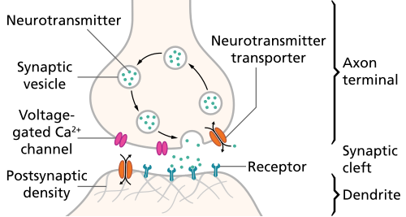

# SÍNDROME PRÉ-MENSTRUAL: DIAGNÓSTICO E TRATAMENTO

Para entender a Síndrome Pré-Menstrual (SPM) e sua forma grave, o Transtorno Disfórico Pré-Menstrual (TDPM), você precisa primeiro esquecer a ideia de que se trata apenas de uma "oscilação de humor". Na prova de residência e na vida prática, encaramos essas condições como um distúrbio neuroendócrino.

O ponto central que as bancas amam cobrar é a ciclicidade. Se os sintomas não desaparecem após a menstruação, não é SPM. Guarde isso: a marca registrada é o intervalo livre de sintomas na fase folicular.

*Figura 1 - A Síndrome Pré-Menstrual (SPM) e o Transtorno Disfórico Pré-Menstrual (TDPM) ocorrem exclusivamente em ciclos ovulatórios, na fase lútea. O diagnóstico é clínico, baseado no diário prospectivo de sintomas por 2 ciclos consecutivos. Fonte: National Cancer Institute, Domínio Público | Wikimedia Commons*

## Fisiopatologia: O Porquê dos Sintomas

Muitos alunos erram ao achar que a paciente com SPM tem "hormônios a mais" ou "hormônios a menos". Isso é um mito. Se você dosar o estradiol e a progesterona de uma paciente com sintomas graves, os níveis estarão normais para a fase do ciclo.

O problema não é a quantidade de hormônio, mas a sensibilidade do Sistema Nervoso Central (SNC) às flutuações desses esteroides. Segundo a FEBRASGO, a teoria mais aceita envolve a interação entre os esteroides sexuais e neurotransmissores, especialmente a serotonina e o GABA.

### O Papel da Serotonina

A queda dos níveis de estrogênio na fase lútea tardia reduz a disponibilidade de serotonina. Como a serotonina regula o humor, o sono e o apetite, sua queda explica a irritabilidade, a insônia e a compulsão por carboidratos. É por isso que os Inibidores Seletivos da Recaptação de Serotonina (ISRS) são a primeira linha de tratamento: eles corrigem essa falha de comunicação química.

### O Papel da Progesterona e do GABA

A progesterona é metabolizada em alopregnanolona, um metabólito que interage com os receptores GABA-A no cérebro. Em mulheres sem SPM, a alopregnanolona tem um efeito calmante (semelhante aos benzodiazepínicos). No entanto, em mulheres com TDPM, ocorre uma resposta paradoxal ou uma falha na regulação desses receptores, gerando ansiedade e agitação em vez de calma.

Além disso, a progesterona estimula a Monoaminoxidase (MAO), enzima que degrada a serotonina, agravando o quadro depressivo. Já o estrogênio, em excesso relativo, favorece a retenção de sódio e água (via sistema renina-angiotensina-aldosterona) e aumenta as catecolaminas, explicando o edema e a tensão.

### Ciclos Ovulatórios: A Condição Necessária

Aqui está uma pérola clínica: a SPM só ocorre em ciclos ovulatórios. Se não há ovulação, não há formação de corpo lúteo, não há produção de progesterona e, consequentemente, não há a queda hormonal brusca que gatilha os sintomas. Por isso, uma das estratégias de tratamento é justamente a anovulação.

## Quadro Clínico e Classificação

A apresentação clínica é um espectro. Podemos dividir as pacientes em três grandes grupos, e saber diferenciá-los é fundamental para escolher a conduta correta.

### 1. Sintomas Pré-Menstruais Leves

Cerca de 70 a 80% das mulheres apresentam algum sintoma antes de menstruar (mastalgia leve, distensão abdominal). Se isso não gera prejuízo social ou funcional, não é considerado síndrome, mas sim uma manifestação fisiológica do ciclo.

### 2. Síndrome Pré-Menstrual (SPM)

Aqui, os sintomas físicos e emocionais são recorrentes e causam algum grau de sofrimento ou interferência na vida da paciente. Os sintomas surgem na fase lútea (após a ovulação) e desaparecem nos primeiros dias do fluxo menstrual.

### 3. Transtorno Disfórico Pré-Menstrual (TDPM)

Esta é a forma grave, presente em 3 a 8% das mulheres. O impacto funcional é severo: a paciente falta ao trabalho, briga com o parceiro, evita compromissos sociais e pode ter ideação suicida. O TDPM é reconhecido como uma entidade diagnóstica no DSM-5.

| Característica | Síndrome Pré-Menstrual (SPM) | Transtorno Disfórico Pré-Menstrual (TDPM) |
| --- | --- | --- |
| **Intensidade** | Leve a moderada | Grave / Incapacitante |
| **Sintoma Predominante** | Físico ou emocional | Emocional (Disforia, irritabilidade) |
| **Impacto Funcional** | Mínimo a moderado | Significativo (trabalho/escola/social) |
| **Critério Diagnóstico** | Clínico (ACOG) | DSM-5 (≥ 5 sintomas) |

## Diagnóstico: A Armadilha do Exame Laboratorial

Cuidado: as bancas adoram colocar alternativas sugerindo a dosagem de progesterona, estradiol ou hormônios tireoidianos para diagnosticar a SPM. Isso está errado. O diagnóstico é estritamente clínico e prospectivo.

### Critérios Diagnósticos (ACOG)

Para o diagnóstico de SPM, a paciente deve apresentar pelo menos um sintoma afetivo e um sintoma físico nos 5 dias que antecedem a menstruação, em pelo menos três ciclos consecutivos. Esses sintomas devem ser aliviados em até 4 dias após o início do fluxo e não devem retornar até pelo menos o 13º dia do ciclo.

Sintomas Afetivos:

- Depressão, crises de choro.

- Irritabilidade, raiva.

- Ansiedade, confusão mental.

- Retraimento social.

Sintomas Físicos:

- Mastalgia (dor nas mamas).

- Distensão abdominal.

- Cefaleia.

- Edema de extremidades.

### Critérios do DSM-5 para TDPM

Para fechar o diagnóstico de TDPM, a exigência é maior. São necessários pelo menos 5 sintomas presentes na última semana antes da menstruação, que melhoram após o início do fluxo.

Desses 5 sintomas, pelo menos UM deve ser:

- Labilidade afetiva acentuada (mudanças bruscas de humor).

- Irritabilidade acentuada ou raiva.

- Humor deprimido acentuado, sentimentos de desesperança.

- Ansiedade acentuada, tensão ou nervosismo.

Os outros sintomas podem incluir: diminuição do interesse em atividades, dificuldade de concentração, letargia, alteração do apetite (compulsão), alterações do sono, sensação de estar "fora de controle" e sintomas físicos (mastalgia, inchaço).

### O Diário de Sintomas (DRSP)

Como o diagnóstico depende da ciclicidade, o padrão-ouro é o registro prospectivo por pelo menos dois ciclos. O instrumento mais utilizado é o *Daily Record of Severity of Problems* (DRSP). Pedir para a paciente anotar os sintomas diariamente ajuda a diferenciar a SPM de uma exacerbação pré-menstrual de outros transtornos (como depressão maior ou transtorno de ansiedade generalizada), que não apresentam o intervalo livre de sintomas na fase folicular.

## Diagnóstico Diferencial: Não Confunda!

Este é um ponto onde o Dr. Will sempre insiste: nem tudo que piora antes de menstruar é TPM.

- **Exacerbação Pré-Menstrual:** Pacientes com depressão, ansiedade ou enxaqueca podem sentir uma piora dos sintomas no período pré-menstrual. A diferença é que, nessas doenças, os sintomas persistem (embora mais leves) durante o resto do mês.

- **Perimenopausa:** Mulheres por volta dos 45 anos podem ter irregularidade menstrual e sintomas de humor. A dosagem de FSH pode ajudar aqui, mas lembre-se que na SPM clássica os hormônios são normais.

- **Hipotireoidismo:** Pode causar fadiga e alteração de humor. Embora a diretriz diga que o diagnóstico de SPM é clínico, em casos de fadiga extrema, excluir doenças tireoidianas é prudente na prática, mas para a prova, hormônios tireoidianos NÃO tratam SPM.

- **Dismenorreia Primária:** A dor pélvica ocorre *durante* a menstruação. Na SPM, os sintomas são *antes*. Se a paciente tem os dois, tratamos as duas condições.

## Tratamento Não Farmacológico (MEV)

Para casos leves, a Mudança de Estilo de Vida (MEV) é a primeira escolha. Mesmo em casos graves, ela potencializa os medicamentos.

- **Atividade Física:** Exercícios aeróbicos (pelo menos 30 minutos, 3 a 5 vezes por semana) aumentam a liberação de endorfinas e melhoram a circulação, reduzindo o edema e a dor.

- **Dieta:**

- Redução de sal (para diminuir o inchaço e a mastalgia).

- Redução de cafeína (para diminuir a irritabilidade e a sensibilidade mamária).

- Aumento de carboidratos complexos (ajuda na estabilidade da serotonina).

- **Suplementação:**

- **Cálcio (1.200 mg/dia):** É o suplemento com maior evidência científica para redução de sintomas físicos e emocionais.

- **Magnésio (200-400 mg/dia):** Pode ajudar na retenção hídrica e cólicas.

- **Vitamina B6 (Piridoxina - 50 a 100 mg/dia):** Atua como cofator na síntese de serotonina e dopamina. Cuidado: doses acima de 100 mg/dia podem causar neuropatia periférica.

- **Vitamina E (400 UI/dia):** Focada principalmente na redução da mastalgia.

*Figura 2 - O tratamento farmacológico da SPM/TDPM segue escalonamento: ISRS são a primeira linha (podem ser usados de forma contínua ou intermitente na fase lútea), seguidos de anticoncepcionais com drospirenona. Fonte: Domínio Público | Wikimedia Commons*

## Tratamento Farmacológico: A Escolha Certa

Quando a MEV não resolve ou quando estamos diante de um TDPM, precisamos de medicação. Aqui, dividimos o tratamento conforme o sintoma predominante.

### 1. Inibidores Seletivos da Recaptação de Serotonina (ISRS)

São a primeira linha para sintomas emocionais e para o TDPM. Diferente do tratamento para depressão, na SPM os ISRS funcionam muito rápido (em horas ou dias, não semanas).

Existem dois esquemas possíveis:

- **Uso Contínuo:** Indicado para pacientes que desejam simplicidade ou que têm sintomas muito graves.

- **Uso na Fase Lútea:** A paciente toma o remédio apenas do 14º dia do ciclo até o primeiro dia da menstruação. Isso reduz custos e efeitos colaterais (como redução da libido).

Doses comuns:

- **Fluoxetina:** 20 mg/dia.

- **Sertralina:** 50 a 100 mg/dia.

- **Paroxetina:** 20 mg/dia.

### 2. Anticoncepcionais Hormonais Combinados (AHC)

O objetivo aqui é a anovulação e a estabilização hormonal. O destaque vai para as pílulas contendo **Drospirenone** (um progestágeno derivado da espironolactona).

A Drospirenone tem efeito antimineralocorticoide, o que ajuda muito nos sintomas de retenção hídrica, edema e mastalgia. O regime estendido (24 dias de pílula e 4 de intervalo) ou o uso contínuo são superiores ao regime tradicional de 21/7, pois evitam a flutuação hormonal do intervalo.

### 3. Diuréticos

A **Espironolactona** (25 a 100 mg/dia na fase lútea) é o único diurético com evidência para SPM. Ela trata especificamente o inchaço, a distensão abdominal e a mastalgia. Não use diuréticos de alça ou tiazídicos de rotina.

### 4. Anti-inflamatórios Não Esteroidais (AINEs)

Úteis se houver cefaleia ou dismenorreia associada. Devem ser iniciados antes ou no início dos sintomas.

### 5. Agonistas do GnRH (ex: Gosserrelina)

Reservados para casos gravíssimos e refratários a todos os tratamentos anteriores. Eles criam uma "menopausa farmacológica". Devido aos efeitos colaterais (osteoporose, fogachos), se usados por mais de 6 meses, exigem a "add-back therapy" (reposição de doses baixas de estrogênio e progesterona).

| Classe Medicamentosa | Indicação Principal | Exemplo / Dose |
| --- | --- | --- |
| **ISRS** | TDPM / Sintomas Emocionais | Fluoxetina 20mg (Contínuo ou Lúteo) |
| **Contraceptivos** | Sintomas Físicos / Anovulação | Drospirenona 3mg + Etinilestradiol |
| **Diuréticos** | Edema / Mastalgia | Espironolactona 25-100mg (Lúteo) |
| **Suplementos** | Casos Leves / Adjuvante | Carbonato de Cálcio 1200mg/dia |

## Situações Especiais e Pegadinhas de Prova

### Mastalgia Cíclica

Se a queixa for isolada de dor nas mamas, o tratamento começa com medidas simples: sutiã esportivo reforçado (ajuda na sustentação e reduz trauma) e redução de metilxantinas (café, chá preto, chocolate). Se não resolver, Vitamina E ou óleo de prímula podem ser tentados, embora a evidência seja limitada. Em casos graves, o Tamoxifeno pode ser usado, mas é raro em provas de ginecologia geral.

### Cefaleia Menstrual

Muitas vezes associada à queda do estrogênio. O uso de pílula combinada em regime contínuo é uma excelente estratégia para manter os níveis de estrogênio estáveis e evitar a enxaqueca catamenial.

### Contraindicações aos Anticoncepcionais

Lembre-se do Bloco 1: se a paciente tem **Fator V de Leiden** ou histórico de trombose, os anticoncepcionais combinados são contraindicados. Nesses casos, para tratar a SPM, focamos em ISRS e Espironolactona. Se houver necessidade de contracepção, usamos métodos de progesterona isolada ou DIU de cobre/levonorgestrel, embora estes não sejam o tratamento de primeira linha para a síndrome em si.

### O Erro da Progesterona Isolada

Antigamente, achava-se que a SPM era "falta de progesterona". Hoje sabemos que a progesterona (ou seus metabólitos) pode ser o gatilho dos sintomas em mulheres sensíveis. Portanto, prescrever progesterona na fase lútea para tratar TPM é um erro clássico que ainda aparece em alternativas incorretas.

## Resumo do Manejo Clínico

Imagine que chega ao seu consultório (ou na sua prova) uma paciente de 28 anos com irritabilidade severa, choro fácil e mastalgia que começam 10 dias antes de menstruar e somem logo após o fluxo. Ela relata que isso está prejudicando seu trabalho.

- **Primeiro passo:** Pedir que ela preencha o diário de sintomas por 2 meses (DRSP).

- **Segundo passo:** Se confirmado o padrão cíclico e o impacto funcional, iniciar MEV + Cálcio.

- **Terceiro passo (Farmacológico):**

- Se ela também quer contracepção: Pílula com Drospirenona (regime 24/4 ou contínuo).

- Se o foco é o humor/TDPM: Fluoxetina ou Sertralina (pode ser apenas na fase lútea).

- Se o foco é edema/mastalgia: Espironolactona na fase lútea.

A conexão aqui é clara: tratamos a causa (flutuação hormonal) ou a consequência (falta de serotonina/retenção hídrica).

## Pontos-Chave para Prova 🧠

- **Diagnóstico é CLÍNICO:** Não se pede dosagem hormonal para diagnosticar SPM ou TDPM. O padrão-ouro é o diário prospectivo (DRSP) por 2 ciclos.

- **Intervalo Livre:** Os sintomas DEVEM desaparecer na fase folicular (pós-menstruação). Se persistirem, investigue Transtorno Depressivo ou Ansioso.

- **TDPM (DSM-5):** Requer pelo menos 5 sintomas, sendo que um deles deve ser obrigatoriamente afetivo (irritabilidade, labilidade, depressão ou ansiedade).

- **Primeira Linha para TDPM:** Inibidores Seletivos da Recaptação de Serotonina (ISRS). Podem ser usados de forma contínua ou apenas na fase lútea.

- **ISRS na SPM vs. Depressão:** Na SPM, o efeito é rápido (dias). Na depressão, demora semanas.

- **Anticoncepcionais:** Os melhores são os que contêm Drospirenona (efeito antimineralocorticoide) em regime estendido ou contínuo.

- **Espironolactona:** É o diurético de escolha para sintomas de edema e mastalgia, usado na fase lútea.

- **Cálcio (1.200 mg/dia):** É o suplemento dietético com melhor evidência científica para melhora global dos sintomas.

- **Vitamina B6 (Piridoxina):** Ajuda na síntese de serotonina, mas dose > 100 mg/dia pode causar neuropatia.

- **O que NÃO fazer:** Não usar hormônios tireoidianos, não usar progesterona isolada na fase lútea para tratar a síndrome, não usar estabilizadores de humor como primeira linha.

- **Agonistas do GnRH:** Apenas para casos graves e refratários (última linha médica).

- **Fator V de Leiden:** Contraindica pílula combinada; nesses casos, use ISRS para a SPM.

- **Mastalgia em Adolescente:** Conduta inicial é orientar sutiã adequado e reduzir cafeína.

- **Etiologia:** Não é desequilíbrio de níveis hormonais, mas uma sensibilidade anormal do SNC às flutuações normais de estrogênio e progesterona.

- **GABA e Serotonina:** São os principais neurotransmissores envolvidos na gênese dos sintomas psicocomportamentais.

Este material foi estruturado para que você, aluno MedEvo, não apenas decore nomes de remédios, mas entenda a lógica por trás de cada conduta. A SPM é um tema frequente e, com esses conceitos, você está pronto para gabaritar qualquer questão.

 Cópia offline para consulta pessoal.
 Fonte original:
 [https://www.medevo.com.br/material-apoio/ler/0e9ad7df-4a41-40e6-9a04-8a4b4c10b652](https://www.medevo.com.br/material-apoio/ler/0e9ad7df-4a41-40e6-9a04-8a4b4c10b652)
