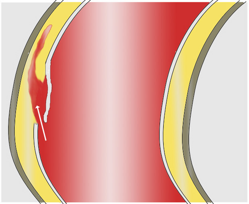
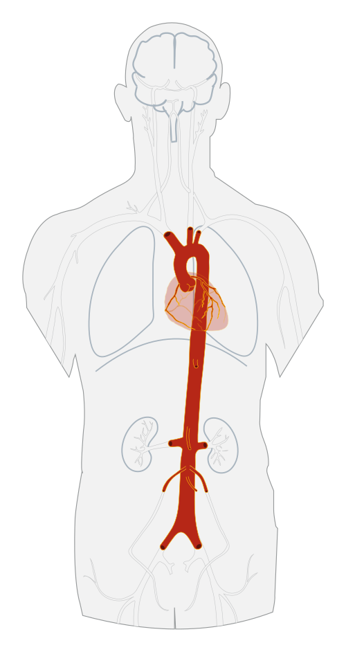

# SÍNDROMES AÓRTICAS AGUDAS

As Síndromes Aórticas Agudas (SAA) representam um espectro de condições graves que compartilham um substrato fisiopatológico comum: a ruptura da integridade da parede da aorta. Quando falamos de SAA para a prova de residência, estamos falando de três entidades principais: a **Dissecção Aórtica Aguda (DAA)**, o **Hematoma Intramural (HIM)** e a **Úlcera Aórtica Penetrante (UAP)**.

Muitos alunos erram questões por tratarem essas três condições como se fossem a mesma coisa. Embora o quadro clínico seja muito semelhante, a fisiopatologia e, por vezes, o desfecho mudam. Vamos entender o porquê.

*Figura 1 - Esquema da dissecção aórtica: a laceração da camada íntima permite que o sangue entre na camada média, criando um falso lúmen. Stanford A (aorta ascendente) = cirurgia de emergência; Stanford B (após subclávia esquerda) = tratamento clínico inicial. Fonte: J. Heuser (JHeuser), CC BY-SA 3.0 | Wikimedia Commons*

## Fisiopatologia e Definições

Para entender a dissecção, você precisa visualizar a aorta como uma mangueira de três camadas: íntima (interna), média (muscular/elástica) e adventícia (externa).

- **Dissecção Aórtica Aguda:** Ocorre um rasgo na túnica íntima (porta de entrada). O sangue, sob alta pressão, penetra na camada média e cria uma "falsa luz". O perigo aqui é duplo: a falsa luz pode comprimir a verdadeira luz (causando isquemia de órgãos) ou a parede externa (adventícia) pode romper, levando ao óbito imediato.

- **Hematoma Intramural:** Aqui não há um rasgo evidente na íntima. O que ocorre é a ruptura dos *vasa vasorum* (os pequenos vasos que nutrem a parede da aorta) dentro da camada média. Imagine um "hematoma" ou um "roxo" dentro da parede do vaso. **Dica de prova:** O HIM é frequentemente considerado um precursor da dissecção.

- **Úlcera Aórtica Penetrante:** É uma placa de aterosclerose que sofre erosão e "fura" a lâmina elástica interna, atingindo a média. É mais comum em idosos com aterosclerose grave.

**Por que isso importa?** Porque a aorta não é apenas um cano; ela é o tronco principal de distribuição. Se a dissecção "sobe" para as carótidas, temos um AVC. Se "desce" para as renais, temos insuficiência renal aguda. Se atinge as coronárias (geralmente a direita), temos um Infarto Agudo do Miocárdio (IAM).

## Classificações: Onde está o problema?

As bancas amam classificações porque elas definem a conduta. Você precisa dominar as duas principais:

### Classificação de Stanford (A mais cobrada)

Baseia-se no envolvimento da **aorta ascendente**.

- **Tipo A:** Envolve a aorta ascendente (independente de onde começou).

- **Tipo B:** Envolve apenas a aorta descendente (distal à artéria subclávia esquerda).

### Classificação de DeBakey

Baseia-se na origem e extensão.

- **Tipo I:** Começa na ascendente e se estende para a descendente.

- **Tipo II:** Envolve apenas a aorta ascendente.

- **Tipo III:** Envolve apenas a aorta descendente (IIIa limitada à aorta torácica; IIIb estende-se abaixo do diafragma).

**Regra de ouro do Dr. Will:** Se envolveu a aorta ascendente, é Stanford A e o tratamento é **cirurgia de emergência**. Se poupou a ascendente, é Stanford B e o tratamento inicial costuma ser **clínico**.

| Classificação | Localização | Conduta Inicial Típica |
| --- | --- | --- |
| **Stanford A** | Aorta Ascendente | Cirurgia de Emergência |
| **Stanford B** | Aorta Descendente | Tratamento Clínico (Anti-impulso) |

## Quadro Clínico: A Dor que "Rasga"

O sintoma clássico é a dor torácica de início súbito, com intensidade máxima desde o primeiro segundo. Diferente do IAM, onde a dor pode ser progressiva ou em aperto, na dissecção o paciente descreve uma sensação de **"rasgar"** ou **"esfaquear"**.

- **Migração da dor:** Se a dor começou no peito e "andou" para as costas ou abdome, isso reflete a progressão da dissecção ao longo da aorta.

- **Assimetria de pulsos e pressão:** Um achado clássico é a diferença de pressão arterial entre os membros superiores (> 20 mmHg) ou a ausência de pulso em uma extremidade.

- **Sopro Diastólico Novo:** Se você auscultar um sopro diastólico no foco aórtico em um paciente com dor torácica, pense em Stanford A. A dissecção "alargou" o anel valvar, causando insuficiência aórtica aguda. Isso pode levar ao edema agudo de pulmão (EAP).

**Cuidado com a pegadinha:** A dissecção de aorta pode se apresentar como um AVC ou uma isquemia de membro. Se o examinador te der um paciente com dor torácica que evoluiu com déficit motor, não pense em dois problemas separados. É uma dissecção de aorta causando má perfusão cerebral.

## Diagnóstico: O que pedir e quando?

Na prática e na prova, a escolha do exame depende da estabilidade hemodinâmica do paciente.

- **Angiotomografia de Tórax e Abdome (Angio-TC):** É o padrão-ouro para o diagnóstico em pacientes **estáveis**. É rápida, disponível e mostra a extensão da dissecção, o envolvimento de ramos e a presença de trombos.

- **Ecocardiograma Transesofágico (ETE):** É o exame de escolha para pacientes **instáveis** ou com suspeita de tamponamento cardíaco, pois pode ser feito à beira do leito na sala de emergência. Tem excelente sensibilidade para a aorta ascendente.

- **Ressonância Magnética (RM):** Excelente acurácia, mas raramente usada na fase aguda devido ao tempo de exame e dificuldade de monitorização do paciente.

- **Radiografia de Tórax:** Pode mostrar o clássico **alargamento de mediastino** (> 8 cm), mas um raio-X normal NÃO exclui dissecção.

**Dica MedEvo:** O Dímero D tem alto valor preditivo negativo. Se o Dímero D for baixo (< 500 ng/mL), a chance de ser dissecção é mínima. Porém, se for alto, não confirma nada, pois ele sobe em TEP, IAM e infecções.

*Figura 2 - Esquema de dissecção aórtica mostrando o flap intimal separando o verdadeiro lúmen do falso lúmen. A terapia anti-impulso é obrigatória: betabloqueador IV (esmolol ou labetalol) para FC < 60 bpm, seguido de nitroprussiato se PA persistir elevada. Nunca vasodilatador antes do betabloqueador (risco de taquicardia reflexa e progressão da dissecção). Fonte: Domínio Público | Wikimedia Commons*

## Manejo Inicial: A Terapia Anti-Impulso

O objetivo aqui é reduzir o estresse de cisalhamento (*shear stress*) na parede da aorta. Queremos que o sangue bata na parede da aorta com menos força e menos vezes por minuto.

### 1. Controle da Frequência Cardíaca (O primeiro passo!)

Você deve reduzir a FC para **< 60 bpm**.

- **Droga de escolha:** Betabloqueadores IV (Esmolol, Metoprolol ou Labetalol).

- **Por que o BB vem primeiro?** Se você usar um vasodilatador (como nitroprussiato) antes do BB, o corpo fará uma taquicardia reflexa, o que aumenta a força de contração do ventrículo e pode "rasgar" ainda mais a aorta.

### 2. Controle da Pressão Arterial

A meta é uma PAS entre **100 e 120 mmHg**.

- **Droga de escolha:** Nitroprussiato de Sódio (após o BB).

- **Labetalol:** É uma excelente opção pois bloqueia receptores alfa e beta simultaneamente, controlando FC e PA com uma única droga.

### 3. Analgesia

A dor aumenta o tônus simpático, o que eleva a PA e a FC.

- **Droga de escolha:** Morfina IV.

| Parâmetro | Meta Terapêutica | Droga de Escolha |
| --- | --- | --- |
| **Frequência Cardíaca** | < 60 bpm | Esmolol ou Metoprolol IV |
| **Pressão Arterial (PAS)** | 100 - 120 mmHg | Nitroprussiato (após BB) |
| **Dor** | Alívio completo | Morfina IV |

## Tratamento Definitivo

- **Stanford A:** Cirurgia de emergência sempre. O risco de morte aumenta 1-2% a cada hora nas primeiras 48 horas. A principal causa de óbito é o **tamponamento cardíaco**.

- **Stanford B não complicada:** Tratamento clínico rigoroso (controle de PA e FC).

- **Stanford B complicada:** (Isquemia de órgãos, dor persistente, expansão aneurismática, sinais de ruptura iminente). Aqui indicamos o tratamento endovascular (TEVAR - *Thoracic Endovascular Aortic Repair*).

## Aneurisma de Aorta Abdominal (AAA)

Mudando o foco para a aorta infra-renal. O AAA é definido como uma dilatação focal da aorta > 50% do seu diâmetro normal (geralmente **> 3,0 cm**).

### Epidemiologia e Fatores de Risco

- **Tabagismo:** É o principal fator de risco modificável.

- **Idade e Sexo:** Mais comum em homens > 65 anos.

- **História Familiar:** Forte componente genético.

- **Diabetes Mellitus:** **Pegadinha clássica!** O DM é considerado um fator **protetor** para o desenvolvimento e expansão do AAA. As bancas adoram colocar o DM como fator de risco para te confundir com a aterosclerose coronariana.

### Rastreamento (Screening)

Segundo a maioria das diretrizes (incluindo a SBC e a USPSTF):

- **Quem?** Homens entre 65 e 75 anos que já fumaram (pelo menos 100 cigarros na vida).

- **Como?** Ultrassonografia (USG) de abdome.

### Quando Intervir no AAA Assintomático?

Não operamos todo mundo. O risco da cirurgia deve ser menor que o risco de ruptura.

- **Homens:** Diâmetro ≥ 5,5 cm.

- **Mulheres:** Diâmetro ≥ 5,0 cm (elas rompem com diâmetros menores).

- **Crescimento rápido:** > 0,5 cm em 6 meses ou > 1,0 cm em 1 ano.

- **Sintomáticos:** Qualquer AAA que cause dor deve ser operado, independente do tamanho.

### AAA Roto: A Tríade Clássica

Apenas 25-50% dos pacientes apresentam a tríade completa, mas para a prova, ela é soberana:

- **Dor abdominal ou lombar súbita.**

- **Hipotensão/Choque.**

- **Massa abdominal pulsátil.**

**Conduta no AAA Roto:**

- Paciente instável + suspeita de AAA = **Sala de cirurgia imediata** (ou USG FAST se houver dúvida). Não perca tempo levando para a Tomografia!

- Paciente estável = Angio-TC para planejamento cirúrgico.

## Coarctação da Aorta e Outras Condições

A coarctação é uma malformação congênita (estreitamento) geralmente perto do canal arterial.

- **Clínica:** Hipertensão em membros superiores e pulsos femorais reduzidos ou ausentes.

- **Sinal de Röesler:** Erosões na borda inferior das costelas visíveis no Raio-X (causadas pela circulação colateral das artérias intercostais).

- **Associação:** Frequentemente associada à **Válvula Aórtica Bicúspide** e à Síndrome de Turner.

## Diagnóstico Diferencial da Dor Torácica

Não confunda dissecção com:

- **IAM:** ECG com supra de ST ou alteração de troponina (embora a dissecção possa causar IAM se atingir o óstio coronariano).

- **TEP:** Dor pleurítica, dispneia, hipóxia e fatores de risco para TVP.

- **Pneumotórax Hipertensivo:** Desvio de traqueia, ausência de murmúrio vesicular unilateral e timpanismo.

- **Úlcera Péptica Perfurada:** Dor epigástrica súbita, abdome em tábua e pneumoperitônio no Raio-X.

## Pontos-Chave para Prova 💡

- **Dissecção Stanford A:** Emergência cirúrgica. Atinge aorta ascendente.

- **Dissecção Stanford B:** Inicialmente clínico. Atinge apenas aorta descendente.

- **Meta de FC na Dissecção:** < 60 bpm (usar Betabloqueador IV primeiro).

- **Meta de PA na Dissecção:** PAS entre 100-120 mmHg.

- **Principal Fator de Risco para Dissecção:** Hipertensão Arterial Sistêmica (HAS).

- **Principal Fator de Risco para AAA:** Tabagismo.

- **Diabetes e AAA:** O DM é um fator **protetor** (reduz a expansão do aneurisma).

- **Indicação Cirúrgica AAA (Homens):** ≥ 5,5 cm.

- **Indicação Cirúrgica AAA (Mulheres):** ≥ 5,0 cm.

- **Sinal de Röesler:** Coarctação da Aorta (corrosão das costelas).

- **Tamponamento Cardíaco:** Principal causa de morte na Dissecção Tipo A.

- **Diferença de Pulsos/PA:** Altamente sugestivo de Dissecção de Aorta.

- **Exame para Instáveis:** Ecocardiograma Transesofágico (ETE).

- **Exame para Estáveis:** Angio-Tomografia (Angio-TC).

- **Tratamento Clínico "Anti-impulso":** Betabloqueador ANTES de Vasodilatador.

- **Contraindicação Absoluta:** NUNCA trombolisar um paciente com dor torácica antes de descartar dissecção se houver assimetria de pulsos ou alargamento de mediastino.

- **Aneurisma Micótico:** Não tem relação com fungos; é um aneurisma de origem infecciosa (geralmente bacteriana).

- **Aneurisma de Artéria Esplênica:** O mais comum dos viscerais; maior risco de ruptura em gestantes.

## Tabelas Comparativas

### Stanford vs. DeBakey

| Stanford | DeBakey | Envolvimento Anatômico |
| --- | --- | --- |
| **Tipo A** | I | Ascendente + Descendente |
| **Tipo A** | II | Apenas Ascendente |
| **Tipo B** | III | Apenas Descendente |

### Diagnóstico Diferencial de Imagem

| Exame | Vantagem | Desvantagem |
| --- | --- | --- |
| **Angio-TC** | Padrão-ouro, vê toda a aorta | Radiação, contraste iodado, precisa de estabilidade |
| **ETE** | Beira do leito, excelente para Tipo A | Operador dependente, não vê bem a aorta distal |
| **RM** | Melhor acurácia, sem radiação | Demorado, difícil acesso na urgência |
| **Raio-X** | Rápido, triagem inicial | Baixa sensibilidade (20% podem ser normais) |

### Metas no Tratamento Clínico da Dissecção

| Parâmetro | Alvo | Justificativa |
| --- | --- | --- |
| **Frequência Cardíaca** | 50 - 60 bpm | Reduzir o número de "golpes" de sangue na íntima |
| **Pressão Arterial Sistólica** | 100 - 120 mmHg | Reduzir a força de expansão da falsa luz |
| **DP/DT (Contratilidade)** | Reduzida | O Betabloqueador reduz a velocidade de ejeção |

Lembre-se: em provas de residência, a dissecção de aorta é a "grande simuladora". Sempre que houver dor torácica associada a qualquer outro sintoma "estranho" (síncope, sopro novo, déficit neurológico, isquemia de membro, insuficiência renal aguda), a dissecção deve estar no topo do seu diferencial. Como dizemos no MedEvo, o diagnóstico só é feito por quem suspeita dele.

 Cópia offline para consulta pessoal.
 Fonte original:
 [https://www.medevo.com.br/material-apoio/ler/62bebe6a-83dc-447c-8205-9b7c50e2843a](https://www.medevo.com.br/material-apoio/ler/62bebe6a-83dc-447c-8205-9b7c50e2843a)
