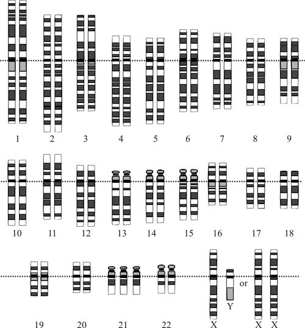
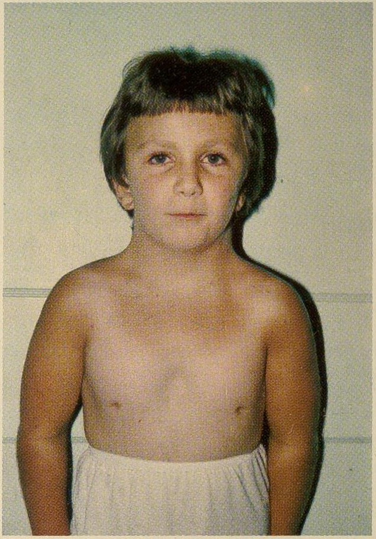

# SÍNDROMES GENÉTICAS COMUNS

## Síndrome de Down (Trissomia do 21)

A Síndrome de Down é a anomalia cromossômica mais frequente na prática pediátrica e o tema recordista em provas de residência. O erro genético fundamental é a presença de um cromossomo 21 extra, que em 95% dos casos ocorre por não disjunção meiótica (geralmente materna). Os outros 5% dividem-se entre translocação robertsoniana (frequentemente envolvendo os cromossomos 14 ou 21) e mosaicismo.

*Figura 1 - Cariótipo demonstrando trissomia do cromossomo 21 (47,XX,+21). A Síndrome de Down é a aneuploidia mais comum compatível com a vida. O risco aumenta com a idade materna (>35 anos). Rastreamento: translucência nucal + bioquímica sérica no 1° trimestre. Fonte: National Human Genome Research Institute, Domínio Público | Wikimedia Commons*

Por que o cariótipo é obrigatório se o diagnóstico clínico é evidente? Muitos alunos erram ao achar que o cariótipo serve apenas para confirmar a síndrome. Na verdade, ele é crucial para o aconselhamento genético. Se a causa for uma translocação, os pais precisam ser testados, pois o risco de recorrência em futuras gestações é significativamente maior do que na trissomia livre.

### Quadro Clínico e Diagnóstico

O diagnóstico é clínico, baseado nos sinais de Hall. No período neonatal, a hipotonia muscular é o achado mais marcante, presente em quase 80% dos casos. Outros sinais incluem:

- Fendas palpebrais oblíquas (orientação para cima).

- Prega palmar única (prega simiesca).

- Manchas de Brushfield (pequenos pontos brancos na periferia da íris).

- Perfil facial plano e orelhas de implantação baixa.

- Clinodactilia do 5º dedo e excesso de pele na nuca.

### Complicações e Rastreamento (Diretriz SBP 2023)

O manejo do paciente com Down não é apenas "esperar o desenvolvimento". Existe um cronograma rigoroso de rastreio de comorbidades que as bancas adoram cobrar.

- **Cardiopatias Congênitas:** Ocorrem em 50% dos casos. O defeito do septo atrioventricular (DSAV) total é a lesão mais característica. Todo RN com Down deve realizar ecocardiograma ao nascimento, independentemente da ausência de sopros.

- **Disfunção Tireoidiana:** O hipotireoidismo (congênito ou adquirido/autoimune) é extremamente comum. O rastreio deve ser feito com TSH e T4 livre no período neonatal, aos 6 meses, 12 meses e depois anualmente.

- **Instabilidade Atlantoaxial:** É a frouxidão dos ligamentos entre C1 e C2. Pode causar compressão medular. O rastreio radiológico (RX de coluna cervical em perfil com flexão, extensão e neutra) é indicado antes de atividades esportivas ou cirurgias que exijam intubação.

- **Doença Celíaca:** O risco é 10 a 20 vezes maior que na população geral. O rastreio em assintomáticos começa após os 2 anos de idade com IgA total e anticorpo antitransglutaminase tecidual IgA.

- **Distúrbios Hematológicos:** Há um risco aumentado de Reação Leucemoide Transitória no neonato e, posteriormente, de Leucemia (especialmente LMA-M7 em menores de 3 anos e LLA em maiores de 3 anos).

## Síndrome de Edwards (Trissomia do 18)

Se a Síndrome de Down é a "queridinha" das provas pela sobrevivência, a Síndrome de Edwards é cobrada pelo seu fenótipo grave e alta mortalidade (raramente ultrapassam o primeiro ano de vida).

O quadro clínico clássico que você encontrará na questão é: RN com restrição de crescimento intrauterino (RCIU) grave, micrognatia (queixo pequeno), orelhas faunescas (pontiagudas), esterno curto e uma característica patognomônica: mãos cerradas com sobreposição do 2º dedo sobre o 3º e do 5º sobre o 4º. Além disso, os pés em "mata-borrão" (rocker-bottom feet) e a presença de cardiopatias graves (comunicação interventricular é a mais comum) fecham o diagnóstico sindrômico.

## Síndrome de Patau (Trissomia do 13)

A trissomia do 13 é marcada por defeitos de linha média. Imagine um bebê com fenda labiopalatina bilateral, microftalmia (olhos pequenos) ou anoftalmia, e holoprosencefalia (falha na divisão do cérebro). A polidactilia pós-axial (dedo extra) também é um achado frequente. Assim como na Edwards, o prognóstico é reservado, com a maioria dos óbitos ocorrendo nos primeiros meses por apneia central ou complicações cardíacas.

*Figura 2 - Fenótipo da Síndrome de Turner (45,X): baixa estatura, pescoço alado (pterygium colli), tórax em escudo com mamilos hipoplásicos e hipertelorismo mamário. Características incluem disgenesia gonadal, coarctação de aorta e aorta bicúspide. Fonte: Gellis & Feingold, Domínio Público | Wikimedia Commons*

## Síndrome de Turner (45,X)

Aqui temos a monossomia do X, afetando exclusivamente indivíduos do fenótipo feminino. É uma das causas mais importantes de baixa estatura e amenorreia primária em meninas.

### Características Fenotípicas

Ao contrário das trissomias, a inteligência na Síndrome de Turner costuma ser normal, embora possam existir dificuldades em habilidades não verbais e processamento espacial. Os sinais clássicos incluem:

- Baixa estatura (quase 100% dos casos).

- Pescoço alado (pterygium colli) e implantação baixa dos cabelos na nuca.

- Tórax em escudo com hipertelorismo mamário (mamilos amplamente afastados).

- Cúbito valgo (ângulo aumentado do cotovelo).

- Linfedema de mãos e pés ao nascimento (uma dica de prova valiosa para o período neonatal).

### Manejo e Comorbidades

Segundo o Protocolo Clínico e Diretrizes Terapêuticas do Ministério da Saúde, o tratamento foca em dois pilares:

- **Crescimento:** Uso de Somatropina (hormônio do crescimento - GH) assim que a velocidade de crescimento cair ou a criança estiver abaixo do percentil 5 da curva específica para Turner.

- **Desenvolvimento Puberal:** Reposição estrogênica para indução de caracteres sexuais secundários e prevenção de osteoporose, geralmente iniciada por volta dos 11 a 12 anos.

As complicações cardiovasculares são a principal causa de mortalidade precoce. A coarctação da aorta e a valva aórtica bicúspide são as lesões mais comuns. Além disso, o rastreio de anomalias renais (como o rim em ferradura) e de tireoidite de Hashimoto é obrigatório.

## Neurofibromatose Tipo 1 (NF1)

A NF1 é uma doença autossômica dominante com expressividade variável. O diagnóstico é essencialmente clínico. Em 2021, os critérios foram atualizados para incluir testes genéticos e achados oftalmológicos mais precisos.

Para fechar o diagnóstico em um paciente sem história familiar, são necessários dois ou mais dos seguintes critérios:

- 6 ou mais manchas café com leite (> 5mm em pré-púberes ou > 15mm em pós-púberes).

- 2 ou mais neurofibromas de qualquer tipo ou 1 neurofibroma plexiforme.

- Efélides (sardas) nas regiões axilares ou inguinais (Sinal de Crowe).

- Glioma de via óptica.

- 2 ou mais nódulos de Lisch (hamartomas de íris) ou 2 ou mais anormalidades da coroide.

- Lesão óssea típica (displasia do esfenoide ou afilamento do córtex de ossos longos).

- Variante patogênica heterozigótica no gene NF1.

Cuidado: Muitos alunos confundem as manchas café com leite com lesões normais de pele. Na NF1, elas são o primeiro sinal e tendem a aumentar em número e tamanho com a idade. Como diz o Dr. Will, "na NF1, a pele conta a história que o gene esconde".

## Síndrome do X Frágil

Esta é a causa herdada mais comum de deficiência intelectual em homens. É causada pela expansão de tripletos CGG no gene FMR1. O fenótipo clássico surge mais claramente após a puberdade: face alongada, orelhas grandes e proeminentes, mandíbula proeminente e macro-orquidia (testículos aumentados). No comportamento, há uma forte sobreposição com o Transtorno do Espectro Autista (TEA), com movimentos estereotipados e pobre contato visual.

## Síndrome de DiGeorge (Deleção 22q11.2)

Lembre-se do mnemônico **CATCH-22**:

- **C**ardiopatia (defeitos de cone-tronco, como Tetralogia de Fallot ou tronco arterioso).

- **A**nomalias Faciais (hipertelorismo, fendas palpebrais curtas).

- **T**ímica (hipoplasia ou agenesia tímica, levando a imunodeficiência de células T).

- **C**left (fenda palatina ou insuficiência velofaríngea).

- **H**ipocalcemia (por hipoplasia das paratireoides, causando convulsões neonatais).

- **22**q11.2 (a deleção cromossômica).

A hipocalcemia neonatal é uma "pegadinha" frequente. Se um RN apresenta convulsão por hipocalcemia e tem um sopro cardíaco, DiGeorge deve ser sua primeira hipótese.

## Hiperplasia Adrenal Congênita (HAC)

A HAC não é apenas uma síndrome genética, é uma emergência pediátrica na sua forma perdedora de sal. A causa mais comum (95%) é a deficiência da enzima 21-hidroxilase.

### Fisiopatologia e Formas Clínicas

A falta da 21-hidroxilase impede a produção de cortisol e aldosterona. O corpo, tentando compensar, aumenta o ACTH, que estimula a adrenal a produzir precursores que são desviados para a via dos andrógenos.

- **Forma Clássica Perdedora de Sal (75%):** Deficiência grave de aldosterona e cortisol. O RN evolui entre a 1ª e 2ª semana de vida com crise adrenal: hiponatremia, hipercalemia, acidose metabólica, desidratação e choque.

- **Forma Virilizante Simples:** Há produção suficiente de aldosterona para evitar a crise, mas o excesso de andrógenos causa virilização da genitália em meninas (genitália ambígua) e pseudopuberdade precoce em meninos.

O diagnóstico na triagem neonatal (teste do pezinho) é feito pela dosagem da 17-OH-progesterona. Valores elevados em papel filtro exigem confirmação sérica imediata. O tratamento consiste na reposição vitalícia de glicocorticoide (hidrocortisona) e, nas formas perdedoras de sal, mineralocorticoide (fludrocortisona).

## Diagnóstico Diferencial: Wilms vs. Neuroblastoma

Este é um dos temas de oncologia pediátrica mais integrados à genética. Ambos se apresentam como massas abdominais, mas as características são distintas.

| Característica | Tumor de Wilms (Nefroblastoma) | Neuroblastoma |
| --- | --- | --- |
| **Origem** | Renal (células primordiais do rim) | Crista neural (adrenal ou cadeia simpática) |
| **Idade Média** | 3 a 4 anos | < 2 anos (mais comum em lactentes) |
| **Massa Abdominal** | Lisa, firme, raramente cruza a linha média | Irregular, nodular, frequentemente cruza a linha média |
| **Hipertensão** | Comum (por compressão da artéria renal) | Menos comum (embora produza catecolaminas) |
| **Marcadores** | Ausentes na urina | Catecolaminas urinárias (VMA/HVA) elevadas |
| **Sinais Sistêmicos** | Geralmente bom estado geral | Criança doente, febre, dor óssea, proptose |
| **Achado Clássico** | Associado a Aniridia, Hemihierprotrofia | Opsoclonus-myoclonus, "Olhos de Guaxinim" |

O Neuroblastoma é o tumor sólido extracraniano mais comum da infância. A metástase para a órbita causa o clássico hematoma bipalpebral (olhos de guaxinim), que deve ser diferenciado de trauma. Já o Tumor de Wilms pode fazer parte da síndrome WAGR (Wilms, Aniridia, Genitália ambígua, Retardo mental).

## Síndromes de Imprinting: Prader-Willi e Angelman

Ambas envolvem a região 15q11-q13, mas dependem da origem do cromossomo afetado. No MedEvo, ensinamos que o "P" de Prader vem de Pai (deleção paterna) e o "A" de Angelman vem de "Amaterna" (deleção materna).

- **Prader-Willi:** Caracteriza-se por hipotonia neonatal grave (o bebê "molinho" que não suga bem), seguida por um desenvolvimento de hiperfagia insaciável e obesidade mórbida a partir dos 2 anos. Apresentam mãos e pés pequenos (acromicria) e hipogonadismo.

- **Angelman:** Conhecida como síndrome da "marionete feliz". A criança apresenta riso imotivado, ataxia, movimentos espasmódicos, deficiência intelectual grave e ausência de fala.

## Tabelas Comparativas para Revisão Rápida

### Tabela 1: Trissomias Autossômicas

| Síndrome | Cromossomo | Achados Cardinais |
| --- | --- | --- |
| **Down** | 21 | Hipotonia, prega simiesca, fendas oblíquas, DSAV |
| **Edwards** | 18 | Mãos cerradas (dedos sobrepostos), pés em mata-borrão, esterno curto |
| **Patau** | 13 | Fenda labiopalatina, microftalmia, polidactilia, holoprosencefalia |

### Tabela 2: Síndromes dos Cromossomos Sexuais

| Síndrome | Cariótipo | Fenótipo | Achados Principais |
| --- | --- | --- | --- |
| **Turner** | 45,X | Feminino | Baixa estatura, pescoço alado, coarctação da aorta |
| **Klinefelter** | 47,XXY | Masculino | Estatura elevada, ginecomastia, testículos pequenos, infertilidade |

## Pontos-Chave para Prova

- **Down e Tireoide:** O rastreio de hipotireoidismo é anual e vitalício. Não confie apenas no teste do pezinho.

- **Down e Instabilidade Atlantoaxial:** Suspeite se houver mudança na marcha, dor cervical ou perda de força. O exame inicial é o RX de coluna cervical.

- **Turner e Cardiopatia:** A coarctação da aorta é a resposta correta em 90% das questões de prova sobre Turner.

- **HAC e Eletrólitos:** Hiponatremia + Hipercalemia em um RN é HAC até que se prove o contrário. É uma emergência médica.

- **Neuroblastoma vs Wilms:** Se a massa cruza a linha média e tem calcificações na TC, marque Neuroblastoma. Se for lisa e restrita a um lado, marque Wilms.

- **X-Frágil:** É a principal causa de deficiência intelectual herdada. Lembre-se do macro-orquidismo pós-puberal.

- **DiGeorge:** A hipocalcemia ocorre por hipoplasia das paratireoides. O sopro cardíaco costuma ser de uma cardiopatia de cone-tronco.

- **NF1:** As manchas café com leite devem ser pelo menos 6. O sinal de Crowe (sardas axilares) é altamente sugestivo.

- **Síndrome Alcoólica Fetal:** É um diagnóstico diferencial importante de síndromes genéticas. Procure por filtro nasal plano, lábio superior fino e microcefalia em filho de mãe etilista.

- **Marfan:** Aracnodactilia (dedos longos), ectopia lentis (luxação do cristalino) e dilatação da aorta ascendente.

- **Prader-Willi:** Hipotonia neonatal que vira obesidade por hiperfagia.

- **CMV Congênito:** Principal diferencial de microcefalia genética. Procure por calcificações periventriculares e surdez neurossensorial. 🧠

 Cópia offline para consulta pessoal.
 Fonte original:
 [https://www.medevo.com.br/material-apoio/ler/0e9d46c1-bada-4701-9985-ea00a7a7860a](https://www.medevo.com.br/material-apoio/ler/0e9d46c1-bada-4701-9985-ea00a7a7860a)
