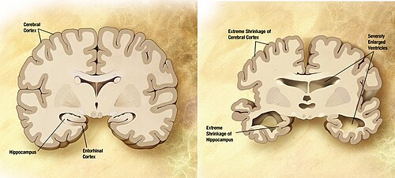

# SÍNDROMES GERIÁTRICAS

A Geriatria exige uma mudança de raciocínio clínico. Na clínica médica tradicional, muitas vezes se procura uma única doença que explique todos os sintomas. Nas síndromes geriátricas, o raciocínio é de **complexidade**: múltiplos fatores pequenos — medicações, sarcopenia, déficit cognitivo, instabilidade, incontinência, ambiente e doenças crônicas — somam-se e produzem perda funcional.

O ponto central não é apenas a idade cronológica, mas a **reserva funcional**. Dois idosos da mesma idade podem ter riscos completamente diferentes: um robusto e independente, outro frágil, sarcopênico, polimedicado e com maior vulnerabilidade a quedas, delirium, institucionalização e morte.

## Como organizar o tema

As síndromes geriátricas ficam menos confusas quando são agrupadas pelos **5 Is da Geriatria** e pela Avaliação Geriátrica Ampla (AGA).

5 Is da Geriatria

1. Instabilidade → quedas, marcha, hipotensão ortostática, tontura
2. Imobilidade → sarcopenia, fragilidade, risco de úlcera por pressão
3. Incontinência → urinária/fecal, causas transitórias e persistentes
4. Insuficiência cognitiva → delirium, demências, depressão e funcionalidade
5. Iatrogenia → polifarmácia, cascata prescritiva, fármacos inapropriados

Eixo transversal: funcionalidade, suporte social, nutrição, pele, ética e metas de cuidado.

A pergunta prática é: **qual síndrome está reduzindo funcionalidade e qual fator precipitante pode ser corrigido primeiro?**

## Fluxo prático da Avaliação Geriátrica Ampla

Idoso com queixa inespecífica ou declínio funcional

1) Definir funcionalidade basal
 ├─ ABVD: banho, vestir, alimentar-se, transferir, continência, higiene
 └─ AIVD: finanças, compras, transporte, medicações, telefone, casa

2) Procurar síndromes geriátricas
 ├─ Quedas/instabilidade
 ├─ Fragilidade/sarcopenia/imobilidade
 ├─ Incontinência
 ├─ Delirium/demência/depressão
 └─ Polifarmácia/iatrogenia

3) Identificar precipitantes reversíveis
 ├─ Infecção, dor, desidratação, constipação, retenção urinária
 ├─ Medicações novas ou dose excessiva
 ├─ Alterações metabólicas
 └─ Mudança ambiental ou perda de cuidador

4) Individualizar metas
 ├─ Idoso robusto: prevenção e controle mais intensivo
 ├─ Idoso vulnerável/frágil: evitar iatrogenia e preservar função
 └─ Fim de vida: conforto, proporcionalidade e diretivas de cuidado

*Figura 1 - As síndromes geriátricas (os "5 Is da Geriatria": imobilidade, instabilidade, incontinência, insuficiência cognitiva e iatrogenia) representam condições multifatoriais frequentes no idoso. A avaliação geriátrica ampla (AGA) é a ferramenta central de abordagem. Fonte: National Cancer Institute, Domínio Público | Wikimedia Commons*

## Senescência versus Senilidade

Este é o ponto de partida obrigatório. Confundir envelhecimento normal com doença aumenta risco de erro diagnóstico e iatrogenia.

A **Senescência** engloba as alterações fisiológicas e previsíveis do envelhecimento. Por exemplo, o idoso tem uma redução da sensibilidade à hipercapnia e à hipóxia. Isso não é doença, é fisiologia do envelhecimento. Outro exemplo clássico de prova: o acúmulo de lipofuscina (pigmento da idade) nas células de longa vida devido à perda da proteostase celular.

A **Senilidade**, por outro lado, é o envelhecimento patológico. Demência **não** é senescência. Incontinência urinária **não** é normal da idade. Se a alternativa diz que "o esquecimento faz parte do envelhecimento normal", ela está errada. O declínio cognitivo patológico exige investigação.

O melhor indicador de prognóstico e longevidade no idoso não é a carga de doenças, mas o seu **Estado Funcional**. Guarde isso: a capacidade de realizar Atividades de Vida Diária (AVDs) e Atividades Instrumentais de Vida Diária (AIVDs) manda mais no prognóstico do que o valor da fração de ejeção ou da hemoglobina glicada.

## Síndrome da Fragilidade e Sarcopenia

A fragilidade é o "estado de vulnerabilidade" do idoso. Imagine dois pacientes de 80 anos: um corre maratonas e o outro vive sentado, cansado e perdeu peso. O segundo é o idoso frágil.

### Critérios de Fried

Os 5 critérios de Fried são essenciais. Três ou mais critérios definem fragilidade; um ou dois critérios definem pré-fragilidade.

- Perda de peso não intencional (mais de 4,5 kg ou 5% do peso corporal no último ano).

- Exaustão (autorreferida pelo paciente).

- Baixa atividade física (gasto calórico semanal reduzido).

- Lentidão na marcha (velocidade de caminhada reduzida).

- Fraqueza muscular (medida pela força de preensão manual com dinamômetro).

### Sarcopenia

Muitos alunos confundem sarcopenia com fragilidade. A sarcopenia é um componente da fragilidade, mas tem definição própria. Segundo o Consenso Europeu (EWGSOP2), o diagnóstico de sarcopenia exige a avaliação de três pilares:

- **Força muscular reduzida** (o critério mais precoce e importante para triagem).

- **Quantidade ou qualidade muscular reduzida** (massa muscular).

- **Baixo desempenho físico** (define a gravidade).

**Ponto de prova:** a intervenção mais eficaz para sarcopenia e melhora da sobrevida funcional é exercício físico de resistência. Suplemento proteico isolado tem efeito limitado se não houver estímulo muscular.

## Instabilidade Postural e Quedas

A queda no idoso nunca é "apenas um tropeço". Ela é um evento sentinela que indica que algo está errado.

As causas são divididas em:

- **Fatores Intrínsecos:** Alterações do próprio idoso (visão reduzida, déficit de audição, osteoartrose, hipotensão ortostática, sarcopenia).

- **Fatores Extrínsecos:** Ambiente (tapetes soltos, iluminação precária, calçados inadequados).

Um conceito central em quedas é a **hipotensão ortostática**. Ela é definida pela queda de ≥ 20 mmHg na PAS ou ≥ 10 mmHg na PAD após 3 minutos em pé. Em idoso com quedas frequentes e polifarmácia, a conduta inicial deve incluir investigação de hipotensão ortostática e revisão de fármacos indutores, como diuréticos e anti-hipertensivos em excesso.

### Manobra de Osler e Pseudo-hipertensão

Cuidado com a pegadinha: a artéria do idoso pode ser tão calcificada que o manguito não consegue colapsá-la. Isso gera uma leitura falsamente alta da pressão arterial (pseudo-hipertensão). Como identificar? **Manobra de Osler**: se a artéria radial continuar palpável mesmo após o manguito estar insuflado acima da pressão sistólica, o sinal é positivo.

### Tabela 1: Diagnóstico Diferencial da Instabilidade

| Condição | Características Clínicas | Conduta Sugerida |
| --- | --- | --- |
| VPPB | Vertigem rotacional curta ao mudar posição da cabeça | Manobra de Dix-Hallpike (diagnóstico) |
| Hipotensão Ortostática | Tontura/escurecimento visual ao levantar | Revisar fármacos, hidratação, fludrocortisona se grave |
| Arritmias | Palpitação ou síncope súbita sem pródromos | ECG / Holter 24h |
| Déficit Sensorial | Desequilíbrio pior no escuro ou superfícies irregulares | Reabilitação visual/auditiva e fisioterapia |

## Incontinência Urinária (IU)

A IU é uma das síndromes mais subdiagnosticadas porque o idoso tem vergonha de falar e o médico esquece de perguntar.

### Causas Transitórias (Mnemônico DIAPPERS)

Antes de pensar em cirurgia ou drogas caras, exclua o óbvio:

- **D**elirium

- **I**nfecção (ITU) - Sempre peça Urina I e Urocultura antes de investigação avançada!

- **A**trofia vaginal (vaginite atrófica por deficiência de estrogênio)

- **P**harmaceuticals (Diuréticos, anticolinérgicos, sedativos)

- **P**sicológico (Depressão)

- **E**xcesso de débito urinário (DM descompensada, IC, hipercalcemia)

- **R**estrição de mobilidade

- **S**tool (Impactação fecal/constipação)

### Tipos de Incontinência Persistente

- **IU de Esforço (IUE):** Perda ao tossir, espirrar ou carregar peso. Comum em mulheres por fraqueza do assoalho pélvico. Se ocorrer aos "pequenos esforços", pense em Deficiência Esfincteriana Intrínseca (DEI).

- *Tratamento:* Fisioterapia (exercícios de Kegel). Farmacológico: Duloxetina (20-80 mg/dia) pode ser usada, pois inibe a recaptação de serotonina e noradrenalina, aumentando o tônus do esfíncter.

- **IU de Urgência (IUU):** Vontade súbita e inadiável de urinar. Relacionada à bexiga hiperativa (contrações involuntárias do detrusor).

- *Tratamento:* Treinamento vesical. Farmacológico: Anticolinérgicos (Oxibutinina, Solifenacina) ou agonistas beta-3 (Mirabegrona). **Cuidado:** Anticolinérgicos podem causar boca seca, constipação e piorar o cognitivo (risco de delirium).

- **IU por Transbordamento:** A bexiga não esvazia (bexiga hipotônica ou obstrução como HPB). O resíduo pós-miccional é alto (> 200 mL). O paciente perde urina "gota a gota".

- **IU Mista:** Combinação de esforço e urgência. É o tipo mais comum em mulheres idosas.

## Iatrogenese e Polifarmácia

Polifarmácia é geralmente definida como o uso de 5 ou mais medicamentos. No idoso, isso é um perigo real. O envelhecimento altera a farmacocinética:

- **Redução da água corporal total:** Drogas hidrossolúveis (ex: Lítio) têm menor volume de distribuição e maior concentração plasmática.

- **Aumento da gordura corporal:** Drogas lipossolúveis (ex: Diazepam) têm maior volume de distribuição e meia-vida prolongada.

- **Redução da albumina:** Aumenta a fração livre de drogas que se ligam a proteínas (ex: Varfarina, Fenitoína).

### Critérios de Beers

As bancas amam cobrar medicamentos que devem ser evitados.

- **Benzodiazepínicos:** Aumentam risco de quedas, fraturas e delirium.

- **AINEs:** Causam retenção hídrica, aumentam PA e podem levar à "cascata de prescrição" (prescrever um diurético para tratar o edema causado pelo AINE).

- **Glibenclamida:** Alto risco de hipoglicemia prolongada. Prefira outras classes em idosos.

- **Antipsicóticos em idosos com demência:** Aumentam risco de AVC e morte (usar apenas se risco de auto/heteroagressividade).

**Ponto de prova:** em idoso com hiperuricemia em uso de hidroclorotiazida, considerar suspender/substituir o diurético para reduzir risco de gota. Idosos com demência e insuficiência cardíaca têm risco maior de reações adversas a medicamentos.

*Figura 2 - Delirium vs. Demência: o delirium tem início agudo, flutuação do nível de consciência e é potencialmente reversível; a demência tem início insidioso, consciência preservada inicialmente e é progressiva. CAM (Confusion Assessment Method) é o instrumento de triagem para delirium. Fonte: Domínio Público | Wikimedia Commons*

## Cognição: Delirium e Demências

Aqui está a maior confusão das provas. Aprenda a diferenciar de uma vez por todas.

### Delirium

É uma alteração **aguda** e **flutuante** da consciência e atenção. É uma emergência médica!

- **Fisiopatologia:** Desequilíbrio de neurotransmissores (redução de acetilcolina e aumento de dopamina/catecolaminas).

- **Causas:** Infecção (ITU, pneumonia), distúrbios eletrolíticos (hiponatremia por diurético), fármacos (opioides, anticolinérgicos), dor ou retenção urinária.

- **Tratamento:** Tratar a causa base. Medidas não farmacológicas (ambiente iluminado, relógio visível, presença de acompanhante). Antipsicóticos (Haloperidol em doses baixas) apenas se agitação grave.

### Demências

Diferente do delirium, o quadro é crônico e progressivo.

- **Alzheimer:** Perda de memória recente é o marco inicial.

- **Demência por Corpúsculos de Lewy:** Flutuação cognitiva + Alucinações visuais detalhadas + Parkinsonismo. **Cuidado:** Esses pacientes têm hipersensibilidade a neurolépticos!

- **Demência Vascular:** Degraus de piora, relacionada a eventos isquêmicos.

**Pérola Clínica:** Idoso com hipoglicemias recorrentes e esquecimento? Investigue causas orgânicas antes de rotular como Alzheimer. Peça neuroimagem e dose B12. A deficiência de B12 é uma causa reversível de declínio cognitivo e anemia macrocítica.

## Manejo de Doenças Crônicas no Idoso

Na Geriatria, "menos é mais". O conceito de **Prevenção Quaternária** (evitar danos causados por intervenções médicas desnecessárias) é fundamental.

### Diabetes Mellitus (DM2)

As metas de HbA1c devem ser individualizadas (Diretriz SBD):

- **Idoso hígido:** HbA1c < 7,0% a 7,5%.

- **Idoso frágil/comorbidades/expectativa de vida limitada:** HbA1c < 8,0% ou até 8,5%.

- **Por que ser menos rigoroso?** Porque o risco de hipoglicemia e quedas supera o benefício do controle glicêmico estrito a longo prazo. Se um idoso chega com HbA1c de 5,9% e usa polifarmácia para DM, o risco de hipoglicemia é altíssimo. Devemos simplificar o esquema.

### Hipertensão Arterial (HAS)

A meta geralmente é < 140/90 mmHg. Em idosos muito frágeis, podemos tolerar PAS até 150 mmHg. Cuidado com o uso de Anlodipino (causa edema de membros inferiores) e diuréticos (causam hiponatremia e hipocalemia). Se o paciente tem fadiga, câimbras e tontura usando diurético, dose os eletrólitos imediatamente.

### Tabela 2: Metas Terapêuticas Individualizadas

| Perfil do Idoso | Meta HbA1c | Meta Pressão Arterial | Estatina |
| --- | --- | --- | --- |
| Independente / Poucas doenças | 7,0 - 7,5% | < 140/90 mmHg | Sim (Prevenção Primária/Secundária) |
| Frágil / Múltiplas doenças | 8,0% | < 140/90 mmHg | Individualizar (Foco em Secundária) |
| Fim de vida / Demência grave | < 8,5% (evitar hipo) | < 150/90 mmHg | Geralmente suspender |

## Nutrição, Anemia e Constipação

A desnutrição no idoso é multifatorial: perda de paladar, próteses dentárias mal ajustadas, isolamento social e "anorexia do envelhecimento".

### Anemia

Não aceite "anemia da idade". Isso não existe. Se o idoso está anêmico, investigue. A causa mais comum é a deficiência nutricional (Ferro, B12, Folato) ou doença crônica. Anemia ferropriva no idoso é câncer de cólon até que se prove o contrário (peça colonoscopia).

### Constipação

A causa mais comum e modificável é o erro dietético (baixa ingestão de fibras e líquidos). No entanto, sempre revise os medicamentos (opioides e bloqueadores de canal de cálcio prendem o intestino).

- **Síndrome de Ogilvie:** Idoso em pós-operatório, usando opioide, com distensão abdominal súbita e dilatação de cólon no raio-X sem obstrução mecânica. É uma pseudo-obstrução colônica aguda.

## Cuidados com a Pele e Úlceras por Pressão

As úlceras por pressão (UP) são indicadores de má qualidade de assistência.

- **Fatores Extrínsecos:** Cisalhamento, fricção e umidade (incontinência).

- **Fatores Intrínsecos:** Imobilidade, desnutrição, lesão medular.

- **Prevenção:** Mudança de decúbito a cada 2 horas, uso de colchões especiais (piramidal/caixa de ovo) e manter a pele hidratada (mas não úmida por urina).

## Aspectos Éticos e Legais

O idoso no Brasil tem direitos garantidos pelo Estatuto do Idoso.

- **Acompanhante:** Todo idoso (≥ 60 anos) tem direito a acompanhante em tempo integral durante a internação.

- **Decisão Compartilhada:** O tratamento deve respeitar a autonomia do paciente. Se o idoso é lúcido, ele decide. Se não é, a decisão é da família/curador em conjunto com a equipe médica.

- **Notificação Compulsória:** Casos de suspeita ou confirmação de violência contra o idoso devem ser notificados.

A Geriatria exige equilíbrio entre técnica, funcionalidade e proporcionalidade. Tratar um idoso não é seguir uma receita fixa: é ajustar metas terapêuticas à reserva funcional, à velocidade da marcha, à cognição, à autonomia e ao suporte do cuidador.

## Pontos-Chave para Prova

- **Fragilidade (Fried):** Perda de peso, exaustão, lentidão, fraqueza, baixa atividade física (≥ 3 = frágil).

- **Sarcopenia:** O diagnóstico começa pela força muscular (preensão manual ou teste de sentar e levantar).

- **Delirium:** Início agudo e curso flutuante. Sempre busque infecção ou drogas como causa.

- **Incontinência de Urgência:** Tratada com anticolinérgicos (cuidado com efeitos colaterais) ou Mirabegrona.

- **Incontinência de Esforço:** Tratada com fisioterapia ou Duloxetina (em casos selecionados).

- **Metas de DM2:** HbA1c < 8% para idosos frágeis. Evite Glibenclamida pelo risco de hipoglicemia.

- **Hipotensão Ortostática:** Queda de ≥ 20 mmHg na PAS após 3 min em pé.

- **Manobra de Osler:** Identifica pseudo-hipertensão (artéria radial palpável com manguito insuflado).

- **Polifarmácia:** ≥ 5 medicamentos. Sempre revise a lista e use os Critérios de Beers.

- **Bexiga Hiperativa:** Pode ou não ter incontinência associada.

- **Anemia Ferropriva:** No idoso, obriga investigação de trato gastrointestinal (neoplasia).

- **VPPB:** Causa comum de vertigem rotacional; tratada com manobras de reposicionamento (Epley).

- **Síndrome de Ogilvie:** Pseudo-obstrução intestinal em idosos hospitalizados/pós-op.

- **Direito a Acompanhante:** Garantido por lei para todos acima de 60 anos em serviços de saúde.

- **Prevenção Quaternária:** Evitar rastreios desnecessários (ex: PSA em idoso com baixa expectativa de vida).

- **Exercício de Resistência:** É a melhor conduta para sarcopenia e prevenção de quedas. 💡

 Cópia offline para consulta pessoal.
 Fonte original:
 [https://www.medevo.com.br/material-apoio/ler/f6ce212d-efe9-4303-a5f6-31ebbe43c39e](https://www.medevo.com.br/material-apoio/ler/f6ce212d-efe9-4303-a5f6-31ebbe43c39e)
