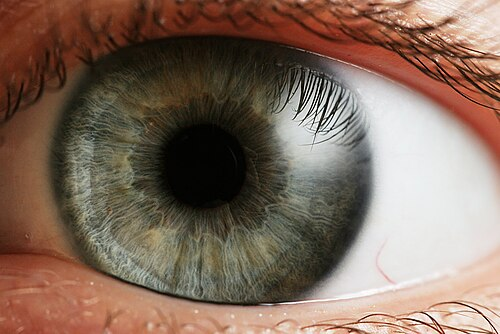

# SISTEMA EFERENTE E PUPILA

Para entender pupila, você precisa esquecer a ideia de decorar tabelas e focar em uma única pergunta: o problema é para abrir ou para fechar? Quando você entende a mecânica por trás do movimento pupilar, as questões de neuroftalmologia deixam de ser um "chute" e passam a ser uma dedução lógica.

O sistema eferente pupilar é dividido em dois braços principais: o parassimpático (responsável pela miose) e o simpático (responsável pela midríase). Se a pupila não fecha bem, o defeito é parassimpático. Se ela não abre bem, o defeito é simpático. Parece simples, mas o segredo está em identificar onde, ao longo dessas vias complexas, a fiação entrou em curto-circuito.

*Figura 1 - Anatomia do olho humano. A pupila é controlada por dois músculos: esfíncter (parassimpático via III par → miose) e dilatador (simpático → midríase). A avaliação da anisocoria no claro e no escuro diferencia lesões parassimpáticas de simpáticas. Fonte: Rhcastilhos e Jmarchn, CC BY-SA 3.0 | Wikimedia Commons*

## Anatomia e Fisiologia da Via Eferente

A pupila não é apenas um buraco na íris, ela é o diafragma da câmera fotográfica humana. O controle desse diafragma depende de um equilíbrio constante entre duas forças opostas.

### A Via Parassimpática (O Caminho da Miose)

Esta é a via que faz a pupila "apertar". Ela começa no mesencéfalo, especificamente no núcleo de Edinger-Westphal. As fibras pré-ganglionares pegam "carona" com o III par craniano (nervo oculomotor).

Aqui está o primeiro ponto de atenção para sua prova: as fibras pupilares do III par não estão espalhadas aleatoriamente. Elas se localizam na periferia do nervo, na sua porção mais superficial. Por que isso importa? Porque se houver uma compressão externa, como um aneurisma da artéria comunicante posterior, essas fibras serão as primeiras a sofrer. Se o problema for isquêmico (como no diabetes), o núcleo do nervo sofre, mas a periferia, muitas vezes, é poupada.

Após saírem do mesencéfalo, essas fibras viajam até o gânglio ciliar, localizado na órbita. Ali ocorre a sinapse. As fibras pós-ganglionares, agora chamadas de nervos ciliares curtos, seguem para o músculo esfíncter da íris e para o músculo ciliar (responsável pela acomodação).

### A Via Simpática (O Caminho da Midríase)

A via simpática é mais longa e, por isso, tem mais lugares para dar problema. Ela é composta por uma cadeia de três neurônios:

- **Neurônio de Primeira Ordem (Central):** Começa no hipotálamo posterior, desce pelo tronco cerebral e termina na medula espinhal, entre C8 e T2, no chamado Centro Ciliospinhal de Budge.

- **Neurônio de Segunda Ordem (Pré-ganglionar):** Sai da medula, passa pelo ápice do pulmão (cuidado com tumores aqui!) e sobe pelo pescoço, terminando no gânglio cervical superior, na base do crânio.

- **Neurônio de Terceira Ordem (Pós-ganglionar):** Sai do gânglio cervical superior, sobe junto com a artéria carótida interna, passa pelo seio cavernoso e entra na órbita para inervar o músculo dilatador da íris e o músculo de Müller (que ajuda a levantar a pálpebra).

Muitos alunos erram questões de Síndrome de Horner por não lembrarem dessa anatomia. Se o paciente tem Horner e anidrose (falta de suor) na face, a lesão deve ser antes da bifurcação da carótida, pois as fibras do suor seguem a carótida externa. Se o suor está preservado, a lesão costuma ser pós-ganglionar.

## Avaliação Clínica da Anisocoria

Anisocoria é a diferença de tamanho entre as pupilas. O seu primeiro passo diante de um paciente com pupilas desiguais é determinar qual é a pupila doente.

### O Teste da Luz e do Escuro

Para saber qual pupila está com defeito, você deve observar a anisocoria em duas condições de iluminação.

Se a anisocoria aumenta no claro, a pupila maior é a doente. Por quê? Porque no claro, ambas deveriam fechar. Se uma não fecha (fica grande), o sistema parassimpático dela falhou.

Se a anisocoria aumenta no escuro, a pupila menor é a doente. Por quê? Porque no escuro, ambas deveriam abrir. Se uma não abre (fica pequena), o sistema simpático dela falhou.

**Tabela 1: Diagnóstico Inicial da Anisocoria**

| Condição | Pupila Doente | Sistema Comprometido | Principais Suspeitas |
| --- | --- | --- | --- |
| Anisocoria maior no CLARO | A maior (Midríase) | Parassimpático | Paralisia do III par, Adie, Trauma, Drogas |
| Anisocoria maior no ESCURO | A menor (Miose) | Simpático | Síndrome de Horner |
| Anisocoria IGUAL (claro/escuro) | Nenhuma (ou ambas) | Fisiológico | Anisocoria Fisiológica |

Cuidado: a anisocoria fisiológica ocorre em cerca de 20% da população. A diferença é geralmente menor que 1mm e a resposta à luz é normal em ambos os olhos. Em provas, a banca vai tentar te confundir colocando uma diferença pequena e perguntando a conduta. Se a reatividade for normal, a conduta é apenas observação.

## Defeitos Parassimpáticos: A Pupila que não Fecha

Quando a pupila maior é a doente, entramos no campo das midríases paralíticas. Aqui, o diagnóstico diferencial é crítico, pois pode separar um caso de observação de uma emergência neurocirúrgica.

### Paralisia do III Par Craniano (Oculomotor)

Este é o "pesadelo" do plantonista. Uma paralisia do III par com envolvimento pupilar é uma emergência até que se prove o contrário.

O quadro clínico clássico inclui ptose palpebral, olho desviado para baixo e para fora ("down and out") e uma pupila dilatada e pouco reagente.

Por que a pupila é o divisor de águas? Como mencionei antes, as fibras pupilares são superficiais. Um aneurisma da artéria comunicante posterior comprime o nervo de fora para dentro, pegando a pupila logo de cara. Já uma mononeuropatia isquêmica (comum no diabetes e hipertensão) afeta o centro do nervo, poupando a pupila em cerca de 80% dos casos.

**Dica de Prova:** Se a questão descreve um paciente idoso, diabético, com paralisia do III par mas pupila normal (isocórica e reagente), a causa provável é isquemia microvascular. Se houver dor intensa e a pupila estiver dilatada, pense imediatamente em Aneurisma de Comunicante Posterior. No MedEvo, sempre dizemos: "Pupila dilatada no III par? Mande para a Angio-TC/Angio-RM".

### Pupila Tônica de Adie

Imagine uma paciente jovem, mulher, que nota por acaso no espelho que uma pupila está maior que a outra. Ela não tem dor, não tem ptose. Ao exame, a pupila é grande e reage muito mal à luz, mas, curiosamente, ela fecha devagar quando o paciente olha para perto (dissociação luz-perto).

A fisiopatologia aqui é uma denervação do gânglio ciliar, geralmente após uma infecção viral banal. Com o tempo, ocorre uma regeneração aberrante das fibras que iriam para o músculo ciliar (foco) para o esfíncter da íris.

O diagnóstico é confirmado com o teste da Pilocarpina diluída (0,125%). Uma pupila normal não reage a essa concentração tão baixa. A pupila de Adie, por estar "faminta" por estímulo (hipersensibilidade por denervação), vai contrair vigorosamente.

### Midríase Farmacológica

Muitos erros médicos ocorrem por esquecer desta causa. O paciente (ou profissional de saúde) toca em alguma substância midriática (atropina, escopolamina, colírios para exame) e leva a mão ao olho.

Diferente da paralisia do III par ou da pupila de Adie, a midríase farmacológica é "congelada". Ela não responde a nada, nem mesmo à Pilocarpina 1%. Este é o teste definitivo: se você pingar Pilocarpina 1% e a pupila não fechar, o receptor está bloqueado quimicamente. Nenhuma lesão neurológica impede a Pilocarpina de agir diretamente no músculo.

*Figura 2 - A Síndrome de Horner (miose + ptose parcial + anidrose) resulta de lesão na via simpática em três neurônios. O teste com colírio de cocaína 4% confirma o Horner; apraclonidina 0,5% é alternativa prática. Hidroxianfetamina diferencia pré-ganglionar de pós-ganglionar. Fonte: CC BY-SA 3.0, Wikimedia Commons*

## Defeitos Simpáticos: A Pupila que não Abre

Quando a pupila menor é a doente, estamos diante da Síndrome de Horner. O desafio aqui é localizar a lesão ao longo daquela via de três neurônios.

### Síndrome de Horner

A tríade clássica é: Miose, Ptose (leve, de 1-2mm) e Anidrose.

A ptose ocorre porque o músculo de Müller, que é simpático, perde sua força. É uma ptose "falsa", pois o elevador da pálpebra (III par) está normal. Além disso, pode haver uma "ptose invertida" da pálpebra inferior, que sobe levemente.

**Etiologias por Neurônio:**

- **1º Neurônio (Central):** AVC de tronco (Síndrome de Wallenberg), tumores medulares, esclerose múltipla.

- **2º Neurônio (Pré-ganglionar):** Tumor de Pancoast (ápice do pulmão), trauma cervical, cirurgias de tórax.

- **3º Neurônio (Pós-ganglionar):** Dissecção de artéria carótida, cefaleia em salvas, tumores no seio cavernoso.

**Atenção:** Horner associado a dor cervical ou dor de cabeça súbita é Dissecção de Carótida até que se prove o contrário. É uma emergência médica!

### Testes Farmacológicos no Horner

Para confirmar o diagnóstico e localizar a lesão, usamos colírios específicos.

- **Apraclonidina 0,5% ou 1%:** É o teste de triagem atual. Em um olho normal, ela causa uma leve midríase ou nada. No olho com Horner, ocorre uma midríase óbvia (novamente, a hipersensibilidade por denervação). Se a anisocoria reverter (a pupila menor ficar maior que a outra), o diagnóstico de Horner está confirmado.

- **Cocaína 4% ou 10%:** Era o padrão-ouro antigo. A cocaína impede a recaptação de noradrenalina. Se não há noradrenalina sendo liberada (como no Horner), a pupila não dilata. Se a anisocoria aumentar após a cocaína, é Horner. (Pouco usada hoje devido à burocracia do fármaco).

- **Hidroxianfetamina 1%:** Usada para localizar a lesão. Ela estimula a liberação de noradrenalina do neurônio de 3ª ordem. Se a pupila dilatar, o 3º neurônio está íntegro (lesão é no 1º ou 2º). Se não dilatar, a lesão é no 3º neurônio (pós-ganglionar).

**Tabela 2: Diagnóstico Diferencial das Anisocorias (Resumo de Conduta)**

| Suspeita Clínica | Teste Farmacológico | Resultado Esperado |
| --- | --- | --- |
| **Adie** | Pilocarpina 0,125% | Pupila doente contrai (Hipersensibilidade) |
| **Horner** | Apraclonidina 0,5% | Pupila doente dilata (Reversão da anisocoria) |
| **III Par** | Pilocarpina 1% | Pupila contrai normalmente |
| **Farmacológica** | Pilocarpina 1% | Pupila NÃO contrai (Receptor bloqueado) |

## Outras Alterações Pupilares Importantes

Nem toda alteração pupilar se resume a uma pupila maior que a outra. Algumas vezes, o problema está na forma como elas reagem a estímulos específicos.

### Pupila de Argyll Robertson

Um clássico da medicina e das provas de residência. É a pupila da Neurossífilis.
As pupilas são pequenas, irregulares e apresentam a clássica dissociação luz-perto: elas não reagem à luz, mas reagem (e bem!) à acomodação (perto). A lesão acredita-se estar no teto do mesencéfalo, afetando as fibras que vêm da retina para o núcleo de Edinger-Westphal, mas poupando as fibras da via de perto que chegam de forma mais ventral.

### Defeito Pupilar Aferente Relativo (DPAR ou Pupila de Marcus Gunn)

Embora este material foque no sistema eferente, você não pode ir para a prova sem saber diferenciar um defeito eferente de um aferente.

No DPAR, as pupilas são de tamanhos iguais (isocóricas) no repouso. O problema é a "fiação de entrada" (nervo óptico ou retina extensa). Ao iluminar o olho doente, ambas as pupilas contraem menos do que quando iluminamos o olho saudável. No teste da luz alternada (swinging flashlight test), a pupila do olho doente parece dilatar quando a luz sai do olho bom e entra nele.

**Erro comum:** Achar que DPAR causa anisocoria. Repita comigo: DPAR NÃO CAUSA ANISOCORIA. Se houver anisocoria, o defeito é eferente (motor). Se as pupilas são iguais mas reagem mal, o defeito é aferente (sensorial).

## Casos Clínicos para Fixação

### Caso 1: A Emergência Silenciosa

Paciente masculino, 55 anos, hipertenso, chega com queixa de visão dupla. Ao exame: ptose total à direita, olho direito desviado para fora e para baixo. Pupila direita com 6mm, não reagente à luz. Pupila esquerda com 3mm, reagente.

- **Análise:** Temos uma paralisia de III par com envolvimento pupilar (anisocoria maior no claro).

- **Por que não é diabetes?** Porque a pupila está dilatada. No diabetes, a pupila costuma ser poupada.

- **Conduta:** Encaminhamento imediato para neuroimagem (Angio-TC) para excluir aneurisma de artéria comunicante posterior.

### Caso 2: O Achado de Consultório

Paciente feminina, 28 anos, vem para exame de rotina. Você nota pupila esquerda de 5mm e direita de 3mm. A pupila esquerda reage muito pouco à luz. Ao colocar o optotipo de perto, a pupila esquerda contrai lentamente após alguns segundos.

- **Análise:** Anisocoria maior no claro, com dissociação luz-perto.

- **Teste:** Pinga-se Pilocarpina 0,125%. A pupila esquerda vai para 2mm.

- **Diagnóstico:** Pupila Tônica de Adie.

- **Conduta:** Tranquilizar a paciente. É uma condição benigna.

### Caso 3: A Dor que Preocupa

Paciente, 40 anos, refere dor súbita no lado esquerdo do pescoço após esforço físico, seguida de "pálpebra caída". Ao exame: ptose de 1,5mm à esquerda, pupila esquerda de 2mm e direita de 4mm no escuro. No claro, a diferença diminui.

- **Análise:** Anisocoria que aumenta no escuro = Defeito Simpático (Horner).

- **Contexto:** Dor cervical + Horner = Dissecção de Carótida.

- **Conduta:** Emergência. Angio-TC ou Angio-RM de pescoço e crânio.

## Diagnóstico Diferencial e Armadilhas

Ao avaliar um paciente com pupila, o Dr. Will sempre recomenda: "Olhe para o paciente como um todo, não apenas para o buraco da íris".

### Anisocoria Fisiológica vs. Horner

Muitas vezes, uma anisocoria pequena no escuro pode ser apenas fisiológica. Como diferenciar? No Horner, existe um "atraso de dilatação" (dilation lag). Quando você apaga a luz, a pupila normal dilata imediatamente. A pupila de Horner leva 15 a 20 segundos para atingir seu tamanho máximo (que ainda será menor que a outra). Na anisocoria fisiológica, ambas dilatam na mesma velocidade.

### O Trauma Ocular (Pupila Traumática)

Um trauma contuso pode causar uma midríase traumática por ruptura do esfíncter da íris. Como diferenciar de um III par? No exame na lâmpada de fenda, você verá irregularidades na borda pupilar, transiluminação da íris ou até mesmo hifema. A pupila traumática também não responde bem à Pilocarpina se o músculo estiver rasgado.

### Tabela 3: Causas de Dissociação Luz-Perto

| Condição | Características |
| --- | --- |
| **Pupila de Adie** | Unilateral, pupila dilatada, hipersensibilidade à pilocarpina diluída. |
| **Argyll Robertson** | Bilateral, pupilas pequenas e irregulares, associada à sífilis. |
| **Síndrome de Parinaud** | Lesão dorsal do mesencéfalo, paralisia do olhar vertical superior, nistagmo de retração. |
| **Regeneração Aberrante do III Par** | Após trauma ou compressão, a pupila contrai ao tentar aduzir ou olhar para baixo. |

## Tratamento e Condutas

O tratamento do sistema eferente pupilar é, na verdade, o tratamento da causa base. Não tratamos a pupila em si, mas o que a está causando.

- **Paralisia do III Par Aneurismática:** Cirurgia ou embolização endovascular urgente pelo neurocirurgião.

- **Paralisia do III Par Isquêmica:** Controle rigoroso da glicemia (HbA1c < 7%) e da pressão arterial (< 130/80 mmHg). Geralmente regride em 3 a 4 meses.

- **Síndrome de Horner por Dissecção:** Anticoagulação ou antiagregação plaquetária, conforme protocolo da neurologia, para evitar AVC embólico.

- **Pupila de Adie:** Não requer tratamento. Se a queixa for fotofobia, óculos escuros ou pilocarpina muito diluída para fins estéticos podem ser usados.

- **Neurossífilis:** Penicilina G Cristalina 18-24 milhões de UI/dia, IV, dividida em doses a cada 4 horas, por 10 a 14 dias.

## Resumo da Investigação Diagnóstica

Diante de uma anisocoria, o fluxo de pensamento deve ser:

-

**Onde a diferença é maior?**

- No claro -> Problema na pupila maior (Parassimpático).

- No escuro -> Problema na pupila menor (Simpático).

-

**Se for na pupila maior (Midríase):**

- Tem ptose e desvio ocular? -> III Par (Pedir Imagem!).

- Pupila tônica e dissociação luz-perto? -> Teste da Pilocarpina 0,125% (Adie).

- Pupila "congelada" e sem outros sinais? -> Teste da Pilocarpina 1% (Se não contrair, é Farmacológica).

-

**Se for na pupila menor (Miose):**

- Tem ptose leve e anidrose? -> Horner.

- Tem dor cervical? -> Dissecção de Carótida (Emergência!).

- Localizar com Apraclonidina e Hidroxianfetamina se necessário.

Lembre-se que na residência e nas provas, a precisão técnica é o que te diferencia. Não diga apenas "a pupila está dilatada", diga "há uma midríase paralítica com evidência de comprometimento da via eferente parassimpática". Isso demonstra domínio do tema.

## Pontos-Chave para Prova

- **Anisocoria maior no CLARO:** Defeito parassimpático (pupila maior é a doente).

- **Anisocoria maior no ESCURO:** Defeito simpático (pupila menor é a doente).

- **Paralisia do III Par com pupila dilatada:** Emergência! Suspeitar de Aneurisma de Comunicante Posterior.

- **Paralisia do III Par com pupila poupada:** Geralmente isquêmica (Diabetes/HAS).

- **Síndrome de Horner:** Miose + Ptose leve + Anidrose.

- **Horner + Dor Cervical:** Suspeitar de Dissecção de Artéria Carótida.

- **Pupila de Adie:** Hipersensibilidade à Pilocarpina diluída (0,125%).

- **Midríase Farmacológica:** Não contrai nem com Pilocarpina 1%.

- **Argyll Robertson:** Pupilas pequenas que não reagem à luz, mas reagem ao perto (Neurossífilis).

- **DPAR (Marcus Gunn):** Não causa anisocoria. É um defeito da via aferente (nervo óptico).

- **Apraclonidina no Horner:** Causa midríase na pupila doente (reverte a anisocoria).

- **Cocaína no Horner:** Aumenta a anisocoria (a pupila doente não dilata).

- **Hidroxianfetamina:** Diferencia lesão pré-ganglionar (dilata) de pós-ganglionar (não dilata) no Horner.

- **Músculo de Müller:** Inervado pelo simpático, sua paralisia causa a ptose do Horner.

- **Fibras pupilares no III Par:** Localizam-se na periferia do nervo, por isso são sensíveis à compressão externa.

- **Anisocoria Fisiológica:** Diferença geralmente < 1mm, reatividade normal, presente em 20% das pessoas.

- **Dissociação Luz-Perto:** Pupila reage melhor ao estímulo de acomodação do que à luz (Adie, Argyll Robertson, Parinaud).

- **O que NÃO fazer:** Nunca ignore uma midríase súbita acompanhada de cefaleia; nunca diagnostique Horner sem testar a motilidade ocular para excluir III par associado (seio cavernoso). 💡

 Cópia offline para consulta pessoal.
 Fonte original:
 [https://www.medevo.com.br/material-apoio/ler/b35325b4-cd46-4711-a89a-5dad587ccb08](https://www.medevo.com.br/material-apoio/ler/b35325b4-cd46-4711-a89a-5dad587ccb08)
