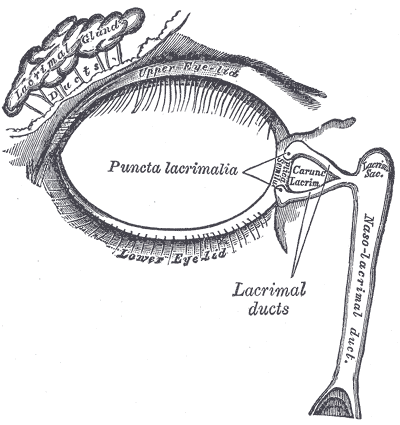

# SISTEMA LACRIMAL EXCRETOR

Para entender as doenças das vias lacrimais, você precisa primeiro visualizar o caminho que a lágrima percorre. Não adianta decorar nomes de válvulas se você não entende a dinâmica do escoamento. O sistema lacrimal não é apenas um "ralo" passivo, ele é uma bomba ativa. Se essa bomba falha ou se o cano entope, o paciente chega ao seu consultório com a queixa clássica: "Doutor, meu olho vive cheio d'água".

*Figura 1 - Anatomia do olho. O sistema lacrimal excretor compreende: pontos lacrimais → canalículos (superior e inferior) → canalículo comum → saco lacrimal (fossa lacrimal do osso lacrimal) → ducto nasolacrimal → meato inferior nasal. A válvula de Hasner marca a abertura distal. Fonte: Rhcastilhos e Jmarchn, CC BY-SA 3.0 | Wikimedia Commons*

## Anatomia Aplicada: O Caminho da Lágrima

O sistema excretor começa nos pontos lacrimais. Temos um superior e um inferior, localizados na papila lacrimal, na margem palpebral posterior. Um detalhe que as bancas de residência adoram: o ponto inferior é ligeiramente mais lateral que o superior e é responsável por cerca de 70% a 80% da drenagem. Por isso, se um paciente tem lacrimejamento e você só pode salvar um canalículo, salve o inferior.

Após o ponto lacrimal, entramos nos canalículos. Eles possuem uma porção vertical inicial (cerca de 2 mm) e depois dobram-se para uma porção horizontal (8 mm). Em 90% das pessoas, os canalículos superior e inferior se unem para formar o canalículo comum antes de desembocar no saco lacrimal.

O saco lacrimal repousa na fossa lacrimal, entre as cristas lacrimais anterior e posterior. Ele tem cerca de 12 a 15 mm de altura. O que você precisa levar para a vida prática e para a prova: o tendão cantal medial abraça o saco lacrimal. Se você encontrar uma massa endurecida ACIMA do tendão cantal medial, desconfie imediatamente de tumores. A dacriocistite inflamatória geralmente se manifesta ABAIXO do tendão.

Por fim, temos o ducto nasolacrimal (18 mm), que desce pelo canal ósseo e desemboca no meato inferior do nariz. É aqui que encontramos a famosa Válvula de Hasner. Ela não é uma válvula real com folhetos, mas uma prega mucosa. Na criança, a falha na canalização dessa "válvula" é a causa número um de obstrução congênita.

## Fisiologia: A Bomba Lacrimal de Jones

Por que piscamos? Além de lubrificar o olho, o piscar é o motor da drenagem. Aqui no MedEvo, sempre reforçamos que a anatomia dita a função. Quando você fecha o olho, a porção pré-septal e pré-tarsal do músculo orbicular se contrai.

Essa contração faz três coisas simultâneas:

- Comprime os canalículos, empurrando a lágrima para frente.

- Cria uma pressão negativa no saco lacrimal (ele se expande), "sugando" a lágrima dos canalículos.

- Quando o olho abre, o músculo relaxa, o saco lacrimal colapsa e empurra a lágrima para baixo, em direção ao ducto nasolacrimal.

Se o paciente tem uma paralisia facial (Paralisia de Bell), ele terá epífora. Por quê? Não porque o canal está entupido, mas porque a bomba (músculo orbicular) parou de funcionar. Isso é o que chamamos de obstrução funcional.

## Avaliação Clínica e Diagnóstico

Antes de tocar no paciente, você precisa diferenciar dois termos que muitos alunos confundem:

**Tabela 1: Diferenciação Clínica Inicial**

| Termo | Definição | Causa Principal |
| --- | --- | --- |
| **Lacrimejamento** | Excesso de produção de lágrima | Irritação ocular, ceratite, corpo estranho, glaucoma congênito |
| **Epífora** | Deficiência no escoamento da lágrima | Obstrução anatômica ou falha na bomba lacrimal |

### Exame Físico Passo a Passo

O exame deve ser sistemático. Comece pela inspeção. Procure por ectrópio (ponto lacrimal para fora), entrópio ou triquíase. Às vezes, o problema não é a via lacrimal, mas o posicionamento da pálpebra que não deixa a lágrima chegar ao ponto lacrimal.

**1. Teste de Desaparecimento da Fluoresceína (Teste de Milder):**
Instile uma gota de fluoresceína a 2% no fórnice conjuntival. Aguarde 5 minutos.

- **Normal:** A fluoresceína deve desaparecer ou restar apenas um menisco fino.

- **Alterado:** Se houver retenção do corante, há um problema na drenagem (seja obstrutivo ou funcional). É um teste de alta sensibilidade, mas não diz ONDE está o problema.

**2. Teste de Jones I (Fisiológico):**
Você coloca fluoresceína no olho e um algodão embebido em anestésico no meato inferior do nariz.

- **Positivo:** O algodão sai sujo de verde. Ótimo! A via está pérvia e a bomba funciona.

- **Negativo:** O algodão sai limpo. Existe uma obstrução ou falha na bomba. Partimos para o Jones II.

**3. Teste de Jones II (Mecânico/Irrigação):**
Aqui você força a passagem. Lava a fluoresceína do olho, anestesia o ponto lacrimal, dilata-o e irriga com soro fisiológico usando uma cânula.

- **Positivo:** O paciente sente o gosto do soro ou você recupera soro com fluoresceína no nariz. Isso significa que a via é anatomicamente aberta, mas funcionalmente falha (a bomba de Jones não estava dando conta, mas sua seringa deu).

- **Negativo:** O soro não passa ou reflui pelo ponto oposto. Temos uma obstrução anatômica.

**Tabela 2: Interpretando os Testes de Jones**

| Resultado | Significado Clínico | Conduta Provável |
| --- | --- | --- |
| **Jones I Positivo** | Via normal | Investigar causas de hipersecreção |
| **Jones I Negativo / Jones II Positivo** | Obstrução funcional (bomba falha) ou estenose parcial | Observação ou correção de pálpebra |
| **Jones I Negativo / Jones II Negativo** | Obstrução anatômica completa | Cirurgia (DCR ou CDCR) |

### O Teste da Irrigação (Sondagem Diagnóstica)

Ao introduzir a cânula, você sentirá uma resistência.

- **Hard Stop (Parada Dura):** A cânula bate no osso (parede medial do saco lacrimal). Isso indica que os canalículos estão pérvios. A obstrução é baixa (no ducto nasolacrimal).

- **Soft Stop (Parada Macia):** A cânula comprime tecidos moles contra o canalículo comum. A obstrução é alta (canalicular).

Cuidado: Nunca force a sondagem se sentir resistência macia, você pode criar um falso trajeto e transformar uma estenose simples em uma fibrose incurável.

## Obstrução Congênita do Ducto Nasolacrimal (OCDNL)

Este é o tema que mais cai em provas de pediatria e oftalmologia. A causa é a persistência de uma membrana na Válvula de Hasner. Cerca de 50% dos recém-nascidos têm essa membrana, mas a maioria rompe espontaneamente no primeiro mês de vida.

**Quadro Clínico:**
A criança apresenta epífora e secreção mucopurulenta desde as primeiras semanas de vida. O olho está calmo (branco), o que diferencia de uma conjuntivite infecciosa ou glaucoma congênito. Ao pressionar a região do saco lacrimal, pode haver refluxo de secreção pelo ponto lacrimal (sinal do refluxo positivo).

**Manejo Segundo a Diretriz Brasileira:**
A conduta inicial é SEMPRE conservadora até os 7 a 12 meses de idade. Por que esperar? Porque a taxa de cura espontânea chega a 90% no primeiro ano.

- **Massagem de Crigler:** O pai/mãe deve colocar o dedo indicador sobre o tendão cantal medial (bloqueando o canalículo comum) e deslizar com pressão firme para baixo. O objetivo é aumentar a pressão hidrostática dentro do saco lacrimal para "estourar" a membrana de Hasner.

- **Higiene:** Limpeza da secreção com soro fisiológico.

- **Antibióticos Tópicos:** Usar apenas se houver conjuntivite secundária importante (olho vermelho e muita secreção). Não usar de forma crônica para evitar resistência.

**Quando intervir?**
Se após os 10-12 meses a obstrução persistir, indicamos a **Sondagem das Vias Lacrimais**.

- Sucesso da primeira sondagem: >90% se feita na idade certa.

- Se falhar: Pode-se repetir a sondagem, realizar intubação com silicone ou dacrioplastia com balão.

- Dacriocistorrinostomia (DCR): Reservada para casos refratários, geralmente após os 3-4 anos de idade.

**Dica de Prova:** Se a questão descreve um recém-nascido com epífora, fotofobia e aumento do diâmetro da córnea (buftalmia), o diagnóstico NÃO é obstrução de via lacrimal, é Glaucoma Congênito. Errar isso na prova é "pecado capital".

## Dacriocistite: As Infecções do Saco Lacrimal

A dacriocistite é a inflamação e infecção do saco lacrimal, quase sempre secundária a uma obstrução do ducto nasolacrimal. Onde a água para, o bicho cresce.

### Dacriocistite Aguda

O paciente chega com dor intensa, edema, calor e rubor na região do canto medial, abaixo do tendão cantal. Pode haver abscesso e fístula cutânea.

- **Etiologia:** *Staphylococcus aureus* e *Streptococcus* são os mais comuns.

- **Tratamento:**

- Antibioticoterapia sistêmica (Cefalexina 500mg 6/6h ou Amoxicilina/Clavulanato 875/125mg 12/12h).

- Compressas mornas.

- **CONTRAINDICAÇÃO ABSOLUTA:** Nunca tente sondar ou irrigar a via lacrimal durante a fase aguda. Você pode disseminar a infecção para a órbita, causando uma celulite orbitária (emergência médica).

- Se houver abscesso flutuante: Drenagem externa pode ser necessária, embora aumente o risco de fístula permanente.

### Dacriocistite Crônica

Manifesta-se apenas como epífora persistente e refluxo de secreção ao pressionar o saco lacrimal. O tratamento definitivo é cirúrgico (DCR).

### Dacriocistocele Congênita

É uma variante rara e urgente no recém-nascido. Ocorre uma obstrução alta (Válvula de Rosenmüller) e uma baixa (Válvula de Hasner), aprisionando líquido e distendendo o saco lacrimal. Aparece como uma massa azulada no canto medial ao nascimento.

- **Risco:** Pode infectar (dacriocistite aguda neonatal) ou causar desconforto respiratório (recém-nascidos são respiradores nasais exclusivos e a massa pode protruir para o nariz).

- **Conduta:** Massagem inicial, mas se não resolver rápido ou se houver sinal de infecção/angústia respiratória, a sondagem deve ser imediata.

## Obstruções Adquiridas no Adulto

No adulto, a causa mais comum de obstrução é a **Dacriocistoestenose Involucional**. É um processo de fibrose idiopática que ocorre mais em mulheres pós-menopausa (provavelmente por fatores hormonais e canal ósseo mais estreito).

Outras causas importantes:

- **Trauma:** Fraturas de face (Le Fort II e III) que atingem o canal nasolacrimal.

- **Dacriolitos:** "Pedras" de cálcio ou debris de fungos (*Actinomyces israelii*) dentro do saco lacrimal.

- **Fármacos:** O uso crônico de colírios para glaucoma (especialmente pilocarpina e epinefrina) ou quimioterápicos sistêmicos (5-Fluorouracil e Docetaxel) pode causar estenose canalicular.

**Tabela 3: Localização da Obstrução e Conduta**

| Local da Obstrução | Nome Técnico | Cirurgia de Escolha |
| --- | --- | --- |
| **Ponto Lacrimal** | Estenose de Ponto | Puntoplastia (em 2 ou 3 snippets) |
| **Canalículo** | Obstrução Canalicular | Conjuntivodacriocistorrinostomia (CDCR) com Tubo de Jones |
| **Ducto Nasolacrimal** | Obstrução Baixa | Dacriocistorrinostomia (DCR) |

*Figura 2 - A Dacriocistorrinostomia (DCR) é o tratamento definitivo da obstrução adquirida do ducto nasolacrimal no adulto: cria uma anastomose entre o saco lacrimal e a mucosa nasal (meato médio). Pode ser externa ou endonasal. Fonte: Domínio Público | Wikimedia Commons*

## Tratamento Cirúrgico: A Dacriocistorrinostomia (DCR)

A DCR consiste em criar uma nova via de passagem da lágrima do saco lacrimal diretamente para a cavidade nasal (meato médio), "pulando" o ducto nasolacrimal obstruído. Para isso, fazemos uma osteotomia (janela óssea).

Existem duas vias principais:

-

**DCR Externa:**

- Padrão-ouro histórico (sucesso >90%).

- Feita através de uma incisão na pele de cerca de 10-15 mm.

- Vantagem: Melhor visualização da anatomia e facilidade em suturar os retalhos de mucosa.

- Desvantagem: Cicatriz cutânea (embora geralmente discreta) e risco de lesar a bomba lacrimal se a dissecção for agressiva.

-

**DCR Endonasal (Endoscópica):**

- Feita por dentro do nariz com auxílio de endoscópio.

- Vantagem: Sem cicatriz externa, recuperação mais rápida, ideal para pacientes com distúrbios de coagulação.

- Desvantagem: Curva de aprendizado maior, equipamento caro.

- Taxas de sucesso hoje são comparáveis à externa em mãos experientes.

**O Tubo de Jones (CDCR):**
Cuidado para não confundir com os Testes de Jones. O Tubo de Jones é uma prótese de vidro (pirex) usada quando o paciente NÃO tem mais canalículos funcionais. Ele liga o lago lacrimal (canto do olho) diretamente ao nariz. É a última opção, pois o tubo pode deslocar, entupir ou causar irritação crônica.

## Canaliculite: A "Pegadinha" do Diagnóstico

Muitos alunos confundem canaliculite com dacriocistite ou conjuntivite crônica.
A canaliculite é uma infecção do canalículo, geralmente causada por *Actinomyces israelii* (uma bactéria anaeróbia que se comporta como fungo).

**Sinais Clínicos:**

- Epífora e secreção.

- "Ponto lacrimal em brasa" (eritematoso e evertido).

- Presença de concreções amareladas (grânulos de enxofre) que saem ao espremer o canalículo.

**Tratamento:**
Não adianta apenas dar colírio de antibiótico. O tratamento definitivo exige a curetagem do canalículo (canaliculotomia) para remover todos os cálculos/grânulos, associada à irrigação com penicilina G ou uso de antibióticos sistêmicos. Como diz o Dr. Will, "se tem pedra no cano, não adianta só jogar cloro; tem que tirar a pedra".

## Diagnóstico Diferencial de Massas no Canto Medial

Este é um ponto crítico para evitar iatrogenias graves. Nem tudo que incha no canto medial é dacriocistite.

- **Tumores de Saco Lacrimal:** Suspeite se a massa for indolor, endurecida, se houver sangramento pelo ponto lacrimal ou se a massa se estender acima do tendão cantal medial. O papiloma é o tumor benigno mais comum, e o carcinoma de células escamosas é o maligno mais frequente.

- **Mucocele de Seio Etmoidal:** Pode deslocar o globo ocular lateralmente e causar abaulamento no canto medial.

- **Encéfalocele:** Em crianças, uma massa pulsátil que aumenta de tamanho quando a criança chora (Manobra de Valsalva). Nunca puncione uma massa no canto medial de uma criança sem antes pedir uma imagem (TC ou RM)!

**Tabela 4: Resumo de Condutas na OCDNL**

| Idade do Paciente | Conduta Recomendada |
| --- | --- |
| **0 a 10 meses** | Massagem de Crigler + Higiene |
| **10 a 18 meses** | Sondagem de Via Lacrimal (1ª escolha) |
| **Refratários à 1ª sondagem** | Nova sondagem com Intubação de Silicone |
| **Acima de 3-4 anos** | Dacriocistorrinostomia (DCR) |

## Situações Especiais e Complicações

### Idosos

No idoso, a epífora é multifatorial. Antes de indicar uma cirurgia de via lacrimal, verifique a superfície ocular. O olho seco paradoxal (reflexo de lacrimejamento por má qualidade da lágrima) é muito comum. Se você operar a via lacrimal de um paciente que tem lacrimejamento por olho seco, ele continuará lacrimejando e ficará insatisfeito.

### Gestantes

A dacriocistite aguda na gestante deve ser tratada com antibióticos seguros (Penicilinas ou Cefalosporinas). Evite exames radiológicos como a dacriocistografia, a menos que seja estritamente necessário. A cirurgia definitiva (DCR) deve ser adiada para o pós-parto, se possível.

### Complicações Pós-Operatórias da DCR

- **Hemorragia (Epistaxe):** A complicação mais comum. Ocorre pela rica vascularização da mucosa nasal (artéria esfenopalatina).

- **Fechamento do Osteoma:** A causa mais comum de insucesso. O corpo cicatriza a janela óssea que você criou. O uso de Mitomicina C intraoperatória pode ser considerado para reduzir essa fibrose.

- **Infecção da ferida operatória.**

## Pontos-Chave para Prova

- **Ponto Lacrimal Inferior:** Responsável pela maior parte da drenagem (70-80%).

- **Válvula de Hasner:** Local da obstrução na OCDNL (causa mais comum de epífora em bebês).

- **Válvula de Rosenmüller:** Evita o refluxo do saco lacrimal para os canalículos. Se ela falha no Jones II, o soro volta pelo ponto oposto.

- **Teste de Milder:** Positivo se a fluoresceína persistir após 5 minutos. Indica falha na drenagem.

- **Jones I vs. Jones II:** Jones I avalia a via em condições fisiológicas. Jones II avalia a anatomia (irrigação).

- **Hard Stop:** Cânula bate no osso. Canalículos estão abertos. Obstrução é no ducto nasolacrimal.

- **Soft Stop:** Resistência elástica. Obstrução é no canalículo comum ou individual.

- **Massagem de Crigler:** Técnica correta envolve compressão do canalículo comum e deslizamento inferior para aumentar pressão hidrostática.

- **Dacriocistite Aguda:** **CONTRAINDICADO** sondar ou irrigar. Risco de celulite orbitária.

- **Massa acima do tendão cantal medial:** Sinal de alerta para neoplasia de saco lacrimal.

- **Canaliculite:** Suspeite se houver "ponto lacrimal em brasa" e secreção com grânulos amarelados (*Actinomyces*).

- **Dacriocistocele:** Massa azulada ao nascimento. Pode causar urgência respiratória em RN.

- **Tratamento da OCDNL:** Expectante até 10-12 meses. Sucesso da sondagem diminui conforme a idade aumenta (especialmente após os 2 anos).

- **DCR:** Cirurgia de escolha para obstruções baixas (ducto nasolacrimal).

- **Tubo de Jones:** Usado apenas em obstruções canaliculares completas (onde não há canalículo para drenar).

- **Epífora na Paralisia Facial:** Causada por falha na bomba lacrimal (músculo orbicular), não por obstrução anatômica. 💡

 Cópia offline para consulta pessoal.
 Fonte original:
 [https://www.medevo.com.br/material-apoio/ler/c5aceb43-fd84-4504-9680-6d2247fe7849](https://www.medevo.com.br/material-apoio/ler/c5aceb43-fd84-4504-9680-6d2247fe7849)
