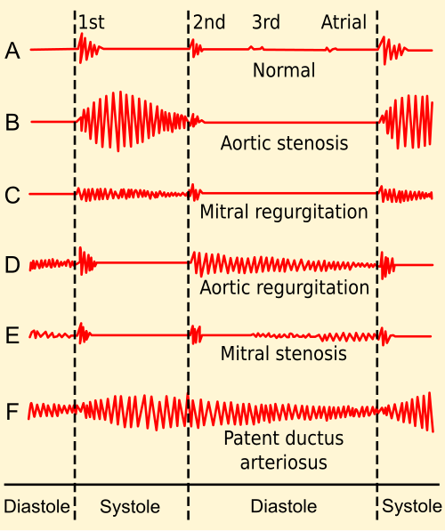
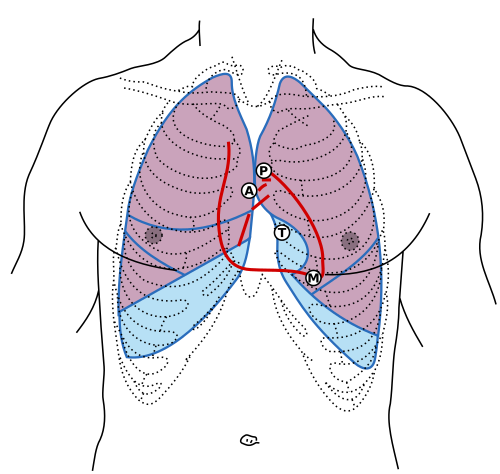

# SOPROS CARDÍACOS NA CRIANÇA

O sopro cardíaco é, sem dúvida, o motivo número um de encaminhamento ao cardiologista pediátrico. Para você, que está se preparando para a residência, o desafio não é apenas identificar o som, mas saber separar o "joio do trigo". A grande maioria dos sopros na infância é inocente, mas deixar passar uma cardiopatia congênita crítica pode ser catastrófico.

Neste material, vamos construir o raciocínio clínico que as bancas exigem. Não quero que você decore uma lista, quero que você entenda por que o sangue faz barulho e o que esse barulho nos diz sobre a anatomia do coração da criança.

*Figura 1 - Fonocardiogramas comparando sons cardíacos normais e anormais (sopros). A diferenciação entre sopro inocente (grau ≤ II/VI, nunca diastólico, assintomático) e patológico (grau ≥ III, frêmito, irradiação, sintomas associados) é fundamental na pediatria. Fonte: Madhero88, CC BY-SA 3.0 | Wikimedia Commons*

## A Gênese do Som: Por que o Coração Sopra?

O sopro nada mais é do que a tradução sonora da turbulência do fluxo sanguíneo. Em condições normais, o fluxo é laminar e silencioso. O sopro surge quando o sangue precisa passar por um orifício estreito, quando há um aumento súbito no volume de sangue (hiperfluxo) ou quando a viscosidade do sangue está alterada (como na anemia grave).

Nas crianças, a parede torácica é fina e o coração está muito próximo do estetoscópio. Isso explica por que ouvimos tantos sopros "fisiológicos" ou "inocentes". Como costumo dizer nas aulas do MedEvo, o ouvido do pediatra precisa ser treinado para o silêncio, pois qualquer ruído diferente vai chamar a atenção.

## Classificação e Semiótica: A Linguagem das Bancas

Para descrever um sopro com precisão, usamos a classificação de Levine, que divide a intensidade em seis graus. Isso cai muito em prova, então memorize a lógica:

- **Grau I/VI:** Muito suave, audível apenas com muito esforço e silêncio absoluto.

- **Grau II/VI:** Suave, mas facilmente audível assim que o estetoscópio encosta no tórax.

- **Grau III/VI:** Moderado, sem frêmito.

- **Grau IV/VI:** Intenso e **com frêmito palpável**. (Aqui está o divisor de águas: se tem frêmito, é Grau IV para cima e, quase certamente, patológico).

- **Grau V/VI:** Muito intenso, audível com apenas a borda do estetoscópio encostada.

- **Grau VI/VI:** Audível sem o estetoscópio encostar na pele.

Além da intensidade, você deve avaliar o ciclo cardíaco (sistólico, diastólico ou contínuo), o foco de maior audibilidade e a irradiação.

### Tabela 1: Diferenciação Clínica: Sopro Inocente vs. Patológico

| Característica | Sopro Inocente (Funcional) | Sopro Patológico |
| --- | --- | --- |
| **Sintomas** | Assintomático | Cianose, dispneia, baixo ganho ponderal |
| **Ciclo** | Sempre Sistólico (ejeção) | Sistólico, Diastólico ou Contínuo |
| **Intensidade** | Geralmente até II/VI | Frequentemente ≥ III/VI |
| **Frêmito** | Ausente | Pode estar presente (≥ IV/VI) |
| **Irradiação** | Localizado ou mínima | Irradia para dorso, axila ou pescoço |
| **Bulhas (B1 e B2)** | Normais | B2 desdobrada fixa ou hipofonética |
| **Cliques/Estalidos** | Ausentes | Podem estar presentes |
| **Mudança de Posição** | Muda ou desaparece | Geralmente não altera |

## Sopros Inocentes: O Cotidiano do Pediatra

Mais de 50% das crianças normais terão um sopro inocente em algum momento da infância, especialmente em estados hipercinéticos como febre, anemia ou após exercício físico. O Dr. Will sempre reforça: o sopro inocente é um achado de exame físico em uma criança hígida. Se a criança tem fácies sindrômica ou qualquer sintoma, o sopro deixa de ser inocente até prova em contrário.

### Sopro de Still

Este é o "rei" das provas de pediatria. É o sopro inocente mais comum, tipicamente ouvido entre os 2 e 7 anos de idade.

- **Características:** Sistólico, ejetivo, de baixa frequência.

- **O "Pulo do Gato":** O som é descrito como **vibratório ou musical**.

- **Localização:** Borda esternal esquerda média ou entre o foco mitral e o ápice.

- **Dinâmica:** Ele diminui de intensidade ou desaparece quando a criança senta ou fica em pé (ortostase), pois o retorno venoso diminui, reduzindo o volume de ejeção.

### Zumbido Venoso (Venous Hum)

É um sopro contínuo, mas não se engane: embora a maioria dos sopros contínuos seja patológica (como na PCA), o zumbido venoso é inocente.

- **Causa:** Turbulência do sangue nas veias jugulares e subclávias retornando para a veia cava superior.

- **Localização:** Região supraclavicular, geralmente à direita.

- **Manobra Diagnóstica:** Desaparece com a compressão da veia jugular ipsilateral ou com a rotação da cabeça da criança. Se o sopro some com uma manobra simples, ele não é intracardíaco.

### Sopro de Ejeção Pulmonar

Comum em adolescentes. É um sopro sistólico suave no foco pulmonar (2º espaço intercostal esquerdo). Diferencia-se da Comunicação Interatrial (CIA) porque na CIA a segunda bulha (B2) apresenta um desdobramento fixo, enquanto no sopro inocente o desdobramento de B2 é fisiológico (varia com a respiração).

*Figura 2 - O exame físico cardiovascular pediátrico inclui palpação de pulsos (femorais obrigatórios para excluir coarctação de aorta), ausculta dos 4 focos e avaliação de cianose. O Teste do Coraçãozinho (oximetria de pulso neonatal) é o rastreio universal. Fonte: Domínio Público | Wikimedia Commons*

## Cardiopatias Acianóticas: Os Sopros que Você Não Pode Perder

Aqui o sangue flui da esquerda para a direita (shunt esquerda-direita). O pulmão recebe mais sangue do que deveria (hiperfluxo pulmonar).

### Comunicação Interatrial (CIA)

Atenção: o sopro da CIA **não é causado pelo buraco no septo**. A diferença de pressão entre os átrios é pequena, então o fluxo pelo defeito é silencioso.

- **O Sopro Real:** É um sopro sistólico de ejeção no foco pulmonar, causado pelo hiperfluxo relativo na valva pulmonar.

- **A "Marca Registrada":** **Desdobramento fixo e constante da segunda bulha (B2)**. Isso cai em 90% das questões sobre CIA. O componente pulmonar de B2 (P2) está sempre atrasado devido ao excesso de sangue no ventrículo direito.

### Comunicação Interventricular (CIV)

É a cardiopatia congênita mais comum. Diferente da CIA, aqui o sopro é causado diretamente pelo orifício.

- **Características:** Sopro **holossistólico** (ocupa toda a sístole), áspero, mais audível na borda esternal esquerda baixa (4º espaço intercostal).

- **Paradoxo da CIV:** Quanto menor o buraco, mais barulhento é o sopro (maior gradiente de pressão). Uma CIV pequena (tipo Roger) produz um sopro intenso, mas tem pouca repercussão clínica. Já uma CIV grande pode ter um sopro mais suave e causar insuficiência cardíaca grave.

### Persistência do Canal Arterial (PCA)

O canal arterial liga a aorta à artéria pulmonar na vida fetal. Se não fecha após o nascimento, temos a PCA.

- **O Sopro Típico:** Sopro **contínuo**, em "maquinaria" ou locomotiva, mais audível na região infraclavicular esquerda.

- **Achados Associados:** Pulsos amplos (pediosos e radiais saltitantes) devido à "fuga" de sangue da aorta para a artéria pulmonar durante a diástole.

### Coarctação da Aorta

Muitas vezes o sopro é discreto, audível no dorso (região interescapular).

- **O Exame Físico Crucial:** Você DEVE palpar os pulsos femorais. Na coarctação, há um atraso ou diminuição dos pulsos em membros inferiores em relação aos superiores.

- **Dica de Prova:** Se a questão mencionar diferença de pressão arterial entre braços e pernas, marque Coarctação da Aorta sem medo.

## Cardiopatias Cianóticas: Onde o Sopro é Secundário

Nas cardiopatias cianóticas, como a Tetralogia de Fallot, o sopro geralmente vem da estenose pulmonar associada.

### Tetralogia de Fallot

Composta por: CIV, Estenose Pulmonar, Dextroposição da Aorta (cavalalgamento) e Hipertrofia de Ventrículo Direito.

- **O Sopro:** Sistólico de ejeção em foco pulmonar (devido à estenose).

- **Crise Hipoxêmica:** Quando a criança tem uma crise de cianose, o sopro **diminui ou desaparece**. Por quê? Porque o sangue para de passar pela artéria pulmonar e vai todo para a aorta através da CIV. Se o sopro sumiu e a criança ficou mais azul, a situação é grave.

## O Exame Físico Cardiovascular em Pediatria

Não se limite ao estetoscópio. O diagnóstico começa na inspeção.

- **Estado Geral:** A criança cansa para mamar? (Sinal de Insuficiência Cardíaca). Ela ganha peso adequadamente?

- **Cianose:** É central (língua e mucosas) ou periférica? Cianose que piora com o choro ou amamentação sugere cardiopatia congênita.

- **Precordial:** Procure por abaulamentos (sinal de cardiomegalia crônica) e palpe o ictus cordis. O frêmito deve ser pesquisado com a polpa digital ou a região palmar da mão.

- **Pulsos:** Sempre compare membros superiores e inferiores. Lembre-se: manguito pequeno dá PA falsamente alta; manguito grande dá PA falsamente baixa.

### Tabela 2: Diagnóstico Diferencial de Sopros Sistólicos

| Tipo de Sopro | Principal Suspeita | Localização Típica |
| --- | --- | --- |
| **Vibratório/Musical** | Sopro de Still (Inocente) | Borda Esternal Esquerda Média |
| **Holossistólico Áspero** | CIV | Borda Esternal Esquerda Baixa |
| **Ejetivo + B2 Desdobrada Fixa** | CIA | Foco Pulmonar |
| **Ejetivo + Click Sistólico** | Estenose Pulmonar ou Aórtica | Foco Pulmonar ou Aórtico |
| **Sopro em Jato de Vapor** | Insuficiência Mitral | Ápice (irradia para axila) |

## Teste do Coraçãozinho (Oximetria de Pulso Neonatal)

Este é um tema quente para provas de acesso direto. É uma triagem para cardiopatias congênitas críticas (aquelas que dependem do canal arterial).

- **Quando fazer:** Entre 24 e 48 horas de vida, antes da alta hospitalar.

- **Onde medir:** Membro Superior Direito (pré-ductal) e qualquer Membro Inferior (pós-ductal).

- **Resultado Normal:** Saturação ≥ 95% em ambas as medidas E diferença < 3% entre elas.

- **Resultado Alterado:** Saturação < 95% ou diferença ≥ 3%.

- **Conduta no Alterado:** Repetir em 1 hora. Se persistir alterado, realizar Ecocardiograma em até 24 horas.

Cuidado: o teste do coraçãozinho não detecta TODAS as cardiopatias. Uma CIA ou CIV pequena pode passar batida, pois não causa hipoxemia neonatal imediata.

## Situações Inflamatórias e Infecciosas

Nem todo sopro é congênito. Às vezes, ele é adquirido.

### Febre Reumática

Criança com história de amigdalite há 2-3 semanas que evolui com dor articular migratória e um novo sopro.

- **Valva mais acometida:** Mitral (causando insuficiência mitral na fase aguda e estenose na fase crônica).

- **Sopro da Insuficiência Mitral:** Holossistólico, em jato de vapor, no ápice, com irradiação para a axila. Se o ictus estiver desviado, indica que o coração já está dilatando (cardite grave).

### Endocardite Infecciosa

Suspeite sempre que houver febre prolongada em uma criança com cardiopatia prévia ou que tenha tido uma porta de entrada (como um furúnculo ou procedimento dentário).

- **O achado clássico:** Mudança no padrão de um sopro pré-existente ou surgimento de um novo sopro de regurgitação.

- **Sinais periféricos:** Petéquias, hemorragias subungueais, manchas de Roth (na retina) e nódulos de Osler.

### Pericardite Aguda

Aqui o ruído não é um sopro, mas um **atrito pericárdico**.

- **Clínica:** Dor torácica que piora quando a criança deita (supina) e melhora quando ela inclina o tronco para frente (posição genupeitoral ou de prece maometana).

- **ECG:** Supra de ST difuso e infra de segmento PR.

## Exames Complementares: Quando Pedir?

O Ecocardiograma é o padrão-ouro. Ele define a anatomia e a função cardíaca. No entanto, na prova, você deve saber o que esperar nos exames básicos:

- **Eletrocardiograma (ECG):** Lembre-se que o ECG da criança é diferente do adulto. O recém-nascido tem desvio do eixo para a direita e ondas T positivas em V1 (que ficam negativas após a primeira semana de vida). Ondas T negativas de V1 a V4 são normais em pré-escolares.

- **Radiografia de Tórax:** Avalia o tamanho da área cardíaca e o fluxo pulmonar.

- *Hiperfluxo (trama vascular aumentada):* CIA, CIV, PCA.

- *Hipofluxo (pulmão "preto"):* Tetralogia de Fallot, Estenose Pulmonar grave.

- *Coração em bota (tamanco):* Tetralogia de Fallot.

- *Coração em ovo:* Transposição das Grandes Artérias.

## Hipertensão Arterial na Infância

Um tema que as bancas adoram misturar com sopros. A aferição da PA deve fazer parte da avaliação cardiovascular de rotina a partir dos 3 anos de idade (ou antes, se houver fatores de risco).

- **Diagnóstico:** PA ≥ Percentil 95 para idade, sexo e altura, medida em pelo menos 3 ocasiões diferentes.

- **Manguito:** A largura da bolsa de borracha deve corresponder a 40% da circunferência do braço, e o comprimento deve cobrir 80-100% da circunferência.

- **Etiologia:** Quanto mais jovem a criança, maior a chance de ser hipertensão secundária (causa renal é a principal). Em adolescentes, a hipertensão primária (essencial) associada à obesidade é cada vez mais comum.

### Tabela 3: Metas e Definições de PA Pediátrica (SBC/SBP)

| Classificação | Percentil de PA (Sistólica ou Diastólica) |
| --- | --- |
| **Normal** | < Percentil 90 |
| **PA Elevada** | Percentil 90 até < 95 (ou 120/80 mmHg) |
| **Hipertensão Estágio 1** | Percentil 95 até < 95 + 12 mmHg |
| **Hipertensão Estágio 2** | ≥ Percentil 95 + 12 mmHg |

## Avaliação Pré-Participação Esportiva

Quando um adolescente chega para "liberação para atividade física", o foco é prevenir a Morte Súbita Cardíaca.

- **História Familiar:** Morte súbita em parentes de primeiro grau com menos de 50 anos é um sinal de alerta vermelho.

- **Sintomas:** Síncope durante o exercício ou dor torácica típica.

- **Coração de Atleta:** Bradicardia sinusal e hipertrofia ventricular esquerda leve podem ser adaptações fisiológicas. Se houver dúvida se é patológico (ex: Cardiomiopatia Hipertrófica), a conduta é o descondicionamento (parar o treino por alguns meses) e reavaliar.

## O "Porquê" das Condutas: Raciocínio Clínico

Por que encaminhamos uma criança com sopro e frêmito imediatamente, mas apenas acompanhamos uma com sopro de Still?
Porque o frêmito indica uma velocidade de fluxo tão alta que gera uma vibração palpável, o que mecanicamente só acontece em defeitos anatômicos significativos. Já o sopro de Still é gerado pela vibração das cordoalhas tendíneas ou do próprio sangue em um ventrículo que contrai vigorosamente em um tórax pequeno. Não há dano estrutural.

Por que a CIA causa desdobramento FIXO de B2?
Normalmente, quando inspiramos, a pressão intratorácica cai, aumenta o retorno venoso para o lado direito e a valva pulmonar demora um pouco mais para fechar (desdobramento fisiológico). Na CIA, o átrio direito já está sempre "lotado" devido ao shunt que vem do átrio esquerdo. A variação respiratória não faz diferença no volume do ventrículo direito, então a valva pulmonar fecha sempre no mesmo tempo atrasado.

## Pontos-Chave para Prova

- **Sopro de Still:** Sistólico, vibratório/musical, diminui ao sentar ou em pé. É o sopro inocente mais clássico.

- **Sopro Inocente:** Sempre sistólico, intensidade ≤ 2/6, sem frêmito, sem irradiação, criança assintomática.

- **Sopro Patológico:** Diastólico (sempre!), contínuo (exceto zumbido venoso), presença de frêmito (Grau ≥ 4/6), cliques ou B2 anormal.

- **CIA:** Sopro sistólico ejetivo em foco pulmonar + **Desdobramento fixo de B2**.

- **CIV:** Sopro holossistólico em borda esternal esquerda baixa.

- **PCA:** Sopro contínuo em maquinaria na região infraclavicular esquerda.

- **Coarctação da Aorta:** Pulsos reduzidos em membros inferiores e diferença de PA entre braços e pernas.

- **Teste do Coraçãozinho:** Realizado entre 24-48h de vida. MSD e MI. Alterado se Sat < 95% ou diferença > 3%.

- **Febre Reumática:** Sopro de insuficiência mitral (holossistólico no ápice com irradiação para axila) após faringite.

- **Endocardite:** Febre + sopro novo ou mudado + histórico de cardiopatia ou infecção de pele.

- **Pericardite:** Dor torácica que melhora ao inclinar para frente + atrito pericárdico.

- **Tetralogia de Fallot:** A cianose piora e o sopro diminui durante as crises hipoxêmicas.

- **ECG Pediátrico:** Ondas T negativas de V1 a V4 podem ser normais em crianças pequenas.

- **Hipertensão:** Definida por percentis (P95) até os 13 anos. A partir daí, usa-se valores absolutos similares aos adultos.

- **Manguito:** Pequeno superestima a PA; Grande subestima a PA.

- **Sopro com Frêmito:** É obrigatoriamente Grau IV/VI ou superior e indica patologia.

- **Encaminhamento:** Toda criança com sopro e sintomas (cianose, dispneia, baixo ganho de peso) ou sopro claramente patológico deve ir ao cardiopediatra. Crianças com sopro inocente típico podem ser seguidas pelo pediatra geral.

Este guia cobre a vasta maioria das questões de residência sobre o tema. Lembre-se: na dúvida, o exame físico minucioso e a história clínica (especialmente o ganho de peso e a tolerância aos esforços/mamadas) são seus melhores aliados. Como sempre reforçamos no MedEvo, a cardiologia pediátrica em provas é baseada em padrões clássicos. Identifique o padrão e você acertará a questão.

 Cópia offline para consulta pessoal.
 Fonte original:
 [https://www.medevo.com.br/material-apoio/ler/e800b353-57f8-4116-922d-72053fb5d181](https://www.medevo.com.br/material-apoio/ler/e800b353-57f8-4116-922d-72053fb5d181)
