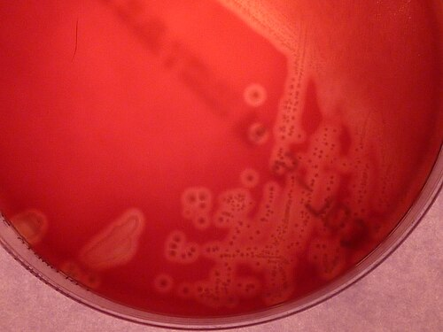
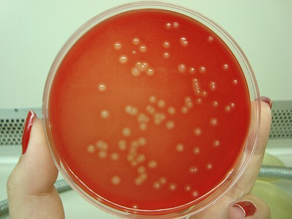

# STREPTOCOCCUS DO GRUPO B: RASTREIO E PROFILAXIA INTRAPARTO

O *Streptococcus agalactiae*, também conhecido como Estreptococo do Grupo B (EGB) ou GBS (do inglês *Group B Streptococcus*), é um velho conhecido da obstetrícia e da neonatologia. Para a gestante, ele costuma ser um colonizador inofensivo, mas para o recém-nascido, ele pode ser devastador.

Por que focamos tanto nisso? Porque o GBS é a principal causa de sepse neonatal precoce (aquela que ocorre nas primeiras 72 horas de vida). O objetivo de todo o rastreio e da profilaxia que discutiremos aqui é um só: evitar que a bactéria que coloniza o trato genital e gastrointestinal materno infecte o bebê durante a passagem pelo canal de parto ou após a ruptura das membranas.

*Figura 1 - Colônias beta-hemolíticas de Streptococcus agalactiae (GBS) em ágar sangue. O GBS coloniza o trato gastrointestinal e geniturinário de 10-30% das gestantes. O rastreio é feito com swab vaginal e retal entre 35-37 semanas de gestação. Fonte: 43trevenque, CC BY-SA 4.0 | Wikimedia Commons*

## Fisiopatologia e Transmissão: O "Porquê" da Conduta

O GBS é um diplococo Gram-positivo que faz parte da microbiota transitória de cerca de 15% a 30% das mulheres. Ele coloniza preferencialmente o reto e a vagina. Note que eu disse "transitória": uma mulher pode estar colonizada hoje e não estar daqui a um mês. É por isso que o rastreio tem "data de validade", como veremos adiante.

A transmissão para o feto ocorre de forma vertical, principalmente após a ruptura das membranas ou durante o trabalho de parto. O feto aspira o líquido amniótico contaminado ou entra em contato com a bactéria no canal de parto. Uma vez no pulmão do recém-nascido, o GBS pode causar pneumonia, progredir para sepse e até meningite.

Aqui entra um conceito fundamental que o Dr. Will sempre reforça: nem todo bebê exposto ficará doente. Na verdade, a maioria não fica. No entanto, a sepse por GBS tem alta mortalidade e morbidade, o que justifica a estratégia de profilaxia universal.

## Rastreamento: Quem, Quando e Como?

A recomendação atual da FEBRASGO e do Ministério da Saúde, seguindo as diretrizes internacionais consolidadas, é o rastreamento universal.

### O "Quando"

O rastreio deve ser realizado entre **35 e 37 semanas** de gestação.

Por que esse intervalo? Lembra que eu disse que a colonização é transitória? Estudos mostram que o resultado de uma cultura realizada nesse período tem um alto valor preditivo para o status de colonização no momento do parto (que geralmente ocorre nas 4 a 5 semanas seguintes). Se você colher muito cedo, o resultado pode não ser mais válido na hora do nascimento.

### O "Como"

A coleta é feita através de um *swab* (cotonete) único ou dois *swabs* diferentes. A ordem importa para a técnica, mas para a prova, o que você precisa saber é o local: **terço inferior da vagina e reto (através do esfíncter anal)**.

**Erro clássico de prova:** A banca vai dizer que a coleta é cervical ou que precisa de espéculo. Mentira. Não se usa espéculo e não se coleta do colo do útero. A maior carga bacteriana está na região anorretal.

### Quem NÃO precisa de rastreio (Swab)?

Existem dois grupos de gestantes que você não precisa "perder tempo" colhendo o *swab*, porque elas já têm indicação de profilaxia garantida:

- **Gestantes com bacteriúria por GBS na gestação atual:** Se a bactéria apareceu na urina (em qualquer contagem, mesmo que seja bacteriúria assintomática), significa que a colonização é pesada. Essa paciente receberá profilaxia no parto independentemente de qualquer outro exame.

- **Gestantes que já tiveram um filho anterior com doença invasiva por GBS:** Se um bebê anterior teve sepse ou meningite por GBS, o risco é alto demais para arriscar. Profilaxia direta no próximo parto.

**Cuidado:** Ter tido um *swab* positivo em gestação anterior NÃO garante profilaxia na atual. Se a gestação anterior foi apenas colonização (sem doença neonatal), nesta gestação ela precisa de um novo rastreio.

## Indicações de Profilaxia Intraparto: O Coração da Prova

Este é o tópico que mais cai. Você precisa saber decidir, à beira do leito, se vai ligar o antibiótico ou não. Vamos dividir em três cenários:

### 1. Profilaxia SEMPRE Indicada (Indicações Absolutas)

- Cultura (swab) vaginal/retal positiva entre 35-37 semanas na gestação atual.

- Bacteriúria por GBS na gestação atual (mesmo que tratada).

- Filho anterior que apresentou doença invasiva por GBS (sepse, meningite, pneumonia).

- Status de GBS desconhecido no momento do parto (sem exame ou antes das 35 semanas) associado a qualquer um destes fatores de risco:

- Parto pré-termo (idade gestacional < 37 semanas).

- Ruptura de membranas (bolsa rota) há 18 horas ou mais.

- Febre intraparto (temperatura axilar ≥ 38,0°C).

- Teste de amplificação de ácidos nucleicos (NAAT) positivo para GBS (se disponível).

### 2. Profilaxia NÃO Indicada

- Cultura (swab) negativa realizada há menos de 5 semanas (mesmo que haja fatores de risco como bolsa rota prolongada ou prematuridade). Se o exame é negativo e recente, confiamos nele.

- Cesariana eletiva, realizada fora de trabalho de parto e com membranas íntegras, independentemente do resultado do swab ou da idade gestacional.

**Pulo do gato:** Se a bolsa rompeu ou o trabalho de parto começou, a cesariana deixa de ser "proteção" e a indicação de profilaxia segue as regras normais. Se a paciente é GBS positivo e vai para uma cesárea com bolsa íntegra e sem contrações, NÃO faz profilaxia para GBS (faz apenas a profilaxia cefalosporina padrão de cirurgia).

### 3. O Cenário da Prematuridade e RPMO

Se a paciente chega em Trabalho de Parto Prematuro (TPP) ou com Ruptura Prematura de Membranas Ovulares (RPMO) pré-termo, a conduta é:

- Coletar o swab (se não tiver um recente).

- Iniciar a profilaxia para GBS.

- Se o trabalho de parto parar (tocolise efetiva) ou se a cultura vier negativa após 48 horas, você pode suspender o antibiótico.

| Situação Clínica | Conduta em relação à Profilaxia GBS |
| --- | --- |
| Swab Positivo (35-37 sem) | Sim |
| Filho anterior com sepse por GBS | Sim |
| Bacteriúria por GBS na gestação atual | Sim |
| Swab Negativo (< 5 semanas) | Não |
| Cesárea eletiva, bolsa íntegra, fora de TP | Não |
| Desconhecido + Febre (≥38°C) | Sim |
| Desconhecido + Bolsa rota ≥ 18h | Sim |
| Desconhecido + < 37 semanas | Sim |

*Figura 2 - A profilaxia antibiótica intraparto para GBS utiliza Penicilina G cristalina IV (5 milhões UI dose de ataque + 2,5 milhões UI a cada 4h até o parto) como primeira escolha. Ampicilina IV é a segunda opção. Em alérgicas: clindamicina (se sensível) ou vancomicina. Fonte: CC BY-SA 3.0, Wikimedia Commons*

## Esquemas Antibióticos: O Que e Como Usar

O objetivo da profilaxia é atingir níveis terapêuticos no líquido amniótico e no sangue fetal. Para isso, precisamos de tempo. O ideal é que o antibiótico seja iniciado **pelo menos 4 horas antes do nascimento**.

### Primeira Escolha: Penicilina G Cristalina

É o padrão-ouro. Tem espectro estreito (foca no que queremos) e atinge ótimas concentrações fetais.

- **Dose:** 5 milhões de UI (dose de ataque) IV, seguida de 2,5 a 3 milhões de UI IV a cada 4 horas até o clampeamento do cordão.

### Segunda Escolha (Alternativa): Ampicilina

Muito usada em serviços que não têm Penicilina G disponível.

- **Dose:** 2g (ataque) IV, seguida de 1g IV a cada 4 horas até o parto.

### E se a paciente for alérgica à Penicilina?

Aqui as bancas de residência fazem a festa. Você precisa estratificar o risco da alergia.

- **Baixo Risco de Anafilaxia** (ex: apenas rash cutâneo sem coceira, história vaga):

- Usamos **Cefazolina** (2g ataque + 1g a cada 8h). Existe uma reação cruzada muito baixa, segura nesses casos.

- **Alto Risco de Anafilaxia** (ex: broncoespasmo, angioedema, hipotensão, urticária imediata):

- Aqui precisamos saber se o GBS daquela paciente é sensível à **Clindamicina**.

- Se for sensível: Clindamicina 900mg IV a cada 8h.

- Se for resistente à clindamicina ou sensibilidade desconhecida: **Vancomicina** (20mg/kg a cada 8h ou 12h, dose máxima 2g).

**Atenção:** No MedEvo, sempre lembramos que a Vancomicina é a "última linha". Só chegamos nela se a paciente tiver alergia grave E o germe for resistente à clindamicina.

## Manejo do Recém-Nascido: O Pós-Parto

A conduta no RN depende de três fatores: a clínica do bebê, a idade gestacional e se a profilaxia materna foi adequada.

### O que é Profilaxia Adequada?

É o uso de Penicilina, Ampicilina ou Cefazolina por **4 horas ou mais** antes do parto.

- **Nota:** Clindamicina e Vancomicina, embora usadas em alérgicas, não são consideradas "adequadas" para fins de manejo do RN em algumas diretrizes, devido à menor evidência de eficácia na prevenção da sepse neonatal.

### Fluxograma Rápido para o RN:

- **RN com sinais de sepse (gemência, febre, hipotonia, taquicardia):** Não importa a profilaxia. Conduta: Coleta completa (Hemocultura, Hemograma, Liquor, RX) + Antibioticoterapia empírica.

- **RN assintomático + Mãe com Corioamnionite clínica:** Avaliação laboratorial + Antibiótico por pelo menos 48h até culturas.

- **RN assintomático + Profilaxia Materna Adequada:** Observação clínica por 48 horas (pode ser em alojamento conjunto). Não precisa de exames.

- **RN assintomático + Profilaxia Inadequada (< 4h) + IG ≥ 37 semanas e Bolsa Rota < 18h:** Observação clínica por 48 horas.

- **RN assintomático + Profilaxia Inadequada + (IG < 37 semanas OU Bolsa Rota > 18h):** Observação clínica por 48 horas. Alguns protocolos sugerem exames laboratoriais (hemograma e hemocultura), mas a tendência atual é a observação clínica rigorosa se o bebê estiver bem.

## Situações Especiais e Pegadinhas

### Ruptura Prematura de Membranas (RPMO) Pré-termo

Se a bolsa rompe antes das 37 semanas e não há trabalho de parto, a conduta é expectante. Você colhe o swab e inicia antibióticos de latência (geralmente Ampicilina + Azitromicina, conforme o protocolo de RPMO). Essa Ampicilina já serve como profilaxia para GBS. Se o swab vier negativo após 48h e a paciente não entrar em trabalho de parto, você suspende a cobertura para GBS.

### Bacteriúria por GBS Tratada

Imagine que a gestante teve uma cistite por GBS com 12 semanas. Você tratou com Cefalexina e a urinocultura de controle veio negativa. Ela precisa de profilaxia no parto? **SIM.** A presença de GBS na urina em qualquer fase da gestação indica alta colonização. Não precisa nem fazer o swab de 35-37 semanas; a indicação já está dada.

### O "Falso Positivo" do Status Desconhecido

A banca vai colocar uma paciente com 39 semanas, sem pré-natal (status desconhecido), que chega em trabalho de parto, mas com bolsa íntegra e sem febre. Você faz profilaxia? **NÃO.** No termo (≥ 37 semanas), o status desconhecido só recebe antibiótico se houver fator de risco (Febre ou Bolsa Rota > 18h). A idade gestacional de 39 semanas, por si só, não é fator de risco.

### Clampeamento do Cordão e Reanimação

Em prematuros, o clampeamento tardio do cordão (30-60 segundos) ainda é recomendado se o bebê estiver estável, mesmo com risco de GBS. A prioridade na sala de parto é a estabilização térmica (enrolar em plástico se < 34 semanas) e respiratória (CPAP precoce se necessário).

## Diagnóstico Diferencial: Corioamnionite vs. Colonização

É vital diferenciar a gestante apenas colonizada daquela com **Corioamnionite**.

- **Colonização:** Swab positivo, paciente assintomática. Conduta: Profilaxia intraparto.

- **Corioamnionite:** Febre materna + pelo menos dois: Taquicardia materna, Taquicardia fetal, Útero doloroso, Líquido amniótico fétido ou Leucocitose.

- **Conduta na Corioamnionite:** Antibioticoterapia de amplo espectro (Ampicilina + Gentamicina) + Indução do parto (não é indicação de cesárea, mas o parto deve ocorrer logo). Aqui o antibiótico não é "profilaxia", é tratamento.

## Resumo de Doses e Drogas

| Droga | Dose de Ataque | Dose de Manutenção |
| --- | --- | --- |
| **Penicilina G** | 5 milhões UI IV | 2,5 - 3 milhões UI IV 4/4h |
| **Ampicilina** | 2 g IV | 1 g IV 4/4h |
| **Cefazolina** | 2 g IV | 1 g IV 8/8h |
| **Clindamicina** | 900 mg IV | 900 mg IV 8/8h |
| **Vancomicina** | 20 mg/kg IV | Conforme peso (máx 2g) 8/8h ou 12/12h |

## Pontos-Chave para Prova 🎯

- **Rastreio Universal:** Realizado entre 35 e 37 semanas de gestação através de swab vaginal (terço inferior) e anal.

- **Validade do Swab:** O resultado negativo é considerado confiável por apenas 5 semanas. Se o parto não ocorreu nesse prazo, o rastreio deve ser repetido.

- **Bacteriúria por GBS:** Qualquer nível de GBS na urina durante a gestação atual é indicação de profilaxia intraparto, sem necessidade de swab.

- **Filho Anterior:** História de recém-nascido anterior com doença invasiva por GBS é indicação absoluta de profilaxia na gestação atual.

- **Cesariana Eletiva:** Se for fora de trabalho de parto e com membranas íntegras, NÃO se faz profilaxia para GBS, mesmo que a mãe seja positiva.

- **Fatores de Risco (Status Desconhecido):** Prematuridade (< 37 sem), Bolsa rota ≥ 18 horas ou Febre intraparto (≥ 38°C).

- **Primeira Escolha:** Penicilina G Cristalina IV. Iniciar pelo menos 4 horas antes do parto para ser considerada "adequada".

- **Alergia à Penicilina (Baixo Risco):** Usar Cefazolina.

- **Alergia à Penicilina (Alto Risco):** Usar Clindamicina (se sensível) ou Vancomicina (se resistente ou sensibilidade desconhecida).

- **Manejo do RN:** Bebês assintomáticos de mães com profilaxia adequada precisam apenas de 48h de observação clínica.

- **O que NÃO fazer:** Não coletar swab cervical, não usar espéculo na coleta, não fazer profilaxia em cesárea eletiva com bolsa íntegra, não tratar colonização vaginal durante o pré-natal (o tratamento é apenas intraparto).

- **Corioamnionite:** Se houver sinais clínicos de infecção ovular, o esquema muda para tratamento triplo/amplo (Ampicilina + Gentamicina) e o parto deve ser agilizado.

- **GBS e E. coli:** São os dois principais agentes de sepse neonatal precoce, especialmente em prematuros.

- **Penicilina na Gestação:** É segura e é a droga de escolha para GBS e Sífilis. No caso do GBS, o objetivo é profilático para o feto.

 Cópia offline para consulta pessoal.
 Fonte original:
 [https://www.medevo.com.br/material-apoio/ler/e0489743-931c-400a-94e1-3399f10af3f0](https://www.medevo.com.br/material-apoio/ler/e0489743-931c-400a-94e1-3399f10af3f0)
