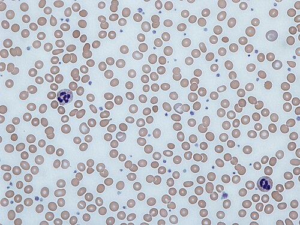

# SUPLEMENTAÇÃO DE FERRO E VITAMINA D POR FAIXA ETÁRIA

Para entender por que crianças recebem suplementação, é necessário considerar a fisiologia do crescimento. O lactente é um organismo em expansão frenética. Nos primeiros seis meses de vida, o peso de nascimento dobra; ao final do primeiro ano, triplica. Essa expansão de volume plasmático e de massa muscular exige substratos que o leite materno, embora seja o alimento padrão-ouro, pode não fornecer em quantidades suficientes para manter os estoques em níveis ideais frente a essa demanda absurda.

Em provas de residência, não basta memorizar a dose: é fundamental identificar o paciente de risco e aplicar corretamente protocolos da Sociedade Brasileira de Pediatria (SBP) e do Ministério da Saúde.

*Figura 1 - A suplementação profilática de ferro é recomendada pela SBP: a partir dos 6 meses para RN a termo AIG (dose fixa de 10-12,5 mg/dia em ciclos — SBP 2026) ou desde 30 dias de vida para prematuros e baixo peso (2-4 mg/kg/dia). Fonte: Domínio Público | Wikimedia Commons*

## O Metabolismo do Ferro no Lactente: O Porquê da Suplementação

O ferro é o protagonista da eritropoiese e do desenvolvimento cerebral. Durante o terceiro trimestre de gestação, ocorre o maior transporte transplacentário de ferro da mãe para o feto. É aqui que o bebê monta sua "poupança" de ferro, armazenada principalmente na forma de ferritina no fígado.

Por que isso é importante? Porque se o bebê nasce prematuro ou com baixo peso, ele teve menos tempo para "sacar" esse ferro da mãe. Ele já nasce com uma reserva limitada.

Nos primeiros meses de vida, ocorre a chamada anemia fisiológica do lactente. Com o início da respiração pulmonar e o aumento da oferta de oxigênio, a produção de eritropoietina cai drasticamente, a medula óssea dá uma "pausa" e os níveis de hemoglobina descem. O ferro resultante da destruição das hemácias velhas é reciclado e guardado. Por volta dos 4 a 6 meses, essa reserva acaba. É exatamente nesse ponto que a dieta (leite materno ou fórmula) e a suplementação profilática precisam assumir o papel de manter o balanço positivo.

## Suplementação de Ferro: Protocolo SBP (Atualizado — Março 2026)

A SBP revisou suas diretrizes para tornar o entendimento mais prático, mas as bancas adoram explorar as nuances entre o recém-nascido a termo e o prematuro.

### Lactentes a Termo e com Peso Adequado (AIG)

Para o bebê nascido com mais de 37 semanas e peso superior a 2.500 g, a regra deve ser diferenciada da recomendação para prematuros e baixo peso.

Se o lactente está em Aleitamento Materno Exclusivo (AME), a suplementação de ferro elementar deve ser iniciada aos **6 meses de vida**, coincidindo com a introdução alimentar. Conforme a **atualização SBP de março de 2026**, a dose agora é **fixa: 10 a 12,5 mg/dia de ferro elementar** (não mais baseada no peso), administrada em **2 ciclos de 3 meses**: suplementação dos 6 aos 9 meses, pausa dos 9 aos 12 meses, e novo ciclo dos 12 aos 15 meses. Essa posologia foi alinhada ao Programa Nacional de Suplementação de Ferro (PNSF/MS).

Cuidado: Muitos alunos ainda se confundem com a recomendação antiga de iniciar aos 3 meses. Esqueça isso para o RN a termo AIG. A lógica atual é que, se o clampeamento do cordão umbilical foi feito de forma tardia (após 1 a 3 minutos), esse aporte extra de sangue garante estoques de ferro suficientes até o sexto mês.

**⚠️ ATUALIZAÇÃO SBP MARÇO/2026 — Triagem Laboratorial:** A SBP agora se posiciona **contra a triagem laboratorial universal** de rotina em crianças saudáveis com alimentação e crescimento adequados. A avaliação laboratorial (hemograma, ferritina) deve ser reservada para crianças com **fatores de risco identificados** ou sinais clínicos sugestivos de deficiência de ferro.

E se o bebê usa fórmula infantil? Se ele ingere mais de 500 ml/dia de fórmula fortificada, a SBP entende que o aporte de ferro já está garantido pela composição do produto, não sendo necessária a suplementação medicamentosa adicional. Porém, na prática de prova, se a questão disser "lactente em AME", a resposta é 6 meses.

### O Grupo de Risco: Prematuros e Baixo Peso

Aqui a conversa muda. Como eles não tiveram tempo de formar estoque, não podemos esperar até os 6 meses. O início é precoce: **no 30º dia de vida**.

A dose não é universal; ela depende do peso de nascimento. Grave esta tabela, pois ela cai com uma frequência absurda:

| Peso ao Nascer (g) | Dose de Ferro Elementar (1º ano) | Dose no 2º ano de vida |
| --- | --- | --- |
| > 2.500g (Termo AIG) | 10-12,5 mg/dia dose fixa, em ciclos (6-9m e 12-15m) | — |
| 1.500g a 2.500g | 2 mg/kg/dia (a partir de 30 dias) | 1 mg/kg/dia |
| 1.000g a 1.500g | 3 mg/kg/dia (a partir de 30 dias) | 1 mg/kg/dia |
| < 1.000g | 4 mg/kg/dia (a partir de 30 dias) | 1 mg/kg/dia |

Ponto importante: para **prematuros e baixo peso**, ao completar 1 ano de vida, todos passam a receber **1 mg/kg/dia** até os 24 meses. A diferenciação de dose maior (2-4 mg/kg/dia) é apenas para o primeiro ano. Já para o **RN a termo AIG**, a atualização SBP 2026 estabeleceu **2 ciclos de 3 meses com dose fixa** (10-12,5 mg/dia nos períodos de 6-9m e 12-15m, com pausa dos 9-12m), encerrando a suplementação profilática aos 15 meses.

### O Papel do Leite de Vaca Integral

Um erro clássico de prova é o cenário do lactente de 8 meses que toma leite de vaca integral. O leite de vaca é um "vilão" por três motivos:

- Tem baixa biodisponibilidade de ferro.

- O excesso de cálcio e caseína inibe a absorção do pouco ferro presente.

- Causa micro-hemorragias intestinais por irritação da mucosa, levando à perda oculta de sangue nas fezes.

Se a questão descreve um lactente com palidez palmar, irritabilidade e uso de leite de vaca, a suspeita principal é Anemia Ferropriva. Lembre-se: a profilaxia é para quem está saudável; se já tem anemia, a dose passa a ser terapêutica (geralmente 3 a 6 mg/kg/dia).

*Figura 2 - A suplementação de Vitamina D é universal para todos os lactentes: 400 UI/dia do nascimento até 12 meses, 600 UI/dia de 12-24 meses (SBP). Prematuros iniciam com 400 UI/dia desde o nascimento. Raquitismo nutricional indica falha na suplementação. Fonte: National Cancer Institute, Domínio Público | Wikimedia Commons*

## Vitamina D: A Construção do Esqueleto e Além

Diferente do ferro, a vitamina D não espera. A recomendação da SBP é clara: a suplementação deve começar na **primeira semana de vida** (assim que o bebê sai da maternidade e chega na primeira consulta de puericultura).

Por que não confiamos apenas no sol? No Brasil, embora sejamos um país tropical, a exposição solar segura para lactentes é controversa devido ao risco de câncer de pele e insolação. Além disso, a poluição urbana e o uso de fotoproteção bloqueiam a síntese cutânea de vitamina D. O leite materno, apesar de perfeito, é naturalmente pobre em vitamina D. Portanto, a suplementação é mandatória para todos, independentemente do tipo de aleitamento.

### Esquema de Doses de Vitamina D

A dose é baseada na idade cronológica, não no peso:

- **0 a 12 meses:** 400 UI/dia.

- **1 a 18 anos:** 600 UI/dia.

Atenção para a pegadinha: a suplementação deve ser mantida até os 24 meses de forma rotineira. Após essa idade, a SBP recomenda avaliar fatores de risco (obesidade, dieta vegetariana estrita, pouca exposição solar) para decidir a manutenção de 600 UI/dia até a adolescência.

### Raquitismo Nutricional: O Cenário de Falha

Em questões, um lactente com os seguintes achados sugere raquitismo nutricional:

- Craniotabes (osso do crânio amolecido, como "bolinha de pingue-pongue").

- Rosário raquítico (proeminência das junções costocondrais).

- Alargamento de punhos e tornozelos.

- Pernas em "X" (genu valgo) ou arqueadas (genu varo).

Pense imediatamente em Raquitismo por deficiência de Vitamina D. O diagnóstico é clínico e radiológico (metáfises ósseas em "taça" ou "flamejantes"). Laboratorialmente, teremos queda do cálcio (ou normal no início), queda do fósforo e elevação da Fosfatase Alcalina.

## Vitamina A: O Programa Nacional

Diferentemente do ferro e da vitamina D, frequentemente manejados na rotina clínica, a vitamina A faz parte de estratégia de saúde pública do Ministério da Saúde: o Programa Nacional de Suplementação de Vitamina A.

Ela é administrada em "megadoses" semestrais em regiões consideradas de risco (Nordeste, Norte e áreas específicas de MG e SP - o chamado "Polígono das Secas").

- **6 a 11 meses:** Uma dose única de 100.000 UI.

- **12 a 59 meses:** Uma dose de 200.000 UI a cada 6 meses.

Por que megadoses? A vitamina A é lipossolúvel e fica armazenada no fígado, sendo liberada gradualmente. Sua deficiência causa cegueira noturna e xeroftalmia, mas o que mais cai em prova é o seu papel na imunidade: a deficiência de vitamina A aumenta a gravidade de diarreias e infecções respiratórias. Em casos de Sarampo, a suplementação de vitamina A é obrigatória e reduz a mortalidade.

## Outras Deficiências Nutricionais Importantes

Embora o ferro e a vitamina D dominem as provas, algumas "pérolas" clínicas sobre outros nutrientes aparecem com frequência para testar o seu diferencial.

### Vitamina C (Escorbuto)

Aparece em questões sobre crianças com dietas extremamente restritivas (ex: apenas leite de vaca fervido, sem frutas cítricas). O quadro clínico é clássico:

- Irritabilidade intensa (a criança chora ao ser tocada devido à dor óssea).

- Posição de "sapo" ou "rã" (membros inferiores fletidos e abduzidos).

- Petéquias e sangramento gengival.

- Rosário escorbútico (diferente do raquítico, este é doloroso).

### Zinco

Essencial para o crescimento e imunidade. A deficiência clássica é a **Acrodermatite Enteropática**, uma doença genética de má absorção, mas pode ser adquirida. O tripé diagnóstico é: Dermatite periorificial e acral + Diarreia + Alopecia. Além disso, o zinco é fundamental para a mobilização da vitamina A do fígado; sua deficiência pode gerar sinais de hipovitaminose A mesmo com estoques hepáticos preservados.

### Vitamina K

Este é ponto clássico do berçário. Todo RN deve receber 1 mg de vitamina K por via intramuscular ao nascer para prevenir a doença hemorrágica do recém-nascido. O fígado do bebê é imaturo e a flora intestinal (que produz vitamina K) ainda não está estabelecida.

## Comparativo de Recomendações: SBP vs. Ministério da Saúde

Este é o ponto onde muitos alunos perdem pontos preciosos. Existe uma leve divergência entre o que a SBP (foco na saúde individual ideal) e o Ministério da Saúde (foco em saúde pública e custo-benefício) recomendam para o ferro.

| Critério | Recomendação SBP | Recomendação Min. Saúde |
| --- | --- | --- |
| **Início (Termo AIG)** | 6 meses | 6 meses |
| **Dose (Termo AIG)** | 10-12,5 mg/dia dose fixa (SBP 2026) | 10-12,5 mg/dia (PNSF) |
| **Periodicidade** | Diária | Diária |
| **Duração** | 2 ciclos de 3 meses (6-9m e 12-15m) | Conforme PNSF |
| **Prematuros** | 2 a 4 mg/kg/dia (30 dias) | 2 mg/kg/dia (30 dias) |

Para a sua prova, siga sempre a SBP, a menos que o enunciado cite explicitamente "Segundo o Ministério da Saúde". **Novidade 2026:** A SBP se alinhou ao PNSF/MS para lactentes a termo, adotando dose fixa e regime cíclico. Para prematuros, a SBP continua mais detalhista (escalonamento por peso: 2-4 mg/kg/dia), enquanto o MS simplifica para 2 mg/kg/dia.

## Diagnóstico Diferencial e Fatores Inibidores

Na prescrição de ferro, a família deve ser orientada sobre a forma de administração. O ferro deve ser administrado, preferencialmente, uma hora antes das refeições ou duas horas depois.

**Facilitadores da absorção:** Vitamina C (suco de laranja, acerola). O meio ácido mantém o ferro na forma ferrosa (Fe2+), que é a forma absorvida.
**Inibidores da absorção:** Cálcio (leite e derivados), fitatos (cereais), oxalatos (espinafre) e taninos (chás).

Cuidado com a pegadinha do espinafre: o Popeye nos enganou. O espinafre tem muito ferro, mas também tem muito oxalato, o que torna a biodisponibilidade desse ferro baixíssima. Não é uma boa fonte para tratar anemia.

## Situações Especiais e Erros Comuns

### O RN PIG (Pequeno para a Idade Gestacional)

O RN PIG, mesmo que seja a termo (ex: 38 semanas, mas pesando 2.300g), segue a regra do baixo peso: inicia ferro com **2 mg/kg/dia aos 30 dias de vida**. Não espere até os 6 meses! Ele não teve um aporte de nutrientes adequado durante a gestação.

### O Uso de Fórmulas Infantis

Se o lactente consome fórmula infantil, é necessário estimar a ingestão de ferro. A maioria das fórmulas modernas tem cerca de 0,8 a 1,2 mg de ferro por 100 mL. Se o bebê toma 800 mL/dia, já recebe cerca de 8 mg de ferro; para um bebê de 7 kg, isso fornece aproximadamente 8 mg de ferro por dia. Com a nova dose de 10-12,5 mg/dia (SBP 2026), o aporte da fórmula cobre boa parte da necessidade. A SBP mantém que, se o consumo for > 500 ml/dia de fórmula fortificada, a suplementação medicamentosa pode ser dispensada.

### Clampeamento do Cordão Umbilical

O clampeamento tardio (esperar o cordão parar de pulsar ou pelo menos 1 minuto) envia cerca de 80-100 ml de sangue extra para o bebê. Isso equivale a um "boost" de ferro que pode durar meses. É por causa dessa prática, hoje universal, que a SBP se sente segura em recomendar o início do ferro apenas aos 6 meses para bebês a termo. Se o clampeamento foi imediato (por indicação médica, como mãe HIV positiva), esse bebê tem maior risco de anemia precoce.

## Resumo Prático sem Repetir Tabelas

Para revisão rápida, a lógica é:

- **Vitamina D:** 400 UI/dia no primeiro ano; 600 UI/dia de 12 a 24 meses; após 2 anos, individualizar conforme risco.

- **Ferro no termo AIG em aleitamento materno exclusivo:** iniciar aos 6 meses em dose fixa diária/cíclica conforme protocolo adotado.

- **Baixo peso e prematuridade:** iniciar ferro aos 30 dias; quanto menor o peso ao nascer, maior a dose em mg/kg/dia no primeiro ano.

- **Fórmula infantil em volume suficiente:** pode reduzir ou dispensar suplementação medicamentosa de ferro conforme ingestão e protocolo local.

## Fatores de Risco para Deficiências

Não decore apenas as doses, entenda quem é o paciente que a banca vai te apresentar. Os fatores de risco para hipovitaminose D e anemia ferropriva costumam se sobrepor:

- **Pobreza e Insegurança Alimentar:** Dificuldade de acesso a alimentos ricos em ferro heme (carnes).

- **Introdução Alimentar Precoce ou Inadequada:** Substituição do leite materno por chás, águas ou sopas ralas de vegetais sem proteína animal.

- **Uso de Leite de Vaca Integral antes de 1 ano:** O principal fator de risco modificável para anemia ferropriva grave no Brasil.

- **Obesidade:** O tecido adiposo sequestra a vitamina D (que é lipossolúvel), tornando-a menos disponível. Além disso, a inflamação crônica da obesidade aumenta a hepcidina, que bloqueia a absorção de ferro.

- **Doenças Malabsortivas:** Doença celíaca e fibrose cística impedem a absorção de vitaminas lipossolúveis (A, D, E, K) e ferro.

## Pontos-Chave para Prova

- **RN a termo, AIG, em AME:** Ferro 10-12,5 mg/dia dose fixa em 2 ciclos de 3 meses (6-9m suplementa, 9-12m pausa, 12-15m suplementa) — SBP 2026.

- **RN Baixo Peso (< 2.500g) ou Prematuro:** Ferro inicia aos 30 dias. A dose no primeiro ano varia (2, 3 ou 4 mg/kg) conforme o peso de nascimento.

- **Vitamina D:** 400 UI/dia no primeiro ano, 600 UI/dia no segundo ano. Início na primeira semana de vida.

- **Vitamina A:** Megadoses semestrais pelo Ministério da Saúde (100k UI para 6-11m; 200k UI para 12-59m).

- **Anemia Ferropriva:** A causa mais comum de anemia na infância. O primeiro exame a alterar é a Ferritina (estoque baixo).

- **Leite de Vaca Integral:** Proibido antes de 1 ano. Causa micro-hemorragias e tem baixa biodisponibilidade de ferro.

- **Escorbuto (Vit C):** Posição de sapo, dor à manipulação, sangramento gengival.

- **Acrodermatite Enteropática (Zinco):** Diarreia, alopecia e lesões de pele periorificiais.

- **Raquitismo:** Craniotabes, rosário raquítico e alargamento de punhos. Fosfatase alcalina elevada é um marcador importante.

- **Clampeamento tardio do cordão:** Protege contra anemia nos primeiros meses de vida.

- **Fórmula Infantil:** Se o lactente consome > 500 ml/dia, a suplementação de ferro profilática pode ser dispensada.

- **Vitamina K:** Administrada ao nascer (1mg IM) para prevenir doença hemorrágica.

- **Pegadinha de Prova:** A banca vai dizer que o bebê em AME não precisa de Vitamina D porque o leite é completo. FALSO. Precisa suplementar desde a primeira semana.

- **Pegadinha de Prova 2:** A banca vai dizer que o ferro para o prematuro começa com 6 meses. FALSO. Começa com 30 dias.

- **Contraindicação Absoluta de Ferro Oral:** Hemocromatose ou anemias não-ferroprivas (ex: talassemia major, onde já há sobrecarga de ferro).

- **SBP 2026 — Triagem Laboratorial:** A SBP se posicionou CONTRA a triagem laboratorial universal em crianças saudáveis. Exames apenas se fatores de risco.

> **📋 Nota de Atualização (Março/2026):** Este material foi atualizado conforme as novas diretrizes da SBP publicadas em 17/03/2026. Principais mudanças: (1) Para RN a termo AIG, a dose profilática de ferro passou de 1 mg/kg/dia contínuo para **10-12,5 mg/dia dose fixa em 2 ciclos de 3 meses** (6-9m e 12-15m), alinhando-se ao PNSF/MS; (2) A SBP agora se posiciona **contra a triagem laboratorial universal** em crianças saudáveis com alimentação e crescimento adequados. Para prematuros/baixo peso, as recomendações permanecem inalteradas. 🩺

 Cópia offline para consulta pessoal.
 Fonte original:
 [https://www.medevo.com.br/material-apoio/ler/54082273-f64f-4d16-a685-b648956079e0](https://www.medevo.com.br/material-apoio/ler/54082273-f64f-4d16-a685-b648956079e0)
