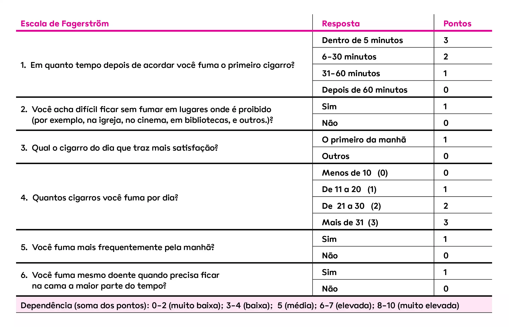

# TABAGISMO

O tabagismo não é apenas um "hábito" ou um "estilo de vida". Para a medicina e, principalmente, para as bancas de residência, ele é uma doença crônica, recorrente, classificada no grupo de transtornos mentais e de comportamento decorrentes do uso de substâncias psicoativas.

Se você quer entender por que esse tema cai tanto em Preventiva, a resposta é simples: o tabagismo é a principal causa evitável de adoecimento e morte precoce no mundo. Estima-se que ele seja responsável pela morte de um terço a metade de seus usuários. Quando um examinador coloca uma questão de tabagismo, ele está testando se você sabe fazer prevenção em todos os níveis.

## Epidemiologia e Impacto na Saúde Pública

No Brasil, observamos uma queda significativa na prevalência de fumantes nas últimas décadas, fruto de políticas públicas robustas. No entanto, o desafio atual mudou de face com a chegada dos Dispositivos Eletrônicos para Fumar (DEF).

Um conceito que você precisa levar para a prova: a incidência de câncer de pulmão em uma determinada região reflete, com um atraso de algumas décadas, o padrão médio de consumo de cigarros daquela população. Isso explica por que, mesmo com a queda do número de fumantes hoje, ainda vemos muitos casos de câncer, reflexo do consumo elevado nos anos 80 e 90.

O tabagismo é um fator de risco para múltiplos cânceres, não apenas pulmão. Lembre-se da bexiga, esôfago, pâncreas e até Leucemia Mieloide Aguda (LMA). Além disso, em pacientes diabéticos, o cigarro potencializa drasticamente o risco de micro e macroangiopatias, acelerando a neuropatia e a progressão para doença renal terminal.

## Fisiopatologia: A Escravidão do Sistema de Recompensa

Por que é tão difícil parar? A resposta está na nicotina. Ela é uma substância psicoativa que, ao ser inalada, chega ao cérebro em poucos segundos.

Lá, ela se liga aos receptores nicotínicos de acetilcolina no sistema mesolímbico dopaminérgico. Isso ativa a via de recompensa cerebral, liberando dopamina e gerando uma sensação de prazer e bem-estar. O cérebro do dependente "aprende" que, para se sentir normal ou feliz, ele precisa daquela substância.

Com o tempo, ocorre a neuroadaptação: o número de receptores aumenta (up-regulation). Quando o paciente tenta parar, esses receptores ficam "vazios", gerando a síndrome de abstinência. O tratamento farmacológico, que veremos adiante, serve justamente para minimizar esses sintomas e o desejo compulsivo (craving).

## Avaliação do Paciente Tabagista

A recomendação da USPSTF e das diretrizes brasileiras é clara: o rastreamento do tabagismo deve ser feito em TODAS as consultas. Não é uma vez por ano, é em todo contato médico. Isso faz parte da avaliação básica de saúde na Atenção Primária.

### Carga Tabágica

Você precisa saber calcular isso de olhos fechados. A fórmula é:
Carga Tabágica (maços-ano) = (número de cigarros por dia / 20) x anos de tabagismo.

Exemplo clínico: Se um paciente fuma 10 cigarros por dia há 20 anos, a carga dele é (10/20) x 20 = 10 maços-ano. As bancas adoram usar esse valor para definir critérios de rastreamento de câncer de pulmão com TC de baixa dose (geralmente > 20 ou 30 maços-ano, dependendo da diretriz).

### Grau de Dependência

O instrumento mais utilizado é o Teste de Fagerström. Ele avalia o comportamento do fumante. A pergunta de ouro é: "Quanto tempo após acordar você fuma o seu primeiro cigarro?". Se for nos primeiros 5 minutos, a dependência é altíssima.

### Estágios Motivacionais (Modelo de Prochaska e DiClemente)

Este é, sem dúvida, o tópico mais cobrado em provas de Preventiva. Você deve identificar em qual fase o paciente está para decidir a conduta.

| Estágio | Descrição | Conduta do Médico |
| --- | --- | --- |
| Pré-contemplação | Não pensa em parar nos próximos 6 meses. | Informar sem confrontar, focar em conscientização. |
| Contemplação | Pensa em parar, mas está ambivalente (sabe que faz mal, mas gosta). | Explorar ambivalência, mostrar benefícios. |
| Preparação | Decidiu parar e planeja fazer isso nos próximos 30 dias. | Auxiliar no plano de ação, marcar data (Dia D). |
| Ação | Parou de fumar (está no período de até 6 meses sem fumar). | Prevenir recaídas, manejar abstinência. |
| Manutenção | Está sem fumar há mais de 6 meses. | Reforçar benefícios, vigilância contínua. |

Cuidado: Erro clássico de prova é achar que todo paciente precisa de remédio imediatamente. Se o paciente está em pré-contemplação, a farmacoterapia não é indicada ainda. O foco é a Entrevista Motivacional, um diálogo que explora a autonomia do paciente.

## Níveis de Prevenção no Tabagismo

Aqui o Dr. Will costuma dizer que o aluno "se banana" se não souber os conceitos básicos. Vamos aplicar ao tabagismo:

- Prevenção Primária: Evitar que a pessoa comece a fumar. Campanhas em escolas, proibição de publicidade e aumento de impostos são exemplos. O uso de máscaras na pandemia também é prevenção primária (evita o surgimento da doença).

- Prevenção Secundária: Rastreamento e diagnóstico precoce. Identificar o fumante na UBS e oferecer intervenção breve. Realizar TC de tórax em fumantes pesados assintomáticos para detectar câncer precocemente.

- Prevenção Terciária: Reduzir complicações de uma doença já instalada. Se o paciente já tem DPOC ou teve um infarto e para de fumar agora, isso é prevenção terciária. Melhora o prognóstico e a reabilitação.

- Prevenção Quaternária: Evitar a iatrogenia. Não solicitar exames desnecessários de rastreamento em quem não tem indicação ou não prescrever medicações com contraindicações graves sem necessidade.

## Dispositivos Eletrônicos para Fumar (DEF)

Os famosos "vapes" ou cigarros eletrônicos são o novo vilão das provas. Atenção: NENHUM tipo ou quantidade de cigarro eletrônico é considerado seguro.

Eles contêm nicotina (muitas vezes em doses imprevisíveis, pois os rótulos são imprecisos) e substâncias como propileno glicol e glicerol. Quando aquecidos, esses componentes podem gerar carcinógenos como formaldeído e acetaldeído.

Além do risco de câncer e dependência, os DEFs estão associados à EVALI (Lesão Pulmonar Associada ao Uso de Vaping), uma condição aguda que pode levar à insuficiência respiratória grave. Nunca oriente o uso de DEF como estratégia para parar de fumar; isso é erro grave.

## Tratamento da Dependência

O tratamento no SUS é baseado na Portaria 571/2013 e no Protocolo Clínico e Diretrizes Terapêuticas (PCDT) de 2020. Ele dura, em regra, 12 meses e envolve avaliação, intervenção e manutenção.

### Abordagem Não Farmacológica

A Terapia Cognitivo-Comportamental (TCC) é o padrão-ouro. Pode ser feita de forma breve (3 a 5 minutos em qualquer consulta) ou intensiva (sessões estruturadas). O objetivo é mudar o comportamento e criar estratégias para lidar com gatilhos (ex: café, álcool, estresse).

### Tratamento Farmacológico

As medicações de primeira linha visam reduzir o sofrimento da abstinência.

-

Terapia de Reposição de Nicotina (TRN):

- Formas: Adesivo (transdérmico), goma de mascar e pastilha.

- O adesivo libera nicotina de forma lenta e constante. Gomas e pastilhas são para o "fissura" (uso sob demanda).

- Dica de prova: Se o paciente tiver irritação cutânea pelo adesivo, oriente usar corticoide tópico na noite anterior e no dia seguinte no local da aplicação.

-

Bupropiona:

- É um antidepressivo que atua na recaptação de dopamina e noradrenalina.

- Dose: Começa com 150mg/dia por 3 dias, depois 300mg/dia (150mg 2x ao dia, com intervalo de 8h).

- O paciente deve começar a medicação 7 dias ANTES da data marcada para parar de fumar.

- Contraindicação Absoluta: Risco de convulsão. Pacientes com epilepsia, tumor de SNC, transtornos alimentares (bulimia/anorexia) ou que usam outros medicamentos que baixam o limiar convulsivo não podem usar.

-

Vareniclina:

- Agonista parcial do receptor nicotínico. É a medicação mais eficaz isoladamente, mas sua disponibilidade no SUS é limitada e houve problemas recentes de fabricação mundial.

| Medicamento | Mecanismo | Principal Cuidado/Contraindicação |
| --- | --- | --- |
| Adesivo Nicotina | Reposição lenta | Doença cardiovascular instável (relativa), lesões de pele. |
| Goma/Pastilha | Reposição rápida | Problemas dentários, próteses, gastrite. |
| Bupropiona | Inibidor recaptação | Histórico de convulsão, bulimia, anorexia (Absolutas). |

## Situações Especiais e Comorbidades

### Tabagismo e Tuberculose (TB)

Pacientes com TB devem ser tratados para dependência à nicotina em qualquer fase do tratamento da TB. O tabagismo piora o prognóstico da TB, aumenta a taxa de transmissão e o risco de recidiva. As estratégias de cessação são as mesmas da população geral.

### Gestantes

A prioridade absoluta é a abordagem comportamental (TCC). O uso de fármacos em gestantes é uma zona cinzenta e deve ser evitado, sendo considerado apenas em casos de falha total da TCC e após discussão de riscos e benefícios, pois a nicotina é teratogênica e causa restrição de crescimento fetal.

### Ganho de Peso

Muitos pacientes não param de fumar por medo de engordar. É verdade que o metabolismo desacelera e a ansiedade aumenta a busca por comida. A dica aqui é associar atividade física e orientar que o benefício de parar de fumar supera imensamente o risco de ganhar alguns quilos.

## Políticas Públicas: O Modelo MPOWER

A OMS estabeleceu o pacote MPOWER para ajudar os países a reduzir o consumo de tabaco. Isso cai muito em questões de Saúde Pública:

- Monitor: Monitorar o uso de tabaco e políticas de prevenção.

- Protect: Proteger a população contra a fumaça do tabaco (ambientes livres de fumo).

- Offer: Oferecer ajuda para a cessação (tratamento no SUS).

- Warn: Alertar sobre os perigos (fotos nos maços).

- Enforce: Banir publicidade, promoção e patrocínio.

- Raise: Elevar impostos sobre os produtos de tabaco.

Lembre-se: Proibir a venda por ano de nascimento (como tentado em alguns países) ainda não é uma recomendação padrão da OMS adotada globalmente, embora seja discutida. O foco atual é o aumento de preços e restrição de locais de uso.

## O Papel do Profissional de Saúde

Na MedEvo, sempre batemos na tecla de que a abordagem breve é dever de todos. Se um paciente assintomático chega com preocupação sobre "COVID longa" ou qualquer outra queixa na UBS, você deve aproveitar o gancho para avaliar o estilo de vida, incluindo o tabagismo.

Parar de fumar sempre faz diferença. Mesmo um paciente com diagnóstico de câncer de pulmão avançado se beneficia da cessação (prevenção terciária), pois melhora a resposta à quimioterapia e reduz complicações pós-operatórias.

## Pontos-Chave para Prova 🚬

- Carga Tabágica: (Cigarros/dia ÷ 20) x Anos de fumo. Memorize esta fórmula.

- Rastreamento: Deve ser feito em TODAS as consultas, para todos os pacientes.

- Estágio de Preparação: Paciente quer parar nos próximos 30 dias. É aqui que marcamos o "Dia D".

- Estágio de Contemplação: O paciente está em dúvida, no "morde e assopra". Não prescreva remédio ainda, trabalhe a motivação.

- Bupropiona: Contraindicação ABSOLUTA em pacientes com histórico de convulsão ou transtornos alimentares.

- TRN (Adesivo): Se causar irritação na pele, usar corticoide tópico. Não é necessário suspender se a reação for leve.

- Prevenção Primária: Evitar o início do uso (ex: impostos, proibição de propaganda).

- Prevenção Secundária: Diagnóstico precoce (ex: rastrear fumantes na UBS).

- Prevenção Terciária: Reduzir danos de quem já está doente (ex: reabilitação após infarto).

- Prevenção Quaternária: Evitar excessos médicos (ex: não pedir TC de tórax para quem fumou apenas 1 maço-ano na vida).

- Dispositivos Eletrônicos (DEF): Não são seguros, contêm carcinógenos e podem causar EVALI.

- Benefício da Cessação: A mortalidade por câncer de pulmão cai progressivamente após o abandono, tendendo a se igualar aos não fumantes após muitos anos (15-20 anos).

- Síndrome de Abstinência: O tratamento farmacológico serve para reduzir o desejo (fissura) e os sintomas físicos, não para "fazer parar de fumar" por mágica.

- MPOWER: Estratégia da OMS. O "R" de Raise (aumentar impostos) é uma das medidas mais eficazes para reduzir o consumo em jovens.

- Tuberculose: Tabagismo é fator de risco para infecção, adoecimento e morte por TB. Tratar sempre.

- Idosos: Não esqueça das vacinas. > 65 anos precisam de Pneumocócica e Influenza anual. O tabagismo aumenta o risco de complicações respiratórias nesses pacientes.

 Cópia offline para consulta pessoal.
 Fonte original:
 [https://www.medevo.com.br/material-apoio/ler/64e6fa93-d9a1-4bf2-9ae4-f0b456856d25](https://www.medevo.com.br/material-apoio/ler/64e6fa93-d9a1-4bf2-9ae4-f0b456856d25)
