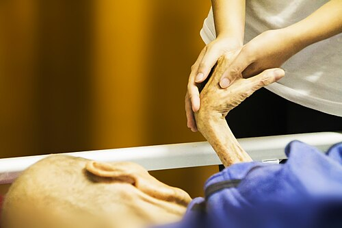

# TANATOLOGIA E MORTE

Para começar nossa conversa sobre Tanatologia, você precisa entender que, para a prova de residência, este não é um tema sobre "o fim", mas sobre "o documento" e "a responsabilidade". As bancas não querem que você seja um filósofo, elas querem saber se você sabe preencher uma Declaração de Óbito (DO) sem cometer crimes ou erros administrativos e se você conhece o protocolo de Morte Encefálica.

Muitos alunos erram questões aqui porque tentam usar a lógica do "bom senso" em vez da lógica da norma legal. Vamos quebrar isso agora.

*Figura 1 - A Declaração de Óbito (DO) é o documento médico-legal mais importante. O preenchimento correto da cadeia causal (Parte I: causa básica → intermediária → imediata) é obrigatório. Em mortes por causas externas, o corpo deve ser encaminhado ao IML. Fonte: National Cancer Institute, Domínio Público | Wikimedia Commons*

## A Declaração de Óbito (DO) e a Responsabilidade Médica

A primeira coisa que você deve gravar: Declaração de Óbito (DO) é o formulário oficial do Ministério da Saúde. Certidão de Óbito é o documento do cartório. O médico NUNCA emite a certidão, ele emite a declaração. Parece bobagem, mas essa confusão aparece em alternativas de prova para te testar.

A DO tem três funções principais: estatística (alimentar o SIM, Sistema de Informações sobre Mortalidade), jurídica (comprovar o fim da personalidade civil) e epidemiológica. No MedEvo, sempre reforçamos que o preenchimento da DO é um ato médico ético e obrigatório.

### Quem deve assinar a DO?

Este é o tópico que mais cai. A regra de ouro é: a causa da morte foi natural ou foi externa (violenta/suspeita)?

-

**Morte Natural:**

- **Com assistência médica:** O médico assistente (aquele que vinha acompanhando o paciente) é o responsável principal. Se ele não estiver, o médico substituto ou o plantonista da instituição assina.

- **Sem assistência médica (em domicílio, por exemplo):** Se houver Serviço de Verificação de Óbitos (SVO) na localidade, o corpo vai para lá. Se não houver SVO, o médico do serviço público de saúde (como o da Estratégia Saúde da Família) assina. Se não houver ninguém, em última instância, qualquer médico da localidade.

- **Morte em hospital:** O médico assistente ou o plantonista que prestou assistência preenche a DO em 3 vias.

-

**Morte Violenta ou Suspeita (Causa Externa):**

- Aqui não importa se o paciente ficou internado 10 minutos ou 10 meses. Se a causa que iniciou o processo foi externa (acidente, suicídio, homicídio, queda, afogamento), a DO é EXCLUSIVIDADE do médico legista do Instituto Médico Legal (IML).

**Cuidado com a pegadinha clássica:** Paciente de 80 anos cai da própria altura, quebra o fêmur, interna, opera, faz uma broncopneumonia após 20 dias e morre. Quem assina? O médico assistente? NÃO. A causa básica foi a queda (causa externa). O corpo DEVE ir ao IML. O tempo de internação não "naturaliza" uma morte que começou com um trauma.

### Tabela 1: Responsabilidade pelo Preenchimento da DO

| Situação do Óbito | Localidade com SVO e IML | Localidade SEM SVO |
| --- | --- | --- |
| Morte Natural com assistência | Médico Assistente | Médico Assistente |
| Morte Natural sem assistência | Médico do SVO | Médico do Serviço Público / Saúde da Família |
| Morte Violenta ou Suspeita | Médico Legista (IML) | Médico Legista (IML) ou Perito Nomeado |
| Morte Fetal (ver critérios) | Médico que assistiu a mãe | Médico que assistiu a mãe |

## O Preenchimento da Cadeia de Eventos

A DO é dividida em Parte I e Parte II. Entender isso é entender 40% das questões de Medicina Legal.

### Parte I: A Cadeia Causal

Aqui você descreve a sequência direta que levou à morte. Ela é lida de cima para baixo, mas o raciocínio clínico é de baixo para cima.

- **Linha A (Causa Imediata):** É o evento final. Exemplo: Choque séptico, Insuficiência respiratória, Infarto agudo do miocárdio. É a última coisa que aconteceu.

- **Linhas B e C (Causas Intermediárias):** O que levou à causa imediata? Exemplo: Se a linha A é Choque Séptico, a linha B pode ser Broncopneumonia.

- **Linha D (Causa Básica):** Esta é a rainha das provas. É a doença ou lesão que INICIOU a cadeia de eventos patológicos. No nosso exemplo: se o paciente tinha Doença de Alzheimer e por isso aspirou, a Causa Básica é a Doença de Alzheimer.

**Dica do Dr. Will:** As bancas adoram perguntar qual é a causa básica em casos de suicídio. Lembre-se: a causa básica é o meio que produziu a lesão letal (ex: enforcamento, ingestão de substância), e não a depressão ou transtorno mental subjacente.

### Parte II: Causas Contribuintes

Aqui entram as doenças que o paciente tinha e que ajudaram no processo de morte, mas que não fazem parte da cadeia direta da Parte I. Exemplo: O paciente morreu de pneumonia por Alzheimer, mas também era hipertenso e diabético. A HAS e o DM entram na Parte II.

**Erro comum de prova:** Achar que a causa básica deve estar sempre na primeira linha. Errado. A causa básica é a última linha preenchida na Parte I.

*Figura 2 - O protocolo de Morte Encefálica (Resolução CFM 2173/2017) exige: pré-requisitos (causa conhecida, irreversível, tempo mínimo de observação), 2 exames clínicos por médicos diferentes, teste de apneia e 1 exame complementar confirmatório. A hora do óbito é a do último procedimento. Fonte: CC BY-SA 4.0, JasonRobertYoungMD | Wikimedia Commons*

## Morte Encefálica (Resolução CFM 2173/17)

Este tema é cobrado com rigor técnico absoluto. Você precisa decorar os pré-requisitos e os tempos. A Morte Encefálica (ME) é a definição legal de morte no Brasil, permitindo a retirada de órgãos.

### Pré-requisitos para iniciar o protocolo

Não se começa um protocolo de ME em qualquer paciente em coma. Você precisa de:

- Presença de lesão encefálica de causa conhecida, irreversível e capaz de causar a morte encefálica.

- Ausência de fatores de confusão: hipotermia (temperatura corporal deve estar > 35°C), distúrbios hidroeletrolíticos graves ou uso de drogas sedativas/bloqueadores neuromusculares.

- Tratamento e observação em hospital por um período mínimo (geralmente 6 horas; se a causa for hipóxia pós-parada cardíaca, o tempo de observação deve ser de 24 horas).

- Pressão Arterial Sistólica >= 100 mmHg ou PAM >= 65 mmHg.

### O Exame Clínico

Devem ser realizados DOIS exames clínicos por médicos diferentes, sendo que pelo menos um deles deve ser especialista (neurologista, neurocirurgião, intensivista ou emergencista) ou ter curso de capacitação. Nenhum deles pode fazer parte da equipe de transplantes.

O exame clínico busca comprovar o coma aperceptivo e a ausência de reflexos de tronco encefálico:

- Reflexo fotomotor (ausente).

- Reflexo corneopalpebral (ausente).

- Reflexo oculocefálico (ausente - "olhos de boneca").

- Reflexo vestíbulo-ocular (ausente - prova calórica com água gelada).

- Reflexo de tosse ou traqueal (ausente).

**Atenção:** Reflexos medulares (como o reflexo patelar ou sinal de Lazarus) NÃO excluem o diagnóstico de morte encefálica. O tronco morreu, mas a medula pode estar viva.

### O Teste de Apneia

É o último passo do exame clínico. O objetivo é estimular o centro respiratório no bulbo através da hipercapnia máxima.

- O paciente é pré-oxigenado com O2 a 100%.

- Desconecta-se o ventilador e instala-se um cateter de O2 na traqueia.

- Observa-se por 10 minutos se há qualquer movimento respiratório.

- O teste é positivo (confirma ME) se o pCO2 final for > 60 mmHg e não houver movimentos respiratórios.

**Dica de Prova:** O teste de apneia só precisa ser feito UMA vez, geralmente após o primeiro ou segundo exame clínico. Se o primeiro teste de apneia for positivo, não precisa repetir no segundo exame clínico.

### Exame Complementar

No Brasil, é OBRIGATÓRIO realizar pelo menos um exame complementar que demonstre:

- Ausência de perfusão sanguínea cerebral (ex: Arteriografia, Cintilografia, Doppler transcraniano).

- OU ausência de atividade elétrica (ex: EEG).

- OU ausência de metabolismo cerebral (ex: PET scan).

**A hora do óbito:** Esta é uma pegadinha recorrente. A hora do óbito que deve constar na DO é a hora em que foi concluído o ÚLTIMO procedimento do protocolo (seja o segundo exame clínico ou o exame complementar).

### Tabela 2: Intervalos entre os dois exames clínicos (por idade)

| Faixa Etária | Intervalo Mínimo |
| --- | --- |
| 7 dias a 2 meses incompletos | 24 horas |
| 2 meses a 24 meses incompletos | 12 horas |
| Acima de 2 anos | 1 hora |

## Doação de Órgãos e Tecidos

Após a constatação da ME, a família deve ser comunicada. No Brasil, a doação é do tipo "consentida". Isso significa que, mesmo que a pessoa tenha deixado escrito em vida que queria ser doadora, a palavra final é da família (cônjuge ou parentes até 2º grau).

Se o paciente não for identificado (indigente), a doação é PROIBIDA. Se for um menor de idade ou incapaz, os pais ou responsáveis devem autorizar.

**Pérola Clínica:** Se o paciente morreu por causa externa (ex: tiro na cabeça) e está em morte encefálica, ele pode ser doador? Sim, mas o médico legista do IML deve autorizar a retirada dos órgãos para garantir que isso não prejudicará a perícia posterior.

## Tanatognose: Os Sinais da Morte

A Tanatognose estuda os sinais que permitem o diagnóstico da morte e a estimativa do tempo de óbito (cronotanatognose).

### Sinais Abióticos Imediatos

São aqueles que ocorrem logo após a parada das funções vitais, mas ainda não são certeza absoluta de morte (podem ocorrer em estados de morte aparente):

- Perda da consciência.

- Abolição do tônus muscular.

- Parada cardíaca e respiratória.

- Midríase (dilatação das pupilas).

### Sinais Abióticos Consecutivos (Tardios)

Estes sim dão o diagnóstico de certeza:

- **Algor Mortis (Esfriamento cadavérico):** O corpo perde cerca de 1°C a 1,5°C por hora até equilibrar com a temperatura ambiente.

- **Livor Mortis (Livores de hipóstase):** Manchas roxas nas partes declives do corpo devido à gravidade agindo no sangue parado. Eles se fixam após 8 a 12 horas. Se você mudar o corpo de posição após 12 horas, as manchas não mudam mais de lugar.

- **Rigor Mortis (Rigidez cadavérica):** Começa pela mandíbula e nuca (Lei de Nysten), desce para o tronco e depois membros. Inicia-se entre 1 a 3 horas e atinge o máximo em 8 a 12 horas.

- **Desidratação cadavérica:** Pergaminhamento da pele e turvação da córnea (Sinal de Stenon-Louis).

**Sinal de Prokop:** É a eletroestimulação muscular facial pós-morte. Se os músculos da face contraírem ao estímulo elétrico, a morte ocorreu há menos de 3 horas. É um sinal de morte muito recente.

## Morte por Causas Externas e o IML

Você será plantonista e um paciente chegará vítima de atropelamento. Ele morre na sala de emergência. Você, como médico que o atendeu, pode assinar a DO? NUNCA.

Toda morte violenta (homicídio, suicídio, acidente) ou suspeita deve ser encaminhada ao IML. O médico assistente só assina mortes naturais.

**E se o paciente morrer de TEP (Tromboembolismo Pulmonar) após uma cirurgia de fêmur por queda?** O TEP é uma complicação natural, mas a causa básica foi a queda. Logo, IML. A cadeia causal não foi interrompida.

**E se o paciente morrer no hospital após 3 meses de internação por um tiro que o deixou paraplégico?** IML. A causa básica continua sendo o ferimento por arma de fogo.

### Tabela 3: Destino do Corpo e Emissor da DO

| Tipo de Morte | Exemplo | Quem assina a DO |
| --- | --- | --- |
| Natural com assistência | IAM em paciente internado | Médico Assistente / Plantonista |
| Natural sem assistência | Morte súbita em casa (sem crime) | SVO (onde houver) |
| Violenta (Acidente) | Atropelamento | IML |
| Violenta (Homicídio) | Ferimento por Arma de Fogo | IML |
| Violenta (Suicídio) | Ingestão de veneno | IML |
| Suspeita | Morte sem causa clara, sinais de violência | IML |

## Óbitos Fetais e Neonatais

Este é um ponto onde as bancas adoram confundir os conceitos de "Nascido Vivo" e "Óbito Fetal".

-

**Nascido Vivo:** Se o bebê respirou ou apresentou qualquer sinal de vida (batimento cardíaco, pulsação do cordão, movimento muscular voluntário), ele é um nascido vivo. Se ele morrer 1 segundo depois, você deve emitir DOIS documentos: a Declaração de Nascido Vivo (DNV) e a Declaração de Óbito (DO). Não importa o peso ou a idade gestacional.

-

**Óbito Fetal (Natimorto):** O médico só é obrigado a emitir a DO se o feto tiver:

- Peso >= 500 gramas.

- OU Idade Gestacional >= 20 semanas.

- OU Estatura (comprimento cabeça-calcanhar) >= 25 cm.

Se o feto tiver menos que isso, a DO é opcional (embora recomendada para fins estatísticos se a família desejar o sepultamento).

## Estatísticas de Mortalidade no Brasil

Para a prova de Preventiva, você precisa saber o perfil epidemiológico do Brasil:

- A principal causa de morte na população geral são as **Doenças do Aparelho Circulatório** (IAM, AVC).

- A segunda causa são as **Neoplasias**.

- As **Causas Externas** (trauma, violência) ocupam o terceiro lugar na população geral, mas são a PRIMEIRA causa de morte em jovens (15 a 29 anos).

- Dentro das causas externas, os homicídios lideram, seguidos pelos acidentes de trânsito. Curiosidade de prova: o número de atropelamentos de pedestres tem caído na última década, mas os acidentes com motociclistas subiram.

### Morte Materna

É a morte de uma mulher durante a gestação ou até 42 dias após o parto, por qualquer causa relacionada ou agravada pela gravidez.

- **Morte Obstétrica Direta:** Complicações da gravidez, parto ou puerpério (ex: Eclâmpsia, Hemorragia pós-parto, Septicemia pós-aborto).

- **Morte Obstétrica Indireta:** Doenças preexistentes que se agravaram pela gravidez (ex: Cardiopatia que descompensa na gestação).

## Ética e Sigilo Pós-Morte

O sigilo médico não acaba com a morte do paciente. Se uma seguradora ou empresa solicitar informações sobre a causa da morte de um ex-paciente seu, você deve ater-se ao que foi escrito na Declaração de Óbito. Informações detalhadas do prontuário só podem ser liberadas com autorização dos herdeiros ou por ordem judicial.

Em casos de morte suspeita de violência doméstica em crianças, a abordagem deve ser completa: Anamnese detalhada com os responsáveis + Autópsia minuciosa + Investigação do local do óbito. Nunca negligencie sinais como manchas lineares no pescoço ou equimoses em diferentes estágios de evolução.

## Situações Clínicas Específicas em Provas

As bancas costumam trazer casos clínicos para você identificar a causa básica ou a conduta.

**Caso 1:** Paciente tabagista, hipertenso, apresenta dor precordial súbita, evolui com parada cardiorrespiratória em casa. O SAMU chega e constata o óbito. Não há sinais de violência.

- **Conduta:** Se houver SVO, encaminhar. Se não houver, o médico do serviço público assina. Causa básica provável: Infarto Agudo do Miocárdio.

**Caso 2:** Criança com Síndrome de West (epilepsia grave) apresenta quadro de pneumonia aspirativa, interna na UTI e morre após 5 dias.

- **DO:** Parte I: (a) Choque Séptico, (b) Broncopneumonia aspirativa, (c) Síndrome de West. A Síndrome de West é a causa básica porque iniciou a cadeia que levou à aspiração.

**Caso 3:** Paciente com Doença de Behçet apresenta hemoptise maciça e morre. Na investigação, aneurismas de artérias pulmonares.

- **Raciocínio:** A Doença de Behçet pode causar vasculite sistêmica e aneurismas pulmonares. A causa básica é a Doença de Behçet.

### Tabela 4: Diagnóstico Diferencial de Morte Súbita

| Faixa Etária | Principais Causas |
| --- | --- |
| Lactentes | Síndrome da Morte Súbita do Lactente (SMSL), Malformações |
| Jovens | Miocardiopatia Hipertrófica, Arritmias canalopatias, Trauma |
| Adultos / Idosos | Doença Arterial Coronariana (IAM), AVC, TEP |

## Pontos-Chave para Prova 🧠

- **Causa Básica:** É a doença ou lesão que iniciou a sucessão de eventos mórbidos. É ela que vai para as estatísticas de mortalidade.

- **Morte Violenta:** IML sempre, não importa o tempo de internação. O médico assistente NUNCA assina.

- **Morte Natural sem assistência:** SVO é o destino. Se não houver SVO, médico do setor público.

- **Morte Encefálica:** Exige 2 exames clínicos + 1 teste de apneia + 1 exame complementar.

- **Hora do Óbito na ME:** É a hora da conclusão do último teste do protocolo.

- **Doador de Órgãos:** Exige autorização da família (cônjuge ou parentes até 2º grau). Não identificado não doa.

- **Nascido Vivo:** Qualquer sinal de vida ao nascer. Exige DNV e DO se morrer em seguida.

- **Óbito Fetal:** DO obrigatória se >= 20 semanas, ou >= 500g, ou >= 25cm.

- **Parte I da DO:** Cadeia direta (causa imediata no topo, causa básica na última linha preenchida).

- **Parte II da DO:** Doenças preexistentes que contribuíram, mas não causaram diretamente a morte.

- **Sinais de Morte:** Livores (manchas roxas) se fixam após 8-12h. Rigidez começa pela face/nuca.

- **Morte Materna:** Até 42 dias após o parto.

- **Causas Externas:** Principal causa de morte em jovens no Brasil.

- **Erro de preenchimento:** "Parada Cardiorrespiratória" não deve ser colocada como causa de morte, pois é um evento comum a todos os óbitos. Use a patologia real (ex: IAM).

- **Médico Plantonista:** Assina a DO de mortes naturais ocorridas no hospital na ausência do médico assistente.

- **Sigilo:** O prontuário é sigiloso mesmo após a morte; a DO é um documento público.

- **Teste de Apneia:** Positivo se pCO2 > 60 mmHg e ausência de movimentos respiratórios.

- **Contraindicação Absoluta para ME:** Hipotermia (< 35°C) ou intoxicação por drogas depressoras do SNC. Deve-se aguardar a reversão para iniciar o protocolo.

 Cópia offline para consulta pessoal.
 Fonte original:
 [https://www.medevo.com.br/material-apoio/ler/8c29aa60-6bdc-496d-b170-fd90cbe027c0](https://www.medevo.com.br/material-apoio/ler/8c29aa60-6bdc-496d-b170-fd90cbe027c0)
