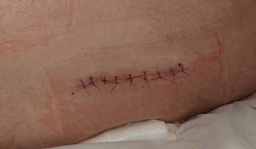
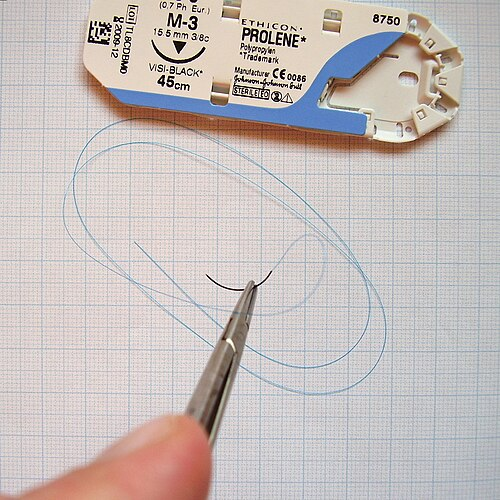

# TÉCNICA CIRÚRGICA E INSTRUMENTAÇÃO

*Figura 1 - Sutura cirúrgica em pós-operatório com dreno de Redon. Os tempos operatórios fundamentais são: diérese, hemostasia, exposição ou exérese, e síntese. A assepsia e a antissepsia antecedem qualquer procedimento cirúrgico. Fonte: CC0 | Wikimedia Commons*

## Assepsia e antissepsia

**Assepsia** é o conjunto de medidas que impede a contaminação do campo estéril. Inclui paramentação, esterilização de materiais, campos cirúrgicos e técnica estéril.

**Antissepsia** é a aplicação de agentes químicos em tecidos vivos para reduzir a carga microbiana.

A microbiota cutânea é dividida em:

- **Microbiota transitória:** superficial, adquirida por contato, removida com maior facilidade pela higienização.

- **Microbiota residente:** localizada em camadas mais profundas da pele, folículos pilosos e glândulas, sendo mais difícil de eliminar.

A antissepsia cirúrgica das mãos deve reduzir a microbiota transitória e parte da residente. Em geral, dura **3 a 5 minutos**, conforme o produto utilizado e o protocolo institucional.

Principais antissépticos:

- **Clorexidina:** bom efeito residual e menor inativação por matéria orgânica quando comparada ao PVPI.

- **PVPI, povidona-iodo:** amplo espectro, mas pode ter menor efeito residual e maior inativação por sangue, secreções e matéria orgânica.

Após a antissepsia das mãos, a secagem deve ser feita com compressa estéril, seguida de avental e luvas estéreis.

## Tempos operatórios fundamentais

A maioria das cirurgias pode ser compreendida em quatro tempos.

### 1. Diérese

É a abertura ou separação dos tecidos para acesso à área operatória.

Pode ser:

- **Incisão:** corte com bisturi.

- **Divulsão:** separação romba dos tecidos, preservando vasos e nervos.

- **Punção:** acesso por agulha ou trocarte.

- **Diérese física:** uso de energia, como eletrocirurgia ou laser.

Incisões paralelas às **linhas de Langer** tendem a apresentar melhor resultado estético, menor tensão e melhor cicatrização.

### 2. Hemostasia

É o controle do sangramento.

Pode ser:

- **Temporária:** compressão, pinçamento, torniquete, tamponamento.

- **Definitiva:** ligadura, sutura vascular, clipe, eletrocoagulação.

Conceitos importantes:

- **Manobra de Pringle:** clampeamento do ligamento hepatoduodenal para controle temporário do fluxo da tríade portal, especialmente em trauma hepático.

- **Eletrocirurgia monopolar:** exige placa dispersiva no paciente.

- **Eletrocirurgia bipolar:** a corrente passa entre as duas pontas da pinça, com menor dispersão elétrica.

### 3. Exposição, exérese ou ato principal

É o momento em que se obtém adequada visualização e se realiza o objetivo da cirurgia: ressecção, reparo, drenagem, anastomose ou correção anatômica.

Afastadores comuns:

- **Farabeuf:** afastador manual, dinâmico.

- **Gosset e Balfour:** afastadores autoestáticos, muito usados em laparotomias.

### 4. Síntese

É o fechamento dos tecidos por planos, com o objetivo de aproximar bordas e manter estabilidade até que a cicatrização suporte a tensão local.

A síntese deve respeitar:

- vascularização dos tecidos;

- ausência de tensão excessiva;

- boa hemostasia;

- alinhamento anatômico;

- escolha adequada do fio e da técnica de sutura.

## Instrumentais básicos

A mesa cirúrgica costuma ser organizada conforme os tempos operatórios:

- **Diérese:** bisturi, tesouras.

- **Hemostasia:** pinças hemostáticas, como Kelly, Crile e Rochester.

- **Exposição:** afastadores.

- **Síntese:** porta-agulhas, pinças anatômicas, pinças dente de rato, fios e agulhas.

Diferença clássica:

- **Tesoura de Metzenbaum:** delicada, usada para tecidos.

- **Tesoura de Mayo:** mais robusta, usada para tecidos mais resistentes e corte de fios, conforme o modelo e a rotina do serviço.

## Fios de sutura

*Figura 2 - Fios de sutura: absorvíveis e inabsorvíveis; monofilamentares e multifilamentares. Monofilamentares tendem a ter menor risco de infecção; multifilamentares costumam oferecer maior segurança do nó. Fonte: Domínio Público | Wikimedia Commons*

Os fios são classificados principalmente por **absorção** e **estrutura**.

### Quanto à absorção

**Absorvíveis**

São degradados pelo organismo.

- **Categute:** natural, absorvível, maior reação inflamatória. O cromado mantém força tênsil por mais tempo que o simples.

- **Poliglactina 910, Vicryl:** sintético, absorvível, multifilamentar, muito usado em subcutâneo, mucosas e ligaduras.

- **Poliglecaprone, Monocryl:** sintético, absorvível, monofilamentar.

- **Polidioxanona, PDS:** sintético, absorvível, monofilamentar, mantém força tênsil por mais tempo.

**Inabsorvíveis**

Permanecem no tecido ou precisam ser removidos.

- **Nylon:** sintético, monofilamentar, baixa reação tecidual, muito usado em pele.

- **Polipropileno, Prolene:** sintético, monofilamentar, baixa reatividade, usado em suturas vasculares, fáscia em alguns contextos e intradérmicas.

- **Seda:** natural, multifilamentar, boa segurança do nó, mas maior reação inflamatória e maior risco de colonização bacteriana.

- **Aço:** inabsorvível, usado em situações específicas, como esternorrafia.

### Quanto à estrutura

- **Monofilamentares:** uma única fibra. Menor capilaridade, menor risco de infecção e menor arrasto tecidual. Exemplos: nylon, polipropileno, PDS.

- **Multifilamentares:** várias fibras trançadas. Melhor manuseio e segurança do nó, mas maior capilaridade e maior risco de colonização. Exemplos: seda, algodão, poliglactina.

| Fio | Estrutura | Absorção | Usos comuns |
| --- | --- | --- | --- |
| Nylon | Monofilamentar | Inabsorvível | Pele |
| Polipropileno | Monofilamentar | Inabsorvível | Vascular, pele, intradérmica |
| Poliglactina 910 | Multifilamentar | Absorvível | Subcutâneo, mucosas, ligaduras |
| PDS | Monofilamentar | Absorvível lento | Fáscia, suturas de maior suporte |
| Seda | Multifilamentar | Inabsorvível | Ligaduras, fixações, uso cada vez mais restrito |
| Categute | Multifilamentar | Absorvível | Mucosas e situações específicas |

Na via urinária, deve-se evitar fio inabsorvível, pois pode servir de núcleo para formação de cálculos.

## Técnicas de sutura e nós

O nó cirúrgico geralmente é composto por seminós sucessivos:

- **Contenção:** aproxima as bordas.

- **Fixação:** estabiliza o primeiro seminó.

- **Segurança:** reduz o risco de deslizamento.

Tipos de pontos mais cobrados:

- **Ponto simples:** versátil, fácil execução.

- **Ponto em U horizontal:** distribui tensão, mas pode comprometer vascularização se muito apertado.

- **Ponto Donatti, ou colchoeiro vertical:** padrão “longe-longe, perto-perto”; promove eversão das bordas e é útil em áreas de maior tensão.

- **Sutura contínua:** rápida, distribui tensão, mas pode perder toda a linha se houver falha do fio.

- **Sutura invaginante, como Lembert e Cushing:** usada em vísceras ocas, especialmente para invaginar serosa e reduzir exposição de mucosa.

A **técnica de Witzel** não é um ponto isolado. É uma técnica usada em jejunostomia, com criação de túnel seroso ao redor da sonda para reduzir extravasamento e refluxo.

## Drenos

Drenos podem ser usados para evacuar líquidos, ar ou secreções, monitorar vazamentos e tratar coleções. Não substituem hemostasia adequada, controle de contaminação nem boa técnica cirúrgica.

Tipos comuns:

- **Penrose:** dreno aberto, passivo, por capilaridade. Maior risco de infecção ascendente.

- **Portovac e Jackson-Pratt:** drenos fechados, geralmente sob sucção. Permitem melhor quantificação do débito e reduzem risco de contaminação externa.

- **Dreno torácico:** sistema fechado em selo d’água, usado para drenagem pleural.

A retirada depende do tipo de cirurgia, débito, aspecto da drenagem e objetivo do dreno.

## Eletrocirurgia e segurança

Na eletrocirurgia monopolar, a corrente sai do eletrodo ativo, atravessa o paciente e retorna pela placa dispersiva. A placa deve estar bem aderida, em área vascularizada, limpa e seca, para reduzir risco de queimadura.

Na eletrocirurgia bipolar, a corrente circula entre as pontas da pinça, com menor dispersão.

Cuidados importantes:

- evitar contato com materiais inflamáveis;

- aguardar secagem de soluções alcoólicas antes do uso do bisturi elétrico;

- proteger paciente, equipe e equipamentos;

- aspirar fumaça cirúrgica quando disponível, pois pode conter partículas tóxicas e biológicas.

A NR-6 trata dos Equipamentos de Proteção Individual. No centro cirúrgico, incluem luvas, máscaras, proteção ocular, aventais e outros dispositivos conforme risco ocupacional.

## Toxicidade por anestésicos locais

A toxicidade sistêmica por anestésicos locais pode ocorrer por dose excessiva ou injeção intravascular inadvertida.

Sinais precoces:

- gosto metálico;

- zumbido;

- parestesia perioral;

- tontura;

- agitação ou sonolência.

Quadros graves:

- convulsões;

- arritmias;

- depressão miocárdica;

- colapso cardiovascular.

Conduta:

- interromper a administração;

- suporte ventilatório e hemodinâmico;

- controle de convulsões;

- emulsão lipídica a 20% nos casos graves.

Doses máximas usuais da lidocaína:

- **Sem vasoconstritor:** 5 mg/kg.

- **Com vasoconstritor:** 7 mg/kg.

## Cirurgia de controle de danos

Indicada em pacientes graves, especialmente no trauma, quando o reparo definitivo prolongado aumentaria mortalidade. O objetivo inicial é controlar rapidamente hemorragia e contaminação.

É clássica na presença da tríade:

- hipotermia;

- acidose;

- coagulopatia.

Etapas:

- **Operação abreviada:** controle de sangramento e contaminação.

- **Ressuscitação em UTI:** aquecimento, correção de coagulopatia, acidose e choque.

- **Reoperação planejada:** reparo definitivo após estabilização, frequentemente em 24 a 48 horas.

O abdome aberto pode ser necessário em controle de danos, edema visceral importante ou risco de síndrome compartimental abdominal.

**Síndrome compartimental abdominal:** pressão intra-abdominal > 20 mmHg associada a disfunção orgânica. A medida é geralmente feita pela pressão intravesical.

## Classificação das cirurgias quanto ao potencial de contaminação

| Classificação | Definição | Exemplo |
| --- | --- | --- |
| Limpa | Sem abertura de tratos colonizados e sem inflamação | Hernioplastia eletiva, tireoidectomia |
| Limpa-contaminada | Abertura controlada de trato respiratório, digestivo, genital ou urinário, sem contaminação grosseira | Colecistectomia eletiva, gastrectomia eletiva |
| Contaminada | Inflamação aguda não purulenta, trauma recente, quebra importante de técnica | Apendicite aguda sem pus, ferida traumática recente |
| Infectada ou suja | Pus, tecido necrótico, perfuração de víscera oca, trauma antigo | Peritonite fecal, abscesso drenado |

## Anatomia cirúrgica aplicada: forame epiploico

O **forame epiploico**, ou forame de Winslow, comunica a grande cavidade peritoneal com a bolsa omental.

Limites:

- **Anterior:** ligamento hepatoduodenal, com tríade portal.

- **Posterior:** veia cava inferior.

- **Superior:** lobo caudado do fígado.

- **Inferior:** primeira porção do duodeno.

Esse conhecimento é importante para entender a manobra de Pringle, realizada no ligamento hepatoduodenal.

## Nutrição e acessos

A escolha do acesso depende da duração prevista e da funcionalidade do trato gastrointestinal.

- **Sonda nasoenteral:** preferida para curto prazo quando o tubo digestivo é funcionante.

- **Gastrostomia ou jejunostomia:** usadas quando a nutrição enteral será prolongada, geralmente por mais de 4 semanas.

- **Acesso venoso central:** indicado para nutrição parenteral total, drogas vasoativas, soluções hiperosmolares, quimioterapia e monitorização específica.

Cateter venoso central não deve ser trocado apenas por tempo de permanência. A troca depende de suspeita de infecção, mau funcionamento, complicações ou ausência de indicação de manutenção.

## Pontos-chave para prova

- Assepsia impede contaminação do campo estéril; antissepsia reduz microrganismos em tecido vivo.

- O termo adequado é **microbiota cutânea**, não flora.

- Tempos operatórios: diérese, hemostasia, exposição ou ato principal, síntese.

- Metzenbaum é tesoura delicada para tecidos; Mayo é mais robusta.

- Fios monofilamentares têm menor capilaridade e menor risco de infecção.

- Seda é natural, multifilamentar, inabsorvível e causa maior reação tecidual.

- Nylon é sintético, monofilamentar, inabsorvível e muito usado em pele.

- Polipropileno tem baixa reatividade e é muito usado em suturas vasculares.

- Fios absorvíveis sintéticos tendem a causar menos reação que categute.

- Na via urinária, evite fios inabsorvíveis pelo risco de cálculo.

- Ponto Donatti promove eversão de bordas e ajuda em áreas de tensão.

- Manobra de Pringle: clampeamento do ligamento hepatoduodenal.

- Penrose é dreno aberto e passivo; Portovac e Jackson-Pratt são fechados e aspirativos.

- Síndrome compartimental abdominal: PIA > 20 mmHg com disfunção orgânica.

- Lidocaína: 5 mg/kg sem vasoconstritor e 7 mg/kg com vasoconstritor.

- Toxicidade por anestésico local grave: suporte clínico e emulsão lipídica a 20%.

- Contagem de compressas e instrumentais deve ser conferida antes do fechamento de cavidades.

- Divergência na contagem exige busca sistemática e, se necessário, exame de imagem antes do encerramento.

- Divulgação de imagens de pacientes sem consentimento é infração ética, mesmo quando não há intenção comercial.

 Cópia offline para consulta pessoal.
 Fonte original:
 [https://www.medevo.com.br/material-apoio/ler/27e1cf8f-ee52-4550-a9ee-2c196562bb6f](https://www.medevo.com.br/material-apoio/ler/27e1cf8f-ee52-4550-a9ee-2c196562bb6f)
