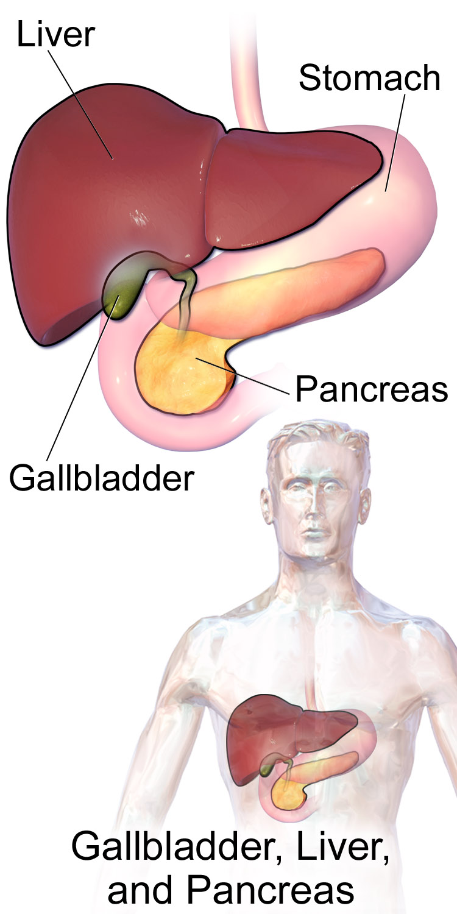
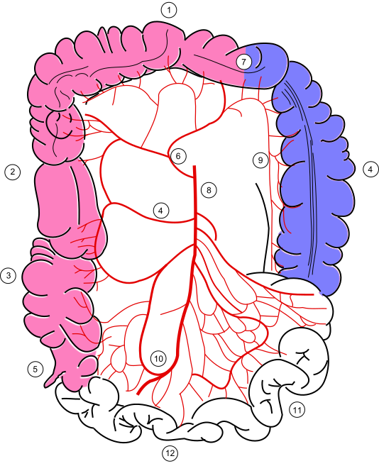
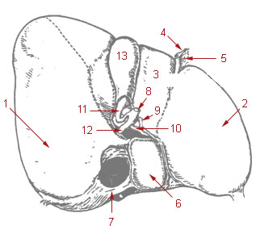

# TÉCNICAS E PROCEDIMENTOS CIRÚRGICOS

## Avaliação Pré-Operatória e Risco Cirúrgico

A avaliação pré-operatória não é apenas uma "burocracia" para liberar a cirurgia. O objetivo aqui é identificar condições que aumentam a morbimortalidade e otimizá-las. Nas provas de residência, o foco costuma ser em quem precisa de exames e como estratificar o risco cardiovascular.

### Exames Laboratoriais e ECG

Um erro comum de alunos é achar que todo paciente precisa de um "check-up" completo. Segundo as diretrizes da SBC e da AHA, pacientes hígidos (ASA I), jovens (geralmente < 45-50 anos) e que serão submetidos a cirurgias de baixo risco não precisam de exames laboratoriais de rotina.

Se o paciente tem 23 kg/m² de IMC, está estável e não tem outras comorbidades, ele não tem indicação de terapia nutricional pré-operatória nem de uma bateria exaustiva de exames. Agora, se o paciente tem uma cardiopatia prévia, mesmo que estável, a conduta muda: anamnese, exame físico detalhado, ECG e exames laboratoriais direcionados são obrigatórios.

*Figura 1 - A avaliação pré-operatória inclui classificação ASA, estratificação de risco cardiovascular (Lee/IRCR), exames conforme comorbidades e decisão sobre suspensão/manutenção de medicações. Paciente ASA I sem comorbidades: não precisa de exames pré-operatórios para cirurgias de baixo risco. Fonte: CC BY-SA 3.0, Piotr Bodzek MD | Wikimedia Commons*

**Dica de Prova:** O ECG é mandatório para pacientes com doença cardiovascular conhecida, obesidade mórbida, ou naqueles acima de 40-50 anos (a depender da diretriz específica citada pela banca).

### Estratificação de Risco Cardiovascular

O Índice de Risco Cardíaco Revisado (Lee) é o mais cobrado. Ele avalia seis variáveis:

- Cirurgia de alto risco (intraperitoneal, intratorácica ou suprainguinal).

- História de doença isquêmica do coração.

- História de insuficiência cardíaca.

- História de doença cerebrovascular.

- Diabetes mellitus com uso de insulina.

- Creatinina pré-operatória > 2,0 mg/dL.

| Pontos (Lee) | Risco de Complicação Cardiovascular |
| --- | --- |
| 0 pontos | Baixo (0,4%) |
| 1 ponto | Intermediário (0,9%) |
| 2 pontos | Alto (6,6%) |
| ≥ 3 pontos | Muito Alto (> 11%) |

## Anatomia Cirúrgica Aplicada

Para ser um bom cirurgião e para acertar questões de técnica, você precisa "enxergar" as estruturas através da pele. As bancas focam em pontos onde o erro iatrogênico é frequente.

### Anatomia Hepática (Segmentação de Couinaud)

Este é um tema clássico. O fígado é dividido em 8 segmentos funcionais, cada um com seu próprio suprimento vascular e drenagem biliar.

- **Lobo Caudado:** Segmento I (recebe suprimento de ambos os lados e drena direto para a veia cava).

- **Lobo Esquerdo:** Segmentos II, III e IV.

- **Lobo Direito:** Segmentos V, VI, VII e VIII.

Se a questão fala em uma **hemi-hepatectomia direita**, você está retirando os segmentos V ao VIII.

*Figura 2 - Relação anatômica entre fígado, vesícula biliar e pâncreas. Conhecer a segmentação hepática de Couinaud e a anatomia biliar é fundamental para planejamento cirúrgico. Fonte: Blausen Medical Communications, CC BY 3.0 | Wikimedia Commons*

Se o cirurgião precisa de acesso ao fígado e vias biliares, a incisão de escolha é a de **Kocher** (subcostal direita).

**Pérola do Dr. Will:** Lembre-se do tempo de isquemia fria para transplante hepático. O fígado aguenta até 12 horas fora do corpo em preservação ideal. Passou disso, o risco de disfunção primária do enxerto explode.

### Anatomia do Pâncreas e Baço

O pâncreas é um órgão retroperitoneal. A **cauda do pâncreas** é a parte mais "móvel" e reside dentro do **ligamento esplenorrenal**, junto com a artéria e veia esplênicas. É por isso que, em esplenectomias difíceis, o risco de lesão iatrogênica da cauda do pâncreas (gerando fístula) é altíssimo.

No câncer de cabeça de pâncreas, a técnica "artery-first" (artéria primeiro) é utilizada para avaliar a ressecabilidade precocemente, focando na relação do tumor com a artéria mesentérica superior.

### Vascularização do Cólon

A **Artéria Cólica Direita** e o ramo direito da **Artéria Cólica Média** são os alvos na colectomia direita clássica. Já a **Artéria Gastro-Omental Esquerda** (ou gastroepiploica) é ramo da artéria esplênica e supre a grande curvatura do estômago. Conhecer esses troncos (Celíaco, Mesentérica Superior e Inferior) é a base para qualquer cirurgia abdominal.

*Figura 3 - Suprimento arterial do cólon: artérias cólicas direita, média e esquerda, ramos das artérias mesentéricas superior e inferior, fundamentais para cirurgia colorretal. Fonte: Wikimedia Commons*

## Cicatrização e Manejo de Feridas

A cicatrização é um processo orquestrado. Se você entender as células, entende as complicações.

### Fases da Cicatrização

- **Inflamatória:** Domina os primeiros 1-4 dias. Os **neutrófilos** chegam primeiro (limpeza), mas os **macrófagos** são as células mais importantes. Por quê? Porque eles coordenam a transição para a fase seguinte. Sem macrófago, não há cicatrização efetiva.

- **Proliferativa (ou Fibroplasia):** Do 4º ao 21º dia. Aqui o colágeno tipo III (mais fraco) é depositado pelos fibroblastos. Ocorre a angiogênese.

- **Remodelação (ou Maturação):** Pode durar meses. O colágeno tipo III é substituído pelo tipo I (mais forte).

### Classificação de Feridas Operatórias (CDC)

Isso cai em TODA prova. A classificação determina o risco de Infecção do Sítio Cirúrgico (ISC) e a necessidade de antibioticoprofilaxia.

| Classe | Definição | Exemplo |
| --- | --- | --- |
| **Limpa** | Sem entrada nos tratos respiratório, alimentar ou geniturinário. | Herniorrafia, Tireoidectomia. |
| **Limpa-Contaminada** | Entrada controlada em víscera oca, sem contaminação incomum. | Colecistectomia eletiva, Apendicectomia (fase inicial). |
| **Contaminada** | Ferida acidental, quebra de técnica ou inflamação aguda. | Colecistite aguda, trauma penetrante recente. |
| **Infectada/Suja** | Infecção clínica prévia ou víscera perfurada. | Abscesso drenado, peritonite fecal. |

### Complicações: Deiscência e Eventração

A deiscência de sutura ocorre por falha na cicatrização. Fatores de risco incluem hipofluxo (isquemia), desnutrição, infecção e idade avançada. **Cuidado:** A alimentação precoce no pós-operatório NÃO é causa de deiscência; pelo contrário, o jejum prolongado é que prejudica a cicatrização.

Se o paciente apresenta tosse súbita no pós-operatório e sente algo "ceder", ele pode estar evoluindo com uma **eventração abdominal** (separação da aponeurose com pele íntegra) ou **evisceração** (saída de vísceras pela pele). A conduta na evisceração é a laparotomia exploradora imediata e fechamento reforçado (muitas vezes com tela).

## Materiais Cirúrgicos: Fios e Telas

A escolha do fio depende do tecido e do tempo de suporte necessário.

- **PDS (Polidioxanona):** Fio absorvível monofilamentar de longa duração. É o padrão-ouro para fechamento da linha alba em laparotomias, pois mantém a força tênsil enquanto a aponeurose cicatriza lentamente.

- **Mononylon:** Não absorvível, usado para pele.

- **Telas (Próteses):** Usadas em hérnias para reduzir a tensão. Se um paciente apresenta hipoestesia e endurecimento inguinal 2 meses após uma cirurgia de Lichtenstein, mas está sem febre, isso é apenas a **fibroplasia normal** da tela. Não se desespere.

**Manejo de Seroma com Tela:** Se houver um seroma e a tela estiver infectada, JAMAIS tente drenar em consultório com ferida aberta sem dreno. Isso transforma um problema localizado em uma infecção grave da prótese.

## Procedimentos Específicos e "Pérolas" de Técnica

### Colecistectomia e a Visão Crítica de Segurança (CVS)

Para evitar a lesão iatrogênica do ducto biliar (o pesadelo do cirurgião), utilizamos a CVS de Strasberg. Ela exige três elementos antes de clipar qualquer coisa:

- Limpeza do triângulo de Calot (limites: ducto cístico, ducto hepático comum e borda inferior do fígado).

- Descolamento da parte inferior da vesícula do leito hepático.

- Visualização de apenas duas estruturas entrando na vesícula (ducto cístico e artéria cística).

*Figura 4 - Anatomia do sistema biliar mostrando vesícula biliar, ductos cístico e hepático comum, e estruturas do triângulo de Calot. Identificar corretamente essas estruturas é essencial para a Visão Crítica de Segurança (CVS) na colecistectomia. Fonte: Domínio Público | Wikimedia Commons*

### Cirurgia Bariátrica

O **Bypass gástrico em Y de Roux** é uma técnica mista (restritiva e disabsortiva). Uma complicação metabólica interessante que cai em prova: a má absorção de gordura leva ao aumento de oxalato livre no lúmen intestinal (que deveria estar ligado ao cálcio, mas o cálcio se liga à gordura). Esse oxalato é absorvido e causa **hiperoxalúria**, predispondo à litíase renal.

Já a **Gastrectomia Sleeve** (em manga) é puramente restritiva e irreversível, mas pode ser convertida em Bypass se houver refluxo grave ou perda de peso insuficiente.

### Tireoidectomia

A complicação mais comum é a **hipocalcemia** (lesão das paratireoides). A complicação mais temida no pós-op imediato é o **hematoma cervical**, que causa compressão da via aérea e exige reabertura imediata da ferida, às vezes no leito.

A lesão do **nervo laríngeo recorrente** causa rouquidão (unilateral) ou insuficiência respiratória por fechamento das cordas vocais (bilateral).

### Cirurgia Orificial (Hemorroidas)

A técnica de **Milligan-Morgan** é a mais cobrada. É uma técnica aberta (as feridas não são suturadas, cicatrizam por segunda intenção) onde se faz a excisão dos coxins hemorroidários. É indicada para hemorroidas grau III e IV.

## Manejo de Vias Aéreas e Urgências

Na MedEvo, sempre reforçamos: saiba a diferença entre urgência e eletividade.

- **Cricostomia (Cricotiroidostomia):** É o acesso de urgência no cenário "não intuba, não ventila". É rápida e segura temporariamente.

- **Traqueostomia:** É um procedimento eletivo para ventilação prolongada ou obstrução crônica alta.

- **Mallampati IV:** Você só vê o palato duro. Isso prediz uma via aérea difícil. Prepare o material de resgate!

### Drenagem de Abscessos

Regra de ouro: "Ubi pus, ibi evacua" (Onde há pus, esvazie).

- Antisepsia é sempre necessária.

- Anestesia local é fundamental (embora o pH ácido do abscesso diminua a eficácia da lidocaína).

- **Antibiótico (ATB):** Não é obrigatório em abscessos simples em pacientes imunocompetentes. Reservamos o ATB para celulite extensa associada, sinais sistêmicos ou imunossupressão.

## Complicações Pós-Operatórias Comuns

### Íleo Paralítico (Adinâmico)

É a ausência de peristalse após manipulação cirúrgica. O paciente tem distensão, náuseas e não elimina flatos.

- **Tratamento:** Suporte. Reposição hidroeletrolítica (hipocalemia piora o íleo) e deambulação precoce. Não precisa de procinéticos de rotina ou nova cirurgia.

### Infecção do Sítio Cirúrgico (ISC)

Geralmente se manifesta entre o 5º e 10º dia pós-op. Se ocorrer nas primeiras 24-48 horas com febre alta e toxemia, pense em *Streptococcus pyogenes* ou *Clostridium*.

### Gangrena de Fournier

É uma fasciíte necrotizante do períneo. O tratamento é uma tríade inegociável: **Desbridamento cirúrgico agressivo + Antibioticoterapia de amplo espectro + Estabilização clínica**. Frequentemente, é necessário um desvio fecal (colostomia) para permitir a cicatrização da área desbridada.

## Terapia por Pressão Negativa (Vácuo)

O "vacuum pack" ou empacotamento a vácuo é uma técnica de fechamento abdominal temporário. Usa-se polietileno perfurado sobre as alças, compressas e drenos conectados a uma fonte de sucção. Isso ajuda a controlar o edema das alças, drena o fluido inflamatório e facilita o fechamento definitivo posterior. É a base do **Controle de Danos**.

## Pontos-Chave para Prova

- **Segmentação de Couinaud:** I = Caudado; II, III, IV = Esquerdo; V, VI, VII, VIII = Direito.

- **Célula da Cicatrização:** Macrófago é o maestro da fase inflamatória/proliferativa.

- **Ferida Limpa-Contaminada:** Invasão de via biliar, respiratória ou urinária sem contaminação grosseira.

- **Cricostomia:** Emergência ("não intuba, não ventila"). Traqueostomia: Eletiva/Prolongada.

- **Hérnia Femoral:** É a que mais encarcera/estrangula devido ao anel femoral rígido.

- **Bypass Gástrico:** Pode causar cálculo renal por hiperoxalúria.

- **Hematoma Pós-Tireoide:** Emergência cirúrgica por compressão de via aérea.

- **Milligan-Morgan:** Técnica aberta para hemorroidectomia (cicatrização por segunda intenção).

- **Visão Crítica de Segurança:** Essencial na colecistectomia para evitar lesão de ducto biliar.

- **Dreno de Sucção (Ativo):** Indicado em cirurgias com grande descolamento tecidual (ex: herniorrafia com tela grande) para prevenir seroma.

- **Íleo Adinâmico:** Tratamento é suporte e correção de eletrólitos (K+, Mg++, Ca++).

- **Mallampati IV:** Visualiza apenas palato duro; sinal de via aérea difícil.

- **GIST:** Tumor mesenquimal mais comum do TGI; maioria no estômago.

- **Isquemia Hepática:** Tempo máximo de isquemia fria para transplante é de 12 horas.

- **Checklist da OMS:** Foca na comunicação da equipe e segurança do paciente (lateralidade, alergias, contagem de compressas).

- **Nódulo Pulmonar Solitário:** Se < 6mm em paciente de baixo risco, apenas observação.

- **Contraindicação Absoluta à Cirurgia Eletiva:** Infarto agudo do miocárdio recente (< 30 dias) ou insuficiência cardíaca descompensada.

- **Lobo Caudado (Segmento I):** Drenagem venosa independente, direto para a veia cava inferior.

 Cópia offline para consulta pessoal.
 Fonte original:
 [https://www.medevo.com.br/material-apoio/ler/042422b6-c45f-4216-a0a6-f9e947534ed7](https://www.medevo.com.br/material-apoio/ler/042422b6-c45f-4216-a0a6-f9e947534ed7)
