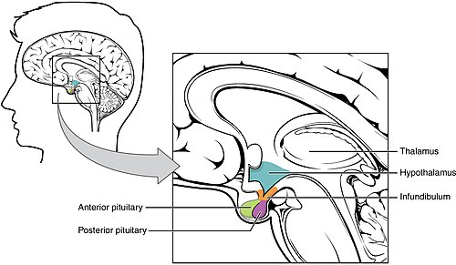

# TERAPIA HORMONAL DA MENOPAUSA: INDICAÇÕES E CONTRAINDICAÇÕES

Para entender a Terapia Hormonal da Menopausa (THM), você precisa parar de ver o climatério como uma "doença" e passar a enxergá-lo como um estado de hipoestrogenismo relativo ou absoluto. O seu papel, como médico, não é simplesmente "dar hormônio", mas sim realizar uma curadoria de riscos e benefícios.

Nas provas de residência, o examinador não quer saber se você decorou a bula. Ele quer saber se você sabe identificar quem pode, quem deve e, principalmente, quem JAMAIS pode receber hormônios. Vamos construir esse raciocínio juntos.

*Figura 1 - A menopausa (última menstruação, confirmada após 12 meses de amenorreia) marca o hipoestrogenismo definitivo. Indicações primárias da THM: sintomas vasomotores moderados a graves, síndrome geniturinária da menopausa e prevenção de osteoporose em pacientes com contraindicação a outras terapias. Fonte: National Cancer Institute, Domínio Público | Wikimedia Commons*

## O Cenário Fisiológico: Por que a paciente sofre?

Antes de falarmos de tratamento, precisamos entender o que está acontecendo no ovário. O climatério é o período de transição entre a fase reprodutiva e a não reprodutiva. A menopausa, por sua vez, é um marco retrospectivo: 12 meses consecutivos de amenorreia.

Fisiologicamente, o que ocorre é a ==exaustão dos folículos ovarianos==. Com menos folículos, temos menos ==Inibina B.== Como a Inibina B faz o feedback negativo no FSH, a primeira alteração laboratorial que vemos é o ==aumento do FSH==. Guarde isso: a Inibina B cai, o FSH sobe.

Quando os folículos acabam de vez, os níveis de estradiol despencam. Esse hipoestrogenismo é o culpado pelos sintomas vasomotores (os famosos fogachos) e pela Síndrome Geniturinária da Menopausa (secura vaginal, dispareunia e urgência miccional).

### O Diagnóstico: Quando pedir exames?

Aqui está o primeiro grande erro de muitos alunos. Na paciente ==com mais de 45 anos==, com quadro clínico clássico de irregularidade menstrual e fogachos, o diagnóstico de menopausa é CLÍNICO. Segundo a FEBRASGO, você não precisa de dosagens hormonais para iniciar a THM se o quadro for típico.

No entanto, se a paciente tem ==menos de 40 anos,== estamos diante de uma provável ==Insuficiência Ovariana Prematura (IOP).== Nesses casos, ou em situações de dúvida diagnóstica, solicitamos o FSH. Consideramos menopausa quando o FSH está acima de 40 mUI/mL.

Cuidado com a pegadinha: se a paciente ==usa Tamoxifeno== (um modulador seletivo do receptor de estrogênio), o ==FSH pode subir== porque o medicamento bloqueia o feedback negativo do estrogênio no eixo. Nesses casos, o FSH não serve para diagnosticar menopausa.

## Indicações da Terapia Hormonal: Quem deve tratar?

A THM não é para todas. Ela tem indicações precisas. O objetivo principal, e o que mais cai em prova, é o alívio dos sintomas vasomotores e a melhora da qualidade de vida.

As três indicações clássicas são:

- **Sintomas Vasomotores (Fogachos):** É a indicação número um. Se os fogachos interferem na vida da paciente, a THM é a primeira linha de tratamento.

- **Síndrome Geniturinária da Menopausa (SGM):** Dispareunia, secura vaginal e sintomas urinários. Se o sintoma for APENAS vaginal, a preferência é sempre pela via tópi==ca (estrogênio vaginal).==

- **Prevenção de Osteoporose:** A THM reduz a atividade osteoclástica e previne a perda de massa óssea. No entanto, ela só é indicada para este fim se a paciente também tiver sintomas climatéricos ou se não tolerar outras medicações específicas para osteoporose.

Como discutimos frequentemente no MedEvo, a "Janela de Oportunidade" é o conceito de ouro aqui. A THM deve ser iniciada, preferencialmente, em mulheres ==com menos de 60 anos== ou com ==menos de 10 anos de menopausa.== Por que? Porque nessa janela o benefício cardiovascular é real. Se você inicia a THM em uma mulher de 70 anos que nunca usou hormônio, o risco de infarto e AVC explode, pois as artérias dela provavelmente já possuem placas de ateroma que o estrogênio pode instabilizar.

## Contraindicações: Onde o perigo mora

Este é o tópico mais cobrado. Você precisa saber as contraindicações absolutas de cor. Se a questão mencionar qualquer um desses itens, a resposta NUNCA será terapia hormonal sistêmica.

### Contraindicações Absolutas (Proibido em qualquer dose sistêmica)

- **Câncer de Mama:** Mesmo que tenha sido há 20 anos, é contraindicação absoluta. O estrogênio pode estimular células residuais.

- **Lesões Precursoras de Câncer de Mama:** Como o carcinoma ductal in situ.

- **Câncer de Endométrio:** Especialmente os tipos estrogênio-dependentes.

- **Sangramento Vaginal de Causa Desconhecida:** Primeiro você investiga (biópsia, histeroscopia), depois você trata. Nunca dê hormônio sem saber de onde vem o sangue.

- **Doença Hepática Ativa e Grave:** O fígado metaboliza os hormônios. Se ele não funciona, a toxicidade aumenta.

- **Tromboembolismo Venoso (TEV) Atual ou Prévio:** TVP ou Embolia Pulmonar.

- **Eventos Tromboembólicos Arteriais:** História de Infarto Agudo do Miocárdio (IAM) ou AVC.

- **Porfiria Aguda:** Uma contraindicação clássica de prova que muitos esquecem.

- **Lúpus Eritematoso Sistêmico (LES) com alto risco trombótico:** Presença de anticorpos antifosfolípides.

### Contraindicações Relativas (Avaliar risco-benefício)

- **Hipertensão Arterial Sistêmica (HAS) não controlada:** ==Primeiro controla a pressão==, depois pensa em THM. Se controlada, a via transdérmica é preferível.

- **Diabetes Mellitus:** Não é contraindicação absoluta, mas ==exige cautela== e preferência pela via transdérmica.

- **Miomatose Uterina:** O ==estrogênio pode fazer o mioma crescer,== mas não é proibido.

- **Endometriose:** Risco de reativação de focos.

**Tabela 1: Resumo de Contraindicações Absolutas vs. Relativas**

| Contraindicações Absolutas | Contraindicações Relativas |
| --- | --- |
| Câncer de mama (atual ou prévio) | Hipertensão arterial não controlada |
| Câncer de endométrio | Diabetes Mellitus (preferir transdérmica) |
| Sangramento vaginal de causa desconhecida | Miomatose uterina sintomática |
| Doença hepática aguda e grave | Endometriose |
| Tromboembolismo venoso (TVP/EP) | Hipertrigliceridemia grave |
| Doença coronariana ou AVC | Tabagismo (preferir transdérmica) |
| Porfiria | |

*Figura 2 - Esquemas de THM: histerectomizada = estrogênio isolado; com útero = estrogênio + progestagênio (combinado contínuo pós-menopausa ou sequencial perimenopausa). Via transdérmica preferível em obesas, hipertrigliceridemia, risco de TEV e hepatopatas. Fonte: Domínio Público | Wikimedia Commons*

## Escolhendo o Esquema Terapêutico: Como prescrever?

Aqui o Dr. Will sempre lembra uma regra básica: **"Tem útero? Precisa de progesterona!"**

O estrogênio isolado em uma mulher com útero causa hiperplasia endometrial e, eventualmente, câncer de endométrio. A progesterona entra no esquema exclusivamente para proteger o endométrio.

### 1. Paciente Histerectomizada

Se a paciente não tem útero, ela só precisa de **Estrogênio Isolado**. Não há motivo para dar progesterona, exceto se ela tiver história de endometriose grave (para evitar a transformação maligna de focos residuais).

### 2. Paciente com Útero

Aqui temos duas opções de regime:

- **Combinado Cíclico:** O ==estrogênio é usado todos os dias==, e a progesterona é adicionada ==por 10 a 14 dias no mês.== Isso provoca um ==sangramento privativo mensal==. É ideal para a ==perimenopausa==, quando a mulher ainda sangra irregularmente.

- **Combinado Contínuo:** ==Estrogênio e progesterona são usados todos os dias, sem pausa.== O objetivo é a ==amenorreia.== É o esquema preferido para mulheres na pós-menopausa estabelecida (mais de 1 ano sem menstruar), pois ==evita o incômodo do sangramento== mensal.

### 3. Tibolona

A ==Tibolona== é um composto sintético que tem ação ==estrogênica, progestogênica e androgênica.== Ela é uma excelente opção para mulheres que têm diminuição da ==libido==, além dos fogachos. Ela é usada de forma contínua e, por ter ação progestogênica intrínseca, pode ser usada por mulheres com útero sem necessidade de outra progesterona.

## Vias de Administração: Oral ou Transdérmica?

A escolha da via não é estética, é metabólica.

**Via Oral:** Sofre o efeito de primeira passagem hepática. Isso aumenta a produção de fatores de coagulação e de SHBG (proteína que transporta hormônios sexuais). ==Também aumenta o HDL e reduz o LDL, mas pode elevar os triglicerídeos.==

- **Indicação:** Pacientes jovens, saudáveis, sem risco cardiovascular aumentado.

**Via Transdérmica (Gel ou Adesivo):** Não passa pelo fígado inicialmente. Por isso, tem um risco trombótico muito menor (quase nulo em doses baixas).

- **Indicação:** Pacientes hipertensas, diabéticas, fumantes, obesas, com risco de trombose aumentado ou com hipertrigliceridemia.

**Tabela 2: Comparativo de Vias de Administração**

| Característica | Via Oral | Via Transdérmica |
| --- | --- | --- |
| Primeira passagem hepática | Sim | Não |
| Risco de Trombose | Maior | Menor (preferencial) |
| Efeito nos Triglicerídeos | Pode aumentar | Neutro |
| Efeito no HDL/LDL | Mais favorável | Neutro |
| Indicação clássica | Mulher jovem e saudável | HAS, DM, Obesidade, Fumantes |

## O Uso da Testosterona na Mulher

Muitas pacientes chegam ao consultório pedindo "o hormônio da libido". A recomendação atual é clara: a testosterona só deve ser considerada para o **==Desejo Sexual Hipoativo Feminino==** em mulheres que já estão em ==THM estroprogestativa== e ==não tiveram melhora== da libido.

A ==dose deve ser muito baixa== (dose feminina), preferencialmente transdérmica, para evitar efeitos virilizantes (acne, hirsutismo, alteração da voz). Não existe indicação de testosterona para "ganho de massa muscular" ou "energia" em diretrizes oficiais de climatério.

## Tratamento Não Hormonal: Quando a THM é proibida

E se a paciente tiver um câncer de mama e estiver sofrendo com fogachos intensos? Você não pode dar hormônio, mas não pode deixá-la sem assistência.

As opções são:

- **Inibidores Seletivos da Recaptação de Serotonina ==(ISRS)== ou Noradrenalina (ISRSN):** A Venlafaxina e a Desvenlafaxina são as mais eficazes para fogachos. A Paroxetina também funciona, mas CUIDADO: ela não pode ser usada por pacientes em uso de Tamoxifeno, pois inibe a enzima CYP2D6, que ativa o Tamoxifeno.

- **==Gabapentina==:** Útil para fogachos noturnos, pois também ajuda no sono.

- **==Medidas Comportamentais==:** Evitar ambientes quentes, roupas leves, exercícios físicos (pelo menos 150 minutos por semana) e cessação do tabagismo.

## Situações Especiais e Pegadinhas de Prova

### O Estudo WHI (Women's Health Initiative)

Você precisa conhecer esse estudo porque ele mudou a história da THM. Publicado em ==2002==, ele mostrou um ==aumento no risco de câncer de mama== e ==eventos cardiovasculares==. No entanto, o erro do estudo foi incluir mulheres muito velhas (média de 63 anos), longe da janela de oportunidade. Hoje sabemos que, se iniciada na hora certa, a THM é segura. ==O risco absoluto de câncer de mama associado à THM é baixo== (menos de 1 caso extra para cada 1000 mulheres/ano de uso).

### Sangramento na Pós-Menopausa

==Se== uma paciente em ==THM contínua apresenta sangramento vaginal==, você deve avaliar o ==endométrio==. Se a ultrassonografia transvaginal mostrar um ==endométrio espessado (geralmente > 5mm== em quem não usa T==H ou > 8mm== em quem usa TH), a biópsia endometrial ou a histeroscopia é mandatória para excluir câncer de endométrio.

### BI-RADS 4A e THM

Imagine uma paciente que quer iniciar THM, mas a ==mamografia veio BI-RADS 4A==. A conduta é ==suspender ou não iniciar a THM== e realizar a core-biópsia imediatamente. ==Você só libera== o hormônio se o ==resultado histopatológico for benigno.==

### Câncer de Ovário

Diferente do câncer de mama, o ==câncer epitelial de ovário estádio I não é uma contraindicação absoluta.== Após o tratamento cirúrgico e quimioterápico, a ==THM pode ser discutida com a paciente==, avaliando os riscos e a qualidade de vida.

### O Papel da Tibolona

A ==Tibolona== é frequentemente cobrada como uma droga que ==não aumenta a densidade mamária== tanto quanto a THM combinada, sendo uma opção para mulheres com mamas muito densas na mamografia.

## Exames Pré-THM: O que pedir?

Antes de começar, você precisa do "check-up" básico:

- **==Mamografia==:** Deve estar atualizada (menos de 1 ano).

- **==Citologia Oncótica (Papanicolau)==:** Para rastreio de colo de útero.

- **==Perfil Lipídico e Glicemia de Jejum:==** Para escolher a melhor via (oral vs. transdérmica).

- **==Ultrassonografia Transvaginal==:** Para avaliar o ==eco endometrial== (especialmente se houver sangramento).

Lembrando: a dosagem de FSH não é obrigatória para mulheres acima de 45 anos sintomáticas.

## Resumo do Manejo Clínico

Imagine uma paciente de 52 anos, com útero, fogachos intensos que impedem o sono, sem comorbidades.

- **Conduta:** THM Combinada (Estrogênio + Progesterona). Como ela ainda tem ciclos irregulares, o esquema cíclico pode ser melhor para evitar sangramentos de escape.

Agora, uma paciente de 58 anos, histerectomizada, hipertensa e obesa, com secura vaginal importante.

- **Conduta:** Como ela é hipertensa e obesa, a via transdérmica é obrigatória. Como não tem útero, apenas estrogênio. Se o sintoma fosse APENAS vaginal, o estrogênio tópico seria a primeira escolha.

**Tabela 3: Escolha do Progestagênio (Proteção Endometrial)**

| Tipo de Progestagênio | Características |
| --- | --- |
| Progesterona Micronizada | "Bioidêntica", menor risco metabólico e de câncer de mama. |
| Medroxiprogesterona | Muito usada em estudos antigos (WHI), maior impacto metabólico. |
| Levonorgestrel | Pode ser usado via SIU ==(DIU de Mirena)== como proteção endometrial na THM. |
| Drospirenona | Ação antimineralocorticoide, boa para quem tem retenção hídrica. |

## Pontos-Chave para Prova

- **Definição de Menopausa:** 12 meses de amenorreia. Diagnóstico clínico em > 45 anos. Se < 40 anos, solicitar FSH (> 40 mUI/mL).

- **Janela de Oportunidade:** Iniciar THM em < 60 anos ou < 10 anos de menopausa para garantir benefício cardiovascular.

- **Contraindicação Absoluta #1:** Câncer de mama (atual ou prévio). Não importa o tempo de cura.

- **Contraindicação Absoluta #2:** Sangramento vaginal de causa desconhecida. Investigar antes de tratar.

- **Tem útero?** Obrigatório usar progesterona para prevenir câncer de endométrio.

- **Histerectomizada?** Estrogênio isolado (salvo casos raros de endometriose).

- **Via Transdérmica:** Escolha para hipertensas, diabéticas, obesas, fumantes e pacientes com risco de trombose.

- **Síndrome Geniturinária isolada:** Tratar com estrogênio tópico (creme ou óvulo). Não precisa de progesterona para proteção endometrial se o uso for apenas vaginal em doses baixas.

- **Trombose Venosa Profunda:** Contraindicação absoluta para THM oral. Se a paciente tiver apenas risco (sem evento prévio), a via transdérmica é a opção.

- **Câncer Colorretal:** A THM combinada reduz o risco de câncer colorretal (um dos poucos benefícios oncológicos demonstrados no WHI).

- **Osteoporose:** THM previne perda óssea, mas não é a primeira escolha isolada se não houver sintomas climatéricos.

- **Tamoxifeno:** Se a paciente tem fogachos usando Tamoxifeno, use Venlafaxina ou Desvenlafaxina. NUNCA use Paroxetina ou Fluoxetina (interação medicamentosa).

- **Porfiria Aguda:** É contraindicação absoluta. Guarde isso para as questões de "exceto".

- **Diabetes Mellitus:** Não proíbe a THM, mas prefira a via transdérmica para não interferir no metabolismo da glicose e dos lipídios.

- **Mamas Densas ou Mastalgia:** Tibolona pode ser uma alternativa interessante.

- **Falência Ovariana Prematura (IOP):** Nestas mulheres, a THM é mandatória até pelo menos a idade média da menopausa natural (50 anos) para proteger ossos e coração. 🏆

 Cópia offline para consulta pessoal.
 Fonte original:
 [https://www.medevo.com.br/material-apoio/ler/f7f0aae3-001d-4c5b-a66e-a3a7d8dcf0d8](https://www.medevo.com.br/material-apoio/ler/f7f0aae3-001d-4c5b-a66e-a3a7d8dcf0d8)
