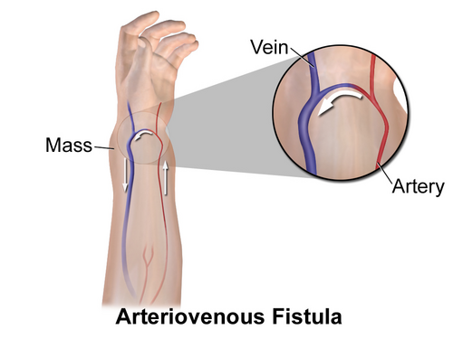

# TERAPIA RENAL SUBSTITUTIVA: URGÊNCIAS DIALÍTICAS E ACESSO

Quando falamos de Terapia Renal Substitutiva (TRS) em provas de residência, o examinador não quer apenas saber se você conhece a técnica. Ele quer saber se você sabe **quando** indicar, **como** acessar o paciente e, principalmente, se você consegue identificar as complicações que matam.

Muitos alunos decoram listas, mas erram a questão porque não entendem a prioridade clínica. Vamos construir esse raciocínio juntos, focando no que as 52 questões reais analisadas pelo MedEvo mostram que é essencial.

*Figura 1 - Indicações de urgência dialítica (mnemônico AEIOU): Acidose metabólica refratária, Eletrólitos (hipercalemia > 6,5 mEq/L refratária), Intoxicações (metanol, etilenoglicol, lítio, AAS), Overload hídrico (edema agudo de pulmão) e Uremia sintomática (pericardite, encefalopatia). Fonte: Domínio Público | Wikimedia Commons*

## Indicações de Diálise de Urgência: O Mnemônico AEIOU

Este é o ponto de partida obrigatório. Se você for para a prova sem o "AEIOU", você já entra perdendo. Mas cuidado: as bancas adoram colocar valores laboratoriais alterados que **não** são indicações de diálise isoladamente.

### A - Acidose Metabólica

Não é qualquer acidose. É a acidose metabólica grave (geralmente pH < 7,1 - 7,2) e, fundamentalmente, **refratária** ao tratamento clínico (bicarbonato). Se o paciente tem uma cetoacidose diabética (CAD), como vimos em questões recentes, o tratamento inicial é insulina e volume. Você só vai dialisar a CAD se houver uma Injúria Renal Aguda (IRA) grave associada que impeça a correção da acidose pelo manejo padrão.

### E - Eletrólitos (Hipercalemia)

Aqui mora o maior perigo. A indicação é a **Hipercalemia Refratária** ou com **Alterações Eletrocardiográficas**.

- **Erro clássico:** Achar que K+ de 5,5 mEq/L é indicação de diálise. Não é.

- **O que cai:** Paciente com potássio de 6,5 mEq/L e onda T apiculada ou QRS alargado.

Por que o ECG manda mais que o número? Porque o potássio extracelular elevado altera o limiar de excitabilidade dos miócitos. Se o ECG mudou, o paciente pode fibrilar a qualquer momento.

### I - Intoxicações Exógenas

Algumas substâncias são "dialisáveis" (baixo peso molecular, baixa ligação proteica, baixo volume de distribuição). O mnemônico clássico para as substâncias é o **SLIME**: Salicilatos, Lítio, Isopropanol, Metanol e Etilenoglicol.

### O - Overload (Sobrecarga Hídrica)

A indicação é a hipervolemia **refratária** a diuréticos. O cenário típico de prova é o paciente com edema agudo de pulmão (EAP) que não responde a doses altas de furosemida. Se o paciente está urinando e respondendo ao diurético, a diálise pode esperar.

### U - Uremia Grave/Sintomática

Cuidado aqui: ureia de 200 mg/dL isolada **não** é indicação absoluta de diálise se o paciente estiver assintomático. A diálise é indicada quando a uremia causa complicações graves:

- **Encefalopatia Urêmica:** Rebaixamento do nível de consciência, asterixe (flapping).

- **Pericardite Urêmica:** Dor torácica que melhora ao inclinar para frente, atrito pericárdico, elevação difusa de ST no ECG. **Atenção:** Pericardite urêmica é indicação ABSOLUTA e imediata.

- **Diátese Hemorrágica:** A uremia causa disfunção plaquetária (o sangue não coagula bem). Se o paciente urêmico começa a sangrar, a diálise é o tratamento.

| Indicação (AEIOU) | Critério de Urgência | O que NÃO é indicação isolada |
| --- | --- | --- |
| **A**cidose | pH < 7,1 refratário | pH 7,3 com bicarbonato baixo |
| **E**letrólitos | K+ > 6,5 ou alteração no ECG | K+ 5,8 sem alteração no ECG |
| **I**ntoxicações | Lítio, Metanol, Salicilatos | Benzodiazepínicos |
| **O**verload | Edema Agudo de Pulmão refratário | Edema de membros inferiores +/4 |
| **U**remia | Pericardite, Encefalopatia, Sangramento | Ureia 180 mg/dL assintomático |

## Manejo da Hipercalemia Grave: O Passo a Passo

Imagine o cenário: Paciente com DRC chega à emergência com fraqueza, K+ de 7,2 mEq/L e onda T em "tenda" no ECG. O Dr. Will sempre reforça: a primeira conduta não é a diálise, é a **estabilização do miocárdio**.

- **Gluconato de Cálcio 10% (10-20 ml IV):** Ele não baixa o potássio! Ele apenas estabiliza a membrana do miócito para evitar arritmias fatais. Age em 1-3 minutos.

- **Medidas de "Shift" (Entrada de K+ na célula):** Glicose + Insulina (Glicoinsulinoterapia), Bicarbonato de sódio (se acidose) e Beta-2 agonistas inalatórios. Isso ganha tempo, mas o potássio continua no corpo.

- **Remoção de Potássio:** Diuréticos de alça (se houver função renal residual), resinas de troca (Sorcal - ação lenta, não serve para urgência extrema) e, finalmente, a **Hemodiálise**.

**Dica de Prova:** Se a questão pergunta a conduta "definitiva" para remover o potássio em um paciente anúrico, a resposta é Hemodiálise. Se pergunta a conduta "imediata" para proteger o coração, é Gluconato de Cálcio.

## Métodos de Terapia Renal Substitutiva

Existem três formas principais de substituir a função renal. A escolha depende da estabilidade do paciente e da disponibilidade do serviço.

### 1. Hemodiálise (HD)

É o método mais comum. O sangue passa por um filtro (dialisador) onde ocorre a troca de solutos por difusão e a retirada de líquido por ultrafiltração.

- **Vantagem:** Rápida remoção de solutos e potássio.

- **Desvantagem:** Exige estabilidade hemodinâmica. Se o paciente está chocado (noradrenalina em dose alta), a HD convencional pode derrubar a pressão ainda mais.

### 2. Métodos Contínuos e SLEDD

A **SLEDD** (Hemodiálise Estendida) é um meio-termo. É uma diálise mais lenta (6 a 12 horas) que permite retirar líquido de forma mais suave.

- **Indicação de Ouro:** Paciente crítico em UTI, instável hemodinamicamente, com sobrecarga hídrica. Guarde isso: instabilidade = SLEDD ou métodos contínuos.

### 3. Diálise Peritoneal (DP)

Usa o peritônio como membrana semipermeável. Um líquido (dialisato) é infundido na cavidade abdominal.

- **Vantagem:** Pode ser feita em casa, preserva a função renal residual por mais tempo que a HD.

- **Contraindicações Absolutas (Cai muito!):**

- Cirurgia abdominal recente (pós-operatório imediato).

- Hérnia diafragmática (o líquido sobe para o tórax).

- Hérnia inguinal bilateral não corrigida (risco de encarceramento).

- Perda de função da membrana peritoneal (fibrose).

*Figura 2 - O acesso vascular ideal para hemodiálise crônica é a fístula arteriovenosa (FAV) — menor risco de infecção e trombose. Deve ser confeccionada com antecedência (mínimo 6-8 semanas para maturação). Em urgência, usa-se cateter venoso central de duplo lúmen (jugular interna > femoral > subclávia). Fonte: National Cancer Institute, Domínio Público | Wikimedia Commons*

## Acessos Vasculares: Onde o Sangue Sai e Entra

Para a hemodiálise, precisamos de um fluxo de sangue alto (cerca de 300-400 ml/min). Uma veia comum colapsaria. Por isso, precisamos de acessos especiais.

### Fístula Arteriovenosa (FAV)

É a união cirúrgica de uma artéria com uma veia (ex: rádio-cefálica). A veia "arterializa", ou seja, fica grossa e com fluxo alto.

- **Padrão-ouro:** Menor risco de infecção e maior durabilidade.

- **Timing:** Deve ser confeccionada quando a Taxa de Filtração Glomerular (TFGe) está entre **20-25 mL/min** ou Creatinina > 4 mg/dL, idealmente 6 a 12 meses antes de precisar da diálise. Por que tanto tempo? Porque a fístula precisa "maturar" (6-8 semanas).

### Cateteres Venosos Centrais (CVC)

Usados quando precisamos de diálise imediata ou quando a FAV falhou.

- **Cateter de Curta Permanência (Shilley):** Inserido em veia jugular interna ou femoral. Alto risco de infecção e estenose venosa. Não deve ficar mais que 2-3 semanas.

- **Cateter de Longa Permanência (Permcath):** É tunelizado sob a pele, o que reduz o risco de infecção. Usado como "ponte" enquanto a FAV matura.

**Pegadinha de Prova:** Nunca use a veia subclávia para acesso de diálise se houver intenção de fazer uma FAV no futuro. O risco de estenose da subclávia é altíssimo, o que inviabilizaria a fístula naquele braço.

| Tipo de Acesso | Vantagens | Desvantagens |
| --- | --- | --- |
| **FAV** | Baixa infecção, longa duração | Precisa de semanas para maturar |
| **Permcath** | Uso imediato após inserção | Maior risco de infecção que a FAV |
| **Shilley** | Emergência total | Altíssimo risco de infecção e estenose |

## Complicações da Diálise: O que pode dar errado?

### Durante a Sessão de Hemodiálise

- **Hipotensão Arterial:** A complicação mais comum. Ocorre por retirada de líquido mais rápida do que o corpo consegue compensar.

- **Cãibras Musculares:** Geralmente associadas à ultrafiltração excessiva e alterações eletrolíticas.

- **Síndrome do Desequilíbrio Dialítico:** Ocorre mais na primeira diálise de um paciente com ureia muito alta. A ureia sai rápido do sangue, mas demora a sair do cérebro. Isso cria um gradiente osmótico que puxa água para dentro dos neurônios (edema cerebral). Sintomas: cefaleia, náuseas, convulsão. **Prevenção:** Fazer a primeira diálise mais curta e com fluxos menores.

### Complicações Infecciosas

O paciente em HD é imunossuprimido pela própria uremia.

- **Bacteremia por S. aureus:** Muito comum em quem usa cateter. Se o paciente tem febre, dor lombar e incontinência urinária, suspeite de **Abscesso Epidural Espinhal**. A conduta é RM de coluna urgente.

- **Peritonite na DP:** O diagnóstico é clínico (dor abdominal + efluente turvo) + laboratorial (contagem de células no líquido peritoneal > 100/mm³ com > 50% de polimorfonucleares). Se for por *Pseudomonas* ou fungos, geralmente exige a retirada do cateter.

### Complicações Crônicas e Sistêmicas

- **Osteodistrofia Renal:** A diálise melhora os sintomas agudos, mas **não reverte** as alterações ósseas já estabelecidas. O manejo do fósforo e do PTH é contínuo.

- **Fibrose Sistêmica Nefrogênica (FSN):** Associada ao uso de **Gadolínio** (contraste de RM) em pacientes com TFGe < 15-30 mL/min. É uma doença cutânea fibrosante grave e progressiva. Evite gadolínio nesses pacientes!

- **Toxicidade por Nitroprussiato de Sódio:** Em pacientes com IRC, o uso de nitroprussiato para crises hipertensivas aumenta o risco de acúmulo de tiocianato/cianeto, pois a excreção é renal.

## Hipertensão Arterial no Paciente Dialítico

O controle da PA no paciente em diálise é um desafio. A dica de ouro para a prova é: **a medida da PA durante a diálise não serve para diagnóstico de hipertensão.**

- **PA Pré-diálise:** Geralmente está superestimada pela sobrecarga de volume.

- **PA Pós-diálise:** Pode estar subestimada pela depleção aguda de volume.

- **Melhor medida:** No período interdialítico (em casa ou via MAPA).

A causa número 1 de hipertensão nesses pacientes é a **sobrecarga hídrica**. Antes de entupir o paciente de remédios, devemos tentar atingir o "peso seco" (o peso ideal sem excesso de líquido).

## Situações Especiais e Transplante

### Transplante Rim-Pâncreas

Indicado principalmente para pacientes com **Diabetes Mellitus Tipo 1** que evoluíram com Insuficiência Renal Terminal. O transplante combinado melhora a sobrevida e a qualidade de vida, pois trata a causa base (diabetes) e a consequência (IRC).

### Transplante Pré-emptivo

É o transplante realizado **antes** do paciente iniciar a diálise. É a melhor opção em termos de sobrevida, especialmente se o doador for vivo.

### Hiperfosfatemia em Pediatria

Crianças em HD têm dificuldade em manter o crescimento se o fósforo estiver alto. Se a dieta e os quelantes não funcionarem, a estratégia é **aumentar a frequência ou o tempo** das sessões de diálise para otimizar a remoção de fósforo.

## Exemplo Clínico para Fixação

**Caso:** Homem, 58 anos, DRC estágio 5D (em hemodiálise via cateter jugular). Chega ao pronto-socorro com febre (38,5°C), calafrios durante a última sessão de diálise e dor lombar intensa há 2 dias. Ao exame: dor à percussão da coluna lombar.

**Raciocínio do Professor:**

- Paciente em HD com cateter + Febre = **Bacteremia associada ao cateter** até que se prove o contrário.

- Febre + Dor lombar localizada = Suspeita de **Osteomielite ou Abscesso Epidural**.

- O germe mais provável é o *Staphylococcus aureus*.

- **Conduta:** Coletar hemoculturas (do cateter e periférica), iniciar antibiótico empírico (Vancomicina + Ceftazidima/Gentamicina) e solicitar **RM de coluna** imediatamente.

## Pontos-Chave para Prova

- **AEIOU da Diálise de Urgência:** Acidose (pH < 7,1 refratária), Eletrólitos (K+ > 6,5 ou ECG alterado), Intoxicações (SLIME), Overload (EAP refratário), Uremia (Pericardite, Encefalopatia, Sangramento).

- **K+ isolado:** Um valor de potássio alto sem alteração no ECG e sem ser refratário ao tratamento clínico NÃO é indicação absoluta imediata de diálise.

- **Gluconato de Cálcio:** Estabiliza o coração na hipercalemia, mas não reduz o nível de potássio no sangue.

- **Contraindicações Absolutas da DP:** Cirurgia abdominal recente, hérnia diafragmática, hérnia inguinal bilateral.

- **Acesso Padrão-Ouro:** Fístula Arteriovenosa (FAV). Deve ser feita com TFGe < 20-25 mL/min.

- **Estenose de Subclávia:** Nunca puncionar subclávia em paciente que vai precisar de FAV no futuro.

- **Síndrome do Desequilíbrio:** Edema cerebral por queda rápida da ureia na primeira diálise.

- **Pericardite Urêmica:** É indicação de diálise imediata. O ECG mostra infra de PR e supra de ST difuso.

- **Gadolínio:** Risco de Fibrose Sistêmica Nefrogênica em pacientes com TFGe < 30.

- **Nitroprussiato de Sódio:** Risco de intoxicação por cianeto/tiocianato na IRC.

- **Peso Seco:** É o principal alvo no tratamento da hipertensão em pacientes dialíticos.

- **Peritonite na DP:** Diagnóstico com > 100 leucócitos/mm³ e > 50% de polimorfonucleares no efluente.

- **S. aureus:** Principal causa de sepse em pacientes com cateter de diálise.

- **Ureia > 200 mg/dL:** Sozinha não é indicação de diálise; procure por sintomas urêmicos.

- **SLEDD:** Escolha para o paciente instável na UTI que precisa de diálise.

- **Anemia na DRC:** É uma complicação tratada com eritropoetina e ferro, NÃO é indicação de diálise.

- **Cãibras na HD:** Geralmente causadas por ultrafiltração excessiva (retirada de muito líquido).

- **Transplante Rim-Pâncreas:** Melhor opção para DM1 com insuficiência renal terminal.

Como o Dr. Will sempre diz nas aulas do MedEvo: "Na nefrologia, o número assusta, mas o que manda é a clínica". Se o paciente está bem, trate o exame. Se o paciente está mal (AEIOU), chame a diálise.

 Cópia offline para consulta pessoal.
 Fonte original:
 [https://www.medevo.com.br/material-apoio/ler/c6cf56ba-4f1f-4552-9d4e-d60c7e3fd7e2](https://www.medevo.com.br/material-apoio/ler/c6cf56ba-4f1f-4552-9d4e-d60c7e3fd7e2)
