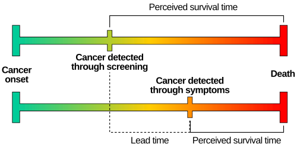
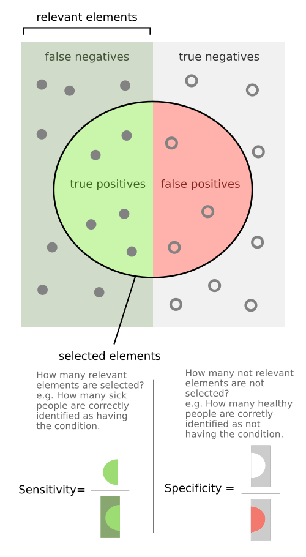

# TESTES DIAGNÓSTICOS

Para entender testes diagnósticos, você precisa primeiro mudar sua mentalidade de estudante e assumir a postura de um médico à beira do leito. Na faculdade, aprendemos que o teste "dá o diagnóstico". Na vida real e nas provas de residência, o teste é apenas uma ferramenta para reduzir a incerteza. O que as bancas querem saber não é se você sabe decorar uma fórmula, mas se você entende como o resultado de um exame altera a probabilidade de o seu paciente estar doente.

*Figura 2 - Ilustração do lead-time bias: o rastreamento antecipa o diagnóstico sem necessariamente alterar o curso da doença, gerando a ilusão de maior sobrevida. Fonte: Mcstrother, CC BY 3.0 | Wikimedia Commons*

## A Tabela de Contingência (2x2): O Mapa do Tesouro

Tudo em epidemiologia clínica nasce de uma tabela simples, mas que confunde muita gente. Para não errar nunca mais, imagine que o "Padrão-Ouro" (o teste perfeito, que nunca erra) está sempre nas colunas, e o "Teste em Estudo" está nas linhas.

| | Doente (Padrão-Ouro +) | Saudável (Padrão-Ouro -) | Total |
| --- | --- | --- | --- |
| **Teste Positivo** | Verdadeiro Positivo (a) | Falso Positivo (b) | a + b |
| **Teste Negativo** | Falso Negativo (c) | Verdadeiro Negativo (d) | c + d |
| **Total** | a + c | b + d | N |

Aqui está o primeiro segredo que o Dr. Will sempre reforça nas aulas da MedEvo: as colunas (verticais) definem as propriedades intrínsecas do teste (Sensibilidade e Especificidade). As linhas (horizontais) definem o que acontece na prática clínica (Valores Preditivos).

*Figura 1 - Diagrama ilustrando os conceitos de sensibilidade e especificidade em testes diagnósticos, com verdadeiros positivos, falsos positivos, verdadeiros negativos e falsos negativos. Fonte: Walber, FeanDoe, CC BY-SA 4.0 | Wikimedia Commons*

## Sensibilidade: O Rastreador

A sensibilidade é a capacidade do teste de identificar corretamente os doentes. Olhando para a nossa tabela, focamos apenas na primeira coluna (os doentes). Dos que têm a doença (a+c), quantos o teste conseguiu "pegar" (a)?

**Fórmula: S = a / (a + c)**

Por que usamos testes sensíveis? Porque eles são ótimos para triagem. Um teste 100% sensível não deixa passar nenhum doente. Se o resultado vier negativo em um teste muito sensível, você pode descartar a doença com segurança. É o famoso "SNOUT" (Sensitivity Rules Out).

Um erro clássico de prova é achar que um teste sensível é bom para confirmar diagnóstico. Não é. Se o teste é muito sensível, ele pode "chutar" muito para cima e acabar pegando gente saudável no meio (gerando falsos positivos).

### O Falso Negativo (FN)

O falso negativo é o pesadelo da sensibilidade. Se um teste tem sensibilidade de 90%, significa que 10% dos doentes receberão um resultado negativo (c). Em doenças graves e transmissíveis, como a Tuberculose ou o HIV, queremos minimizar o FN ao máximo. Por isso, na suspeita de TB pulmonar com tosse há mais de 3 semanas, a baciloscopia direta do escarro é fundamental, mas se vier negativa e a suspeita for alta, precisamos de métodos mais sensíveis, como o Teste Rápido Molecular.

## Especificidade: O Confirmador

A especificidade é a capacidade do teste de identificar corretamente os saudáveis. Agora, olhamos apenas para a segunda coluna da tabela. Dos que não têm a doença (b+d), quantos o teste disse corretamente que eram negativos (d)?

**Fórmula: E = d / (b + d)**

Testes específicos são usados para confirmar o diagnóstico. Se um teste é 100% específico, ele não dá falso positivo. Se deu positivo, pode acreditar: o paciente tem a doença. É o "SPIN" (Specificity Rules In).

### O Falso Positivo (FP)

O falso positivo é o inimigo da especificidade. Se um teste tem especificidade de 80%, 20% das pessoas saudáveis serão diagnosticadas erroneamente como doentes (b). Isso gera iatrogenia, ansiedade e gastos desnecessários. Um exemplo clássico de prova é o VDRL para Sífilis. Ele é muito sensível, mas pouco específico (pode dar positivo em lúpus, gestação, infecções virais). Por isso, sempre confirmamos um VDRL positivo com um teste treponêmico (como o FTA-Abs ou Teste Rápido), que é muito mais específico.

## O Dilema do Ponto de Corte

A maioria dos testes médicos não é "sim ou não", mas sim um valor numérico (glicemia, PSA, pressão arterial). Quem decide o que é "normal" ou "doente" é o ponto de corte.

Se você move o ponto de corte para a esquerda (para pegar mais gente), você aumenta a Sensibilidade, mas inevitavelmente diminui a Especificidade (começa a pegar saudáveis por engano). Se você move para a direita (para ser mais rigoroso), você aumenta a Especificidade, mas diminui a Sensibilidade (começa a deixar passar doentes).

As bancas amam cobrar essa gangorra. Lembre-se: Sensibilidade e Especificidade são inversamente proporcionais quando alteramos o ponto de corte de um mesmo teste.

## Valores Preditivos: A Vida Real

Aqui é onde o aluno costuma travar, mas é o que mais cai em prova. Imagine que você é um clínico. O paciente chega com um papel de exame positivo na mão. Ele pergunta: "Doutor, qual a chance de eu estar doente?".

Nesse momento, a Sensibilidade não importa mais, porque você já sabe que o teste é positivo. Você quer saber o Valor Preditivo Positivo (VPP).

### Valor Preditivo Positivo (VPP)

É a probabilidade de o paciente ter a doença dado que o teste foi positivo. Olhamos para a primeira linha da tabela.
**Fórmula: VPP = a / (a + b)**

### Valor Preditivo Negativo (VPN)

É a probabilidade de o paciente ser saudável dado que o teste foi negativo. Olhamos para a segunda linha da tabela.
**Fórmula: VPN = d / (c + d)**

### O Pulo do Gato: A Influência da Prevalência

Esta é a regra de ouro para qualquer prova de Medicina Preventiva:

- Sensibilidade e Especificidade são características intrínsecas do teste. Elas NÃO mudam com a prevalência.

- Valores Preditivos (VPP e VPN) DEPENDEM diretamente da prevalência (probabilidade pré-teste).

Se a prevalência da doença aumenta na população:

- O VPP aumenta (é mais fácil um positivo ser verdadeiro se a doença é comum).

- O VPN diminui (é mais fácil um negativo ser falso se a doença está em todo lugar).

Se a prevalência diminui (doença rara):

- O VPP diminui (a maioria dos positivos será falso positivo).

- O VPN aumenta.

Exemplo clínico: Se você pede um PSA para um jovem de 20 anos (baixa prevalência), um resultado alterado provavelmente é um falso positivo. Se você pede para um senhor de 75 anos com próstata endurecida (alta prevalência), o mesmo resultado positivo tem um VPP altíssimo.

| Propriedade | Depende da Prevalência? | Utilidade Principal |
| --- | --- | --- |
| Sensibilidade | Não | Triagem (excluir doença) |
| Especificidade | Não | Confirmação (fechar diagnóstico) |
| VPP | Sim (Diretamente) | Interpretar resultado positivo |
| VPN | Sim (Inversamente) | Interpretar resultado negativo |

## Acurácia: O Acerto Geral

A acurácia mede a proporção de acertos totais do teste (Verdadeiros Positivos + Verdadeiros Negativos) em relação ao total de testados.

**Fórmula: Acurácia = (a + d) / N**

Cuidado: um teste pode ser muito acurado apenas porque a doença é muito rara e ele dá negativo para todo mundo. Por isso, a acurácia sozinha pode ser enganosa em epidemiologia.

## Razão de Verossimilhança (Likelihood Ratio)

A Razão de Verossimilhança (RV) é uma forma de expressar quanto um resultado de teste aumenta ou diminui a probabilidade pré-teste de uma doença. A grande vantagem é que, assim como a sensibilidade, a RV não muda com a prevalência.

- **RV Positiva (RV+):** Sensibilidade / (1 - Especificidade). Indica quanto o teste positivo é mais provável em doentes do que em saudáveis. Quanto maior que 1, melhor o teste para confirmar.

- **RV Negativa (RV-):** (1 - Sensibilidade) / Especificidade. Quanto mais próxima de 0, melhor o teste para excluir a doença.

Se uma questão te der a probabilidade pré-teste (prevalência) e a RV, você usa o Nomograma de Fagan para achar a probabilidade pós-teste. Isso é o puro raciocínio Bayesiano aplicado à medicina.

## Curva ROC: A Visualização da Performance

A Curva ROC (Receiver Operating Characteristic) é um gráfico onde o eixo Y é a Sensibilidade e o eixo X é (1 - Especificidade), que nada mais é do que a taxa de falsos positivos.

Cada ponto na curva representa um ponto de corte diferente.

- O ponto ideal da curva é o canto superior esquerdo (100% de sensibilidade e 100% de especificidade).

- A linha diagonal (45 graus) representa o acaso (o teste é tão bom quanto jogar uma moeda).

- A Área Abaixo da Curva (AUC) mede a acurácia do teste. Quanto maior a área (mais perto de 1), melhor o teste.

Se a banca mostrar duas curvas, a que estiver mais "encostada" no canto superior esquerdo representa o teste superior.

## Aplicações Práticas e Pérolas de Prova

### HIV: O Fluxograma do Ministério da Saúde

O diagnóstico de HIV no Brasil segue fluxogramas rigorosos para evitar o impacto devastador de um falso positivo.

- Começamos com um teste muito sensível (geralmente um imunoensaio de 4ª geração que detecta anticorpos e o antígeno p24).

- Se positivo, realizamos um segundo teste, diferente do primeiro, para confirmar.

- Em casos de discordância, entra o teste de biologia molecular (Carga Viral).

Lembre-se: em populações de baixa prevalência, mesmo um teste de HIV com 99% de especificidade gerará muitos falsos positivos se testarmos todo mundo indiscriminadamente.

### Sífilis: A Interpretação Sequencial

- **VDRL:** Teste não treponêmico. É o teste de batalha. Serve para triagem e, principalmente, para controle de cura (os títulos devem cair após o tratamento). Pode ser falso positivo em diversas condições.

- **Testes Treponêmicos (FTA-Abs, Teste Rápido):** São os primeiros a positivar e geralmente ficam positivos para o resto da vida (cicatriz sorológica). Não servem para controle de cura.

### Tuberculose e o PPD

O PPD (Prova Tuberculínica) avalia a imunidade celular. Um erro comum é achar que PPD positivo diagnostica TB ativa. Não diagnostica. Ele indica infecção latente (ILTB).
Falsos negativos no PPD ocorrem em: técnica incorreta, desnutrição, imunossupressão (HIV com CD4 baixo), sarampo ou uso de corticoides.

### COVID-19 (RT-PCR vs. Sorologia)

- **RT-PCR:** Padrão-ouro na fase aguda. Alta especificidade (quase 100%), mas a sensibilidade varia conforme o dia da coleta (pico entre o 3º e 5º dia de sintomas).

- **Sorologia:** Útil para estudos epidemiológicos e diagnóstico tardio. Não deve ser usada para decisão de isolamento na fase aguda.

## Sobrediagnóstico e Prevenção Quaternária

Este tema está despencando nas provas de Preventiva. Sobrediagnóstico (overdiagnosis) não é o mesmo que falso positivo.

- **Falso Positivo:** O teste diz que você tem a doença, mas você não tem.

- **Sobrediagnóstico:** O teste diz que você tem a doença, você REALMENTE tem a alteração histológica/biológica, mas essa doença nunca causaria sintomas ou morte se não tivesse sido descoberta.

O exemplo clássico é o rastreamento de câncer de próstata com PSA ou alguns tipos de câncer de mama detectados na mamografia em mulheres muito idosas. O paciente acaba sendo tratado (cirurgia, quimioterapia) para algo que não o mataria, sofrendo apenas os efeitos colaterais. A Prevenção Quaternária é justamente o conjunto de ações que visa evitar o excesso de intervenções diagnósticas e terapêuticas desnecessárias.

## Raciocínio Diagnóstico: Hipotético-Dedutivo

Na Atenção Primária à Saúde (APS), o médico utiliza o raciocínio hipotético-dedutivo. Você formula hipóteses baseadas na anamnese e exame físico (que têm sensibilidade e especificidade próprias!) e usa os testes para confirmar ou afastar essas hipóteses. A APS funciona como um filtro: ao selecionar quem vai fazer o exame baseado na clínica, você aumenta a probabilidade pré-teste, o que faz o VPP do exame subir drasticamente.

## Tabelas Comparativas para Fixação

### Tabela 1: Sensibilidade vs. Especificidade

| Característica | Sensibilidade (S) | Especificidade (E) |
| --- | --- | --- |
| **Foco** | Doentes | Saudáveis |
| **Objetivo** | Não perder nenhum caso | Não rotular saudáveis |
| **Resultado Negativo** | Ótimo para excluir (SNOUT) | Pouco informativo |
| **Resultado Positivo** | Pouco informativo | Ótimo para confirmar (SPIN) |
| **Fase do Diagnóstico** | Triagem / Rastreamento | Confirmação |
| **Exemplo** | Elisa para HIV, VDRL | Western Blot, Teste Treponêmico |

### Tabela 2: O Impacto da Prevalência (O que cai na prova!)

| Se a Prevalência ↑ | Se a Prevalência ↓ |
| --- | --- |
| Sensibilidade: Não muda | Sensibilidade: Não muda |
| Especificidade: Não muda | Especificidade: Não muda |
| **VPP: Aumenta** | **VPP: Diminui** |
| **VPN: Diminui** | **VPN: Aumenta** |
| Acurácia: Geralmente aumenta | Acurácia: Geralmente diminui |

### Tabela 3: Erros e Vieses em Testes Diagnósticos

| Viés | Descrição |
| --- | --- |
| **Viés de Seleção** | O teste é validado em pacientes muito graves, mas usado em pacientes leves. |
| **Viés de Aferição** | O examinador sabe quem é doente ao interpretar o teste (falta de cegamento). |
| **Viés de Tempo de Antecipação (Lead-time)** | O rastreamento detecta a doença cedo, dando a impressão de sobrevida maior, mas o desfecho final é o mesmo. |
| **Viés de Sobrevida (Length-time)** | O rastreamento detecta preferencialmente doenças de evolução lenta (menos graves). |

## Estratégias de Testagem: Paralelo vs. Serial

Quando usamos mais de um teste, podemos combiná-los de duas formas:

-

**Testes em Paralelo:** Você pede os dois ao mesmo tempo. Se QUALQUER UM vier positivo, você considera o paciente doente.

- **Resultado:** Aumenta a Sensibilidade e o VPN (você não quer perder nada).

- **Preço:** Diminui a Especificidade (aumenta falsos positivos).

- **Uso:** Emergências (ex: Troponina + ECG no IAM).

-

**Testes em Série:** Você pede o primeiro. Se for positivo, você pede o segundo para confirmar.

- **Resultado:** Aumenta a Especificidade e o VPP (você só fecha o diagnóstico se ambos concordarem).

- **Preço:** Diminui a Sensibilidade (você pode perder casos se o primeiro teste falhar).

- **Uso:** Doenças com tratamento tóxico ou estigmatizantes (ex: HIV, Câncer).

## Pontos-Chave para Prova

- Sensibilidade é a proporção de verdadeiros positivos entre todos os doentes: VP / (VP + FN).

- Especificidade é a proporção de verdadeiros negativos entre todos os saudáveis: VN / (VN + FP).

- VPP e VPN são as únicas medidas que variam com a prevalência da doença na população.

- O VPP é diretamente proporcional à prevalência; o VPN é inversamente proporcional.

- Acurácia é a soma dos acertos (VP + VN) dividida pelo total de indivíduos testados.

- A Curva ROC avalia a performance do teste em diferentes pontos de corte; a área sob a curva (AUC) define a acurácia.

- Teste de Triagem deve ser muito SENSÍVEL (para não deixar passar ninguém).

- Teste de Confirmação deve ser muito ESPECÍFICO (para não tratar quem não precisa).

- Sobrediagnóstico é detectar uma doença que não progrediria para sintomas ou morte; é um alvo da Prevenção Quaternária.

- No HIV, o diagnóstico em adultos requer dois testes positivos (geralmente imunoensaios de 4ª geração).

- Na Sífilis, o VDRL é usado para triagem e seguimento (títulos caem); testes treponêmicos confirmam o diagnóstico.

- Probabilidade Pré-teste é sinônimo de Prevalência no contexto do raciocínio clínico.

- A Razão de Verossimilhança Positiva (RV+) acima de 10 indica que o teste é excelente para confirmar a doença.

- A Razão de Verossimilhança Negativa (RV-) abaixo de 0,1 indica que o teste é excelente para excluir a doença.

- Falsos negativos no PPD podem ocorrer por imunossupressão, desnutrição ou erro de técnica; não excluem TB ativa.

- O RT-PCR para COVID-19 tem especificidade próxima a 100%, mas sua sensibilidade depende do tempo de início dos sintomas.

- O aumento do ponto de corte de um teste (tornando-o mais rigoroso) aumenta a especificidade e diminui a sensibilidade.

- O erro metodológico mais comum em estudos de eficácia é a ausência de um grupo controle adequado. 🩺

 Cópia offline para consulta pessoal.
 Fonte original:
 [https://www.medevo.com.br/material-apoio/ler/7711403e-c744-4c68-9e87-436e69872dfe](https://www.medevo.com.br/material-apoio/ler/7711403e-c744-4c68-9e87-436e69872dfe)
