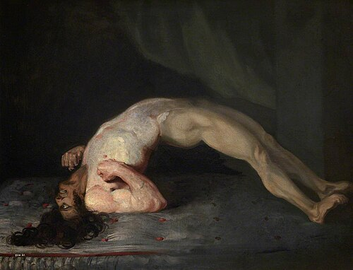
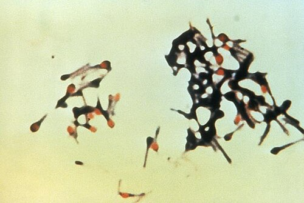

# TÉTANO

Para entender o tétano, você não pode pensar nele como uma "infecção comum". No seu plantão de cirurgia ou pronto-socorro, você verá que o problema não é a bactéria se multiplicando e destruindo tecidos (como em uma celulite), mas sim a **toxina** que ela libera. O *Clostridium tetani* é apenas o veículo; o veneno é a tetanospasmina.

Nas provas de residência, o examinador quer saber se você sabe manejar o ferimento para evitar a doença e se você reconhece o quadro clínico clássico, que é inconfundível, mas que muitos alunos erram por tentarem "inventar" diagnósticos mais complexos.

*Figura 1 - Pintura clássica de Sir Charles Bell (1809) mostrando opistótono tetânico: hiperextensão do corpo por espasmo muscular generalizado. A tetanospasmina do Clostridium tetani bloqueia a liberação de GABA e glicina nos interneurônios inibitórios, causando contração muscular mantida. Fonte: Sir Charles Bell, Domínio Público | Wikimedia Commons*

## Fisiopatologia: Por que o paciente "trava"?

O *Clostridium tetani* é um bacilo gram-positivo, anaeróbio obrigatório e esporulado. Guarde essa palavra: **esporulado**. O esporo é a forma de resistência que permite à bactéria sobreviver anos no solo, na poeira ou em superfícies metálicas enferrujadas.

Quando esse esporo entra em um tecido com baixa tensão de oxigênio (feridas profundas, tecidos desvitalizados, esmagamentos), ele germina e passa para a forma vegetativa, que produz a **tetanospasmina**.

### O Caminho da Toxina

A tetanospasmina entra na terminação nervosa periférica e viaja por transporte axonal retrógrado até o sistema nervoso central (SNC), especificamente para os cornos anteriores da medula.

Aqui está o "pulo do gato" que cai em prova: a toxina bloqueia a liberação de neurotransmissores **inibitórios** (GABA e Glicina).

Imagine que o neurônio motor é um carro. Em condições normais, temos o acelerador (estimulação) e o freio (GABA/Glicina). O tétano corta o cabo do freio. O resultado? O neurônio motor dispara sem parar, causando a rigidez muscular e os espasmos paroxísticos. Como o Dr. Will sempre reforça nas discussões do MedEvo, o tétano é uma doença de "falta de freio", não de "excesso de motor".

## Quadro Clínico: O Reconhecimento Visual

O diagnóstico do tétano é **estritamente clínico**. Não perca tempo pedindo cultura de ferida ou exames de imagem para fechar o diagnóstico. Se o paciente tem a clínica, você trata.

O período de incubação varia de 3 a 21 dias (média de 10 dias). Uma regra de ouro: quanto menor o período de incubação, mais grave tende a ser o caso, pois indica uma produção massiva de toxina.

### Sinais Clássicos que Despencam em Prova

- **Trismo:** É o sinal inicial em mais de 80% dos casos. O paciente não consegue abrir a boca devido ao espasmo do músculo masseter. Cuidado: muitas bancas tentam confundir trismo com abscesso periamigdaliano. No tétano, o trismo é indolor e não há sinais inflamatórios na orofaringe.

- **Riso Sardônico:** Ocorre pelo espasmo da musculatura facial. O paciente parece estar rindo de forma forçada, com as sobrancelhas elevadas e os cantos da boca retraídos.

- **Opistótono:** Este é o favorito das questões de imagens. É a hiperextensão do corpo em arco, onde o paciente se apoia apenas na cabeça e nos calcanhares. Isso acontece porque a musculatura paravertebral (extensora) é mais forte que a flexora.

- **Abdome em Tábua:** A rigidez muscular atinge o abdome, simulando uma peritonite. Mas atenção: no tétano, o abdome é rígido, porém **indolor** à palpação profunda (diferente de uma apendicite perfurada).

- **Espasmos Paroxísticos:** São crises de contrações musculares intensas desencadeadas por estímulos mínimos (luz, barulho, toque). É por isso que o paciente com tétano deve ficar em quarto isolado e silencioso.

### A Disautonomia: O Vilão da UTI

Nos casos graves, ocorre o acometimento do sistema nervoso autônomo. O paciente apresenta labilidade pressórica (picos de hipertensão seguidos de hipotensão), taquicardia, sudorese profusa e arritmias. Hoje, a disautonomia e as complicações respiratórias (espasmo de laringe) são as principais causas de morte.

## Diagnóstico Diferencial

Muitas vezes, o aluno vê "rigidez" e já marca tétano. Cuidado com as pegadinhas.

| Patologia | Diferencial Chave para o Tétano |
| --- | --- |
| **Meningite** | Apresenta febre alta desde o início e **sinal de Brudzinski/Kerning** positivo. No tétano, a consciência é preservada. |
| **Intoxicação por Estricnina** | Muito parecida, mas os espasmos costumam afetar os membros antes da face (no tétano é o contrário). |
| **Raiva** | Apresenta hidrofobia e aerofobia, com história de mordedura animal e alteração de comportamento (agitação psicomotora). |
| **Reação Distônica (Metoclopramida)** | Comum em jovens. Melhora rapidamente com biperideno ou difenidramina. |
| **Abscesso Dentário** | Causa trismo, mas é localizado e acompanhado de dor intensa e sinais inflamatórios locais. |

## Manejo da Ferida e Profilaxia Pós-Exposição

Este é, sem dúvida, o tema mais cobrado em cirurgia e pronto-socorro. Você precisa saber decidir quem toma vacina, quem toma reforço e quem precisa de imunoglobulina (soro).

### Classificação do Ferimento

Para a prova, você deve dividir as feridas em dois grupos:

- **Ferimentos Limpos:** Feridas superficiais, sem detritos, sem tecidos desvitalizados, cortes por objetos limpos (faca de cozinha, vidro limpo).

- **Ferimentos Tetanogênicos (Sujos):** Feridas profundas, com terra, fezes, saliva, corpos estranhos, tecidos desvitalizados (esmagamentos), queimaduras, feridas por arma de fogo ou picadas de animais.

### A Regra de Ouro da Conduta (Tabela do Ministério da Saúde)

Muitos alunos erram aqui por não decorarem o tempo do último reforço. Memorize esta tabela:

| História Vacinal | Ferimento Limpo | Ferimento Sujo/Alto Risco |
| --- | --- | --- |
| **Inerta ou < 3 doses** | Vacina (dT) | Vacina (dT) + TIG (ou SAT) |
| **3 doses ou mais (última < 5 anos)** | Apenas limpeza | Apenas limpeza |
| **3 doses ou mais (última entre 5-10 anos)** | Apenas limpeza | Vacina (dT) |
| **3 doses ou mais (última > 10 anos)** | Vacina (dT) | Vacina (dT) |

**Notas importantes para a prova:**

- **TIG (Imunoglobulina Antitetânica Humana)** é sempre preferível ao SAT (Soro Antitetânico Equino) por ter menos reações alérgicas e maior meia-vida.

- Se o paciente tem **imunodeficiência** (HIV com CD4 baixo, transplantados, asplênicos), ele SEMPRE recebe TIG em ferimentos suspeitos, independentemente do status vacinal, pois ele pode não ter montado resposta imunológica adequada.

- **O que é o reforço?** É uma dose da vacina dT (dupla adulto).

### Exemplo Clínico 1

Paciente de 30 anos, com esquema vacinal completo (3 doses na infância), última dose há 7 anos. Sofreu corte profundo com enxada suja de terra.

- **Conduta:** Ferimento sujo + última dose > 5 anos = **Vacina (dT) apenas**. Não precisa de TIG porque ele já tem o esquema básico completo.

### Exemplo Clínico 2

Paciente de 65 anos, não sabe informar sobre vacinação. Pisou em prego enferrujado.

- **Conduta:** Status desconhecido + ferimento sujo = **Vacina (dT) + TIG**.

*Figura 2 - O tratamento do tétano inclui: neutralização da toxina (imunoglobulina antitetânica humana 3.000-6.000 UI IM), antibioticoterapia (metronidazol > penicilina G), desbridamento do foco, sedação (benzodiazepínicos), suporte ventilatório em UTI e vacinação ativa (a doença NÃO confere imunidade). Fonte: Domínio Público | Wikimedia Commons*

## Tratamento do Tétano Estabelecido

Se o paciente já tem a doença, o tratamento é baseado em quatro pilares. Imagine que você está tentando apagar um incêndio: você corta o combustível, neutraliza o que já vazou e protege a estrutura.

### 1. Neutralização da Toxina Circulante

A toxina que já se ligou ao neurônio não pode ser removida. O objetivo aqui é neutralizar a toxina que ainda está no sangue.

- **Imunoglobulina Humana (TIG):** 3.000 a 6.000 UI, via intramuscular, dividida em várias massas musculares.

- **Soro Antitetânico (SAT):** Se não houver TIG, usa-se o SAT (20.000 UI).

### 2. Erradicação do Clostridium (Antibioticoterapia)

Precisamos matar a forma vegetativa para que ela pare de produzir toxina.

- **Metronidazol:** É a droga de escolha (500mg IV 8/8h por 7 a 10 dias).

- **Por que não Penicilina G Cristalina?** Antigamente era a escolha, mas descobriu-se que a penicilina é um antagonista do GABA. Ou seja, ela pode piorar os espasmos. Em provas atualizadas, o Metronidazol reina.

### 3. Limpeza do Foco (Desbridamento)

A ferida de entrada deve ser limpa e desbridada exaustivamente. Tecido morto é ambiente anaeróbio, e ambiente anaeróbio é fábrica de toxina.

- **Dica de Ouro:** Só faça o desbridamento **após** a aplicação da imunoglobulina/soro. Se você manipular a ferida antes, pode liberar uma carga maciça de toxina na circulação e causar uma crise de espasmos fatal.

### 4. Controle dos Sintomas e Suporte

- **Sedação:** Benzodiazepínicos (Diazepam) em doses altas para controlar a rigidez. Em casos graves, bloqueadores neuromusculares (vecurônio, pancurônio) e ventilação mecânica.

- **Ambiente:** Quarto escuro, silencioso, com o mínimo de manipulação possível.

- **Bloqueio Autonômico:** Sulfato de Magnésio é excelente para estabilizar a disautonomia (atua na junção neuromuscular e reduz catecolaminas).

## Tétano Neonatal ("Mal de Sete Dias")

Ainda é um problema em áreas com baixa cobertura vacinal e partos domiciliares sem higiene. A contaminação ocorre geralmente no coto umbilical (uso de substâncias inadequadas como teia de aranha, pó de café ou instrumentos sujos).

- **Clínica:** O recém-nascido nasce bem, mama nas primeiras horas, mas por volta do 5º ao 7º dia para de mamar (**recusa alimentar por trismo**) e começa com irritabilidade e choro constante, evoluindo para espasmos.

- **Prevenção:** Vacinação adequada da gestante. Se a mãe é vacinada, ela passa anticorpos transplacentários que protegem o bebê nos primeiros meses.

## Situações Especiais e Outras Infecções de Pele

Como o tema de Tétano em provas de Cirurgia costuma vir dentro do bloco de "Infecções e Antibioticoprofilaxia", você precisa dominar alguns conceitos correlatos que as bancas adoram misturar.

### Mordedura de Cão e Gato

Sempre que houver mordedura, você deve pensar em três coisas:

- **Raiva:** Observar o animal ou iniciar profilaxia (soro/vacina).

- **Tétano:** Checar o status vacinal (mordedura é ferimento sujo!).

- **Infecção Bacteriana:** O principal agente é a *Pasteurella multocida*. O tratamento de escolha é **Amoxicilina + Clavulanato**. Se o paciente for alérgico a penicilina, usa-se Doxiciclina ou Quinolonas (mas cuidado com crianças).

### Erisipela vs. Celulite

- **Erisipela:** Infecção mais superficial (derme), limites bem definidos, bordas elevadas. Principal agente: *Streptococcus pyogenes* (Grupo A).

- **Celulite:** Infecção profunda (derme profunda e subcutâneo), limites imprecisos. Agentes: *S. pyogenes* e *Staphylococcus aureus*.

### Esplenectomizados e Asplênicos

Pacientes sem baço (ou com anemia falciforme, que causa autoesplenectomia) têm um risco altíssimo de **Sepse Fulminante por germes encapsulados**.

- **Os três vilões:** *Streptococcus pneumoniae* (Pneumococo), *Haemophilus influenzae* tipo B e *Neisseria meningitidis* (Meningococo).

- **Conduta:** Vacinação completa para esses três agentes. Se o paciente for fazer uma esplenectomia eletiva, vacine 2 semanas antes. Se for urgência (trauma), vacine 2 semanas depois.

## Erros Comuns que Reprovam

- **Achar que o Tétano confere imunidade:** O paciente que teve tétano **NÃO** fica imune. A quantidade de toxina necessária para causar a doença é muito menor do que a necessária para estimular o sistema imune. Portanto, o paciente com tétano deve ser vacinado durante o tratamento.

- **Esquecer do desbridamento:** Não adianta dar o melhor antibiótico se o "ninho" da bactéria (tecido necrótico) continuar lá.

- **Confundir SAT com Vacina:** O soro (SAT) ou a imunoglobulina (TIG) dão proteção imediata, mas temporária (imunização passiva). A vacina (dT) ensina o corpo a produzir anticorpos, mas demora para agir (imunização ativa). Em ferimentos de alto risco em pacientes não vacinados, você precisa das duas coisas, mas em **locais de aplicação diferentes**.

## Prognóstico e Letalidade

A letalidade do tétano ainda é alta, em torno de 10-30% em centros de referência, mas pode chegar a 100% sem suporte de UTI.
Fatores de pior prognóstico:

- Idade avançada (imunossenescência).

- Período de incubação curto (< 7 dias).

- Período de progressão curto (tempo entre o primeiro sintoma e o primeiro espasmo < 48h).

- Instabilidade autonômica.

| Classificação de Gravidade (Ablett) | Descrição Clínica |
| --- | --- |
| **Grau I (Leve)** | Trismo leve, rigidez muscular, sem espasmos, sem dificuldade respiratória. |
| **Grau II (Moderado)** | Trismo moderado, rigidez evidente, espasmos breves, taquipneia leve. |
| **Grau III (Grave)** | Trismo severo, espasmos intensos e frequentes, apneia, taquicardia. |
| **Grau IV (Muito Grave)** | Grau III + Disautonomia grave (instabilidade cardiovascular). |

## Pontos-Chave para Prova

- **Agente:** *Clostridium tetani* (bacilo G+, anaeróbio, esporulado).

- **Mecanismo:** Bloqueio de neurotransmissores inibitórios (GABA e Glicina) na medula.

- **Tríade Clássica:** Trismo, Riso Sardônico e Opistótono.

- **Diagnóstico:** Puramente clínico. Não espere exames laboratoriais.

- **Antibiótico de Escolha:** Metronidazol (evite Penicilina G pelo efeito anti-GABA).

- **Ferimento Limpo + Vacinação Incerta:** Apenas Vacina.

- **Ferimento Sujo + Vacinação Incerta:** Vacina + Imunoglobulina (TIG).

- **Ferimento Sujo + Vacinação Completa (> 5 anos):** Reforço com Vacina (dT).

- **Imunodeprimidos:** Sempre recebem TIG em ferimentos tetanogênicos, independente da vacina.

- **Desbridamento:** Essencial, mas deve ser feito após a neutralização da toxina com TIG/SAT.

- **Tétano Neonatal:** Prevenção via vacinação da gestante e cuidados com o coto umbilical.

- **Mordedura de Cão:** Amoxicilina + Clavulanato (cobre *Pasteurella*).

- **Asplenia:** Risco de sepse por encapsulados (Pneumo, Haemophilus, Meningo).

- **O que NÃO fazer:** Não use Penicilina como primeira escolha se houver Metronidazol; não manipule a ferida antes de dar o soro/imunoglobulina; não dê alta para um trismo sem investigação.

- **Pegadinha de Prova:** A alternativa dirá que o paciente está imune após a cura. Falso! Ele deve ser vacinado.

- **Valor Memorizável:** Período de incubação médio de 10 dias. Quanto menor, pior o prognóstico.

- **Diferencial:** No tétano, a consciência é preservada (diferente da meningite ou encefalite). 🚀

 Cópia offline para consulta pessoal.
 Fonte original:
 [https://www.medevo.com.br/material-apoio/ler/7b6a41b8-f29f-41e6-8f2a-cd6aa14458f1](https://www.medevo.com.br/material-apoio/ler/7b6a41b8-f29f-41e6-8f2a-cd6aa14458f1)
