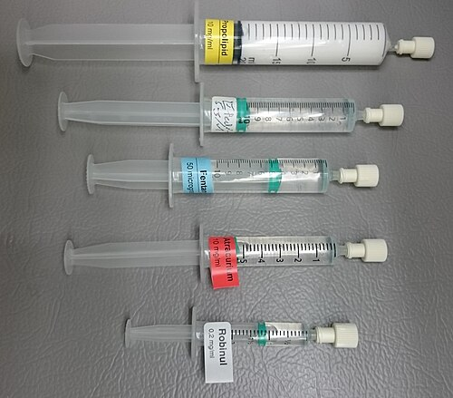
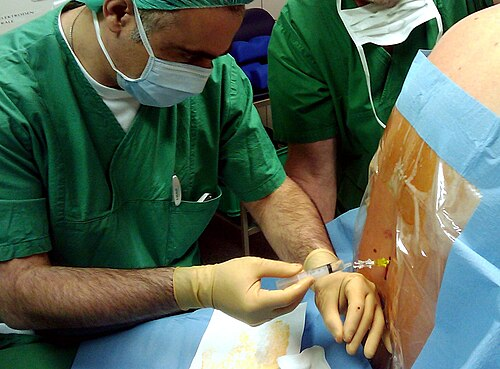

# TIPOS DE ANESTESIA

Para começar nosso estudo, você precisa entender que a anestesia não é um "botão de liga e desliga". Ela é um estado dinâmico, um equilíbrio entre o que o cirurgião precisa (imobilidade, campo exangue) e o que o paciente suporta (estabilidade hemodinâmica, ausência de dor). Nas provas de residência, o examinador não quer apenas que você saiba o nome das drogas; ele quer saber se você sabe escolher a técnica certa para o paciente certo.

*Figura 1 - Seringas com medicações anestésicas preparadas: propofol (hipnótico), fentanil (analgésico opioide), atracúrio (bloqueador neuromuscular), efedrina (vasopressor) e glicopirrolato (anticolinérgico). A classificação ASA (I-VI) estratifica o risco anestésico-cirúrgico conforme estado físico do paciente. Fonte: Mikael Häggström, CC0 | Wikimedia Commons*

## Avaliação de Risco e Estado Físico (ASA)

Antes de falarmos sobre como anestesiar, precisamos saber *quem* estamos anestesiando. A classificação da Sociedade Americana de Anestesiologia (ASA) é, sem dúvida, o tema mais cobrado em questões de pré-operatório.

Muitos alunos erram por achar que a classificação ASA avalia o risco da cirurgia. Cuidado: o ASA avalia o **estado clínico do paciente** no momento da cirurgia, independentemente do procedimento.

| Classificação | Definição | Exemplo Prático de Prova |
| --- | --- | --- |
| **ASA I** | Paciente hígido | Jovem, não fumante, sem doenças crônicas. |
| **ASA II** | Doença sistêmica leve, sem limitação funcional | HAS ou DM controlados, fumante, **gestante saudável**. |
| **ASA III** | Doença sistêmica grave, com limitação funcional | DM descompensado, IAM prévio (>3 meses), DPOC estável. |
| **ASA IV** | Doença sistêmica grave com ameaça constante à vida | Insuficiência renal sem diálise, ICC grave, IAM recente (<3 meses). |
| **ASA V** | Paciente moribundo, expectativa de morte sem cirurgia | Ruptura de aneurisma de aorta, trauma craniano grave. |
| **ASA VI** | Morte encefálica | Doador de órgãos. |

**Dica de Prova:** A banca vai tentar te pegar na gestante. Lembre-se: uma gestante a termo, mesmo sem nenhuma doença, é **ASA II**. Por quê? Porque as alterações fisiológicas da gravidez (aumento do débito cardíaco, redução da reserva funcional respiratória) já a tiram do status de "hígida" (ASA I). Outro ponto: o sufixo "E" (ex: ASA IIE) é adicionado para cirurgias de emergência.

## Anestesia Local e Toxicidade

A anestesia local é o bloqueio reversível da condução nervosa. O anestésico age impedindo a abertura dos canais de sódio voltagem-dependentes na membrana do neurônio, o que impede o potencial de ação.

Aqui, o Dr. Will sempre lembra: o que cai em prova são as **doses máximas**. Você precisa decorar esses números como se fossem seu próprio CPF.

### Doses Máximas de Anestésicos Locais

- **Lidocaína (Xylocaína):**

- Sem vasoconstritor: 4,5 mg/kg.

- Com vasoconstritor: 7,0 mg/kg.

- **Bupivacaína (Marcaina):**

- Dose máxima: 2,0 mg/kg (com ou sem vaso - a margem de segurança é estreita).

- **Procaína:**

- Sem vaso: 10 mg/kg.

- Com vaso: 14 mg/kg.

**Exemplo Clínico:** Um paciente de 70 kg vai realizar uma cantoplastia (correção de unha encravada). Quantos mL de lidocaína a 2% sem vasoconstritor você pode usar?

- Dose máxima: 70 kg x 4,5 mg/kg = 315 mg.

- Concentração a 2%: Significa 20 mg por mL.

- Cálculo: 315 / 20 = 15,7 mL.
Se você usar mais que isso, corre o risco de toxicidade sistêmica.

### Toxicidade por Anestésicos Locais (LAST)

A toxicidade ocorre geralmente por injeção intravascular acidental. O sistema nervoso central (SNC) é o primeiro a sofrer (gosto metálico na boca, zumbido, tontura, convulsões), seguido pelo sistema cardiovascular (arritmias e colapso circulatório). A bupivacaína é classicamente mais cardiotóxica que a lidocaína.

## Anestesia Geral

A anestesia geral é composta por um tripé (ou tétrade, se incluirmos o bloqueio autonômico): **Hipnose + Analgesia + Relaxamento Muscular**.

### 1. Indução e Sequência Rápida de Intubação (SRI)

A SRI é o padrão-ouro para pacientes com "estômago cheio" (trauma, urgência, gestantes, obesos, vigência de refluxo). O objetivo é proteger a via aérea o mais rápido possível para evitar a aspiração do conteúdo gástrico.

A sequência clássica envolve:

- **Pré-oxigenação:** 100% de O₂ para criar uma reserva de nitrogênio nos alvéolos.

- **Otimização pré-intubação:** Corrigir hipotensão (vasoativos) se necessário.

- **Sedação/Hipnose:** Etomidato (estabilidade hemodinâmica), Propofol (rápido, mas hipotensor) ou Cetamina (bom para choque/broncoespasmo).

- **Analgesia:** Fentanil (opioide de curta duração).

- **Bloqueio Neuromuscular:** Succinilcolina (início de ação em 30-60s) ou Rocurônio.

- **Manobra de Sellick:** Pressão na cartilagem cricoide para ocluir o esôfago (embora sua eficácia seja debatida, ainda aparece muito em provas como conduta na SRI).

**Pegadinha de Prova:** A banca pode dizer que a máscara laríngea protege contra aspiração na SRI. **Falso.** A máscara laríngea é um dispositivo supraglótico excelente para via aérea difícil ou cirurgias eletivas rápidas, mas não isola a traqueia do esôfago como o tubo orotraqueal (TOT).

### 2. Manutenção e Ventilação Mecânica

Durante a anestesia geral, o paciente geralmente está em Ventilação Mecânica Invasiva (VMI). Aqui entram os conceitos de ventilação protetora que despencam em provas de anestesia e terapia intensiva.

- **Volume Corrente (VC):** Deve ser de 6 mL/kg de **peso ideal** (não o peso real do paciente).

- **Pressão de Platô:** Deve ser mantida < 30 cmH₂O para evitar barotrauma.

- **Driving Pressure (Pressão de Distensão):** Platô - PEEP. Deve ser < 15 cmH₂O. É o parâmetro que melhor se correlaciona com a redução de lesão pulmonar induzida pelo ventilador (VILI).

**Diferença entre VCV e PCV:**

- **VCV (Volume Controlado):** Você garante o volume, mas a pressão varia conforme a complacência do paciente. Ciclagem a volume.

- **PCV (Pressão Controlada):** Você garante a pressão, mas o volume varia. Ciclagem a tempo. É útil em cirurgias laparoscópicas onde a pressão abdominal oscila muito.

*Figura 2 - Raquianestesia (subaracnóideo, L3-L4/L4-L5): agulha fina, dose única, bloqueio rápido e denso. Peridural (espaço epidural): cateter contínuo, bloqueio gradual. Complicação raqui: cefaleia pós-punção (mais comum em jovens/mulheres); tratamento: blood patch epidural. Fonte: Domínio Público | Wikimedia Commons*

## Bloqueios Neuroaxiais: Raquianestesia vs. Peridural

Este é o "coração" da anestesiologia em provas. Você precisa saber a anatomia e as diferenças fisiológicas.

### Anatomia da Punção

Para chegar ao espaço subaracnoideo (raqui), a agulha atravessa:

- Pele e subcutâneo.

- Ligamento supraespinoso.

- Ligamento interespinoso.

- Ligamento amarelo (o "clique" característico).

- Espaço peridural (onde paramos na anestesia epidural).

- Dura-máter e Aracnoide.

- **Espaço Subaracnoideo** (onde circula o líquor).

### Comparativo: Raqui vs. Peridural

| Característica | Raquianestesia | Anestesia Peridural (Epidural) |
| --- | --- | --- |
| **Local de Deposição** | Espaço Subaracnoideo (Líquor) | Espaço Peridural |
| **Volume de Anestésico** | Baixo (2-4 mL) | Alto (15-20 mL) |
| **Latência (Início)** | Muito rápida (imediata) | Mais lenta (15-20 min) |
| **Bloqueio Motor** | Intenso | Variável (depende da concentração) |
| **Uso de Cateter** | Raro | Comum (para analgesia contínua) |

**Por que escolher a Peridural em grandes cirurgias (ex: Lobectomia)?**
Porque ela permite a passagem de um cateter para infusão contínua de analgésicos no pós-operatório. Isso reduz o íleo paralítico, melhora a mecânica respiratória e permite deambulação precoce. No MedEvo, sempre reforçamos: a peridural torácica é excelente para cirurgias abdominais altas e torácicas.

### Complicações dos Bloqueios

A complicação mais comum da raquianestesia é a **hipotensão arterial**, causada pelo bloqueio do sistema simpático (vasodilatação). Se o bloqueio for muito alto (acima de T4), pode haver bradicardia por bloqueio das fibras cardioaceleradoras.

**Cefaleia Pós-Punção Dural:**
Ocorre por perda de líquor pelo orifício da dura-máter, gerando tração nas meninges.

- **Clínica:** Cefaleia frontal ou occipital que piora ao levantar e melhora ao deitar.

- **Tratamento Inicial:** Repouso, hidratação, cafeína e analgésicos.

- **Tratamento Definitivo:** *Blood Patch* (tampão sanguíneo peridural) – injeta-se sangue autólogo no espaço peridural para "selar" o furo.

- **Cuidado:** A deambulação precoce NÃO trata e pode piorar a dor inicialmente.

## Bloqueios de Nervos Periféricos e Obstetrícia

### Bloqueio do Nervo Pudendo

Muito cobrado em provas de GO e Anestesia. O nervo pudendo (S2-S4) é responsável pela sensibilidade do períneo.

- **Referência Anatômica:** Espinha isquiática.

- **Indicação:** Analgesia para o segundo estágio do parto (expulsivo) e episiotomia.

- **Atenção:** Ele NÃO serve para a dor do primeiro estágio do parto (dilatação), que é visceral e requer bloqueio peridural.

### Analgesia de Parto

A principal indicação para iniciar a analgesia peridural no parto é a **vontade da mãe** (dor materna). Não existe mais aquela história de esperar "X" centímetros de dilatação. A técnica de escolha é a peridural ou a técnica combinada (raqui + peridural).

## Sedação e Recuperação Pós-Anestésica

Nem todo procedimento precisa de anestesia geral. Muitas vezes usamos sedação com Midazolam (benzodiazepínico) ou Propofol.

### Escala de RASS (Richmond Agitation-Sedation Scale)

Usada para monitorar o nível de sedação em UTIs e salas de cirurgia.

- **RASS 0:** Alerta e calmo.

- **RASS -2:** Sedação leve (acorda ao chamado, mantém contato visual).

- **RASS -3:** Sedação moderada (movimento ou abertura ocular ao chamado, mas SEM contato visual).

- **RASS -5:** Sedação profunda (sem resposta ao estímulo verbal ou físico).

### Escala de Aldrete-Kroulik Modificada

É o critério para dar alta da Sala de Recuperação Pós-Anestésica (SRPA). O paciente precisa somar pelo menos 8 a 10 pontos. Os critérios são:

- **Atividade:** Move os 4 membros voluntariamente?

- **Respiração:** Capaz de respirar profundamente e tossir?

- **Circulação:** PA dentro de 20% do nível pré-anestésico?

- **Consciência:** Lúcido e orientado?

- **Saturação de O₂:** Mantém SatO₂ > 92% em ar ambiente?

## Ventilação Não Invasiva (VNI) e Situações Especiais

A VNI é uma ferramenta poderosa, mas perigosa se mal indicada.

- **Indicações Clássicas:** Edema agudo de pulmão cardiogênico e exacerbação de DPOC.

- **VNI Profilática Pós-Extubação:** Indicada para pacientes de alto risco de falha (idosos > 65 anos, obesos, ICC, DPOC).

- **Contraindicações Absolutas:** Necessidade de intubação de emergência, parada cardíaca/respiratória, pneumotórax não drenado, trauma de face grave, vômitos incoercíveis ou sangramento gastrointestinal alto ativo.

### Ventilação de Alta Frequência (VAF)

Raramente usada em adultos, mas comum em neonatologia. A lógica é usar volumes correntes baixíssimos (menores que o espaço morto) com frequências altíssimas. A troca gasosa ocorre por mecanismos de difusão e mistura de gases, minimizando o volutrauma.

## Manejo da Via Aérea no Trauma

No trauma, a regra de ouro é: **presunção de coluna cervical instável**.

- Se o paciente tem sinal de lesão uretral (sangue no meato, próstata deslocada), **não passe sonda vesical** antes de uma uretrocistografia retrógrada.

- Se precisar intubar, use a manobra de estabilização manual da coluna (in-line).

- A capnografia (EtCO₂) é o método mais confiável para confirmar que o tubo está na traqueia e não no esôfago. Se não houver curva de capnografia, o tubo está no lugar errado até que se prove o contrário.

## Pontos-Chave para Prova 💡

- **ASA II:** Inclui fumantes, etilistas sociais, gestantes saudáveis e obesos controlados.

- **Dose Máxima Lidocaína:** 4,5 mg/kg (sem vaso) e 7 mg/kg (com vaso). Memorize!

- **Sequência Rápida (SRI):** Indicada para estômago cheio. Etomidato é o hipnótico de escolha na instabilidade hemodinâmica.

- **Raquianestesia:** Espaço subaracnoideo, latência curta, dose baixa. Cuidado com a hipotensão.

- **Cefaleia Pós-Raqui:** Piora com ortostatismo. Tratamento definitivo é o *Blood Patch*.

- **Ventilação Protetora:** VC 6 mL/kg (peso ideal), Platô < 30, Driving Pressure < 15.

- **VNI:** Contraindicada em pneumotórax não drenado e rebaixamento do nível de consciência (exceto se for por narcose de CO₂ no DPOC, onde pode ser tentada).

- **Bloqueio de Pudendo:** Referência é a espinha isquiática. Analgesia para o período expulsivo do parto.

- **Capnografia:** Padrão-ouro para confirmar intubação orotraqueal.

- **Aldrete-Kroulik:** Atividade, Respiração, Circulação, Consciência e Saturação. Alta da SRPA com 8-10 pontos.

- **Succinilcolina:** Bloqueador neuromuscular despolarizante de ação rápida, usado na SRI, mas cuidado com hipercalemia.

- **Bupivacaína:** Mais potente e mais cardiotóxica que a lidocaína.

- **Espaço Peridural:** Fica entre o ligamento amarelo e a dura-máter.

- **VEMS/CVF < 0,7:** Define distúrbio obstrutivo (DPOC/Asma).

- **RASS -3:** O paciente abre o olho ao chamado, mas não fixa o olhar (sedação moderada).

- **EPI na COVID-19:** Durante a intubação (procedimento gerador de aerossol), o uso de máscara N95/PFF2 é obrigatório.

 Cópia offline para consulta pessoal.
 Fonte original:
 [https://www.medevo.com.br/material-apoio/ler/07ed4e39-735f-4be9-b284-286ca4efffff](https://www.medevo.com.br/material-apoio/ler/07ed4e39-735f-4be9-b284-286ca4efffff)
