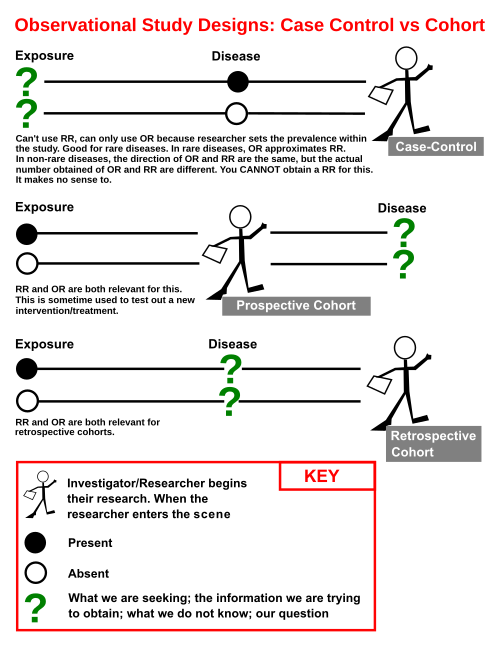
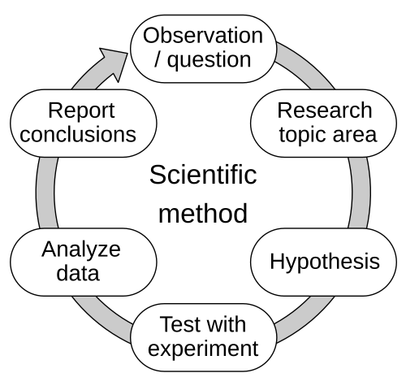

# TIPOS DE ESTUDOS EPIDEMIOLÓGICOS

Para entender epidemiologia, você precisa parar de tentar decorar nomes e começar a entender a lógica do investigador. Imagine que você é um detetive. O crime é a doença, e o seu trabalho é descobrir quem é o culpado, o fator de risco. A forma como você organiza sua investigação define o tipo de estudo.

Na prova de residência, as bancas não querem apenas que você saiba o nome do estudo, elas querem que você saiba qual desenho escolher para cada situação clínica. Se eu tenho uma doença rara, eu uso coorte? Jamais, eu morreria de velho antes de ver o desfecho. Eu uso caso-controle. É essa lógica que vamos construir aqui.

*Figura 1 - Diagrama comparativo entre os desenhos de estudo Caso-Controle e Coorte: no caso-controle partimos dos casos (doentes) e controles (sadios) e buscamos retrospectivamente a exposição; na coorte partimos dos expostos/não expostos e acompanhamos prospectivamente até o desfecho. Fonte: Jmarchn, CC BY-SA 3.0 | Wikimedia Commons*

## A Grande Divisão: Observar ou Intervir?

*Figura 2 - Fluxograma do método científico: observação → pergunta → hipótese → experimento → análise → conclusão. Os estudos epidemiológicos seguem esta lógica, variando entre observacionais (apenas observar) e experimentais (intervir ativamente). Fonte: Efbrazil, CC BY-SA 4.0 | Wikimedia Commons*

A primeira pergunta que você deve fazer ao ler o enunciado de uma questão é: o pesquisador manipulou o fator de exposição?

Se o pesquisador apenas olhou o que já estava acontecendo, sem interferir, o estudo é **Observacional**. Se o pesquisador decidiu quem toma o remédio e quem toma o placebo, o estudo é **Experimental**.

Dentro dos observacionais, temos outra divisão crucial:

- **Descritivos:** Eu apenas conto o que vi. "Nesta cidade, 10% das pessoas têm hipertensão". Não há grupo comparação. Exemplos: Relato de caso e Série de casos.

- **Analíticos:** Eu comparo grupos para testar uma hipótese. "Pessoas que fumam têm mais câncer do que as que não fumam?". Aqui entram o Ecológico, Transversal, Caso-Controle e Coorte.

## Estudo Ecológico: O Olhar sobre o Grupo

No estudo ecológico, a unidade de análise não é o indivíduo, mas sim um agregado populacional, como cidades, países ou escolas. Você não sabe se o indivíduo que morreu de infarto era o mesmo que era sedentário, você apenas sabe que, em cidades com mais sedentarismo, há mais infarto.

Por que fazemos isso? Porque é barato, rápido e utiliza dados que já existem, como os do DATASUS. É excelente para gerar hipóteses. Se você notar que países que consomem mais vinho têm menos doenças cardiovasculares, você criou uma hipótese.

O grande perigo aqui, e que cai em toda prova, é a **Falácia Ecológica** (ou viés de agregação). É o erro de atribuir ao indivíduo uma conclusão que só vale para o grupo. Só porque o país X bebe muito vinho e tem pouco infarto, não significa que, se você beber vinho, estará protegido. A associação no nível do grupo pode não se sustentar no nível individual.

## Estudo Transversal: A Fotografia

O estudo transversal, também chamado de seccional, é uma fotografia instantânea. Você coleta dados de exposição e desfecho ao mesmo tempo. Imagine que você entra em uma sala de aula e pergunta: "Quem aqui fuma e quem aqui tem tosse crônica?".

A medida de frequência clássica do estudo transversal é a **Prevalência**. Como você mede tudo ao mesmo tempo, você não sabe o que veio primeiro. A pessoa fuma porque está estressada pela tosse ou tem tosse porque fuma? Essa ausência de temporalidade gera o viés de **Causalidade Reversa**.

As bancas adoram dizer que o estudo transversal é ótimo para planejamento em saúde. E é verdade. Se eu quero saber quantos postos de saúde preciso para tratar tuberculose em uma comunidade, eu preciso saber a prevalência atual, não a incidência futura.

## Estudo de Caso-Controle: Partindo do Desfecho

Aqui a lógica muda. No caso-controle, você já conhece o desfecho. Você seleciona os "Casos" (pessoas doentes) e os "Controles" (pessoas saudáveis, mas que vieram da mesma população dos casos). Depois, você olha para o passado, através de prontuários ou entrevistas, para ver quem foi exposto ao fator de risco.

É um estudo **retrospectivo** por natureza. Como você já começa com os doentes, ele é o desenho de escolha para **doenças raras** ou com longo período de latência, como o câncer. Imagine tentar fazer uma coorte de uma doença que ocorre em 1 para cada 1 milhão de pessoas. Você precisaria de uma população gigantesca. No caso-controle, você busca esses raros casos no hospital e pronto.

A medida de associação aqui é o **Odds Ratio (OR)**, ou Razão de Chances. Como você selecionou quantos doentes queria no estudo, você não pode calcular a incidência real da doença na população.

Cuidado com o **Viés de Memória** (ou de recordação). Alguém que teve um filho com malformação (caso) provavelmente vai se lembrar de cada remédio que tomou na gravidez muito melhor do que uma mãe com um filho saudável (controle).

## Estudo de Coorte: O Filme da Vida Real

Diferente do caso-controle, na coorte você parte da **exposição**. Você seleciona um grupo de pessoas sadias, divide em "Expostos" e "Não Expostos", e as acompanha ao longo do tempo para ver quem desenvolve a doença.

Como sempre digo nas mentorias do MedEvo, se o transversal é a foto, a coorte é o filme. Você estabelece a temporalidade com clareza: a exposição veio antes da doença. Por isso, a coorte é excelente para confirmar causalidade e para estudar **exposições raras**. Se houve um acidente nuclear, você segue aquela coorte de pessoas expostas para ver o que acontece.

A medida de associação é o **Risco Relativo (RR)**, baseado na **Incidência**.

Existem dois tipos de coorte que confundem os alunos:

- **Coorte Prospectiva:** Você começa agora e espera o futuro.

- **Coorte Histórica (ou Retrospectiva):** Você usa registros do passado para montar os grupos de exposição e "segue" os dados até o presente. Atenção: continua sendo coorte porque o ponto de partida do pesquisador foi a exposição, mesmo que os dados já existam no prontuário.

O maior problema da coorte é o custo, o tempo e o **Viés de Seleção por Perda de Seguimento** (viés de migração). Se os pacientes mais graves saírem do estudo, seus resultados estarão mascarados.

### Tabela 1: Comparativo entre Caso-Controle e Coorte

| Característica | Caso-Controle | Coorte |
| --- | --- | --- |
| Ponto de Partida | Desfecho (Doentes) | Exposição (Fator de Risco) |
| Sentido do Estudo | Retrospectivo | Longitudinal (Geralmente Prospectivo) |
| Medida de Associação | Odds Ratio (OR) | Risco Relativo (RR) |
| Doenças Raras | Excelente | Ruim |
| Exposições Raras | Ruim | Excelente |
| Custo e Tempo | Baixo / Rápido | Alto / Longo |
| Principal Viés | Memória / Seleção | Perda de seguimento |

## Ensaio Clínico Randomizado (ECR): O Padrão-Ouro

Entramos no terreno dos estudos experimentais. Aqui, o pesquisador tem o controle. Para evitar que o médico dê o remédio novo apenas para os pacientes que ele acha que vão sobreviver (viés de seleção), usamos a **Randomização**.

A randomização é a alma do ECR. Ela garante que fatores de confusão, tanto os que conhecemos (idade, sexo) quanto os que nem imaginamos (genética), sejam distribuídos de forma igual entre os grupos. Isso torna os grupos comparáveis.

Outro pilar é o **Cegamento**:

- **Aberto:** Todos sabem o que estão tomando.

- **Cego (ou Simples-Cego):** O paciente não sabe.

- **Duplo-Cego:** Paciente e médico assistente não sabem.

- **Triplo-Cego:** Paciente, médico e o estatístico que analisa os dados não sabem.

O objetivo do cegamento é evitar o viés de aferição ou de performance. Se o médico sabe que o paciente está tomando a droga nova, ele pode, inconscientemente, avaliar a melhora de forma mais otimista.

### Eficácia, Efetividade e Eficiência

Esses três termos caem muito e as pessoas trocam as definições.

- **Eficácia:** O remédio funciona em condições ideais? (O laboratório perfeito, pacientes selecionados que não esquecem a dose). É o que o ECR mede.

- **Efetividade:** O remédio funciona no "mundo real"? (O paciente que esquece a dose, que bebe álcool, que não faz dieta).

- **Eficiência:** O remédio vale a pena financeiramente? Considera a relação custo-benefício.

## Estudos de Intervenção Comunitária e Cluster

Às vezes, não podemos randomizar indivíduos. Imagine testar a fluoretação da água. Não dá para dar água com flúor para o João e sem flúor para a Maria se eles moram na mesma rua. Nesse caso, usamos o **Ensaio em Cluster (ou Aglomerados)**, onde a unidade de randomização é a cidade, o bairro ou a escola. É uma intervenção em nível comunitário.

## Causalidade: Os Critérios de Bradford Hill

Não é porque dois eventos acontecem juntos que um causa o outro. Para dizer que X causa Y em epidemiologia, usamos os critérios de Bradford Hill. O mais importante para a sua prova: **Temporalidade**. É o único critério obrigatório. A causa deve vir antes do efeito.

Outros critérios importantes:

- **Força de Associação:** Quanto maior o RR ou OR, mais provável ser causal.

- **Dose-Resposta (Gradiente Biológico):** Quanto mais eu fumo, mais chance tenho de ter câncer? Se sim, reforça a causalidade.

- **Plausibilidade Biológica:** Faz sentido fisiopatológico?

- **Consistência:** Outros estudos em populações diferentes acharam a mesma coisa?

## Vieses: Onde o Pesquisador Erra

O viés é um erro sistemático que distorce o resultado.

- **Viés de Seleção:** Os grupos comparados são diferentes desde o início. Exemplo: **Viés de Berkson**, que ocorre quando a amostra é selecionada apenas em hospitais, onde os pacientes têm mais comorbidades que a população geral.

- **Viés de Aferição:** Erro na medição dos dados ou na coleta de informações (como o viés de memória).

- **Viés de Confusão:** Existe uma terceira variável que está associada tanto à exposição quanto ao desfecho. Exemplo: Um estudo diz que beber café causa infarto. Mas quem bebe café costuma fumar mais. O cigarro é a variável de confusão. Se você ajustar a análise para o fumo, a associação do café desaparece.

## Revisão Sistemática e Metanálise

No topo da pirâmide de evidência, temos a Revisão Sistemática. Ela não é um estudo original, mas uma análise criteriosa de vários ECRs sobre o mesmo tema. Quando usamos ferramentas estatísticas para combinar os resultados desses estudos em um único número, chamamos de **Metanálise**.

O gráfico clássico da metanálise é o **Forest Plot** (gráfico de floresta). Se o "diamante" (o resultado combinado) não tocar a linha da nulidade (1.0 para RR ou OR), o resultado é estatisticamente significativo.

### Tabela 2: Medidas de Associação e Frequência por Estudo

| Estudo | Medida de Frequência | Medida de Associação |
| --- | --- | --- |
| Ecológico | Médias populacionais | Coeficiente de Correlação |
| Transversal | Prevalência | Razão de Prevalência |
| Caso-Controle | - | Odds Ratio (OR) |
| Coorte | Incidência | Risco Relativo (RR) |
| Ensaio Clínico | Incidência | Risco Relativo (RR) / RRR / NNT |

## Exemplo Clínico: O Caso da Microcefalia

Imagine que você está no Nordeste em 2015 e percebe um aumento súbito de bebês nascendo com microcefalia. Você suspeita do Zika vírus. Qual estudo você faz primeiro?

- **Série de Casos:** Primeiro você descreve os casos que apareceram no seu hospital (Pérola 11 e 12).

- **Ecológico:** Você observa que as cidades com mais infestação de Aedes aegypti têm mais casos de microcefalia.

- **Caso-Controle:** Você seleciona os bebês com microcefalia (casos) e bebês saudáveis nascidos na mesma época (controles). Pergunta às mães sobre sintomas de Zika na gestação ou testa o sangue delas em busca de anticorpos (Pérola 8).

- **Coorte:** Você seleciona gestantes agora, algumas com Zika e outras sem, e as acompanha até o parto para ver quem terá bebês com microcefalia.

Percebeu a escada? O caso-controle foi fundamental para a resposta rápida no início da epidemia de Zika porque a microcefalia, apesar do surto, ainda era um desfecho relativamente raro e precisávamos olhar para trás.

## Detalhes que as Bancas Amam

- **Estudo de Coorte-Controle Aninhado:** É um caso-controle feito dentro de uma coorte que já está em andamento. É muito eficiente porque os dados de exposição foram coletados antes da doença aparecer (evita viés de memória), mas você só analisa o material caro (como exames genéticos) para quem ficou doente e alguns controles.

- **Unidade de Análise:** Se a questão fala que a unidade é o indivíduo, esqueça o estudo ecológico. Se fala que a unidade é o país ou setor censitário, é ecológico na cabeça.

- **Validade Interna vs. Externa:** Validade interna significa que o estudo foi bem feito e o resultado é verdade para aquela amostra. Validade externa (ou generalização) significa que o resultado pode ser aplicado para outras populações.

- **Randomização em Cluster:** Muito comum em estudos de vacinas ou intervenções de saúde pública (Pérola 5).

### Tabela 3: Vantagens Metodológicas e Indicações

| Situação | Estudo Sugerido | Por que? |
| --- | --- | --- |
| Doença muito rara | Caso-Controle | Já partimos dos doentes. |
| Exposição muito rara | Coorte | Selecionamos os poucos expostos e seguimos. |
| Avaliar várias doenças para uma exposição | Coorte | Um grupo de fumantes pode ser seguido para câncer, DPOC e IAM. |
| Avaliar vários fatores de risco para uma doença | Caso-Controle | Perguntamos aos doentes sobre fumo, dieta, álcool, etc. |
| Testar eficácia de droga nova | Ensaio Clínico | Randomização controla vieses. |
| Estimar carga de doença para o governo | Transversal | Mede a prevalência atual. |

## Pontos-Chave para Prova

- **Estudo Ecológico:** Unidade de análise é populacional. Risco de Falácia Ecológica. Bom para gerar hipóteses.

- **Estudo Transversal:** Mede Prevalência. É uma "foto". Não estabelece temporalidade (Causalidade Reversa).

- **Estudo de Caso-Controle:** Parte do desfecho (doente). Ideal para doenças raras. Medida: Odds Ratio. Sujeito a viés de memória.

- **Estudo de Coorte:** Parte da exposição. Ideal para ver a história natural e exposições raras. Medida: Risco Relativo e Incidência.

- **Ensaio Clínico Randomizado:** Experimental. Randomização evita viés de seleção. Cegamento evita viés de aferição.

- **Temporalidade:** É o único critério de Bradford Hill considerado obrigatório para causalidade.

- **Viés de Berkson:** Viés de seleção que ocorre quando a amostra hospitalar não representa a população geral.

- **Viés de Confusão:** Quando uma variável externa distorce a relação entre exposição e desfecho. Resolvido por randomização ou análise estratificada.

- **Eficácia vs. Efetividade:** Eficácia é no mundo ideal (ECR); Efetividade é no mundo real (prática clínica).

- **NNT (Número Necessário para Tratar):** 1 / Redução Absoluta do Risco. Quanto menor o NNT, melhor a intervenção.

- **Estudo de Doll e Hill:** Clássico estudo de coorte que acompanhou médicos britânicos para provar a relação entre tabagismo e câncer de pulmão.

- **O que NÃO fazer:** Não use Risco Relativo em estudo de Caso-Controle (você não tem a incidência real). Não use Odds Ratio como primeira escolha em Coorte se você pode calcular o RR.

- **Pegadinha de Prova:** A banca dirá que um estudo que usou prontuários do passado para seguir pacientes expostos é um Caso-Controle. Errado! Se partiu da exposição, é Coorte Histórica.

- **Randomização:** Serve para equilibrar variáveis de confusão conhecidas e desconhecidas entre os grupos. 🧠

 Cópia offline para consulta pessoal.
 Fonte original:
 [https://www.medevo.com.br/material-apoio/ler/9b14c6cb-bd84-428b-9fda-b68e959518f2](https://www.medevo.com.br/material-apoio/ler/9b14c6cb-bd84-428b-9fda-b68e959518f2)
