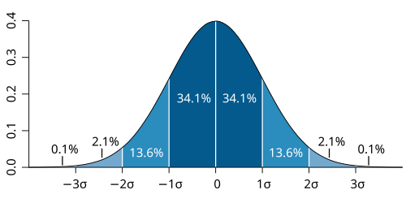
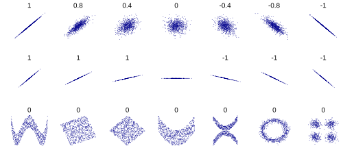

# TIPOS DE VARIÁVEIS E MEDIDAS-RESUMO

Para começar nossa conversa, imagine que você está diante de um prontuário médico. Ali, você encontra o nome do paciente, a idade, o peso, o estadiamento de um tumor e a pressão arterial. Cada um desses itens é uma **variável**. Na bioestatística, variável é simplesmente qualquer característica que pode ser medida ou classificada e que varia de pessoa para pessoa.

Por que o examinador da residência ama esse tema? Porque se você não souber classificar a variável, você não sabe qual teste estatístico aplicar e, muito menos, como interpretar o resultado de um estudo clínico. Como sempre digo nas aulas do MedEvo, a estatística é a gramática da medicina baseada em evidências. Se você não domina a gramática, não entende o texto.

*Figura 1 - Variáveis qualitativas: nominais (sexo, cor) e ordinais (estadiamento TNM). Variáveis quantitativas: discretas (número de filhos) e contínuas (peso, altura). Medidas de tendência central: média (sensível a outliers), mediana (divide ao meio) e moda (mais frequente). Fonte: Domínio Público | Wikimedia Commons*

## Classificação de Variáveis

Este é o ponto de partida de 90% das questões de bioestatística. As variáveis são divididas em dois grandes grupos: Qualitativas (ou Categóricas) e Quantitativas (ou Numéricas).

### Variáveis Qualitativas (Categóricas)

Aqui, não estamos medindo quantidades, mas sim classificando em categorias. Elas se subdividem em:

-

**Nominais:** Não existe uma ordem ou hierarquia entre as categorias.

- Exemplos: Sexo (masculino/feminino), tipo sanguíneo (A, B, AB, O), estado civil, cor dos olhos.

- **Dica de Prova:** Se a questão perguntar sobre a "causa de óbito" ou "presença de doença (sim/não)", ela está falando de uma variável qualitativa nominal.

-

**Ordinais:** Existe uma ordem natural ou hierarquia entre as categorias, mas a distância matemática entre elas não é necessariamente igual.

- Exemplos: Estadiamento de neoplasias (I, II, III, IV), escolaridade (fundamental, médio, superior), gravidade de uma doença (leve, moderada, grave).

- **Pérola Clínica:** O estadiamento do câncer é o exemplo favorito das bancas para variável ordinal. Você sabe que o estágio III é pior que o II, mas não pode dizer que o III é "o dobro" do II.

### Variáveis Quantitativas (Numéricas)

Aqui, o valor é um número real que representa uma quantidade. Elas se subdividem em:

-

**Discretas (ou de contagem):** Resultam de uma contagem e, geralmente, são números inteiros. Você não tem "meio" elemento.

- Exemplos: Número de filhos, número de batimentos cardíacos por minuto, número de episódios de convulsão no mês.

- **Cuidado:** Muitos alunos confundem frequência cardíaca com variável contínua. Pense bem: você conta os batimentos. É 70 ou 71, não existe 70,5 batimentos. Portanto, é discreta.

-

**Contínuas (ou de medição):** Resultam de uma mensuração e podem assumir qualquer valor em um intervalo, inclusive casas decimais.

- Exemplos: Peso (70,5 kg), altura (1,72 m), pressão arterial, temperatura corporal.

- **Dica do Dr. Will:** Se você usa um instrumento para medir (balança, fita métrica, termômetro), a variável tende a ser contínua.

### Tabela 1: Resumo da Classificação de Variáveis

| Tipo de Variável | Subtipo | Exemplo Clássico | Operação Estatística Comum |
| --- | --- | --- | --- |
| **Qualitativa** | Nominal | Sexo, Raça, Tipo Sanguíneo | Moda, Proporção (%) |
| **Qualitativa** | Ordinal | Estadiamento, Escala de Dor | Mediana, Percentis |
| **Quantitativa** | Discreta | Nº de filhos, Nº de internações | Mediana, Moda |
| **Quantitativa** | Contínua | Peso, Altura, Glicemia | Média, Desvio Padrão |

## Medidas de Tendência Central

Agora que classificamos os dados, precisamos resumir o conjunto. Se eu te der o peso de 1.000 pacientes, você não consegue analisar um por um. Você precisa de um valor que represente o "centro" dessa distribuição.

### Média Aritmética

É a soma de todos os valores dividida pelo número total de observações.

- **Por que usamos?** É a medida mais conhecida e utiliza todos os dados da amostra.

- **O grande problema:** A média é extremamente sensível a valores extremos (outliers).

- **Exemplo Clínico:** Imagine uma enfermaria com 5 pacientes. Quatro têm 20 anos e um tem 90 anos. A média de idade será 34 anos. Note que ninguém na enfermaria tem idade próxima a 34. O paciente de 90 anos "puxou" a média para cima.

### Mediana

É o valor que ocupa a posição central de um conjunto de dados **ordenados** (do menor para o maior). Ela divide a amostra exatamente ao meio: 50% dos dados estão abaixo dela e 50% acima.

- **Cálculo:** Se o número de observações (n) for ímpar, a mediana é o valor na posição (n+1)/2. Se for par, é a média dos dois valores centrais.

- **A grande vantagem:** A mediana é **robusta**. Ela não se deixa influenciar por valores extremos. No exemplo da enfermaria acima, a mediana seria 20 anos, o que representa muito melhor aquele grupo.

- **Dica de Prova:** Se a banca te der uma distribuição assimétrica (com valores muito altos ou muito baixos), a mediana é a melhor medida para resumir os dados.

### Moda

É o valor que ocorre com maior frequência no conjunto de dados.

- Um conjunto pode ser amodal (nenhum valor se repete), unimodal, bimodal ou multimodal.

- **Exemplo de Prova:** "Qual o salário mais comum nesta empresa?". A banca quer a Moda.

## Medidas de Dispersão (Variabilidade)

A média sozinha é perigosa. Dizer que a profundidade média de um rio é 1 metro não impede um homem de 1,80m de se afogar se houver um buraco de 5 metros no meio. As medidas de dispersão mostram o quão "espalhados" os dados estão em torno da média.

### Amplitude Total

É a diferença entre o maior e o menor valor. É simples, mas instável, pois depende apenas dos dois extremos.

### Variância e Desvio Padrão (DP)

O Desvio Padrão é a medida de dispersão mais utilizada. Ele indica o "erro" médio em relação à média.

- **O "Porquê":** A Variância é calculada elevando as diferenças ao quadrado (para evitar que valores negativos e positivos se anulem). Como a unidade fica ao quadrado (ex: kg²), tiramos a raiz quadrada da variância para voltar à unidade original. Essa raiz é o Desvio Padrão.

- **Interpretação:** Quanto maior o DP, mais heterogênea é a amostra. Se o DP é zero, todos os valores são iguais à média.

### Coeficiente de Variação (CV)

É o Desvio Padrão dividido pela Média, expresso em porcentagem. Serve para comparar a variabilidade entre grupos com médias muito diferentes (ex: comparar a variabilidade do peso de recém-nascidos com a de adultos).

### Percentis e Quartis

Dividem a amostra em partes iguais.

- **Quartis:** Dividem em 4 partes (25% cada). O segundo quartil (Q2) é exatamente a Mediana.

- **Intervalo Interquartílico (IQR):** É a diferença entre o terceiro e o primeiro quartil (Q3 - Q1). É usado para descrever a dispersão em dados assimétricos, acompanhando a mediana.

### Tabela 2: Quando usar cada medida?

| Distribuição dos Dados | Tendência Central | Medida de Dispersão |
| --- | --- | --- |
| **Simétrica (Normal)** | Média | Desvio Padrão |
| **Assimétrica (com outliers)** | Mediana | Intervalo Interquartílico |
| **Qualitativa Nominal** | Moda | Não se aplica |

*Figura 2 - Indicadores de saúde: coeficiente de mortalidade geral, infantil (< 1 ano), neonatal (< 28 dias) e materna. Incidência = casos novos /população em risco; Prevalência = casos totais / população total. Mortalidade infantil: componente neonatal precoce (0-6 dias) é o mais relevante no Brasil. Fonte: National Cancer Institute, Domínio Público | Wikimedia Commons*

## Indicadores de Saúde e Coeficientes

Aqui entramos na Epidemiologia Descritiva. As bancas exigem que você saiba calcular e, principalmente, interpretar esses indicadores.

### Coeficiente vs. Índice

- **Coeficiente (ou Taxa):** É uma medida de risco. O numerador (quem sofreu o evento) está contido no denominador (quem pode sofrer o evento). Geralmente multiplicado por uma potência de 10 (1.000, 10.000, 100.000) para facilitar a leitura.

- **Índice (ou Razão):** É uma relação entre duas coisas independentes. O numerador não está contido no denominador. Exemplo: Razão de sexos (homens/mulheres).

### Principais Coeficientes de Mortalidade

- **Mortalidade Geral:** Óbitos totais / População total. É um indicador ruim para comparar países, pois não considera a estrutura etária (países desenvolvidos podem ter mortalidade geral alta porque têm muitos idosos).

- **Mortalidade Infantil:** Óbitos em menores de 1 ano / Nascidos Vivos x 1.000.

- **Neonatal Precoce:** 0 a 6 dias. (Reflete assistência ao parto e pré-natal).

- **Neonatal Tardio:** 7 a 27 dias.

- **Pós-neonatal:** 28 dias a < 1 ano. (Reflete condições de saneamento e vacinação).

- **Mortalidade Materna:** Óbitos por causas ligadas à gravidez, parto ou puerpério (até 42 dias) / Nascidos Vivos x 100.000.

- **Atenção:** Morte acidental ou incidental de gestante NÃO entra no cálculo.

- **Letalidade:** Óbitos por uma doença / Total de doentes. Mede a gravidade da doença, a "força" com que ela mata quem adoece.

### Indicadores de Proporção

- **Mortalidade Proporcional por Idade (Índice de Swaroop-Uemura):** Óbitos em pessoas com 50 anos ou mais / Total de óbitos x 100.

- **Pérola de Prova:** Quanto maior o Swaroop-Uemura, melhor o nível de saúde da população. Níveis acima de 75% indicam países desenvolvidos.

- **Curvas de Nelson Moraes:** Analisam a mortalidade proporcional por faixas etárias.

- **Tipo I (Níveis de saúde muito baixos):** Curva em "N" ou bota. Muitos jovens morrendo.

- **Tipo IV (Níveis de saúde elevados):** Curva em "J" invertido ou "U". A maioria dos óbitos ocorre em idosos.

## Morbidade: Prevalência e Incidência

Este é o "arroz com feijão" da Preventiva. Se você confundir isso, o examinador te elimina na hora.

### Prevalência

É a fotografia do momento. Mede o número total de casos (novos + antigos) em um ponto no tempo dividido pela população total.

- **Fatores que aumentam a prevalência:** Maior duração da doença, prolongamento da vida dos doentes sem cura, imigração de casos, melhoria no diagnóstico.

- **Fatores que diminuem a prevalência:** Morte, cura, emigração de casos.

### Incidência

É o filme. Mede o número de **casos novos** que surgiram em um período, em uma população sob risco.

- **Taxa de Incidência (Densidade):** Casos novos / Pessoa-tempo. É a medida mais precisa para populações dinâmicas.

**A Relação Fundamental:** Prevalência = Incidência x Duração da doença.

- Se uma doença é muito aguda e mata rápido (ex: Ebola), a incidência pode ser alta, mas a prevalência será baixa.

- Se uma doença é crônica e não tem cura (ex: Diabetes), a prevalência será alta mesmo que a incidência seja moderada.

## Testes Diagnósticos: Sensibilidade e Especificidade

Ao avaliar um teste, usamos uma tabela 2x2 (Doentes vs. Não Doentes / Teste Positivo vs. Teste Negativo).

- **Sensibilidade:** Capacidade do teste ser positivo nos doentes. É a proporção de Verdadeiros Positivos (VP) entre todos os doentes.

- **Uso clínico:** Testes de triagem (screening). Um teste muito sensível, quando dá negativo, serve para "excluir" a doença (baixo falso-negativo).

- **Especificidade:** Capacidade do teste ser negativo nos saudáveis. É a proporção de Verdadeiros Negativos (VN) entre todos os sadios.

- **Uso clínico:** Testes confirmatórios. Um teste muito específico, quando dá positivo, serve para "confirmar" a doença (baixo falso-positivo).

### Valores Preditivos (VPP e VPN)

Aqui está a pegadinha favorita das bancas. Sensibilidade e Especificidade são características **intrínsecas** do teste (não mudam com a prevalência). Já os Valores Preditivos **dependem da prevalência**.

- **Valor Preditivo Positivo (VPP):** Se o teste deu positivo, qual a chance de o paciente realmente estar doente?

- **Regra de Ouro:** Quanto maior a prevalência da doença na população, maior será o VPP do teste.

- **Valor Preditivo Negativo (VPN):** Se o teste deu negativo, qual a chance de o paciente estar realmente saudável?

- **Regra de Ouro:** Quanto maior a prevalência, menor o VPN.

## Medidas de Efeito e Impacto

Quando lemos um ensaio clínico (ex: Atorvastatina vs. Placebo), precisamos quantificar o benefício.

- **Risco Relativo (RR):** Incidência no grupo exposto / Incidência no grupo não exposto.

- RR = 1: Sem associação.

- RR > 1: Fator de risco.

- RR < 1: Fator de proteção.

- **Redução do Risco Relativo (RRR):** É o quanto o risco caiu em termos percentuais. RRR = 1 - RR.

- **Redução do Risco Absoluto (RRA):** É a diferença aritmética entre os riscos (Incidência no controle - Incidência no tratado). É a medida mais honesta do benefício real.

- **Número Necessário para Tratar (NNT):** É o inverso da RRA (1 / RRA).

- **Interpretação:** Quantos pacientes eu preciso tratar para evitar um desfecho negativo. Quanto menor o NNT, melhor a intervenção.

### Exemplo Clínico de NNT

Se o risco de infarto no grupo placebo é 10% e no grupo da droga é 5%:

- RRA = 10% - 5% = 5% (ou 0,05).

- NNT = 1 / 0,05 = 20.

- Significa que preciso tratar 20 pessoas para evitar 1 infarto.

## Bioestatística no Excel e Ferramentas

Embora raro, algumas bancas (como a FGV) podem cobrar a lógica de fórmulas de planilhas para análise de dados em saúde.

- =MÉDIA(A1:A10): Calcula a média aritmética.

- =MED(A1:A10): Calcula a mediana.

- =MODO(A1:A10): Calcula a moda.

- =DESVPAD(A1:A10): Calcula o desvio padrão amostral.

## Antropometria e Classificações da OMS

A bioestatística se aplica diretamente na prática clínica através de índices antropométricos.

### Índice de Massa Corporal (IMC)

Calculado como Peso (kg) / Altura (m)². Segundo a OMS:

- 18,5 - 24,9: Eutrofia.

- 25,0 - 29,9: Sobrepeso.

- 30,0 - 34,9: Obesidade Grau I.

- 35,0 - 39,9: Obesidade Grau II.

- ≥ 40,0: Obesidade Grau III (Mórbida).

### Percentis em Pediatria

Na avaliação nutricional infantil, usamos curvas de percentis.

- Percentil 50: É a mediana da população de referência.

- Uma criança no percentil 95 de peso para a idade significa que ela é mais pesada que 95% das crianças da mesma idade e sexo.

## Avaliação de Qualidade de Vida (QV)

A medicina moderna não foca apenas em "viver mais", mas em "viver bem". Para isso, transformamos sentimentos subjetivos em variáveis quantitativas através de questionários validados, como o **WHOQOL-BREF** (da OMS).

- Esses dados são geralmente tratados como variáveis ordinais ou transformados em escores numéricos (contínuos) para análise.

- **Carga da Doença:** Medida pelo DALY (Disability-Adjusted Life Years), que soma os anos de vida perdidos por morte prematura com os anos vividos com incapacidade.

## Análise de Dados de Óbito: Residência vs. Ocorrência

Ao analisar dados do SIM (Sistema de Informações sobre Mortalidade), você pode encontrar duas visões:

- **Por Ocorrência:** Onde o óbito aconteceu. Útil para avaliar a demanda e a carga dos serviços de saúde de uma cidade (ex: uma capital que recebe muitos pacientes graves do interior terá muitos óbitos por ocorrência).

- **Por Residência:** Onde o paciente morava. É o dado correto para calcular o **risco epidemiológico** daquela população. Se você quer saber se o saneamento de uma cidade é bom, olhe os óbitos por residência, não onde eles foram internados para morrer.

## Coeficiente de Gini

Muito cobrado em questões sobre Determinantes Sociais da Saúde. O Índice de Gini mede a desigualdade de distribuição de renda.

- Varia de 0 a 1.

- **0 (Zero):** Igualdade perfeita (todos têm a mesma renda).

- **1 (Um):** Desigualdade máxima (uma pessoa tem toda a renda).

- **Dica de Prova:** No Brasil, o Gini é historicamente alto, refletindo nossa grande desigualdade social, o que impacta diretamente nos indicadores de saúde (como a mortalidade infantil).

## Tabela 3: Resumo de Indicadores de Saúde

| Indicador | Numerador | Denominador | O que avalia? |
| --- | --- | --- | --- |
| **Natalidade** | Nascidos Vivos | População Total | Dinâmica demográfica |
| **Fecundidade** | Nascidos Vivos | Mulheres (15-49 anos) | Capacidade reprodutiva |
| **Letalidade** | Óbitos por Doença X | Casos da Doença X | Gravidade da doença |
| **Mortalidade Infantil** | Óbitos < 1 ano | Nascidos Vivos | Saúde e Saneamento |
| **Swaroop-Uemura** | Óbitos ≥ 50 anos | Total de Óbitos | Desenvolvimento do país |

## Erros Comuns e Vieses

Ao interpretar variáveis e medidas, cuidado com o **Efeito Hawthorne**. Isso ocorre quando os participantes de um estudo mudam seu comportamento (ex: passam a tomar o remédio direitinho ou param de fumar) simplesmente porque sabem que estão sendo observados pelos pesquisadores. Isso pode gerar uma melhora artificial nos resultados, que não ocorreria na "vida real".

Outro ponto crítico é a **Padronização de Taxas**. Quando comparamos a mortalidade de duas cidades, não podemos usar a taxa bruta se uma cidade for muito mais "velha" que a outra. Usamos a padronização (geralmente por idade) para criar uma comparação justa, como se ambas tivessem a mesma estrutura etária.

## Pontos-Chave para Prova

- **Variável Nominal:** Sem ordem (Sexo, Tipo Sanguíneo). **Variável Ordinal:** Com ordem (Estadiamento, Escolaridade).

- **Variável Discreta:** Contagem, números inteiros (Nº de filhos). **Variável Contínua:** Medição, aceita decimais (Peso, Altura).

- **Média:** Sensível a valores extremos (outliers). **Mediana:** Robusta, divide a amostra ao meio (50/50).

- **Moda:** Valor mais frequente. Se todos os valores forem diferentes, o conjunto é amodal.

- **Desvio Padrão:** Raiz quadrada da variância. Mede a dispersão em torno da média.

- **Incidência:** Casos NOVOS (filme). **Prevalência:** Casos TOTAIS (foto).

- **Letalidade:** Óbitos / Doentes (mede a gravidade). **Mortalidade:** Óbitos / População (mede o risco de morrer).

- **Sensibilidade:** Positivo nos doentes (triagem). **Especificidade:** Negativo nos sadios (confirmação).

- **VPP:** Aumenta conforme a prevalência da doença aumenta.

- **VPN:** Diminui conforme a prevalência da doença aumenta.

- **NNT:** 1 / RRA. Quanto menor, melhor a intervenção.

- **Índice de Swaroop-Uemura:** Óbitos ≥ 50 anos / Total de óbitos. Se > 75%, o nível de saúde é excelente.

- **Mortalidade Infantil:** O componente pós-neonatal (28 dias a 1 ano) é o que mais sofre influência do meio ambiente (saneamento, vacinas).

- **Coeficiente de Gini:** Mede desigualdade. Quanto mais perto de 1, pior a distribuição de renda.

- **IMC de Obesidade Grau I:** 30,0 a 34,9 kg/m².

- **Erro de Prova:** Achar que Sensibilidade muda com a prevalência. Não muda! O que muda é o VPP e o VPN. 🧠

 Cópia offline para consulta pessoal.
 Fonte original:
 [https://www.medevo.com.br/material-apoio/ler/f4e8de7a-ea10-4847-a643-8f01b874d662](https://www.medevo.com.br/material-apoio/ler/f4e8de7a-ea10-4847-a643-8f01b874d662)
