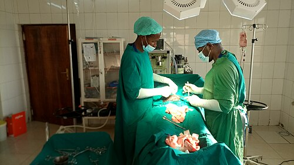

# TOLAC: PARTO VAGINAL APÓS CESÁREA, CRITÉRIOS E RISCO DE ROTURA

Para começarmos nossa discussão, precisamos alinhar a terminologia que as bancas de residência e a prática clínica exigem. O termo TOLAC (Trial of Labor After Cesarean) refere-se à **tentativa** de trabalho de parto após uma cesariana. Já o VBAC (Vaginal Birth After Cesarean) é o **sucesso** dessa tentativa.

Por que isso é tão debatido? Porque estamos em uma balança constante entre os riscos de uma cirurgia iterativa (repetida), como o acretismo placentário e lesões vesicais, e o risco catastrófico da rotura uterina durante o trabalho de parto. Como professor, vejo muitos alunos decorando listas, mas o segredo aqui é entender a integridade da cicatriz uterina.

*Figura 1 - O TOLAC (Trial of Labor After Cesarean) permite parto vaginal após cesárea em pacientes selecionadas. Critérios favoráveis: 1 cesárea prévia com histerotomia transversa baixa, sem contraindicações ao parto vaginal, e centro com equipe disponível para cesárea de emergência. Risco de rotura uterina: ~0,5-0,7%. Fonte: National Cancer Institute, Domínio Público | Wikimedia Commons*

## Fisiopatologia da Cicatriz Uterina e o Risco de Rotura

A segurança do TOLAC depende quase inteiramente de onde e como foi feita a incisão na cesárea anterior. O útero não é um órgão homogêneo. O segmento inferior, onde realizamos a incisão transversa (técnica de Kerr), é composto por menos fibras musculares e mais tecido conjuntivo em comparação ao corpo uterino.

Durante o trabalho de parto, o corpo uterino contrai e traciona o segmento inferior para cima. Se a cicatriz estiver no corpo (cesárea clássica ou corporal), ela será submetida a uma tensão mecânica absurda exatamente no local onde o músculo foi cortado e suturado. É por isso que a cicatriz corporal tem um risco de rotura de 4% a 9%, enquanto a cicatriz segmentar transversa apresenta um risco muito menor, em torno de 0,5% a 0,9%.

Aqui entra um conceito que o MedEvo sempre reforça: a rotura uterina não é apenas um "rasgo", é uma falha na integridade da parede que leva à comunicação da cavidade uterina com a cavidade peritoneal. Isso causa hemorragia materna maciça e interrupção imediata da circulação fetoplacentária.

## Critérios de Elegibilidade: Quem pode tentar o PVAC?

Segundo a FEBRASGO e as principais diretrizes nacionais, a seleção da paciente é o passo mais crítico. Não é toda paciente com cesárea prévia que pode entrar em trabalho de parto.

### Indicações e Condições Favoráveis

A candidata ideal para o TOLAC é aquela que possui:

- Uma única cesárea anterior realizada por incisão segmentar transversa.

- Apresentação cefálica fletida.

- Ausência de outras cicatrizes uterinas (como miomectomias que invadiram a cavidade endometrial).

- Uma indicação da cesárea anterior que não se repita (ex: a primeira foi por apresentação pélvica, e agora o feto está cefálico).

**Dica de Prova:** O fator preditivo de maior sucesso para um VBAC bem-sucedido é a paciente já ter tido um parto vaginal prévio (seja antes ou depois da cesárea). Se a paciente já pariu por baixo, a chance de sucesso do TOLAC sobe para mais de 85-90%.

### Contraindicações Absolutas

Você nunca deve permitir o TOLAC se houver:

- Cicatriz uterina clássica (vertical no corpo uterino) ou em "T" invertido.

- História de rotura uterina prévia.

- Incapacidade de realizar uma cesariana de emergência imediata (falta de equipe ou centro cirúrgico disponível).

- Contraindicações obstétricas gerais ao parto vaginal (ex: placenta prévia total, apresentação córmica, herpes genital ativo no momento do parto).

### Contraindicações Relativas e Zonas Cinzentas

A diretriz brasileira e o Dr. Will costumam destacar que duas cesáreas segmentares prévias não são uma contraindicação absoluta, mas o risco de rotura aumenta ligeiramente e a taxa de sucesso diminui. No entanto, para fins de prova, se a questão trouxer "três ou mais cesáreas", a conduta padrão costuma ser a cesariana eletiva devido ao risco acumulado de acretismo e rotura.

| Tipo de Incisão Anterior | Risco Estimado de Rotura | Conduta Recomendada |
| --- | --- | --- |
| Segmentar Transversa (Kerr) | 0,5% - 0,9% | Candidata ao TOLAC |
| Segmentar Vertical | 1% - 2% | Individualizar (Geralmente Cesárea) |
| Corporal ou Clássica | 4% - 9% | Contraindicação Absoluta ao TOLAC |
| Em "T" ou "J" | 4% - 9% | Contraindicação Absoluta ao TOLAC |

## O Manejo da Indução do Parto em Útero Cicatricial

Este é, sem dúvida, o tópico que mais gera erros em provas e na prática clínica. Preste muita atenção: **o útero cicatricial é extremamente sensível a métodos farmacológicos de indução.**

### O Perigo do Misoprostol

O uso de análogos da prostaglandina (Misoprostol) em pacientes com cesárea prévia é **contraindicado** para a indução do parto com feto vivo. O motivo? O misoprostol pode causar uma taquissistolia (excesso de contrações) imprevisível e incontrolável, o que eleva drasticamente o risco de rotura uterina na cicatriz.

**Pegadinha de Prova:** Se a questão falar de óbito fetal (feto morto) e uma cesárea prévia, o uso de misoprostol pode ser considerado em doses muito baixas e com vigilância estrita, mas para fetos vivos, a resposta correta para indução farmacológica com prostaglandina é "não".

### O Método de Krause (Sonda de Foley)

Se o colo está desfavorável (Índice de Bishop baixo) e precisamos induzir o parto em uma paciente com cesárea prévia, o método de escolha é o mecânico: a Sonda de Foley (Método de Krause).

Por que fazemos isso? Porque a sonda promove a maturação do colo por meio da distensão mecânica e liberação local de prostaglandinas endógenas, sem causar as contrações vigorosas e descoordenadas que o misoprostol causaria. É um método seguro, barato e que não aumenta o risco de rotura uterina.

### Uso de Ocitocina

A ocitocina pode ser usada? Sim, mas com cautela extrema. Ela deve ser reservada para a condução do trabalho de parto (quando ele já iniciou ou após a maturação cervical mecânica) e nunca para "forçar" um útero que não está respondendo. O aumento da dose deve ser lento e o monitoramento do bem-estar fetal deve ser contínuo.

*Figura 2 - Sinais de rotura uterina consumada: dor abdominal súbita ("rasgou"), parada das contrações, sinal de Reasens (subida da apresentação), sangramento vaginal, bradicardia fetal sustentada e choque hipovolêmico. Conduta: laparotomia de urgência. Fonte: Domínio Público | Wikimedia Commons*

## Diagnóstico de Rotura Uterina: O Pesadelo Obstétrico

Você precisa saber diferenciar a rotura iminente da rotura consumada. As bancas adoram descrever os sinais clássicos.

### Rotura Uterina Iminente (Sinal de Bandl-Frommel)

Imagine o útero tentando vencer uma obstrução. O segmento inferior estica tanto que se torna visível na palpação abdominal.

- **Sinal de Bandl:** É a formação de um anel que separa o corpo uterino (contraído e espesso) do segmento inferior (distendido e fino). No exame físico, parece uma "ampulheta" ou um "umbigo transverso".

- **Sinal de Frommel:** É o retesamento dos ligamentos redondos, que se tornam tensos e palpáveis como "cordas de violino" lateralmente ao útero.

Se você encontrar esses sinais, a rotura está prestes a acontecer. A conduta é interrupção imediata via cesariana.

### Rotura Uterina Consumada

Aqui, o útero já rompeu. O quadro clínico é dramático:

- **Dor súbita e lancinante:** A paciente sente algo "rasgando". Frequentemente, após a dor aguda, há uma calmaria temporária (a dor das contrações para porque o útero rompeu e não contrai mais de forma eficaz).

- **Hipotensão e Choque:** Hemorragia interna grave.

- **Subida da apresentação fetal:** O feto, que estava encaixado, "sobe" e sai da pelve (Sinal de Reasens).

- **Palpação fácil de partes fetais:** Como o feto saiu do útero e foi para a cavidade abdominal, você palpa o braço ou a perna do bebê logo abaixo da pele da mãe.

- **Bradicardia fetal súbita:** É o sinal mais precoce e comum em monitoramento contínuo.

**Diferencial Crítico:** Não confunda rotura uterina com deiscência de cicatriz. A deiscência é uma separação parcial da cicatriz, muitas vezes assintomática e descoberta apenas durante uma cesárea de repetição, sem hemorragia importante ou comprometimento fetal. A rotura é uma emergência catastrófica.

## Assistência ao Trabalho de Parto (TOLAC)

Como conduzimos o parto na prática? Segundo as recomendações atuais:

- **Monitoramento Fetal:** A ausculta intermitente frequente (a cada 15 min na dilatação e a cada 5 min no expulsivo) é aceitável, mas a cardiotocografia contínua é preferível, pois a bradicardia fetal é muitas vezes o primeiro sinal de alerta de uma rotura silenciosa.

- **Analgesia:** Pode ser realizada! Antigamente dizia-se que a analgesia mascararia a dor da rotura, mas hoje sabemos que a dor da rotura é "insuportável" e rompe o bloqueio da analgesia peridural comum. Além disso, uma paciente com cateter de analgesia já está "preparada" caso precise de uma cirurgia de urgência.

- **Partograma:** Deve ser iniciado assim que a paciente entrar na fase ativa. Qualquer desvio para a direita (distócia) deve ser visto com extrema suspeita. O útero cicatricial não tolera bem trabalhos de parto prolongados ou obstruídos.

## Complicações a Longo Prazo: O Espectro do Acretismo Placentário

Não podemos falar de cesárea prévia sem mencionar o acretismo placentário. Cada cesárea realizada cria uma área de fibrose no endométrio (decídua). Em uma gravidez subsequente, a placenta pode se implantar exatamente sobre essa cicatriz. Como a decídua ali é deficiente, as vilosidades placentárias invadem o miométrio.

- **Placenta Acreta:** Invade a camada superficial do miométrio.

- **Placenta Increta:** Invade profundamente o miométrio.

- **Placenta Percreta:** Atravessa o miométrio e pode atingir órgãos vizinhos (a bexiga é o alvo mais comum).

**Dica de Ouro:** Se a paciente tem cesárea prévia e a ultrassonografia atual mostra uma placenta prévia (baixa), o risco de acretismo é altíssimo. Essas pacientes devem ser rastreadas com USG Doppler e, se necessário, Ressonância Magnética entre 18 e 24 semanas.

## Situações Especiais e Mitos de Prova

### Miomectomia Prévia

Muitos alunos acham que apenas cesárea conta como cicatriz. Errado! Uma miomectomia onde houve abertura da cavidade endometrial (mioma intramural profundo ou submucoso) confere ao útero o mesmo risco (ou até maior) de uma cesárea corporal. Se a miomectomia foi apenas subserosa, o parto vaginal costuma ser seguro.

### Gemelaridade

Ter uma cesárea prévia e estar grávida de gêmeos não proíbe o TOLAC, desde que o primeiro feto seja cefálico e não haja outras contraindicações. No entanto, o estiramento uterino é maior, o que exige vigilância redobrada.

### Macrossomia Fetal

Fetos com peso estimado > 4.000g em mães com cesárea prévia aumentam significativamente o risco de rotura uterina durante o TOLAC. Muitas diretrizes sugerem cautela ou indicação de cesárea eletiva nesses casos para evitar a desproporção cefalopélvica (DCP).

| Situação Clínica | Conduta no TOLAC | Justificativa |
| --- | --- | --- |
| 1 Cesárea Anterior (Kerr) | Permitido | Risco de rotura < 1% |
| 2 Cesáreas Anteriores | Permitido (com cautela) | Risco de rotura ~1,5% - 2% |
| Colo Desfavorável | Sonda de Foley | Evita taquissistolia do Misoprostol |
| Suspeita de Macrossomia | Evitar TOLAC | Aumento da tensão na cicatriz |
| Cicatriz Corporal | Proibido | Risco de rotura de até 9% |

## Diagnóstico Diferencial de Dor Abdominal no Trabalho de Parto

Quando uma gestante com cesárea prévia apresenta dor súbita, você deve pensar em:

- **Descolamento Prematuro de Placenta (DPP):** Também causa dor e sofrimento fetal, mas geralmente apresenta hipertonia uterina (útero de madeira) e sangramento vaginal escuro. Na rotura, o útero fica hipotônico após o evento.

- **Apendicite ou Colecistite:** Podem ocorrer na gestação, mas geralmente não causam bradicardia fetal súbita ou subida da apresentação.

- **Rotura de Vasa Prévia:** Causa sangramento vivo e sofrimento fetal logo após a amniorrexe, mas sem a dor abdominal intensa da rotura uterina.

## Aspectos Legais e Éticos no Brasil

No Brasil, a Resolução do CFM e as diretrizes do Ministério da Saúde enfatizam a autonomia da paciente. Se a paciente deseja um TOLAC e tem critérios de segurança, o médico deve apoiar, desde que em ambiente hospitalar adequado. Por outro lado, se a paciente tem uma cesárea prévia e deseja uma nova cesárea eletiva (após 39 semanas), ela tem esse direito garantido após ser informada dos riscos.

Lembre-se da regra dos 60 dias para laqueadura tubária: se a paciente decidir pela laqueadura durante a cesárea iterativa, o documento de consentimento deve ter sido assinado com pelo menos 60 dias de antecedência, fora do período de parto/puerpério, exceto em casos de risco de vida materno.

## Resumo do Manejo Clínico

Imagine que chega no seu plantão uma G2C1, 39 semanas, em trabalho de parto espontâneo, 4 cm de dilatação, feto cefálico.

- **Avalie a cicatriz anterior:** Foi segmentar? Sim.

- **Avalie o partograma:** A dilatação está progredindo? Sim.

- **Monitore:** Ausculta fetal rigorosa.

- **Prepare-se:** Se a dilatação parar ou o BCF cair, não insista. O limiar para indicar a cesárea no TOLAC deve ser baixo.

Se essa mesma paciente chegasse com 41 semanas e colo fechado (Bishop 2):

- **Internação.**

- **Maturação com Sonda de Foley.**

- **Aguardar eliminação da sonda ou 24h.**

- **Se colo melhorar -> Ocitocina/Amniotomia.**

- **Se colo permanecer desfavorável -> Reavaliar via de parto (provável cesárea).**

## Pontos-Chave para Prova

- **Misoprostol:** Contraindicação absoluta em pacientes com cesárea prévia e feto vivo.

- **Método de Krause (Foley):** Padrão-ouro para amadurecimento cervical em útero cicatricial.

- **Cicatriz Corporal/Clássica:** Contraindicação absoluta ao parto vaginal (risco de rotura 4-9%).

- **Sinal de Bandl-Frommel:** Indica rotura uterina iminente (Anel de Bandl + Ligamentos de Frommel).

- **Sinal de Reasens:** Subida da apresentação fetal no canal de parto, indicativo de rotura consumada.

- **Principal fator de sucesso para VBAC:** Parto vaginal anterior.

- **Bradicardia Fetal:** É o sinal mais frequente de rotura uterina durante o trabalho de parto.

- **Espessura do Segmento:** Valores de USG < 2,0 mm a 2,5 mm no final da gestação estão associados a maior risco de rotura, embora o uso clínico isolado seja debatido.

- **Acretismo Placentário:** O risco aumenta exponencialmente com o número de cesáreas prévias (especialmente se houver placenta prévia).

- **Analgesia de Parto:** Não é contraindicada e não mascara a dor da rotura uterina grave.

- **Incisão de Kerr:** É a incisão segmentar transversa, a mais segura para futuras gestações.

- **Miomectomia:** Só contraindica parto vaginal se tiver havido abertura da cavidade endometrial.

- **Apresentação Córmica:** Indicação absoluta de cesariana, independente de cicatriz prévia.

- **Rotura Uterina:** É uma emergência que exige laparotomia imediata, não conduta conservadora.

- **GBS Positivo:** Se a paciente com cesárea prévia entrar em TOLAC, deve receber antibioticoprofilaxia para Estreptococo do Grupo B conforme o protocolo padrão. 🩺

 Cópia offline para consulta pessoal.
 Fonte original:
 [https://www.medevo.com.br/material-apoio/ler/7cfad33a-3eec-4133-bd0f-6c09a50b6e74](https://www.medevo.com.br/material-apoio/ler/7cfad33a-3eec-4133-bd0f-6c09a50b6e74)
