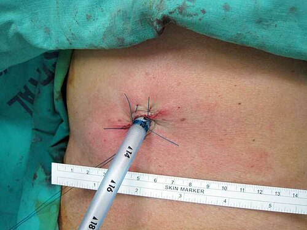

# TORACOTOMIA DE EMERGÊNCIA

Para entender a toracotomia de emergência, a primeira coisa que você precisa fazer é separar dois conceitos que as bancas de residência adoram misturar: a **Toracotomia de Reanimação (TR)**, feita na sala de emergência (o famoso "abrir no PS"), e a **Toracotomia de Urgência**, realizada no centro cirúrgico.

Como professor, vejo muitos alunos perderem questões por não saberem se o paciente deve ir direto para o bloco ou se a faca deve entrar ali mesmo, na maca do trauma. Vamos dissecar esses critérios, porque é aqui que o examinador testa se você será um médico que salva vidas ou um que apenas decora protocolos sem entender a fisiopatologia.

## Fisiopatologia e Racional do Procedimento

Por que abrimos o tórax de alguém que está morrendo? Não é um ato de desespero, é uma manobra de controle de danos extrema. O objetivo da toracotomia de reanimação baseia-se em quatro pilares fisiológicos:

- **Liberação de Tamponamento Cardíaco:** O pericárdio é uma membrana fibrosa e inelástica. Se houver 100-150 mL de sangue ali dentro, a pressão intrapericárdica supera a pressão de enchimento do ventrículo direito. O coração para de bater porque não consegue expandir para receber sangue. Abrir o pericárdio (pericardiotomia) resolve o choque obstrutivo instantaneamente.

- **Controle de Hemorragia Exanguinante:** Seja por lesão de grandes vasos (aorta, veia cava) ou lesão hilar pulmonar.

- **Massagem Cardíaca Interna (MCI):** A massagem externa no trauma é pouco eficiente, especialmente em pacientes hipovolêmicos. A MCI permite um débito cardíaco até 25% maior que a externa, mantendo a perfusão cerebral e coronariana enquanto se repõe volume.

- **Clampeamento da Aorta Descendente:** Ao clampear a aorta logo acima do diafragma, você redireciona o pouco sangue que resta para os dois órgãos que não toleram isquemia: o coração e o cérebro. Além disso, você interrompe hemorragias maciças que estejam ocorrendo no abdome (como uma ruptura de baço ou lesão de veia renal).

## Indicações: O Divisor de Águas nas Provas

Este é o tópico mais cobrado. Se você decorar esta seção, já acerta 50% das questões sobre o tema. As indicações variam conforme o mecanismo do trauma (penetrante vs. contuso).

### Trauma Penetrante (Arma Branca ou Fogo)

O prognóstico aqui é muito melhor. Se o paciente teve sinais de vida (movimentação, respiração, reatividade pupilar ou atividade elétrica no ECG) na cena ou no hospital, mas evoluiu para Parada Cardiorrespiratória (PCR) presenciada, a indicação é **imediata**.

- **Pérola de Prova:** Ferimento penetrante em "Zona de Ziedler" (área precordial delimitada pela linha clavicular, apêndice xifoide e linhas hemiclaviculares) + PCR em AESP (Atividade Elétrica Sem Pulso) = Toracotomia de Reanimação imediata.

### Trauma Contuso (Atropelamentos, Quedas, Colisões)

Aqui o buraco é mais embaixo. O trauma contuso geralmente envolve lesões multissistêmicas e energia cinética muito maior. A sobrevida na TR por trauma contuso é inferior a 1-2%.

- **Indicação:** Apenas se a PCR for presenciada dentro do hospital e o paciente tiver sinais de vida recentes. Se ele chegou em PCR da rua após um trauma contuso, a toracotomia é geralmente considerada fútil.

### Critérios de Hemotórax Maciço (Toracotomia de Urgência)

Muitas vezes, o paciente não está em PCR, mas o dreno de tórax "denuncia" que ele precisa de cirurgia. Guarde estes números, eles caem em TODAS as provas:

- **Drenagem imediata:** > 1.500 mL de sangue logo após a inserção do dreno.

- **Drenagem contínua:** > 200 a 300 mL/h nas primeiras 2 a 4 horas.

- **Instabilidade persistente:** Paciente que, apesar da drenagem e reposição volêmica, mantém necessidade transfusional contínua para estabilizar a hemodinâmica.

**Cuidado com a pegadinha:** A banca vai dizer que o paciente drenou 500 mL na primeira hora e está estável. Isso NÃO é indicação de toracotomia imediata. O corte é 1.500 mL inicial ou o débito horário mantido.

### Tabela 1: Indicações de Toracotomia de Reanimação (ATLS 10ª Ed)

| Cenário Clínico | Conduta | Justificativa |
| --- | --- | --- |
| Trauma Penetrante + PCR presenciada | **Indicação Forte** | Alta chance de tamponamento reversível |
| Trauma Contuso + PCR presenciada no PS | **Pode ser considerada** | Baixa sobrevida, mas aceitável se imediata |
| Trauma Penetrante + Sinais de vida na cena | **Indicação Relativa** | Depende do tempo de transporte |
| Trauma Contuso + Sem sinais de vida na cena | **Contraindicada** | Futilidade terapêutica |
| Assistolia prolongada (> 15 min) | **Contraindicada** | Lesão cerebral irreversível |

## Contraindicações: Quando não abrir

Como professor, reforço: saber quando NÃO operar é tão importante quanto saber quando operar. A toracotomia de reanimação é um procedimento de alto risco para a equipe (risco de acidentes perfurocortantes com HIV/Hepatite em um ambiente caótico).

- **Trauma contuso sem sinais de vida na cena.**

- **Assistolia prolongada** sem sinais de vida (mais de 15-20 minutos).

- **Trauma cranioencefálico (TCE) grave e óbvio** (exposição de massa encefálica) associado à PCR.

- **Múltiplos traumas fatais** onde a sobrevida é impossível.

*Figura 1 - Estetoscópio, símbolo da prática médica e do atendimento de emergência. Fonte: Domínio Público | Wikimedia Commons*

## Técnica Cirúrgica: O Passo a Passo no Caos

A via de escolha para a emergência é a **Toracotomia Ântero-lateral Esquerda**.

**Por que a esquerda?**
Porque a maioria das pessoas é destra (facilita o acesso ao cirurgião), mas o motivo técnico real é que ela oferece o melhor acesso ao coração (ventrículo esquerdo), ao hilo pulmonar esquerdo e, crucialmente, à aorta descendente para o clampeamento.

### Anatomia da Parede e Incisão

O corte deve ser feito no **5º espaço intercostal (EIC)**. Para localizar rápido: no homem, é logo abaixo do mamilo; na mulher, na prega inframamária.
A incisão atravessa:

- Pele e tecido subcutâneo.

- Músculo Peitoral Maior (fibras inferiores).

- Músculo **Serrátil Anterior**.

- Músculos Intercostais.

**Dica do Dr. Will:** Cuidado com o feixe vasculonervoso intercostal! Ele corre na borda INFERIOR da costela superior. Portanto, a incisão no espaço intercostal deve ser feita rente à borda SUPERIOR da costela inferior.

### Manobras Intratorácicas

Uma vez dentro do tórax, o cirurgião usa o afastador de Finochietto. A ordem de prioridade é:

- **Pericardiotomia:** Abrir o pericárdio longitudinalmente, anterior ao nervo frênico. Se você cortar o nervo frênico, o paciente terá paralisia diafragmática definitiva (se sobreviver).

- **Clampeamento da Aorta:** A aorta está localizada logo à frente da coluna vertebral. É preciso dissecar a pleura parietal e identificar o esôfago (que é anterior à aorta) para não clampeá-lo por erro.

- **Massagem Cardíaca Interna:** Deve ser feita com as duas mãos (técnica de "aplauso"), comprimindo o coração do ápice para a base. Nunca use apenas os dedos, pois você pode perfurar o ventrículo direito, que é muito fino.

*Figura 2 - Profissional de saúde em atendimento, representando o manejo de emergências torácicas. Fonte: National Cancer Institute, Domínio Público | Wikimedia Commons*

## Manejo de Lesões Específicas

### Trauma Cardíaco

Se houver uma ferida no miocárdio, o controle inicial pode ser feito com o dedo (digital) ou com uma sonda de Foley. Insufla-se o balão da sonda dentro do ventrículo e traciona-se levemente para ocluir o orifício. A sutura definitiva deve ser feita com fios inabsorvíveis (Prolene 3-0) e, se possível, com "pledgets" (almofadinhas de teflon) para o fio não "rasgar" o músculo cardíaco friável.

### Lesões de Grandes Vasos e Hilo Pulmonar

Se o sangramento vier do pulmão e for maciço, a manobra de escolha é o **"Hilar Twist"** (torção do hilo) ou o clampeamento total do hilo pulmonar. Isso interrompe o fluxo da artéria e veias pulmonares imediatamente.

### Lesões de Via Aérea (Traqueia e Carina)

Aqui mora uma pegadinha clássica de prova.

- **Carina traqueal:** Para melhor exposição e controle cirúrgico da carina, a via de escolha é a **Toracotomia Direita**. A aorta "atrapalha" o acesso à carina pela esquerda.

- **Reparo Traqueal:** O limite máximo de ressecção traqueal para uma anastomose primária sem tensão excessiva é de **5 cm**. Mais que isso, o risco de deiscência é altíssimo.

### Tabela 2: Localização da Lesão vs. Melhor Acesso Cirúrgico

| Suspeita de Lesão | Acesso Cirúrgico de Escolha |
| --- | --- |
| Reanimação / Coração / Aorta Descendente | Toracotomia Ântero-lateral Esquerda |
| Carina Traqueal / Esôfago Médio | Toracotomia Direita |
| Lesão de Vasos da Base (Tronco Braquiocefálico) | Esternotomia Mediana |
| Lesão Tóraco-Abdominal (Exposição de ambos) | Toracofrenolaparotomia ou "Clamshell" |
| Hemotórax Maciço Estável | Videotoracoscopia (VATS) - *Apenas se estável!* |

## O Conceito de "Clamshell" (Esternotomia Transversa)

Se você abriu o lado esquerdo e percebeu que a lesão está no lado direito (ex: lesão de veia cava inferior ou átrio direito), você estende a incisão através do esterno até o outro lado. Isso é a toracotomia em "concha" ou *clamshell*. Ela oferece a maior exposição possível de todos os órgãos intratorácicos.

## Complicações e Prognóstico

A sobrevida global da toracotomia de reanimação é baixa (cerca de 7-10%), mas em subgrupos específicos (trauma por arma branca com tamponamento), pode chegar a 30%.

As complicações para os sobreviventes incluem:

- **Síndrome de Baixo Débito Cardíaco:** O coração sofreu isquemia durante a PCR.

- **Coagulopatia:** Pela transfusão maciça e hipotermia (Tríade da Morte).

- **Infecções:** A cirurgia é feita em ambiente não estéril. Mediastinite e empiema são comuns.

- **Lesão de Nervo Frênico ou Recurrente Laríngeo:** Por dissecção apressada no PS.

## Diagnóstico Diferencial de Choque no Trauma Torácico

Nem todo choque no trauma torácico é hipovolêmico. Como professor, exijo que meus alunos saibam diferenciar isso no exame físico, pois a conduta muda completamente.

- **Pneumotórax Hipertensivo:** MV abolido + Timpanismo + Turgência Jugular + Desvio da Traqueia. Conduta: Toracocentese de alívio (imediata) seguida de drenagem.

- **Tamponamento Cardíaco:** MV presente + Bulhas Abafadas + Turgência Jugular + Hipotensão (Tríade de Beck). Conduta: Toracotomia (ou pericardiocentese se a toracotomia não for possível de imediato).

- **Hemotórax Maciço:** MV abolido + Macicez à percussão + Veias do pescoço colabadas (choque hipovolêmico). Conduta: Drenagem + Toracotomia se critérios de volume.

### Tabela 3: Diferencial Clínico no Trauma Torácico

| Achado Clínico | Pneumotórax Hipertensivo | Tamponamento Cardíaco | Hemotórax Maciço |
| --- | --- | --- | --- |
| **Murmúrio Vesicular** | Abolido | Presente | Abolido |
| **Percussão** | Timpânico | Normal | Maciço |
| **Jugulares** | Turgentes | Turgentes | Colabadas |
| **Traqueia** | Desviada | Central | Central/Desviada |
| **Tratamento** | Punção/Dreno | Toracotomia | Dreno/Toracotomia |

## Situações Especiais e Outras Cirurgias Torácicas

Embora o foco seja a emergência, as bancas costumam puxar ganchos para outros temas de cirurgia torácica.

### Estenose Traqueal Pós-Intubação

Paciente que ficou semanas na UTI, foi extubado e agora volta com estridor (cornagem) e esforço respiratório.

- **Diagnóstico:** Broncoscopia rígida (que também serve para dilatação).

- **Tratamento inicial:** Oxigênio, corticoide.

- **Tratamento definitivo:** Ressecção e anastomose do segmento estenosado.

### Simpatectomia Torácica (Hiperidrose)

Muito comum em provas de cirurgia.

- **Complicação mais temida:** Sudorese compensatória (o paciente para de suar na mão, mas começa a suar absurdamente nas costas ou coxas).

- **Síndrome de Horner:** Se houver lesão do gânglio estrelado (T1), o paciente terá ptose, miose e enoftalmia.

- **Dica de Prova:** Bradicardia NÃO é uma complicação comum da simpatectomia.

### Malformações Congênitas

- **Pectus Excavatum:** O tórax "em funil". É a deformidade mais comum.

- **Pectus Carinatum:** O tórax "em peito de pombo".

## Exemplo Clínico 1: O Cenário Clássico de Prova

Homem, 24 anos, ferimento por arma branca em 4º EIC esquerdo, linha hemiclavicular. Chega ao PS pálido, sudoreico, PA 70/40 mmHg, FC 130 bpm. Jugulares visíveis. MV presente bilateralmente.
**O que fazer?**
Este paciente tem a Tríade de Beck (Hipotensão, Bulhas abafadas - implícitas pelo choque e MV presente - e Turgência Jugular). O diagnóstico é Tamponamento Cardíaco. Se ele evoluir para PCR na sua frente, a conduta é Toracotomia de Reanimação imediata no PS. Se ele ainda tem pulso, ele deve voar para o Centro Cirúrgico para uma Toracotomia de Urgência.

## Exemplo Clínico 2: A Pegadinha do Dreno

Vítima de queda de 5 metros. Drenagem de tórax à direita com saída imediata de 1.200 mL de sangue. Após 1 hora, o dreno apresenta débito de 350 mL/h. Paciente mantém-se hipotenso apesar de 2 concentrados de hemácias.
**Conduta?**
Embora o volume inicial (1.200 mL) tenha sido menor que os 1.500 mL clássicos, o débito horário (> 200-300 mL/h) e a instabilidade persistente fecham a indicação de Toracotomia de Urgência. No MedEvo, sempre ensinamos: olhe o conjunto, não apenas um número isolado.

## Considerações sobre a Via Aérea no Trauma Torácico

Muitas vezes, a toracotomia de emergência é indicada para controle de choque, mas o manejo da via aérea é o que mata o paciente primeiro.

- **Hemorragia de via aérea:** Se o paciente está "afogando" no próprio sangue vindo do pulmão, a intubação seletiva (com tubo de duplo lúmen ou intubação do brônquio contralateral) pode ser necessária para proteger o pulmão sadio.

- **Lesão Traqueobrônquica:** Suspeite se houver um grande escape aéreo pelo dreno de tórax (o selo d'água não para de borbulhar) e o pulmão não expande mesmo com o dreno.

## Pontos-Chave para Prova

- **Indicação de Toracotomia de Reanimação (TR):** Trauma penetrante com PCR presenciada ou sinais de vida recentes. No trauma contuso, os critérios são muito mais restritos (PCR presenciada no hospital).

- **Hemotórax Maciço:** > 1.500 mL de drenagem inicial OU > 200-300 mL/h nas primeiras 2-4 horas.

- **Via de Acesso:** Toracotomia Ântero-lateral Esquerda no 5º EIC (regra para reanimação).

- **Clampeamento Aórtico:** Feito na aorta descendente, acima do diafragma, para priorizar fluxo cerebral/coronariano e controlar sangramento abdominal.

- **Zona de Ziedler:** Área de alto risco para lesão cardíaca (entre as linhas hemiclaviculares, da clavícula ao xifoide).

- **Contraindicação Absoluta:** Trauma contuso sem sinais de vida na cena; assistolia prolongada (> 15-20 min); TCE grave com exposição de massa encefálica.

- **Músculos Seccionados:** Peitoral maior, serrátil anterior e intercostais. O grande dorsal geralmente é preservado na incisão ântero-lateral, mas pode ser seccionado em toracotomias póstero-laterais.

- **Lesão de Carina:** Acesso por Toracotomia Direita (a aorta impede o acesso fácil pela esquerda).

- **Nervo Frênico:** Passa anterior ao hilo pulmonar; deve ser preservado durante a pericardiotomia (incisão deve ser paralela e anterior ao nervo).

- **Massagem Cardíaca Interna:** Técnica de "aplauso" com as duas mãos; evita perfuração do ventrículo direito.

- **FAST no Trauma Torácico:** Fundamental para identificar líquido no pericárdio (tamponamento) em pacientes instáveis.

- **Sinais de Vida:** Incluem esforço respiratório espontâneo, resposta pupilar, movimentos voluntários e atividade elétrica cardíaca organizada.

- **Hérnia Diafragmática:** Mais comum à esquerda; tratamento é cirúrgico (laparoscopia se estável, laparotomia/toracotomia se instável) com sutura não absorvível.

- **Ressecção Traqueal:** Limite de 5 cm para evitar tensão na anastomose.

- **O que NÃO fazer:** Não indicar TR em trauma contuso que chegou em assistolia da rua. Não esperar o dreno chegar a 1.500 mL se o paciente está morrendo em choque obstrutivo (tamponamento). 🩺

 Cópia offline para consulta pessoal.
 Fonte original:
 [https://www.medevo.com.br/material-apoio/ler/97f6676f-9a77-47c0-8b56-8bfe214bdaff](https://www.medevo.com.br/material-apoio/ler/97f6676f-9a77-47c0-8b56-8bfe214bdaff)
