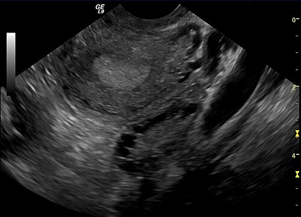

# TORÇÃO OVARIANA

A torção ovariana é uma daquelas emergências que separa o médico que apenas decorou o livro do médico que realmente entende a dinâmica da pelve feminina. Nas provas de residência, ela é a "queridinha" dos temas de abdome agudo ginecológico porque exige que você saiba diferenciar, com precisão, quadros muito parecidos, como a gravidez ectópica e a doença inflamatória pélvica (DIP).

Para entender a torção, imagine o ovário como um pêndulo. Ele não está solto na pelve, mas sim ancorado por dois ligamentos principais: o ligamento infundibulopélvico (que traz a artéria ovariana) e o ligamento útero-ovariano (próprio do ovário). A torção ocorre quando o ovário gira em torno desses pedículos vasculares, interrompendo o fluxo sanguíneo.

*Figura 1 - Profissional de saúde em atendimento, representando a avaliação ginecológica de urgência. Fonte: National Cancer Institute, Domínio Público | Wikimedia Commons*

## Fisiopatologia: O Porquê da Isquemia

Por que o ovário torce? Na maioria das vezes, ele precisa de um "peso" para servir de pivô. Em cerca de 50 a 80% dos casos, existe uma massa ovariana associada. O tamanho crítico que as bancas adoram cobrar é acima de 5 cm. Massas menores são leves demais para gerar o torque necessário, e massas gigantescas (como grandes cistoadenomas que ocupam todo o abdome) não têm espaço físico para girar.

O grande vilão das provas é o Teratoma Cístico Maduro (Cisto Dermoide). Ele é o tumor benigno mais comum e, por possuir densidades diferentes no seu interior (gordura, cabelo, dentes), ele cria um desequilíbrio de peso que facilita a rotação.

A sequência de eventos na torção é fundamental para entender o diagnóstico por imagem:

- Obstrução Venosa: As veias têm paredes finas e baixa pressão. São as primeiras a colapsar.

- Congestão e Edema: O sangue entra pela artéria, mas não sai pela veia. O ovário incha drasticamente.

- Obstrução Arterial: O edema fica tão intenso que a pressão intersticial supera a pressão arterial, ou a própria torção aperta a artéria. Só aqui ocorre o infarto hemorrágico.

Aqui está um "pulo do gato" que o Dr. Will sempre enfatiza: a torção é mais comum à direita. Por quê? Porque do lado esquerdo temos o cólon sigmoide, que ocupa espaço e "estabiliza" o anexo esquerdo, dificultando sua rotação. Se a prova trouxer uma dor súbita em fossa ilíaca direita (FID), sua mente deve oscilar entre apendicite e torção ovariana.

## Quadro Clínico: A Dor que Não Deixa Dúvidas

O sintoma clássico é a dor pélvica de início súbito e intensidade lancinante. Diferente da dor da DIP, que é progressiva e geralmente acompanhada de febre, a dor da torção é um "soco".

Muitas vezes, a paciente relata que a dor começou após um esforço físico ou atividade sexual, momentos em que a movimentação pélvica favoreceu o giro do ovário sobre o próprio eixo. Outro ponto crucial: náuseas e vômitos estão presentes em cerca de 70% dos casos. No abdome agudo ginecológico, se a paciente está vomitando muito, pense logo em torção ou apendicite, e menos em cisto roto simples.

No exame físico, você encontrará:

- Dor à palpação profunda da fossa ilíaca acometida.

- Massa anexial palpável (em até 90% dos casos, embora em crianças o ovário possa torcer sem massa prévia).

- Sinais de irritação peritoneal (Blumberg positivo) podem aparecer tardiamente, indicando necrose ou isquemia avançada.

Cuidado com a pegadinha: a paciente pode ter episódios de dor que vêm e vão. Isso acontece na chamada "torção intermitente", onde o ovário torce e destorce sozinho. Não descarte o diagnóstico só porque a dor melhorou momentaneamente no pronto-socorro.

## Diagnóstico: O Papel do Doppler e Seus Limites

O exame de escolha é a Ultrassonografia Transvaginal (ou pélvica em virgens e crianças). Mas atenção, aqui é onde a maioria dos alunos erra na prova.

O achado mais sensível na USG não é a ausência de fluxo ao Doppler, mas sim o aumento do volume ovariano (edema) e o desvio dos folículos para a periferia do ovário (devido ao edema central).

### O Sinal do Redemoinho (Whirlpool Sign)

Este é o sinal patognomônico. É a visualização direta do pedículo vascular torcido. Se a questão mencionar "sinal do redemoinho" ou "whirlpool sign", não perca tempo: o diagnóstico é torção.

### A Armadilha do Doppler

Muitas questões de prova colocam: "Presença de fluxo arterial ao Doppler exclui torção ovariana?". A resposta é um sonoro NÃO.
Como o ovário tem suprimento sanguíneo duplo (artéria ovariana e ramos da artéria uterina), o fluxo arterial pode persistir mesmo em um ovário torcido. Além disso, a torção pode ser parcial ou intermitente. Portanto, o Doppler ajuda se vier alterado (fluxo venoso ausente é um sinal precoce), mas se vier normal, ele não descarta a emergência se a clínica for soberana.

### Tabela 1: Achados Ultrassonográficos na Torção Ovariana

| Achado | Significado Clínico |
| --- | --- |
| Aumento do volume ovariano (> 20 cm³ ou 3x o lado oposto) | Edema por obstrução venosa/linfática |
| Folículos periféricos ("Colar de Pérolas") | Edema do estroma central empurrando os folículos |
| Sinal do Redemoinho (Whirlpool Sign) | Visualização do pedículo vascular torcido |
| Líquido livre na pelve | Reação inflamatória ou rotura associada |
| Ausência de fluxo venoso | Sinal precoce de comprometimento vascular |
| Massa anexial (ex: Teratoma) | Fator predisponente (pivô da torção) |

## Diagnóstico Diferencial: Onde a Prova te Testa

Você precisa saber diferenciar a torção das outras três grandes causas de dor pélvica aguda. No MedEvo, ensinamos a olhar sempre para o Beta-HCG e para os sinais sistêmicos.

- Gravidez Ectópica Rota: Aqui o Beta-HCG é POSITIVO. A dor também é súbita, mas costuma haver atraso menstrual e sinais de choque hipovolêmico (hipotensão, taquicardia) mais precoces devido ao hemoperitônio.

- Doença Inflamatória Pélvica (DIP): A dor é mais "arrastada" (subaguda), há febre, corrimento vaginal fétido e dor intensa à mobilização do colo uterino. O Beta-HCG é negativo.

- Cisto Ovariano Roto: A dor é súbita, mas costuma melhorar após o evento inicial. Se for um cisto simples, a conduta é apenas observação. Se for um corpo lúteo hemorrágico, pode haver sinais de irritação peritoneal por sangue, mas sem a massa persistente da torção.

- Apendicite Aguda: A dor geralmente começa periumbilical e migra para a FID. Há anorexia (a paciente não quer comer) e febre baixa. Às vezes, só a laparoscopia diferencia.

### Tabela 2: Diferencial do Abdome Agudo Ginecológico

| Patologia | Início da Dor | Beta-HCG | Febre | Achado USG |
| --- | --- | --- | --- | --- |
| **Torção Ovariana** | Súbito | Negativo | Rara (só se necrose) | Ovário aumentado, edema, massa |
| **Ectópica Rota** | Súbito | **Positivo** | Não | Líquido livre, massa anexial, útero vazio |
| **DIP / Abscesso** | Gradual | Negativo | **Presente** | Massa complexa (abscesso), trompas espessadas |
| **Cisto Roto** | Súbito | Negativo | Não | Líquido livre, ovário de tamanho normal |

*Figura 2 - Estetoscópio, símbolo da prática médica e do cuidado à saúde da mulher. Fonte: Domínio Público | Wikimedia Commons*

## Tratamento: O Fim do Mito da Ooforectomia

Antigamente, ensinava-se que, se o ovário estivesse "preto" (cianótico/isquêmico), deveríamos retirá-lo (ooforectomia) sem destorcer, pelo risco de embolia pulmonar ou liberação de toxinas.

Esqueça isso. A conduta moderna, preconizada pela FEBRASGO e pelas principais diretrizes internacionais, é a Destorção com Preservação Ovariana, independentemente da aparência macroscópica do ovário.

Por que fazemos isso? Porque o ovário tem uma capacidade incrível de recuperação. Mesmo aquele ovário que parece "morto" na cirurgia pode retomar sua função endócrina e folicular em até 90% dos casos após a destorção. Em mulheres em idade fértil e crianças, a preservação é a regra de ouro.

### A Conduta Passo a Passo:

- Estabilização Hemodinâmica: Se houver sinais de choque (raro na torção pura, mas possível se houver rotura associada), iniciar cristaloides.

- Via de Acesso: A Videolaparoscopia é o padrão-ouro. Ela permite o diagnóstico definitivo e o tratamento com menor trauma cirúrgico. A laparotomia fica reservada para massas gigantescas ou suspeita de malignidade.

- Destorção: Girar o ovário no sentido contrário à torção.

- Avaliação da Massa: Se houver um cisto (como um teratoma), o ideal é realizar a cistectomia (retirada apenas do cisto) para evitar nova torção. No entanto, em vigência de muito edema, alguns cirurgiões preferem destorcer e programar a retirada do cisto para 6 a 8 semanas depois, quando o tecido estiver menos friável.

- Ooforopexia: Consiste em fixar o ovário no ligamento largo ou no útero para evitar recidiva. Não é obrigatória, mas deve ser considerada se o ovário for muito móvel ou se for uma torção recorrente.

Quando fazer Ooforectomia? Apenas em três situações muito específicas:

- Mulheres na pós-menopausa (onde o ovário não tem mais função e o risco de malignidade é maior).

- Suspeita óbvia de malignidade (massa com características sólidas, vegetações, ascite).

- Tecido ovariano que literalmente se desintegra ao toque (necrose completa e liquefação).

## Situações Especiais

### Torção na Gestação

Ocorre mais frequentemente no primeiro trimestre, quando o corpo lúteo (que pode chegar a 5-6 cm) atua como o peso que predispõe à torção. O tratamento é cirúrgico (preferencialmente laparoscópico) e não se deve esquecer da suplementação de progesterona se o corpo lúteo for removido antes de 10 a 12 semanas de gestação, para evitar o abortamento.

### Torção em Crianças e Adolescentes

É uma causa importante de abdome agudo. Nestas pacientes, o ovário pode torcer mesmo sem massas, devido à maior mobilidade dos ligamentos (anexos longos). O quadro clínico pode ser mais vago, com dores abdominais intermitentes. A conduta é sempre conservadora (destorção), visando preservar o futuro reprodutivo.

### O Diagnóstico Diferencial com Torção Testicular

Embora pareça estranho em uma aula de ginecologia, as bancas adoram comparar os dois. A torção testicular em adolescentes é uma emergência urológica com dor súbita, testículo horizontalizado e ausência do reflexo cremastérico. O diagnóstico também é clínico + Doppler, e a cirurgia deve ser feita em até 6 horas para salvar o órgão.

## Complicações e Prognóstico

Se não tratada, a torção evolui para necrose completa, formação de abscesso e peritonite. No entanto, com o tratamento oportuno, o prognóstico é excelente.

Um ponto importante para o pós-operatório: se a paciente foi submetida a uma cirurgia inguinal ou pélvica e evolui com dor crônica, alodínia (dor ao toque leve) ou formigamento na região, pense em dor neuropática por lesão de nervos locais (como o ilioinguinal ou genitofemoral). Nesses casos, o tratamento de primeira linha não é anti-inflamatório, mas sim neuromoduladores como a Gabapentina.

## Pontos-Chave para Prova

- A torção ovariana é uma emergência cirúrgica; o atraso no tratamento leva à perda definitiva da função ovariana.

- O fator de risco mais comum é uma massa ovariana > 5 cm, sendo o Teratoma Cístico Maduro (Cisto Dermoide) o mais frequente.

- A dor é súbita, unilateral (mais comum à direita) e frequentemente associada a náuseas e vômitos.

- O sinal do redemoinho (Whirlpool sign) na ultrassonografia é o achado mais específico para o diagnóstico.

- Presença de fluxo ao Doppler NÃO exclui o diagnóstico; a clínica e o edema ovariano na USG são mais soberanos.

- O principal diagnóstico diferencial com Beta-HCG positivo é a Gravidez Ectópica Rota.

- O principal diagnóstico diferencial com febre e dor à mobilização do colo é a DIP (Abscesso Tubo-ovariano).

- A conduta atual é a destorção cirúrgica com preservação do ovário, mesmo que ele pareça cianótico ("preto").

- A via preferencial de tratamento é a Videolaparoscopia.

- Ooforectomia direta só é recomendada em pacientes pós-menopausadas ou com suspeita de malignidade.

- Em gestantes, a torção é mais comum no 1º trimestre devido ao volume do corpo lúteo.

- Se houver cisto associado, a cistectomia deve ser realizada (na mesma cirurgia ou em segundo tempo) para evitar recidiva.

- Lembre-se: dor súbita + massa anexial + náuseas = Torção até que se prove o contrário.

- O sinal de Blumberg (descompressão brusca dolorosa) indica irritação peritoneal e sugere que o quadro já pode ter evolução para isquemia/necrose ou rotura.

- DIP com abscesso > 5 cm ou sem melhora clínica exige internação e antibioticoterapia endovenosa (Clindamicina + Gentamicina).

- Cisto hemorrágico em paciente estável e sem irritação peritoneal deve ser manejado de forma conservadora (analgesia e observação). 🩺

 Cópia offline para consulta pessoal.
 Fonte original:
 [https://www.medevo.com.br/material-apoio/ler/f0d63a8a-895e-40b0-ad94-b687f8349e84](https://www.medevo.com.br/material-apoio/ler/f0d63a8a-895e-40b0-ad94-b687f8349e84)
