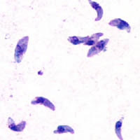
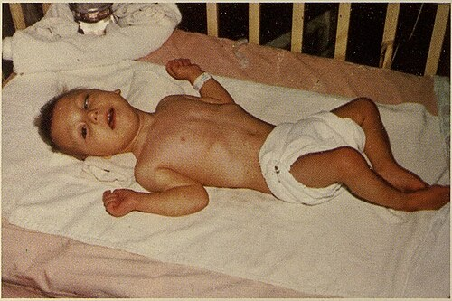

# TOXOPLASMOSE CONGÊNITA

A toxoplasmose congênita é um daqueles temas que, se você não dominar a lógica por trás dos exames, vai errar questões bobas na prova de residência. O grande segredo aqui não é decorar uma tabela de condutas, mas entender o que o parasita faz e como o nosso sistema imune responde a ele em diferentes momentos da gestação.

O agente etiológico você já conhece: o *Toxoplasma gondii*. O que as bancas querem saber, no entanto, é a dinâmica da transmissão vertical. Guarde esta regra de ouro, pois ela aparece em quase todas as provas: o risco de transmissão é inversamente proporcional à gravidade da lesão fetal.

No primeiro trimestre, a placenta é uma barreira mais eficiente, então o risco de o parasita passar para o feto é menor (cerca de 10 a 25%). Porém, se ele passar nesse período de organogênese, o estrago é enorme, levando frequentemente ao abortamento ou a sequelas graves. Já no terceiro trimestre, a placenta está mais permeável e "velha", facilitando a passagem do protozoário (risco de até 60 a 90%), mas o feto já está formado, o que resulta em quadros clínicos mais leves ou até assintomáticos ao nascimento.

*Figura 1 - Taquizoítos de Toxoplasma gondii corados com Giemsa, forma invasiva do parasita responsável pela toxoplasmose congênita. Fonte: DPDx/CDC, Domínio Público | Wikimedia Commons*

## Fisiopatologia e Transmissão: O Porquê da Urgência

Por que tratamos a gestante imediatamente após a suspeita? Porque a infecção fetal ocorre por via transplacentária após uma primoinfecção materna. Quando a gestante ingere oocistos (em água ou alimentos contaminados) ou cistos (em carne malcozida), o parasita cai na corrente sanguínea (fase de parasitemia). É nesse momento que ele pode colonizar a placenta e, posteriormente, infectar o feto.

Um erro comum de alunos é achar que toda gestante com sorologia positiva oferece risco. Lembre-se: o risco para o feto existe quase exclusivamente na primoinfecção durante a gestação. Se a mulher já teve toxoplasmose antes de engravidar (infecção remota), ela possui imunidade (IgG positivo e IgM negativo) e o feto está protegido. A exceção raríssima, que as bancas adoram como pegadinha, é a imunossupressão grave (como no HIV com CD4 muito baixo), onde pode haver reativação da doença.

## Rastreamento Pré-Natal: A Interpretação das Sorologias

No Brasil, o Ministério da Saúde e a FEBRASGO recomendam o rastreamento sorológico na primeira consulta de pré-natal. O objetivo é identificar três grupos de mulheres: as imunes, as suscetíveis e as com infecção aguda.

### A Gestante Suscetível (IgG negativo e IgM negativo)

Esta paciente nunca teve contato com o parasita. Ela é o nosso maior alvo de prevenção primária. Aqui, a conduta não é apenas repetir o exame. Você deve fornecer orientações higiênico-dietéticas rigorosas: não comer carne crua ou malpassada, lavar bem frutas e verduras, evitar contato com fezes de gatos e usar luvas ao mexer na terra.

Dica de prova: a gestante suscetível deve repetir a sorologia mensalmente (em alguns protocolos) ou, no mínimo, trimestralmente. Se ela negativou no primeiro trimestre, não significa que está livre; ela continua em risco.

### A Gestante Imune (IgG positivo e IgM negativo)

Cenário ideal. Significa infecção remota (há mais de um ano). Não há risco de transmissão vertical para a gestação atual e não é necessário repetir exames ou realizar intervenções. Cuidado com a interpretação: se o IgG for positivo e o IgM for negativo, a infecção é antiga. Nada a fazer.

### O Pesadelo das Bancas: IgM Positivo e IgG Positivo

Aqui é onde o aluno se perde. Um IgM positivo não significa, necessariamente, infecção aguda. O IgM da toxoplasmose pode permanecer positivo por meses ou até anos (IgM residual). Por isso, precisamos de ferramentas para datar essa infecção.

A ferramenta de escolha é o Teste de Avidez de IgG.

O teste de avidez mede a "força" da ligação entre o anticorpo IgG e o antígeno. No início da infecção, essa ligação é fraca (baixa avidez). Com o passar dos meses, o corpo seleciona anticorpos mais específicos e a ligação fica forte (alta avidez).

**Regra de Ouro da Avidez:**

- Só tem utilidade se realizada no primeiro trimestre (até 16 semanas).

- Alta Avidez (> 60%): Infecção ocorreu há pelo menos 3 ou 4 meses. Se a gestante está com 12 semanas, a infecção foi pré-gestacional. Feto seguro.

- Baixa Avidez (< 30%): Infecção pode ser recente. Atenção: a baixa avidez pode persistir por algum tempo, então ela sugere, mas não confirma 100% que a infecção foi agora, mas para fins de prova e conduta, tratamos como infecção aguda.

Se a paciente chega para você com 20 semanas e apresenta IgG e IgM positivos, o teste de avidez não ajuda mais. Por quê? Porque se der alta avidez, a infecção pode ter ocorrido há 4 meses, ou seja, já dentro da gestação (na 4ª semana). Nesse caso, a avidez alta não exclui infecção gestacional.

| Perfil Sorológico | Interpretação | Conduta |
| --- | --- | --- |
| IgG (-) IgM (-) | Suscetível | Prevenção primária + Repetir sorologia trimestral |
| IgG (+) IgM (-) | Imunidade Remota | Pré-natal de rotina |
| IgG (-) IgM (+) | Infecção Aguda ou IgM inespecífico | Iniciar Espiramicina + Repetir em 2 semanas |
| IgG (+) IgM (+) | Suspeita de Infecção Aguda | Teste de Avidez (se < 16 semanas) |

## Diagnóstico de Infecção Fetal

Se confirmamos ou suspeitamos fortemente de infecção aguda materna, o próximo passo é saber se o parasita passou para o feto. Como o Dr. Will sempre reforça nas discussões do MedEvo, não podemos tratar o feto às cegas sem tentar o diagnóstico definitivo.

O padrão-ouro para o diagnóstico fetal é a PCR (Reação em Cadeia da Polimerase) para o DNA do *Toxoplasma gondii* no líquido amniótico, coletado via amniocentesis.

**Quando fazer a amniocentese?**

- Geralmente entre 17 e 21 semanas de gestação.

- Deve-se esperar pelo menos 4 semanas após a data provável da infecção materna para dar tempo de o parasita ser excretado na urina fetal para o líquido amniótico.

Cuidado: se a gestante for Rh negativo e o feto for desconhecido ou positivo, você deve realizar a profilaxia com imunoglobulina anti-Rh após a amniocentese para evitar a isoimunização.

*Figura 2 - Estetoscópio, símbolo da prática médica e do acompanhamento neonatal. Fonte: Domínio Público | Wikimedia Commons*

## Manejo Terapêutico: Espiramicina vs. Esquema Tríplice

Este é o ponto que mais gera confusão. Existem dois esquemas de tratamento e a indicação depende de uma única pergunta: o feto está infectado?

### 1. Espiramicina

A espiramicina é um macrolídeo que se concentra na placenta. Ela é uma molécula grande que não atravessa bem a barreira placentária. Portanto, ela trata a placenta para evitar que o parasita passe para o feto.

- Indicação: Infecção materna confirmada ou suspeita, mas com feto não infectado ou status fetal desconhecido.

- Objetivo: Reduzir a transmissão vertical em cerca de 50%.

- Dose: 1g (3 milhões de UI) via oral, de 8 em 8 horas.

### 2. Esquema Tríplice (Pirimetamina + Sulfadiazina + Ácido Folínico)

Se a PCR no líquido amniótico vier positiva, ou se houver alterações ultrassonográficas sugestivas de infecção fetal (como calcificações intracranianas ou hidrocefalia), a espiramicina não é mais suficiente. Precisamos de drogas que atravessem a placenta e tratem o feto.

- Indicação: Infecção fetal confirmada (PCR+) ou alta suspeição por imagem.

- Pirimetamina: Inibe a di-hidrofolato redutase do parasita.

- Sulfadiazina: Age sinergicamente na via do ácido fólico.

- Ácido Folínico: Essencial para prevenir a toxicidade medular (anemia, leucopenia) da pirimetamina na mãe e no feto. Nunca use ácido fólico, sempre ácido folínico.

**Atenção à restrição da Pirimetamina:** Ela é potencialmente teratogênica e não deve ser usada no primeiro trimestre (antes de 14-16 semanas). Se o diagnóstico de infecção fetal for feito muito cedo, mantém-se a espiramicina até completar o tempo de segurança e depois troca-se pelo esquema tríplice.

| Situação Clínica | Conduta Farmacológica |
| --- | --- |
| Infecção materna aguda (feto status desconhecido) | Espiramicina |
| Infecção fetal confirmada (PCR +) | Pirimetamina + Sulfadiazina + Ácido Folínico |
| Soroconversão no 3º trimestre | Iniciar Esquema Tríplice direto (maior risco de transmissão) |

Muitos protocolos atuais, inclusive do Ministério da Saúde, recomendam que, se a soroconversão ocorrer no terceiro trimestre (após 28-30 semanas), deve-se iniciar diretamente o esquema tríplice, pois a chance de o feto já estar infectado é altíssima devido à permeabilidade placentária.

## O Recém-Nascido com Toxoplasmose Congênita

Imagine o cenário: o bebê nasce de uma mãe que teve toxoplasmose na gestação. O que fazer?

Primeiro, entenda que 90% dos recém-nascidos infectados são assintomáticos ao nascimento. Isso é perigoso, pois se não forem tratados, podem desenvolver coriorretinite e atraso neuropsicomotor anos depois.

### Quadro Clínico: A Tríade de Sabin

Embora a maioria seja assintomática, as questões de prova amam a forma clássica, conhecida como Tríade de Sabin:

- Hidrocefalia obstrutiva.

- Calcificações intracranianas (geralmente difusas, ao contrário do CMV que são periventriculares).

- Coriorretinite (a lesão ocular mais comum, presente em até 80% dos casos infectados).

Além disso, o bebê pode apresentar a "tétrade", incluindo as alterações liquóricas (pleocitose e hiperproteinorraquia). Outros achados incluem hepatoesplenomegalia, icterícia tardia e microcefalia.

### Diagnóstico no Recém-Nascido

O diagnóstico é feito pela persistência de IgG após o primeiro ano de vida (quando os anticorpos maternos desaparecem) ou pela presença de IgM ou IgA específicos no sangue do bebê.

- IgM ou IgA positivo no RN: Confirma infecção congênita (esses anticorpos não atravessam a placenta).

- IgG positivo e IgM negativo: Pode ser apenas transferência passiva da mãe. Deve-se monitorar a queda dos títulos de IgG. Se subirem ou persistirem após 12 meses, confirma-se a infecção.

### Tratamento do Recém-Nascido

Todo RN com diagnóstico confirmado de toxoplasmose congênita deve ser tratado por 12 meses com o esquema tríplice (Pirimetamina + Sulfadiazina + Ácido Folínico).

- Se houver coriorretinite em atividade ou proteína no líquor acima de 1g/dL, adicionamos Prednisona (corticoide) para reduzir a resposta inflamatória e minimizar sequelas.

- O aleitamento materno não é contraindicado na toxoplasmose.

## Diagnóstico Diferencial: As Outras Infecções Congênitas

Na hora da prova, a banca vai colocar um RN com calcificações e icterícia e você precisará diferenciar.

- Citomegalovírus (CMV): É a principal causa de surdez neurossensorial não hereditária. As calcificações no CMV são tipicamente periventriculares. Na toxoplasmose, são difusas pelo parênquima.

- Sífilis Congênita: Apresenta-se com rinite serossanguinolenta, pênfigo palmo-plantar e alterações ósseas (periostite). O tratamento da mãe com penicilina benzatina deve ser adequado para evitar a investigação exaustiva do RN.

- Rubéola: Tríade clássica de Gregg (Catarata, Cardiopatia congênita - persistência do canal arterial - e Surdez).

- Parvovírus B19: Não costuma causar malformações, mas causa anemia fetal grave por destruição dos precursores eritroides, levando à hidropisia fetal não imune.

| Infecção | Achado Patognomônico/Sugestivo |
| --- | --- |
| Toxoplasmose | Calcificações difusas + Coriorretinite + Hidrocefalia |
| CMV | Calcificações periventriculares + Microcefalia + Surdez |
| Sífilis | Pênfigo palmo-plantar + Rinite + Periostite |
| Rubéola | Catarata + Persistência do Canal Arterial |

## Erros Comuns e Pegadinhas de Prova

Um erro clássico é a interpretação do IgM positivo isolado. Se uma gestante apresenta IgM positivo e IgG negativo, você deve repetir o exame em 2 semanas. Se o IgG negativar e o IgM continuar positivo, era um falso-positivo (IgM inespecífico). Se o IgG positivar, houve soroconversão aguda. Enquanto espera o resultado, você já inicia a espiramicina por precaução.

Outra pegadinha: a banca diz que a gestante tem IgG e IgM positivos com 24 semanas e pergunta se o teste de avidez deve ser solicitado. A resposta é NÃO. Como vimos, a avidez só serve para datar infecção se feita no primeiro trimestre. Após 16 semanas, ela não exclui infecção no início da gestação.

Cuidado com o tratamento da sífilis mencionado nas pérolas: se a mãe foi inadequadamente tratada para sífilis (dose errada, parceiro não tratado, ou tratamento feito há menos de 30 dias do parto), o RN deve ser submetido a uma investigação completa (LCR, Rx de ossos longos, hemograma) antes de iniciar o tratamento, mesmo que seja assintomático. Na toxoplasmose, a lógica é similar: RN de mãe com infecção aguda sempre deve ser investigado.

## Prevenção Primária: O Papel do Médico

Não subestime as orientações de higiene. Em provas de Medicina Preventiva e Obstetrícia, as questões sobre "o que orientar" são frequentes.

- Lavar as mãos após manipular carne crua ou terra.

- Consumir apenas carnes bem cozidas (o calor mata os cistos).

- Lavar rigorosamente frutas, legumes e verduras.

- Evitar contato com areia de gatos. Se tiver gato em casa, outra pessoa deve limpar a caixa de areia diariamente (os oocistos precisam de 1 a 5 dias no ambiente para se tornarem infectantes).

- Beber apenas água filtrada ou fervida.

## Pontos-Chave para Prova 🧠

- Risco de transmissão vertical: Aumenta com a idade gestacional (máximo no 3º trimestre).

- Gravidade fetal: Diminui com a idade gestacional (máximo no 1º trimestre).

- Diagnóstico de infecção aguda: Soroconversão (IgG negativando para positivo) ou IgM positivo com baixa avidez (< 16 semanas).

- Teste de Avidez: Alta avidez (> 60%) antes de 16 semanas exclui infecção na gestação.

- Espiramicina: Serve para prevenir a transmissão (trata a placenta). Usada quando o feto não está infectado ou o status é desconhecido.

- Esquema Tríplice (Pirimetamina, Sulfadiazina, Ácido Folínico): Serve para tratar o feto. Usado se PCR do líquido amniótico for positiva ou se houver soroconversão no 3º trimestre.

- Ácido Folínico: Obrigatório com pirimetamina para evitar depressão medular. Nunca use ácido fólico.

- Amniocentese: Realizada entre 17 e 21 semanas para PCR do líquido amniótico (padrão-ouro fetal).

- Tríade de Sabin: Hidrocefalia, calcificações intracranianas difusas e coriorretinite.

- Tratamento do RN: Esquema tríplice por 12 meses para todos os confirmados.

- Corticoide (Prednisona) no RN: Apenas se houver coriorretinite ativa ou proteína no LCR > 1g/dL.

- Contraindicação Absoluta: Pirimetamina no primeiro trimestre (risco de teratogenia).

- Fator Reumatoide: Pode causar falso-positivo no IgM de toxoplasmose (interferência laboratorial).

- Gestante Suscetível: Deve repetir sorologia mensal ou trimestralmente e receber orientações de higiene.

- Amamentação: É permitida e recomendada na toxoplasmose congênita.

- Icterícia neonatal: Se surgir nas primeiras 24h, é sempre patológica e exige investigação imediata.

Este material cobre os pilares fundamentais da toxoplasmose congênita conforme as diretrizes da FEBRASGO e do Ministério da Saúde. Ao ler um caso clínico, identifique primeiro a idade gestacional e o perfil sorológico. A partir daí, a conduta flui naturalmente.

 Cópia offline para consulta pessoal.
 Fonte original:
 [https://www.medevo.com.br/material-apoio/ler/fa5742c1-7f85-4248-8df7-e7a2916a58df](https://www.medevo.com.br/material-apoio/ler/fa5742c1-7f85-4248-8df7-e7a2916a58df)
