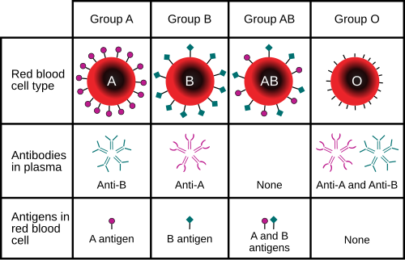

# TRANSFUSÃO E REAÇÕES TRANSFUSIONAIS: INDICAÇÕES E EVENTOS ADVERSOS

A hemoterapia não deve ser encarada como uma simples "reposição de fluidos". Na verdade, quando você prescreve um hemocomponente, está realizando um transplante de tecido líquido. Como todo transplante, existem riscos imunológicos, infecciosos e metabólicos envolvidos. O segredo para dominar este tema em provas de residência e na prática clínica é entender que a transfusão é guiada por gatilhos (thresholds) e, principalmente, pela clínica do paciente.

*Figura 1 - Ilustração de transfusão sanguínea, demonstrando o procedimento de infusão de hemocomponentes. Fonte: BruceBlaus, CC BY 3.0 | Wikimedia Commons*

## Hemocomponentes vs. Hemoderivados: A Diferença Fundamental

Antes de falarmos em indicações, você precisa saber a nomenclatura correta. Errar isso em uma prova de hematologia é o mesmo que confundir vírus com bactéria.

- **Hemocomponentes:** São obtidos através de processos físicos (centrifugação, congelamento) realizados nos hemocentros. Exemplos: Concentrado de Hemácias (CH), Concentrado de Plaquetas (CP), Plasma Fresco Congelado (PFC) e Crioprecipitado.

- **Hemoderivados:** São produzidos industrialmente a partir do fracionamento do plasma em larga escala. Exemplos: Albumina, Imunoglobulinas e Concentrados de Fatores de Coagulação (Fator VIII, Complexo Protrombínico).

## Concentrado de Hemácias (CH): Quando e Por Que Transfundir?

O objetivo do CH é aumentar a capacidade de transporte de oxigênio. O erro clássico aqui é transfundir baseado apenas no valor da hemoglobina (Hb). Lembre-se: tratamos o paciente, não o exame laboratorial.

### Gatilhos Transfusionais (Thresholds)

A tendência moderna, baseada em grandes estudos (como o TRICC), é a estratégia **restritiva**. Por que? Porque a transfusão em excesso aumenta a mortalidade, o tempo de internação e o risco de lesão pulmonar.

- **Hb < 7 g/dL:** Indicação na maioria dos pacientes estáveis e críticos. É o gatilho padrão.

- **Hb < 8 g/dL:** Pacientes submetidos a cirurgias ortopédicas, cardíacas ou com doença cardiovascular pré-existente (estável).

- **Hb < 10 g/dL:** Raramente indicado, exceto em situações de choque hemorrágico não controlado ou em pacientes com síndrome coronariana aguda (SCA) instável com evidência de isquemia miocárdica.

**Dica de Prova:** Em pacientes idosos ou com Insuficiência Renal Crônica (IRC), a anemia costuma ser crônica e bem tolerada. Não se apresse em transfundir se o paciente estiver assintomático, mesmo com Hb de 7,5 g/dL. A transfusão não melhora a cicatrização de feridas, uma pegadinha comum em provas de cirurgia.

### Rendimento Esperado

Em um adulto de 70kg, **1 unidade de CH aumenta a Hb em cerca de 1 g/dL** e o hematócrito (Ht) em 3%. O tempo de infusão deve ser de 60 a 120 minutos, nunca ultrapassando 4 horas (pelo risco de contaminação bacteriana).

## Concentrado de Plaquetas (CP): Profilaxia vs. Terapêutica

Aqui o aluno costuma se confundir com os números. Vamos organizar para você nunca mais esquecer.

### Indicações Profiláticas (Paciente sem sangramento ativo)

- **< 10.000/mm³:** Na maioria dos pacientes estáveis (ex: pós-quimioterapia). O objetivo é evitar sangramento espontâneo no SNC ou TGI.

- **< 20.000/mm³:** Pacientes com febre, sepse ou esplenomegalia (fatores que aumentam o consumo).

### Indicações para Procedimentos Invasivos

- **> 50.000/mm³:** Maioria das cirurgias, biópsias hepáticas, punção lombar e passagem de cateter central.

- **> 80.000 - 100.000/mm³:** Neurocirurgias e cirurgias oftalmológicas (segmento posterior). Aqui o espaço é nobre; qualquer sangramento é catastrófico.

### Indicações Terapêuticas (Com sangramento ativo)

- Manter plaquetas **> 50.000/mm³** em sangramentos moderados.

- Manter **> 100.000/mm³** se houver sangramento no SNC.

**Cuidado:** Na Púrpura Trombocitopênica Imunológica (PTI) e na Trombocitopenia Induzida por Heparina (TIH), a transfusão de plaquetas é geralmente **contraindicada**, a menos que haja sangramento com risco de morte. Na PTI, o anticorpo vai destruir a plaqueta transfundida em minutos. Na TIH, você pode "jogar lenha na fogueira" do evento trombótico.

## Plasma Fresco Congelado (PFC) e Crioprecipitado

O PFC contém todos os fatores de coagulação, albumina e proteínas do sistema complemento.

- **Indicação do PFC:** Correção de coagulopatias com sangramento ativo ou antes de procedimentos invasivos (geralmente quando o RNI > 1,5 ou o TTPA > 1,5x o controle).

- **O Erro de Ouro:** PFC **NÃO** deve ser usado para expansão volêmica. Para isso, usamos cristaloides. Também não deve ser usado para "corrigir o RNI" de um paciente com cirrose que não vai ser operado e não está sangrando.

**Crioprecipitado:** É obtido a partir do descongelamento do PFC. Ele é rico em **Fibrinogênio**, Fator VIII, Fator XIII e Fator de von Willebrand.

- **Indicação Principal:** Reposição de fibrinogênio quando este estiver **< 100 mg/dL** (ou < 150 mg/dL em obstetrícia/trauma grave) associado a sangramento.

| Hemocomponente | Principal Componente | Dose Habitual |
| --- | --- | --- |
| CH | Hemácias | 1 unidade (aumenta 1g/dL Hb) |
| Plaquetas | Plaquetas | 1 unidade para cada 10kg |
| PFC | Fatores de Coagulação | 10 a 15 mL/kg |
| Crioprecipitado | Fibrinogênio | 1 unidade para cada 10kg |

## Modificações dos Hemocomponentes: O "Refino" do Sangue

As bancas adoram cobrar quando indicar cada modificação. Como diz o Dr. Will, da MedEvo, "o detalhe na prescrição evita a complicação na beira do leito".

### 1. Leucorredução (Desleucotização)

Consiste na retirada de pelo menos 99% dos leucócitos da bolsa através de filtros.

- **Indicações:** Prevenir Reação Febril Não Hemolítica (RFNH), prevenir aloimunização HLA e prevenir a transmissão de CMV (o vírus fica dentro do leucócito).

- **Quem precisa?** Pacientes oncológicos, candidatos a transplante e pacientes com histórico de duas ou mais RFNH.

### 2. Irradiação

A radiação gama inativa os linfócitos T do doador.

- **Objetivo:** Prevenir a Doença do Enxerto Contra o Hospedeiro Transfusional (TA-GVHD), que é quase 100% fatal.

- **Quem precisa?** Imunodeficientes graves, recém-nascidos prematuros, transfusões entre parentes de primeiro grau e pacientes em uso de análogos da purina (Fludarabina).

### 3. Lavagem

As hemácias ou plaquetas são lavadas com soro fisiológico para retirar proteínas plasmáticas.

- **Indicação Clássica:** Pacientes com **deficiência de IgA** que apresentam reações anafiláticas graves. Também indicada em reações alérgicas recorrentes e graves.

*Figura 2 - Estetoscópio, símbolo da prática médica e da vigilância nas reações transfusionais. Fonte: Domínio Público | Wikimedia Commons*

## Reações Transfusionais Agudas: O Pesadelo do Plantonista

As reações agudas ocorrem em até 24 horas após o início da transfusão. Diante de QUALQUER suspeita de reação, a primeira conduta é sempre: **PARAR A TRANSFUSÃO E MANTER O ACESSO VENOSO COM SORO FISIOLÓGICO.**

### 1. Reação Febril Não Hemolítica (RFNH)

É a reação mais comum. Ocorre devido a citocinas acumuladas na bolsa ou anticorpos do receptor contra leucócitos do doador.

- **Clínica:** Febre (aumento > 1°C), calafrios e tremores. Sem outros sinais de gravidade.

- **Manejo:** Antitérmicos. Se o paciente estabilizar, a transfusão pode ser reiniciada em alguns casos (embora a maioria das diretrizes sugira descartar a bolsa se a febre for alta).

- **Prevenção:** Leucorredução.

### 2. Reação Alérgica e Anafilática

Causada por proteínas plasmáticas na bolsa.

- **Leve (Urticária):** Apenas placas urticariformes e prurido. Conduta: Parar, dar anti-histamínico e, se os sintomas sumirem, **pode-se reiniciar a mesma bolsa**.

- **Grave (Anafilaxia):** Estridor, hipotensão, broncoespasmo. Conduta: Adrenalina IM e suporte de vida. Nunca reiniciar. Próximas transfusões devem ser com hemocomponentes **lavados**.

### 3. Reação Hemolítica Aguda (RHA)

Geralmente por incompatibilidade ABO (erro humano na identificação). É uma emergência médica.

- **Fisiopatologia:** Hemólise intravascular maciça mediada por complemento.

- **Clínica:** Dor lombar, febre, hipotensão, urina escura (hemoglobinúria) e CIVD.

- **Diagnóstico:** Teste de Coombs Direto positivo, queda de haptoglobina, aumento de LDH e bilirrubina indireta.

### 4. TRALI (Lesão Pulmonar Aguda Relacionada à Transfusão)

É a principal causa de morte relacionada à transfusão.

- **Fisiopatologia:** Anticorpos anti-HLA ou anti-HNA (geralmente de doadoras multíparas) ativam os neutrófilos no pulmão do receptor, causando edema pulmonar não cardiogênico.

- **Clínica:** Dispneia súbita, hipoxemia (SatO2 < 90%), infiltrado pulmonar bilateral no RX, **sem sinais de sobrecarga hídrica** (PVC normal, sem turgência jugular). Ocorre em até 6 horas.

- **Manejo:** Suporte ventilatório. **Diuréticos não são indicados** e podem piorar a situação se houver hipotensão.

### 5. TACO (Sobrecarga Circulatória Associada à Transfusão)

Diferente da TRALI, aqui o problema é o volume.

- **Fisiopatologia:** Infusão de volume maior do que o sistema cardiovascular suporta.

- **Clínica:** Dispneia, hipertensão, turgência jugular, edema agudo de pulmão, aumento de BNP.

- **Manejo:** Oxigênio e **Diuréticos (Furosemida)**.

- **Prevenção:** Infusão lenta (1 mL/kg/h) em idosos e cardiopatas.

| Característica | TRALI | TACO |
| --- | --- | --- |
| **Mecanismo** | Imunológico (Edema não cardiogênico) | Hidrostático (Sobrecarga volêmica) |
| **Pressão Arterial** | Frequentemente Baixa | Frequentemente Alta |
| **Jugulares** | Planas | Turgentes |
| **BNP** | Normal | Elevado |
| **Resposta ao Diurético** | Mínima ou Nula | Excelente |

## Transfusão Maciça e Suas Complicações

Definida como a transfusão de > 10 unidades de CH em 24 horas ou > 4 unidades em 1 hora. É o cenário do trauma grave.

- **Hipocalcemia:** O citrato usado para conservar o sangue quela o cálcio do paciente. O sinal clássico é o prolongamento do intervalo QT no ECG. Conduta: Repor Gluconato de Cálcio.

- **Hipotermia:** O sangue sai da geladeira a 4°C. Pode causar arritmias e piorar a coagulopatia.

- **Acidose Metabólica:** O sangue estocado é ácido.

- **Hipercalemia:** As hemácias estocadas sofrem lise e liberam potássio.

**A Tríade Letal do Trauma:** Acidose + Hipotermia + Coagulopatia. O protocolo de transfusão maciça visa combater isso usando proporções fixas (ex: 1 CH : 1 PFC : 1 CP).

## Situações Especiais e Pérolas Clínicas

- **Anemia Falciforme:** O maior risco é a aloimunização. Por isso, esses pacientes devem receber sangue com **fenotipagem estendida** (não apenas ABO/Rh, mas também Kell, Duffy, Kidd, etc.). Em crises agudas (ex: Síndrome Torácica Aguda), pode ser necessária a exsanguíneotransfusão.

- **Hepatopatia e Sangramento:** Se o paciente cirrótico tem HDA e o RNI está muito alargado (ex: 2,3), o PFC está indicado. Se as plaquetas estiverem < 50.000, transfundir plaquetas também.

- **Reversão de Varfarina:** Se houver sangramento grave, o Complexo Protrombínico é a primeira escolha por agir mais rápido e com menos volume que o PFC.

- **Notificação:** Toda reação transfusional (mesmo a urticária leve) deve ser notificada ao sistema de Hemovigilância (Notivisa no Brasil).

## Pontos-Chave para Prova 💡

- **Gatilho padrão para CH:** Hb < 7 g/dL (estratégia restritiva).

- **Gatilho para Plaquetas (Profilaxia):** < 10.000/mm³ em pacientes estáveis.

- **Reação Transfusional mais comum:** Reação Febril Não Hemolítica (RFNH).

- **Principal causa de morte por transfusão:** TRALI.

- **Diferencial de TRALI vs TACO:** TACO tem hipertensão, turgência jugular e responde a diurético; TRALI não.

- **Indicação de Hemácias Lavadas:** Deficiência de IgA ou reações alérgicas graves recorrentes.

- **Indicação de Irradiação:** Prevenir TA-GVHD em imunodeprimidos graves.

- **Indicação de Leucorredução:** Prevenir RFNH, aloimunização HLA e transmissão de CMV.

- **Transfusão Maciça:** Cuidado com a hipocalcemia (quelação pelo citrato) – repor Gluconato de Cálcio.

- **Coombs Direto Positivo:** Marca a Reação Hemolítica Aguda (incompatibilidade ABO).

- **Conduta inicial em qualquer reação:** Parar a transfusão imediatamente.

- **PFC não é expansor volêmico:** Use cristaloides para repor volume.

- **Fibrinogênio < 100 mg/dL com sangramento:** Indicação de Crioprecipitado.

- **Febre isolada durante a transfusão:** Parar, investigar hemólise/sepse. Se for apenas RFNH, tratar com antitérmico.

- **Contaminação Bacteriana:** Mais comum em plaquetas (armazenadas em temperatura ambiente). Suspeite se houver febre alta e choque logo no início.

- **Aloimunização em Falciformes:** Prevenida com fenotipagem estendida.

- **O que NÃO fazer:** Não fazer pré-medicação (dipirona/anti-histamínico) de rotina para todos os pacientes; isso mascara reações graves iniciais.

 Cópia offline para consulta pessoal.
 Fonte original:
 [https://www.medevo.com.br/material-apoio/ler/dc28adf2-2965-4e2f-9004-eb8d65daa70c](https://www.medevo.com.br/material-apoio/ler/dc28adf2-2965-4e2f-9004-eb8d65daa70c)
