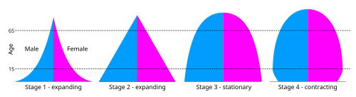

# TRANSIÇÃO DEMOGRÁFICA E EPIDEMIOLÓGICA

Para entender por que as bancas de residência médica cobram tanto este tema, você precisa parar de ver esses conceitos como números frios em uma tabela. Imagine que você está no seu consultório ou em uma unidade de saúde. O paciente que entra pela porta hoje é muito diferente do paciente que entrava há 50 anos. Antigamente, seu maior medo era que ele morresse de uma pneumonia ou de uma diarreia infecciosa em poucos dias. Hoje, seu desafio é gerenciar um idoso com hipertensão, diabetes, insuficiência cardíaca e que, possivelmente, ainda corre o risco de ser atropelado ou sofrer uma queda.

Essa mudança no "quem morre" e "do que se morre" é o que chamamos de transição. E no Brasil, como Dr. Will sempre reforça nas discussões do MedEvo, essa transição tem um tempero especial: ela é acelerada, desigual e incompleta.

*Figura 1 - Profissional de saúde em atendimento, representando a atenção primária e a saúde coletiva. Fonte: National Cancer Institute, Domínio Público | Wikimedia Commons*

## A Transição Demográfica: O "Quem" da População

A transição demográfica é a mudança na estrutura da população. Ela explica como saímos de uma sociedade jovem e com muitas mortes para uma sociedade envelhecida e com baixa mortalidade. Esse processo não acontece ao acaso, ele segue um padrão que dividimos em fases.

### As Fases da Transição

Muitos alunos erram em prova por achar que a transição demográfica começa com a queda da natalidade. Cuidado: o primeiro evento histórico é sempre a queda da mortalidade.

- **Fase 1 (Pré-transição):** Alta taxa de natalidade e alta taxa de mortalidade. A população quase não cresce. É o cenário de séculos atrás, onde as famílias tinham 10 filhos, mas 5 morriam antes de completar um ano.

- **Fase 2 (Explosão Demográfica):** A mortalidade começa a cair bruscamente devido a melhorias no saneamento, nutrição e, posteriormente, vacinas e antibióticos. No entanto, a natalidade continua alta. O resultado? Um crescimento populacional gigante.

- **Fase 3 (Desaceleração):** A natalidade começa a cair. Por que? Urbanização (filho na cidade custa caro, no campo é mão de obra), entrada da mulher no mercado de trabalho e métodos contraceptivos. O crescimento populacional continua, mas em ritmo lento.

- **Fase 4 (Estabilização):** Baixa natalidade e baixa mortalidade. A população para de crescer e começa a envelhecer.

O Brasil já passou pela fase de explosão e hoje vive uma queda acentuada da taxa de fecundidade (número de filhos por mulher). Atualmente, nossa taxa de fecundidade está abaixo do nível de reposição (que é de 2,1 filhos por mulher). Isso significa que, no futuro, nossa população vai começar a diminuir.

### O Envelhecimento Populacional e a Razão de Dependência

Com menos crianças nascendo e as pessoas vivendo mais (aumento da esperança de vida ao nascer), a pirâmide populacional brasileira está deixando de ser um triângulo de base larga para se tornar um "barril" ou uma "urna".

Um conceito que as bancas adoram é a **Razão de Dependência**. Ela mede a carga econômica sobre a população produtiva (15 a 64 anos).

- **Numerador:** Jovens (<15 anos) + Idosos (>65 anos).

- **Denominador:** População em idade ativa (15-64 anos).

No início da transição, a dependência é alta por causa das crianças. No meio, temos o chamado "Bônus Demográfico", onde a maioria da população está em idade ativa. O Brasil está saindo desse bônus e entrando na fase onde a dependência volta a subir, mas agora por causa dos idosos.

### Tabela 1: Resumo da Transição Demográfica no Brasil

| Indicador | Tendência Atual | Consequência Clínica/Social |
| --- | --- | --- |
| Taxa de Fecundidade | Queda acentuada (< 1,8) | Redução da população jovem |
| Taxa de Mortalidade Geral | Queda histórica | Aumento da longevidade |
| Esperança de Vida | Aumento progressivo | Maior prevalência de doenças degenerativas |
| Pirâmide Etária | Estreitamento da base e alargamento do topo | Necessidade de políticas para idosos |

## A Transição Epidemiológica: O "Do Que" se Morre

Se a demografia foca em quem está vivo, a epidemiologia foca no perfil de saúde e doença. O modelo clássico de Omran descreve a transição em três estágios: a era das pestes e fomes, a era do declínio das pandemias e a era das doenças degenerativas e antrópicas (causadas pelo homem).

No Brasil, não seguimos esse modelo bonitinho de "acaba uma fase, começa outra". Nós vivemos o que chamamos de **Transição Epidemiológica Polarizada ou Prolongada**.

### A Tripla Carga de Doença

Este é o conceito de ouro para sua prova. O Brasil enfrenta simultaneamente:

- **Doenças Transmissíveis (DIP):** Ainda temos surtos de Dengue, Tuberculose e Hanseníase.

- **Doenças Crônicas Não Transmissíveis (DCNT):** Explosão de Hipertensão, Diabetes, Câncer e Doenças Cardiovasculares.

- **Causas Externas:** Violência urbana (homicídios) e acidentes de trânsito.

Diferente da Europa, onde as doenças infecciosas praticamente sumiram antes das crônicas dominarem, aqui elas coexistem. Isso sobrecarrega o SUS, que precisa de um hospital de trauma para o baleado, uma UTI para o infartado e uma equipe de vigilância para o surto de sarampo, tudo ao mesmo tempo.

### O Modelo de Frenk e a Superposição de Etapas

Julio Frenk descreveu que países em desenvolvimento apresentam uma "falha" na transição. Não há uma separação clara entre as etapas. Isso gera uma **heterogeneidade regional**. Se você for para o interior do Norte do país, o perfil ainda é muito marcado por doenças infecciosas e falta de saneamento. Se for para o centro de São Paulo, o perfil é de doenças do envelhecimento.

## Indicadores de Saúde: O Termômetro da Transição

Para medir essas mudanças, usamos indicadores. Você precisa dominar três grupos principais para a prova: Mortalidade Infantil, Swaroop-Uemura e Coeficientes de Mortalidade.

### Coeficiente de Mortalidade Infantil (TMI)

A TMI é o indicador mais sensível às condições de vida de uma população. Ela é dividida em dois componentes principais:

- **Mortalidade Neonatal (até 27 dias):** Reflete a qualidade da assistência ao pré-natal e ao parto. É a mais difícil de reduzir hoje no Brasil.

- **Mortalidade Pós-Neonatal (28 dias a 1 ano):** Reflete saneamento, vacinação, nutrição e escolaridade materna. Foi a que mais caiu no Brasil nas últimas décadas.

**Dica de Prova:** Se a questão disser que a TMI caiu por causa do aumento de cesáreas, marque FALSO. O aumento de cesáreas desnecessárias pode até aumentar a mortalidade neonatal. O que reduziu a TMI no Brasil foi a expansão da Estratégia Saúde da Família (ESF), saneamento e melhoria da escolaridade das mães.

### Índice de Swaroop-Uemura (ISU)

Também chamado de Razão de Mortalidade Proporcional, o ISU mede a porcentagem de pessoas que morrem com 50 anos ou mais em relação ao total de óbitos.

- **ISU Alto (> 75%):** Indica boa qualidade de vida e sistema de saúde eficiente. Significa que as pessoas estão morrendo "na hora certa", ou seja, idosas.

- **ISU Baixo:** Indica que muitas pessoas estão morrendo jovens (por doenças infecciosas ou violência).

### Curvas de Mortalidade Proporcional (Curvas de Moraes)

As curvas de Moraes mostram visualmente o nível de saúde de uma região:

- **Tipo I (Nível muito baixo):** Curva em "N" ou "U". Muitas mortes em crianças e idosos.

- **Tipo II (Nível baixo):** Curva em "L" ou "J invertido".

- **Tipo III (Nível regular):** Curva em "V".

- **Tipo IV (Nível elevado):** Curva em "J". A grande maioria das mortes ocorre em idosos. É o padrão de países desenvolvidos e que o Brasil persegue.

### Tabela 2: Comparativo de Indicadores por Nível de Desenvolvimento

| Indicador | País Desenvolvido | Brasil (Média) | Região Muito Pobre |
| --- | --- | --- | --- |
| Swaroop-Uemura | > 80-90% | ~ 75% | < 50% |
| Causa de Morte Principal | Crônico-degenerativas | Crônico-degenerativas | Infecciosas/Causas Externas |
| Componente da TMI | Neonatal (quase exclusivo) | Neonatal (predominante) | Pós-neonatal ainda alta |
| Curva de Moraes | Tipo IV (J) | Tendendo ao Tipo IV | Tipo I ou II |

*Figura 2 - Estetoscópio, símbolo da prática médica e da medicina preventiva. Fonte: Domínio Público | Wikimedia Commons*

## Níveis de Prevenção: O Modelo de Leavell & Clark

Este tema cai em 10 de cada 10 provas de Preventiva. Você precisa saber onde cada ação se encaixa na história natural da doença.

### 1. Prevenção Primária

Ocorre no período de **pré-patogênese**. O indivíduo está saudável.

- **Promoção da Saúde:** Ações genéricas (educação, lazer, saneamento, alimentação saudável).

- **Proteção Específica:** Ações direcionadas a uma doença (vacinação, uso de preservativos, iodo no sal, fluoretação da água).

### 2. Prevenção Secundária

A doença já existe, mas está no início ou ainda não causou danos irreversíveis.

- **Diagnóstico Precoce e Tratamento Imediato:** Rastreamento (Screening), como o Papanicolau ou a mamografia.

- **Limitação do Dano:** Tratar a hipertensão para evitar que o paciente tenha um AVC no futuro.

### 3. Prevenção Terciária

A doença já causou sequelas. O foco é a **reabilitação**.

- Exemplo: Fisioterapia pós-AVC, terapia ocupacional para amputados. O objetivo é devolver a autonomia ao paciente.

### 4. Prevenção Quaternária

Este conceito é mais recente e muito cobrado na Medicina de Família. É a prevenção da **iatrogenia**.

- É evitar intervenções desnecessárias ou excessivas (overdiagnosis e overtreatment).

- Exemplo: Não pedir PSA para um paciente de 90 anos com múltiplas comorbidades, ou não prescrever antibiótico para uma gripe viral.

### Tabela 3: Resumo dos Níveis de Prevenção

| Nível | Fase da Doença | Objetivo Principal | Exemplos Clássicos |
| --- | --- | --- | --- |
| **Primária** | Pré-patogênese | Diminuir Incidência | Vacina, Exercício, Preservativo |
| **Secundária** | Patogênese Inicial | Diminuir Prevalência (cura) | Rastreamento, Teste do Pezinho |
| **Terciária** | Patogênese Avançada | Reabilitação | Fisioterapia, Próteses |
| **Quaternária** | Qualquer fase | Evitar Iatrogenia | Não fazer check-up desnecessário |

## Transição Nutricional: Da Desnutrição à Obesidade

Não podemos falar de transição epidemiológica sem citar a nutrição. O Brasil viveu uma mudança drástica:

- **Passado:** O grande problema era a desnutrição infantil e as carências de micronutrientes (como o bócio endêmico por falta de iodo).

- **Presente:** O problema é o sobrepeso e a obesidade, inclusive nas classes mais pobres.

Isso se deve ao consumo de **alimentos ultraprocessados**, que são baratos e densos em calorias, mas pobres em nutrientes. A mecanização do trabalho e a urbanização também reduziram o gasto calórico diário.

**Exemplo Clínico:** Imagine um paciente de 45 anos, morador de periferia, que trabalha sentado o dia todo. Ele troca o almoço caseiro por um macarrão instantâneo e um refrigerante porque é mais rápido e barato. Ele está em risco de Síndrome Metabólica. Esse é o retrato da transição nutricional brasileira: a obesidade coexistindo com a deficiência de ferro ou vitamina A.

## O Impacto das Causas Externas

Aqui está a maior diferença entre a transição brasileira e a europeia. Enquanto lá a mortalidade caiu de forma linear, aqui temos um "platô" ou até aumentos em certas faixas etárias devido à violência.

- **Jovens (15-29 anos):** A principal causa de morte no Brasil são as causas externas (homicídios e acidentes).

- **Diferença de Gênero:** A mortalidade por causas externas é esmagadoramente masculina. Isso gera uma "sobremortalidade masculina", resultando em mais mulheres idosas do que homens idosos (feminização da velhice).

## Determinantes Sociais e o Modelo de McKeown

Thomas McKeown foi um pesquisador que defendeu uma tese polêmica, mas muito cobrada: a queda da mortalidade por doenças infecciosas (como a Tuberculose) no século XIX e início do XX ocorreu **antes** da descoberta dos antibióticos e das vacinas em larga escala.

O que causou a queda, então? A melhoria das condições de vida: melhor alimentação, casas menos aglomeradas e saneamento.
**Lição para a prova:** O avanço médico é importante, mas os determinantes sociais (educação, renda, saneamento) são os verdadeiros motores da transição epidemiológica.

## Desafios do Sistema de Saúde na Transição

Com o envelhecimento e a cronicidade, o modelo de saúde precisa mudar. O modelo "hospitalocêntrico", focado em curar doenças agudas, não funciona para o paciente crônico.

- **Coordenação do Cuidado:** A Atenção Primária (APS) deve ser o centro. O paciente com insuficiência cardíaca não precisa apenas de uma consulta anual com o cardiologista; ele precisa de acompanhamento contínuo para evitar a **agudização da doença crônica**.

- **Sobrevida vs. Cura:** Muitos tratamentos modernos não curam, mas evitam a morte (ex: TARV para HIV). Isso aumenta a **prevalência** da doença na população, embora a mortalidade caia.

## Pontos-Chave para Prova 🎯

- **Transição Demográfica Brasil:** Queda da mortalidade seguida de queda da fecundidade. Resultado: Envelhecimento populacional e estreitamento da base da pirâmide.

- **Taxa de Fecundidade:** Atualmente abaixo do nível de reposição (2,1). É o principal motor do envelhecimento atual.

- **Transição Epidemiológica Brasileira:** Caracterizada pela tripla carga de doenças (Infecciosas + Crônicas + Causas Externas).

- **Modelo de Frenk:** Superposição de etapas e polarização epidemiológica (diferenças regionais gritantes).

- **Mortalidade Infantil (TMI):** O componente pós-neonatal cai com saneamento e vacina. O componente neonatal depende de assistência ao parto e pré-natal.

- **Índice de Swaroop-Uemura:** Proporção de óbitos em pessoas com 50 anos ou mais. Se > 75%, o nível de saúde é considerado elevado.

- **Curva de Moraes Tipo IV:** Formato em "J", indica que a maioria morre idosa. É o padrão desejado.

- **Prevenção Primária:** Promoção da saúde + Proteção específica (ex: vacina). Antes da doença.

- **Prevenção Secundária:** Diagnóstico precoce (rastreamento) e limitação do dano.

- **Prevenção Quaternária:** Evitar o excesso de intervenção médica e a iatrogenia.

- **Causas Externas:** Principal causa de morte em jovens no Brasil, com predomínio masculino.

- **Transição Nutricional:** Mudança do perfil de desnutrição para obesidade e sobrepeso, ligada aos ultraprocessados.

- **Impacto do Tratamento:** Se um tratamento evita a morte mas não cura, a prevalência da doença aumenta.

- **Escolaridade Materna:** Um dos determinantes sociais mais fortes para a redução da mortalidade infantil.

- **Causa Básica de Óbito:** É a doença ou lesão que iniciou a cadeia de eventos que levou à morte (ex: o adenoma que causou o Cushing, que causou a infecção).

- **Prevenção Primária vs. Secundária:** Rastreamento (PSA, Mamografia) é SEMPRE secundária. Vacina é SEMPRE primária.

- **Erro Comum:** Achar que a transição epidemiológica no Brasil é igual à dos países desenvolvidos. Lembre-se da "superposição" de doenças infecciosas e crônicas.

- **Fator de Risco DCNT:** Tabagismo, álcool, sedentarismo e dieta inadequada são os alvos principais da prevenção primária.

 Cópia offline para consulta pessoal.
 Fonte original:
 [https://www.medevo.com.br/material-apoio/ler/06462461-0fcb-4edc-bf8c-64c81fda572f](https://www.medevo.com.br/material-apoio/ler/06462461-0fcb-4edc-bf8c-64c81fda572f)
