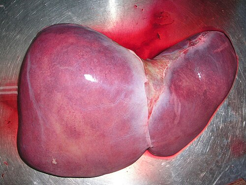

# TRANSPLANTE CARDÍACO E PULMONAR

Para entender transplantes, você precisa mudar sua chave mental. Não estamos mais falando de tratar uma doença com remédios para "curar"; estamos falando de substituir um órgão que faliu. Na prova de residência, as bancas não querem que você saiba a técnica da sutura da veia pulmonar, elas querem que você saiba **quem** indicar, **quando** contraindicar e **como** manejar as complicações que matam o paciente no pós-operatório.

*Figura 1 - Estetoscópio, símbolo da prática médica e da avaliação cardiopulmonar no contexto do transplante. Fonte: Domínio Público | Wikimedia Commons*

## Transplante Cardíaco: A Última Fronteira da Insuficiência Cardíaca

O transplante cardíaco (TC) é o tratamento padrão-ouro para a Insuficiência Cardíaca (IC) refratária. Mas cuidado: "refratária" não é apenas o paciente que cansa ao subir escada. É aquele que, apesar de toda a terapia tripla ou quádrupla otimizada (betabloqueador, IECA/BRA/Entresto, espironolactona e iSGLT2), continua em classe funcional NYHA III ou IV.

### Indicações e o Momento Certo

Por que indicamos o transplante? Para melhorar a sobrevida e a qualidade de vida. Se o paciente tem uma sobrevida estimada menor que 50% em um ano com o tratamento clínico, ele é um candidato.

Segundo a III Diretriz Brasileira de Transplante Cardíaco (SBC), os critérios objetivos mais cobrados são:

- **Fração de Ejeção do Ventrículo Esquerdo (FEVE) baixa:** Geralmente < 25-30%. Mas lembre-se: a FEVE sozinha não indica transplante. O que manda é a clínica e o teste funcional.

- **Consumo de Oxigênio de Pico (VO2 pico):** Este é o "queridinho" das provas. Se o paciente faz um teste cardiopulmonar e o VO2 pico é < 12 ml/kg/min (em uso de betabloqueador) ou < 14 ml/kg/min (sem betabloqueador), a indicação é clara.

- **Dependência de Inotrópicos ou Suporte Circulatório Mecânico:** Aquele paciente que não consegue "desmamar" da dobutamina sem chocar.

### Contraindicações: Onde a Prova te Pega

Aqui mora o perigo. A banca vai te dar um paciente com IC terminal, mas vai colocar uma "casca de banana" que impede o transplante.

A contraindicação absoluta mais importante é a **Resistência Vascular Pulmonar (RVP) elevada e irreversível**.
**O Porquê:** Imagine que você coloca um coração novo, com um ventrículo direito (VD) "fresco" e acostumado a pressões baixas. Se o pulmão do receptor estiver "duro" (hipertensão pulmonar fixa), o VD novo vai falhar em questão de minutos.

- **Valor de corte:** RVP > 6 unidades Wood ou Gradiente Transpulmonar > 15 mmHg que não cai com vasodilatadores (nitroprussiato ou óxido nítrico).

Outras contraindicações importantes:

- Infecção ativa (exceto infecção de dispositivo de assistência ventricular).

- Neoplasia maligna com prognóstico reservado (geralmente exige-se 2 a 5 anos de cura).

- Disfunção orgânica irreversível (insuficiência renal com clearance < 30-40 ml/min, a menos que seja transplante duplo rim-coração).

- Incapacidade psicossocial de seguir o tratamento (o paciente que não vai tomar os remédios vai perder o órgão).

### O Doador e a Cirurgia

O doador ideal tem morte encefálica confirmada, menos de 45-50 anos e compatibilidade de peso (variação de até 20% para mais ou para menos) e sistema ABO. Não precisamos de prova cruzada (crossmatch) prospectiva na maioria dos casos, a menos que o receptor seja altamente sensibilizado.

Na técnica cirúrgica, a mais usada hoje é a **bicaval**, onde preservamos as veias cavas superior e inferior íntegras no receptor. Isso reduz a incidência de arritmias e insuficiência tricúspide no pós-operatório, comparado à técnica clássica (biatrial).

**Dica de Ouro do Dr. Will:** O coração transplantado é um coração **denervado**. Isso significa que ele não responde à atropina! Se o paciente tiver uma bradicardia no pós-operatório, não adianta dar atropina, pois o nervo vago foi cortado. Você precisará de estimulação direta (marcapasso) ou drogas de ação direta (isoproterenol, adrenalina). Além disso, o paciente não sente angina clássica. A isquemia no transplantado se manifesta como cansaço ou insuficiência cardíaca súbita.

| Parâmetro | Indicação de Transplante Cardíaco |
| --- | --- |
| Classe Funcional | NYHA III persistente ou IV |
| VO2 de Pico | < 12 ml/kg/min (com BB) ou < 14 (sem BB) |
| Dependência | Inotrópicos venosos ou Assistência Mecânica |
| RVP (Contraindicação) | > 6 unidades Wood (Irreversível) |

## Transplante Pulmonar: Quando o Ar Falta de Vez

O transplante de pulmão é uma das cirurgias mais complexas da medicina diagnóstica e terapêutica. Diferente do coração, o pulmão está em contato direto com o meio externo, o que aumenta absurdamente o risco de infecção e rejeição.

### Principais Indicações

Aqui você precisa decorar a "santíssima trindade" das indicações:

- **DPOC (Doença Pulmonar Obstrutiva Crônica):** É a causa número 1 no mundo. Indicamos quando o FEV1 < 20% ou quando há hipertensão pulmonar secundária.

- **Fibrose Pulmonar Idiopática (FPI):** É a doença que mais mata na fila. Por ser progressiva e rápida, o diagnóstico de FPI já deve acender o alerta para avaliação de transplante, independente da função pulmonar inicial.

- **Fibrose Cística (FC):** Causa comum em pacientes jovens. O transplante aqui deve ser sempre **bilateral** para evitar que o pulmão nativo infectado contamine o novo.

### O Diagnóstico Diferencial e a Imagem

As bancas adoram cobrar o padrão de imagem na **Bronquiolite Obliterante**, que é a manifestação clínica da Rejeição Crônica no pulmão.
Na Tomografia de Tórax de Alta Resolução (TCAR), você verá:

- **Padrão em mosaico:** Áreas de pulmão mais claras (hiperatenuantes) e áreas mais escuras (hipoatenuantes).

- **Aprisionamento aéreo:** Visto principalmente nos cortes em expiração. Se o ar não sai, o brônquio está obstruído.

**Exemplo Clínico:** Paciente, 2 anos pós-transplante pulmonar por DPOC, começa com queda progressiva do FEV1 e dispneia aos esforços. TCAR mostra atenuação em mosaico e aprisionamento aéreo. Diagnóstico? Rejeição Crônica (Síndrome da Bronquiolite Obliterante).

*Figura 2 - Profissional de saúde em atendimento, representando o acompanhamento pós-transplante. Fonte: National Cancer Institute, Domínio Público | Wikimedia Commons*

## Imunossupressão: O Mal Necessário

Aqui é onde o clínico e o cirurgião se encontram. Todo transplantado precisa de uma combinação de drogas para não rejeitar o órgão. O esquema clássico é o "Triplo":

- **Inibidor de Calcineurina:** Tacrolimus (primeira escolha) ou Ciclosporina.

- **Antiproliferativo:** Micofenolato de Mofetila ou Azatioprina.

- **Corticoide:** Prednisona.

### O Vilão: Tacrolimus e a Nefrotoxicidade

Se cair uma questão sobre complicação renal no transplantado, 90% de chance da resposta envolver o Tacrolimus.
**O Porquê:** Os inibidores de calcineurina causam vasoconstrição da arteríola aferente renal. Com o tempo, isso leva a uma fibrose intersticial e atrofia tubular.

- **Sinal de prova:** Aumento de creatinina, hipertensão e hipercalemia em paciente usando Tacrolimus.

- **Manejo:** Ajustar a dose baseada no nível sérico (nível de vale).

### Outros Efeitos Adversos Importantes:

- **Ciclosporina:** Hiperplasia gengival e hirsutismo (diferente do Tacrolimus).

- **Micofenolato:** Diarreia e leucopenia. É uma causa comum de troca de medicação.

- **Corticoides:** Diabetes pós-transplante, osteoporose, ganho de peso.

| Medicamento | Mecanismo de Ação | Principal Efeito Colateral |
| --- | --- | --- |
| **Tacrolimus** | Inibidor de Calcineurina | Nefrotoxicidade, Tremor, DM |
| **Ciclosporina** | Inibidor de Calcineurina | Nefrotoxicidade, Hiperplasia Gengival |
| **Micofenolato** | Inibe síntese de purinas | Diarreia, Mielossupressão |
| **Azatioprina** | Antimetabólito | Leucopenia, Hepatotoxicidade |

## Rejeição: O Inimigo Silencioso

A rejeição pode ser Hiperaguda (minutos - mediada por anticorpos pré-formados, raríssima hoje), Aguda ou Crônica.

### Rejeição no Coração

O grande "pega" de prova aqui é: **A Fração de Ejeção (FE) não é um bom parâmetro para rejeição precoce.**
Quando a FE cai, a rejeição já está em um estágio muito avançado.

- **Padrão-ouro:** Biópsia Endomiocárdica (BEM). Fazemos BEM seriadas no primeiro ano (semanal, depois quinzenal, depois mensal).

- **O que procuramos?** Infiltrado linfocitário e necrose de miócitos.

### Rejeição no Pulmão

- **Aguda:** Manifesta-se com infiltrado perivascular na biópsia transbrônquica. Clinicamente: febre, tosse e queda de saturação.

- **Crônica:** Como já dito, é a Bronquiolite Obliterante. É a principal causa de morte após o primeiro ano de transplante pulmonar.

## Complicações Cirúrgicas e Clínicas Específicas

Além da rejeição e infecção, existem complicações que são "clássicas" de provas de cirurgia.

### Colecistite Aguda Acalculosa

Pacientes em pós-operatório de grandes cirurgias (como transplante cardíaco), em estado crítico, desidratados ou em uso de nutrição parenteral, podem desenvolver colecistite sem ter pedra.

- **Diagnóstico:** USG de abdome mostrando parede da vesícula espessada (> 4mm), edema de parede e líquido perivesicular, **sem cálculos**.

- **Clínica:** Pode ser frustra devido à imunossupressão. Às vezes, apenas uma leucocitose inexplicada ou febre.

- **Tratamento:** Colecistectomia ou, se o paciente estiver muito instável, colecistostomia percutânea.

### Doença Linfoproliferativa Pós-Transplante (PTLD)

Relacionada ao vírus **Epstein-Barr (EBV)**. A imunossupressão profunda permite que as células B infectadas pelo EBV proliferem descontroladamente, agindo como um linfoma.

- **Dica MedEvo:** Sempre que a questão falar de "linfonodomegalia + perda de peso + transplantado", pense em PTLD. O tratamento inicial é reduzir a imunossupressão.

## Diagnóstico Diferencial em Pneumologia Pós-Transplante

O aluno MedEvo não confunde as bolas. Se o paciente transplantado pulmonar chega com infiltrado no raio-X, você deve pensar em escada:

- **Primeiras 48h:** Edema pulmonar (disfunção primária do enxerto) ou problemas técnicos na anastomose.

- **Primeiro mês:** Infecções bacterianas hospitalares.

- **1 a 6 meses:** Infecções oportunistas (CMV é o rei aqui, seguido por Pneumocystis jirovecii e Aspergillus).

- **Após 6 meses:** Rejeição crônica (Bronquiolite Obliterante).

**O papel do CMV:** O Citomegalovírus é a infecção viral mais importante. Ele não só causa pneumonia, mas também aumenta o risco de rejeição. Por isso, usamos profilaxia com Ganciclovir ou Valganciclovir em pacientes de risco (Doador+/Receptor-).

## Estratificação de Risco e Metas

No transplante cardíaco, monitoramos a pressão arterial de forma rigorosa, mas lembre-se que a meta de FC é mais alta (90-110 bpm) devido à denervação. No pulmão, a espirometria é o nosso "termômetro". Qualquer queda > 10-15% no FEV1 em relação à melhor marca anterior deve ser investigada com broncoscopia e biópsia.

### Tabela: Diagnóstico Diferencial de Complicações Pulmonares

| Tempo Pós-Transplante | Principal Suspeita | Achado Típico |
| --- | --- | --- |
| < 72 horas | Disfunção Primária do Enxerto | Infiltrado bilateral, hipoxemia grave |
| 1 - 6 meses | Infecção por CMV | Infiltrado intersticial, febre, leucopenia |
| Qualquer momento | Rejeição Aguda | Infiltrado perivascular na biópsia |
| > 6-12 meses | Bronquiolite Obliterante | Queda do FEV1, Padrão em mosaico na TC |

## Situações Especiais: Fibrose Cística

A Fibrose Cística (FC) merece um parágrafo à parte. Esses pacientes são colonizados por bactérias multirresistentes, como *Pseudomonas aeruginosa* e *Burkholderia cepacia*.

- **Cuidado:** A presença de *Burkholderia cenocepacia* é considerada contraindicação relativa ou até absoluta em muitos centros devido à altíssima mortalidade pós-operatória (Síndrome de Cepacia).

- **Técnica:** Sempre transplante bilateral. Se deixar um pulmão nativo, ele servirá de reservatório de pus e bactérias para o pulmão novo.

## O "Pulo do Gato" sobre Nefrotoxicidade

Muitos alunos erram ao achar que, se a creatinina subiu, deve-se suspender o Tacrolimus imediatamente. Calma! O manejo inicial é **ajustar a dose** para o nível terapêutico (geralmente entre 5-15 ng/mL, dependendo do tempo de transplante). Se a toxicidade persistir mesmo com níveis baixos, aí sim pensamos em trocar por drogas "poupadoras de rim", como os inibidores de mTOR (Sirolimus ou Everolimus).

## Pontos-Chave para Prova 🩺

- **Principal indicação de TC:** Insuficiência Cardíaca refratária (NYHA III/IV) com VO2 pico < 12-14 ml/kg/min.

- **Contraindicação absoluta clássica (TC):** Hipertensão Pulmonar fixa (RVP > 6 unidades Wood).

- **Coração Denervado:** Não responde à atropina e não apresenta angina clássica (isquemia é "silenciosa" ou manifesta-se como IC).

- **Principal indicação de Transplante Pulmonar:** DPOC (globalmente) e Fibrose Pulmonar Idiopática (maior urgência).

- **Fibrose Cística:** O transplante deve ser obrigatoriamente bilateral.

- **Rejeição Crônica Pulmonar:** Manifesta-se como Bronquiolite Obliterante. Na TC: Padrão em mosaico e aprisionamento aéreo.

- **Rejeição Aguda Cardíaca:** O diagnóstico é por Biópsia Endomiocárdica. A queda da Fração de Ejeção é um sinal TARDIO e pouco sensível.

- **Tacrolimus:** Inibidor de calcineurina, principal causa de disfunção renal crônica no transplantado (vasoconstrição da arteríola aferente).

- **Ciclosporina vs. Tacrolimus:** Ambos são nefrotóxicos, mas a Ciclosporina causa mais hiperplasia gengival e hirsutismo.

- **Colecistite Aguda Acalculosa:** Comum em pós-operatório de cirurgia cardíaca. Diagnóstico por USG (parede > 4mm, edema, sem cálculo).

- **Infecção por CMV:** Mais comum entre o 1º e 6º mês. Causa pneumonia e aumenta risco de rejeição.

- **Profilaxia de Infecções:** Usamos Sulfametoxazol-Trimetoprima para evitar *Pneumocystis jirovecii* (eterno queridinho das provas).

- **O que NÃO fazer:** Não use Atropina para bradicardia em coração transplantado; não espere a FE cair para suspeitar de rejeição cardíaca.

- **Critério de Urgência (Priorização):** Pacientes em choque cardiogênico dependentes de balão intra-aórtico ou assistência circulatória mecânica (ECMO, Centrimag) passam na frente na fila do transplante.

- **Valores de Referência:** RVP < 6 Wood; VO2 > 14 (bom prognóstico); FEV1 < 20% (indicação no DPOC).

 Cópia offline para consulta pessoal.
 Fonte original:
 [https://www.medevo.com.br/material-apoio/ler/20331361-3608-4e10-90f3-37327c07fd02](https://www.medevo.com.br/material-apoio/ler/20331361-3608-4e10-90f3-37327c07fd02)
