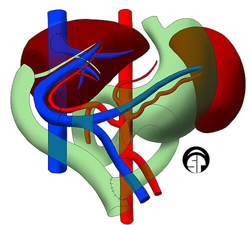

# TRANSPLANTE HEPÁTICO

O transplante hepático é, sem dúvida, um dos temas mais complexos e fascinantes da cirurgia moderna. Para a sua prova de residência, você não precisa ser um cirurgião de transplante, mas precisa entender a lógica de quem indica, quem prioriza e quem maneja as complicações. No Brasil, somos uma potência nessa área: realizamos o segundo maior número de transplantes de fígado do mundo em números absolutos, perdendo apenas para os EUA.

Se você entender que o transplante é a substituição de um órgão falido por um funcional, mas que isso traz um "preço" (imunossupressão e complicações cirúrgicas), você já começa na frente. Vamos dissecar esse tema focando no que as bancas realmente cobram.

## Anatomia Cirúrgica Aplicada ao Transplante

Antes de falarmos de indicação, precisamos saber o que estamos operando. O fígado não é apenas um bloco de tecido; ele é dividido funcionalmente.

A divisão anatômica clássica (lobo direito e esquerdo pelo ligamento falciforme) é inútil para o cirurgião. O que cai em prova é a **Linha de Cantlie**. Esta linha imaginária passa pela fossa da vesícula biliar até a veia cava inferior (seguindo a veia hepática média). Ela divide o fígado em lobo direito e esquerdo funcionais.

Outro ponto anatômico que vira e mexe aparece é a **Linha de Arantius** (ligamento venoso), importante para a mobilização do órgão.

### Vascularização: O Calcanhar de Aquiles

O fígado tem suprimento duplo:

- **Veia Porta:** Fornece cerca de 75% do fluxo sanguíneo e 50% do oxigênio.

- **Artéria Hepática:** Fornece 25% do fluxo e 50% do oxigênio.

**Por que isso importa?** Porque as vias biliares dependem quase exclusivamente da artéria hepática para sua irrigação. Se houver uma trombose de artéria hepática no pós-operatório, o que vai sofrer primeiro? A via biliar. Guarde isso: trombose arterial = necrose biliar/estenose biliar.

*Figura 1 - Estetoscópio, símbolo da prática médica e da avaliação hepatológica pré-transplante. Fonte: Domínio Público | Wikimedia Commons*

## Indicações: Quem precisa do transplante?

O transplante é indicado quando a sobrevida estimada com o tratamento clínico é menor do que a sobrevida pós-transplante (geralmente quando a sobrevida em 1 ano é < 90%).

### 1. Cirrose Hepática (Doença Hepática Terminal)

É a indicação mais comum em adultos. No Brasil, as principais etiologias são:

- Hepatites Virais (HBV e HCV).

- Doença Hepática Alcoólica (exige-se, por norma técnica, 6 meses de abstinência comprovada).

- Esteato-hepatite não alcoólica (NASH) – a indicação que mais cresce no mundo.

- Doenças Colestáticas: Colangite Esclerosante Primária (CEP) e Cirrose Biliar Primária (CBP).

### 2. Hepatite Fulminante (Insuficiência Hepática Aguda Grave)

Aqui o tempo é músculo (ou melhor, hepatócito). O paciente era hígido e, em menos de 8 semanas, desenvolve encefalopatia e coagulopatia grave (RNI > 1,5). As causas comuns são intoxicação por paracetamol, hepatites virais agudas e hepatite autoimune fulminante.

### 3. Carcinoma Hepatocelular (CHC)

O transplante é a melhor opção para o CHC porque trata o tumor e a cirrose subjacente. Mas atenção: não transplantamos qualquer tumor. Usamos os **Critérios de Milão**, que você deve decorar como se fosse seu nome:

- Nódulo único ≤ 5 cm.

- OU até 3 nódulos, cada um ≤ 3 cm.

- Ausência de invasão vascular ou doença extra-hepática.

### 4. Indicações Pediátricas

A **Atresia de Vias Biliares** é a indicação número 1 em crianças no mundo todo. Geralmente, tenta-se primeiro a cirurgia de Kasai (portoenterostomia), mas se falhar ou se a criança já chegar com cirrose avançada, o transplante é o caminho. Outras causas incluem erros inatos do metabolismo (como a deficiência de alfa-1-antitripsina e doença de Wilson).

*Figura 2 - Profissional de saúde em atendimento, representando a avaliação e priorização do transplante hepático. Fonte: National Cancer Institute, Domínio Público | Wikimedia Commons*

## Avaliação de Gravidade e Priorização

Antigamente, usávamos apenas o Child-Pugh. O problema? Ele é subjetivo (ascite e encefalopatia dependem do examinador). Hoje, para a lista de espera, usamos o **MELD**.

### Escore Child-Pugh

Avalia o prognóstico da cirrose.

- **Componentes:** Bilirrubina, Albumina, RNI (INR), Ascite e Encefalopatia.

- **Pontuação:** 5-6 (A), 7-9 (B), 10-15 (C).

- *Dica de prova:* O Child-Pugh NÃO é usado para priorização na lista de transplante no Brasil, mas sim para avaliar reserva funcional.

### Escore MELD (Model for End-Stage Liver Disease)

É uma fórmula matemática que prediz a mortalidade em 3 meses.

- **Componentes:** Creatinina, Bilirrubina e RNI (INR).

- *Nota:* No Brasil, desde 2017, usamos o **MELD-Na**, que inclui o Sódio, pois a hiponatremia é um marcador independente de mortalidade na cirrose.

- *Erro comum:* Achar que Albumina entra no MELD. Não entra!

### Situações Especiais (MELD Excepcional)

Alguns pacientes têm doenças graves que o MELD não consegue captar (o MELD é baixo, mas o risco de morte é alto). Nesses casos, atribuímos uma pontuação fixa. Exemplos:

- Carcinoma Hepatocelular (dentro de Milão).

- Síndrome Hepatopulmonar.

- Doenças metabólicas familiares (como a Polineuropatia Amiloidótica Familiar).

## Contraindicações: Quando NÃO transplantar?

Isso cai muito. Você precisa diferenciar o que é proibitivo do que é apenas um desafio.

### Contraindicações Absolutas

- **Infecção sistêmica não controlada (Sepse):** Se você imunossuprimir um paciente séptico, ele morre.

- **Neoplasia extra-hepática maligna recente ou metastática:** O transplante não vai curar o paciente se ele tiver um câncer de pulmão avançado.

- **Abuso ativo de substâncias (álcool ou drogas):** O paciente precisa demonstrar adesão.

- **Doença cardiopulmonar grave e irreversível:** O paciente não aguentaria o estresse cirúrgico (a fase de reperfusão é um caos hemodinâmico).

- **Morte encefálica ou dano cerebral irreversível.**

- **Colangiocarcinoma:** Historicamente é contraindicação absoluta devido à altíssima taxa de recorrência (exceto em protocolos de pesquisa muito específicos com quimiorradioterapia prévia).

### Contraindicações Relativas

- **Idade > 65 anos:** Não é proibitivo. Avaliamos a "idade biológica".

- **HIV+:** Antigamente era absoluta. Hoje, se a carga viral for indetectável e o CD4 estiver bom, transplantamos normalmente.

- **Trombose de veia porta:** Se for parcial, o cirurgião consegue fazer uma trombectomia ou ponte. Se for total e extensa, pode inviabilizar a técnica.

## O Processo de Doação e a Cirurgia

O doador padrão é aquele com morte encefálica confirmada. O **Doador Efetivo** é o termo usado quando a cirurgia de captação é iniciada.

### Modalidades de Transplante

- **Ortotópico:** É o padrão. Retira-se o fígado doente e coloca-se o novo no mesmo lugar.

- **Split Liver (Fígado Bipartido):** O fígado de um doador cadáver é dividido (geralmente lobo esquerdo para uma criança e lobo direito para um adulto). Isso otimiza o órgão.

- **Intervivos:** Um doador vivo (geralmente parente) doa um segmento (lobo esquerdo para criança ou direito para adulto). O fígado tem uma capacidade de regeneração fantástica e volta ao tamanho original em semanas.

- **Multivisceral:** Transplante em bloco de estômago, duodeno, pâncreas, intestino delgado e fígado. Indicado em falência intestinal associada à falência hepática.

### A Técnica Cirúrgica e a Reperfusão

A cirurgia tem três fases: hepatectomia (retirada), fase anepática e fase de reperfusão.
A reperfusão é o momento crítico. Quando o sangue volta a circular no enxerto novo, pode haver liberação de potássio e citocinas, causando arritmias e instabilidade. Como o Dr. Will sempre enfatiza no MedEvo, o anestesista de transplante é um herói, pois maneja esse "caos" hemodinâmico em tempo real.

## Complicações Pós-Operatórias

Aqui é onde as bancas fazem a festa. Vamos dividir por tempo e tipo.

### 1. Não Funcionamento Primário do Enxerto (Primary Non-Function - PNF)

É a falência catastrófica do fígado logo após o transplante. O paciente apresenta acidose, coagulopatia severa e hipoglicemia. As transaminases sobem aos milhares (TGO/TGP > 5.000).

- **Conduta:** Re-transplante de urgência. É a única salvação.

### 2. Complicações Vasculares

- **Trombose de Artéria Hepática (TAH):** Mais comum em crianças. No adulto, suspeitamos se houver aumento súbito de transaminases ou febre (por microabscessos biliares). Lembra que eu disse que a via biliar depende da artéria? Pois é, a TAH causa necrose biliar.

- **Trombose de Veia Porta:** Menos comum, manifesta-se com sinais de hipertensão portal súbita (ascite, sangramento).

### 3. Complicações Biliares

São as "feridas que não cicatrizam" do transplante.

- **Estenose de anastomose:** Geralmente tardia. Trata-se com CPRE (dilatação e stent).

- **Fístula biliar:** Geralmente precoce.

### 4. Rejeição

- **Rejeição Celular Aguda:** Muito comum (ocorre em até 30-50% dos casos), geralmente nos primeiros 5 a 14 dias. O diagnóstico é por **Biópsia Hepática**. O tratamento é feito com "pulsoterapia" de corticoides. Não se desesperem: a rejeição aguda no fígado é muito mais fácil de tratar do que no rim ou coração.

- **Rejeição Crônica (Ductopênica):** Perda progressiva dos ductos biliares. Mais rara hoje em dia, mas muitas vezes leva à perda do enxerto.

### 5. Infecções

- **Primeiro mês:** Infecções bacterianas e fúngicas relacionadas à cirurgia (ferida operatória, pneumonia, ITU).

- **1º ao 6º mês:** Infecções oportunistas (Citomegalovírus - CMV é a principal, Herpes, Pneumocistose).

- **Após 6 meses:** Infecções comunitárias.

## Manejo da Cirrose como Ponte para o Transplante

Muitas questões não perguntam da cirurgia em si, mas do manejo do paciente que está esperando.

### Sangramento Varicoso

Se o paciente tem varizes de esôfago e sangra, a primeira linha é estabilização + endoscopia (ligadura elástica) + somatostatina/terlipressina. Se refratário, o **TIPS** (Shunt Portossistêmico Intra-hepático Transjugular) entra como uma excelente "ponte" para o transplante. Ele reduz a pressão portal sem a morbidade de uma cirurgia de shunt aberta.

### Síndrome Hepatorrenal (SHR)

É a insuficiência renal funcional devido à vasoconstrição renal extrema.

- **Tratamento:** Albumina + Terlipressina.

- Se não melhorar, o transplante de fígado é o tratamento definitivo. Se o paciente estiver em diálise por muito tempo (> 4-6 semanas), pode-se indicar o transplante duplo (Fígado + Rim).

| Parâmetro | Child-Pugh | MELD |
| --- | --- | --- |
| **Bilirrubina** | Sim | Sim |
| **RNI (INR)** | Sim | Sim |
| **Creatinina** | Não | Sim |
| **Albumina** | Sim | Não |
| **Ascite** | Sim | Não |
| **Encefalopatia** | Sim | Não |
| **Sódio** | Não | Sim (MELD-Na) |

## O Carcinoma Hepatocelular e o Transplante

Este é um tópico "quente". Por que usamos os Critérios de Milão? Porque se o tumor for maior que isso, o risco de ele já ter micrometástases é muito alto, e a imunossupressão do transplante faria o tumor "explodir" no pós-operatório.

**Critérios de Milão (Revisão):**

- Nódulo único ≤ 5 cm.

- Até 3 nódulos, cada um ≤ 3 cm.

Se o paciente está "fora de Milão" (ex: um nódulo de 6 cm), podemos tentar o **Downstaging**. Usamos terapias locorregionais (como a Quimioembolização - TACE) para reduzir o tumor. Se ele entrar nos critérios de Milão e ficar estável por alguns meses, ele pode ser listado.

## Pontos-Chave para Prova

- **Pioneiro:** Thomas Starzl é o pai do transplante de fígado. Joseph Murray fez o primeiro de rim e Christiaan Barnard o primeiro de coração.

- **MELD:** Decore os componentes: Creatinina, Bilirrubina e RNI. É o que dita a fila. Albumina NÃO entra no MELD.

- **Atresia Biliar:** Principal indicação pediátrica. Kasai é a cirurgia inicial.

- **Critérios de Milão:** 1 nódulo < 5cm ou 3 < 3cm. Essencial para CHC.

- **Contraindicação Absoluta:** Sepse, câncer extra-hepático metastático, abuso ativo de álcool, colangiocarcinoma (regra geral).

- **HIV:** Não é mais contraindicação absoluta.

- **TIPS:** Ótima ponte para transplante em sangramento varicoso refratário ou ascite refratária. Se o paciente com TIPS voltar a sangrar, suspeite de disfunção/obstrução do stent.

- **Artéria Hepática:** Sua trombose causa necrose de via biliar. É a complicação vascular mais temida.

- **Não Funcionamento Primário:** Única solução é re-transplante imediato.

- **Rejeição Aguda:** Diagnóstico é por biópsia. Tratamento é corticoide (pulsoterapia).

- **Linha de Cantlie:** Divide o fígado em lobos funcionais direito e esquerdo (passa pela vesícula e veia cava).

- **Doador Efetivo:** Quando começa a cirurgia de retirada dos órgãos.

- **Split Liver:** Um fígado para dois receptores (geralmente um adulto e uma criança).

- **Imunossupressão:** A adesão é mandatória. Falha de adesão documentada é contraindicação ao transplante.

- **Idade:** > 65 anos é contraindicação relativa, não absoluta.

- **Metástases:** Tumores metastáticos para o fígado são contraindicação, com exceção de protocolos muito específicos para tumores neuroendócrinos (raro em prova). 🩺

 Cópia offline para consulta pessoal.
 Fonte original:
 [https://www.medevo.com.br/material-apoio/ler/eb6f2098-d664-46f6-a94d-e998e9d9b8ce](https://www.medevo.com.br/material-apoio/ler/eb6f2098-d664-46f6-a94d-e998e9d9b8ce)
