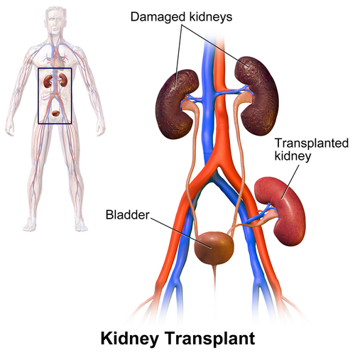
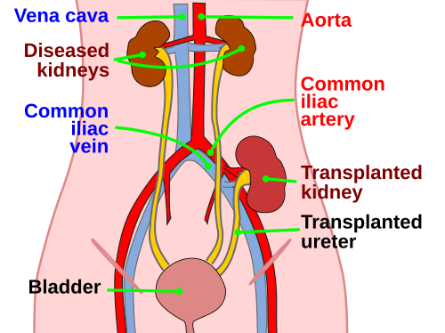

# TRANSPLANTE RENAL

O transplante renal é o tratamento padrão-ouro para a Doença Renal Crônica (DRC) terminal. Por que dizemos isso? Porque, comparado à diálise, o transplante oferece não apenas uma melhor qualidade de vida, mas uma sobrevida significativamente maior. Em pacientes diabéticos, por exemplo, a mortalidade em diálise é drasticamente superior àquela observada após um transplante bem-sucedido. Como professor, vejo muitos alunos focarem apenas na técnica cirúrgica, mas a prova de residência vai te cobrar desde a seleção ética do doador até o manejo de complicações tardias.

## Avaliação do Receptor e Indicações

O candidato ao transplante é aquele paciente com DRC em estágio G5 (Ritmo de Filtração Glomerular < 15 ml/min/1,73m²) ou em estágio G4 (RFG < 20 ml/min) com progressão rápida ou complicações.

Um ponto que o Dr. Will sempre enfatiza nas discussões clínicas: o transplante pode ser **preventivo** (preemptivo), ou seja, realizado antes mesmo de o paciente iniciar a diálise. Isso é o ideal, pois evita as complicações cardiovasculares e infecciosas inerentes ao acesso dialítico.

### Contraindicações: Onde as bancas moram

Aqui você não pode errar. As bancas adoram confundir contraindicações absolutas com relativas.

**Contraindicações Absolutas:**

- **Neoplasia maligna ativa:** Com alto risco de recorrência ou metástases. O tempo de espera após o tratamento de um câncer varia (geralmente 2 a 5 anos), mas se a doença está ativa, o transplante é proibido. Exceção: alguns tumores de pele não melanoma ou carcinomas in situ.

- **Infecção ativa não controlada:** Você não vai imunossuprimir alguém que está combatendo uma sepse ou uma tuberculose ativa.

- **Abuso ativo de drogas ou álcool:** Esta é uma pérola clássica. O uso ativo é contraindicação absoluta devido ao risco altíssimo de não adesão ao tratamento e complicações infecciosas.

- **Doença cardíaca ou pulmonar grave e descompensada:** Se o paciente não aguenta o estresse cirúrgico ou tem uma expectativa de vida menor que 2 anos, o transplante não trará benefício.

- **HIV com carga viral detectável ou doença definidora de AIDS ativa:** (Embora o transplante em HIV positivo seja possível hoje, ele exige controle rigoroso).

**Contraindicações Relativas (Zonas Cinzentas):**

- **Distúrbios psiquiátricos:** Atenção! Não são contraindicação absoluta. Se o paciente tiver suporte social e a doença estiver controlada, ele pode ser transplantado. O problema é a adesão.

- **Anormalidades anatômicas do trato urinário:** Muitas vezes precisam ser corrigidas antes (ex: bexiga neurogênica).

## O Doador: Vivo vs. Falecido

A legislação brasileira é rigorosa. O doador vivo deve ser maior de idade, juridicamente capaz e, preferencialmente, parente até quarto grau. Se não for parente, é necessária autorização judicial e ética para evitar o comércio de órgãos.

### Critérios de Seleção do Doador Vivo

O princípio fundamental aqui é a **segurança do doador**. Não podemos transformar uma pessoa saudável em um doente renal.

- **Diabetes Mellitus Tipo 2:** É uma contraindicação ABSOLUTA para doação. Por quê? Porque o doador terá apenas um rim para o resto da vida, e o DM é a principal causa de DRC no mundo. O risco de ele desenvolver nefropatia diabética no rim remanescente é inaceitável.

- **Hipertensão Arterial:** Geralmente é contraindicação, a menos que seja leve, controlada com um único fármaco e sem lesão de órgão-alvo.

- **IMC > 40 (Obesidade grau III):** Contraindicação absoluta.

- **DPOC:** Cuidado aqui! A DPOC isolada, se leve e com função pulmonar preservada para a anestesia, **NÃO** é contraindicação absoluta para doação de rim inter vivos. As bancas usam isso para te induzir ao erro, comparando com o IMC ou DM.

### A Escolha do Rim: Anatomia Vascular

Na hora da nefrectomia do doador vivo, qual rim escolhemos?
**Regra de ouro:** Deixamos o melhor rim com o doador e levamos o rim com anatomia mais simples para o receptor.

Se os dois rins forem iguais, a preferência é pelo **rim esquerdo**.
**O motivo cai em prova:** A veia renal esquerda é significativamente mais longa que a direita (pois precisa cruzar a aorta para chegar à veia cava). Uma veia mais longa facilita imensamente a anastomose vascular no receptor.

| Característica | Rim Esquerdo | Rim Direito |
| --- | --- | --- |
| **Veia Renal** | Longa (cruza a aorta) | Curta |
| **Artéria Renal** | Curta | Longa (passa atrás da cava) |
| **Preferência** | Geralmente preferido para doação | Segunda opção |

*Figura 1 - Estetoscópio, símbolo da prática médica e da nefrologia no contexto do transplante renal. Fonte: Domínio Público | Wikimedia Commons*

## A Cirurgia de Transplante

Diferente do que o leigo pensa, o transplante renal é **heterotópico**. Não retiramos os rins nativos do paciente (a menos que haja infecção recorrente, rins policísticos gigantes ou hipertensão maligna). O novo rim é colocado na **fossa ilíaca** (geralmente a direita, por ser mais superficial e ter vasos ilíacos mais acessíveis).

### Anastomoses Vasculares

O cirurgião conecta os vasos do enxerto aos vasos ilíacos do receptor.

- **Veia:** Geralmente na veia ilíaca externa.

- **Artéria:** Pode ser na artéria ilíaca externa (técnica término-lateral) ou na **artéria ilíaca interna** (técnica término-terminal).
*Dica de prova:* A anastomose na artéria ilíaca interna costuma apresentar menor índice de estenose devido ao melhor fluxo e compatibilidade de calibre em alguns cenários.

### Reconstrução Urinária

O ureter do enxerto precisa ser conectado à bexiga do receptor. A técnica padrão-ouro é a **ureteroneocistostomia** (técnica de Lich-Gregoir).
Nesta técnica, cria-se um túnel submucoso na bexiga para implantar o ureter, o que funciona como uma válvula antirrefluxo, protegendo o enxerto de infecções urinárias ascendentes.

*Figura 2 - Profissional de saúde em atendimento, representando o acompanhamento pós-transplante renal. Fonte: National Cancer Institute, Domínio Público | Wikimedia Commons*

## Imunossupressão e Rejeição

O sucesso do transplante depende do equilíbrio entre evitar a rejeição e não causar toxicidade ou infecções oportunistas.

### Esquema Clássico

Geralmente composto por um "tripé":

- **Inibidor de Calcineurina:** Tacrolimus (primeira escolha) ou Ciclosporina.

- **Antiproliferativo:** Micofenolato de mofetila ou Azatioprina.

- **Corticoide:** Prednisona (com desmame gradual).

**Atenção à Nefrotoxicidade:** Os inibidores de calcineurina (especialmente a ciclosporina) podem causar nefrotoxicidade crônica. Isso é uma pegadinha comum: o remédio que protege o rim da rejeição pode, ao mesmo tempo, causar fibrose e perda de função. O diagnóstico diferencial com a rejeição crônica é difícil e muitas vezes exige biópsia.

### Tipos de Rejeição

- **Hiperaguda:** Ocorre em minutos/horas. Causada por anticorpos pré-formados (anti-HLA ou ABO). O rim "trombosa" na mesa de cirurgia. Tratamento: Nefrectomia do enxerto (perda total).

- **Aguda:** Ocorre após os primeiros 5-7 dias até meses. Pode ser celular (linfócitos T) ou humoral (anticorpos). Suspeita-se por aumento da creatinina e queda da diurese.

- **Crônica:** Perda progressiva da função ao longo de anos.

## Complicações Pós-Transplante

O pós-operatório exige vigilância. Não ache que a única forma de complicação é a parada da urina (oligúria). Muitas vezes o paciente mantém diurese, mas a creatinina sobe.

### Complicações Cirúrgicas e Vasculares

- **Trombose da Veia ou Artéria Renal:** É uma emergência. Geralmente ocorre nas primeiras 48h. O paciente apresenta dor súbita no enxerto e interrupção da diurese.

- **Linfocele:** É a complicação linfática mais comum. Imagine o cenário: paciente 3 a 6 semanas após o transplante, apresenta uma **massa fluida septada perirrenal** na ultrassonografia, mas a função renal está estável. Isso é linfocele. Se for grande e comprimir o ureter ou vasos, precisa de drenagem (fenestração para o peritônio).

- **Estenose da Artéria Renal:** Causa hipertensão arterial de difícil controle e piora da função renal, especialmente após o uso de IECA.

### Complicações Infecciosas

A infecção por **Citomegalovírus (CMV)** é a mais importante no primeiro ano. Ocorre geralmente entre o 1º e o 6º mês. Manifesta-se com febre, leucopenia, plaquetopenia e pode atingir órgãos (hepatite, esofagite, pneumonia).

### O Papel da Ultrassonografia Doppler

O Doppler é o exame de primeira linha no pós-operatório. Ele avalia:

- Patência dos vasos (exclui trombose).

- **Índice de Resistência (IR):** Se o IR estiver alto (> 0.8), sugere sofrimento do enxerto (seja por rejeição, necrose tubular aguda ou obstrução). É fundamental para o prognóstico.

## Situações Especiais e Transplante de Pâncreas

### Transplante Rim-Pâncreas

Indicado principalmente para pacientes com **Diabetes Mellitus Tipo 1** e DRC terminal. O objetivo é curar a falência renal e tornar o paciente insulino-independente.

- **Pérola de prova:** A causa não imunológica mais comum de falência do enxerto pancreático é a **trombose do enxerto**. O pâncreas é um órgão de baixo fluxo, o que predispõe a coágulos.

### Transplante ABO Incompatível

Antigamente era proibido. Hoje, com protocolos de dessensibilização (plasmaférese e rituximabe), é possível realizar, embora o risco de rejeição humoral seja maior.

### Recorrência de Doenças

Algumas doenças podem voltar no rim transplantado. O Lúpus (LES), curiosamente, tem uma taxa de recorrência baixa no enxerto, e quando ocorre, raramente leva à perda do rim. Já a GEFS (Glomeruloesclerose Segmentar e Focal) tem alta taxa de recorrência.

### Anemia Aplásica e TCTH

Uma questão que costuma aparecer misturada com transplante de órgãos: se você tem um paciente com **Anemia Aplásica Grave** e um doador HLA compatível, o tratamento de escolha não é droga imunossupressora, mas sim o **Transplante de Células Tronco Hematopoiéticas (TCTH)**. No MedEvo, sempre lembramos que o TCTH é curativo para a falência medular.

## Diagnóstico Diferencial de Oligúria Pós-Transplante

Se o paciente para de urinar logo após a cirurgia, você deve pensar em escada:

- **Causa Pré-renal:** Hipovolemia (o paciente sangrou? está desidratado?).

- **Causa Renal:** Necrose Tubular Aguda (comum em doador falecido devido ao tempo de isquemia fria) ou Trombose de vasos.

- **Causa Pós-renal:** Obstrução do cateter de Foley ou obstrução do ureter (coágulo ou estenose).

## Pontos-Chave para Prova

- **Doador Vivo:** Diabetes Mellitus Tipo 2 é contraindicação **ABSOLUTA**. DPOC não é necessariamente contraindicação.

- **Preferência Anatômica:** Rim esquerdo é preferido pela veia renal mais longa, facilitando a técnica cirúrgica.

- **Contraindicação Absoluta Receptor:** Abuso ativo de drogas/álcool e neoplasia maligna ativa.

- **Reconstrução Urinária:** O padrão é a **ureteroneocistostomia** (ureter do doador na bexiga do receptor).

- **Linfocele:** Massa fluida septada perirrenal, geralmente semanas após a cirurgia, com função renal preservada.

- **Trombose de Enxerto Pancreático:** Principal causa não imunológica de perda do pâncreas transplantado.

- **Anastomose Arterial:** A artéria ilíaca interna é uma excelente opção para reduzir taxas de estenose.

- **Mortalidade:** Pacientes diabéticos em diálise morrem muito mais do que os transplantados. O transplante é protetor.

- **Órgãos vs. Tecidos:** Órgãos (Fígado, Pâncreas, Rim, Intestino). Tecidos (Córnea/Esclera, Pele, Osso, Válvulas cardíacas).

- **Ciclosporina:** Pode causar nefrotoxicidade crônica que mimetiza a rejeição crônica.

- **Doppler Renal:** Essencial para avaliar o índice de resistência e a patência vascular no pós-operatório imediato.

- **HIV:** Não é mais contraindicação absoluta, desde que a carga viral esteja indetectável e o CD4 adequado.

- **Lúpus:** A recorrência no enxerto é rara e geralmente apresenta bom prognóstico.

- **ß-2-microglobulina:** Níveis elevados podem indicar rejeição ou falência do enxerto, mas não são específicos.

- **Ética:** A segurança do doador vivo é sempre a prioridade máxima sobre a necessidade do receptor. 💉

 Cópia offline para consulta pessoal.
 Fonte original:
 [https://www.medevo.com.br/material-apoio/ler/336ab93b-e9eb-4efc-98e2-ad9842abb18d](https://www.medevo.com.br/material-apoio/ler/336ab93b-e9eb-4efc-98e2-ad9842abb18d)
