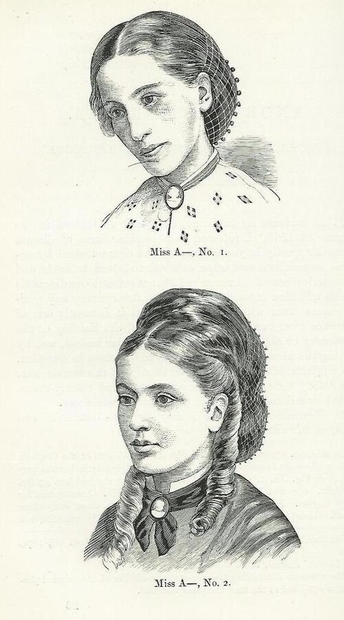

# TRANSTORNOS ALIMENTARES

Para entender os transtornos alimentares (TA), você precisa tirar da cabeça a ideia de que eles são apenas "problemas de vaidade". Na prova de residência e na vida prática, você deve encarar essas patologias como distúrbios psiquiátricos graves com repercussões endócrinas e metabólicas severas.

O cerne da questão aqui é a relação patológica com a comida e a distorção da imagem corporal. Como professor, vejo muitos alunos confundirem os subtipos. O segredo para não errar é olhar para dois fatores: o **IMC** e o **comportamento compensatório**. Se o IMC está baixo, pense primeiro em Anorexia. Se o IMC está normal ou alto e há purgação, pense em Bulimia.

*Figura 1 - Fotografia histórica de paciente com anorexia nervosa (Miss A), publicada por Sir William Gull em 1873. Fonte: Domínio Público | Wikimedia Commons*

## Anorexia Nervosa (AN)

A Anorexia Nervosa é marcada por uma tríade clássica que você deve procurar no enunciado da questão: restrição da ingestão energética, medo intenso de ganhar peso e perturbação da percepção da própria imagem.

### Critérios Diagnósticos (DSM-5-TR)

Não basta o paciente querer ser magro. Para o diagnóstico de AN, segundo os critérios que as bancas adoram cobrar, exigimos:

- **Restrição da ingestão calórica:** Levando a um peso corporal significativamente baixo para a idade, gênero e desenvolvimento. No adulto, usamos o IMC < 18,5 kg/m². Em crianças e adolescentes, usamos o percentil do IMC (geralmente < percentil 5).

- **Medo intenso de ganhar peso:** Ou comportamento persistente que interfere no ganho de peso, mesmo estando com peso muito baixo.

- **Distorção da imagem corporal:** A pessoa se olha no espelho e se vê gorda, ou nega a gravidade do baixo peso atual.

**Dica de Prova:** Antigamente, a amenorreia era critério obrigatório. **Hoje não é mais.** Um homem pode ter anorexia, ou uma mulher que ainda menstrua (embora seja raro no baixo peso extremo) também pode receber o diagnóstico.

### Subtipos da Anorexia

Existem dois tipos, e a banca vai tentar te confundir com a Bulimia:

- **Tipo Restritivo:** O paciente perde peso puramente por dieta, jejum ou exercício excessivo. Não há episódios de compulsão ou purgação nos últimos 3 meses.

- **Tipo Compulsivo/Purgativo:** O paciente apresenta episódios de compulsão alimentar seguidos de purgação (vômitos, laxantes, diuréticos).

**Atenção aqui:** "Professor, se ele purga, por que não é Bulimia?". A resposta é o **PESO**. Se o IMC for baixo (< 18,5), o diagnóstico de Anorexia Nervosa tipo Purgativo "atropela" o de Bulimia. Guarde isso: Anorexia ganha da Bulimia no critério peso.

### Fisiopatologia e Endocrinologia da Anorexia

Por que o corpo para de funcionar? Imagine que o organismo entra em "modo de economia de energia". Como o Dr. Will costuma enfatizar em suas discussões clínicas no MedEvo, o corpo sacrifica funções não essenciais para manter o cérebro e o coração batendo.

- **Eixo Hipotálamo-Hipófise-Gonadal:** Ocorre uma supressão do hormônio liberador de gonadotrofina (GnRH). Resultado: ↓ LH, ↓ FSH e ↓ Estradiol/Testosterona. É a chamada **Amenorreia Hipotalâmica Funcional**. O corpo entende que não tem energia para sustentar uma gestação.

- **Eixo Adrenal (HHA):** O estado de inanição é um estresse crônico. Isso leva a um **aumento do Cortisol**. Se a questão mostrar um paciente com baixo peso e cortisol alto, não pense logo em Cushing; pense no estresse metabólico da anorexia.

- **Eixo Tireoidiano:** Ocorre a "Síndrome do Eutireoidiano Doente". O corpo diminui a conversão de T4 em T3 (que é o hormônio metabolicamente ativo) para reduzir o gasto basal. Você verá T3 baixo, mas o TSH geralmente está normal.

- **Hormônio do Crescimento (GH):** Curiosamente, o GH costuma estar **elevado**, mas há uma resistência periférica a ele, resultando em níveis baixos de IGF-1.

### Quadro Clínico e Exame Físico

O exame físico da Anorexia é uma aula de semiologia da desnutrição. Procure por:

- **Lanugo:** Pelos finos e macios que crescem no tronco e braços (tentativa do corpo de manter o calor).

- **Bradicardia e Hipotensão:** O coração "encolhe" (atrofia miocárdica) e bate mais devagar para poupar energia.

- **Pele seca e amarelada:** Pela hipercarotinemia (o fígado não consegue processar o caroteno).

- **Edema periférico:** Por hipoalbuminemia ou realimentação.

| Gravidade da AN (Adultos) | IMC (kg/m²) |
| --- | --- |
| Leve | ≥ 17 |
| Moderada | 16 – 16,99 |
| Grave | 15 – 15,99 |
| Extrema | < 15 |

*Figura 2 - Estetoscópio, símbolo da prática médica e do acompanhamento clínico dos transtornos alimentares. Fonte: Domínio Público | Wikimedia Commons*

## Bulimia Nervosa (BN)

Na Bulimia, o cenário é diferente. O paciente geralmente tem peso normal ou sobrepeso (IMC > 18,5). O ciclo aqui é: **Compulsão → Culpa/Medo → Compensação**.

### Critérios Diagnósticos

- **Episódios de Compulsão Alimentar (Binge Eating):** Comer uma quantidade de comida definitivamente maior do que a maioria das pessoas comeria em um período curto (ex: 2 horas), com sensação de perda de controle.

- **Comportamentos Compensatórios Inadequados:** Vômitos induzidos (mais comum), uso de laxantes, diuréticos, jejuns prolongados ou exercício físico vigoroso/compulsivo.

- **Frequência:** Pelo menos **1 vez por semana por 3 meses**.

- **Autoavaliação:** Excessivamente influenciada pelo peso e forma corporal.

### O Sinal de Russell e outras Pérolas

O paciente com Bulimia costuma esconder o transtorno por anos, pois não há o baixo peso gritante da Anorexia. Você precisa ser um detetive clínico.

- **Sinal de Russell:** Calosidades ou cicatrizes no dorso da mão (especialmente nas articulações metacarpofalângicas) causadas pelo atrito dos dentes ao induzir o vômito. É uma "bandeira vermelha" clássica em provas.

- **Erosão do esmalte dentário (Perimólise):** O ácido gástrico destrói a face lingual dos dentes.

- **Hipertrofia de Parótidas:** A estimulação constante das glândulas salivares pelo vômito causa uma sialadenose bilateral, deixando o rosto com aspecto "fofinho" apesar do corpo magro.

### Distúrbios Hidroeletrolíticos na Purgação

Isso cai muito em Clínica Médica. O que acontece com quem vomita muito?

- **Alcalose Metabólica Hipoclorêmica e Hipocalêmica:** Perde-se H+ e Cl- no vômito. O rim tenta compensar retendo sódio e excretando potássio.

- **Hipocalemia:** É a alteração mais perigosa, podendo levar a arritmias e parada cardíaca.

**Cuidado:** Se o paciente usa laxantes em vez de vomitar, ele pode ter **Acidose Metabólica** (perda de bicarbonato nas fezes), mas a hipocalemia permanece.

## Transtorno de Compulsão Alimentar (TCA)

Muitos alunos acham que TCA e Bulimia são a mesma coisa. **Não são.**
No TCA, o paciente tem os episódios de compulsão (comer demais, rápido, até se sentir desconfortavelmente cheio, comer escondido), mas **NÃO faz compensação**.

- Não há vômito, não há laxante, não há exercício excessivo.

- Resultado: O paciente com TCA geralmente apresenta obesidade.

- Critério temporal: 1 vez por semana por 3 meses.

## Diagnóstico Diferencial: A Amenorreia Hipotalâmica

Imagine uma paciente atleta, maratonista, que chega com amenorreia há 6 meses. O IMC é 19 (limite inferior da normalidade). Ela não tem medo de engordar, ela apenas treina muito e come "limpo" demais.

Isso é **Amenorreia Hipotalâmica Funcional**. A diferença para a Anorexia é a ausência da psicopatologia (a distorção da imagem e o medo patológico do peso). No entanto, o tratamento clínico é semelhante: aumentar o aporte calórico e reduzir o estresse físico.

## Tratamento: Onde a maioria erra na prova

O tratamento dos TAs é multidisciplinar (Psiquiatra, Psicólogo, Nutricionista e Clínico/Nutrólogo). Mas vamos focar no que a banca quer: condutas e drogas.

### Tratamento da Anorexia Nervosa

- **Primeira Linha:** Psicoterapia (Terapia Cognitivo-Comportamental ou Terapia Familiar, especialmente em adolescentes).

- **Farmacoterapia:** Aqui está a pegadinha. **Não existe droga aprovada para tratar os sintomas nucleares da Anorexia.**

- Fluoxetina ajuda na Anorexia? Apenas se houver comorbidade (depressão/TOC) e **após a recuperação do peso**. No baixo peso, o ISRS não funciona bem porque não há substrato (triptofano) para produzir serotonina.

- Olanzapina (antipsicótico atípico): Pode ser usada "off-label" para ajudar no ganho de peso e reduzir a agitação/obsessividade com a comida.

### Tratamento da Bulimia Nervosa

- **Primeira Linha:** TCC + Reabilitação Nutricional.

- **Farmacoterapia:** Aqui os ISRS brilham.

- **Fluoxetina na dose de 60 mg/dia** é a única medicação aprovada pelo FDA e amplamente aceita para Bulimia. Note que a dose é maior que a da depressão (20mg).

- **Contraindicação Absoluta:** **Bupropiona**. Nunca use bupropiona em pacientes com Bulimia ou Anorexia purgativa. Por quê? Porque esses pacientes têm distúrbios eletrolíticos que reduzem o limiar convulsivo, e a bupropiona aumenta muito o risco de convulsões nessa população.

### Tratamento do Transtorno de Compulsão Alimentar (TCA)

- **TCC:** Padrão-ouro.

- **Lisdexamfetamina:** É a medicação de escolha e aprovada para casos moderados a graves de TCA. Ajuda a reduzir a impulsividade e a frequência dos episódios.

- **Topiramato:** Também pode ser usado para reduzir a compulsão e auxiliar na perda de peso.

| Transtorno | Primeira Escolha (Psi) | Farmacoterapia de Escolha |
| --- | --- | --- |
| Anorexia | Terapia Familiar / TCC | Olanzapina (se refratário/baixo peso) |
| Bulimia | TCC | Fluoxetina 60mg |
| Compulsão (TCA) | TCC | Lisdexamfetamina |

## Critérios de Internação Hospitalar

Este é o ponto onde o clínico geral e o pediatra são mais cobrados. Quando a Anorexia deixa de ser um tratamento ambulatorial e vira uma emergência médica?

Segundo a American Psychiatric Association (APA) e diretrizes brasileiras, os critérios para internação em enfermaria clínica (não psiquiátrica) são:

- **Instabilidade Hemodinâmica:** FC < 40 bpm, PA < 80/50 mmHg, Arritmias.

- **Desequilíbrio Eletrolítico Grave:** Hipocalemia, hipofosfatemia ou hipomagnesemia que não corrigem por via oral.

- **Peso Crítico:** Geralmente < 75% do peso ideal ou IMC < 14-15 kg/m².

- **Complicações Médicas:** Síncope, convulsões, insuficiência hepática ou renal.

- **Risco de Suicídio:** Ou falha total do tratamento ambulatorial.

## Síndrome de Realimentação (Refeeding Syndrome)

Se você decorar apenas uma coisa sobre complicações, que seja esta. É o erro mais grave que um médico pode cometer ao tratar um anoréxico grave.

**O que é:** Quando um paciente em desnutrição severa (estado catabólico) recebe uma carga súbita de glicose (carboidratos).
**O Porquê (Fisiopatologia):**

- A glicose entra no sangue → O pâncreas libera um pico de **Insulina**.

- A insulina é um hormônio anabólico. Ela "manda" a glicose, o potássio, o magnésio e, principalmente, o **Fósforo** para dentro das células.

- O fósforo extracelular, que já estava baixo (estoques depletados), despenca.

- Sem fósforo, não há ATP. Sem ATP, o coração para, o diafragma não contrai (insuficiência respiratória) e o paciente morre.

**Como evitar:** "Start low, go slow". Comece a dieta com poucas calorias (ex: 5-10 kcal/kg/dia) e monitore eletrólitos diariamente. A **Hipofosfatemia** é o marcador clássico da Síndrome de Realimentação.

## Complicações Cardíacas

A Anorexia mata principalmente por duas vias: suicídio e complicações cardíacas.
No ECG, você pode encontrar:

- Bradicardia sinusal (quase universal na AN grave).

- Aumento do intervalo QT (risco de Torsades de Pointes).

- Alterações de onda T e depressão de ST (por hipocalemia).

Lembre-se: o coração do anoréxico é pequeno e frágil. Fluidos em excesso na reidratação podem levar à insuficiência cardíaca congestiva rapidamente.

## Diagnóstico Diferencial Médico

Antes de fechar Transtorno Alimentar, o MedEvo recomenda sempre excluir causas orgânicas de perda de peso, especialmente se o quadro for atípico (início após os 30 anos, ausência de distorção de imagem):

- **Hipertireoidismo:** TSH baixo, perda de peso com apetite aumentado.

- **Diabetes Mellitus Tipo 1:** Polidipsia, poliúria e perda de peso.

- **Doença Celíaca / Doença de Crohn:** Má absorção e dor abdominal.

- **Neoplasias e Infecções Crônicas (HIV, TB):** Febre, sudorese noturna.

- **Depressão Maior:** Pode haver perda de apetite, mas não há o medo de engordar ou a distorção da imagem.

## Prognóstico

A Anorexia Nervosa tem a maior taxa de mortalidade entre todos os transtornos psiquiátricos. Cerca de 20% dos pacientes evoluem para a cronicidade, 50% recuperam-se totalmente e o restante mantém sintomas residuais. O diagnóstico precoce e a intervenção familiar em adolescentes são os melhores preditores de sucesso.

| Achado Laboratorial | Causa Provável no TA |
| --- | --- |
| ↑ Amilase Sérica | Vômitos recorrentes (estimulação das glândulas) |
| ↓ Potássio, ↓ Cloro | Purgação (vômitos ou diuréticos) |
| ↑ Colesterol Total | Comum na AN (mecanismo não totalmente claro) |
| ↓ LH / ↓ FSH | Supressão hipotalâmica pelo baixo peso |
| ↑ Ureia | Desidratação ou catabolismo proteico |

## Pontos-Chave para Prova 🧠

- **Anorexia vs. Bulimia:** O divisor de águas é o peso. IMC < 18,5 kg/m² com purgação ainda é Anorexia (tipo purgativo).

- **Sinal de Russell:** Calos no dorso da mão por indução de vômito. Patognomônico de comportamento purgativo.

- **Tratamento da Bulimia:** TCC é a base. O fármaco de escolha é a **Fluoxetina 60 mg/dia**.

- **Contraindicação Absoluta:** **Bupropiona** é proibida em transtornos alimentares pelo risco de convulsão.

- **Síndrome de Realimentação:** Ocorre pela liberação de insulina ao reintroduzir carboidratos. O principal eletrólito que cai é o **Fósforo**.

- **Amenorreia:** É do tipo hipotalâmica funcional (↓ GnRH, ↓ LH, ↓ FSH). Não é mais critério obrigatório para AN.

- **Cortisol na Anorexia:** Está **elevado** devido ao estresse crônico da inanição.

- **Bradicardia:** É um sinal de gravidade e critério de internação (FC < 40 bpm).

- **Transtorno de Compulsão Alimentar (TCA):** Há compulsão, mas **NÃO** há compensação. Tratamento com Lisdexamfetamina.

- **Idade de Início:** Geralmente adolescência. Início após os 30 anos deve acender o alerta para causas orgânicas ou depressão.

- **Exercício Compulsivo:** É considerado uma forma de comportamento compensatório, comum tanto na AN quanto na BN.

- **Distorção de Imagem:** É a falha no teste de realidade sobre o próprio corpo. Sem isso, o diagnóstico de AN fica prejudicado.

- **Potássio:** A hipocalemia é a alteração eletrolítica mais comum e perigosa em quem purga.

- **Manejo Inicial na AN Grave:** Estabilização clínica e correção lenta de eletrólitos antes de focar no ganho de peso agressivo.

- **Fluoxetina na Anorexia:** Só funciona após o paciente recuperar parte do peso (precisa de triptofano da dieta para agir).

- **Pegadinha de Prova:** A alternativa dirá que a paciente anoréxica tem hipotireoidismo. Falso! Ela tem **Síndrome do Eutireoidiano Doente** (T3 baixo, mas TSH normal).

 Cópia offline para consulta pessoal.
 Fonte original:
 [https://www.medevo.com.br/material-apoio/ler/e9ea9b2e-7520-43c6-88f3-deff0ab9581b](https://www.medevo.com.br/material-apoio/ler/e9ea9b2e-7520-43c6-88f3-deff0ab9581b)
